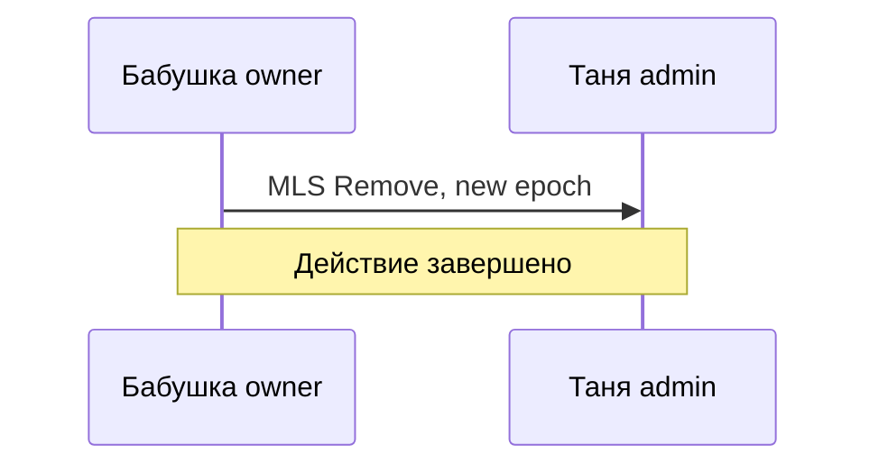

# Skill: backlog-task-format — правильная разметка backlog-task'ов

## Когда использовать

Триггеры:
- Создание нового task'а через `backlog task create` + последующее наполнение body.
- Backlog.md UI показывает «No description» хотя content есть в `.md` файле.
- Дописывание Implementation Plan / Implementation Notes / Final Summary к существующему task'у.
- Дописывание Verification Pending секции для post-merge gates.
- Recreate / merge task'ов после `backlog cleanup` или ручного редактирования.

Не использовать:
- Просто посмотреть существующий task — это `backlog task view`.
- Изменить frontmatter поля (status, priority, labels) — это `backlog task edit`.

## Принцип

Backlog.md UI **не парсит** произвольные `## Header` секции. Он распознаёт **только** содержимое внутри специфических **HTML comment markers** и нескольких именованных headers. Всё остальное игнорируется UI (но остаётся в файле, видно через `cat` / git).

**Источник правды** — структура файла `backlog/tasks/task-N - title.md`. UI Backlog.md = view, не writer.

## Канонический шаблон task-файла

```markdown
---
id: TASK-N
title: <human title>
status: Discussion | Draft | In Progress | Verification | Paused | Done
assignee: []
created_date: 'YYYY-MM-DD HH:MM'
updated_date: 'YYYY-MM-DD HH:MM'
labels:
  - phase-X
  - <area-1>
  - <area-2>
milestone: m-X
dependencies:
  - TASK-M
priority: high | medium | low
ordinal: NNNN
references:
  - specs/task-N-slug/
# --- Cross-cutting decision tracking (CLAUDE.md rule 11) ---
# Заполняется для decision-task'ов (архитектурные решения, discussion → decision).
# Обычные feature task'и могут пропустить эти поля.
decision-supersedes: []             # TASK-M если этот task заменяет старое решение
superseded-by: null                 # TASK-K если этот task сам заменён новым
---

## Description

<!-- SECTION:DESCRIPTION:BEGIN -->

> **Опциональный preamble.** Версии описания, источник правды, история update'ов.

## Что это простыми словами

Краткое объяснение на простом русском без жаргона. Сложные термины — расшифровка в скобках при первом упоминании. Numbered sequences для шагов.

## Зачем

Какую боль закрывает + результат пользователя.

## Что входит технически (для AI-агента)

Bullet-list портов / адаптеров / wire-форматов / тестов. Жаргон допустим. Группировка по фазам если применимо.

## Состояние

Текущий статус по существу. Что сделано / что осталось. Dependencies / блокирующие.

---

## Готовый промт для `/speckit.specify`

```
ЧТО СТРОИМ
ЗАЧЕМ
SCOPE ВКЛЮЧАЕТ
SCOPE НЕ ВКЛЮЧАЕТ
DEPENDENCIES
ACCEPTANCE CRITERIA (см. секцию ниже)
LOCAL TEST PATH
CONSTITUTION GATES
EFFORT
```

<!-- SECTION:DESCRIPTION:END -->

## Acceptance Criteria
<!-- AC:BEGIN -->
- [ ] #1 [hand] <author-written user-visible criterion>
- [ ] #2 [auto:checklist] checklists/<file>.md: 0/N CHK [ ]
- [ ] #3 [auto:deferred-physical-device] <deferred test description>
<!-- AC:END -->

## Discussion
<!-- SECTION:DISCUSSION:BEGIN -->

### Session N (YYYY-MM-DD, mentor skill)

#### A.1 Что за область
<Одно-два предложения — что обсуждаем, зачем оно нам.>

#### A.2 Карта темы (mermaid допустимо и приветствуется)

**Mermaid syntax rules для GitHub-совместимости** (важно):
- ❌ Не использовать `(` `)` и `'` в participant `as` descriptions — GitHub парсер падает.
- ❌ Не использовать `(` `)` в текстах сообщений и Notes — тоже иногда падает.
- ✅ Заменять «Бабушка (owner)» → «Бабушка owner» или «Бабушка [owner]».
- ✅ Заменять «admin'а» → «admin» или «admina».
- ✅ Использовать `<br/>` для переносов в Notes.
- ✅ Cyrillic OK, emoji OK, кавычки `«»` OK.



#### A.3 Ключевые термины
- **термин** — определение + зачем в нашем контексте.

#### A.4 Уточняющие вопросы + ответы владельца
- **Q1**: <вопрос>. **A1**: <ответ владельца>.
- **Q2**: ...

#### B: Best path + альтернативы + adjacent concerns
- **Рекомендация**: ...
- **Альтернативы**: A / B / C — trade-off'ы.
- **Adjacent concerns**: 2-4 пункта.

### Session N+1 (если нужно продолжение)
...

### Decision (English, immutable) 🔒

**Choice**: <one-line choice, English>.
**Rationale**: <why this over alternatives, English>.
**Applies to**: <scope: which features / layers, English>.
**Trade-offs accepted**: <what we chose NOT to protect, English>.
**Exit ramp**: <how to reverse if wrong, English + cost estimate>.

<!-- SECTION:DISCUSSION:END -->

## Implementation Plan
<!-- SECTION:PLAN:BEGIN -->
Phase-by-phase rollout. Заполняется во время `/speckit.plan`.
<!-- SECTION:PLAN:END -->

## Implementation Notes
<!-- SECTION:NOTES:BEGIN -->
Что обнаружили во время implementation. Decisions, gotchas, deviations.
<!-- SECTION:NOTES:END -->

## Verification pending (post-merge)
<!-- SECTION:VERIFICATION_PENDING:BEGIN -->
Manual gates, ожидающие прогона на железе / OEM / firebase emulator suite. Снимается, когда все deferred-* AC закрыты.
<!-- SECTION:VERIFICATION_PENDING:END -->

## Final Summary
<!-- SECTION:FINAL_SUMMARY:BEGIN -->
Заполняется при переходе в Done. Что реально сделано, exit ramps, открытые TODO в backlog.
<!-- SECTION:FINAL_SUMMARY:END -->
```

## Распознаваемые секции

UI Backlog.md показывает в карточке task'а:

| UI секция | Маркер в файле | Когда заполнять |
|---|---|---|
| **Description** | `## Description` + `<!-- SECTION:DESCRIPTION:BEGIN/END -->` | При создании task'а (mentor-style контент). |
| **Acceptance Criteria** | `## Acceptance Criteria` + `<!-- AC:BEGIN/END -->` | При создании; обновляется через `--ac` flag или `pre-pr-backlog-sync` skill. |
| **Discussion** | `## Discussion` + `<!-- SECTION:DISCUSSION:BEGIN/END -->` | При статусе `Discussion` (см. workflow ниже). Immutable после перехода в `Draft`. |
| **Implementation Plan** | `## Implementation Plan` + `<!-- SECTION:PLAN:BEGIN/END -->` | Во время `/speckit.plan`. |
| **Implementation Notes** | `## Implementation Notes` + `<!-- SECTION:NOTES:BEGIN/END -->` | Во время implementation, при обнаружении decisions / gotchas. |
| **Verification Pending** | `## Verification pending (post-merge)` + `<!-- SECTION:VERIFICATION_PENDING:BEGIN/END -->` | При статусе `Verification` (PR merged, deferred AC ждут железа). |
| **Final Summary** | `## Final Summary` + `<!-- SECTION:FINAL_SUMMARY:BEGIN/END -->` | При переходе в `Done`. |
| **References** | `references:` в frontmatter (array) | При создании через `--ref` flag. |
| **Dependencies** | `dependencies:` в frontmatter (array) | При создании через `--dep` flag. |
| **Labels / Priority / Milestone / Status** | Соответствующие frontmatter поля | Через `backlog task edit` или create flags. |

Headers без маркеров (типа `## Что это простыми словами` напрямую) **игнорируются UI**, но остаются в файле.

## Типичные ошибки и как их исправлять

### Ошибка #1: Description секция написана без BEGIN/END markers

**Симптом**: UI показывает «No description».

**Причина**: содержимое лежит после `## Description` header'а, но без обёртки `<!-- SECTION:DESCRIPTION:BEGIN -->` / `<!-- SECTION:DESCRIPTION:END -->`.

**Исправление**: обернуть всё body (от первой строки после `## Description` до начала `## Acceptance Criteria`) в BEGIN/END маркеры.

### Ошибка #2: Контент после `<!-- AC:END -->` теряется в UI

**Симптом**: после AC секции написал `## Что это простыми словами`, `## История обсуждения`, и т.д. — UI это не показывает.

**Причина**: эти headers вне `SECTION:DESCRIPTION:BEGIN/END` блока.

**Исправление**: переместить всё это содержимое **до** `## Acceptance Criteria` секции, внутрь `SECTION:DESCRIPTION:BEGIN/END` блока.

### Ошибка #3: AC переписаны вручную без `[hand]` / `[auto:*]` маркеров

**Симптом**: pre-pr-backlog-sync скрипт затирает рукописные AC при regenerate.

**Причина**: hybrid-модель AC требует inline-маркеров для классификации.

**Исправление**: каждый AC должен начинаться с `[hand]`, `[auto:checklist]`, или `[auto:deferred-<type>]`.

### Ошибка #4: Description очень длинный, разделы не структурированы

**Симптом**: UI показывает Description как одну стену текста.

**Причина**: один большой блок без подсекций.

**Исправление**: внутри `SECTION:DESCRIPTION:BEGIN/END` использовать стандартные подсекции (`## Что это простыми словами`, `## Зачем`, `## Что входит технически`, `## Состояние`, `## Готовый промт для /speckit.specify`). UI рендерит markdown headers корректно.

## Workflow создания нового task'а

### Шаг 1 — backlog task create с frontmatter

```bash
backlog task create '<title>' \
  --priority high|medium|low \
  -l 'phase-N,area-1,area-2' \
  -m m-N \
  --ordinal NNNN \
  [--dep TASK-X,TASK-Y] \
  [--ref specs/task-N-slug/] \
  --ac '<criterion 1>' \
  --ac '<criterion 2>'
```

Результат: создан `backlog/tasks/task-N - <title>.md` с frontmatter + `## Acceptance Criteria` + `<!-- AC:BEGIN/END -->` маркерами.

### Шаг 2 — добавить Description body через Edit

Open task file, locate `## Acceptance Criteria` header.

Вставить **перед** `## Acceptance Criteria`:

```markdown
## Description

<!-- SECTION:DESCRIPTION:BEGIN -->

## Что это простыми словами

<content>

## Зачем

<content>

## Что входит технически (для AI-агента)

<content>

## Состояние

<content>

---

## Готовый промт для `/speckit.specify`

\`\`\`
<prompt>
\`\`\`

<!-- SECTION:DESCRIPTION:END -->

```

### Шаг 3 — verify через `backlog task view`

```bash
backlog task view TASK-N --plain
```

Должно показать Description / AC / labels / dependencies.

### Шаг 4 — verify через UI (если открыто)

Refresh страницу task'а в `backlog browser` (http://localhost:6420). Description секция должна показываться, не «No description».

## Workflow patching existing task'а

### Сценарий A: Добавить Implementation Plan после `/speckit.plan`

Locate task file. Если есть `## Implementation Plan` header — добавить content между `<!-- SECTION:PLAN:BEGIN -->` и `<!-- SECTION:PLAN:END -->`. Если нет — добавить после `## Acceptance Criteria` секции:

```markdown
## Implementation Plan
<!-- SECTION:PLAN:BEGIN -->
<plan content>
<!-- SECTION:PLAN:END -->
```

### Сценарий B: Добавить Verification Pending после merge PR

При переходе в `Verification` status:

```markdown
## Verification pending (post-merge)
<!-- SECTION:VERIFICATION_PENDING:BEGIN -->

**PR**: #NN merged YYYY-MM-DD.

**Pending AC**:
- AC #X (auto:deferred-physical-device) — нужен Xiaomi 11T smoke test.
- AC #Y (auto:deferred-local-emulator) — нужен AVD pixel_5_api_34.

**Owner action**: после прогона на железе — переключить AC `[x]`, status → Done через `pre-pr-backlog-sync`.

<!-- SECTION:VERIFICATION_PENDING:END -->
```

### Сценарий C: Добавить Final Summary при переходе в Done

При закрытии task'а:

```markdown
## Final Summary
<!-- SECTION:FINAL_SUMMARY:BEGIN -->

**Реально сделано**: <bullet list>.

**Exit ramps использованы / зафиксированы**: <ссылки на ADR / decisions / TODO>.

**Открытые follow-up'ы** (вынесены в backlog как отдельные task'и): <ссылки на TASK-M>.

<!-- SECTION:FINAL_SUMMARY:END -->
```

## Acceptance Criteria — hybrid модель (CLAUDE.md §portfolio tracker)

AC имеют 3 типа маркеров:

- **`[hand]`** — author-written user-visible criterion. Pre-PR sync **не переписывает**, только проставляет `[x]`.
- **`[auto:checklist]`** — auto-generated, по одной строке на каждый файл в `specs/<NNN>/checklists/`. Pre-PR sync **переписывает полностью**.
- **`[auto:deferred-<type>]`** — auto-generated, по одной строке на каждый уникальный `[deferred-<type>]` маркер в `tasks.md`. Pre-PR sync **переписывает полностью**.

Marker types для deferred: `local-emulator`, `physical-device`, `firebase-emulator`, `external`.

Pseudo-gates запрещены (формулировки, которые невозможно проверить физически).

## Edge cases

### Task с очень коротким description

Минимум: одна-две секции внутри `SECTION:DESCRIPTION:BEGIN/END`. Например, для bug-fix task'а достаточно `## Что это простыми словами` + `## Зачем`.

### Research-task без implementation

В `## Что входит технически` секции — список research questions, не код. `## Готовый промт для /speckit.specify` может быть omited или содержать research scope.

### Task с историческим preamble

Если task создавался давно, scope менялся — добавить preamble в начале `SECTION:DESCRIPTION:BEGIN/END` блока:

```markdown
<!-- SECTION:DESCRIPTION:BEGIN -->

> **Версии описания.** Создан YYYY-MM-DD. Последний sync YYYY-MM-DD после <event>.
> Источник правды: <link>. Это описание — projection для backlog Kanban читателя.

> **Update YYYY-MM-DD.** Что изменилось.

## Что это простыми словами
...
```

### Task с долгой Verification фазой

Когда задача в `Verification` неделю+, в Verification Pending секции добавлять updated_date с каждой попыткой:

```markdown
<!-- SECTION:VERIFICATION_PENDING:BEGIN -->
PR #NN merged 2026-06-10.

Pending AC:
- #X (Xiaomi 11T smoke) — attempted 2026-06-15, failed: <reason>. Retry waiting for <action>.
- #Y (Samsung OEM) — no device available, route to TASK-55.

<!-- SECTION:VERIFICATION_PENDING:END -->
```

## Reference example — minimal correct task

```markdown
---
id: TASK-99
title: Example minimal task
status: Draft
assignee: []
created_date: '2026-06-26 14:00'
labels:
  - phase-2
  - example
milestone: m-1
dependencies: []
priority: medium
ordinal: 99000
---

## Description

<!-- SECTION:DESCRIPTION:BEGIN -->

## Что это простыми словами

Этот task демонстрирует minimal correct формат для Backlog.md UI.

## Зачем

Чтобы при создании task'а UI показывал содержимое в карточке, не «No description».

<!-- SECTION:DESCRIPTION:END -->

## Acceptance Criteria
<!-- AC:BEGIN -->
- [ ] #1 [hand] Task создан с правильными SECTION маркерами
- [ ] #2 [hand] Backlog.md UI показывает Description секцию
<!-- AC:END -->
```

## Discussion workflow + Decision block (CLAUDE.md rule 11)

Для задач, требующих архитектурного обсуждения перед implementation'ом, task проходит через новый статус `Discussion`.

### Workflow

```
Discussion → Draft → In Progress → Verification → Paused → Done
```

- **Discussion**: активная mentor-сессия. Task существует, идёт обсуждение, decision **не** зафиксирован. Discussion section растёт с каждой сессией.
- **Draft**: обсуждение завершено, `## Decision (English, immutable)` sub-блок заполнен и **frozen**, задача готова к `/speckit.specify`. Discussion section становится immutable historical.
- Остальные статусы — как раньше.

### SECTION:DISCUSSION маркер — обязательные части

**Discussion содержимое** (mermaid, questions, alternatives) — растёт свободно во время статуса `Discussion`. Русский язык (owner-facing per language-by-audience rule).

**Обязательный финальный sub-блок** — `### Decision (English, immutable) 🔒`. Заполняется **перед** переходом в `Draft`. Формат:

```markdown
### Decision (English, immutable) 🔒

**Choice**: <one-line choice>.
**Rationale**: <why this over alternatives>.
**Applies to**: <scope: which features / layers>.
**Trade-offs accepted**: <what we chose NOT to protect>.
**Exit ramp**: <how to reverse if wrong + cost estimate>.
```

**Почему English**: cross-task navigation. Когда другой task имеет `dependencies: [TASK-N]`, AI читает **только** этот Decision block чтобы понять контракт. Русский дискашн выше — контекст для owner'а, не для AI.

**Почему immutable**: после Draft — decision зафиксирован. Изменение = создать новый task с `decision-supersedes: [TASK-N]`, старый пометить `superseded-by: TASK-K`. Это обеспечивает audit trail.

### Frontmatter поля

| Поле | Тип | Значение |
|---|---|---|
| `decision-supersedes` | array | TASK-M списком, если этот task заменяет старое решение. `[]` для первого решения по теме. |
| `superseded-by` | TASK-ID | null или TASK-K, если этот task сам заменён новым. Проставляется при superseding. |

### Cross-task references — ТОЛЬКО через dependencies

Правило: task **не должен** цитировать «внутренности» другого task'а. Только:
- `dependencies: [TASK-N]` — указать зависимость.
- В prose: «See TASK-N Decision» — если действительно нужно указать место.

**Refuse pattern**: копирование Decision block'а из другого task'а в свой — синхронизация сломается. Alternative: `dependencies:` list + AI читает dependency task при work.

### Пример полного жизненного цикла task-DEC (architecture decision)

**Начало** — status `Discussion`, Description объясняет что обсуждаем:

```yaml
---
id: TASK-101
title: 'Decision: History backup strategy for MVP'
status: Discussion
labels: [decision, crypto, recovery]
milestone: m-1
priority: critical
decision-supersedes: []
superseded-by: null
---
```

**Session'ы разворачиваются в SECTION:DISCUSSION** — mermaid, questions, ответы владельца.

**Переход в Draft** — заполняется финальный Decision block:

```markdown
### Decision (English, immutable) 🔒

**Choice**: MVP — Signal-style (no history on new device). Phase-3+ — WhatsApp-style E2E backup opt-in.
**Rationale**: Article XX Pre-MVP no-migration override removes need for pre-emptive locks. Elderly launcher's primary content is Profile state, already covered by MLS bucket sync recovery. Messaging + photos deferred to Phase-3.
**Applies to**: TASK-27 (messenger), TASK-28 (family album), TASK-32 (audit log), TASK-6 (root key rotation policy), TASK-70 (profile sync).
**Trade-offs accepted**: Users cannot see past messages/photos on new device in MVP. Explicit setup wizard warning required (see TASK-102 for wizard formulation).
**Exit ramp**: Add HistoryBackup port + E2E-encrypted local DB adapter in Phase-3. Users onboarded pre-Phase-3 lose history from that era; users onboarded post-Phase-3 get full backup. ~4-6 weeks implementation.
```

**Task в Done** — Decision immutable. Downstream tasks (TASK-27 etc.) добавляют `dependencies: [TASK-101]`.

**Позже надо изменить** — создать TASK-201 с `decision-supersedes: [TASK-101]`, в TASK-101 поставить `superseded-by: TASK-201`. `procedure-decision-drift-check` skill найдёт downstream tasks и flag'нёт для review.

## Связанные skills

- `pre-pr-backlog-sync` — sync AC marks и status decision перед `gh pr create`.
- `procedure-sync-backlog-ac` — sync `## Success Criteria` из spec.md в backlog AC.
- `procedure-sync-backlog-description` — sync описания backlog-task'а после full speckit cycle.
- `procedure-decision-drift-check` — walk `dependencies:` graph, flag downstream tasks когда upstream Decision superseded.

Этот skill — про **разметку** (как написать файл), те четыре skill'а — про **синхронизацию** (когда регенерировать содержимое / когда flag'нуть drift).
