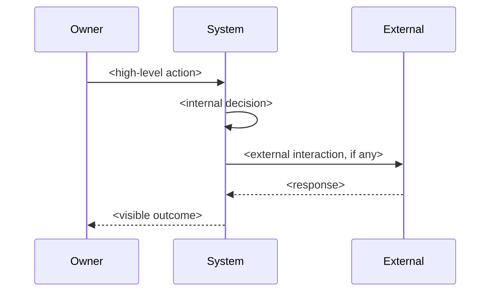
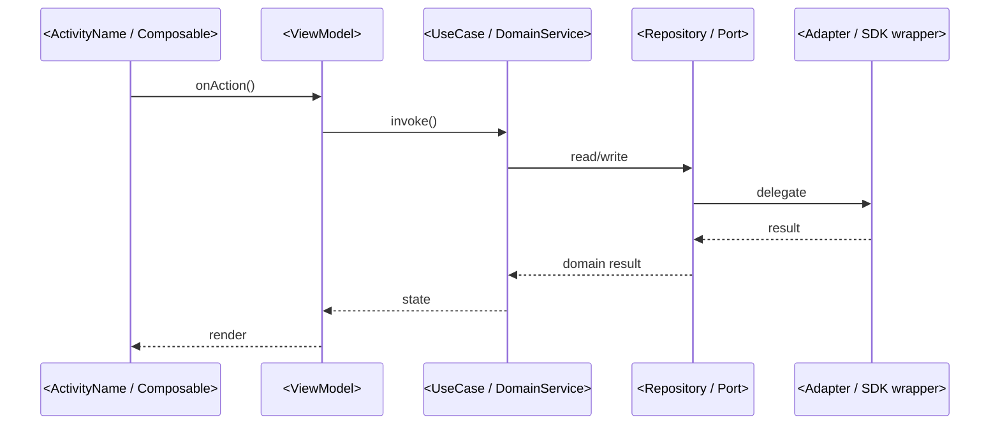

# Orchestrator: speckit-scenarios

Bridges **clarify → plan**. Produces inline sequence diagrams in `spec.md` under `## Sequences` heading. Each sequence has:
- Anchor ID `### SEQ-N: <title>`.
- Pre/Post conditions + Used-in.
- **Two Mermaid diagrams**: spec-level (behaviour, lifelines `Owner / System / External`) + plan-level (architecture, lifelines `UI / VM / UseCase / Repository / Adapter`).
- **MENTOR-DETAIL block** в HTML-комментариях — plain Russian explanation для владельца.

This is the **canonical format** per ADR-011 (2026-XX-XX, see [docs/adr/ADR-011-ai-owner-collaboration-conventions.md](../../../docs/adr/ADR-011-ai-owner-collaboration-conventions.md)) and CLAUDE.md «Sequences in spec.md» section. **Do NOT** write plain numbered prose lists — that was the older format (mandate 2026-06-16/18), superseded by ADR-011.

Output language:
- Mermaid diagrams + structural markdown — English.
- MENTOR-DETAIL block content — **Russian** (per language-by-audience rule: owner-facing → RU, AI-only → EN).
- Anchor IDs (`SEQ-N`) and `Pre:`/`Post:`/`Used-in:` keywords — English.

---

## When to invoke

- A `specs/<id>/spec.md` has been through `/speckit.clarify` (Clarifications section exists, checklists ran).
- No `plan.md` yet.
- Section `## Sequences` does not exist in spec.md, OR user explicitly asks to regenerate / add SEQ-N.
- **PROACTIVE**: after `speckit-clarify` finishes, **suggest this skill explicitly** to the user.

## When NOT to invoke

- spec.md doesn't exist or has no User Stories yet (need /speckit.specify first).
- Section `## Sequences` already exists и user not asking to regenerate. To add a new SEQ-N — user must explicitly say so.
- Spec is trivial (< 50 lines, single FR, no interesting flows) — overkill. Document the skip in spec.

---

## Procedure

### Step 1 — Identify sequence candidates

Read spec.md (особенно User Stories, Edge Cases, FRs). For each candidate flow ask:

1. **Is there an interesting interaction** between ≥2 participants (Owner ↔ System ↔ External)? If single-actor — может не нуждаться в sequence.
2. **Does the flow involve a state transition or boundary crossing** that's hard to explain in prose? Sequence helps.
3. **Is the flow load-bearing для architecture** (plan.md будет на него ссылаться)? Mandatory sequence.

**Typical sequence candidates** (include only those the spec actually has FRs/USs/SCs for):

- **First-time user flow** (install → onboarding → main screen). Usually mandatory.
- **Critical state transitions** (switch, migration, restore). Usually mandatory.
- **Boot path / cold start invariant** ("nothing checked on boot" axiom). Mandatory if spec has such invariant.
- **External-trigger flows** (push received, deep-link opened, paired device pushed update). Mandatory if spec touches.
- **Recovery / failure paths** (process killed mid-flow, network drop, permission denied) — only if spec has explicit FR for recovery behaviour.
- **Migration / upgrade paths** — if spec has wire-format change or schema bump.

**Anti-padding rule**: do NOT invent a sequence for trivial flows (single function call, pure CRUD, no state transition). Better four tight sequences than seven with three filler.

### Step 2 — Draft each sequence

For each candidate, write a complete sequence block (template below). Iteratively for each — don't try to draft all simultaneously.

**Template** (copy this structure exactly):

````markdown
### SEQ-N: <short title>

Pre: <preconditions — what's true before this sequence starts>.
Post: <postconditions — what's true after this sequence ends>.
Used-in: spec/<NNN-slug> [, spec/<MMM-slug> if reused].

#### Spec-level (behavior)



#### Plan-level (architecture)



<!-- MENTOR-DETAIL:BEGIN -->
#### Пояснение для владельца

- <plain-Russian explanation: что делает каждый участник, почему есть каждая ветка, что владелец увидит на экране>
- <2-5 bullet points>
- <Reference relevant constitution articles / rules if applicable>
<!-- MENTOR-DETAIL:END -->
````

### Step 3 — Verify hard rules from CLAUDE.md «Sequences in spec.md»

For each sequence, check:

- **Dual projection mandatory.** Both Mermaid diagrams present. Spec-level lifelines = `Owner / System / External (API, FCM, ...)`. Plan-level lifelines = architectural layers from `architecture.md` (arrows only point downward — visual check on rule 1, domain isolation).
- **MENTOR-DETAIL block mandatory.** Must be present and filled at creation time. Russian only.
- **Anchor IDs spec-local.** `SEQ-1` in this spec can coexist with `SEQ-1` in other inline-spec. The containing file disambiguates. Globally unique IDs only when extracted to `docs/sequences/` (Step 5 below).
- **Arrows in plan-level diagram** flow **only downward** through architectural layers (UI → VM → UseCase → Repository → Adapter). If you see an upward arrow (e.g., Repository calling back to UI directly) — that's a rule 1 violation. Flag in the spec, don't paper over with the diagram.

If any rule fails — fix the sequence, don't write incomplete sequences "to come back to later".

### Step 4 — Insert into spec.md

Add (or extend) section `## Sequences` in spec.md. Placement:
- **After** `## User Scenarios & Testing` (because sequences elaborate the User Stories).
- **Before** `## Requirements` (because FRs may reference SEQ-N).

If section `## Sequences` already exists и you're adding new SEQ-N — insert in numerical order.

If section doesn't exist — add the section with introductory paragraph:

```markdown
## Sequences

Sequence diagrams elaborate critical flows from User Stories. Each sequence has:
- Pre/Post conditions and reuse pointer.
- Spec-level diagram (behaviour, owner-readable).
- Plan-level diagram (architecture, plan.md cites these lifelines).
- MENTOR-DETAIL block (plain-Russian explanation for non-developer owner).

Per [CLAUDE.md «Sequences in spec.md»](../../../CLAUDE.md) section and [ADR-011](../../../docs/adr/ADR-011-ai-owner-collaboration-conventions.md).

---

### SEQ-1: ...
```

### Step 5 — Reactive extraction (skip on first pass)

Do **NOT** create `docs/sequences/SEQ-N.md` files preemptively. Only extract when:

1. The same sequence is genuinely needed in **2+ specs**.
2. Then: create `docs/sequences/SEQ-N-slug.md` with same structure.
3. Replace inline block in both specs with link: `→ [SEQ-N](../../docs/sequences/SEQ-N-slug.md)`.

`docs/sequences/INDEX.md` created only when directory holds **≥5 files**.

**Standing extraction candidate** (per CLAUDE.md): QR-pairing flow (spec/007 reused in spec/011 + future call / multi-admin specs). Extract at next touch of those specs, not preemptively.

### Step 6 — Cross-reference back to User Stories / FRs

After writing sequences, do a final pass:
- Every sequence cites which US / FR / Edge Case it elaborates (in MENTOR-DETAIL or via Pre/Post wording).
- Every critical US has a sequence (or explicit note in spec why it doesn't need one — e.g., «US-5 is dev-tool only, no runtime sequence»).

### Step 7 — Report

```
SPECKIT-SCENARIOS for specs/<id>/spec.md:
  Sequences written: N (SEQ-1..SEQ-N)
  All critical US covered: yes/no
  Extraction needed (≥2 specs reuse): [SEQ-X if any]
  Next step: /speckit.plan
```

---

## Heuristics

- **Two diagrams always.** Spec-level for behaviour, plan-level for architecture. If you only write one — that's a bug, not a shortcut.
- **MENTOR-DETAIL is non-optional.** Owner reads spec.md primarily через MENTOR-DETAIL блоки — they're the bridge from technical diagrams to plain understanding. Skipping these = breaking the contract with the owner.
- **Plan-level uses real class/port names**, not placeholders. If you don't know what the class will be called — that's a sign clarify-фаза was incomplete; surface it, don't fake a name.
- **Spec-level stays abstract**. `Owner / System / External` — not `Бабушка / Лаунчер / Firebase`. The specifics live in MENTOR-DETAIL.
- **Arrows downward in plan-level.** Visual fitness function for domain isolation (rule 1). If you find yourself drawing an upward arrow — pause, the architecture has a problem.
- **Brevity in MENTOR-DETAIL.** 3-7 bullet points typically. Owner reads to orient, not to learn architecture.
- **Don't write sequences for trivial flows.** Pure CRUD, single state read — no sequence needed. Reserve sequences for interesting transitions / boundary crossings / multi-actor flows.

---

## Output

- Updated `specs/<id>/spec.md` with `## Sequences` section (new or extended).
- No separate file (unless Step 5 extraction triggered).
- Short report at end.

---

## Relationship to other skills

- **`speckit-clarify`** — runs before. Produces clarified spec.
- **`speckit-plan`** — runs after. **Cites sequences** for architectural decisions (plan-level diagrams should match plan.md architectural choices; if mismatch — sequence was wrong or plan deviates, surface it).
- **`speckit-analyze`** — final gate. Verifies every sequence step traces to FR + test.

---

## Proactive invocation pattern

After `speckit-clarify` completion: end response with «Следующий рекомендуемый шаг — `/speckit.scenarios` (inline Mermaid sequences с MENTOR-DETAIL, per ADR-011). Запустить?»

If user says «давай сразу `/speckit.plan`» — flag once, but don't block: «ОК, plan без sequences. Если потом захочешь — `/speckit.scenarios` добавит секцию `## Sequences` в spec.md.»

Skip the prompt if `## Sequences` section already exists и владелец не просит regenerate.

---

## History note

This skill was rewritten 2026-06-30 to align with ADR-011 + CLAUDE.md «Sequences in spec.md» section. The pre-2026-06-30 version produced plain numbered prose sentences under `## Сценарии использования` heading — that format is **deprecated**. Existing specs with the old format will be migrated on next `/speckit.*` touch (per CLAUDE.md «do not preemptively migrate existing files» rule).
