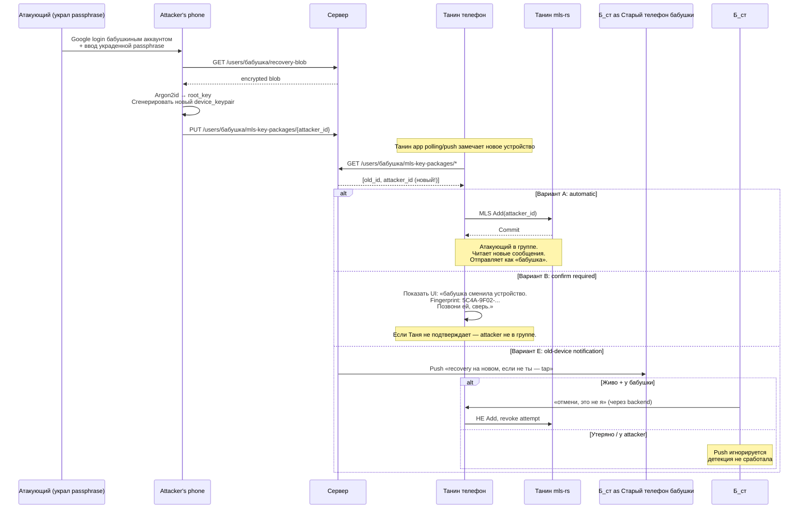

## Description

<!-- SECTION:DESCRIPTION:BEGIN -->

## Что это простыми словами

Бабушка потеряла телефон и восстановилась на новом. Танин app (admin) **автоматически** видит новое устройство бабушки. Танин app должен решить — **сам** добавить это устройство в общую защищённую группу, или **спросить** Таню «это правда бабушка? сверь fingerprint по телефону»?

**Attacker scenario**: злоумышленник украл passphrase бабушки (phishing, семейный конфликт, social engineering). Recovered на своём устройстве. Танин app auto-добавляет — attacker читает все будущие сообщения от имени «бабушки». Если Танин app спрашивает подтверждение — attacker блокируется.

**Balance**: скорость recovery для бабушки (одинокая пожилая, launcher = основной интерфейс) vs защита от кражи passphrase.

## Зачем

Разрешить блокирующий вопрос — security decision для peer device rotation. Без решения TASK-6 (root key hierarchy финальный shape) и TASK-25 (multi-app cohabitation) не могут finalize'иться.

Связан с TASK-100 (history backup) — обе про recovery UX + security. TASK-100 решил что истории нет после recovery (снижает риск: attacker с passphrase не читает прошлое). Осталось решить что делать с будущим.

## Что входит технически (для AI-агента)

**Слои решения**:
- **Detection** (`core/` port `PeerDeviceMonitor`) — обнаружение новой KeyPackage у peer'а.
- **Policy engine** (`core/` port `RecoveryTrustPolicy`) — auto vs confirm vs deferred.
- **UI adapter** (`app/`) — fingerprint display, confirmation dialogs, notifications.
- **Audit log** (TASK-32) — фиксация «recovery detected at HH:MM, admin=Таня подтвердил / отклонил».

**Варианты обсуждаются**:
- **A. Automatic MLS Add** — Танин app сам делает MLS Add(new_device). Быстро, но опасно.
- **B. Confirmation UX** — Танин app показывает fingerprint, требует явного подтверждения. Безопасно, но UX-heavy.
- **C. Hybrid** — automatic для known-good scenarios (тот же Google account + short time window после user'ского trigger'а), confirm для anomalies (unusual geo, long time gap).
- **D. Time-delayed automatic** — auto-add через N часов если старое устройство не отзвонилось «это не я».
- **E. Old-device notification + kill switch** — push старому устройству «recovery на новом, если не ты — tap». Может комбинироваться с A/D.

## Состояние

В обсуждении. Session 1 начата 2026-07-02, ожидаются ответы владельца на Q1-Q5 в SECTION:DISCUSSION ниже.

<!-- SECTION:DESCRIPTION:END -->

## Acceptance Criteria
<!-- AC:BEGIN -->
- [ ] #1 [hand] Все 5 clarifying questions в Session 1 получили ответы владельца
- [ ] #2 [hand] Best path выбран из вариантов A/B/C/D/E (или их комбинации) с обоснованием
- [ ] #3 [hand] Decision block заполнен (English, immutable) — Choice / Rationale / Applies to / Trade-offs / Exit ramp
- [ ] #4 [hand] Status → Draft (готова к /speckit.specify)
- [ ] #5 [hand] Downstream tasks (TASK-6, TASK-25) уведомлены о необходимости `dependencies: [TASK-101]`
<!-- AC:END -->

## Discussion

<!-- SECTION:DISCUSSION:BEGIN -->

### Session 1 (2026-07-02, mentor skill invoked)

#### A.1 Что за область

Trust decision при peer device rotation. В крипто-протоколах это называется **peer device change verification**. Прототипы: Signal Safety Number changed, Matrix cross-signing, WhatsApp security code changed, Apple Contact Key Verification.

Это **не** про то как бабушка себя аутентифицирует (это TASK-6 через passphrase + Google login). Это про то, как **peer'ы** решают доверять новому устройству бабушки после её recovery.

#### A.2 Карта темы

**Атакующий сценарий** (motivating case):

**Смежная тема — old-device notification**:

Даже если Таня auto-add'ит новое устройство, **старое** устройство бабушки может получить push «recovery на новом устройстве, это ты?». Это **CANDIDATE-1** из handoff'а («Recovery notification + Old-device invalidation») — та же тема.

#### A.3 Ключевые термины

- **KeyPackage** — «одноразовый пропуск» устройства в MLS. Содержит device_pub, identity_pub, подпись. Публично в directory. При recovery — публикуется новый.
- **Peer device rotation** — событие «peer сменил устройство». Может быть legit (recovery, upgrade) или атака.
- **Fingerprint / Safety Number** — hash от identity_pub. 6-8 групп цифр, показывается пользователю. Одинаковый на обоих устройствах → они одинаково видят identity.
- **Trust On First Use (TOFU)** — модель Signal/WhatsApp: доверяй первому ключу peer'а, warn при смене.
- **Cross-signing (Matrix)** — user имеет **master key**. Каждое его новое устройство подписывается master key. Peer'ы верифицируют master key **один раз**, дальше доверяют всем устройствам этого user'а автоматически.
- **Out-of-band verification** — сверка через **другой** канал (голос, SMS, встреча). Единственная защита от MITM с помощью манипуляции ключами.
- **Old-device notification** — push старому устройству «на новом устройстве произошло X». Detection механизм post-factum.

#### A.4 Уточняющие вопросы + ответы владельца

**Q1**: Насколько Таня (admin, младший родственник 30-50 лет) готова к fingerprint verification — читать 6-8 групп цифр по телефону бабушке, понять «если не совпадает — опасно», делать это в 30% случаев recovery?

**A1**: _(ожидание)_

---

**Q2**: Насколько важна скорость recovery? Бабушка утеряла телефон, купила новый — сколько ждать: немедленно (~1 мин) / несколько минут / 24 часа delay ок?

**A2**: _(ожидание)_

---

**Q3**: Что делает старое устройство при recovery — auto-revoke (сломается если бабушка случайно recovery запустила) или ручное decision (attacker с physical access читает параллельно)?

**A3**: _(ожидание)_

---

**Q4**: Модель «single admin» (только Таня) или «multi admin» (Таня + Петя + мама, любой confirm'ит)? Влияет на достижимость Варианта B.

**A4**: _(ожидание)_

---

**Q5**: Явная безопасность (Signal-style «Safety Number changed, verify») vs невидимая (Apple Passkey-style heuristic-driven auto с alert'ом на anomalies)?

**A5**: _(ожидание)_

---

#### A.6 Гипотеза рекомендации (до ответов)

Наиболее вероятная рекомендация — **D + E hybrid**:
1. Recovery → auto-add new device в MLS через N часов (например 24h) **если** старое устройство не отзвонилось «это не я».
2. Old-device получает push «recovery на новом, tap если не ты».
3. Все admins получают in-app notification.
4. Таня может **ускорить** до немедленного добавления через tap «это точно бабушка».

Это **CANDIDATE-1 из handoff** + time-delayed auto = **hybrid между Signal и Apple Passkey**.

### Session 2, 3, ... (продолжение)

_(будущие сессии добавляются здесь по мере обсуждения)_

### Decision (English, immutable) 🔒

_(pending — заполняется перед переходом status → Draft)_

<!-- SECTION:DISCUSSION:END -->

## Implementation Plan
<!-- SECTION:PLAN:BEGIN -->
_(pending — заполняется в /speckit.plan после Decision block frozen)_
<!-- SECTION:PLAN:END -->
