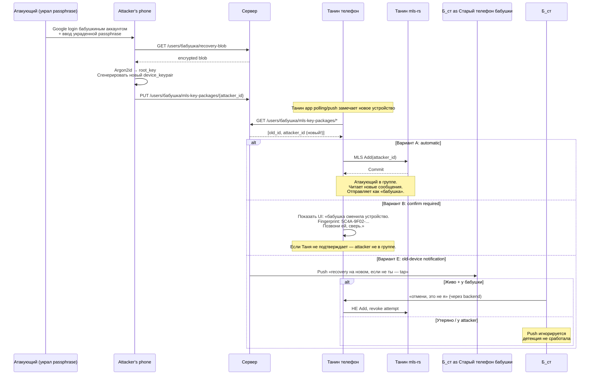

## Description

<!-- SECTION:DESCRIPTION:BEGIN -->

## Что это простыми словами

Бабушка потеряла телефон и восстановилась на новом. Танин app (admin) **автоматически** видит новое устройство бабушки. Танин app должен решить — **сам** добавить это устройство в общую защищённую группу, или **спросить** Таню «это правда бабушка? сверь fingerprint по телефону»?

**Attacker scenario**: злоумышленник украл passphrase бабушки (phishing, семейный конфликт, social engineering). Recovered на своём устройстве. Танин app auto-добавляет — attacker читает все будущие сообщения от имени «бабушки». Если Танин app спрашивает подтверждение — attacker блокируется.

**Balance**: скорость recovery для бабушки (одинокая пожилая, launcher = основной интерфейс) vs защита от кражи passphrase.

## Зачем

Разрешить блокирующий вопрос — security decision для peer device rotation. Без решения TASK-6 (root key hierarchy финальный shape) и TASK-25 (multi-app cohabitation) не могут finalize'иться.

Связан с TASK-100 (history backup) — обе про recovery UX + security. TASK-100 решил что истории нет после recovery (снижает риск: attacker с passphrase не читает прошлое). Осталось решить что делать с будущим.

## Что входит технически (для AI-агента)

**Слои решения**:
- **Detection** (`core/` port `PeerDeviceMonitor`) — обнаружение новой KeyPackage у peer'а.
- **Policy engine** (`core/` port `RecoveryTrustPolicy`) — auto vs confirm vs deferred.
- **UI adapter** (`app/`) — fingerprint display, confirmation dialogs, notifications.
- **Audit log** (TASK-32) — фиксация «recovery detected at HH:MM, admin=Таня подтвердил / отклонил».

**Варианты обсуждаются**:
- **A. Automatic MLS Add** — Танин app сам делает MLS Add(new_device). Быстро, но опасно.
- **B. Confirmation UX** — Танин app показывает fingerprint, требует явного подтверждения. Безопасно, но UX-heavy.
- **C. Hybrid** — automatic для known-good scenarios (тот же Google account + short time window после user'ского trigger'а), confirm для anomalies (unusual geo, long time gap).
- **D. Time-delayed automatic** — auto-add через N часов если старое устройство не отзвонилось «это не я».
- **E. Old-device notification + kill switch** — push старому устройству «recovery на новом, если не ты — tap». Может комбинироваться с A/D.

## Состояние

Decided 2026-07-02 в одну session. Status → Draft. Готова к /speckit.specify или прямому use'у как contract'а для downstream tasks. Downstream tasks (TASK-6, 25, 32, 40) добавляют `dependencies: [TASK-101]` при следующем touch'е.

<!-- SECTION:DESCRIPTION:END -->

## Acceptance Criteria
<!-- AC:BEGIN -->
- [x] #1 [hand] Все 5 clarifying questions в Session 1 получили ответы владельца
- [x] #2 [hand] Best path выбран (Chrome-model: auto-add + post-facto notification) с обоснованием
- [x] #3 [hand] Decision block заполнен (English, immutable) — Choice / Rationale / Applies to / Trade-offs / Exit ramp
- [x] #4 [hand] Status → Draft (готова к /speckit.specify)
- [ ] #5 [hand] Downstream tasks (TASK-6, TASK-25) уведомлены о необходимости `dependencies: [TASK-101]` (выполняется при их следующем touch)
<!-- AC:END -->

## Discussion

<!-- SECTION:DISCUSSION:BEGIN -->

### Session 1 (2026-07-02, mentor skill invoked)

#### A.1 Что за область

Trust decision при peer device rotation. В крипто-протоколах это называется **peer device change verification**. Прототипы: Signal Safety Number changed, Matrix cross-signing, WhatsApp security code changed, Apple Contact Key Verification.

Это **не** про то как бабушка себя аутентифицирует (это TASK-6 через passphrase + Google login). Это про то, как **peer'ы** решают доверять новому устройству бабушки после её recovery.

#### A.2 Карта темы

**Атакующий сценарий** (motivating case):

**Смежная тема — old-device notification**:

Даже если Таня auto-add'ит новое устройство, **старое** устройство бабушки может получить push «recovery на новом устройстве, это ты?». Это **CANDIDATE-1** из handoff'а («Recovery notification + Old-device invalidation») — та же тема.

#### A.3 Ключевые термины

- **KeyPackage** — «одноразовый пропуск» устройства в MLS. Содержит device_pub, identity_pub, подпись. Публично в directory. При recovery — публикуется новый.
- **Peer device rotation** — событие «peer сменил устройство». Может быть legit (recovery, upgrade) или атака.
- **Fingerprint / Safety Number** — hash от identity_pub. 6-8 групп цифр, показывается пользователю. Одинаковый на обоих устройствах → они одинаково видят identity.
- **Trust On First Use (TOFU)** — модель Signal/WhatsApp: доверяй первому ключу peer'а, warn при смене.
- **Cross-signing (Matrix)** — user имеет **master key**. Каждое его новое устройство подписывается master key. Peer'ы верифицируют master key **один раз**, дальше доверяют всем устройствам этого user'а автоматически.
- **Out-of-band verification** — сверка через **другой** канал (голос, SMS, встреча). Единственная защита от MITM с помощью манипуляции ключами.
- **Old-device notification** — push старому устройству «на новом устройстве произошло X». Detection механизм post-factum.

#### A.4 Уточняющие вопросы + ответы владельца

**Q1**: Насколько Таня (admin, младший родственник 30-50 лет) готова к fingerprint verification?

**A1**: Владелец правильно указал что вся моя threat model держится на предпосылке «passphrase утекла». Если passphrase secure — атаки нет, ceremony не нужна. Если passphrase leak — это отдельная задача (2FA), не base recovery flow. Значит вопрос про Танину готовность к fingerprint verification снимается — в base flow этого не будет.

---

**Q2**: Насколько важна скорость recovery?

**A2**: Немедленно. 2FA — отдельная опциональная фича (не в scope этого task'а), а в base recovery instant без ceremony.

---

**Q3**: Что делает старое устройство при recovery?

**A3**: **Не auto-revoke**. У пользователя могут быть несколько легитимных устройств (телефон + планшет), это универсальный pattern (WhatsApp 2021+ companion, Signal linked devices, Google account на N устройствах). Recovery ≠ device replacement, это добавление нового leaf. Старые устройства **получают notification** («новое устройство на аккаунте»), могут revoke новое через кнопку. Revoke — отдельная explicit операция.

Аналог — Google's Location-Aware Security prompt («Was this you? We noticed a new sign-in from...»).

Multi-device техническая feasibility подтверждена: каждое устройство = separate MLS leaf с same identity_pub (derived from same root_key через HKDF). Universal — Android (в т.ч. Huawei HMS), iOS, Google TV.

---

**Q4**: Модель admin'ов?

**A4**: Снимается — модель работает одинаково при любом количестве admin'ов. Auto-add происходит на app'е любого admin'а первым увидевшего новый KeyPackage. Confirmation ceremony отсутствует, offline'ые admin'ы не блокируют recovery.

---

**Q5**: Явная vs невидимая безопасность?

**A5**: **Chrome-модель** (между: невидимо для нового устройства, явное информирование на существующих устройствах владельца). Не Signal (явно всем), не Passkey (полностью невидимо).

---

#### A.6 Follow-up вопросы для финализации модели

**R1** (что показывает NEW device на существующий аккаунт): Chrome-style — **ничего** специального на новом устройстве. Notification на старых устройствах владельца: «Вы зашли на новом устройстве? Fingerprint XXXX. [Да] [Нет, отозвать]».

**R2** (что показывает EXISTING device): **(c) — и push, и in-app banner**. Push потому что важно, banner для visibility при возврате в app.

### Session 1 closed — переход к Part B

#### B.1 Best path

**Chrome-модель**: auto MLS Add на recovery (immediate, no ceremony) + post-facto notification на существующих устройствах владельца (push + in-app banner) + revoke как отдельная operation через UI.

**Notification tracks (два разных)**:
1. **Own existing devices** (планшет, старый телефон если жив): «Новое устройство добавлено на твой аккаунт. Fingerprint XXXX. [Да, это я] [Нет, отозвать]».
2. **Admin devices** (Таня, Петя): «У бабушки новое устройство, добавлено в группу». Informational.

#### B.2 Альтернативы (рассмотрены и отклонены)

- **Auto-add + peer confirmation ceremony**: overkill для elderly UX, 100% пользователей платят friction ради 5% параноиков.
- **Auto-revoke old device on recovery**: ломает multi-device use case (планшет бабушки функциональный).
- **Time-delayed auto-add (24h)**: превращает recovery в 24-часовое ожидание.

#### B.3 Adjacent concerns

1. **Attacker с passphrase + physical access к всем устройствам бабушки**: dismiss'ит notification. Physical security failure за пределами threat model. Fixed by 2FA opt-in.
2. **Zero-existing-devices case**: бабушка потеряла всё → нет куда слать notification → recovery silent. Accepted MVP limitation.
3. **Revoke как отдельная operation**: не в этом task'е. Отдельный decision-task когда будем строить device management UI.
4. **2FA opt-in feature**: отдельный task в Phase-3+. Server-roadmap entry RECOVERY-2FA-001.

### Decision (English)

**Choice**: Auto MLS Add on recovery (immediate, no confirmation ceremony) + post-facto notification (Chrome/Google Account model) to (a) other devices of the same identity holder — push + in-app banner asking «Was this you?» with revoke option, and (b) admin devices in the same MLS group — informational only. Old devices remain functional after recovery; revoke is a separate explicit user action, not implicit in recovery flow.

**Scope clarification (2026-07-06)**: recovery = **self-add** of a new device_keypair for the recovering user's own identity (Таня recovers → her new device joins as her second leaf). Does **not** mean one peer adds another peer's device — that flow is covered by TASK-67 QR pairing + TASK-102 device management group ownership (bab's device is sole MLS Commit signer for group roster changes, admins pair via QR).

**Rationale**: Passphrase is the base authentication contract. If passphrase is secure, no attack is possible. If passphrase leaks, that is the concern of optional 2FA (peer ceremony, SMS, authenticator app) — a separate feature not overloaded into base recovery. Forcing 100% of users through fingerprint verification ceremony to mitigate the 5% who leak passphrase via social engineering is wrong UX for elderly-primary audience. Multi-device is a first-class use case (phone + tablet on same identity, per WhatsApp companion 2021+ and Signal linked devices); recovery adds a new MLS leaf, does not touch existing leaves. Fast recovery UX matches Google's Location-Aware Security pattern (well-understood by users of any modern account system).

**Applies to**: TASK-6 (root key hierarchy — recovery adds new device_keypair without touching others), TASK-25 (multi-app cohabitation — device inventory sync must handle N devices per identity), TASK-32 (audit log — record device add events with `who_added / when / new_device_fingerprint`), TASK-40 (previously parked — this Decision resurrects multi-device as legitimate Phase-2 scope since it's first-class), TASK-102 (device management group — recovery's self-add is one of the reconciliation triggers on bab's device).

**Trade-offs accepted**:
- Attacker with passphrase and physical access to all other devices of the identity holder can dismiss notifications and gain silent access. Physical security failure beyond MVP threat model.
- If the recovering user has zero other active devices at recovery time, no notification is possible and recovery proceeds silently. Accepted MVP limitation; mitigated by future 2FA opt-in feature.
- Notification-based detection is post-facto (attacker gains access before user reacts). Acceptable for elderly-family threat model; unacceptable for nation-state-target model (not our audience).
- No fingerprint verification ceremony in base flow reduces cryptographic assurance vs Signal / Matrix baseline. Traded for UX simplicity.

**Exit ramp**: Add opt-in 2FA feature as separate task (e.g. TASK-2FA in Phase-3+). Options: peer confirmation ceremony (safety numbers), external 2FA channel (SMS / email / authenticator app), FIDO2 hardware key for paranoid users. Additive to base recovery flow — no migration required. Server-roadmap entry: `RECOVERY-2FA-001`. Estimated effort: 3-4 weeks.

<!-- SECTION:DISCUSSION:END -->

## Implementation Plan
<!-- SECTION:PLAN:BEGIN -->
_(pending — заполняется в /speckit.plan после Decision block frozen)_
<!-- SECTION:PLAN:END -->
