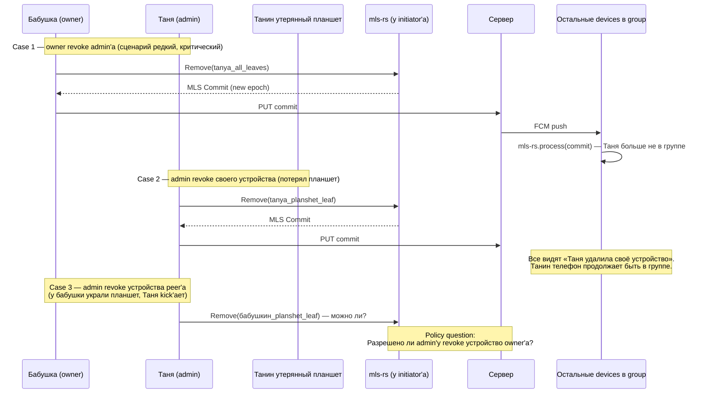
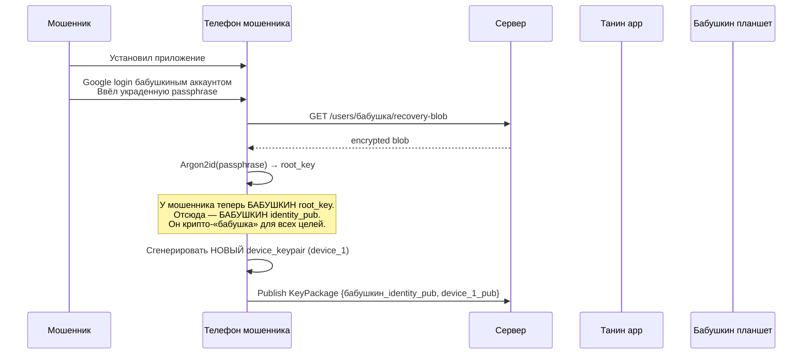
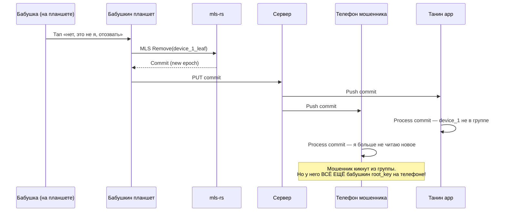
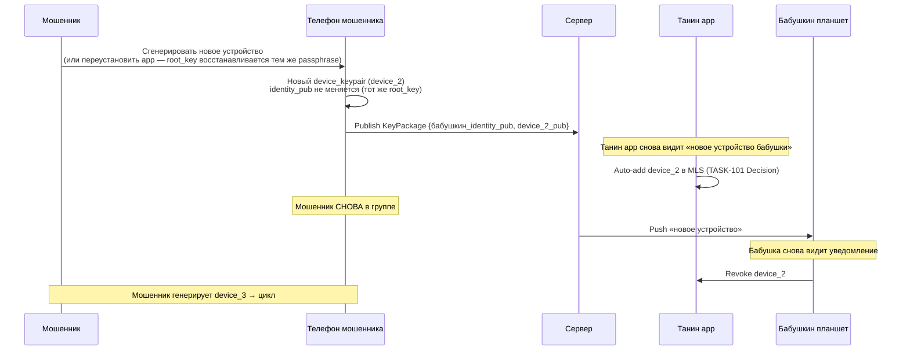

## Description

<!-- SECTION:DESCRIPTION:BEGIN -->

## Что это простыми словами

Кто в MLS-группе бабушки может **отозвать** доступ у другого участника, и что при этом происходит?

**Три разных операции** которые могут захотеть выполнять пользователи:

1. **Отозвать admin'а** — бабушка решила что Таня больше не будет управлять её телефоном.
2. **Отозвать устройство peer'а** — бабушкин планшет украли, кто-то из семьи должен его дистанционно kick'нуть.
3. **Отозвать своё устройство** — Таня потеряла свой планшет, хочет со своего телефона выкинуть его из группы (чтобы вор не читал новых сообщений).

**Кто это может делать** — только бабушка (owner)? Любой admin (Таня может выкинуть Петю)? Зависит от роли (clinic case: head-nurse может, junior-nurse нет)?

**Что происходит с revoked member'ом** — теряет доступ немедленно (математика MLS forward secrecy) или есть grace period? Может ли снова присоединиться потом?

Это symmetric operation к TASK-101 (peer confirmation on recovery). Если recovery добавляет нового leaf в MLS, revoke — убирает существующий. Механика похожа, policy — совсем разная.

## Зачем

Разрешить blocking security decision. Без policy:
- TASK-42 (MLS group encryption) не может финализироваться — не знает allowed operations.
- TASK-46 (shared admin book) не знает кто может «удалить admin'а из семьи».
- TASK-58 (MLS research) не может завершиться — MLS protocol policy — часть research scope.
- TASK-6 (root key hierarchy) — включает device revoke как операцию для recovery flow.
- TASK-32 (audit log) не знает что record'ить в revoke event'е.

Особенно важно после TASK-101 (multi-device как first-class): теперь revoke = **обычная UI operation** («потерял планшет — kick»), не только edge case «kick bad admin».

## Что входит технически (для AI-агента)

**Три MLS operation'а обсуждаются**:
- `MlsGroup.remove(target_leaf_index)` — стандартная MLS Remove operation. Commit меняет epoch, target больше не может decrypt новые messages.
- `MlsGroup.leave()` — self-removal. Отправляет Remove для собственного leaf, epoch меняется.
- **NOT** existence в MLS: soft-revoke / grace period. Post-compromise security — эпоха меняется instantly.

**Application-level layers**:
- **Policy engine** (`core/` port `RevokePolicy`) — «кто может revoke кого». Family=flat vs clinic=roles.
- **Enforcement** — client-side check + Firestore Rules + Cloudflare Worker verification (три уровня).
- **UI adapter** (`app/`) — confirmation dialogs, revoke reasons, blacklist toggle.
- **Audit log** (TASK-32) — record всех revoke events.

**Варианты policy**:
- **A. Owner-only**: только бабушка может revoke кого-угодно. Simple. Ломается при owner offline / lost device.
- **B. Any-admin**: любой admin может revoke любого другого admin'а (кроме owner'а). Standard Slack/WhatsApp model.
- **C. Role-based**: определённые роли (head-admin, admin, restricted) с per-role permissions. Family=simple, clinic=granular.
- **D. Configurable per profile**: family use case = A или B, clinic use case = C.
- **E. Only own devices** для self-revoke, любой admin для peer revoke — гибрид.

## Состояние

В обсуждении. Session 1 начата 2026-07-02, ожидаются ответы владельца на Q1-Q5.

<!-- SECTION:DESCRIPTION:END -->

## Acceptance Criteria
<!-- AC:BEGIN -->
- [ ] #1 [hand] Все clarifying questions Session 1 получили ответы владельца
- [ ] #2 [hand] Best path выбран для (a) revoke чужого admin'а, (b) revoke своего устройства, (c) blacklist после revoke
- [ ] #3 [hand] Decision block заполнен (English, immutable) — Choice / Rationale / Applies to / Trade-offs / Exit ramp
- [ ] #4 [hand] Status → Draft (готова к использованию downstream tasks)
- [ ] #5 [hand] Downstream tasks (TASK-6, 32, 42, 46, 58) уведомлены о необходимости `dependencies: [TASK-102]`
<!-- AC:END -->

## Discussion

<!-- SECTION:DISCUSSION:BEGIN -->

### Session 1 (2026-07-02, mentor skill invoked)

#### A.1 Что за область

**Revoke policy** — application-level rule поверх MLS Remove operation. MLS сам не знает про роли: любой member может технически commit'ить Remove commit по протоколу. Policy — наш код поверх, определяющий кто может делать что и как это enforce'ится (client / server / peer).

Прямой связан с TASK-101 (peer confirmation on recovery). После TASK-101 unparknoulo multi-device первокласс. Значит revoke = **обычная UI operation** («управление моими устройствами»), не только редкий edge case admin dispute.

#### A.2 Карта темы

**Три разных операции которые пользователи хотят делать**:



**Layers policy enforcement**:

- **Client-side** (первая линия): Танин UI **прячет** кнопку revoke если Таня не имеет права. Не защищает от custom клиента.
- **Peer-side** (вторая линия): каждый member проверяет commit signer против roster.role_permissions перед `mls-rs.process(commit)`. Отклоняет не-authorized commits — но эффект локальный (только на своём устройстве).
- **Server-side** (третья линия): Cloudflare Worker verifies при `POST /push/notify` для kind=`role-change`. Плюс Firestore Security Rules on `access-grants/*` DELETE.

Три уровня одновременно = defense in depth.

#### A.3 Главное для новичка

1. **MLS Remove — irreversible на уровне crypto**. Removed member больше НЕ может decrypt новые messages (forward secrecy эпохи). Locally cached старые messages у него остаются — «отменить прошлое» криптографически невозможно.
2. **Policy — наш application-level слой**. MLS даёт «любой может делать всё», мы поверх ограничиваем. Три уровня enforcement (Δ.10 mentor overview).
3. **Post-compromise security как bonus**: даже если у removed member'а был скомпрометирован ключ ДО revoke — после epoch change новый ключ группы безопасен. MLS killer feature.
4. **Multi-device означает revoke = обычная операция**, не только «kick bad actor». Пользователь потерял планшет = revoke.
5. **Rogue admin scenario**: Таня попыталась Remove бабушку (owner). Наш код должен reject это на всех трёх уровнях. Owner имеет special protection.

#### A.4 Ключевые термины

- **MLS Remove commit** — операция протокола, убирает leaf из TreeKEM, меняет epoch. Standard MLS RFC 9420.
- **Leaf** — один участник группы в MLS. Один пользователь может иметь несколько leaves (multi-device).
- **Roster** — список членов группы с ролями и permissions. Публичный (server видит), нужен для application-level checks.
- **Owner** — создатель группы (managed identity, у нас бабушка). Special protected в policy.
- **Admin** — участник с правом revoke других (по нашей policy). У бабушки — Таня, Петя.
- **Blacklist** — список identity_pub которые не могут снова присоединиться после revoke. Prevent'ит «kicked → rejoin через новое QR» loop.
- **Self-revoke** — user удаляет свой собственный leaf. «Я потерял устройство, kick'аю его leaf со своего другого устройства».
- **Post-compromise security** — свойство MLS: revoked member с utekшим ключом не может читать новое.

#### A.5 Уточняющие вопросы

**Q1 — модель ролей: flat или hierarchical?**

- **Flat** (family): owner + admins, все admins равны. Простая mental model для пожилых. Полный доступ у любого admin'а.
- **Hierarchical** (clinic potentially): head-doctor / doctor / nurse / caregiver. Per-role permissions.

Family + clinic — разные use cases. Строим один общий (может быть overkill для family) или configurable per profile?

**Зачем спрашиваю**: определяет сложность RevokePolicy port'а. Flat — 20 строк. Hierarchical + config — 200 строк.

---

**Q2 — кто может revoke кого?**

Возьмём сценарий: у бабушки admins Таня + Петя. Танин муж поссорился с Петей. Может ли Таня самостоятельно Remove Петю (без бабушки)? Возможные policy:

- **Только owner**: единственная безопасная. Но бабушка забыла телефон дома — Петя творит беспредел неделю.
- **Any admin can Remove any other admin**: демократичная. Но Таня и Петя могут друг друга vzaimно удалить (deadlock).
- **Only owner Remove admins; admins can only Remove restricted-role users**: разграничение. Работает если есть restricted role.
- **Only owner Remove admins, но owner may auto-approve через time-delay** (24h window): Таня request'ит remove Петя → бабушка получает push → если игнорирует 24h → Remove auto-applied. Balance UX vs safety.

**Зачем спрашиваю**: определяет social dynamics в family. Trust between admins высокий (все родня)? Или могут быть конфликты?

---

**Q3 — multi-device revoke: identity level или device level?**

У Тани телефон + планшет. Ошибка Тани → бабушка хочет kick'нуть Таню. Что происходит:

- **Identity-level revoke**: Remove все Танины leaves сразу. Таня полностью out.
- **Device-level revoke**: Remove конкретный leaf. Таня всё ещё в группе через другое устройство. Ошибочный choice для «kick admin».

**Логично**: device-level для «I lost my device» / «my device was stolen». Identity-level для «Kick that person». **Разные UI кнопки**?

**Зачем спрашиваю**: определяет как строить UI. Одна кнопка «revoke Таню» = identity-level? «Manage Танины devices» separately?

---

**Q4 — self-device revoke как first-class UI?**

TASK-101 Decision сделал multi-device first-class. Значит бабушка может иметь phone + tablet. Если tablet украден — бабушка со своего phone кликает «revoke мой планшет». Это должно быть **easy** operation — она не хочет разбираться с чей ключ / MLS / whatever.

Возможные UX pattern'ы:
- **A. «Мои устройства» экран с revoke кнопкой на каждом** (как Google Account activity page).
- **B. Push notification от device management flow с «revoke unknown device»**.
- **C. Voice command / SOS-style единственная кнопка «my phone is lost, kick it now»**.

**Зачем спрашиваю**: определяет приоритет UX для elderly. Bab бабушка нажмёт «мои устройства» → «planshet» → «удалить»? Или ей нужно ещё проще?

---

**Q5 — blacklist после revoke: rejoin allowed?**

Таня revoked (за дело или ошибочно). Она пытается снова присоединиться через новое QR pairing с бабушкой. Что происходит:

- **A. Свободный rejoin**: бабушка показывает QR → Таня scan'ит → normal pairing. Никакой blacklist. Simple, но не защищает от «отозвал по ошибке / manipulated бабушку → она снова добавила».
- **B. Cooldown**: revoked identity_pub blacklist'ится на 24h. После — можно снова pairing.
- **C. Permanent blacklist** (с явным unlock через wizard): после revoke identity permanent пока owner явно не «unlock» её.

**Зачем спрашиваю**: security vs UX. Для «kicked bad actor» — B/C нужны. Для «отозвал ошибочно» — A правильно. Может быть per-case reason на revoke UI?

---

#### A.6 Гипотеза рекомендации (до ответов)

Наиболее вероятная рекомендация — **hybrid**:

1. **Roles**: flat model в MVP (family target). Configurable-per-profile (clinic) — Phase-3+ как отдельный task. **Q1 answer likely: flat**.
2. **Revoke чужого admin'а**: только owner. С time-delay auto-approve (24h) при request от admin'а — балансирует edge case «owner офлайн». **Q2 answer likely: owner-only с 24h fallback**.
3. **Multi-device revoke UI**: separate flows — «мои устройства» (self-manage) vs «отозвать участника» (kick person). Разные кнопки, разные confirmation'ы. **Q3 answer likely: разные UI**.
4. **Self-device revoke**: first-class UI как в Google Account activity. **Q4 answer likely: A (мои устройства list)**.
5. **Blacklist**: opt-in per-revoke — при revoke owner выбирает «отозвать» (allow rejoin) vs «заблокировать» (blacklist). Sensible default = blacklist для не-owner initiators. **Q5 answer likely: opt-in choice**.

Ответы Q1-Q5 подтвердят или скорректируют.

### Session 1 — ответы владельца

**Q1** (роли — flat или hierarchical): **owner + равные admins + others**. Три роли зафиксированы в wire format, но в MVP реализован только `owner + admin`. `other` — reserved namespace на Phase-3+ (Article XX даёт cost=0 на резервирование сегодня).

**Q2** (кто может revoke кого): **любой admin может revoke любого admin'а, кроме owner. Owner может revoke кого угодно (кроме себя). Other не может revoke никого.**

Rationale владельца:
- Trust между admin'ами высокий (это семья, все родня).
- «Проще снова pairing, чем сложная logic» — простая mental model для elderly.
- Опасение кражи аппарата → важно чтобы можно было быстро kick'нуть, без ожидания owner'а.

**Q3** (multi-device revoke): **identity-level для peer removal, device-level для self-management**. Разные UI кнопки.

**Q4** (self-device revoke): **first-class UI** («мои устройства» экран à la Google Account activity).

**Q5** (blacklist): **нет blacklist**. «Проще снова pairing чем blacklist». Rejoin через QR pairing свободный.

**Что происходит с revoked member'ом**: immediate hard kick через MLS Remove commit. Forward secrecy delivers post-compromise security automatically (revoked member с utekшим ключом не может decrypt новое). No grace period.

### Session 2 — Attacker re-add cycle (mentor explanation)

**Проблема, которую владелец захотел разобрать**: если blacklist нет, что делает mail мошенник который выманил passphrase у бабушки?

#### Исходные данные атаки

- Мошенник социальной инженерией получил бабушкин passphrase («здравствуйте, я из техподдержки, назовите пароль»).
- Google-аккаунт мошенник получил тем же способом.

#### Шаг 1 — фальшивое recovery на своём телефоне



**Что происходит по TASK-101 Decision**: Танин app polling'ом видит «новое устройство бабушки». Auto-add в MLS. Мошенник в группе.

Бабушкин планшет получает push «новое устройство на твоём аккаунте, это ты?».

#### Шаг 2 — бабушка кликает «revoke»



Пока всё правильно. Мошенник кикнут. Но у него **всё ещё** бабушкин root_key на устройстве.

#### Шаг 3 — мошенник просто пробует ещё раз



**Проблема сформулированная**: у мошенника **бабушкин root_key** (потому что знает passphrase). Из root_key можно бесконечно генерировать новые device'ы, каждый — новый leaf, каждый раз бабушка должна revoke. Атака бесконечная.

#### Почему blacklist не спасает

- **Blacklist по device_pub** — мошенник каждый раз генерирует новый device_pub. Blacklist всегда пустой.
- **Blacklist по identity_pub** — но это **бабушкин** identity. Blacklist'нув его, мы забаним саму бабушку.

Мошенник и бабушка **крипто-неразличимы**, потому что мошенник знает passphrase.

#### Правильное решение (не в этом task'е)

**Server-side rate limit** на publish KeyPackage:

```
POST /users/бабушка/mls-key-packages/{new_id}
Server: count(publishes for бабушкин identity, last 1h) = 5
Server: 429 Too Many Requests — max 5 KeyPackages/hour/identity
```

**Что это даёт**:
- Мошенник ограничен 5 попытками в час = очень медленно.
- Бабушка со своими legitimate devices (2-3 за всю жизнь) не upирается в лимит.
- Атака из «бесконечной» становится «медленной», owner успевает заметить и/или включить 2FA.

**Полная защита** от мошенника с passphrase = **2FA opt-in feature** (RECOVERY-2FA-001). При включённом 2FA recovery требует SMS/email/2nd-device confirmation. Мошенник с passphrase без второго фактора — не пройдёт.

#### Почему это не решается в Q-11

Q-11 — про **revoke policy** («кто может revoke кого»). Проблема выше — про **add policy** («ограничить темп новых KeyPackage'ей»).

Это разные операции. Решение — server-side rate limit на add. Отдельный task (условно `TASK-KEYPACKAGE-RATELIMIT`) в exit ramp Q-11 Decision. Не блокирует финальное решение по revoke.

**Значит формулировка finish'а**:
- Q-11 Decision: no blacklist (правильно, blacklist не работает крипто).
- Trade-off явно: «with attacker holding passphrase, revoke can be bypassed via re-recovery; mitigated by server-side rate limit (separate task) and 2FA opt-in (RECOVERY-2FA-001)».

### Session 2 — ожидание подтверждения владельца

_(владелец подтвердил, что понятен attacker re-add cycle и accept'ит trade-off — заполняется Decision block)_

### Decision (English, immutable) 🔒

_(pending — заполняется когда владелец даст «ок, оформляй Decision»)_

<!-- SECTION:DISCUSSION:END -->

## Implementation Plan
<!-- SECTION:PLAN:BEGIN -->
_(pending — feature-tasks используют Decision block)_
<!-- SECTION:PLAN:END -->
