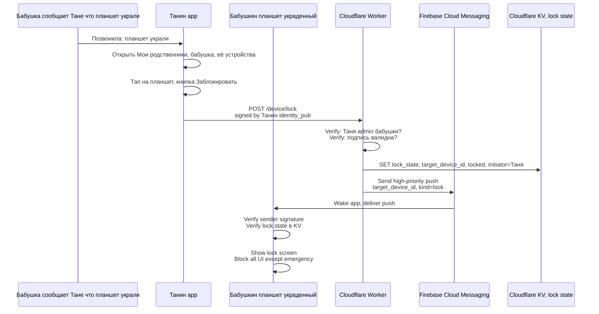
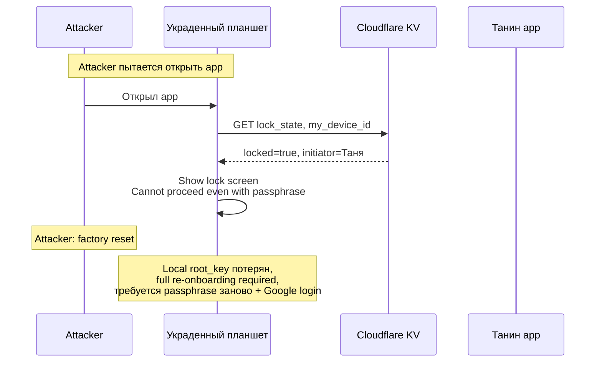
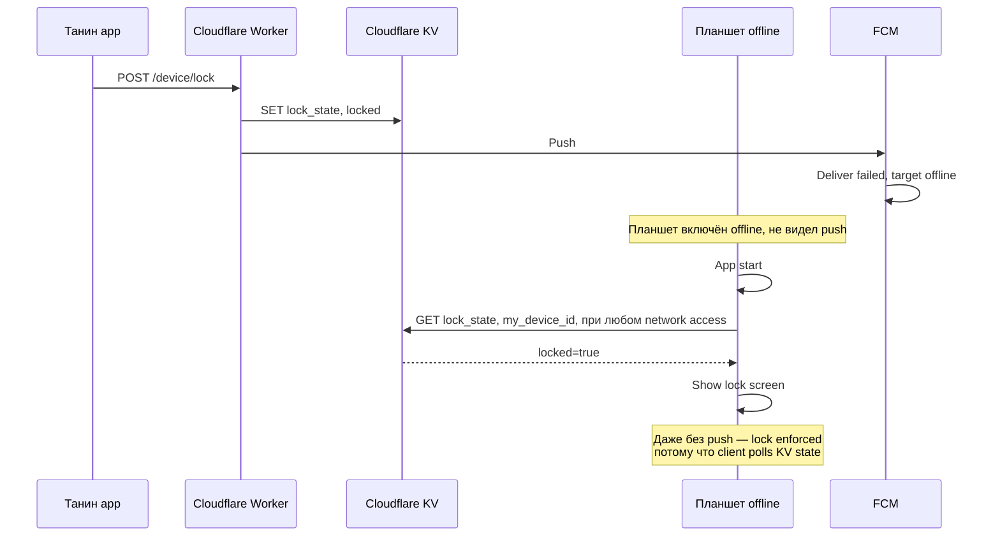
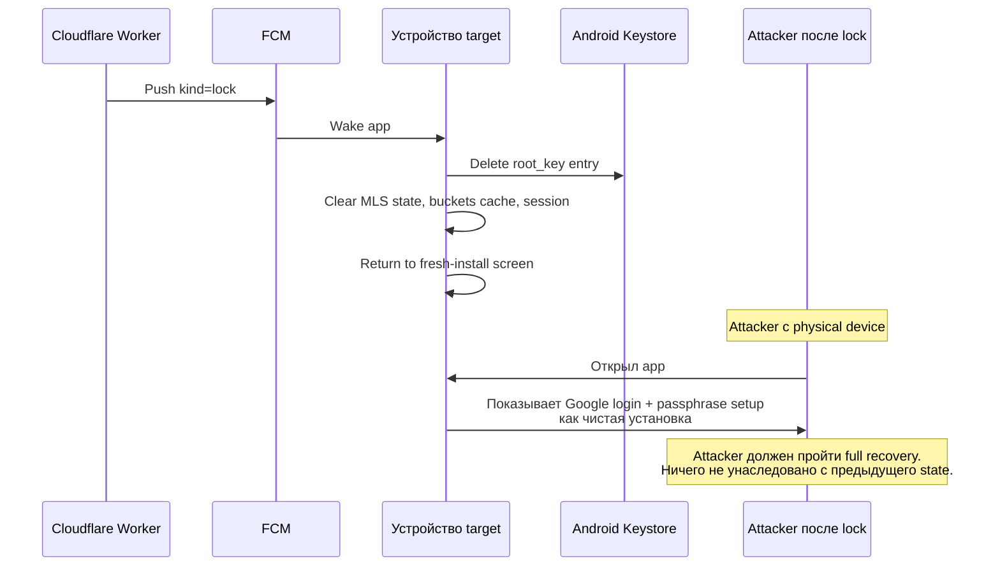

## Description

<!-- SECTION:DESCRIPTION:BEGIN -->

## Что это простыми словами

У бабушки украли планшет. Или сама забыла в такси. Что делать?

**Не то что мы разбираем в TASK-102** (MLS group revoke) — там про «убрать участника из группы». А тут — **заблокировать конкретное физическое устройство**, чтобы вор:
- Не мог открыть app.
- Не мог читать contacts, chat history, фото.
- Даже если знает passphrase — сначала должен factory-reset, что убьёт root_key в Keystore.

Стандартный **MDM pattern** (Mobile Device Management) — Google Find My Device, iOS Find My, Samsung Knox. Мы делаем наш собственный на уровне app.

**Владелец правильно указал** (TASK-102 Session 3): при краже устройства это **главная защита**, важнее чем MLS Remove. Потому что MLS Remove можно обойти re-recovery (Session 2 в TASK-102). Remote lock — нельзя обойти без factory-reset.

## Зачем

При краже/потере устройства нужен быстрый способ его нейтрализовать без ожидания owner'а (пожилой может не сразу понять что произошло). Любой admin (Таня, Петя) должен мочь заблокировать бабушкин планшет удалённо.

Также actionable для owner'а — «мои устройства» экран с кнопкой revoke каждого своего девайса (аналог Google Account Activity).

## Что входит технически (для AI-агента)

**Layers**:
- **`core/` port `RemoteLockService`** — abstract lock/unlock operations.
- **Push channel** (FCM/HMS/MQTT) — доставка lock command'а.
- **`app/`** — lock screen composable, unlock flow.
- **`core/`** — device inventory (какие устройства у user'а есть, идентификаторы).
- **Audit log** (TASK-32) — фиксация lock events.

**Не в scope**:
- Remote wipe (crypto-erase local storage) — Phase-3+.
- Location tracking — не наш use case.
- SIM lock / phone-level lock — outside app scope, Google Find My Device делает это.

**В scope открытые вопросы** (см. SECTION:DISCUSSION):
- Кто может trigger lock (admin, owner, both)?
- Как sending device аутентифицируется для lock request?
- Что делает locked app (только показывает lock screen, wipe local state, что с SOS кнопкой)?
- Как unlock (passphrase, remote authorize, 2FA)?
- Interaction с Google Find My Device (дополняем vs заменяем)?
- Что если lock command не доходит (offline device, push потерян)?

## Состояние

Decided 2026-07-02 (Session 1). Status → Draft. Ключевая поправка от владельца: remote lock = crypto defense (не UX), через full logout + Keystore wipe. Reuse existing recovery flow для unlock. 5 preset fields в `PresetV2.deviceLock` namespace. Downstream tasks добавляют `dependencies: [TASK-103]` при следующем touch.

<!-- SECTION:DESCRIPTION:END -->

## Acceptance Criteria
<!-- AC:BEGIN -->
- [x] #1 [hand] Session 1 mentor discussion: map + terms + clarifying questions
- [x] #2 [hand] Owner ответил на все clarifying questions
- [x] #3 [hand] Best path выбран (logout+Keystore-wipe = crypto defense, reuse recovery flow, 5 preset fields)
- [x] #4 [hand] Decision block заполнен (English, immutable)
- [x] #5 [hand] Status → Draft
- [ ] #6 [hand] Downstream tasks (TASK-6, 24, 25, 32, 16) уведомлены о `dependencies: [TASK-103]` (выполняется при их touch)
<!-- AC:END -->

## Discussion

<!-- SECTION:DISCUSSION:BEGIN -->

### Session 1 (2026-07-02, mentor skill invoked)

#### A.1 Что за область

**Remote app lock** — app-level defense при краже/потере устройства. Мы отправляем lock command по push каналу конкретному устройству, оно блокирует UI, требует re-authorization для разблокировки. Стандартный **MDM pattern** (Mobile Device Management), но на уровне app, а не OS.

Ключевое отличие от TASK-102 (MLS revoke): TASK-102 меняет **группу** (кто в MLS группе), TASK-103 меняет **состояние устройства** (заблокировано или нет). Обе операции могут применяться параллельно (kick from group + lock device), или независимо.

#### A.2 Карта темы

**Основной happy path** — admin блокирует украденное устройство owner'а:



**Adversarial path** — attacker украл устройство и знает passphrase (Session 2 TASK-102 сценарий):



**Failure path** — offline device не получает push:



**Layers где ложится код**:

- **`core/` port `DeviceLockService`** — abstract lock/unlock operations, poll lock state.
- **`push-worker/`** — new endpoint `POST /device/lock` + KV state storage.
- **`app/`** — lock screen composable, unlock flow UI.
- **`core/` port `DeviceInventory`** — device_id + fingerprint per registered device (owner's own + admin's).
- **Audit log** (TASK-32) — фиксация lock events.

#### A.3 Главное для новичка

1. **Remote lock — не crypto защита, а UX защита**. Она НЕ мешает attacker'у который уже extracted root_key (Session 2 attack). Она **замедляет** attacker'а — заставляет factory-reset (терять доступ к нашему app полностью).
2. **Lock state живёт на server** (Cloudflare KV или Durable Object). Client polls его при каждом старте app и при каждой network operation. Push — только для скорости; **защита работает и без push**.
3. **Passphrase не unlock'ает locked device**. Иначе attacker с passphrase просто unlock'ит. Unlock требует **другой** trigger — remote authorize от owner'а через другое устройство, 2FA код, или physical re-pairing (нужно QR bab's phone).
4. **Google Find My Device — orthogonal**. Google's работает на system level (весь phone). Наш — на app level (только launcher). Владельцы могут иметь оба; мы **дополняем**, не заменяем.
5. **Locked ≠ wiped**. Lock — блокирует UI. Wipe — уничтожает local encrypted state. Мы делаем lock, wipe оставляем на Google Find My Device или future feature.

#### A.4 Ключевые термины

- **Device identifier** — уникальный ID устройства в системе. Обычно (Firebase installation ID XOR our internal device_uuid) для anti-spoofing. Публикуется в MLS KeyPackage.
- **Lock state** — булеан на server (`locked=true|false`) + metadata (who locked, when, reason). Хранится в Cloudflare KV или Durable Object.
- **Lock command** — push notification к target device kind=`lock`. Signed by initiator's identity_pub, verified locally + serverside.
- **Locked screen** — UI state в app: skeleton screen, «Устройство заблокировано. Обратитесь к [initiator name]».
- **Unlock authorization** — процесс разблокировки. Не то же самое что recovery. Требует явного действия initiator'а или owner'а.
- **Wake lock** — Android mechanism для waking app по FCM даже при doze mode. Требуется для timely lock delivery.

#### A.5 Уточняющие вопросы

**Q1 — кто может trigger lock?**

Возможные политики:
- **A. Only owner для своих devices**: бабушка может lock только свои устройства через другое своё устройство. Проблема: если owner потерял primary device, кто lock'ает?
- **B. Only admin для owner's devices**: family caretakers защищают elderly. Owner не должен разбираться с lock complexity. Проблема: rogue admin locks владельца.
- **C. Owner для своих + admin для owner's**: все могут lock всё что не свои. Наиболее flexible. Rogue admin возможен, но family self-corrects.
- **D. Owner для своих + admin для owner's + admin для другого admin's** (mutual admin lock): для симметрии с TASK-102 (any admin can revoke any admin).

**Зачем спрашиваю**: определяет policy engine `DeviceLockPolicy` port. Также взаимодействует с TASK-102 revoke policy (там any-admin can revoke any-admin).

---

**Q2 — что показывает locked device?**

Три уровня блокировки:
- **A. Hard lock**: только lock screen. Ничего доступно. Attacker не может позвонить в SOS.
- **B. Soft lock**: lock screen + emergency SOS button работает. Fallback для случаев «lock triggered ошибочно, planshet у бабушки, ей нужен SOS».
- **C. Configurable**: initiator при lock request выбирает уровень («заблокировать» vs «заблокировать но оставить SOS»).

**Зачем спрашиваю**: safety trade-off. Elderly-primary — SOS может спасти жизнь. Но locked device с SOS — attacker может trigger'ить fake SOS (false alarm или для отвлечения family).

---

**Q3 — как unlock?**

- **A. Passphrase на locked device** — простой, но attacker с passphrase unlock'ит. Ослабляет всю защиту.
- **B. Remote authorize** — bab's другое устройство (или Танин app) отправляет `POST /device/unlock`. Требует online.
- **C. 2FA код** — SMS/email/authenticator app. Требует external channel.
- **D. Physical re-pairing** — устройство должно сгенерировать новый identity → пройти QR pairing с admin'ом. Полный reset.
- **E. Combo**: passphrase + remote authorize; или passphrase + 2FA.

**Зачем спрашиваю**: определяет unlock UX. E — самая надёжная, но сложная. A — самая простая, но небезопасная.

---

**Q4 — что делает locked device с local state?**

- **A. Preserve everything**: locked = hide UI, local data всё на месте. При unlock — instant restore.
- **B. Wipe crypto keys**: Keystore entries deleted, MLS state deleted. При unlock — required full re-onboarding.
- **C. Wipe UI cache только**: content cache cleared, keys preserved. При unlock — sync from server + re-decrypt.
- **D. Hybrid**: lock preserves state, но если device offline > N days с pending lock — auto-wipe.

**Зачем спрашиваю**: security vs UX. B — самая безопасная (defense against rooted device), но unlock = start from scratch. A — простая UX. Q-09 Decision уже сказал: история потеряна anyway при recovery. Значит C/D возможно приемлемо.

---

**Q5 — offline device + coexistence с Google Find My Device?**

**Offline device**:
- **A. Pending lock**: при следующем network → apply. Но attacker может быть уже украл root_key за время offline.
- **B. Auto-lock after N days offline**: precaution. Bab's device случайно долго offline → auto-lock и она не понимает почему.
- **C. Both** — pending + auto-lock after 30 days.

**Google Find My Device**:
- **A. Recommend enable**: в setup wizard явно показать «Включи Google Find My Device для дополнительной защиты». Наш lock дополняет.
- **B. Ignore**: не упоминаем. Обычно у пожилых Google Find My уже включён по default.
- **C. Integrate**: наш «revoke device» button в Танином app также trigger'ит Google Find My lock (если есть API). Complex integration.

**Зачем спрашиваю**: обе темы про defense in depth. Определяет product positioning (мы главная защита или дополнительная).

---

#### A.6 Гипотеза рекомендации (до ответов)

Наиболее вероятная рекомендация:

- **Q1**: **C** (owner для своих + admin для owner's). Симметрия с TASK-102, family caretaker use case.
- **Q2**: **B** (soft lock с SOS кнопкой). Elderly-primary, false-positive alarms приемлемы vs потеря life.
- **Q3**: **E** (combo: passphrase + remote authorize). Passphrase alone не безопасно, remote alone требует online для legit users.
- **Q4**: **C** (wipe UI cache, preserve keys). Balance между быстрым unlock и defense. Q-09 Decision already accepts history loss.
- **Q5**: Offline **C** (pending + auto-lock after 30 days). Google Find My **A** (recommend в wizard, orthogonal).

Ответы Q1-Q5 подтвердят или скорректируют.

### Session 1 — ответы владельца + preset-refactor (важный pivot)

Владелец после Q2 остановил обсуждение и указал важное:

> «Многие вопросы уже можно выносить в пресеты! Что бы это было не жестко зашито. И предыдущие вопросы тоже что обсуждали, там где не связано с криптой напрямую, где есть смысл, можно выносить в пресеты/настройки/визарды.»

**Правильное разделение** — Decision должен разграничивать:

- **Архитектурные инварианты**: hardcoded, одинаковы для всех presets. Пример: «lock state живёт на сервере», «unlock требует authorization», «push channel + polling fallback». Крипто-безопасность и protocol shape.
- **Preset-параметризуемые поля**: значения в `PresetV2` JSON, разные per user segment. Пример: «блокировать ли SOS кнопку», «через сколько дней offline auto-lock», «требуется ли 2FA при unlock».

MVP ships с **family-default preset** (наши reasonable defaults hardcoded в preset JSON). Phase-3 добавит `clinic-preset` / `self-managed-preset` с другими значениями. Architecture должна это поддержать с day 1 (rule 9 shareability + TASK-16 preset schema evolution).

#### Ответы владельца на Q1-Q2

**Q1 (кто может trigger lock)**:
- **Ответ**: admin для owner's devices + owner для своих. **По device_id, не по account** — можно kick один конкретный девайс.
- Это гибрид C из моих вариантов, с уточнением: **granularity = per device**, не «all devices of person». Позволяет «revoke только planshet, phone продолжает работать».

**Q2 (locked screen behavior)**:
- **Ответ**: **C (Configurable)** через preset field.
- Family preset: soft lock с SOS (спасение жизни > false alarm risk).
- Clinic preset: возможно hard lock (не наш выбор, но preset supports).
- Инвариант: **механизм** lock работает; **что показывает** — из preset.

#### Preset-refactor Q3-Q5

Теперь пересматриваю Q3-Q5 с preset-lens'ом:

**Q3 (unlock mechanism)**:

**Архитектурный инвариант**: passphrase alone не unlock'ает (иначе attacker с passphrase unlock'ит).

**Preset field** `unlockMethod: enum`:
- `passphrase + remote_authorize` (family-default: passphrase + tap on admin's app).
- `passphrase + 2fa` (paranoid preset: passphrase + SMS code).
- `physical_repairing_only` (highest security: unlock only via new QR pairing from owner's other device).

MVP реализует family-default, wire format supports others.

---

**Q4 (local state on lock)**:

**Архитектурный инвариант**: keys в Keystore защищены от extraction (Android property, не наш controls).

**Preset field** `lockLocalStatePolicy: enum`:
- `preserve` (family-default: fast unlock, UX priority).
- `wipe_cache` (compromise: content erased, keys preserved).
- `wipe_all` (highest security: full re-onboarding on unlock).

MVP hardcodes `preserve` в family-default preset. Architecture supports switching.

---

**Q5 (offline handling + Google Find My)**:

**Архитектурные инварианты**:
- Client polls KV lock_state на каждой network operation (безусловно).
- Google Find My — orthogonal, не integrate (не наша defense).

**Preset field** `offlineAutoLockDays: int | null`:
- Family-default: `null` (никогда не auto-lock).
- Clinic preset: `30` (auto-lock после 30 дней).

**Preset field** `wizardRecommendsGoogleFindMy: boolean`:
- Family-default: `true`.
- Clinic preset: `false` (может быть device не Google-registered).

#### Список preset fields из этого task'а

Финально для TASK-103 (в preset schema v2 через TASK-16):

```yaml
# PresetV2 → deviceLock (pre-Session-1-Q3-Q5 sketch — see UPDATED below):
# lockLocalStatePolicy field DROPPED after Q4 pivot to "one mechanism = logout".
```

**UPDATED after Session 1 answers Q3-Q5** — see финальный YAML в секции ниже "Финальный список preset fields для TASK-103".

#### Мета-урок для всех mentor-сессий

**Правило разделения** (записать в CLAUDE.md rule 11 или backlog-task-format):

> При написании Decision block'а — для каждого варианта выбора проверить:
> 1. Зависит ли значение от target user segment (family / clinic / self / B2B)?
> 2. Если ДА — это **preset field**, не архитектурный invariant.
> 3. В Decision block указать: (a) архитектурные invariants hardcoded; (b) preset fields с family-default values.
>
> Иначе — рискуем hardcodить «family assumption» и потом ломать при clinic-preset adoption.

Retrospective для past tasks:

- **TASK-100** (history backup): backup infrastructure = architectural. Wizard formulation about history loss = preset field (family=прямое, clinic=professional wording).
- **TASK-101** (peer confirmation on recovery): auto-add mechanism = architectural. Notification presentation (push+banner vs banner-only) = preset field.
- **TASK-102** (MLS revoke policy): three-tier language + MLS Remove operation = architectural. Who-can-revoke-whom = preset field (family=any-admin, clinic=restricted-by-role, self=owner-only). Уже reserved через `other` tier.

Все три Decision blocks НЕ противоречат preset-параметризации — они specify MVP defaults + reserved architecture. Preset extension = additive Phase-3+.

### Session 1 — ответы на Q3-Q5 + важная поправка от владельца

#### Поправка к моему тезису «Remote lock — не crypto защита»

Владелец справедливо поставил под вопрос: **«ты считаешь что от нас возможно только UX защита?»**

Я **ошибся**. Если lock реализован **как полный логаут** (Q4 ответ владельца) с **удалением Keystore entries** — это **crypto защита**, не UX.

**Правильная модель**:



**Ключевое**: Keystore entry **уничтожен**, root_key больше не восстановим на этом устройстве без passphrase. Attacker имеет ту же surface что при краже чистого нового телефона.

**Это сильнее чем UX lock**. Признаю ошибку в Session 1 A.3 «main-thing про новичка».

#### Ответы Q3-Q5

**Q3 (unlock mechanism)**:

Владелец: «зачем это сейчас обсуждать? давай сейчас только фраза, но что бы потом можно было добавить еще что то».

**Trans**: MVP unlock = passphrase-only через standard recovery flow. Preset field supports future options.

- **Architectural invariant**: unlock = **full recovery flow reuse** (те же screens, что и при setup на новом устройстве). Nothing new to design.
- **Preset field** `unlockMethod: enum`:
  - `passphrase_recovery_only` (family MVP default — просто фраза восстановления).
  - `passphrase_plus_remote_authorize` (future preset).
  - `passphrase_plus_2fa` (future preset).
  - `physical_repairing` (future preset — highest security).

Wire format schema-versioned, MVP реализует только `passphrase_recovery_only`.

---

**Q4 (local state on lock)**:

Владелец: «если не делать никаких доп локов на сервере, а просто сделать логаут. Тогда потом стандартные шаги, в том числе авторизация, фраза восстановление. Те же экраны, ничего нового не надо придумывать».

**Trans**: lock = **полный logout**. Wipe **всё** (root_key, MLS state, buckets, session). Reuse existing recovery screens.

- **Architectural invariant**: lock command execution = `logout()` (delete Keystore + clear all app state).
- **No preset field** — это единая механика. Preset уровень granularity (`preserve` vs `wipe_cache`) убран как overengineering.
- **Trade-off**: unlock требует **полный** re-onboarding (passphrase + Google + wait for MLS Add commit). Acceptable потому что защита сильная и mechanic reuses existing flow.

**Q4 pivot от моих гипотез**: я предлагал `lockLocalStatePolicy: enum` preset field. Владелец справедливо упростил — один mechanism, никаких настроек. Правильнее.

---

**Q5 (offline device + Google Find My positioning)**:

Владелец на offline attacker: «пушить можно, но это просто для ускорения, и то если есть сеть, будем считать что злоумышленник отключил сразу сеть. Что тогда?»

**Мой честный ответ**:
- Lock command не приходит → app продолжает работать локально пока не сходит в сеть.
- **Attacker получает access к current Profile snapshot** (контакты, тайлы, темы). История не accessible (TASK-100 Decision).
- **Keystore hardware-backed** на современных Android (StrongBox для API 28+, TEE для старых) → root_key extraction требует advanced attack (rooted device + specific exploits).
- **Preset defense** `offlineAutoLockDays`: если device не sync'ится с сервером N дней подряд → local logout автоматически. Family=null (никогда), clinic=30 дней.
- **MVP accepted trade-off**: offline attack window = current Profile snapshot read. Дальше требует advanced attack или ожидание network.

- **Architectural invariant**: client `pollLockStateOnEveryNetworkOperation()` — при любом network access проверяем lock state. Push только для скорости.
- **Preset field** `offlineAutoLockDays: int | null` (family=null, clinic=30).

Владелец на Google Find My: «можно ли это тоже вынести в сеттингс?»

- **Preset field** `googleFindMyIntegration: enum`:
  - `recommend_in_wizard` (family default).
  - `ignore` (не упоминать).
  - `enforce_dual_lock` (Phase-3 clinic possibility — наш lock + Google Find My triggered simultaneously if API allows).

Wire format supports, MVP реализует `recommend_in_wizard`.

#### Финальный список preset fields для TASK-103

```yaml
# PresetV2 → deviceLock:
deviceLock:
  # Architectural invariants (not in preset — hardcoded)
  # - lockTriggerRequiresSignedRequest (always)
  # - clientPollsLockStateOnNetworkOperation (always)
  # - unlockIsFullRecoveryFlowReuse (always)
  # - lockExecutionDeletesKeystoreAndClearsState (always)

  # Preset-parameterizable
  lockTriggerAuthPolicy: "admin_and_owner_by_device"  # or "owner_only", "admin_only"
  lockScreenBehavior: "soft_lock_with_sos"  # or "hard_lock", "no_lock"
  unlockMethod: "passphrase_recovery_only"  # future: "passphrase_plus_remote_authorize", etc.
  offlineAutoLockDays: null  # family=null, clinic=30
  googleFindMyIntegration: "recommend_in_wizard"  # or "ignore", "enforce_dual_lock"
```

### Session 1 closed → Part B

#### B.1 Best path

**Remote app lock = signed lock command → logout + Keystore wipe → app returns to fresh-install state → user must full-recover to regain access**.

- Push via FCM для скорости (не обязательное).
- Client polls lock state на каждой network operation — fallback без push.
- Unlock = existing recovery flow (passphrase + Google login + MLS re-Add).
- Preset-параметризация 5 полей (см. above).

#### B.2 Альтернативы (отклонены)

- ~~UX-only lock~~ — слабее чем crypto lock, отклонено владельцем (правильно).
- ~~Preserve local state с UI lock~~ — усложняет unlock, weak defense against rooted device.
- ~~Separate unlock screens~~ — reuse recovery flow simpler.

#### B.3 Adjacent concerns

1. **Offline attacker получает current Profile snapshot** до auto-lock timeout. Accepted MVP trade-off. Mitigated by preset `offlineAutoLockDays` для paranoid users.
2. **Legitimate offline user** (бабушка в поездке без wifi 40 дней) при clinic preset triggers auto-lock. UX pain для legit user. Preset must be tuned для target segment.
3. **Rate limit lock commands** — attacker с compromised admin identity может spam lock all бабушкиных devices. Требуется server-side rate limit (тот же `KEYPACKAGE-RATELIMIT-001` scope, extended).
4. **Race condition**: user recovering on new device while old device still working → attacker sends lock during recovery? MLS Add commit + lock arrive → conflicting operations. Requires ordering rules (out of scope, tactical).

### Decision (English, immutable) 🔒

**Choice**: Remote app lock is a **cryptographic defense**, not merely UX. Lock command execution performs a **full app logout**: Keystore entries containing root_key are deleted, all MLS state cleared, all buckets cache purged, session invalidated. The device returns to fresh-install screen; unlock is the standard recovery flow (Google login + passphrase entry), reusing existing screens with no new UI. Lock command delivery uses FCM push for speed but falls back to client-side poll of server-held lock state on every network operation — defense works without push. Attacker with physical device after lock arrives cannot access anything without completing full recovery, which requires the passphrase they may or may not have.

Five preset-parameterizable fields govern policy variation across user segments (family / clinic / self-managed / B2B): `lockTriggerAuthPolicy`, `lockScreenBehavior`, `unlockMethod`, `offlineAutoLockDays`, `googleFindMyIntegration`. MVP ships with family-default values hardcoded in bundled preset per rule 9 shareability + TASK-16 preset schema evolution.

**Rationale**: Full logout with Keystore wipe elevates the defense from UX-only (hide UI, weak against rooted device) to cryptographic (root_key mathematically inaccessible without passphrase). Reusing existing recovery flow for unlock is Article XI (Minimum Viable Architecture) — no new screens, no new mechanisms. Preset-parameterization of behavior variants (SOS on locked screen, offline timeout, unlock strictness) enables Phase-3 clinic / B2B adoption without architectural rework per rule 9. Owner-corrected the initial "UX defense only" framing — the logout mechanism is genuinely cryptographic. Offline attack window is bounded to current Profile snapshot read (history already inaccessible per TASK-100 Decision), acceptable for elderly-primary threat model.

**Applies to**: TASK-6 (root key hierarchy — includes Keystore wipe operation), TASK-24 (device inventory sync — device list required for lock target selection UI), TASK-25 (multi-app cohabitation — lock affects one app; other apps in cohabitation chain unaffected unless we chain the mechanism, out of scope), TASK-32 (audit log — records who / when / target_device_id / method for lock events), TASK-16 (preset schema evolution — adds `deviceLock` namespace with 5 fields), TASK-102 (revoke policy — orthogonal but symmetric UX; lock and revoke may be combined in single UI action for "stolen device").

**Trade-offs accepted**:
- Attacker with physical device offline reads current Profile snapshot until online sync or auto-lock timeout (whichever first). Not mitigated cryptographically; mitigated by preset `offlineAutoLockDays` and by TASK-100 Decision denying history access anyway.
- Legitimate long-offline users (elderly on trips, poor connectivity) with strict clinic preset (`offlineAutoLockDays: 30`) may auto-lock unexpectedly. UX pain; requires preset tuning per target segment.
- Unlock requires full recovery flow (passphrase + Google login) — no fast-unlock for accidental locks. Accepted for defense strength.
- Rooted device before lock arrival: attacker can potentially extract root_key from Keystore via specific hardware exploits. StrongBox (API 28+) makes this very hard; older TEE-only devices weaker. Accepted for elderly-primary threat model (not nation-state).
- Lock command signing requires admin identity — compromised admin identity can spam-lock all owner's devices. Requires server-side rate limit (out of scope, extends `KEYPACKAGE-RATELIMIT-001` scope).

**Exit ramp**:
- Add `unlockMethod` presets for high-security segments: `passphrase_plus_remote_authorize`, `passphrase_plus_2fa`, `physical_repairing_only`. Additive to preset schema per TASK-16. Estimated effort: 2-3 weeks per new method.
- Add cryptographic "wipe-verification token" flow: after lock, server verifies device confirmed wipe via signed acknowledgment. Prevents "app pretended to logout but didn't". Phase-3+. Estimated effort: 1 week.
- Integrate with Google Find My Device API (`enforce_dual_lock` preset value): our app-level lock triggers OS-level lock simultaneously. Requires OEM cooperation for reliable API. Phase-3+ pilot with clinic segment. Estimated effort: 3-4 weeks.
- Server-side lock command rate limit: extension of `KEYPACKAGE-RATELIMIT-001` scope. Estimated effort: additive 2-3 days on existing rate limit infrastructure.

<!-- SECTION:DISCUSSION:END -->

## Implementation Plan
<!-- SECTION:PLAN:BEGIN -->
_(pending — feature-tasks используют Decision block выше)_

### Decision (English, immutable) 🔒

_(pending — заполняется после Session 1 answers + Part B)_

### Decision (English, immutable) 🔒

_(pending — заполняется когда Session 1 закончится)_

<!-- SECTION:DISCUSSION:END -->

## Implementation Plan
<!-- SECTION:PLAN:BEGIN -->
_(pending)_
<!-- SECTION:PLAN:END -->
