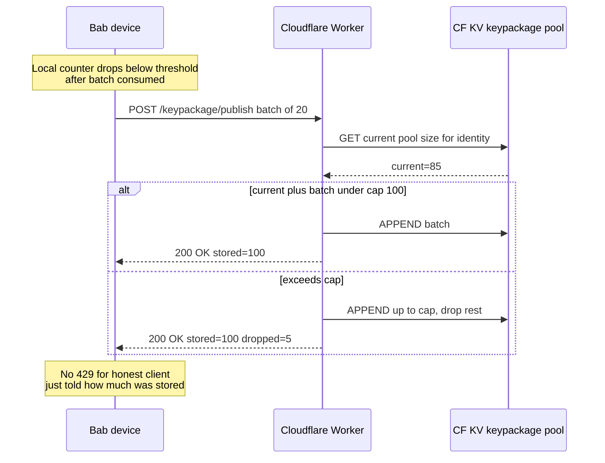
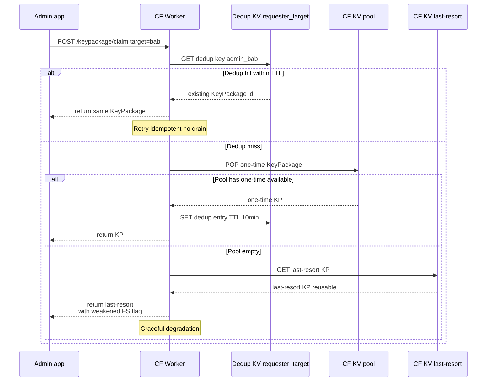
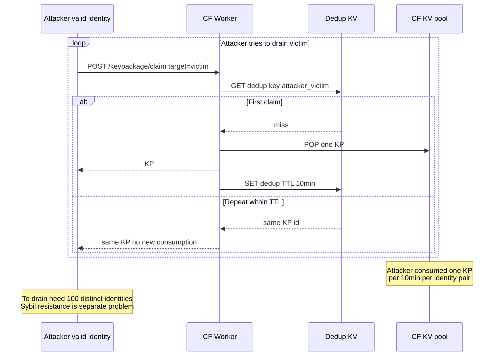
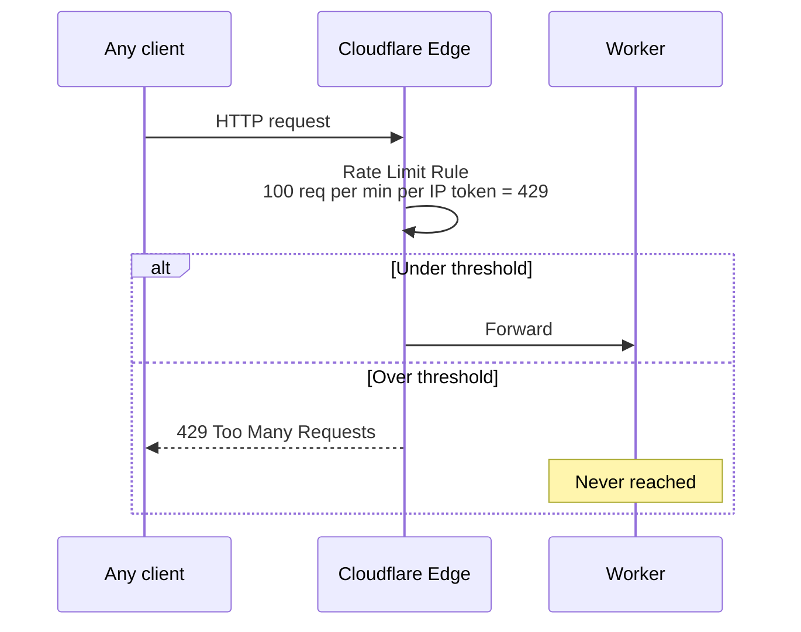

## Description

<!-- SECTION:DESCRIPTION:BEGIN -->

## Что это простыми словами

**KeyPackage** — маленький «конверт-приглашение» в MLS (Messaging Layer Security, наш крипто-протокол групповых чатов). Каждое устройство пользователя заранее публикует **пачку** таких конвертов на сервер. Когда кто-то хочет добавить этого пользователя в группу — берёт **один** конверт с сервера, использует его, конверт **сгорает** (single-use — так работает forward secrecy).

Если конверты кончились — пользователя нельзя добавить в новую группу пока его устройство не выложит свежую пачку.

**Что здесь идёт не так без rate limit'а**:

1. **Producer-flood**: злоумышленник, у которого валидная identity (или compromised device), спамит `POST /keypackage/publish` — переполняет наш Cloudflare KV storage.
2. **Consumer-drain**: злоумышленник массово тянет KeyPackages жертвы через `GET /keypackage/consume` (даже не добавляя её в реальные группы), выжигает её запас. Пока устройство жертвы не выложит новую пачку — её нельзя добавить нигде.
3. **Auto-add abuse (тянется из [TASK-101](task-101%20-%20Decision-Peer-confirmation-on-recovery.md))**: recovered-identity attacker публикует свои KeyPackages и рассчитывает быть auto-added; rate limit ограничивает скорость такой атаки.
4. **Pairing abuse (тянется из TASK-67)**: pairing flow claim'ит KeyPackage — без rate limit'а массовый scan pairing token'ов может распылить чужие KeyPackages.

## Зачем

Server-side rate limit — **первая линия обороны** для MLS-подсистемы (независимо от identity trust). Разгружает как минимум четыре downstream task'а (TASK-67 pairing abuse, TASK-101 recovered-identity attacker, TASK-103 remote lock rate-limit, будущий TASK-42 group encryption).

Scope небольшой (single decision, primarily server-side), может быть закрыт за одну mentor-сессию.

## Что входит технически (для AI-агента)

**Layers**:
- **`push-worker/`** — endpoints `POST /keypackage/publish` + `GET /keypackage/consume`; rate limit middleware.
- **`core/` port `KeyPackagePool`** — client-side buffer, ретраит на 429.
- **`app/`** — практически transparent для пользователя (rate limit только «внутренний»).
- **Preset field(s)** в PresetV2 (TASK-16) — сегмент-зависимые лимиты.

**Не в scope**:
- Full MLS protocol implementation — отдельный трек (TASK-58).
- Sybil resistance / captcha / proof-of-work — не наша угроза в MVP.
- Cross-identity flood detection (attacker с 100 identity) — parked как «Phase-3+ Durable Objects concrete design».

**В scope открытые вопросы** (см. SECTION:DISCUSSION):
- Producer или consumer rate limit — оба?
- Dimension — per identity / device / IP?
- Rate vs pool cap?
- 429 reject или queue?
- Last-resort key при exhaustion?
- Что параметризовать пресетом?

## Состояние

**Paused 2026-07-02** — Session 1 Part A v2 presented (Q1'-Q5' pending owner answers). Пауза для TASK-105 (Server-side abuse defense baseline) — владелец surfaced cross-cutting concern «GET /keypackage/consume — лишь частный случай, надо всё проверять». TASK-104 наследует baseline TASK-105 и добавляет KeyPackage-specific choices.

Resume когда: TASK-105 Decision block заполнен и status → Draft. Тогда TASK-104 Session 2 продолжит с Q1'-Q5' в контексте baseline'а (некоторые вопросы могут упроститься — например Q4' про Cloudflare edge rules может быть уже решён на TASK-105 уровне).

<!-- SECTION:DESCRIPTION:END -->

## Acceptance Criteria
<!-- AC:BEGIN -->
- [x] #1 [hand] Session 1 mentor discussion: map + terms + clarifying questions (v1 retracted, v2 Signal-inspired hybrid after industry research)
- [x] #2 [hand] Owner ответил (Q1'=A, Q2'=D, Q3'=D; Q4'/Q5' inherited из TASK-105 baseline)
- [x] #3 [hand] Best path выбран (Signal-inspired hybrid: pool cap + claim dedup + last-resort; 4 preset fields в PresetV2.mls; architectural invariants отдельно)
- [x] #4 [hand] Decision block заполнен (English, immutable) — 5 частей: mechanisms + preset fields + invariants + contracts + domain isolation
- [x] #5 [hand] Status → Draft
- [ ] #6 [hand] Downstream tasks (TASK-67, TASK-42, TASK-40) уведомлены о `dependencies: [TASK-104]` (выполняется при их touch)
<!-- AC:END -->

## Discussion

<!-- SECTION:DISCUSSION:BEGIN -->

### Session 1 (2026-07-02, mentor skill invoked)

#### Короткий контекст паузы (для владельца)

Первую версию Part A я откатил. Я построил её на общей интуиции «сервер считает запросы, кто много — 429, всё». Владелец справедливо остановил вопросом: **«так работает WhatsApp? ты сделал research?»**. Не сделал. Откатил и провёл сверку с промсистемами (Signal, WhatsApp, Wire, Matrix). Ниже — что реально делают в индустрии, и версия Part A v2, построенная на этой сверке.

Ещё позже владелец увидел бо́льший gap: «GET /keypackage/consume — лишь частный случай, надо всё что приходит на сервер, не доверять». Это уже cross-cutting concern про весь сервер, не про KeyPackage. Заведён отдельный TASK-105 (baseline defense для всех endpoint'ов), TASK-104 поставлен на паузу и ждёт TASK-105 Decision.

#### Как реально устроено в промсистемах (без жаргона)

**Signal / WhatsApp.** У каждого пользователя три вида ключей:
- **Identity key** — долгосрочный, не rotate'ится (как публичный «паспорт» пользователя).
- **Signed pre-key** — переиспользуемый, обновляется примерно раз в неделю. Подписан identity key.
- **Одноразовые pre-keys** — single-use, кладутся на сервер батчами (~100 штук).

Когда Алиса впервые пишет Бобу, сервер возвращает Алисе связку «identity + signed pre-key + один одноразовый». Если одноразовые у Боба на сервере закончились, возвращается только «identity + signed». Первое сообщение всё равно расшифровывается, но forward secrecy того первого exchange'а чуть слабее (это цена fallback'а).

Как Signal защищает от abuse? Не rate policing. Три структурных приёма:
- **Pool cap only** — максимум N pending одноразовых ключей на пользователя, сервер сам старые вытесняет. Никакого «сколько за час».
- **Consumer dedup** — если один и тот же запросчик подряд просит ключи того же target'а, сервер отдаёт **тот же самый** ключ несколько минут (не выжигает новый). Это защищает жертву от быстрого опустошения.
- **Edge rate limit** — тупой per-IP лимит на уровне nginx/Cloudflare (не в приложении), защита от массового спама.

**Wire** (production MLS с 2022 года). То же самое, но для MLS-протокола: endpoint'ы `/mls/key-packages/self` (publish) и `/mls/key-packages/claim/{userId}` (consume). Заметь глагол **claim**, а не consume — семантика «резервирую и потом использую», не «выжигаю атомарно». Cap ~100, client-driven refill (устройство само публикует свежий batch когда локальный запас < threshold), claim идемпотентен в коротком окне.

**MLS RFC 9420** явно оставляет rate limit «на усмотрение серверной реализации» — не стандартизирует. Но **last-resort key** (reusable fallback ключ на случай exhaustion) — first-class концепт в стандарте, не хак.

**Matrix + MLS** (Element): та же картина.

**Главный inight**: промсистемы дают **structural resilience** (dedup + fallback + cap) вместо **rate policing** (429 velocity limits). Rate policing — это antibot паттерн из веба, не messaging паттерн. Мы должны следовать messaging паттерну.

#### Part A v2 — Signal-inspired hybrid

Ниже — правильная Part A, построенная на industry findings. Owner Q1'-Q5' pending, паузе на TASK-105 (baseline).

##### A.1 Что за область

**Signal-inspired hybrid для KeyPackage lifecycle**. Отказываемся от активного rate-policing («сервер считает сколько раз за час») в пользу **structural resilience** — сервер устроен так, что abuse не даёт attacker'у преимущества и не ломает жертву. Три primary механизма: pool cap, claim dedup, last-resort key. Плюс coarse edge rate limit как orthogonal backstop.

Философский сдвиг: **защита в протоколе / storage-shape, не в middleware**. Меньше кода, ближе к production practice (Signal, Wire, Matrix).

##### A.2 Карта темы

**Producer flow — client-driven refill + pool cap**:



**Consumer flow — claim dedup + last-resort fallback**:



**Adversarial — drain attempt neutralized**:



**Coarse edge defense (orthogonal, zero Worker code)**:



**Layers где ложится код**:

- **`push-worker/`** — 2 endpoints (`publish`, `claim`) + tiny dedup middleware.
- **`core/` port `KeyPackagePool`** — client-side refill scheduler.
- **`core/` port `LastResortKeyManager`** — генерация + rotation last-resort ключа.
- **Cloudflare Dashboard** — Rate Limiting Rules (config, not code).
- **PresetV2** (TASK-16) — pool cap, dedup TTL, last-resort rotation frequency.

##### A.3 Главное для новичка

1. **Мы больше не «rate-limit'им», мы «structurally-resist'им».** Rate policing = «стоп, слишком быстро». Structural resistance = «делай сколько хочешь, но каждый запрос ничего не даёт».
2. **Три оборонительных механизма — независимые, но переплетённые.** Pool cap ограничивает **storage** (нельзя переполнить KV). Claim dedup ограничивает **эффективный drain rate** (retry не выжигает новый). Last-resort key ограничивает **user damage** (жертва не unaddable даже если pool пуст).
3. **Last-resort key — не hack, а MLS RFC 9420 feature.** Reusable key package с флагом `is_last_resort=true`. Rotate'ится редко (say weekly), подписан identity. Не equivalent обычному single-use.
4. **Cloudflare edge rules — free orthogonal backstop.** Zero кода, config в Cloudflare Dashboard. Coarse (per-IP token bucket), но ловит массовый abuse до Worker'а. Exit ramp: если увидим specific pattern — переносим в Worker middleware.
5. **Client-driven refill = trust honest device.** Rogue device может честно опустошить свой pool (не жертвы) — это его проблема, устройство станет unaddable до publish'а. Не наш threat.

##### A.4 Ключевые термины

- **Pool cap** — hard max KeyPackages в KV per identity. Producer stops наращивать когда достиг. **Зачем**: bounds storage cost.
- **Claim dedup** — идемпотентность consume operation в окне TTL по ключу `(requester_id, target_id)`. **Зачем**: retry-safety + drain resistance.
- **Last-resort KeyPackage** — reusable KeyPackage, флаг `is_last_resort=true` в MLS payload. Отдаётся когда one-time pool пуст. **Зачем**: жертва не unaddable при drain / offline / рано после install.
- **Signed pre-key rotation** — periodic rotation last-resort. **Зачем**: bounded blast radius если last-resort private material скомпрометирован.
- **Client-driven refill** — устройство само публикует свежий batch когда local count < threshold. **Зачем**: rate policing не нужен, если producer уже bounded (pool cap).
- **Edge rate limiting** — Cloudflare product feature. Coarse per-IP token bucket. **Зачем**: orthogonal backstop без Worker кода.
- **Weakened forward secrecy** — property того первого MLS Add через last-resort. Если last-resort private later compromised → тот initial exchange расшифровывается. Subsequent MLS messages защищены обычно. **Зачем**: понимать trade-off last-resort'а.

##### A.5 Уточняющие вопросы (Q1'-Q5')

**Q1' — Pool cap only, cap + soft rate hint, или cap + hard rate?**

- **A. Pure cap only** (Signal / Wire way): publisher свободен до cap'а, storage bounded.
- **B. Cap + soft rate hint**: сервер шлёт `X-RateLimit-Advisory: slow-down` header при подозрительной частоте (без reject'а). Клиент по-хорошему backoff'ит. Attacker игнорирует — упирается в cap. Дешёвая observability для future tuning.
- **C. Cap + hard rate**: моё изначальное предложение из Part A v1 (retracted).

**Зачем спрашиваю**: мой bet — **A**. **B** — cheap полумерный вариант если хочешь logs про abuse patterns; не защита, а телеметрия.

---

**Q2' — Claim dedup TTL?**

- **A. 1 minute** — минимальный window abuse'а, но retry по сети может опоздать.
- **B. 10 minutes** — достаточно для network retry + user reconnect'ов.
- **C. Session-long** — максимум drain resistance, complex state.
- **D. Preset field** — family default 10min, clinic может уменьшить до 5min.

**Зачем спрашиваю**: trade-off «дольше = сильнее drain resistance, но больше stale entries в KV». Signal ballpark — минуты. Мой bet — **D** с family 10min.

---

**Q3' — Last-resort key rotation?**

- **A. Weekly rotation**, автоматически client-side.
- **B. On-use rotation** — каждый раз когда last-resort consumed → force publish new immediately (минимальный weakened-FS window).
- **C. Combined**: A (weekly baseline) + B (bump на consume).
- **D. Preset field** rotation frequency (family: weekly; paranoid: daily; clinic: monthly).

**Зачем спрашиваю**: last-resort compromise = weakened FS всех MLS Adds пока не rotate'ится. Weekly = приемлемо для family. Wire делает weekly. Мой bet — **D** с family default weekly + inline `TODO(server-roadmap)` про on-use bump если увидим abuse.

---

**Q4' — Cloudflare edge rate limit — включаем сразу или ставим на «когда увидим abuse»?**

- **A. Включаем в MVP**, конфигурим conservative baseline (say 60 req/min per IP for MLS endpoints).
- **B. Не включаем**, оставляем на ops-response (Cloudflare Rules добавляются post-hoc за 5 минут).
- **C. Включаем + wire в spec.md как visible defence** (в UI не показываем, но в docs явно).

**Зачем спрашиваю**: A — free defense in depth. B — YAGNI если dedup + cap работают. C — best-practice для audit trail. Мой bet — **C**; выключить проще чем впервые включить в кризисе.

---

**Q5' — Что мы сознательно НЕ делаем в MVP (для явного exit ramp'а)?**

Проверь моё понимание:
- **Не делаем**: server-side velocity rate limit, per-device dimension отдельно от identity, Durable Object для глобального счёта, proof-of-work, per-region enforcement.
- **Exit ramps** (inline `TODO(server-roadmap)`):
  - Если mass identity forge (Sybil) → invitation-only signup (blocks TASK-67 abuse).
  - Если dedup TTL protection недостаточна → promote в Durable Object based counter (blocks Q-14 anyway).
  - Если last-resort compromise incident → rotate frequency preset field уже готов, поменять number.

**Зачем спрашиваю**: явно фиксирую что мы **не** решаем сейчас, чтобы Decision block имел чистый scope + exit ramps в [server-roadmap.md](../../docs/dev/server-roadmap.md). Можешь добавить или убрать пункты.

---

##### A.6 Гипотеза рекомендации (до ответов)

- **Q1'**: A (pure pool cap).
- **Q2'**: D (preset field, family 10min).
- **Q3'**: D (preset field, family weekly).
- **Q4'**: C (default-on + documented in spec.md).
- **Q5'**: список выше принят.

**Provisional preset fields** (`PresetV2.mls`):
- `poolCap: int` (family: 100).
- `claimDedupTTLSeconds: int` (family: 600).
- `lastResortRotationDays: int` (family: 7).
- `refillThreshold: int` (family: 20).

### Ответы владельца на Q1'-Q5' (2026-07-02)

**Q1' → A** (pure pool cap only).
**Q2' → D** (preset field, family default 10min claim dedup TTL).
**Q3' → D** (preset field, family default weekly last-resort rotation).
**Q4' → deferred** (владелец: «не знаю»).
**Q5' → deferred** (владелец: «не знаю»).

Q4' и Q5' — операционные, не крипто-выбор. AI-рекомендация ждёт подтверждения владельца:
- **Q4' → C** (Cloudflare edge rate limit включён в MVP + документирован в spec.md; выключить проще, чем впервые включить в кризисе).
- **Q5' → список non-goals принят** (server-side velocity rate, per-device dimension, DO global counter, proof-of-work, per-region enforcement — не делаем; exit ramps фиксируются в server-roadmap.md).

Оба Q4'/Q5' — provisional до Session 2 после TASK-105 (baseline может некоторые пересмотреть).

### Уточнение от владельца — «сервер vs e2e» (2026-07-02)

Владелец задал ключевой mental-model вопрос:

> «Но ведь мы сейчас про e2e? Но ведь сервер должен контролировать лимиты?»

**Ответ: инстинкт правильный, сервер обязан контролировать лимиты, и это не противоречит e2e.**

**Ключевое разделение** (записать в mentor-glossary для future sessions):

- **E2E encryption** отвечает на вопрос **«что зашифровано»** — content сообщений / файлов. Сервер видит только ciphertext (зашифрованный blob), не может прочитать содержимое. Это про **confidentiality of content**.
- **Server-side operational control** отвечает на вопрос **«сколько / кому / когда пропускать»** — rate limits, pool caps, dedup, routing, delivery, presence. Сервер знает «Alice отправила Bob какой-то ciphertext-blob размером N байт в момент T» и enforce'ит лимиты на этот трафик, **но не читает содержимое blob'а**. Это про **abuse prevention / availability**.

Эти два механизма **ортогональны** — не мешают друг другу. Все production e2e-мессенджеры имеют мощные server-side лимиты:
- **WhatsApp** — e2e Signal Protocol + massive server infrastructure с rate limits.
- **Signal** — e2e + Signal-Server с pool cap + consumer dedup + edge rate limits.
- **Wire** — e2e MLS + coordination layer с rate limits.
- **Matrix** — e2e + homeserver с rate limits per endpoint.

**Значит для TASK-104**: основная работа — **серверная** (Cloudflare Worker endpoints + KV state + dedup + cap). Client-side — тонкий refill scheduler + retry на 429. Это правильно. E2E-безопасность MLS-протокола обеспечивается **отдельно** (TASK-58 MLS research + TASK-6 root key hierarchy) — сервер в шифровании не участвует, только в operational layer.

**Значит для TASK-105 (baseline)**: cross-cutting concern «сервер должен контролировать лимиты» — это **ровно то**, что владелец surface'нул. TASK-105 обобщает это на **все** endpoint'ы, не только KeyPackage. TASK-104 — конкретный case внутри baseline.

### Уточнение — что сервер видит про metadata (2026-07-03)

Владелец задал прямой вопрос: **«Сервер знает что Алиса это Алиса, что Боб это Боб, что они в группе — так работают Signal, WhatsApp?»**

Честный ответ: **да, в большинстве случаев, и в нашем design'е — тоже да**. Но с нюансом (см. Signal Sealed Sender ниже).

**Что видит сервер в разных мессенджерах**:

**WhatsApp**:
- Сервер знает **номер телефона** отправителя и получателя. Каждый запрос — с идентификацией.
- Сервер знает **членство в группах** (список участников каждой группы).
- Сервер знает **тайминг** (когда, кому, сколько байт), но **не содержимое**.
- Meta (WhatsApp) явно заявляла: metadata используется для spam / abuse prevention.

**Wire (production MLS)**:
- Сервер знает identity каждого зарегистрированного user'а (аккаунт).
- Сервер видит KeyPackages (per identity), group commit messages (from-to visible, content encrypted).
- Metadata видна полностью.

**Matrix**:
- Homeserver знает sender + recipient + room membership.
- Federation — несколько серверов делятся частичной metadata.

**Signal — исключение** (лучшая metadata privacy в production):
- Для **доставки сообщений** использует **Sealed Sender** (с 2018) — sender identity зашифрован публичным ключом получателя. Сервер видит «сообщение для Bob от АНОНИМА», не знает кто послал.
- Но для **key operations** (fetch pre-keys, add to group, publish keys) sender **всё равно должен быть аутентифицирован**. Сервер знает «сессия X (bound to Alice) запрашивает pre-key Bob'а».
- Group metadata: Signal Private Groups v2 — сервер видит зашифрованное group state, не знает список членов. Но server знает «какой user запрашивает какую group».

**MLS RFC 9420 в общем**:
- KeyPackages публикуются per identity — сервер **обязан** знать identity чтобы их хранить.
- Group operations требуют routing Welcome / Commit messages — сервер знает group_id + participant_ids.
- MLS **не** прячет metadata от Delivery Service. Только content.

**Что видит наш сервер (Cloudflare Worker)** в текущем design'е:

- **Identity** — из JWT (identity_id как claim). Каждый publish/claim запрос идентифицирован.
- **Целевую identity** — из URL или body (target=bab_identity).
- **Тайминг** — timestamps каждой операции.
- **Связь Alice-Bob** — из publish/claim паттерна («Alice claim'ила KeyPackage Bob'а» = вероятно они в общей группе или собираются быть).
- **Группы** — TASK-105 baseline это уточнит; TASK-42 (family group encryption) будет detailed decision.

**Что сервер НЕ видит**:
- Содержимое сообщений (MLS ciphertext).
- Локальные ключи в Keystore устройств.
- Приватные ключи identity (только публичные части).

**Значит для TASK-104**: наш сервер знает identity → **rate limits per identity работают** (это то что владелец правильно surface'нул). Metadata privacy на уровне «Sealed Sender» — **не MVP scope**, это отдельный follow-up decision (parked, вероятно в TASK-105 или новом task'е «Metadata privacy tier»).

### Механизмы объяснённые на Алисе-Бобе (2026-07-03)

Владелец: «Механизмы pool cap / dedup / last-resort — это непонятно». Ниже — конкретный сценарий.

**Setup**:
- Бабушка (у неё планшет) — целевой пользователь.
- Внук Петя (admin у бабушки) — обычный user который добавляет бабушку в семейный чат.
- Attacker — злоумышленник с валидной identity (например compromised device inside legitimate identity, или Sybil identity созданная через тот же signup path).

---

**Механизм 1: Pool cap (потолок на pool)**

Что это: **максимальное количество KeyPackages которое сервер хранит для одного user'а**.

Сценарий:
1. Бабушкин планшет говорит «у меня на сервере есть 85 моих KeyPackages готовых к использованию».
2. Планшет решает добавить свежих 20 (client-driven refill — «мало осталось, надо подпубликовать»).
3. Планшет шлёт `POST /keypackage/publish` с батчем 20 штук.
4. Сервер проверяет: **cap = 100**. Текущий count = 85. 85 + 20 = 105 > 100.
5. Сервер сохраняет первые 15 из батча (доводя до 100), последние 5 отбрасывает.
6. Отвечает планшету: `200 OK, stored=100, dropped=5`. Планшет доволен: cap reached, дальше не публикует.

Что это защищает: **storage abuse**. Attacker с валидной identity не может залить сервер миллионом своих KeyPackages — cap отобьёт. Storage cost bounded.

Что это НЕ защищает: **drain victim'ов**. Cap на pool продюсера не мешает злоумышленнику вычерпывать чужой pool.

---

**Механизм 2: Claim dedup (идемпотентность consume)**

Что это: **если один и тот же запросчик подряд просит KeyPackage того же target'а в короткое окно — сервер отдаёт тот же самый ключ, не выжигает новый**.

Сценарий A (легитимный retry):
1. Петин app хочет добавить бабушку в семейный чат. Шлёт `POST /keypackage/claim, target=babushka`.
2. Сервер: смотрит dedup KV `(petya, babushka)` — записи нет. POP один KeyPackage (скажем KP#42) из бабушкиного pool'а. Возвращает Пете KP#42. **Записывает в dedup KV**: `key=petya:babushka, value=KP#42, TTL=10min`.
3. У Пети моргнула сеть, retry. Шлёт тот же запрос.
4. Сервер: смотрит dedup KV — есть запись `petya:babushka → KP#42`. Возвращает **тот же** KP#42. Бабушкин pool не тронут (все ещё 99, не 98).
5. Через 10 минут запись в dedup KV истекает.

Сценарий B (attacker пытается drain):
1. Attacker с валидной identity `attacker`, шлёт `POST /keypackage/claim, target=babushka`.
2. Сервер: dedup KV `(attacker, babushka)` — записи нет. POP KP#41. Возвращает attacker'у. Записывает dedup.
3. Attacker шлёт **тот же запрос** 100 раз подряд.
4. Сервер каждый раз: dedup KV hit → возвращает **тот же** KP#41. Бабушкин pool потерял только **1** KeyPackage, не 100.
5. Чтобы реально drain'ить бабушку, attacker'у нужно **100 разных identity** — то есть Sybil атака (много фейковых аккаунтов). Это уже отдельная проблема (parked, будет в TASK-67 abuse prevention).

Что это защищает: **drain victim'ов** через retry / spam с одной identity.

Что это НЕ защищает: **Sybil attack** (attacker с 100 identity, каждая claim'ит по разу).

---

**Механизм 3: Last-resort KeyPackage (резервный ключ)**

Что это: **один переиспользуемый KeyPackage** (не single-use), помеченный флагом `is_last_resort=true`. Отдаётся когда one-time pool пуст.

Сценарий:
1. Attacker всё-таки drain'ил бабушкин one-time pool (через Sybil, скажем 100 фейковых identity). Бабушкин one-time pool: **0 KeyPackages**.
2. Петя (легитимный) хочет добавить бабушку в чат. Шлёт claim.
3. Сервер: pool пуст → берёт **last-resort** KeyPackage бабушки, возвращает Пете **с флагом «weakened FS»**.
4. Петин app успешно добавляет бабушку в MLS группу. **Бабушка не становится "unaddable"**.
5. Weakened FS означает: если later attacker украдёт last-resort private key из бабушкиного планшета **И** записал initial handshake — сможет расшифровать **только** этот initial handshake. Все subsequent messages защищены обычным MLS ratcheting.
6. Last-resort ротацируется еженедельно → blast radius bounded одной неделей.

Что это защищает: **user damage** (бабушка не unaddable даже при exhaustion). **Availability priority over strict FS** для одной первой операции.

Trade-off: forward secrecy того первого exchange'а чуть слабее. Приемлемо для family preset (fast unlock, UX priority). Для clinic preset может быть переопределено.

---

**Как три механизма работают вместе** (defense in depth):

- **Pool cap** — bound storage. Attacker не переполнит наш сервер.
- **Claim dedup** — bound effective drain rate. Attacker не сольёт жертву быстрым retry.
- **Last-resort** — bound user damage. Если drain всё-таки удался (Sybil) — жертва не unaddable.

Каждый механизм закрывает свой угол атаки. Ни один не универсален, но вместе они дают полную защиту без active rate policing.

### Research — готовые библиотеки / фреймворки (2026-07-03)

Владелец: «Есть ли готовая механика, фреймворк, библиотека которая закрывает этот кейс? Проведи исследование».

Провёл. Итог: **готовой библиотеки "pool cap + claim dedup + last-resort key management для MLS сервера" нет**. Ни AWS, ни openmls, ни Wire, ни Signal не отдают этот кусок как переиспользуемый модуль. Причины разобраны ниже.

#### MLS client-side libraries — что есть

| Library | Язык | Server components? | Наш stack? | License | Статус |
|---|---|---|---|---|---|
| **[openmls](https://github.com/openmls/openmls)** | Rust | basic demo delivery-service, без rate limit/dedup/last-resort | Rust FFI из Android/Worker | MIT/Apache | Active, WASM support |
| **[mls-rs (AWS Labs)](https://github.com/awslabs/mls-rs)** | Rust | нет | Rust FFI | Apache | Active, WASM, 100% RFC 9420 |
| **[ts-mls](https://github.com/LukaJCB/ts-mls)** | TypeScript | нет | **Cloudflare Workers direct** (Node 20+) | MIT | Client-only, minimal deps |
| **[mls-kotlin](https://github.com/Traderjoe95/mls-kotlin)** | Kotlin | нет | JVM only (**НЕ Android**, НЕ Multiplatform) | MIT | Не готов для нас, roadmap KMP |
| **[MLSpp (Cisco)](https://github.com/cisco/mlspp)** | C++ | нет | JNI из Android | BSD | Active |
| **[mls-go](https://github.com/thomas-vilte/mls-go)** | Go | нет | Наш future Go microservice | MIT | Active |

**Ключевой вывод**: все MLS libraries — **client-only**. Server infrastructure (Delivery Service с pool cap / dedup / last-resort) оставлена на integrator'а.

**Единственный production MLS server open-source**: openmls/delivery-service — это **demo** с memory/sqlite storage, без rate limit / dedup / last-resort. Basic reference, не production-ready.

#### Signal-Server (открытый код, но не MLS)

- [signalapp/Signal-Server](https://github.com/signalapp/Signal-Server) — Java/Dropwizard, **AGPLv3**, actively maintained (5110+ commits).
- Имеет **pool cap + rate limiting + last-resort key logic для Signal Protocol** (не MLS).
- **Проблемы для нас**:
  - AGPLv3 — copyleft, несовместимо с MIT/Apache paths для будущего own-server Go migration (rule 3 one-way door).
  - FoundationDB dependency — tight coupling с proprietary Signal infra.
  - Не Cloudflare Workers-compatible.
  - Signal Protocol ≠ MLS (концепты похожи, endpoint'ы разные).
- **Годится как reference source code** (изучить как они implement dedup + last-resort), не как runtime dependency.

**Official Signal spec** ([signal.org/docs](https://signal.org/docs)) явно упоминает наши три механизма как standard:
- Drain protection: «The protocol acknowledges that one party could maliciously drain another party's one-time prekeys, so **the server should attempt to prevent this, e.g. with rate limits on fetching prekey bundles**».
- Last-resort: «The 'last-resort' prekey is only used when one-time prekeys are not available».
- Rotation: «Bob has a signed last-resort prekey, which he **changes periodically** and signs each time with his identity key».

То есть паттерн — **industry standard**, хорошо задокументирован. Реализация — за нами.

#### Rate limiting в Cloudflare Workers — что есть готового

| Library | Storage | Algorithm | Key type | License | Note |
|---|---|---|---|---|---|
| **[Cloudflare native Rate Limiting API](https://developers.cloudflare.com/workers/runtime-apis/bindings/rate-limit/)** | edge-local | simple sliding-window | **arbitrary (JWT claim OK)** | Cloudflare product | Per-edge-location (не global). Period: 10s или 60s. Free tier. Cloudflare **discourages IP-based**, рекомендует user-ID. |
| **[worker-ratelimit (kpcyrd)](https://github.com/kpcyrd/worker-ratelimit)** | KV | BTree sliding-window | arbitrary | MIT/Apache | Best-effort non-atomic. Free-tier friendly. Rust only. |
| **[worker-kv-rate-limit (edgefirst-dev)](https://github.com/edgefirst-dev/worker-kv-rate-limit)** | KV | wraps CF native | arbitrary | MIT | TypeScript wrapper. |
| **Durable Objects (Cloudflare product)** | DO persistent | any (write your own) | arbitrary | Cloudflare product | **Consistent global** counters. Дороже KV. Рекомендуется Cloudflare для real-time coordination. |

**Ключевой вывод для нашего дизайна**:

- Мы **не должны** самим писать rate limit primitive. Cloudflare native binding покрывает edge-level policing.
- Cloudflare **прямо рекомендует** per-identity (JWT claim) над per-IP — совпадает с нашим hypothesis Q2' в TASK-104 и с baseline TASK-105.
- **Гэп** между «Cloudflare native rate limit» и «нужное нам» = **pool cap + claim dedup + last-resort logic**. Это ~100 строк custom кода в push-worker/, но primitives (KV / RATE_LIMITER binding) готовые.

#### Что мы напишем сами (unavoidable custom)

Компонент | Готовое | Наш код |
---|---|---
MLS client в Android app | mls-rs через Rust FFI (или openmls FFI) | Wrapper `KeyPackagePool` port |
MLS core protocol в Worker | ts-mls (TypeScript, работает в Workers) | Endpoints `/keypackage/publish`, `/keypackage/claim` |
Rate limiting per-identity (edge) | Cloudflare native `env.RATE_LIMITER` binding | Config in `wrangler.toml` (не код) |
Pool cap logic | НЕТ готового | ~30 строк KV wrapper |
Claim dedup logic (10min TTL) | НЕТ готового | ~20 строк KV entry `(requester, target) → KP_id, TTL` |
Last-resort key management + weekly rotation | НЕТ готового | ~50 строк + client-side cron |
JWT verification middleware | Готовое: `jose` npm лib, работает в Workers | Standard middleware, ~15 строк |

**Итого custom код**: ~100 строк server-side + ~200 строк client-side (Android glue) — **МЕНЬШЕ чем если бы мы писали с нуля**. Concepts взяты из Signal spec, primitives — Cloudflare native, MLS protocol — ts-mls.

#### Другие пути (rejected)

- **SaaS**: Matrix.org hosted / Wire cloud / Element hosted — vendor lock, конфликт с CLAUDE.md rule 8 (own-server migration path).
- **Fork Signal-Server и портировать на Workers** — AGPLv3 copyleft (breaks future proprietary distribution), Java→TS полный переписывание, tight coupling с Signal infra. Не стоит.
- **Не делать rate limit вообще (option C из Part A v2)** — Signal spec явно предупреждает против этого. Owner risk если пропустим.

#### Значит

**Для TASK-104 Session 2** (когда resume после TASK-105):
- Custom кода ~100 строк неизбежен, но primitives все готовы (ts-mls + Cloudflare RATE_LIMITER + KV).
- Reference impl для отдельных кусков: openmls/delivery-service (базовая структура endpoints), Signal-Server (dedup pattern в Java — для чтения, не для fork).

**Для TASK-105 Session 1** (baseline decision):
- Rate limit primitive — **Cloudflare native binding** (не пишем свой).
- Storage tier baseline: **in-memory Worker для dev, KV для MVP, Durable Object при next touch** — все три варианта supportable через Cloudflare products.
- JWT library — **jose** (standard в TS/Workers).

### Self-server readiness check (2026-07-03)

Владелец: «Надеюсь это self-server ready? Свой сервер будет на базе микросервисов на Golang. Сейчас обдумывать не надо, просто что бы не было закрывающих решений».

Проверил каждый выбранный компонент.

**Portable как есть** (MIT/Apache — компилируются в Go после migration):
- **ts-mls** (MIT) — TypeScript, но паттерн endpoints универсальный. Go equivalent: **mls-go** (тот же RFC 9420) уже существует, active.
- **mls-rs** / **openmls** (Apache/MIT) — Rust, можно использовать через FFI и в Go тоже (cgo).
- **jose** (MIT, npm) — JWT verify. Go equivalent: **go-jose** (industry standard, same maintainer стиль).
- **zod / valibot** (input validation) — TypeScript-native. Go equivalent: **go-playground/validator** или **ozzo-validation**.

**Cloudflare-product-specific** (exit ramps в server-roadmap.md):
- **Cloudflare RATE_LIMITER binding** → **Redis token bucket** (Go: `github.com/go-redis/redis_rate`) или **Envoy rate limit filter** (declarative).
- **Workers KV** → **PostgreSQL** (persistent) или **Redis** (cache tier).
- **Durable Objects** → **custom actor pattern в Go** (goroutine per user) или **Redis Cluster** для distributed counters.

**Wrangler config → equivalents**:
- `wrangler.toml` edge rules → **Envoy filter** config или **nginx rate_limit_req**.

Никаких «закрывающих» решений. Каждый Cloudflare-specific choice имеет declared exit ramp. При migration на Go microservices — rewrite Worker layer (~500 строк TypeScript → ~500 строк Go), primitives меняются 1-к-1. Domain code (Kotlin в `core/`) не трогается.

TODO markers добавить в код (при реализации Phase-2):
```
// TODO(server-roadmap): env.RATE_LIMITER → Redis token bucket (go-redis/redis_rate)
// TODO(server-roadmap): Workers KV → PostgreSQL keypackage_pool table
// TODO(server-roadmap): Durable Object claim dedup → Redis Cluster or actor pattern
```

### Модульность / zones of responsibility (2026-07-03)

Владелец: «Главное — 104 правильно разделён на модули? Код по своим зонам ответственности? Не протекает?»

**Проверка по CLAUDE.md rules 1-2** (domain isolation + ACL).

**Domain layer** (`core/`, pure Kotlin):
- Port `KeyPackagePool` — методы `hasSufficient(): Boolean`, `publishBatch(count: Int)`, `onClaim(remainingLocal: Int)`. **Не** содержит MLS-специфичные типы (KeyPackage byte layout, HPKE ciphersuites) — только opaque `KeyPackageId: String`.
- Port `LastResortKeyManager` — методы `current(): LastResortKey`, `shouldRotate(): Boolean`, `rotate()`. `LastResortKey` — opaque wrapper вокруг MLS type.
- Value type `PoolStatus` — sealed class (`Healthy`, `Low`, `Depleted`).

**Adapter layer** (per-target):
- `push-worker/routes/keypackage/publish.ts` — MLS protocol types (ts-mls `KeyPackage`), Cloudflare bindings (`env.KV`, `env.RATE_LIMITER`). Никаких Kotlin domain types.
- `push-worker/routes/keypackage/claim.ts` — то же.
- `android/mls-adapter/` — Rust FFI wrapper вокруг mls-rs. Exposes `KeyPackagePool` port impl. **Rust FFI типы не leak в domain**.

**Config layer**:
- `PresetV2.mls` — wire format с `schemaVersion`. Fields: `poolCap`, `claimDedupTTLSeconds`, `lastResortRotationDays`, `refillThreshold`.
- Roundtrip test обязателен (rule 5).

**Проверка на протечки**:
- ❌ **Есть риск** — если port `KeyPackagePool` возвращает `KeyPackage` из ts-mls / mls-rs напрямую → нарушение rule 1. **Fix**: opaque `KeyPackageId` в domain, actual `KeyPackage` только в adapter.
- ❌ **Есть риск** — если 429 HTTP status используется как domain error. **Fix**: sealed class `PublishResult { Ok, RateLimited(retryAfter: Duration), CapReached(stored: Int, dropped: Int) }` в domain, HTTP mapping только в adapter.
- ✅ Cloudflare KVNamespace / RATE_LIMITER не могут случайно попасть в Kotlin — разные languages, physical boundary.
- ✅ `PresetV2.mls` — pure JSON, не bindings.

**Cross-cutting concern**: JWT verification — только в push-worker/middleware, не в Kotlin. `AuthenticatedIdentity` в domain — opaque wrapper `identity_id: String`. Session tokens никогда не в domain.

**Вывод**: разделение чистое **если следовать двум правилам при implementation**:
1. Never leak MLS `KeyPackage` type в Kotlin domain — использовать opaque `KeyPackageId`.
2. Never map HTTP status codes напрямую в domain errors — sealed class result types.

Оба правила — стандартный CLAUDE.md rule 1-2 / anti-corruption pattern. Impl-time discipline.

Fitness function (при implementation): lint rule detect'ит `import ts-mls` / `import mls-rs` в файлах под `core/` → refuse.

### Session 1 — RESUMED (2026-07-03), TASK-105 baseline inherited

TASK-105 закрыт (status Draft, Decision block заполнен). TASK-104 unpause'н, dependency satisfied.

**Что TASK-104 наследует из TASK-105 baseline** (не переобсуждаем):
- **Contract stability**: endpoints `POST /v1/keypackage/publish`, `POST /v1/keypackage/claim`. Request/response bodies с `schemaVersion`. Error taxonomy `{ error: { code, message, retryAfter? } }`.
- **JWT verification**: `jose` npm + memory JWKS cache 10min.
- **Rate limit dimension**: per-identity (JWT claim `identity_id`).
- **Rate limit storage**: Cloudflare `RATE_LIMITER` binding для publish/claim (normal endpoints, не security-critical).
- **Input validation**: `zod` schemas в `push-worker/contracts/keypackage.ts`.
- **Observability**: `console.log` structured JSON + Analytics Engine counter `keypackage.rate_limit_hit`.
- **Idempotency**: natural через pool cap + claim dedup (не требует `Idempotency-Key` header).
- **CI enforcement**: checklist-server-hardening при spec написании.
- **Exit ramps**: см. TASK-105 Decision Part 3 (все Cloudflare-specific choices → Go equivalents).

**Что TASK-104 добавляет как KeyPackage-specific** (Session 2 focus):
- Pool cap concrete value: 100 (family preset).
- Claim dedup TTL: 600s = 10min (family preset).
- Last-resort key rotation: 7 days (family preset).
- Refill threshold: 20 (family preset).
- Preset fields в `PresetV2.mls` — TASK-16 preset schema evolution.

**Owner answers Q1'-Q5' revisited в baseline context**:
- **Q1' → A подтверждён** (pure pool cap; velocity rate limit НЕ добавляем — TASK-105 baseline даёт edge-level RATE_LIMITER, этого достаточно для DoS backstop).
- **Q2' → D подтверждён** (preset field, family 10min claim dedup TTL).
- **Q3' → D подтверждён** (preset field, family weekly last-resort rotation).
- **Q4' → уже baseline** (TASK-105 Part 2 включает Cloudflare edge rate limiter default-on). TASK-104-specific Q4' устарел.
- **Q5' → уже baseline** (TASK-105 Part 3 = deferred list). TASK-104-specific non-goals: KeyPackage-specific parked items (metadata privacy per-KeyPackage, cross-region drain detection).

**Session 2 план**:
1. Write Decision block для TASK-104 (English, immutable) — концентрируется на KeyPackage-specific decisions (5 preset fields + endpoint shapes), inherit из TASK-105 baseline через explicit reference.
2. Update AC: mark #1-#5 [x], leave #6 [ ] (downstream tasks touch).
3. Status → Draft.
4. Commit + optionally start /speckit.specify для implementation.

### Decision (English, immutable) 🔒

**Owner accepted mechanism 2026-07-03** (Sessions 1 answers Q1'=A, Q2'=D, Q3'=D confirmed; Q4'/Q5' inherited from TASK-105 baseline).

**Choice**:

**Part 1 — Defense mechanism (Signal-inspired hybrid, industry-standard)**:

Three primary structural mechanisms + one orthogonal backstop. **No active velocity rate policing.**

1. **Pool cap** — hard maximum KeyPackages stored in server-side pool per identity. Publisher publishes freely until cap; server drops overflow with `stored=N, dropped=M` response (never 429 on publish).
2. **Claim dedup** — idempotent claim within TTL window keyed by `(requester_identity_id, target_identity_id)`. Repeat claim within window returns same KeyPackage (does not consume new). Protects against drain via retry loops or single-identity abuse.
3. **Last-resort KeyPackage** — reusable fallback per identity, flagged `is_last_resort=true` in MLS payload. Returned when one-time pool is empty. Preserves user addability at cost of weakened forward secrecy on that single initial handshake. MLS RFC 9420 first-class concept.
4. **Cloudflare edge rate limit** (orthogonal backstop, inherited from TASK-105 baseline) — coarse per-identity edge rate limit against DoS-class abuse. Config in `wrangler.toml`, not code.

**Part 2 — Preset-parameterizable fields** (per rule 11 preset vs invariant discipline; go into `PresetV2.mls` via TASK-16 preset schema evolution):

| Field | Type | Family default | Notes |
|---|---|---|---|
| `poolCap` | int | 100 | Max stored KeyPackages per identity |
| `claimDedupTTLSeconds` | int | 600 | 10 min idempotency window |
| `lastResortRotationDays` | int | 7 | Weekly rotation (Wire practice) |
| `refillThreshold` | int | 20 | Client publishes new batch when local count < N |

Clinic / self-managed / B2B presets may override these at Phase-3+. Wire format supports them from day 1.

**Part 3 — Architectural invariants** (hardcoded, same across all presets):
- Pool cap enforced server-side (client cannot bypass).
- Claim dedup keyed by `(requester_id, target_id)` (not `(target_id)` alone) — dedup is per-requester, so different admins each get one KeyPackage.
- Last-resort key rotation triggered client-side (device publishes new signed last-resort weekly and revokes old server-side).
- Fallback order on claim: one-time pool first → last-resort only if pool empty (never bypass one-time consumption for FS-preserving requests).
- Client-driven refill (no server-push scheduling): device tracks local remaining count and publishes new batch when below `refillThreshold`.

**Part 4 — Endpoint contracts (versioned, stable, inherit TASK-105 Part 1)**:

- `POST /v1/keypackage/publish`
  - Request: `{ schemaVersion: 1, batch: KeyPackage[], isLastResort?: boolean }` (last-resort submitted separately with flag).
  - Response: `{ schemaVersion: 1, data: { stored: number, dropped: number, poolSize: number } }`.
  - Errors: `401` (auth), `400` (schema), `413` (batch too large — max batch size TBD in implementation phase).
- `POST /v1/keypackage/claim`
  - Request: `{ schemaVersion: 1, targetIdentityId: string }`.
  - Response: `{ schemaVersion: 1, data: { keyPackage: KeyPackage, isLastResort: boolean, dedupHit: boolean } }`.
  - Errors: `401` (auth), `404` (target unknown), `429` (edge rate limit hit — inherited from TASK-105 baseline, not KeyPackage-specific).

Contracts frozen per TASK-105 Part 1 discipline (`schemaVersion`, versioned URL, stable error shape). Frontend not affected by future Go server migration.

**Part 5 — Domain isolation (rule 1-2 enforcement, from Session 1 modularity audit)**:
- `core/` port `KeyPackagePool`: methods use opaque `KeyPackageId: String`, never leak MLS `KeyPackage` type from `mls-rs` / `ts-mls`.
- `core/` port `LastResortKeyManager`: opaque `LastResortKey` wrapper, MLS type only in adapter.
- Result types: sealed classes `PublishResult { Ok(stored, dropped), CapReached, RateLimited(retryAfter) }` and `ClaimResult { Ok(kp, isLastResort, dedupHit), TargetUnknown, RateLimited }` — HTTP status codes never leak into domain.
- Adapters own MLS protocol types + Cloudflare bindings.

**Non-goals** (KeyPackage-specific parked items):
- Metadata privacy at KeyPackage level (Sealed Sender-like for claim requests) — parked, future decision.
- Cross-region drain detection (multiple attackers across Cloudflare regions coordinating drain) — parked, requires TASK-105 Durable Object promotion path.
- Server-side velocity rate limit specifically for KeyPackage endpoints (velocity backstop lives at TASK-105 edge layer, not KeyPackage-specific).
- Proof-of-work per publish/claim — antibot pattern, not adopted.
- Sybil resistance (attacker creates 100 valid identities to bypass claim dedup) — parked, blocks TASK-67 pairing abuse decision.
- Last-resort key on-use rotation (immediate re-publish after consume) — hardcoded weekly baseline; `TODO(server-roadmap): switch to on-use rotation if last-resort compromise incident observed`.

**Exit ramps** (inherit TASK-105 Part 3 table + KeyPackage-specific):
- Client-side custom code (~200 lines Kotlin refill scheduler + Rust FFI): reused unchanged on Go server migration.
- Server-side custom code (~100 lines TypeScript: pool cap wrapper + claim dedup KV entries + last-resort management): rewritten in Go ~100 lines using `github.com/go-redis/redis_rate` + PostgreSQL keypackage_pool table + Go actor for last-resort management.
- MLS protocol library swap: `ts-mls` (TypeScript) → `mls-go` (Go) at server migration. Client `mls-rs` (Rust FFI) unchanged.

**Applies to**: MLS group encryption flows (TASK-42), pairing that consumes KeyPackages (TASK-67), multi-device group joins (TASK-40 via TASK-101), and any future feature that adds users to MLS groups. Downstream tasks add `dependencies: [TASK-104]` at next touch.

**Rationale**:
- Signal-inspired hybrid = industry standard per Signal spec ("server should attempt to prevent drain, e.g. with rate limits on fetching prekey bundles"), openmls delivery-service reference, Wire production practice. Not novel.
- No velocity rate policing on publish/claim = follows Signal / Wire pattern; velocity backstop provided by TASK-105 baseline edge layer (Cloudflare rate limiter). Simpler, less code, matches production practice.
- Preset fields per rule 11 discipline: values that differ per user segment (family vs clinic vs self-managed) go into preset schema; architectural invariants hardcoded.
- Contract stability via TASK-105 Part 1 = frontend not affected by Cloudflare → Go migration.
- ~100 lines custom TS (pool cap + dedup + last-resort management) vs no ready-made server implementation available — research confirmed all MLS libraries are client-only; only Signal-Server has these mechanisms but AGPLv3 + Signal Protocol (not MLS) + FoundationDB coupling make it not reusable.

**Trade-offs**:
- Weakened FS on last-resort consumption (single initial handshake if last-resort private key later compromised). Weekly rotation bounds blast radius to one week. Family preset priorities availability over strict FS; alternative preset can shorten rotation.
- Claim dedup TTL 10min: shorter = weaker drain protection; longer = more stale KV entries. 10min matches Signal ballpark, family preset can override.
- Sybil resistance not addressed: attacker with N valid identities can consume N distinct KeyPackages before being blocked. Deferred to TASK-67 pairing abuse decision (invitation-only signup as exit ramp).
- Pool cap = hard limit on how many KeyPackages a single device can maintain server-side. If a device is added to many MLS groups quickly (~100 within refill period), it becomes temporarily unaddable until it publishes refill batch. Acceptable UX for family; clinic preset raises cap.
- Custom ~100 lines TypeScript to write (not zero-code): unavoidable, no ready-made library.

**Session boundary**: TASK-104 Decision block immutable from here. Any future preset schema changes (values in `PresetV2.mls`) or preset extensions (new preset segment) do not re-open this Decision — they follow TASK-16 preset schema evolution path. Any change to architectural invariants (Part 1 mechanisms, Part 3 invariants, Part 4 contracts) requires a new decision task and `superseded-by: TASK-XXX` in this task's frontmatter.

### Session 2 (2026-07-03) — Rust FFI validation (owner mentor question, does not re-open Decision)

Владелец: «Rust NDK — как это появилось, где используется? Почему выбрали этот подход? Настороженно отношусь к новым компонентам».

Правильный catch. Client MLS library choice был AI-defaulted (Decision Part 5 упоминает `mls-rs / ts-mls` в exit ramps без owner explicit validation). Проверяю через mentor skill.

#### A.1 Что за область

**Rust NDK** — не новый framework. Инфраструктура:
- **NDK (Android Native Development Kit)** — Google's toolchain для native code на Android. Существует с 2009 года. Изначально для C/C++, теперь и Rust.
- **Rust на Android** — Rust код cross-компилируется в native `.so` через `cargo-ndk`, вызывается из Kotlin через FFI (Foreign Function Interface = обёртка над JNI).

**Откуда появилось у нас**: research TASK-104 → зрелые MLS RFC 9420 libraries — только Rust (mls-rs AWS Labs, openmls open community). Pure Kotlin вариант (mls-kotlin) — JVM only, Android не поддерживает.

#### A.2 Карта темы

**Индустрия e2e-messenger'ов дрейфует к Rust FFI (последние 3 года)**:

| Messenger | Client crypto | Pattern |
|---|---|---|
| Signal | libsignal | Rust (переезд ~2022) → Kotlin/Swift FFI |
| WhatsApp | Signal Protocol | Native FFI (детали закрыты) |
| Wire | Kalium SDK + CoreCrypto | Rust → Kotlin Multiplatform |
| Element (Matrix) | matrix-rust-sdk | Rust → Kotlin/Swift FFI |
| Threema | (переехали на Rust ~2023) | Rust → native FFI |

**Причины тренда**:
1. **Modern crypto libraries — Rust** (`ring`, `RustCrypto`). Раньше был C++ (OpenSSL, libsodium), теперь deprecated для нового crypto кода.
2. **Cross-platform**: один Rust код работает Android + iOS + desktop. Не переписываем крипто три раза.
3. **Memory safety**: Rust не даёт классических C-багов (buffer overflow, use-after-free). Критично для крипто.
4. **RFC 9420 (MLS) impl**: единственные зрелые open-source — Rust (mls-rs, openmls). Kotlin — не готов, C++ — deprecated.

**Complete-solution альтернативы** (принцип владельца: «один комплитный компонент лучше десятка мелких»):

- **Kalium (Wire SDK)** — Kotlin Multiplatform поверх Rust CoreCrypto. **Complete e2e messenger**. **Проблема**: tightly coupled с Wire backend architecture. Мы становимся «Wire client с нашим UI», не свободны в дизайне. Плюс LGPL license (copyleft для binary).
- **Matrix Rust SDK** — Rust FFI wrapper для Matrix client stack. **Complete**. **Проблема**: становимся Matrix federation client. Blocks own-server migration или требует Matrix-compatible Go server (много работы).
- **libsignal (Signal)** — Rust FFI wrapper. Complete Signal Protocol. **Проблемы**: AGPLv3 (copyleft, ломает proprietary distribution), Signal-Server dependent, Signal Protocol ≠ MLS.
- **mls-kotlin** — pure Kotlin, no FFI. **Проблема**: JVM-only, Android/Multiplatform в roadmap но не сейчас. Waiting on external maintainer.

**Наш путь (в TASK-104 Decision)**: primitives (MLS library + JWT + own storage), собранные под наш domain. Rust FFI — цена за независимость от «complete SDK» лочек.

#### A.3 Главное для новичка

1. **Rust NDK ≠ новый компонент — это способ вызвать Rust код с Android**. Инфраструктура старая. Не изобретаем.
2. **FFI граница = Kotlin вызывает функцию → JNI типы → Rust исполняется → результат назад**. Стандартный pattern, документирован, tooling есть.
3. **Индустрия дрейфует к Rust для крипто последние 3 года**. Не наш caprice — Signal, WhatsApp, Wire, Matrix, Threema все туда пришли.
4. **Complete SDK альтернативы — vendor lock хуже чем Rust toolchain overhead**. Kalium = Wire client. Matrix SDK = Matrix client. libsignal = Signal client + AGPLv3.
5. **Pure Kotlin MLS в 2026 не готов**. mls-kotlin — JVM only, ждать = блок на external maintainer.

#### A.4 Ключевые термины

- **NDK (Android Native Development Kit)** — Google toolchain для native code на Android. Compiler + libc + build hooks. Не framework, tools.
- **FFI (Foreign Function Interface)** — general term для вызова функций между языками. Kotlin/JVM → JNI → C ABI → Rust.
- **JNI (Java Native Interface)** — стандарт JVM для native call'ов. Существует с Java 1. Rust FFI на Android использует JNI под капотом.
- **`.so` (shared object)** — native library file, аналог `.dll`. Один per ABI.
- **ABI (Application Binary Interface)** — CPU arch (arm64-v8a, armeabi-v7a, x86_64). Каждый требует свою `.so`.
- **cargo-ndk** — Cargo plugin для cross-compilation Rust под Android ABIs.
- **Kotlin Multiplatform (KMP)** — Kotlin для одного codebase на Android + iOS + desktop. Не заменяет Rust, но иногда wrapping'ит его.

#### A.5 Уточняющие вопросы

**Q1' — Готовы принять Rust FFI как one-way door на toolchain уровне?**
- **A. Да**, industry pattern, benefit (не lock'нуться на complete SDK) > cost (первый Rust в проекте).
- **B. Нет**, ищем pure Kotlin alternative даже с trade-off'ами (waiting на mls-kotlin Android support).
- **C. Отложить**: MVP c fake MLS (просто e2e через libsignal-like Signal Protocol, известный workable), Rust FFI когда MLS готов.

**Q2' — Complete SDK vs primitives?**
- **A. Primitives** (наш текущий путь): MLS library + own server, полный control.
- **B. Kalium (Wire SDK)** — accept Wire architecture, реюзнуть готовый stack. Cost: LGPL binary + Wire backend dependency.
- **C. Matrix Rust SDK** — стать Matrix client. Cost: Matrix federation + specific server.

**Q3' — Если Rust FFI OK, какая MLS library?**
- **A. mls-rs (AWS Labs)** — Apache, actively maintained, WASM support, backed by AWS resources.
- **B. openmls (community)** — MIT/Apache, actively maintained, includes reference delivery-service code we can learn from.
- **C. Через Kalium's CoreCrypto** — pre-wrapped Rust MLS, но tied to Wire ecosystem.

**Мой bet**:
- Q1' = **A** (accept Rust FFI, industry standard).
- Q2' = **A** (primitives, freedom).
- Q3' = **B** (openmls, community + reference server code, smaller ecosystem lock).

Если owner подтверждает — Decision Part 5 не меняется, добавляется note «Session 2 confirmed choice». Если override — новый task `TASK-104-override-client-lib` с обоснованием + `superseded-by:` в TASK-104 frontmatter.

### Session 2 — owner answers (2026-07-03)

Владелец: «Cross-platform (один код Android/iOS/desktop) — этим вопросом сразу все закрываем. Q3 — точно свой сервер!!»

**Confirmed**:
- **Q1' → A** (Rust FFI accepted; закрывается аргументом cross-platform: один Rust код работает на Android + iOS + desktop, не пишем крипто три раза).
- **Q2' → A** (primitives, own server).
- **Q3' → B** (openmls — community, MIT/Apache, includes reference delivery-service code для обучения).

TASK-104 Decision Part 5 не меняется. Client MLS library = **openmls** (Rust) via FFI. Server MLS library = **ts-mls** (TypeScript) for Cloudflare Worker MVP → **openmls через WASM** или **mls-go** (Go) при own-server migration.

### Session 2 — Rust usage audit (2026-07-03)

Владелец: «Проведи аудит по другим компонентам, есть ли смысл искать такие же на Rust?»

Audit по каждому компоненту в стеке:

| Компонент | Сейчас | Rust equivalent? | Стоит ли переносить? |
|---|---|---|---|
| **Android UI** | Compose (Kotlin) | Нет, Compose only Kotlin | Нет — UI framework tightly Android-Kotlin |
| **Android domain** | Kotlin `core/` | Возможно (Rust FFI для shared logic) | **Нет для MVP**. Kotlin ergonomic, iOS ещё не строим. Post-MVP — рассмотреть KMP или Rust если начнём iOS. |
| **Android Keystore ops** | Android Keystore API (Kotlin) | Нет — Android API, must be Kotlin | Нет — OS binding |
| **Networking (Android)** | OkHttp / Ktor (Kotlin) | Возможно `reqwest` (Rust) | Нет — Kotlin HTTP client mature, no gain |
| **Push messaging (Android)** | FCM SDK (Kotlin) | Нет — Firebase SDK Kotlin/Java only | Нет — vendor SDK |
| **MLS crypto (Android)** | **openmls (Rust) via FFI** ← новое | — | **Да** — cross-platform imperative + industry standard |
| **Cloudflare Worker** | TypeScript | Rust via WASM возможно | **Нет для MVP**. Worker runtime — V8 isolate, TypeScript native. WASM даёт overhead без выигрыша. |
| **Worker MLS** | ts-mls (TypeScript) | openmls через WASM возможно | **Нет сейчас**. ts-mls достаточно, WASM overhead не оправдан. |
| **JWT verify (Worker)** | jose (npm) | jsonwebtoken (Rust) | Нет — V8 native TypeScript ≠ Rust WASM benefit |
| **Input validation (Worker)** | zod (npm) | serde + validator (Rust) | Нет — same reason |
| **Future own-server** | Go microservices (planned) | Rust microservices | **Открытый вопрос**. Go более mainstream для microservices; Rust — если нужна max performance или shared code с client. Decide при starting own-server. |
| **Preset JSON parsing** | Kotlin (`kotlinx.serialization`) | serde (Rust) | Нет — Kotlin serialization для domain OK |

**Выводы audit'а**:

1. **Rust оправдан только для крипто-heavy кода который нужен cross-platform** (MLS ratcheting, group state, key derivation). Один Rust код → Android + iOS + desktop.
2. **Kotlin остаётся primary language** для всего Android-специфичного (UI, Keystore, networking, storage, push).
3. **TypeScript остаётся** в Cloudflare Worker (V8 runtime native). Rust через WASM для Worker'а — overhead без reward.
4. **Own-server language** (Go vs Rust) — отдельное решение, откладываем.
5. **Cross-platform domain sharing** (когда iOS появится) — рассмотрим тогда Kotlin Multiplatform (KMP) или Rust. Не MVP.

**Не расширяем Rust footprint** — только openmls для MLS. Первый Rust в проекте, но ограниченный scope.

Владелец surfaced cross-cutting concern: «GET /keypackage/consume — лишь частный случай, надо всё проверять, любые операции». Правильный catch — server-side hardening это baseline на все endpoint'ы, не про KeyPackage.

Split: TASK-105 создан для baseline decision (5 required properties per endpoint). TASK-104 paused, dependencies: [TASK-105], resume после TASK-105 → Draft. Owner answers на Q1'-Q5' сохранены как pending — обсудим их в Session 2 в контексте baseline'а.

Артефакты, созданные в этой паузе (для audit trail):
- `backlog/tasks/task-105 - Decision-Server-side-abuse-defense-baseline.md` (Discussion).
- `.claude/skills/checklist-server-hardening/SKILL.md`.
- CLAUDE.md rule 12 (Server endpoints are untrusted by default) + refuse pattern 20.

<!-- SECTION:DISCUSSION:END -->
