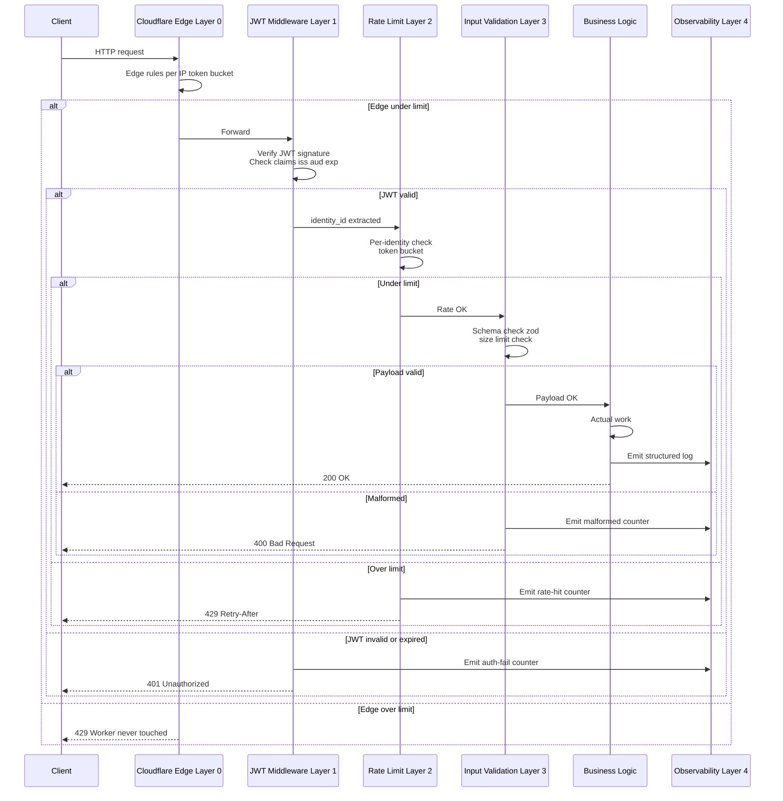

## Description

<!-- SECTION:DESCRIPTION:BEGIN -->

## Что это простыми словами

Cross-cutting baseline **как** мы защищаем **любой** server endpoint — не конкретный (KeyPackage, pairing, recovery), а универсальный **posture**.

**Тезис** (surfaced владельцем на TASK-104): «Всё что приходит на сервер, не доверять, везде отслеживать abuse, везде первое — это злоумышленник, пока не доказано обратное. GET /keypackage/consume — лишь частный случай».

Значит нужен baseline с пятью minimum-требованиями на любой endpoint:
1. **Authentication** — JWT verification или явный `[public]` с обоснованием.
2. **Rate limiting** — минимум одна dimension (identity / device / IP) с конкретными числами.
3. **Input validation** — schema-based rejection malformed / oversized payloads.
4. **Observability** — structured logs + метрика abuse-кандидатов + alert threshold.
5. **Failure mode** — что происходит при rate-limit hit, JWT expired, malformed payload (429 / 401 / 400).

Плюс cross-cutting non-goals + exit ramps (когда MVP защита недостаточна → куда мигрируем).

## Зачем

Без baseline'а каждая новая спека изобретает свой уровень защиты. Некоторые endpoint'ы получают JWT + rate limit, некоторые — только JWT, некоторые — вообще ничего («это internal / low-risk»). У нас **нет** internal endpoint'ов (всё в public Cloudflare Worker'е) — «low-risk» значит «пока не заметили abuse».

Baseline даёт:
- **Enforcement point** (skill `checklist-server-hardening` вызывается через `procedure-assess-spec-complexity` на любую спеку с endpoint'ом).
- **Refuse pattern** в CLAUDE.md — новая спека без всех 5 properties = refuse.
- **Machine-readable контракт** для TASK-104 (KeyPackage), TASK-67 (pairing), TASK-6 (recovery), TASK-27 (messenger backend endpoints), TASK-19 (config sync), любых будущих server endpoints.

Это **parent decision** для TASK-104 и вероятно TASK-67 (pairing endpoints); TASK-104 dependency `[TASK-105]`.

## Что входит технически (для AI-агента)

**Layers**:
- **`CLAUDE.md` rule 12** — universal principle «server endpoints untrusted by default».
- **`CLAUDE.md` refuse pattern 20** — refuse спек без всех 5 required properties.
- **`.claude/skills/checklist-server-hardening/SKILL.md`** — checklist для новой/изменённой спеки с server endpoint'ом.
- **`docs/dev/server-roadmap.md`** — новая section `SRV-BASELINE-*` с exit ramps для каждой защиты.
- **`push-worker/`** — реализация baseline (JWT middleware, rate-limit middleware, input schema, observability wiring).
- **Existing docs**: `docs/dev/server-requirements.md` уже упоминает Tier-based JWT + per-JWT rate-limit — TASK-105 обобщает и расширяет.

**Не в scope TASK-105** (parked, отдельные decisions):
- WAF rules / DDoS protection at global CDN level (Cloudflare product feature, config а не design).
- Sybil resistance / invitation-only signup (TASK-67 adjacent).
- Proof-of-work / captcha (не messaging pattern).
- Detection algorithms для abuse patterns (ML-подобные) — future SRV-CRYPTO работа.
- Log storage / long-term audit retention (relates TASK-32 audit log).

**В scope открытые вопросы** (см. SECTION:DISCUSSION — mentor Part A pending):
- Какая JWT verification library / JWKS caching strategy?
- Rate-limit primary dimension — per-identity, per-device, per-IP, combo? В связке с TASK-101 multi-device first-class.
- Rate-limit storage tier baseline MVP — in-memory Worker isolate / Workers KV / Durable Object? Влияет на всю Q-14 (concrete DO design).
- Input validation library / schema format — data-model.md handwritten / zod / typescript types?
- Observability minimum — какие logs / метрики / alert threshold?
- Idempotency baseline — required для всех POST/PUT/DELETE или optional?
- Как enforced в CI — только checklist skill (manual) или lint-rule на handler files (fitness function)?

## Состояние

Discussion status, Session 1 Part A pending (2026-07-02).

Trigger: TASK-104 Session 1, владелец surfaced cross-cutting concern «это лишь частный случай, надо всё проверять, любые операции».

**TASK-104 paused** до закрытия TASK-105 Decision block'а — TASK-104 наследует baseline и добавляет KeyPackage-specific choices (pool cap, claim dedup, last-resort key).

<!-- SECTION:DESCRIPTION:END -->

## Acceptance Criteria
<!-- AC:BEGIN -->
- [x] #1 [hand] Session 1 mentor discussion: baseline scope + 5 required properties + open questions
- [x] #2 [hand] Owner direction зафиксирован (contract stability first-class + AI-defaulted internals + deferred persistence)
- [x] #3 [hand] Decision block заполнен (3 parts: frozen contract + AI defaults + deferred + exit ramps)
- [x] #4 [hand] CLAUDE.md rule 12 + refuse pattern 20 добавлены
- [x] #5 [hand] `.claude/skills/checklist-server-hardening/SKILL.md` создан
- [ ] #6 [hand] docs/dev/server-roadmap.md — новая section SRV-BASELINE-* с exit ramps (выполняется при implementation TASK-104)
- [x] #7 [hand] Status → Draft
- [ ] #8 [hand] TASK-104 resumed (dependency satisfied — done в next commit)
- [ ] #9 [hand] Downstream tasks (TASK-67, TASK-6, TASK-27, TASK-19, TASK-42) уведомлены о `dependencies: [TASK-105]` (при следующем touch)
<!-- AC:END -->

## Discussion

<!-- SECTION:DISCUSSION:BEGIN -->

### Session 1 (2026-07-03, mentor skill continued from TASK-104) — Part A

#### A.1 Что за область

**Server-side baseline defense** — принципы «как» защищаем **любой** endpoint. Не конкретный KeyPackage / pairing / recovery, а **cross-cutting posture**.

Тезис: **authenticated ≠ trusted**. Даже с валидным JWT запрос может быть abuse (rogue device, compromised credential, buggy retry loop). Client-side гигиена недостаточна — сервер защищает себя сам.

5 required properties per endpoint становятся **conveyor belt** — каждый endpoint проходит через одинаковые gate'ы, только business logic отличается. Boilerplate маленький, но baseline enforced.

Разгружает: TASK-104 (KeyPackage), TASK-67 (pairing endpoints), TASK-6 (recovery), TASK-27 (messenger backend), TASK-19 (config sync), TASK-42 (group encryption) — все server-facing decisions наследуют baseline и добавляют endpoint-specific choices.

#### A.2 Карта темы

**5-layer pipeline через который проходит любой endpoint request**:



**Layers где ложится код**:
- **`push-worker/middleware/auth.ts`** — JWT verification (jose lib).
- **`push-worker/middleware/rate-limit.ts`** — Cloudflare RATE_LIMITER binding + custom identity-key logic.
- **`push-worker/middleware/validate.ts`** — schema-based (zod).
- **`push-worker/middleware/observability.ts`** — structured logs + metrics.
- **`push-worker/routes/<endpoint>.ts`** — business logic per endpoint (композиция: `route.use(auth).use(rateLimit).use(validate).handle(business)`).
- **`push-worker/wrangler.toml`** — Cloudflare edge rules config, RATE_LIMITER binding declaration.
- **`docs/dev/server-roadmap.md § SRV-BASELINE-*`** — exit ramps per each of 5 properties (Go equivalents).

**Пример endpoint composition** (концепт, не финальный синтаксис):

```typescript
// push-worker/routes/keypackage/publish.ts (пример)
export const publishHandler = pipeline(
  authMiddleware(),                         // Layer 1
  rateLimitMiddleware({ dim: 'identity' }), // Layer 2
  validateMiddleware(publishSchema),        // Layer 3
  observabilityMiddleware('keypackage.publish'), // Layer 4 hook
  async (ctx) => {
    // Business logic — pool cap check, KV write
    return ctx.json({ stored: 100, dropped: 5 });
  }
);
```

#### A.3 Главное для новичка

1. **5 layers = 5 middleware'ов, каждый — gate.** Запрос падает через них по порядку. Любой gate может отбить (429/401/400/503) — до business logic не доходит. Логика endpoint'а мала, boilerplate защиты стандартный.

2. **Middleware — переиспользуемые модули.** Каждый endpoint компонуется одинаково: `route.use(auth).use(rateLimit).use(validate).handle(business)`. Автор нового endpoint'а **обязан** использовать все 4 middleware'а (checklist-server-hardening enforce'ит).

3. **Cloudflare edge rules — Layer 0 вне Worker'а.** Config в `wrangler.toml`, не код. Coarse защита от массового bot-abuse (per-IP token bucket). Falls through в Layer 1 если под лимитом.

4. **Rate limit dimension = per-identity (JWT claim), не per-IP.** Cloudflare прямо рекомендует. Mobile NAT / tethering / VPN делают IP плохим ключом (одна ячейка = сотни пользователей за одним IP). Per-identity — natural user-level.

5. **Observability не option — часть baseline.** Каждый gate эмитит structured log + metric. Alert threshold объявлен в spec.md. Без observability мы не узнаем что abuse происходит.

#### A.4 Ключевые термины

- **JWT (JSON Web Token)** — стандартный signed token с claims (identity_id, exp, aud). **Зачем**: сервер узнаёт кто запросчик без хранения session state.
- **JWKS (JSON Web Key Set)** — public keys issuer'а для verify JWT signature. **Зачем**: сервер не хранит секреты, а проверяет подпись через известные public keys.
- **jose (npm library)** — стандартный TypeScript библ для JWT verify. Работает в Workers. **Зачем**: не пишем свой crypto (rule 4 MVA).
- **Rate limit dimension** — по какому ключу считаем (identity_id / device_id / IP / combo). **Зачем**: определяет что реально ограничиваем.
- **Cloudflare RATE_LIMITER binding** — official Cloudflare product, edge-local sliding window. **Зачем**: primitive для rate limit, не пишем свой.
- **Durable Object** — Cloudflare product, strong-consistent single-region actor. **Зачем**: для глобальных счётчиков когда edge-local недостаточно (exit ramp для recovery attempts, KeyPackage cross-region drain detection).
- **Structured log** — JSON лог с фиксированными полями (identity_id, endpoint, result, latency). **Зачем**: machine-readable для metrics / alerts (grep / Analytics Engine query).
- **Idempotency key** — client-generated unique ID запроса. Server dedupes retries. **Зачем**: safe retry без duplicate state changes.
- **Zero-trust posture** — принцип «каждый запрос hostile until proven otherwise». **Зачем**: authenticated ≠ trusted; server защищает себя от rogue devices, compromised creds, buggy clients.
- **zod (npm library)** — TypeScript-first schema validation. **Зачем**: reject malformed payloads до business logic.
- **Cloudflare Analytics Engine** — Cloudflare product для custom metrics (counters, distributions). **Зачем**: free tier для baseline observability.

#### A.5 Уточняющие вопросы (Q1'-Q7')

**Q1' — JWT verification library + JWKS caching?**

- **A. `jose` npm + JWKS remote fetch + memory cache 10 min** — standard, minimal deps.
- **B. `jose` + JWKS в Workers KV** — cross-isolate consistency, но лишний cache layer.
- **C. `jsonwebtoken` npm (Node classic)** — работает в Workers, но less maintained (jose author активнее).
- **D. Свой roll** — refuse (no reason).

**Зачем спрашиваю**: Q1 — узкий выбор, но задаёт TS ecosystem convention для всех endpoint'ов. Мой bet — **A**.

---

**Q2' — Rate limit primary dimension**?

- **A. Per-identity (JWT claim `identity_id`)** — natural user-level. Rogue device внутри identity выжигает бюджет всей identity.
- **B. Per-device (`identity_id + device_id`)** — гранулярнее, TASK-101 multi-device first-class.
- **C. Per-IP** — Cloudflare discourages (mobile NAT).
- **D. Combo per-identity + per-device** (два cap'а).

**Зачем спрашиваю**: MVP — сколько сложности сразу. TASK-101 сделал multi-device first-class, но rate limit per-device requires device_id spoofing protection (TASK-103 remote lock). Мой bet: **A для MVP + TODO(server-roadmap): D для post-MVP** (когда device_id enforcement stronger).

---

**Q3' — Rate limit storage tier baseline**?

- **A. Cloudflare RATE_LIMITER binding (edge-local, 10s/60s period)** — MVP default, zero-code primitive.
- **B. Workers KV counter** — eventually consistent, cheap, но не strict.
- **C. Durable Object** — strong-consistent global, дороже, complex.
- **D. Ladder A → B → C** по мере роста (per endpoint type).

**Зачем спрашиваю**: single tier vs ladder. Recovery attempts (TASK-6 anti-brute-force) требуют **strict** persistent counter — cannot be per-edge-location. KeyPackage rate — edge-local достаточно.

Мой bet: **D**. Ladder per endpoint: RATE_LIMITER для «normal» endpoints, DO для «security-critical» (recovery, unlock, admin actions). Concrete assignment таблицей в Decision block.

---

**Q4' — Input validation library**?

- **A. `zod`** — TypeScript-first, ecosystem standard, works в Workers. Types-first schema.
- **B. `valibot`** — lighter zod alternative (~10x smaller bundle).
- **C. `JSON Schema + ajv`** — general, но verbose.
- **D. Manual per-endpoint validation** — no library.

**Зачем спрашиваю**: Cloudflare Workers имеют bundle size limits (1MB free / 10MB paid). Bundle size matters. Мой bet: **A** (zod) — стандарт TS ecosystem, worth bundle size. Если позже bundle press — swap на B (valibot API-compatible ~mostly).

---

**Q5' — Observability minimum**?

- **A. `console.log(JSON.stringify({...}))`** — structured JSON to stderr, Cloudflare Logs picks up (default log destination).
- **B. Cloudflare Analytics Engine** (product feature, free tier) для custom metrics counters.
- **C. External observability (Datadog / Grafana)** — vendor lock, cost.
- **D. Combo A + B**.

**Зачем спрашиваю**: baseline минимум, не enterprise stack. Мой bet: **D**. A для logs (searchable in Cloudflare dashboard), B для metrics (rate-limit-hit counter, auth-fail counter). Alert threshold задаётся `wrangler.toml` или Cloudflare Dashboard. C — future upgrade path.

---

**Q6' — Idempotency approach**?

- **A. Required для всех POST/PUT/DELETE** — client sends `Idempotency-Key` header, server dedupes 10min.
- **B. Optional per endpoint** — endpoint spec декларирует.
- **C. Server-side natural dedup** (e.g. KeyPackage cap dedup, pool cap) — не требует client header.
- **D. Combo per endpoint** — required где state changes без natural bound, natural где cap-bounded.

**Зачем спрашиваю**: TASK-104 KeyPackage claim dedup — natural (по requester+target pair). Recovery attempts (TASK-6) — natural rate limit + monotonic counter. Pairing (TASK-67) — natural dedup по pairing token. **Наши** endpoints имеют natural dedup mostly. Мой bet: **D**. Force header только там где нет natural bound.

---

**Q7' — Enforcement in CI**?

- **A. Только `checklist-server-hardening` skill** (manual через procedure-assess-spec-complexity).
- **B. Lint rule на TypeScript в push-worker/** (routes must import 4 middleware pipeline).
- **C. Both A + B**.

**Зачем спрашиваю**: fitness function (rule 7) vs checklist. Lint rule — «code cannot lie», но требует TS AST plugin. Checklist — human-checked. Мой bet: **A + TODO(fitness-function): eventual B**. MVP — checklist. Post-MVP — lint rule как enforcement escalation.

#### A.6 Гипотеза рекомендации (до ответов)

- **Q1'** = A (`jose` + memory cache 10min).
- **Q2'** = A для MVP + `TODO(server-roadmap): D` при device_id enforcement.
- **Q3'** = D (ladder RATE_LIMITER → DO per endpoint criticality).
- **Q4'** = A (`zod`).
- **Q5'** = D (Cloudflare Logs + Analytics Engine).
- **Q6'** = D (natural where bounded, header where not).
- **Q7'** = A + `TODO(fitness-function): lint rule`.

**Non-goals (сходятся с TASK-104 non-goals)**:
- Proof-of-work / captcha — antibot pattern, not messaging pattern.
- Metadata privacy Sealed Sender level — future decision.
- WAF rules global — Cloudflare product feature, ops-config.
- Detection algorithms для abuse patterns — future SRV-CRYPTO work.
- Log retention policy — TASK-32 audit log adjacent.

**Exit ramps** (все per rule 8 → server-roadmap.md):
- Cloudflare RATE_LIMITER → **Redis token bucket** (Go: `go-redis/redis_rate`).
- Workers KV → **PostgreSQL** (persistent tables).
- Durable Object → **actor pattern в Go** (goroutine per user) или **Redis Cluster**.
- `jose` (npm) → **`go-jose`** (industry standard).
- `zod` → **`go-playground/validator`** или **`ozzo-validation`**.

Все Cloudflare-specific choices имеют declared exit ramp. Domain code (Kotlin в `core/`) не трогается при migration.

### Session 1 — owner direction (2026-07-03)

Владелец после Part A сказал (verbatim, важно):

> «Главное правило для сервера — он не должен зависеть от фронта и наоборот. Можем ли так работать с сервером, что вот есть задачи для фронта, ему нужно то то и тото, но сервер не продумываем. Можем ли мы считать, что так как сервер тупой, при e2e, то не нужно заранее его продумывать, только защита, и недоверие к фронту? Что бы сейчас все не обдумывать, и тем более не быть как то завязанным на решения формируемым на фронте, давай фронт будет выставлять требования, сервер выставляет свои требования, они друг с другом согласуют, и дальше не зависят друг от друга. Можем сейчас принять для сервера тот минимум который позволит работать. Безопасность на временном сервере тоже будем реализовывать. Если есть возможность то прими рекомендуемые тобой решения, но с тем расчетом, что бы это легко переехало на селф сервер, и потом не пришлось менять контракт для фронта. Стабильный контракт для фронта».

**Смысл направления**:

1. **Contract stability = first-class concern**. Frontend не должен переделываться при server migration (Cloudflare Worker MVP → own Go microservices).
2. **Server internals = AI-defaulted**. Владелец не хочет их разбирать сейчас. Q1'-Q7' становятся AI-defaults с owner veto right.
3. **Server ≠ полностью dumb**. E2E решает content confidentiality, но сервер **обязан** делать: auth, rate limits, durability. Иначе — real vulnerability с day 1 (drain KeyPackages, brute-force recovery, spam publish).
4. **Frontend/server independent через versioned contract** (rule 5 wire format versioning applied).

Owner explicitly accepts AI recommendations from A.6. Session 1 закрыта, Decision block ниже.

### Decision (English, immutable) 🔒

**Owner direction (verbatim, translated)**: Frontend and server independent via stable contract. Server internals AI-defaulted for MVP, easy Go migration required. Security implemented on temporary Cloudflare Worker.

**Choice**:

**Part 1 — Frontend-server contract stability (owner-locked, first-class concern)**:
1. All server endpoints exposed via **versioned URL** — `/v1/<endpoint>` pattern. Version bump only on breaking change.
2. All request/response bodies carry **`schemaVersion` field** at top level (per CLAUDE.md rule 5).
3. **Error response shape stable**: `{ error: { code: string, message: string, retryAfter?: number } }` with documented `code` taxonomy.
4. **Backward-compat reads** possible for at least one major release. Adding fields OK; renaming/removing requires major bump + migration written **before** the breaking change ships.
5. **Contract lives in `push-worker/contracts/*.ts`** with roundtrip tests. Same contracts (as generated `.kt` types or manual mirror) live in `core/src/commonMain/kotlin/.../contracts/`. Never Cloudflare-specific types leak into contracts.
6. Server migration (Cloudflare → Go microservices) **must not touch frontend code**. Fitness function: `git log --stat` before/after migration should show zero changes in `android/`, `core/`.

**Part 2 — Server internals (AI-defaulted for MVP, owner has veto right)**:
- **JWT verification**: `jose` npm library, JWKS remote fetch with memory cache 10min.
- **Rate limit dimension**: per-identity (JWT claim `identity_id`) for MVP. `TODO(server-roadmap): per-device dimension` post multi-device enforcement (TASK-101, TASK-103 device_id anti-spoof).
- **Rate limit storage tier**: **ladder** per endpoint criticality:
  - Cloudflare `RATE_LIMITER` binding (edge-local, 60s window) for **normal** endpoints (KeyPackage publish/claim, config sync).
  - Cloudflare **Durable Object** counter for **security-critical** endpoints (recovery attempts, unlock, admin actions).
  - Assignment table in `docs/dev/server-roadmap.md § SRV-BASELINE-RATE-TIER`.
- **Input validation**: `zod` (TypeScript schema-first). Bundle cost ~30KB acceptable; if bundle press: swap to `valibot` (API-compatible).
- **Observability**: `console.log(JSON.stringify({...}))` structured JSON (Cloudflare Logs picks up) + Cloudflare Analytics Engine for counters (`rate_limit_hit`, `auth_failure`, `malformed_payload`). Alert threshold in `wrangler.toml`.
- **Idempotency**: natural dedup where cap-bounded (KeyPackage claim, pool cap, pairing token); `Idempotency-Key` header required for state-modifying endpoints without natural bound (config write, key rotation).
- **CI enforcement**: `checklist-server-hardening` skill via `procedure-assess-spec-complexity`. `TODO(fitness-function): TypeScript lint rule "routes must import 4 middleware pipeline"` post-MVP.

**Part 3 — Deferred to self-server era (Go microservices)**:
- Persistence layer schema design (PostgreSQL / Redis Cluster architecture).
- Replication strategy (multi-region, failover).
- Monitoring stack beyond Cloudflare Logs + Analytics Engine (Prometheus / Grafana / Datadog).
- Cross-region abuse detection.
- Log retention policy (TASK-32 audit log adjacent).
- Custom WAF rules global (Cloudflare ops-config for MVP).

**Applies to**: TASK-104 (KeyPackage), TASK-67 (pairing), TASK-6 (recovery), TASK-27 (messenger), TASK-19 (config sync), TASK-42 (group encryption), and all future server-facing tasks. Downstream tasks add `dependencies: [TASK-105]` at next touch.

**Rationale**:
- Contract stability = one-way door mitigation. Frontend не переделывается при server migration. Owner's core concern.
- AI-defaulted internals = MVA (rule 4). We accept default risk (e.g. edge-local rate limits allow small burst per region). Explicit exit ramps + observability alerts mitigate.
- Deferred persistence = YAGNI (rule 4). Cloudflare KV/DO used as-is; PostgreSQL schema design when we actually migrate.
- Baseline security on temp server = **not optional**. Skipping = real vulnerability day 1 (drain KeyPackages, brute-force recovery). ~100 lines TS per endpoint pipeline is acceptable cost.
- E2E ≠ dumb server. E2E removes content-processing (no NLP / ads / moderation) — huge simplification. But auth / rate limits / durability remain server responsibilities.

**Trade-offs**:
- Contract discipline overhead: every endpoint change reviewed for backward-compat. Versioned URLs feel bureaucratic in MVP but pay off at migration.
- AI-defaulted server internals: owner accepts default risk without individual review. Mitigated by exit ramps + observability + owner veto right per choice.
- Cloudflare vendor coupling on primitives (RATE_LIMITER, KV, DO): all have Go equivalents documented, migration path is TS→Go rewrite ~500 lines, 1-to-1 primitive mapping.
- Baseline security cost: ~100 TS lines per endpoint pipeline. Non-trivial but reusable middleware.

**Exit ramps** (all per rule 8 → `docs/dev/server-roadmap.md § SRV-BASELINE-*`):

| Cloudflare choice | Go equivalent |
|---|---|
| `env.RATE_LIMITER` binding | `github.com/go-redis/redis_rate` (Redis token bucket) or Envoy rate-limit filter |
| Workers KV | PostgreSQL persistent tables |
| Durable Object | Actor pattern in Go (goroutine per user) or Redis Cluster |
| `jose` npm | `github.com/go-jose/go-jose` (industry standard) |
| `zod` | `github.com/go-playground/validator` or `github.com/go-ozzo/ozzo-validation` |
| Cloudflare Logs | Structured JSON to stdout (any log aggregator picks up) |
| Analytics Engine | Prometheus counters / Grafana Loki |
| `wrangler.toml` edge rules | Envoy filter config or nginx `limit_req_zone` |

Migration cost estimate: rewrite `push-worker/` (~500 lines TS) → ~500 lines Go. Domain code (Kotlin `core/`) not touched. Frontend contracts (versioned endpoints, stable schema, error taxonomy) not touched.

**Frozen contract invariants** (never break without major version bump):
- HTTP path structure `/v{N}/<domain>/<action>`.
- Request body: `{ schemaVersion: number, ... }`.
- Response body: `{ schemaVersion: number, data?: ..., error?: {code, message, retryAfter?} }`.
- Auth header: `Authorization: Bearer <jwt>`.
- JWT claims: `iss`, `aud`, `exp`, `identity_id`, `device_id` (optional).
- Standard HTTP codes: 200 (OK), 400 (validation), 401 (auth), 429 (rate limit), 503 (upstream).

Deviations require major version bump + written migration + backward-compat reads for one major.

**Non-goals** (explicit, per owner direction):
- Metadata privacy (Sealed Sender-level) — parked, future decision, does not block MVP.
- Proof-of-work / captcha — antibot pattern, not messaging pattern.
- Persistence schema design — deferred to own-server Go era.
- Cross-region abuse detection — parked (requires DO baseline first).
- Log retention policy — TASK-32 audit log adjacent.
- Global WAF rules — Cloudflare ops-config, not app design.

**Session boundary**: Q1'-Q7' from Session 1 A.5 не требуют individual owner answers — Part 2 above encodes AI-defaults with rationale. If owner wants to override any Q — do it in a separate follow-up decision task (`TASK-105-override-<QN>`), not by editing this Decision block (immutable).

<!-- SECTION:DISCUSSION:END -->
