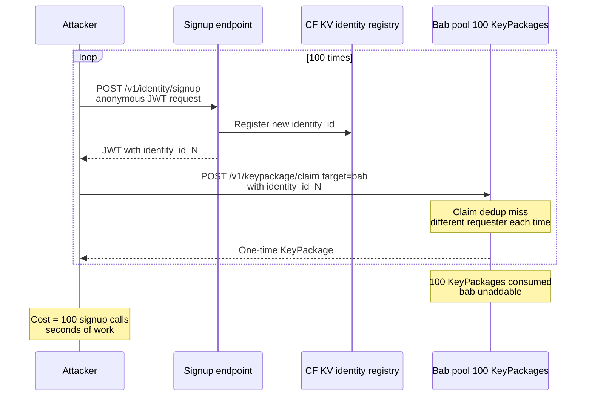
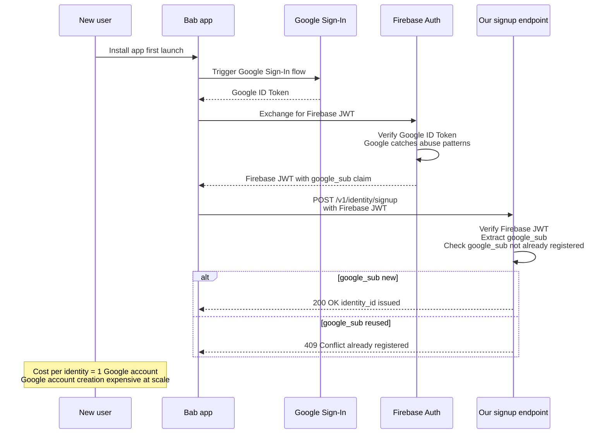
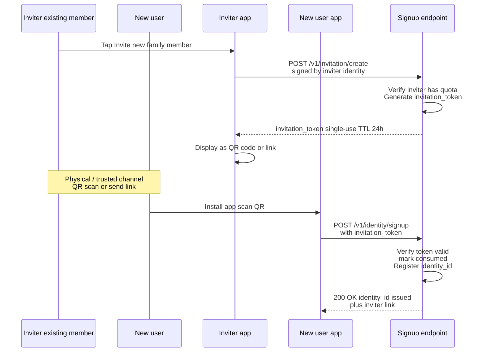
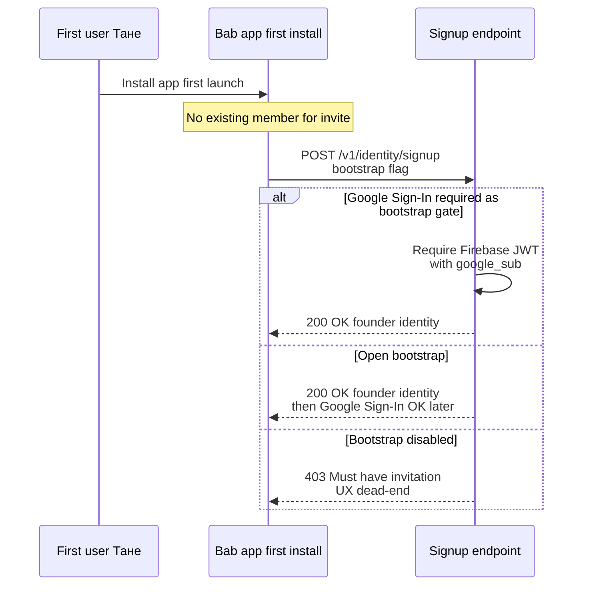
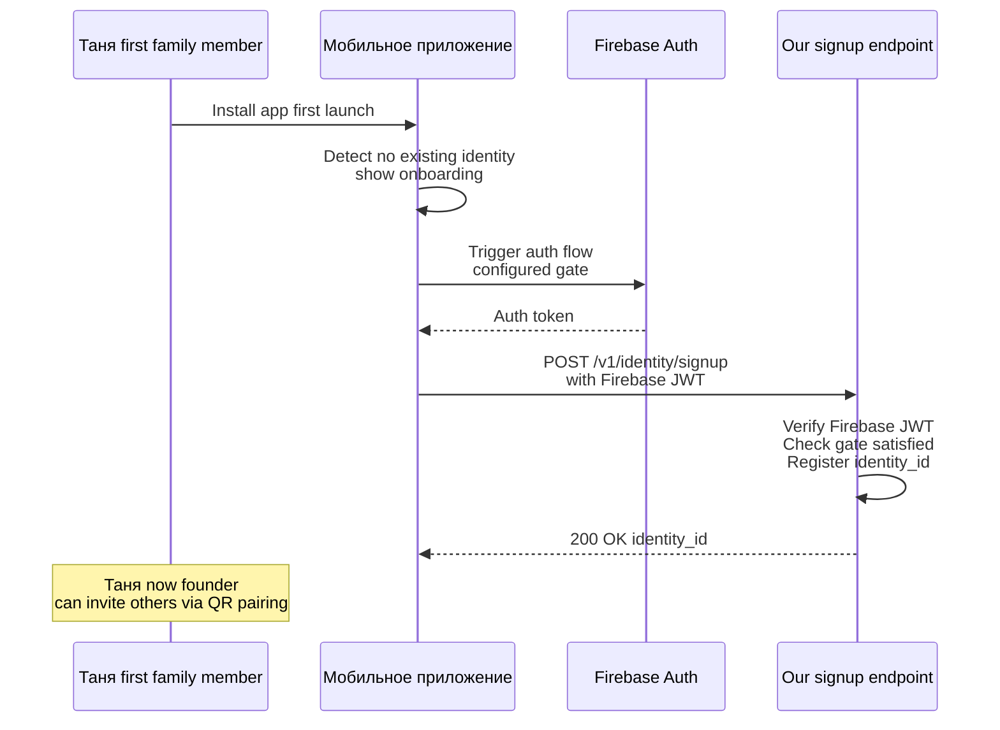
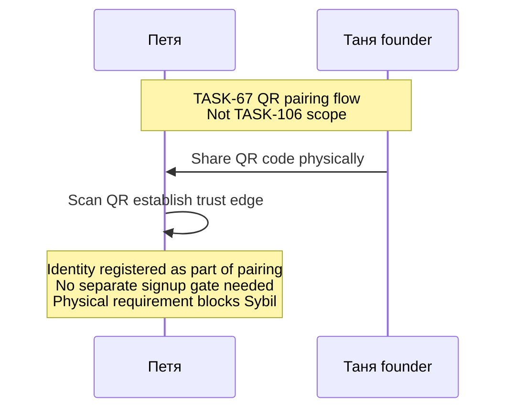
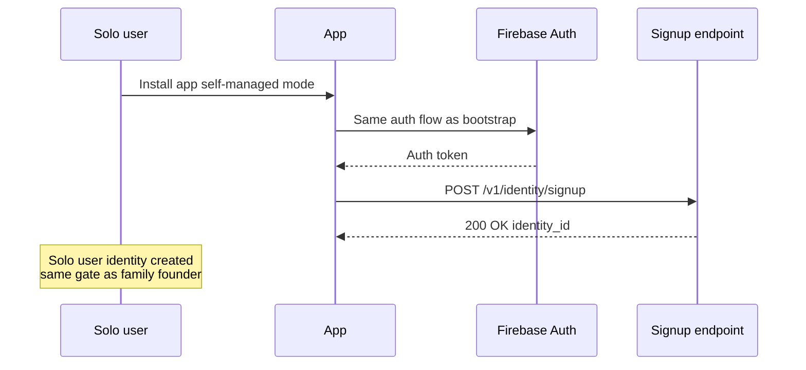

## Description

<!-- SECTION:DESCRIPTION:BEGIN -->

## Что это простыми словами

**Sybil атака** = один злоумышленник создаёт **много** фейковых identity, чтобы обойти защиты рассчитанные «на одного пользователя».

**Как это ломает то что мы уже решили** (прямой follow-up TASK-104):
- **Claim dedup keyed по (requester_id, target_id)** — если attacker имеет 100 identity, он делает 100 разных requester_id → dedup не срабатывает → 100 KeyPackages бабушки выжжены за минуты → бабушка становится «unaddable» пока не publish'нёт refill.
- **Per-identity rate limit** (TASK-105 baseline) — 100 identity дают attacker'у 100× бюджет.
- **Auto-add on recovery** (TASK-101) — attacker может recovered'ить 100 identity под stolen credentials, каждая станет legit device.
- **Pairing token brute-force** (TASK-67) — 100 identity × per-identity rate limit = 100× bruteforce budget.

Значит **claim dedup + rate limits недостаточны без Sybil resistance**. Наш TASK-104 non-goal явно упомянул это как parked с exit ramp'ом «invitation-only signup».

**Вопрос TASK-106**: **как** мы сделаем создание identity дорогим для attacker'а, не ломая UX для бабушки-Тани-Пети?

## Зачем

Sybil — единственная известная слабость Signal-inspired hybrid защиты. Без Sybil resistance наши инвестиции в TASK-104 (pool cap + claim dedup + last-resort) частично обесцениваются.

Также — блокирует TASK-67 (pairing abuse prevention) как high-priority feature-task.

Также — определяет **first-time UX** (как новый member добавляется в family / clinic / self-managed setup). Это владельческое product-решение, не только technical.

## Что входит технически (для AI-агента)

**Layers**:
- **Identity provider layer** (Firebase Auth / phone verify / invitation-only) — cost для attacker создать новую identity.
- **`push-worker/routes/identity/signup.ts`** — endpoint для JWT issuance при новой identity.
- **`core/` port `IdentityProvisioner`** — abstract signup flow, adapter per gate type.
- **`app/`** — signup wizard UI, invitation display / redeem UX.
- **PresetV2.identity** — сегмент-зависимые gate policies.

**Не в scope TASK-106**:
- Recovery flow (уже TASK-101 + TASK-6).
- Existing Sybil detection (retroactive) — будет в TASK-107 (abuse response).
- Web-of-trust multi-vouch (Phase-3+) — parked.
- Proof-of-personhood (biometric, ID scan) — не наш scope.

**В scope открытые вопросы** (см. SECTION:DISCUSSION):
- Какой gate на identity creation (Google Sign-In / phone / invitation / combo)?
- Bootstrap: как создаётся **первая** identity в family group (нет existing member для invite'а)?
- Invitation token shape: single-use, TTL, revocable?
- Google Sign-In — обязательный gate или optional layer?
- Что параметризовать пресетом (family vs clinic vs self-managed)?
- Что с existing Sybil identity (retroactive detection) — parked в TASK-107 или обозначить здесь?

## Состояние

Discussion, Session 1 в разработке (2026-07-03). Trigger: TASK-104 non-goal parked item «Sybil resistance (attacker creates 100 valid identities) → invitation-only signup as exit ramp».

<!-- SECTION:DESCRIPTION:END -->

## Acceptance Criteria
<!-- AC:BEGIN -->
- [ ] #1 [hand] Session 1 mentor discussion: threat model + gate options + bootstrap + clarifying questions
- [ ] #2 [hand] Owner ответил на clarifying questions (или accepted AI-defaults à la TASK-105)
- [ ] #3 [hand] Decision block заполнен (English, immutable): gate choice + bootstrap flow + preset fields + exit ramps
- [ ] #4 [hand] Status → Draft
- [ ] #5 [hand] Downstream tasks (TASK-67, TASK-6, TASK-101) уведомлены о `dependencies: [TASK-106]` при следующем touch
<!-- AC:END -->

## Discussion

<!-- SECTION:DISCUSSION:BEGIN -->

### Session 1 (2026-07-03, mentor skill continued from TASK-104/105) — Part A

#### A.1 Что за область

**Sybil resistance** — препятствование созданию массы фейковых identity одним attacker'ом. Fundamental identity-layer defense, ортогональная rate limits и dedup'у.

**Атака в контексте нашего стека** (после TASK-104/105):

- Attacker может создать N identity через свободный signup path.
- Каждая identity получает валидный JWT (TASK-105 baseline).
- Каждая identity имеет свой per-identity rate limit budget.
- Каждая (requester_id, target_id) пара уникальна → claim dedup обходится N× раз.
- N identities × 1 KeyPackage claim = N KeyPackages жертвы выжжены → victim unaddable.

**Отличие от "compromised identity"**: там attacker захватил **одну** legit identity через credential theft. Здесь attacker **создаёт** many identity легально.

**Почему это одна из последних defense'ов в MLS-стеке**: MLS protocol сам по себе не Sybil-resistant. Server operator (мы) обязан обеспечить cost на identity creation. Signal — phone verification. WhatsApp — phone verification. Wire — team invite. Matrix — homeserver-specific.

#### A.2 Карта темы

**Threat scenario (Sybil без защиты)**:

**Option A — Google Sign-In gate**:

**Option B — Invitation-only signup**:

**Bootstrap dilemma (первая identity в family)**:

**Layers где ложится код**:
- **`push-worker/routes/identity/signup.ts`** — endpoint, gate verification, JWT issuance.
- **`push-worker/routes/invitation/create.ts`** — invitation token creation (Option B).
- **`push-worker/routes/invitation/consume.ts`** — invitation token redemption.
- **`core/` port `IdentityProvisioner`** — abstract signup flow, adapter per gate.
- **`core/` port `InvitationManager`** — issue / display / redeem invitations.
- **`app/wizard/`** — first-time UX, invite / signup screens.
- **PresetV2.identity** — sync fields (see A.5 Q5').

#### A.3 Главное для новичка

1. **Sybil = один attacker с many identity**. Отличается от «compromised identity» (одна identity в чужих руках). Разные threat models, разные защиты.

2. **Каждая identity должна что-то стоить attacker'у**. Cost может быть:
   - **Technical**: Google account (expensive at scale — Google catches).
   - **Financial**: SIM-карта с номером (~$1-5 per).
   - **Social**: приглашение от existing member (attacker должен убедить кого-то).
   - **Time**: rate-limited signup (attacker ждёт часы).

3. **Bootstrap = special case**. Первый user в family не может иметь invitation. Значит нужен fallback gate (Google Sign-In как минимум).

4. **Layered defense OK**. Google Sign-In (baseline) + invitation (strict layer) — уменьшает cost'ы одного слоя, повышает total cost для attacker'а.

5. **UX цена ≠ 0**. Invitation-only ломает «просто скачал и работает». Владелец должен принять UX trade-off сознательно.

#### A.4 Ключевые термины

- **Sybil attack** — один attacker создаёт many identity для обхода per-identity defenses.
- **Identity provider (IdP)** — сервис/mechanism выдающий JWT для identity (Google, Phone, our own).
- **Firebase Auth** — Google's identity provider service, supports multiple providers (Google Sign-In, Phone, Anonymous, Custom). Существует в нашем stack (server-requirements.md Tier 2).
- **Google Sign-In** — OAuth flow через Google account, даёт cheap Sybil resistance (Google catches abuse).
- **Invitation token** — signed cryptographic credential от existing member, redeemable one-time для новой identity registration.
- **Bootstrap identity** — первый founder в group / device / family, нет existing inviter'а, требует alternative gate.
- **Web-of-trust** — несколько existing members должны vouch'нуть за нового. Phase-3+ parked.
- **Proof-of-personhood** — biometric / ID verification (World ID, BrightID). Complex, privacy-invasive, не наш scope.

#### A.5 Уточняющие вопросы (Q1'-Q6')

**Q1' — Primary signup gate?**

- **A. Google Sign-In only** — все identity через Firebase Auth Google provider. Cheap Sybil resistance. UX simple («войди через Google»).
- **B. Phone verification only** — как Signal/WhatsApp. Cost = SIM. Более строго, но UX сложнее (нужен номер, SMS не всегда доставляется).
- **C. Invitation-only + bootstrap fallback** — invitation required кроме первого user'а. Strongest Sybil resistance. UX самый ограниченный.
- **D. Combo Google + Invitation** — Google baseline для всех, invitation обязателен для присоединения к family. Layered.

**Зачем спрашиваю**: определяет тип gate'а. У нас family-first stance значит invitation очень natural. Но самый первый user должен как-то войти. Мой bet — **D**.

---

**Q2' — Bootstrap flow (первый user в family)?**

- **A. Google Sign-In sufficient** — первый user входит через Google, становится «founder», может звать других.
- **B. Google Sign-In + email verification** — belts and suspenders.
- **C. Waitlist / manual approval** — futurable, не MVP.
- **D. Phone verification** — если phone gate в Q1'.

**Зачем спрашиваю**: bootstrap всегда special. В combo (D в Q1') — Google Sign-In это А. Мой bet — **A**.

---

**Q3' — Invitation token shape?**

Формат invitation token (если Q1' = C или D):

- **A. Single-use, TTL 24h, revocable inviter'ом**.
- **B. Single-use, TTL 7d, non-revocable** (issued = committed).
- **C. Multi-use N=5, TTL 30d** — «пригласи семью батчем».
- **D. Preset field** — family: A (single-use 24h); clinic: C (batch invite).

**Зачем спрашиваю**: security vs UX trade-off. Family (доверенный круг) — single-use OK, потерянные приглашения = social cost. Clinic (много новых пациентов быстро) — batch удобнее. Мой bet — **D**.

---

**Q4' — Google Sign-In — обязательный или optional layer?**

Если Q1' = C (invitation-only) или D (combo):

- **A. Обязательный на всех** (включая invitation redemption): даже с invitation'ом нужен Google account.
- **B. Обязательный только на bootstrap**: первый user входит через Google, invited users — без Google.
- **C. Optional**: user может использовать anonymous JWT если предпочитает privacy.
- **D. Preset field**: family — B (Google для founder); paranoid — C; clinic — A (compliance).

**Зачем спрашиваю**: privacy vs security. Google account = tracking. Мой bet — **B** (Google для bootstrap), family default.

---

**Q5' — Что параметризовать пресетом?**

Кандидаты в `PresetV2.identity`:

- `signupGate: enum` — `google_signin` / `phone_verify` / `invitation_only` / `combo`. Family default: `combo`.
- `bootstrapGate: enum` — `google_signin` / `email_verify` / `phone_verify`. Family default: `google_signin`.
- `invitationTokenTTLHours: int` — Family: 24; clinic: 720 (30d).
- `invitationTokenUses: int` — Family: 1; clinic: 5.
- `invitationRevocable: boolean` — Family: true; clinic: true.
- `invitationsPerMemberPerMonth: int` — quota на inviter'а. Family: 5; clinic: 100.
- `googleRequiredForInvitedUsers: boolean` — Q4'. Family: false; clinic: true.

**Зачем спрашиваю**: rule 11 preset vs invariant discipline. Числа definitely preset. Enum choices — тоже preset (family vs clinic сильно отличаются). Мой bet: **все 7 preset**.

---

**Q6' — Retroactive Sybil detection (existing malicious identities)?**

- **A. Parked, обозначить в non-goals** — retroactive detection = отдельный TASK-107 (abuse response).
- **B. Inline здесь** — простая heuristic (N identities from same google_sub / IP within short window → flag).
- **C. Full detection engine** — ML-based, complex, Phase-3+.

**Зачем спрашиваю**: scope creep risk. Мой bet — **A** (parked, cross-reference TASK-107 когда создан).

#### A.6 Гипотеза рекомендации (до ответов, à la TASK-105 style)

Если владелец скажет «прими AI defaults» à la TASK-105:

- **Q1'** = D (combo Google + Invitation).
- **Q2'** = A (Google Sign-In sufficient для bootstrap).
- **Q3'** = D (preset field, family single-use 24h).
- **Q4'** = B (Google обязательно только для bootstrap).
- **Q5'** = все 7 preset fields.
- **Q6'** = A (parked в TASK-107).

**Non-goals**:
- Web-of-trust multi-vouch — Phase-3+ parked.
- Proof-of-personhood (biometric / ID scan) — не наш scope.
- Anti-fraud ML detection — TASK-107 territory.
- Anonymous signup (no gate at all) — refuse, breaks Sybil resistance.
- Retroactive detection existing Sybil — TASK-107.

**Exit ramps**:
- Firebase Auth → own Go identity service (JWT issuance) при own-server migration. `TODO(server-roadmap): Firebase Auth → in-house OIDC provider`.
- Google Sign-In → any OIDC provider (Apple, Microsoft) когда expanding platform reach.
- Invitation token format = signed JSON с schemaVersion (rule 5) — stable contract survive'ает migration.

**Contract stability** (inherits TASK-105 Part 1):
- Endpoints: `POST /v1/identity/signup`, `POST /v1/invitation/create`, `POST /v1/invitation/consume`.
- Bodies с `schemaVersion`.
- Error taxonomy: `409` (google_sub reused / invitation consumed), `403` (bootstrap disabled / no invitation), `410` (invitation expired), `429` (invitation quota).

### Session 1 — owner clarifications (2026-07-03), Part A rescoped

Владелец правильно поправил:

**Correction 1 — scope narrowed**:

> «Q1 если я правильно понял, это вопрос о присоединении к группе управления телефоном? там же есть qr или временный код? если сейчас в принципе решается, в том числе и для мессенджера — это другой вопрос, я бы вынес его в инвайт для групп когда будем делать мессенджер».

Владелец прав. Изначально Part A conflate'ил три разных концепта:

1. **Bootstrap identity creation** (первый user в family / self-managed user) — нужен gate против Sybil.
2. **Присоединение к группе управления телефоном** (family caretaker joins bab's phone) — **уже решено через QR pairing (TASK-67)**. Physical requirement (кто-то должен физически сканировать QR) даёт Sybil resistance without extra gate.
3. **Присоединение к мессенджер группе** (adding user to family chat) — **future TASK-42** (family group encryption), separate decision.

TASK-106 real scope = **только пункт 1** (bootstrap gate). Пункт 2 наследует Sybil resistance из TASK-67. Пункт 3 отложен.

**Correction 2 — pool vs preset terminology**:

> «В нашей системе есть pool настроек. Из этого pool — pick настроек в пресет. Т.е. пресет это часть настроек, а мы сейчас говорим про потенциальные настройки — pool, поправь».

Владелец прав. Per TASK-65 (FR-028) [`contracts/pool-naming.md`](../../specs/task-65-profile-composition-foundation-v2/contracts/pool-naming.md):
- **Pool** = catalog всех возможных settings-кубиков с stable identifiers (`security.signup.bootstrap-gate` итд).
- **Preset** = curated subset который **picks** entries из pool с concrete values для сегмента (family, clinic, self).

Правильная терминология: «добавить entry в pool + family preset picks value X». Не «preset field».

### Research — signup gates в готовых мессенджерах (2026-07-03)

| Messenger | Signup gate | Sybil cost | UX для elderly |
|---|---|---|---|
| **Signal** | Phone number verification (SMS) | SIM card ~$1-5 per identity | OK — у бабушки есть телефон, SMS работает mostly |
| **WhatsApp** | Phone number verification (SMS/call) | SIM card | Same |
| **Wire** | Phone or email | SIM or email account | Email challenging для elderly |
| **Matrix / Element** | Email / username / homeserver-specific | Email account | Email challenging |
| **Telegram** | Phone number | SIM | OK |
| **Session** | Anonymous (crypto keypair, no signup) | Zero (relies on economic cost of running crypto nodes) | Too abstract для elderly |
| **WhatsApp (new 2026)** | Optional username, phone still primary | Same | Same |

**Индустрия pattern**: **phone verification абсолютно доминирует** для consumer messengers (Signal, WhatsApp, Telegram). Причины:
- Cheap Sybil cost для attacker'а (SIM = $1-5), но not free.
- Universal — практически у всех есть телефон.
- Familiar UX — user привык вводить свой номер.

**Наш контекст (elderly-first Android launcher)**:
- Firebase Auth (Google's identity provider) уже в нашем stack (per server-requirements.md Tier 2).
- Firebase Auth поддерживает: Google Sign-In, Phone verification, Anonymous, Custom.
- **Google Sign-In дешевле для user'а** (у бабушки уже есть Google account на Android — Play Store).
- **Phone verification дороже** (SMS может не дойти, нужен ввод кода).

### Session 1 — Part A v2 (narrower scope)

#### A.1 Что за область (updated)

**Bootstrap identity gate** — какой barrier должен пройти пользователь чтобы создать identity в нашей системе **впервые** (первый user в family, или self-managed solo user).

**Family caretaker joining** (Таня → бабушкин планшет) не в scope — уже покрыто QR pairing (TASK-67, spec 007). Physical scan requirement даёт Sybil resistance без extra gate.

**Мессенджер group invitation** не в scope — отложено на TASK-42 (family group encryption).

**Значит TASK-106 узкий**: `POST /v1/identity/signup` endpoint gate + два вопроса: (a) какой mechanism verify'ит новую identity, (b) какие pool entries + family preset picks покрывают выбор.

#### A.2 Карта темы (updated)

**Bootstrap flow (первый user, family founder)**:

**Family member joining (Петя scan'ит Танин QR)** — **out of scope, TASK-67**:

**Self-managed user (solo, no family)** — same as bootstrap:

#### A.3 Главное для новичка (updated)

1. **Sybil resistance layered**. Bootstrap gate (TASK-106) + physical QR pairing (TASK-67) + future messenger invite (TASK-42) — три independent layers для трёх разных use cases.

2. **QR pairing уже Sybil-resistant physically**. Attacker не может «наштамповать 100 identity» через QR pairing — нужно 100 физических scan'ов. Значит family-side защищена.

3. **Bootstrap — единственная дыра**. Первый user создаёт identity без QR pairer'а. Значит gate там особенно важен.

4. **Индустрия использует phone verification** (Signal, WhatsApp, Telegram). Sybil cost = SIM card ~$1-5.

5. **У нас Google Sign-In дешевле для user'а**. Android user уже вошёл в Google account для Play Store. Не надо SMS receive'ить.

#### A.4 Ключевые термины (updated)

- **Bootstrap identity** — первый founder в семье / solo user. Не пары'нный, значит нужен external gate.
- **QR pairing (TASK-67)** — физический протокол trust establishment. Sybil-resistant by physical requirement.
- **Firebase Auth** — Google's identity provider service. Поддерживает Google Sign-In / Phone / Anonymous / Custom providers.
- **Google Sign-In** — OAuth flow через Google account. Sybil cost = Google catches abuse patterns.
- **Phone verification** — SMS code flow. Sybil cost = SIM card.
- **Pool** — catalog всех settings-кубиков с stable ids (per TASK-65).
- **Preset** — curated pick из pool для конкретного сегмента (family, clinic, self).

#### A.5 Уточняющие вопросы (Q1'-Q4', narrower)

**Q1' — Что использовать как bootstrap gate?**

- **A. Google Sign-In only** (Firebase Auth Google provider). Cost для attacker: Google account creation abuse-detected. UX cost для user: ноль (Android user уже вошёл в Google).
- **B. Phone verification only** (Firebase Auth Phone provider). Cost для attacker: SIM ~$1-5. UX cost для user: получить SMS код (может не дойти).
- **C. User choice** (Google OR Phone в wizard'е). UX flexibility, но два code paths.

**Зачем спрашиваю**: определяет defense cost и UX. Мой bet — **A** (Google Sign-In). Индустрия любит phone, но у нас Android + elderly + Google Play Store уже login'ит user'а. Phone verify — legacy pattern для cross-platform (Signal iOS/desktop нужен phone как universal ID), у нас Android-only MVP.

---

**Q2' — Self-managed solo user — тот же gate или другой?**

- **A. Тот же** (bootstrap gate = Google Sign-In для всех).
- **B. Другой** (solo user может выбрать более anonymous path, e.g. Anonymous Firebase Auth).
- **C. Preset-driven** — family preset picks Google, self-managed preset picks Anonymous.

**Зачем спрашиваю**: privacy vs Sybil trade-off. Self-managed user'у может не хотеться Google tracking. Но Anonymous Firebase Auth = zero Sybil cost. Мой bet — **A** (тот же gate для MVP). Anonymous — future preset option если появится spec для privacy-first сегмента.

---

**Q3' — Retroactive Sybil detection?**

Что делать с existing malicious identities (attacker создал N identity ДО того как мы улучшили gate)?

- **A. Parked → TASK-107 (abuse response)** — retroactive detection = отдельный concern (heuristics, реагирование на reports).
- **B. Inline в TASK-106** — простая rule (e.g. identity created > N days ago без QR pairing activity = flag).

**Зачем спрашиваю**: scope creep prevention. Мой bet — **A** (parked). Retroactive — legal + product perspective (abuse response mechanism), не technical gate.

---

**Q4' — Какие entries в pool + family preset picks?**

Pool entries (candidates для добавления в pool per TASK-65 discipline):

- `security.signup.bootstrap-gate: enum` — `google_signin / phone_verify / user_choice`. Family preset picks `google_signin`.
- `security.signup.allow-anonymous: boolean` — support Firebase Anonymous auth. Family preset picks `false`. (Future self-managed preset может pick `true`.)
- `security.signup.phone-verify-fallback: boolean` — если Google Sign-In fails, offer Phone. Family preset picks `true` (belt-and-suspenders).

**Зачем спрашиваю**: rule 11 preset vs invariant. Enum choices и boolean flags — точно pool entries. Мой bet — **добавить эти 3 entries, family preset picks values выше**.

---

#### A.6 Гипотеза рекомендации (à la TASK-105 style)

Если владелец говорит «прими AI defaults» — Decision block:
- **Q1'** = A (Google Sign-In only для MVP).
- **Q2'** = A (тот же gate для solo, преsets могут override future).
- **Q3'** = A (parked → TASK-107).
- **Q4'** = 3 pool entries добавлены, family preset picks выше.

**Non-goals** (narrowed):
- Phone verification в MVP (Firebase supports, но family preset не picks — future preset option).
- Anonymous Firebase Auth в MVP (future privacy preset).
- Retroactive Sybil detection (TASK-107).
- Web-of-trust multi-vouch (Phase-3+).
- Group invitation (mesh / messenger) — TASK-67 pairing / TASK-42 group encryption.

**Exit ramps**:
- Firebase Auth → own OIDC provider при own-server migration. Google Sign-In → any OIDC provider (Apple, Microsoft) при platform expansion.
- Bootstrap gate config в PoolEntry — swappable без code changes (preset picks new value).

**Contract stability** (inherits TASK-105 Part 1):
- Endpoint: `POST /v1/identity/signup`.
- Body: `{ schemaVersion: 1, firebaseJwt: string }`.
- Response: `{ schemaVersion: 1, data: { identityId: string } | error: { code, message } }`.
- Errors: `401` (Firebase JWT invalid), `403` (gate not satisfied), `409` (google_sub already registered).

<!-- SECTION:DISCUSSION:END -->
