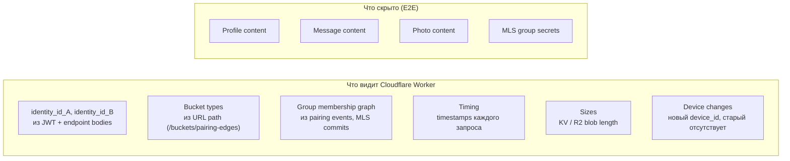

## Description

<!-- SECTION:DESCRIPTION:BEGIN -->

## Что это простыми словами

E2E-шифрование скрывает **содержимое** (что написано в сообщении, что в profile, что на фото). Но сервер **всё равно видит много**:

- **Кто ты** (identity_id — хеш стабильный, лукапится в социальном графе).
- **С кем ты в group** (roster публичен для routing'а сообщений).
- **Когда ты онлайн** (timing запросов).
- **Как часто общаешься** (частота commits + FCM push'ей).
- **Какого размера файлы** (Firestore document size, R2 photo size).
- **Когда сменил устройство** (новый device_id появился, старый отвалился).
- **Recovery event** (GET recovery-blob без предшествующего PUT = "юзер только что потерял устройство").

Это **метаданные**. Content — шифрован. Metadata — видна.

**Противоречие которое решаем**:
- **С одной стороны** — хотим скрыть метаданные (privacy позиционирование).
- **С другой стороны** — сервер **обязан различать пользователей** для quota enforcement (иначе атакующие сломают систему: DoS storage, spam pairing, group flooding, brute-force recovery).

Полная анонимность = отсутствие anti-abuse = катастрофа. Полная линковка = privacy leak. Нужен балансированный подход.

## Зачем

Определяет **дизайн серверных портов сегодня**:
- Если проектируем с `identity_id` в path'ах напрямую (как сейчас в TASK-67 endpoints) → **дешёвый MVP, дорогой upgrade на privacy tier** позже.
- Если проектируем с **opaque types** (OwnerRef, BucketKey, PushTopic) → **чуть дороже сейчас (~2-3 дня внимательного дизайна portов), дешёвый upgrade** (adapter swap, ~2-3 недели).

Плюс определяет **явный список server-side quotas** — сейчас размазан по TASK-104 (KeyPackage rate), TASK-105 (baseline). Нужна консолидированная таблица.

Blocking для:
- TASK-67 pairing (endpoint contracts): решение "opaque OwnerRef или прямой identity_id".
- TASK-42 messenger group (Phase-3+): решение уровня privacy сразу.
- Server-roadmap entries: `SRV-PRIV-001` T1 миграция, `SRV-QUOTA-001` quota layer.

## Что входит технически (для AI-агента)

**Tier framework** (по overview crypto-mentor-overview.md Часть Ξ):

| Tier | Что скрыто | Стоимость build | Кто там |
|---|---|---|---|
| **T0 (наш MVP)** | Только content (E2E) | 0 (уже есть) | WhatsApp business, обычные family apps |
| **T1 (Matrix-tier)** | + pseudonym вместо identity_id в URLs | +2-3 месяца | Matrix, Wire |
| **T2 (Signal-tier)** | + sealed sender + anonymous auth (VOPRF) | +6-12 месяцев | Signal |
| **T3 (Threema/Tor-tier)** | + padding + cover traffic | +12-18 месяцев | Threema PFS, Wickr |
| **T4 (paranoid)** | + zero-knowledge proofs для quotas | +18-36 месяцев | Research only |

**Наш bet**: **T0 в MVP** + **порты спроектированы так что T1 → adapter swap за 2-3 недели**. T2+ — Phase-5+ или не строить.

**Что T1 обёрткой достигается**:
- identity_id в URL → `pseudonym = HMAC(root_key, "server-pseudonym")`.
- Тип bucket'а в path → `BucketKey = HMAC(root_key, bucket_type)`.
- Group ID в FCM topic → `HMAC(exporter_key, "push")`.
- Recovery-blob rotation'ом path'а.

**Что T1 обёрткой НЕ достигается** (fundamental limits):
- Timing (когда юзер онлайн) — cover traffic только T3+.
- Blob sizes — padding только T3+.
- "Тот же юзер vs другой" — anonymous credentials только T2+.

**Port'ы которые надо спроектировать с opaque types сегодня**:
- `RemoteStorage` — принимает `OwnerRef`, `BucketKey` (opaque), не raw path'ы.
- `MlsDelivery` — `GroupRef`, `MemberRef` (opaque).
- `PushChannel` — `PushTopic` (opaque).
- `RecoveryStore` — `RecoveryHandle` (opaque).
- `PairingRendezvous` — `RendezvousToken` (opaque).
- `QuotaEnforcer` — `OwnerRef`, `Resource` enum.
- `AuthTokenProvider` — `AuthCredential` (opaque, JWT сегодня, VOPRF token завтра).

**Server-side quotas** (консолидированная таблица которую надо зафиксировать):

| Ресурс | Лимит family | Enforcement layer |
|---|---|---|
| Групп на identity | 30 | Firestore Rules count |
| Members в group | 200 | Public roster length check |
| Bucket size (один) | 5 MB | Worker validation |
| Общий blob storage per identity | 100 MB | Cloudflare KV counter |
| R2 photo total per identity | 200 MB | R2 counter в KV |
| MLS commits per group per hour | 100 | Worker in-memory rate limit |
| FCM push per identity per hour | 500 | Worker in-memory rate limit |
| Recovery attempts | 5/15min, 20/day | Cloudflare KV counter |
| Pairing sessions active | 10 per identity | TTL 90s cleanup |
| KeyPackages в pool | 100 per device (уже TASK-104) | KV pool cap |

Все эти лимиты требуют **linkable pseudonym** — полная анонимность невозможна без разрушения anti-abuse.

## Состояние

Discussion, Session 1 (2026-07-06). Base material — `docs/dev/crypto-mentor-overview.md` Часть Ξ. Downstream: обновление endpoint contracts в TASK-67, добавление port'ов в архитектурную карту, server-roadmap entries.

<!-- SECTION:DESCRIPTION:END -->

## Acceptance Criteria
<!-- AC:BEGIN -->
- [x] #1 [hand] Session 1 mentor discussion: tier framework + adapter-swap path + quotas table
- [x] #2 [hand] Owner accepted AI-defaults 2026-07-06 (Q1'=A, Q2'=A, Q3'=A, Q4'=A, Q5'=A)
- [x] #3 [hand] Decision block заполнен: MVP tier T0, opaque ports list, quota table, exit ramps T1/T2
- [ ] #4 [hand] Server-roadmap записи: SRV-QUOTA-001, SRV-PRIV-001 (T0→T1), SRV-PRIV-002 (T1→T2) — pending при implementation
- [x] #5 [hand] Status → Draft
- [ ] #6 [hand] Downstream tasks (TASK-67 endpoints с opaque types, docs/architecture/server.md quotas section) уведомлены о `dependencies: [TASK-108]` при next touch
<!-- AC:END -->

## Discussion
<!-- SECTION:DISCUSSION:BEGIN -->

### Session 1 (2026-07-06, mentor skill invoked)

#### A.1 Что за область

**Metadata privacy** — что сервер знает о пользователе помимо шифрованного content'а. Ортогонально E2E encryption (которое покрывает только content). Fundamental trade-off: **anti-abuse требует различать users → linkable pseudonym → некоторая metadata leak неизбежна**.

Наша позиция после Часть Ξ overview: **T0 (только content шифруется)** в MVP, **opaque-типы portов сегодня** чтобы T1 (adapter swap с identity_id → HMAC pseudonym) стоил 2-3 недели, не 2-3 месяца.

#### A.2 Карта темы

**Что сервер видит сегодня в наших endpoints** (после TASK-102/106/67):

**Что T1 upgrade (adapter swap) добавляет к скрытому**:
- identity_id → HMAC pseudonym (сервер не знает связку с Google UID если он был).
- Bucket type в URL → HMAC hash (сервер не знает "это pairing" vs "это profile").
- FCM topic имя → HMAC (сервер не знает какая group куда push'ится).

**Что T1 НЕ скрывает** (fundamental limits transport'а):
- Timing (когда push пришёл — видно always).
- Sizes (Firestore/R2 без padding — размер blob'а виден).
- "Тот же самый юзер" — pseudonym всё равно **стабильный** для одного user'а, значит linkable across requests.

**Что даёт полная T2+ (Signal-tier + anonymous credentials)**:
- Разные токены для каждого запроса → сервер не может linkать "это тот же user".
- Sealed sender → сервер не видит "от кого сообщение".
- Cost: VOPRF cryptography, ~6-12 месяцев работы crypto-инженера.

#### A.3 Главное для новичка

1. **Content vs metadata — разные защиты**. E2E покрывает content. Metadata требует отдельных механизмов.
2. **Anti-abuse требует linkable pseudonym**. Иначе невозможно rate-limit'ить, quota'ить. Полная анонимность = уязвимость DoS.
3. **T0 vs T1 vs T2 — иерархия tiers**. Каждый tier дороже. Каждый tier скрывает больше. Каждый tier имеет фундаментальные пределы (transport-level).
4. **Adapter pattern даёт "T0 → T1 через 2-3 недели"** если port'ы сегодня правильные (opaque types).
5. **T2+ требует переработки identity/auth model**, не просто adapter — это отдельный (не MVP) проект.

#### A.4 Ключевые термины

- **Metadata privacy** — скрытие метаданных использования системы (patterns, timing, sizes) поверх E2E content encryption.
- **Linkable pseudonym** — стабильный идентификатор user'а видимый серверу. Позволяет rate-limit / quota. У нас = `identity_id = hash(root_public)` или (T1) `HMAC(root_key, "server-pseudonym")`.
- **Sealed sender (Signal-tier)** — сервер не видит "от кого" сообщение, только "кому". Требует anonymous credentials.
- **VOPRF (Verifiable Oblivious Pseudo-Random Function)** — крипто-примитив для anonymous rate-limit tokens (клиент получает N токенов, использует один на запрос, сервер валидирует не зная кто user).
- **Cover traffic** — фейковые запросы в случайное время чтобы скрыть реальную activity pattern.
- **Padding** — искусственное увеличение blob'ов до фиксированного размера чтобы скрыть настоящий size.
- **Opaque type** (в domain) — данные которые domain **не может распаковать**, только передать в adapter. Пример: `OwnerRef(private val internal: ByteArray)`.

#### A.5 Уточняющие вопросы (Q1'-Q5')

**Q1' — Ship T0 в MVP или сразу T1?**

- **A**. **T0 в MVP** (identity_id в URL path прямым, минимум работы). Порты с opaque types чтобы T1 был adapter swap. Мой bet.
- **B**. **Сразу T1** (HMAC pseudonym с первого коммита). Стоимость +2-3 месяца в MVP, никакой прямой value для family MVP.
- **C**. **Гибрид**: identity_id как есть, но buckets и FCM topics с HMAC hash сразу. Промежуточный.

**Зачем спрашиваю**: рационально не строить T1 в MVP если family threat model это не требует. Но стоимость adapter design должна быть заплачена **сегодня** — потом дороже. Мой bet — **A** с opaque ports.

---

**Q2' — Server-side quotas — принимаем таблицу целиком или пересматриваем?**

Family default lookups (из Ξ.3, взяты из общих индустриальных практик):

| Ресурс | Family limit |
|---|---|
| Групп на identity | 30 |
| Members в group | 200 |
| Общий blob storage per identity | 100 MB |
| R2 photo total per identity | 200 MB |
| FCM push per identity per hour | 500 |
| Recovery attempts | 5/15min, 20/day |

- **A**. **Принимаем как есть**, значения станут preset field'ами (family default = как выше, clinic может override).
- **B**. **Пересматриваем** — какие-то значения не подходят для нашего family use case.
- **C**. **Deferring** — quota values decide только при implementation TASK-105 baseline.

Мой bet — **A** (принимаем как sensible defaults, tunable via preset).

---

**Q3' — Port'ы с opaque types — implementation cost worth it?**

Список port'ов из A.2:
- RemoteStorage (OwnerRef, BucketKey)
- MlsDelivery (GroupRef, MemberRef)  
- PushChannel (PushTopic)
- RecoveryStore (RecoveryHandle)
- PairingRendezvous (RendezvousToken)
- QuotaEnforcer (OwnerRef, Resource)
- AuthTokenProvider (AuthCredential)

Стоимость сегодня: **~2-3 дня внимательного дизайна port'ов** (заслуживает того, потому что rule 2 ACL + rule 4 MVA — это ровно такое).

- **A**. **Проектируем все 7 port'ов с opaque types сейчас**. Мой bet.
- **B**. **Только identity/auth port'ы** (OwnerRef, AuthCredential) — самые важные для privacy tier. Остальные — regular types.
- **C**. **Только RemoteStorage** — минимальная поверхность.

Мой bet — **A** (всё сразу, чтобы pattern был consistent).

---

**Q4' — T2 (Signal-tier) как долгосрочная цель — да или нет?**

- **A**. **Да, but Phase-5+ / не MVP**. Записываем в server-roadmap.md SRV-PRIV-002 с условием "regulatory pressure или enterprise clinic contract". Готовим T1 экосистему так, чтобы T2 миграция была возможна.
- **B**. **Нет**. T1 достаточно, T2 требует переработки identity model — не стоит цели family + clinic. Не тратим roadmap на это.
- **C**. **Позже решим** — оставляем открытым.

Мой bet — **A** (не строим сейчас, но не закрываем дверь).

---

**Q5' — Что параметризовать пресетом?**

Кандидаты для preset field (per rule 11 preset vs invariant discipline):

- `privacy.tier`: `T0` / `T1` / `T2` — какой tier применяется. Family MVP = T0. Может clinic сегмент захочет T1 сразу.
- `quota.groupsPerIdentity`: family 30 / clinic 200.
- `quota.membersPerGroup`: family 200 / clinic 500.
- `quota.blobStoragePerIdentity`: family 100MB / clinic 5GB.
- `quota.fcmPushPerHour`: family 500 / clinic 2000.
- `quota.recoveryAttemptsPer15min`: family 5 / clinic 3 (stricter).

Мой bet — **все preset field'ами** (values differ per segment, wire format extensible).

#### A.6 Гипотеза рекомендации (à la TASK-105 style)

Если владелец скажет "прими AI defaults":
- **Q1'** = A (T0 MVP + opaque ports для T1 adapter-swap).
- **Q2'** = A (quota table как есть, preset-parameterizable).
- **Q3'** = A (все 7 port'ов с opaque types).
- **Q4'** = A (T2 в roadmap, не строим MVP).
- **Q5'** = все 6 preset field'ов.

**Non-goals** (explicit):
- VOPRF anonymous credentials implementation (T2).
- Cover traffic / padding (T3+).
- Zero-knowledge proofs (T4).
- Rebuilding existing identity model — идентити model остаётся hash(root_public), просто путь к нему через adapter opaque.

**Exit ramps**:
- **T0 → T1** = adapter swap, ~2-3 недели, no wire format break. Server-roadmap `SRV-PRIV-001`. Триггер: first paying customer / ≥ 10k users.
- **T1 → T2** = VOPRF anonymous credentials layer, ~6 месяцев. Server-roadmap `SRV-PRIV-002`. Триггер: regulatory / enterprise clinic contract.
- **Quota enforcement layer** `SRV-QUOTA-001` — реализация unified `QuotaEnforcer` port. Триггер: implementation TASK-105 baseline.

**Contract stability** (inherits TASK-105 Part 1):
- Endpoints остаются `/v1/<domain>/<action>` versioned.
- Bodies: opaque типы (`OwnerRef`, `BucketKey`) serialized как base64 strings в JSON.
- T0 → T1 swap: **бэкенд** может mapping'овать pseudonym → identity_id transparently, **client** не меняется (opaque type absorbs the change).

### Decision (English)

**Owner accepted AI defaults 2026-07-06** (Q1'=A, Q2'=A, Q3'=A, Q4'=A, Q5'=A).

**Choice**:

**Part 1 — Tier commitment**:
- **MVP ships at Tier T0**: content is E2E-encrypted, metadata (identity_id in URLs, bucket type in path, group ID in FCM topic, timing, sizes) is visible to server.
- **Tier T1 designed-in as adapter-swap** (not built now). Ports use opaque types so identity_id → HMAC pseudonym migration is 2-3 weeks of adapter work, not domain refactor.
- **Tier T2+** (Signal-tier + VOPRF anonymous credentials) is roadmap-only, not built without explicit trigger (regulatory / enterprise contract).

**Part 2 — Server-side quota table (family defaults, all preset-parameterizable per rule 11)**:

| Resource | Family default | Enforcement |
|---|---|---|
| Groups per identity | 30 | Firestore Rules count |
| Members per group | 200 | Public roster length check |
| Bucket size (each) | 5 MB | Worker validation |
| Total blob storage per identity | 100 MB | Cloudflare KV counter |
| R2 photo total per identity | 200 MB | R2 counter in KV |
| MLS commits per group per hour | 100 | Worker in-memory rate limit |
| FCM push per identity per hour | 500 | Worker in-memory rate limit |
| Recovery attempts | 5 / 15 min, 20 / day | Cloudflare KV counter |
| Pairing sessions active | 10 per identity | TTL 90s cleanup |
| KeyPackages in pool | 100 per device | Inherited from TASK-104 |

**Part 3 — Opaque port design (mandatory for TASK-67 endpoint contracts + all new server-facing ports)**:

Seven ports must expose only opaque types to domain code:

| Port | Opaque types | Encapsulates |
|---|---|---|
| `RemoteStorage` | `OwnerRef`, `BucketKey` | Firestore path scheme for buckets |
| `MlsDelivery` | `GroupRef`, `MemberRef` | Paths for MLS commits + KeyPackage store |
| `PushChannel` | `PushTopic` | FCM topic naming scheme |
| `RecoveryStore` | `RecoveryHandle` | Recovery blob path |
| `PairingRendezvous` | `RendezvousToken` | Pairing session ID |
| `QuotaEnforcer` | `OwnerRef`, `Resource` (enum) | Rate limit + quota abstraction |
| `AuthTokenProvider` | `AuthCredential` | Firebase JWT today, VOPRF token later |

Domain code MUST NOT construct or read internals of these opaque types — only pass them to adapters. Fitness function: lint rule detecting domain code accessing `.internal` byte-arrays of opaque types.

**Part 4 — Preset-parameterizable fields** (per rule 11 preset vs invariant discipline; go into `PresetV2.privacy` and `PresetV2.quota`):

- `privacy.tier`: enum `T0` / `T1` / `T2` — family default `T0`.
- `quota.groupsPerIdentity`: int — family 30 / clinic 200.
- `quota.membersPerGroup`: int — family 200 / clinic 500.
- `quota.blobStoragePerIdentityMB`: int — family 100 / clinic 5000.
- `quota.fcmPushPerHour`: int — family 500 / clinic 2000.
- `quota.recoveryAttemptsPer15min`: int — family 5 / clinic 3.

**Part 5 — Architectural invariants** (hardcoded, same across all presets):
- `identity_id` never leaks into domain code beyond identity layer. Domain sees `OwnerRef` only.
- Quota enforcement is server-mediated; client cannot bypass by claiming lower usage.
- Adapter layer owns all path construction (no `"/users/${id}/..."` string interpolation in domain).

**Applies to**:
- **TASK-67** (pairing endpoints) — request/response bodies use `OwnerRef` opaque encoding, not raw `identity_id` string.
- **TASK-102** (device management group revoke) — profile edit uses `OwnerRef` for target, not `identity_id`.
- **TASK-104** (KeyPackage rate limit) — dedup key uses `OwnerRef`, not `identity_id`.
- **TASK-105** (server baseline) — quota table in this Decision extends TASK-105 baseline.
- **TASK-19** (config sync) — bucket paths through `BucketKey`, not raw path strings.
- **TASK-27** (future messenger), **TASK-42** (group encryption) — inherit opaque port design.
- **docs/architecture/server.md** — quota table + tier framework section added.

**Non-goals** (explicit):
- VOPRF anonymous credentials implementation (T2).
- Cover traffic / padding for size hiding (T3+).
- Zero-knowledge proofs for quota tokens (T4).
- Rebuilding identity model — `identity_id = hash(root_public)` stays; T1 layers HMAC pseudonym **on top** via adapter, does not replace primary identifier.
- Public search / directory (out of scope, separate future decision if ever built — see TASK-109 candidate).

**Exit ramps**:

- **T0 → T1 upgrade** (`SRV-PRIV-001` in server-roadmap): adapter swap only. Domain untouched. Estimate 2-3 weeks. Trigger: first paying customer, or 10 000 users, or regulatory ask.
- **T1 → T2 upgrade** (`SRV-PRIV-002`): VOPRF anonymous credentials layer. Estimate 6-12 months of crypto engineering. Trigger: enterprise clinic contract explicitly requiring, or new privacy regulation.
- **Quota enforcement layer** (`SRV-QUOTA-001`): unified `QuotaEnforcer` port implementation. Cloudflare KV counters + Firestore Rules. Trigger: implementation of TASK-105 baseline. Estimate: 1-2 weeks.
- **Search/discovery** (deferred; if built): additive endpoint + directory storage. Sacrifices T2 ceiling. Family/clinic MVP does not need. Decision task if ever activated.

**Rationale**:
- **T0 is enough for family/clinic threat model**: family members know each other physically, clinic uses admin-issued invites. No adversary in threat model with resources to exploit metadata patterns.
- **Opaque ports today are cheap** (~2-3 days of careful port design), enable **cheap upgrade** (~2-3 weeks) later. Skipping opaque design = 2-3 months + risk of data leakage during migration.
- **T2 in MVP is over-engineering** (rule 4 MVA violation): ~6-12 months of crypto engineering without value for family segment.
- **Quota values are industry-standard defaults**: 30 groups (Signal), 200 members (Signal group cap 2024), 100 MB blob (WhatsApp storage per user), 500 push/hour (FCM safe throughput). Preset-parameterizable for clinic segment.

**Trade-offs**:
- **Metadata leakage in T0**: family social graph, timing patterns, device switches visible to Cloudflare. Accepted for family threat model.
- **Opaque type discipline overhead**: developers must resist writing `path = "/users/${id}"` and go through adapters. Fitness function catches violations.
- **Preset-parameterizable quota values**: bug risk if preset misconfigured. Server enforces global sanity limits (e.g. group members ≤ 1000) as additional invariant.
- **T2 door left open but expensive**: if ever needed, ~6-12 months of crypto engineering. Accepted as low-probability scenario for our segment.

**Session boundary**: TASK-108 Decision mutable per rule 11 mutability window until implementation begins. When TASK-67 or TASK-102 implementation lands with opaque port usage — Decision block becomes immutable.

<!-- SECTION:DISCUSSION:END -->

## Implementation Plan
<!-- SECTION:PLAN:BEGIN -->
_(pending — feature-tasks используют Decision block после закрытия)_
<!-- SECTION:PLAN:END -->
