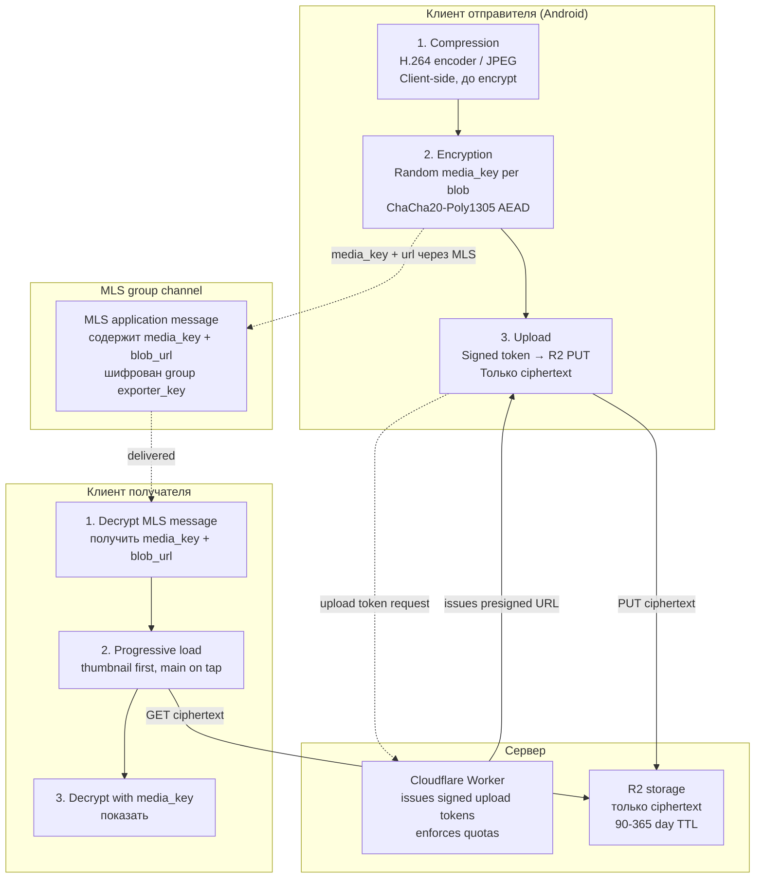

## Description

<!-- SECTION:DESCRIPTION:BEGIN -->

## Что это простыми словами

Family album, contact photos, будущий messenger — всё это **отправка медиа** (фото, короткие видео, аудио) через нашу зашифрованную группу. Проблема:

- **Фото 4K с телефона** — 5-20 MB. **Видео 4K 30 сек** — 100-500 MB. Не влезает ни в MLS сообщение, ни в Cloudflare KV, ни в FCM push.
- **E2E-требование**: сервер не должен видеть содержимое. Значит **нельзя пересжимать на сервере** (как делают Telegram/Discord).
- **Membership change** (Таня добавила Петю в family group) — если фото зашифрованы через `group_exporter_key`, они должны быть **перешифрованы** при каждом Add. Не работает для сотен фото.

**WhatsApp решил это** (Signal Protocol наследуется): **compress → encrypt → upload — всё на клиенте отправителя**. Сервер видит только ciphertext. Ключи per-blob случайные, отправляются через MLS-канал.

**Что решаем в TASK-110**:
1. Как compress (какие форматы, качество, лимиты по размеру).
2. Как encrypt (random media_key per blob vs derived).
3. Thumbnail handling (preview быстрый vs main lazy).
4. EXIF / metadata redaction (privacy).
5. Video поддержка в MVP или нет.
6. Storage backend и quotas.

## Зачем

Разблокирует:
- **TASK-11** (Contact photos + Family album foundation) — photo pipeline design.
- **TASK-28** (Full Shared Family Album) — full-scale photo/album feature.
- **TASK-27** (Elderly-Friendly Messenger — Jitsi-based) — media в сообщениях.
- **TASK-9** (Contact Tiles Handoff Calling) — photo на плитке контакта.

Плюс определяет:
- **Wire format для media envelope** (per rule 5 versioning) — какие поля хранят photoUrl / media_key / thumbnail info.
- **R2 quota policy** — как enforcing лимиты (`SRV-QUOTA-002` в server-roadmap).
- **Upload token flow** — signed pre-authorized URLs vs direct upload.

## Что входит технически (для AI-агента)

**Три слоя transformation pipeline** (per WhatsApp pattern из Часть Ρ overview):

1. **Compression** (клиент):
   - Photo: JPEG quality 85% для family default. Long-edge resize до 2048px.
   - Video: H.264 (аппаратный encoder Android), 720p, bitrate cap 2 Mbps, продолжительность cap 30 сек (family) / 60 сек (clinic).
   - Audio: Opus 32 kbps.
   - Все — **до encryption**, cleartext только в RAM устройства отправителя.

2. **Encryption** (клиент):
   - **Random `media_key` per blob** (32 байта, ChaCha20-Poly1305 AEAD).
   - Не производный от group secrets — membership change не требует re-encrypt.
   - Thumbnail — **отдельный blob** с отдельным `thumbnail_key`.
   - `media_key` + `thumbnail_key` + `blob_url` + `thumbnail_url` — упакованы в MLS application message → отправляются через group exporter_key.

3. **Upload** (клиент → R2):
   - **Signed upload token** от Cloudflare Worker (WhatsApp / Signal pattern per Часть Π.2).
   - Client запрашивает `POST /v1/media/upload-token { size, kind, contentHash }` → server возвращает presigned R2 URL с TTL 5 min + max_size enforced.
   - Client PUT'ит ciphertext напрямую в R2. Server видит только meta (size, hash), не content.

**Media envelope wire format** (schemaVersion 1):
```
MediaEnvelope {
  schemaVersion: 1,
  mediaKind: enum {photo, video, audio, thumbnail},
  blobUrl: string,           // R2 URL, opaque
  mediaKey: base64,          // 32 bytes AEAD key
  contentType: string,       // "image/jpeg" etc.
  sizeBytes: number,
  thumbnailBlobUrl: string?, // R2 URL для preview
  thumbnailKey: base64?,     // ключ для preview
  metadata: {                // encrypted через group key
    createdAt: number,
    dimensions?: { w, h },
    duration?: number        // для video/audio
  }
}
```

**Metadata redaction**:
- EXIF (GPS location, camera model, timestamps): **strip всё** client-side до encryption (WhatsApp default).
- Оставляем только что нужно UX: `dimensions`, `duration`, `createdAt` — упакованы в envelope, зашифрованы через group.

**R2 storage design** (per TASK-108 opaque ports):
- Key naming: `HMAC(root_key, blob_id)` — не raw identity_id.
- Retention: 90 days (family default) / 365 days (clinic).
- Quotas: 200 MB total per identity (family) / 5 GB (clinic).

**Progressive loading**:
- MLS message включает `thumbnailBlobUrl` + `thumbnailKey`.
- Client при получении MLS message → сразу GET thumbnail (маленький, ~10-30 KB) → decrypt → показать preview.
- При тапе → GET main blob → decrypt → показать full.

**Trade-offs — что теряем vs Telegram/Discord model**:
- Server-side transcoding (пересжать под получателя) — **нельзя**, E2E.
- Adaptive bitrate streaming (HLS/DASH) — нельзя.
- Multiple quality variants — только если отправитель делает сам.
- Server-side thumbnails — нельзя, отправитель делает сам.
- Auto content moderation (CSAM detection) — нельзя, только реактивно через abuse reports.

## Состояние

Discussion, Session 1 (2026-07-06). Base material — `docs/dev/crypto-mentor-overview.md` Часть Ρ. Downstream: TASK-11 photo feature spec, wire format additions to `push-worker/contracts/`, server-roadmap SRV-QUOTA-002 + SRV-MEDIA-001 entries.

<!-- SECTION:DESCRIPTION:END -->

## Acceptance Criteria
<!-- AC:BEGIN -->
- [x] #1 [hand] Session 1 mentor discussion: compression + encryption + upload pipeline framework
- [x] #2 [hand] Owner answered Q1'=B, Q2'=A, Q3'=A, Q5'=A, Q6'=DI-abstraction, Q7'=A (2026-07-07). Q4' EXIF policy deferred (TODO)
- [x] #3 [hand] Decision block filled: pipeline stages, media envelope wire format, preset fields, exit ramps
- [ ] #4 [hand] Downstream tasks (TASK-11, TASK-28, TASK-27, TASK-9) notified about `dependencies: [TASK-110]` at next touch
- [ ] #5 [hand] Server-roadmap entries: SRV-MEDIA-001 (upload token issuer), SRV-QUOTA-002 (R2 media quota) — pending at implementation
- [x] #6 [hand] Status → Draft
- [ ] #7 [hand] Q4' EXIF policy decision — deferred TODO, resolve при implementation TASK-11 / TASK-28
<!-- AC:END -->

## Discussion
<!-- SECTION:DISCUSSION:BEGIN -->

### Session 1 (2026-07-06, mentor skill invoked)

#### A.1 Что за область

**Client-side media transformation** — как отправить фото/видео/аудио в E2E-группе так, чтобы сервер видел только ciphertext, а получатели могли расшифровать и показать. Ортогонально MLS group crypto (TASK-104) — MLS шифрует **ключ к media**, не сам media.

Индустриальный pattern: **WhatsApp** (Signal Protocol наследует), **Signal**, **iMessage**. Работает 10+ лет в проде на миллиардах устройств. Наш случай — копирование этого паттерна для family album / contact photos / future messenger media.

#### A.2 Карта темы

**Три слоя pipeline**:



**Ключевая архитектурная сепарация**:
- **MLS group channel** (маленький, MLS шифрует, sender key ratchets) — несёт `media_key` + `blob_url`.
- **R2 blob storage** (большой, ciphertext, независимая AEAD) — несёт сам media.

Это позволяет **membership change не требует re-encrypt фото** — новый member через MLS Welcome получит все прошлые группа-сообщения (включая media_keys) → сможет расшифровать старые фото. `exporter_key` меняется, `media_key` — нет.

#### A.3 Главное для новичка

1. **Compress → Encrypt → Upload — на клиенте отправителя**. Сервер никогда не видит plaintext. Это фундамент E2E media.
2. **Random media_key per blob** — не производный. Отправляется через group channel. При membership change старые ключи всё ещё известны в MLS history (через Welcome нового member'а).
3. **Thumbnail отдельным blob'ом** — preview быстрый, main lazy load. Иначе UX ленты фото ломается.
4. **EXIF strip обязателен** — GPS location из iPhone фото = privacy leak. WhatsApp делает по default.
5. **Server видит только meta** (size, contentType hash) — этого достаточно для quota enforcement (TASK-108), не требует reading content.

#### A.4 Ключевые термины

- **AEAD** (Authenticated Encryption with Associated Data) — шифр который одновременно шифрует и защищает от подмены. ChaCha20-Poly1305 (fast on ARM) или AES-256-GCM.
- **Media envelope** — MLS application message с полями `blob_url` + `media_key` + `thumbnail_url` + `thumbnail_key` + metadata. Шифруется группе через exporter_key.
- **`media_key`** — случайный 32-байтный ключ, генерируется клиентом отправителя, используется для AEAD ciphertext blob'а.
- **Signed upload token** — предавторизованный URL от нашего Cloudflare Worker для R2 upload, TTL 5 min, max_size enforced. Клиент PUT'ит по нему напрямую в R2 без passing content через Worker.
- **Progressive loading** — сначала thumbnail (быстро, ~10-30 KB), потом main (по тапу, MB).
- **Content-Type sniffing** — client определяет MIME type до encrypt для правильной decompression получателем.
- **EXIF (Exchangeable Image File Format)** — metadata в JPEG (GPS location, camera model, timestamp). Обычно strip'аем полностью для privacy.
- **H.264 aparatный encoder** — hardware chip в Android SoC делающий compression видео быстро (не CPU). MediaCodec API.
- **R2 (Cloudflare R2)** — S3-совместимый object storage от Cloudflare. Free tier достаточно для family scale.

#### A.5 Уточняющие вопросы (Q1'-Q7')

**Q1' — Compression settings: hardcoded family defaults или preset-parameterizable?**

Кандидаты значений:
- **Photo**: JPEG quality 85%, long-edge resize 2048px, max size 5 MB.
- **Video** (если включаем): H.264, 720p, 2 Mbps bitrate, duration cap 30 sec, max size 15 MB.
- **Audio** (если включаем): Opus 32 kbps, max duration 60 sec, max size 500 KB.

- **A. Hardcoded family defaults** — MVP simple, tune later при появлении metrics.
- **B. Preset-parameterizable** (family / clinic overrides). Consistent с TASK-102/104/108 pattern.
- **C. User-tunable в settings** — "HD photo" toggle как WhatsApp 2023.

**Мой bet** — **B** (preset). Consistent с rule 11 discipline. Family = defaults выше, clinic = 4K photo, longer video для medical documentation.

---

**Q2' — media_key derivation: random per blob или derived from group?**

- **A. Random per blob** (WhatsApp verified pattern). Membership change не требует re-encrypt.
- **B. Derived from group exporter_key + blob_id salt** — deterministic, no extra key transport. Но при epoch change нужен re-derive.
- **C. Hybrid** — random для photo (long-lived), derived для messenger messages (ephemeral).

**Мой bet** — **A** (random per blob). Индустриальный proven pattern. WhatsApp / Signal / iMessage используют именно так. Overhead — 32 байта per blob в MLS message, приемлемо.

---

**Q3' — Thumbnail policy: отдельный blob или inline в MLS message?**

- **A. Отдельный encrypted blob** в R2 + отдельный thumbnail_key. Preview быстрый (~10-30 KB blob), main lazy load по тапу. WhatsApp pattern.
- **B. Inline в MLS message** — thumbnail как base64 в metadata (limit ~2KB image). Один round-trip, но большой MLS message.
- **C. No thumbnails MVP** — сразу main. Медленный UX для photo grid.

**Мой bet** — **A** (отдельный blob). Правильный UX для photo grid (family album 100+ фото — sequential load thumbnails).

---

**Q4' — EXIF / metadata redaction: strip всё, keep, или user choice?**

- **A. Strip всё client-side** до encrypt. WhatsApp default. GPS coordinates не leak'аются, camera model не leak'аются.
- **B. Keep EXIF** — better UX (Google Photos может group'ить по location, timestamp). Family use case часто хочет "фото из отпуска" grouping.
- **C. User choice per photo** — UI toggle. Complex UX для elderly.

**Мой bet** — **A** (strip all default). GPS location + camera fingerprint = серьёзный privacy leak. Оставляем только `createdAt` + `dimensions` в encrypted envelope metadata (безопасные для sharing).

---

**Q5' — Video support в MVP или Phase-3+?**

- **A. Photos only MVP**, video Phase-3+. H.264 encoder integration сложнее (MediaCodec Android API, edge cases OEM-specific).
- **B. Photos + short video** (< 30 sec, no audio, single quality). Расширяет use case (SOS video для elderly).
- **C. Full video** (multiple qualities, audio, up to 60 sec).

**Мой bet** — **A** (photos only MVP). Video добавляет 2-3 weeks integration + testing complexity. Family album MVP = photos достаточно. Video через отдельный decision task при активации TASK-27 messenger.

---

**Q6' — Storage backend: R2 vs alternative?**

- **A. Cloudflare R2** (planned per server-roadmap). Free tier 10 GB / month. S3-compatible API. Native Cloudflare Worker integration.
- **B. Firestore** для small (< 1 MB) + R2 для large. Two-tier complexity.
- **C. Own S3** через own-server migration (later).

**Мой bet** — **A** (R2). Уже в стеке через server-roadmap, no additional vendor. Migration path на own S3 = adapter swap (per TASK-108 opaque ports).

---

**Q7' — Media quota per identity: какие лимиты?**

Из TASK-108 quota table:
- Total blob storage per identity: 100 MB (family) / 5 GB (clinic).
- R2 photo total per identity: 200 MB (family) / нужно clinic значение.

- **A. Use TASK-108 quotas as-is** — 200 MB family photo total, retention 90 days.
- **B. Split по media type** — photos 200 MB, video 500 MB (если Q5=B), audio 50 MB. Разные retention.
- **C. Preset-parameterizable** только retention days, size hardcoded.

**Мой bet** — **A** (use TASK-108 as-is, single 200 MB photo bucket). Consistent, simple. Video decision при активации.

#### A.6 Гипотеза рекомендации (à la TASK-105 style)

Если владелец скажет "прими AI defaults":
- **Q1'** = B (preset-parameterizable compression settings; family default JPEG 85% / 2048px / 5MB).
- **Q2'** = A (random media_key per blob, WhatsApp verified pattern).
- **Q3'** = A (отдельный encrypted thumbnail blob).
- **Q4'** = A (strip all EXIF default, encrypted envelope keeps только `createdAt` + `dimensions`).
- **Q5'** = A (photos only MVP, video Phase-3+ через TASK-27 activation).
- **Q6'** = A (Cloudflare R2, planned).
- **Q7'** = A (TASK-108 quotas as-is, single 200 MB photo bucket family).

**Non-goals** (explicit):
- Server-side transcoding / adaptive streaming (нельзя в E2E).
- Auto CSAM detection (реактивно через abuse reports, отдельно в TASK-111 abuse framework).
- Multi-quality variants (single quality MVP; отправитель может делать сам если нужно).
- Video в MVP (photos only).
- Cross-device background sync photos (Phase-3+).

**Exit ramps**:
- **Video enable**: additive — новое `mediaKind: video` в wire format, схема extensible через schemaVersion. Estimate 2-3 weeks integration. Trigger — активация TASK-27 messenger media.
- **Adaptive quality**: клиент отправителя генерит 2-3 версии, encrypted отдельными blobs. Additive. Trigger — если family album feedback requests HD/SD toggle.
- **Own S3 migration**: R2 → S3-compatible через adapter swap (TASK-108 opaque ports). Estimate 1 week. Trigger — own-server migration Phase.
- **CDN caching**: R2 native CDN (Cloudflare edge). No extra work needed.

**Contract stability** (inherits TASK-105 Part 1):
- Wire format `MediaEnvelope` versioned via `schemaVersion`.
- Endpoint: `POST /v1/media/upload-token { schemaVersion, size, kind, contentHash }` → `{ schemaVersion, presignedUrl, expiresAt, maxSize }`.
- R2 blob path через `HMAC(root_key, blob_id)` (opaque per TASK-108).

### Decision (English)

**Owner answered 2026-07-07** (Q1'=B preset, Q2'=A random per blob, Q3'=A separate thumbnail, Q4' deferred TODO, Q5'=A photos-only-MVP, Q6' = DI abstraction via BlobStoragePort, Q7'=A TASK-108 quotas).

**Choice**:

**Part 1 — Pipeline (three stages, client-side)**:

1. **Compression** — hardware-accelerated JPEG encoder (photo). Video/audio deferred (Phase-3+ via separate decision).
2. **Encryption** — random 32-byte `media_key` per blob, ChaCha20-Poly1305 AEAD. `media_key` transported via MLS application message (encrypted under group exporter_key).
3. **Upload** — signed pre-authorized URL from Cloudflare Worker → PUT ciphertext direct to R2 (or swapped backend via adapter). Server never sees plaintext.

**Part 2 — Media envelope wire format** (`schemaVersion: 1`, per rule 5):

```
MediaEnvelope {
  schemaVersion: 1,
  mediaKind: enum {photo, thumbnail},  // video/audio Phase-3+
  blobHandle: BlobHandle,               // opaque, adapter-specific
  mediaKey: base64,                     // 32-byte AEAD key
  contentType: string,                  // "image/jpeg"
  sizeBytes: number,
  thumbnailBlobHandle: BlobHandle?,     // separate blob for progressive load
  thumbnailKey: base64?,
  metadata: {                           // encrypted via group key
    createdAt: number,
    dimensions?: { w, h }
  }
}
```

Envelope carried inside MLS application message (encrypted under group exporter_key). Server sees only ciphertext blob in R2 + envelope ciphertext in MLS message queue.

**Part 3 — Storage abstraction (DI-based, no vendor lock)**:

Domain port (`core/src/commonMain/kotlin/domain/media/`):

```
port BlobStoragePort {
  suspend fun requestUploadUrl(size: Int, kind: MediaKind, contentHash: ByteArray): UploadTicket
  suspend fun uploadCiphertext(ticket: UploadTicket, bytes: ByteArray): BlobHandle
  suspend fun downloadCiphertext(handle: BlobHandle): ByteArray
  suspend fun deleteBlob(handle: BlobHandle)
}
data class BlobHandle(private val internal: ByteArray)   // opaque per TASK-108
data class UploadTicket(private val internal: ByteArray) // presigned URL + TTL
```

Adapters (`app/adapters/blob-storage/`):
- **`CloudflareR2Adapter`** — MVP default. Cloudflare Worker issues presigned URL, client PUTs to R2.
- **`OwnS3Adapter`** — post own-server migration (S3-compatible or MinIO).
- **`LocalFileAdapter`** — dev mode + integration tests.
- **`FakeBlobStorageAdapter`** — unit tests.

DI wiring per build variant (`app/di/BlobStorageModule.kt`). Domain code never references R2 / S3 / vendor names — only `BlobStoragePort` + opaque handles.

**Part 4 — Progressive loading pattern**:
- MLS application message contains both `blobHandle` (main) + `thumbnailBlobHandle` + both keys.
- Client at receive → immediately `downloadCiphertext(thumbnailBlobHandle)` → decrypt → show preview in list.
- On tap → `downloadCiphertext(blobHandle)` → decrypt → show full.
- Thumbnail typical size ~10-30 KB, main 1-5 MB.

**Part 5 — Preset-parameterizable fields** (rule 11 preset vs invariant; go into `PresetV2.media`):

| Field | Type | Family default | Notes |
|---|---|---|---|
| `photoJpegQuality` | int (1-100) | 85 | Compression quality |
| `photoMaxLongEdgePx` | int | 2048 | Resize threshold |
| `photoMaxSizeMB` | int | 5 | Post-compression cap |
| `thumbnailSizePx` | int | 200 | Long-edge for preview |
| `blobRetentionDays` | int | 90 | R2 auto-delete after N days |
| `mediaQuotaMB` | int | 200 | Total per identity (inherits TASK-108) |
| `exifPolicy` | enum | `TODO` | Deferred — see non-goals below |

**Part 6 — Architectural invariants** (hardcoded across presets):
- Random `media_key` per blob (never derived from group secrets).
- Client-side compression before encryption (no server-side).
- Thumbnails as separate encrypted blob (not inline in MLS message).
- Blob paths / handles opaque via `BlobHandle` (no `identity_id` in URL per TASK-108).
- Signed upload token TTL max 5 minutes.
- Content-type validated client-side before upload (server enforces max_size via presigned URL).

**Part 7 — Endpoint contracts** (inherits TASK-105 Part 1 baseline):

- `POST /v1/media/upload-token`
  - Request: `{ schemaVersion: 1, size: number, kind: string, contentHash: string }`
  - Response: `{ schemaVersion: 1, data: { presignedUrl: string, blobHandle: string, expiresAt: number, maxSize: number } }`
  - Errors: `401` (auth), `413` (size exceeds quota), `429` (rate limit).
- `DELETE /v1/media/blob/{blobHandle}` — for expired / user-deleted content.

**Applies to**:
- **TASK-11** (Contact Photos + Family Album foundation) — inherits pipeline for contact photo feature.
- **TASK-28** (Full Shared Family Album) — full-scale album feature uses this envelope.
- **TASK-27** (Elderly-Friendly Messenger) — media in messages via same pipeline (photos MVP; video Phase-3+ decision).
- **TASK-9** (Contact Tiles Handoff Calling) — contact avatar photo.
- **docs/architecture/crypto.md** — new section "Media pipeline" added at next touch.

**Non-goals** (explicit):
- Video / audio support MVP (photos only; Phase-3+ decision when TASK-27 activated).
- Server-side transcoding / adaptive streaming (impossible in E2E).
- Multi-quality variants (single quality MVP; sender may pre-generate if needed).
- Auto CSAM / content moderation (reactive via abuse reports — separate future TASK-111 candidate).
- Cross-device background sync (Phase-3+).
- **EXIF policy** — deferred TODO, resolve at implementation (TASK-11 / TASK-28). Industry split (WhatsApp/Signal strip vs iMessage/Telegram keep). Family use case not clearly decided. `TODO(media-exif): decide strip-all vs preset-parameterizable at TASK-11 speckit.clarify`.

**Exit ramps**:

- **Video enable** (Phase-3+): additive `mediaKind: video` in wire format via schemaVersion 2. H.264 MediaCodec Android integration ~2-3 weeks. Server-roadmap: `SRV-MEDIA-002`.
- **Adaptive quality** (if feedback requests HD/SD toggle): sender generates 2-3 variants, encrypted as separate blobs. Additive. Server-roadmap: `SRV-MEDIA-003`.
- **Own S3 migration**: `BlobStoragePort` adapter swap R2 → S3-compatible. Domain untouched. ~1 week. Server-roadmap: `SRV-MEDIA-001`.
- **CSAM / abuse response**: reactive via abuse reports — separate TASK-111 candidate. Server-roadmap: `SRV-ABUSE-001`.
- **CDN caching**: R2 native Cloudflare edge (no extra work).
- **EXIF policy resolution**: at TASK-11 implementation, decide strip-all vs preset. TODO in code + spec.

**Rationale**:
- **Random `media_key` per blob** = industry unanimous (WhatsApp / Signal / iMessage / Telegram Secret / Element / Wire). Membership change never re-encrypts old media.
- **Separate thumbnail blob** = WhatsApp UX pattern; family album with 100+ photos needs fast grid scroll.
- **Photos-only MVP** = 2-3 weeks saved (video MediaCodec OEM edge cases). Video adds later without wire break.
- **DI abstraction** = per rule 1 (domain isolation) + rule 2 (ACL); consistent with TASK-108 opaque types; adapter swap = no domain change on own-server migration.
- **Cloudflare R2 MVP** = free tier 10 GB/month sufficient for family scale; native Worker integration; migration path via BlobStoragePort adapter swap.
- **EXIF deferred** = not blocking; single-file client-side decision resolvable at implementation time.

**Trade-offs**:
- **No server-side transcoding**: sender generates all variants. Acceptable for family album (typically single quality).
- **No adaptive streaming**: full blob download per view. Family album photos ≤ 5 MB → tolerable on mobile networks.
- **Client CPU/battery cost**: hardware JPEG encoder minimal; H.264 encoder (future video) has cost — deferred with feature.
- **Storage cost**: family default 200 MB × N users; R2 free tier sufficient MVP. Clinic preset override anticipated.
- **EXIF deferred = residual privacy risk** until decided: possible leak if photos exfiltrated pre-implementation. Mitigation: default-strip in implementation until decision made explicit.

**Session boundary**: TASK-110 Decision mutable per rule 11 mutability window until implementation begins. When TASK-11 / TASK-28 lands with real code using BlobStoragePort — Decision block becomes immutable.

<!-- SECTION:DISCUSSION:END -->

## Implementation Plan
<!-- SECTION:PLAN:BEGIN -->
_(pending — feature-tasks TASK-11 / TASK-28 / TASK-27 используют Decision block после закрытия)_
<!-- SECTION:PLAN:END -->
