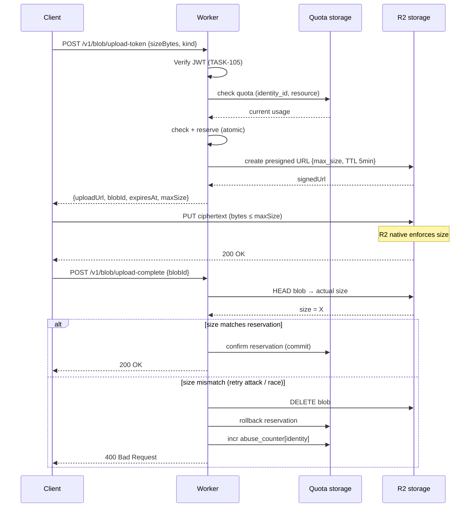
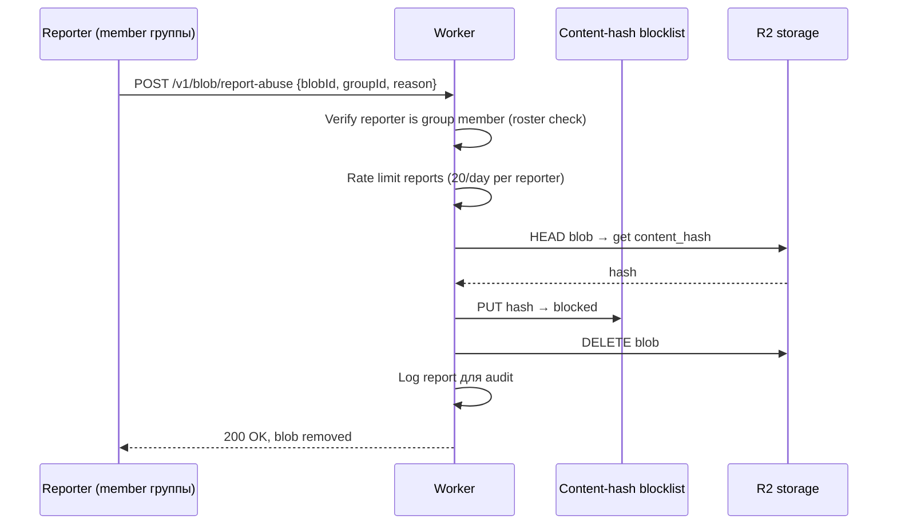

## Description

<!-- SECTION:DESCRIPTION:BEGIN -->

## Что это простыми словами

**Проблема**: наша система E2E — сервер не видит содержимое blob'ов (photos, backup blobs, attachments). Значит **клиент технически может залить хоть 100 GB** — сервер "не знает" что это photo или архив, размер вроде маленький в заголовке, а реальный blob — большой. **Client-side лимиты бесполезны** — атакующий патчит клиент и обходит.

Плюс: **illegal content risk** — E2E-система может хранить нелегальное (CSAM, terrorism), мы не видим. Что делаем при user report?

**Индустрия решила это давно** — WhatsApp / Signal / iCloud E2E используют один pattern:

> **Сервер не видит что** ты загружаешь, но **enforce'ит сколько**. Проверяет **байты**, а не **смысл**.

Механизмы:
1. **Signed upload token** — клиент не пишет в storage напрямую. Каждый upload требует **предавторизованный URL** от нашего сервера с `max_size` enforced.
2. **Quota check до выдачи token'а** — если у user'а 200 MB заняты, upload URL не выдаётся.
3. **Post-upload verify** — сервер проверяет `HEAD blob` после upload'а, при size mismatch — удаляет.
4. **Rate limits per identity per resource** — cool-down от bulk atomic upload attacks.
5. **Abuse report mechanism** — reactive модерация: user жалуется → blob удаляется + hash blocklist (нельзя re-upload).

**Что не делаем**:
- Client-side scanning content'а до encrypt'а (Apple CSAM 2021 попытка сломала E2E — не повторяем).
- Server-side content inspection (не можем — encrypted).
- Backdoor keys для "lawful access" (никогда).
- Auto CSAM detection (реактивно только через reports).

## Зачем

Разблокирует:
- **TASK-110** (media pipeline) — signed upload token flow конкретизирует.
- **TASK-11 / TASK-28** (photo features) — storage abuse защита.
- **TASK-100** (history backup future) — при активации HIST-BACKUP-001 backup blobs нужны те же защиты.
- **TASK-27** (messenger media) — attachment abuse защита.
- Любой future feature с blob upload.

Плюс определяет:
- **Quota storage tier** — Durable Objects vs Firestore vs KV. Влияет на consistency + latency + cost.
- **Server-roadmap entries**: `SRV-QUOTA-002` (persistent quota counter), `SRV-ABUSE-001` (abuse report handler).
- **Legal compliance baseline** — abuse response mechanism нужен для Section 230-like defense.

## Что входит технически (для AI-агента)

**Три endpoint'а** (Cloudflare Worker, per TASK-105 baseline):

1. **`POST /v1/blob/upload-token`**:
   - Request: `{ schemaVersion: 1, sizeBytes: number, kind: BlobKind, blobIdHint: string }`
   - Worker: verify JWT → extract identity_id → check quota → check rate limit → issue R2 presigned URL с max_size + TTL 5 min.
   - Response: `{ schemaVersion: 1, data: { uploadUrl: string, blobId: string, expiresAt: number, maxSize: number } }` или `429 Quota Exceeded`.

2. **`POST /v1/blob/upload-complete`**:
   - Client вызывает после успешного PUT в R2.
   - Worker: `HEAD` blob в R2 → actual size confirmation. Если mismatch — DELETE blob + rollback quota.
   - Post-upload verification double-check (защита от retry attacks / race conditions).

3. **`POST /v1/blob/report-abuse`**:
   - Request: `{ schemaVersion: 1, blobId: string, groupId: string, reason: enum, description?: string }`
   - Worker: verify reporter is group member → schedule blob deletion → add content hash to blocklist (нельзя re-upload).
   - Rate-limited per reporter (иначе злоумышленник report'ит legitimate content).

**Quota enforcement backend** (main open question — Q1'):

| Option | Consistency | Latency | Cost | Complexity |
|---|---|---|---|---|
| Cloudflare Durable Objects per (identity, resource) | Strong (single-instance) | ~20 ms | ~$0.20 / million requests | Medium |
| Firestore transaction | Strong | ~200 ms | Free tier достаточно | Low |
| Cloudflare KV counter + over-allocation buffer | Eventually consistent | ~10 ms | Free | Low but sloppy |

**Post-upload verify** — Worker HEAD blob через 5-10 сек после upload-complete → confirms `Content-Length` matches reserved size. Если mismatch:
- DELETE blob.
- Rollback quota counter (INCR back).
- Increment abuse counter для identity (repeated abuse → flag).

**Abuse response mechanism** (per Часть Π.6 из overview):
- **Report endpoint** — user жалуется через UI в приложении. Reporter должен быть в group (иначе как он видел).
- **Blob deletion** — immediate (не запрашиваем manual review в MVP, no staff).
- **Content hash blocklist** — hash blob'а (`SHA-256(ciphertext)`) добавляется в KV blocklist. При re-upload с тем же hash → отказ 403. **Note**: hash blob'а (не content'а!) — не нарушает E2E, потому что hash of ciphertext = детерминистический для того же ciphertext, но zero info о plaintext.
- **Rate limit reports** — 20 reports/day per reporter. Иначе troll attack.
- **Log reports** — для legal audit, retention 1 year.

**Что мы принципиально НЕ делаем** (industry-aligned E2E стойкая позиция):
- Client-side scanning до encrypt (Apple CSAM 2021 failed).
- Server-side content inspection.
- Content-hash dedup для storage saving (privacy leak — сервер узнает "два user'а загрузили одинаковый файл").
- Backdoor keys.
- Metadata scraping в 3rd-party analytics.

**Legal position** (US Section 230 established precedent, EU CSAM Regulation 2026 evolving):
- E2E provider не несёт ответственности за content который **не может видеть**.
- Required: abuse response mechanism (report → delete + hash blocklist + audit log).
- Documented: what we can't see (blob content) + what we can (blob size, timing, identity_id).

## Состояние

**Draft, deferred до начала backend work (2026-07-07)**. Session 1 Part A written. Owner решил Q1'-Q5' — **все backend-implementation decisions**, не влияющие на current client-side crypto flow (TASK-100…110). Оставляем как **must-take-first** когда стартуем backend implementation (`push-worker/routes/blob/*` появится).

**⚠️ IMPORTANT for future backend work**: этот task **обязателен к разбору** перед любым blob upload endpoint. Backend implementer читает Discussion Part A, отвечает на Q1'-Q5' (или accept'ит AI defaults из A.6), заполняет Decision block, тогда только пишет code.

Base material — `docs/dev/crypto-mentor-overview.md` Часть Π. Downstream: `push-worker/contracts/blob.ts`, docs/architecture/server.md (когда будет создан), server-roadmap entries SRV-QUOTA-002 + SRV-ABUSE-001.

<!-- SECTION:DESCRIPTION:END -->

## Acceptance Criteria
<!-- AC:BEGIN -->
- [x] #1 [hand] Session 1 mentor discussion: signed upload tokens + quota backend + abuse response framework — written 2026-07-07
- [x] #2 [hand] Owner решил defer — Q1'-Q5' backend-only, не влияет на client crypto flow. Resolve при backend implementation start.
- [ ] #3 [hand] Decision block заполнен — pending, при первом backend implementer touch
- [ ] #4 [hand] Server-roadmap: SRV-QUOTA-002 (persistent quota storage tier), SRV-ABUSE-001 (abuse report handler + hash blocklist) — pending
- [ ] #5 [hand] Downstream tasks (TASK-110, TASK-11, TASK-27, TASK-28) уведомлены о `dependencies: [TASK-111]` при next touch
- [x] #6 [hand] Status → Draft (2026-07-07, deferred до backend work)
- [ ] #7 [hand] **BLOCKER for backend work**: этот task ОБЯЗАТЕЛЬНО берётся первым при старте push-worker/routes/blob/* implementation. Answer Q1'-Q5', fill Decision block, потом code.
<!-- AC:END -->

## Discussion
<!-- SECTION:DISCUSSION:BEGIN -->

### Session 1 (2026-07-07, mentor skill invoked)

#### A.1 Что за область

**Anti-abuse in E2E systems** — как enforce'ить лимиты (upload size, quota, rate) без чтения content'а. Ортогонально crypto layer — работает через **байты**, не через **смысл**. Индустриально решённая проблема (WhatsApp / Signal / iCloud E2E — 10+ лет в проде).

Наша задача: копирование этого паттерна для нашей R2 + Cloudflare Worker stack.

#### A.2 Карта темы

**Что можем проверить не расшифровывая**:

| Что проверяем | Как | E2E OK? |
|---|---|---|
| Размер blob'а ≤ max | R2 presigned URL native max_size | ✅ |
| Total storage per identity | Server-side counter, incr при upload | ✅ |
| Uploads per hour | Rate limit counter per identity | ✅ |
| Auth: valid JWT | Firebase JWT verify (TASK-105 baseline) | ✅ |

**Что НЕ можем** (fundamental E2E limit):
- Тип файла (photo vs archive) — magic bytes encrypted.
- Content (CSAM, malware) — encrypted.
- Пользовательский intent — не наше дело.

**Флоу upload с защитой**:

**Abuse report flow**:

Впредь при попытке upload с тем же ciphertext hash — Worker check'ает blocklist → 403.

#### A.3 Главное для новичка

1. **Client-side лимиты бесполезны**. Атакующий патчит app → ноль защиты. Server-side native enforcement — единственный работающий путь.
2. **Presigned URL с max_size** = Cloudflare/AWS сама режет размер. Не наш код. Bypass невозможен без взлома Cloudflare.
3. **Quota check ДО выдачи token'а** = не даём атакующему даже начать. Если 200 MB заняты — token не создаём, upload не происходит.
4. **Post-upload verify** = двойная защита от retry attacks + race conditions.
5. **Abuse response реактивный** — реагируем на reports, не сканируем сами. Это осознанная позиция (E2E = tradeoff privacy vs proactive moderation).

#### A.4 Ключевые термины

- **Signed upload token / Presigned URL** — временный URL от cloud storage (R2 / S3) содержащий подписанный token. Разрешает конкретное действие (PUT для blob'а X, max_size Y, TTL Z). Cloudflare / AWS native enforce'ит.
- **Content-hash blocklist** — таблица `SHA-256(ciphertext) → blocked`. Не нарушает E2E (hash of ciphertext детерминистичен для того же ciphertext, но zero info о plaintext).
- **Durable Object (Cloudflare)** — single-instance stateful actor. Один DO = single-region strong consistency. Идеально для counter'ов quota / rate-limit.
- **Quota reservation pattern** — не просто incr counter, а `reserve(size) → commit / rollback`. При upload fail — rollback.
- **CSAM (Child Sexual Abuse Material)** — регулируется отдельно (US NCMEC, EU CSAM Regulation). E2E-провайдер не может proactive detect, но обязан react на reports.
- **Section 230 (US)** — provider immunity для content который не видит. Established precedent для E2E messengers.

#### A.5 Уточняющие вопросы (Q1'-Q5')

**Q1' — Quota enforcement backend**:

- **A. Cloudflare Durable Objects** per (identity_id, resource_type) — strong consistency, ~20 ms latency, ~$0.20/million ops. Стандарт для WhatsApp scale.
- **B. Firestore transaction** — strong, ~200 ms, free tier достаточно. Проще, дороже latency.
- **C. Cloudflare KV с over-allocation buffer** — eventually consistent, ~10 ms, free. Простой но грязный (может допустить overshoot на 5-10 MB).

**Мой bet** — **A** (Durable Objects). Правильный tool. TASK-105 baseline уже упоминает Durable Objects для critical rate limits. Consistent architecture.

---

**Q2' — Content-hash deduplication (storage saving) — enable or not?**

Если два user'а загрузили одинаковый ciphertext (unlikely для randomly-keyed blob'ов, но возможно если key = derived + same content):
- **A. NOT enabled** — treat как разные blobs, storage cost 2×. Zero metadata leak.
- **B. Enabled** — hash check при upload, reuse blob если дубликат. Storage saving. **Утечка**: сервер знает "два identity загрузили одинаковый файл" (даже под разными media_keys) — если файл известного content'а (viral meme), сервер может infer content.

**Мой bet** — **A** (not enabled). Family MVP scale (200 MB) — storage saving trivial. Metadata leak не оправдан. WhatsApp / Signal не делают.

**Note**: random media_key per blob (TASK-110) уже делает dedup practically невозможным для media (одинаковое фото зашифровано разными ключами → разный ciphertext → разный hash). Dedup имеет смысл только если key derived, что мы не делаем.

---

**Q3' — Post-upload verify: mandatory или optional?**

- **A. Mandatory** — Worker всегда делает HEAD blob через 5-10 сек после upload-complete. Дороже (extra request per upload).
- **B. Sampled** — 1 из 10 uploads проверяется random'но. Cheaper, всё равно detect'ит systematic abuse.
- **C. Off** — trust R2 native size limit + presigned URL. Single line of defense.

**Мой bet** — **A** (mandatory). Cost trivial (~1 extra HEAD per upload, milliseconds), защита от edge cases (retry attacks, R2 race conditions). WhatsApp делает mandatory verify.

---

**Q4' — Abuse report threshold: 1 report → delete или N reports → review?**

- **A. 1 report → immediate delete** — простая политика, doesn't scale для team moderation, но family MVP не нужна scale. Trade-off: false positives (Таня report'ит все бабушкины фото → удаляются). Митигация — rate limit reports per reporter.
- **B. N reports → auto-delete (N=3), 1 report → mark for review** — better для false-positive resistance, но требует manual review workflow (нет staff'а в MVP).
- **C. 1 report → mark for review, no auto-delete** — safest, но нужен moderation team.

**Мой bet** — **A** (1 → delete) в MVP + rate limit reports. Family threat model — false positives редки (Таня не будет report'ить бабушку из мести на 100 фото). Rate limit защищает от бывшего мужа-troll'а. Manual review — future task.

---

**Q5' — Illegal content hash blocklist в MVP или отложить?**

Blocklist = после abuse report хеш blob'а добавляется в блок list. Попытка re-upload с тем же hash → отказ.

- **A. MVP enable** — 1 KV entry per blocked blob. Дёшево. Работает reactive (после report).
- **B. Deferred** — MVP без blocklist, abuse report просто удаляет blob но не блокирует re-upload. Attacker может залить снова (но abuse report'ится снова → delete снова).
- **C. Не делать вообще** — bandwidth attack: attacker upload → report → delete → repeat. Наш cost per cycle ~free (R2 upload cheap).

**Мой bet** — **A** (MVP enable). Тривиально по impl + минимизирует abuse cycles. Standard industry pattern (WhatsApp / Signal / iCloud all do).

#### A.6 Гипотеза рекомендации (à la TASK-105 style)

Если владелец скажет "прими AI defaults":
- **Q1'** = A (Cloudflare Durable Objects for quota counters).
- **Q2'** = A (no content-hash dedup, avoid metadata leak).
- **Q3'** = A (mandatory post-upload verify).
- **Q4'** = A (1 report → immediate delete, rate-limited reports).
- **Q5'** = A (content-hash blocklist MVP enable).

**Non-goals** (explicit):
- Client-side content scanning (Apple CSAM pattern rejected).
- Server-side content inspection.
- Proactive CSAM detection (реактивно через reports только).
- Deduplication по content-hash для storage saving.
- Backdoor keys.
- Manual moderation team (нет staff'а MVP, auto-delete на report).
- Rich moderation UI (report → confirmation → done, никаких reasons UI beyond basic enum).

**Exit ramps**:
- **Manual moderation review** (when staff available): change Q4' policy → 1 report = mark for review, N=3 = auto-delete. Additive.
- **Team abuse response infra** (при масштабировании): Zendesk-like ticketing, moderation dashboard. Server-roadmap `SRV-ABUSE-002`.
- **PhotoDNA integration** (established CSAM hash database): Microsoft PhotoDNA API check при upload token issuance. Нарушает E2E только если on hash → но hash of ciphertext = не related с content. Тонкость. Server-roadmap `SRV-ABUSE-003`.
- **Legal audit compliance**: extended log retention (7 years для financial-grade), NCMEC report submission. Server-roadmap `SRV-ABUSE-004`.
- **Own storage backend**: TASK-110 BlobStoragePort adapter swap covers это.

**Contract stability** (inherits TASK-105 Part 1):
- Endpoints versioned `/v1/blob/*`.
- Bodies с `schemaVersion`.
- Error taxonomy: `429` (quota / rate limit), `413` (single blob exceeds limit), `403` (blocked hash), `401` (auth).

**Rationale**:
- Signed upload tokens = industry-standard E2E abuse defense (WhatsApp, Signal, iCloud, iMessage).
- Server enforce'ит **байты**, не смысл — respects E2E while preventing storage abuse.
- Durable Objects для strong consistency counters = правильный tool.
- Content-hash blocklist = минимальный additional privacy leak (hash of ciphertext ≠ content info) при значительном anti-abuse benefit.
- Reactive abuse response (не proactive scan) = E2E-consistent, industry standard.
- Family scale (200 MB / identity, 20 uploads/hour) = комфортно для legitimate use, tight против abuse.

**Trade-offs**:
- **Reactive-only moderation**: bad content может существовать между upload и report. Accepted per E2E position.
- **False-positive reports**: 1 report → delete = potential trolling. Митигация — rate limit reports per reporter, log для manual review post-MVP.
- **Cloudflare Durable Object cost**: ~$0.20 / million requests. Family scale (~10k requests/user/month) = trivial.
- **Post-upload verify overhead**: extra HEAD per upload. Milliseconds, acceptable.
- **No proactive CSAM detection**: legal risk если regulator (EU CSAM Regulation 2026 evolving) требует. Exit ramp через PhotoDNA hash-based check если regulatory pressure.

**Session boundary**: TASK-111 Decision mutable per rule 11 mutability window до начала implementation. Когда push-worker/routes/blob/* лендится с этой моделью — Decision immutable.

<!-- SECTION:DISCUSSION:END -->

## Implementation Plan
<!-- SECTION:PLAN:BEGIN -->
_(pending — feature-tasks TASK-110 + TASK-11 + TASK-28 используют Decision block после закрытия)_
<!-- SECTION:PLAN:END -->
