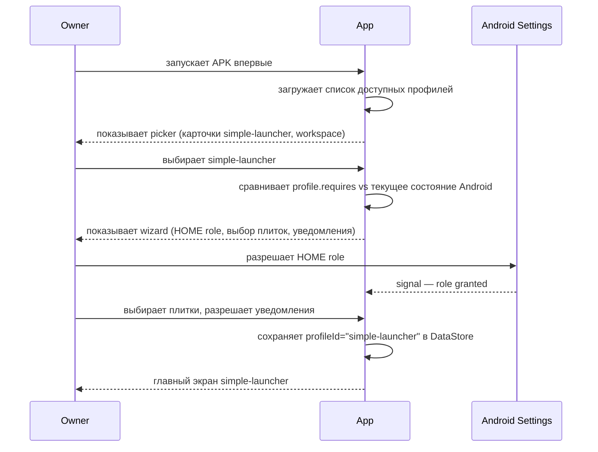
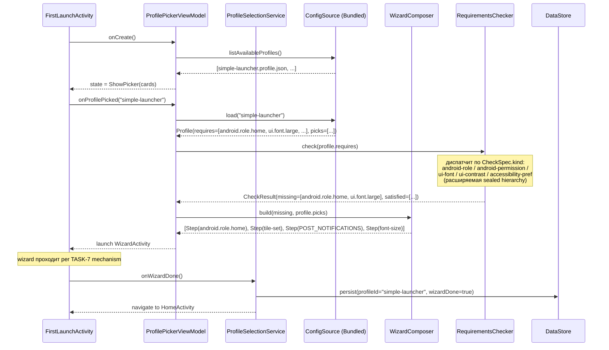
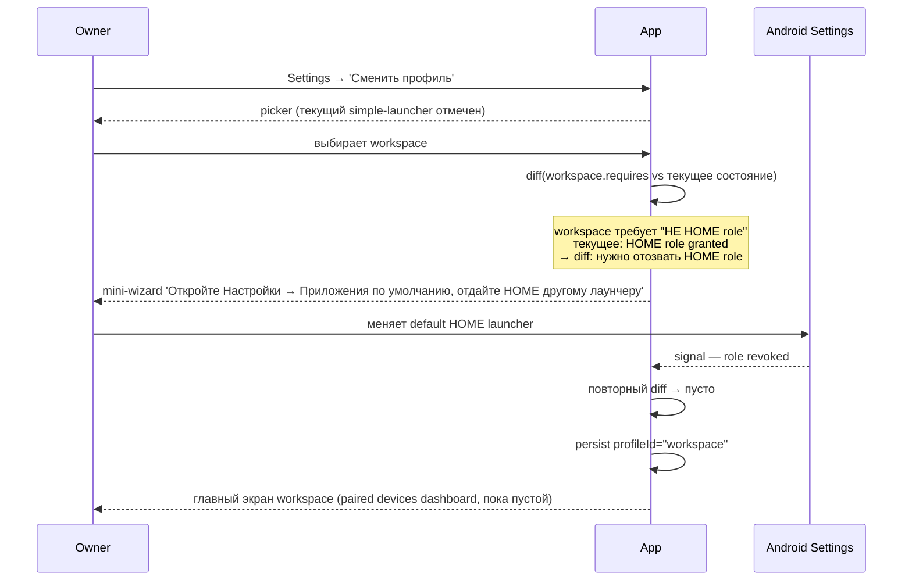
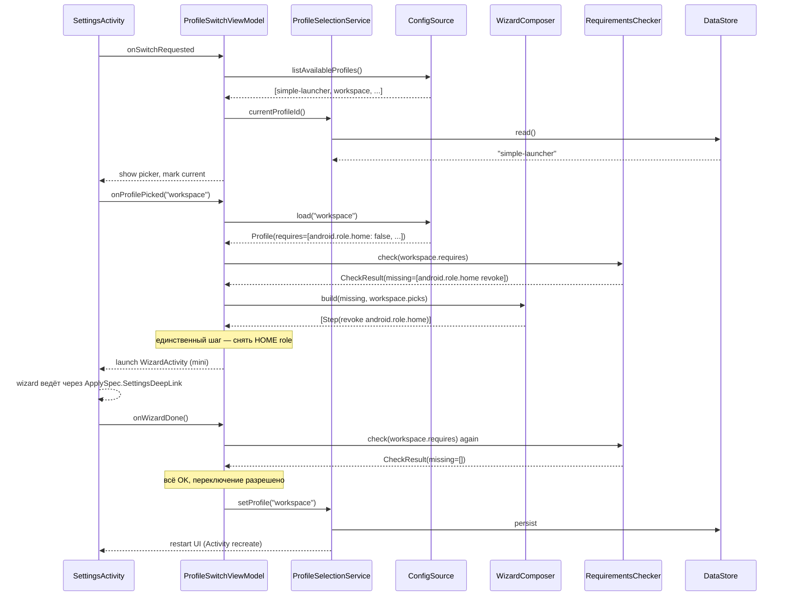
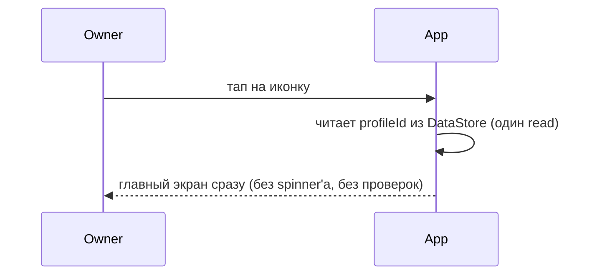
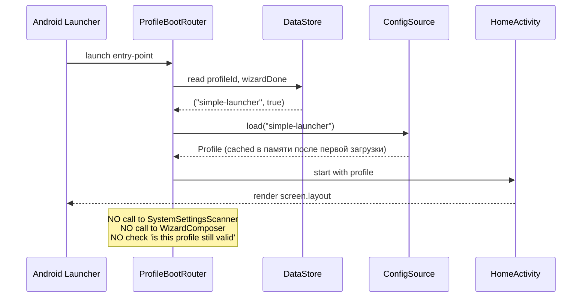
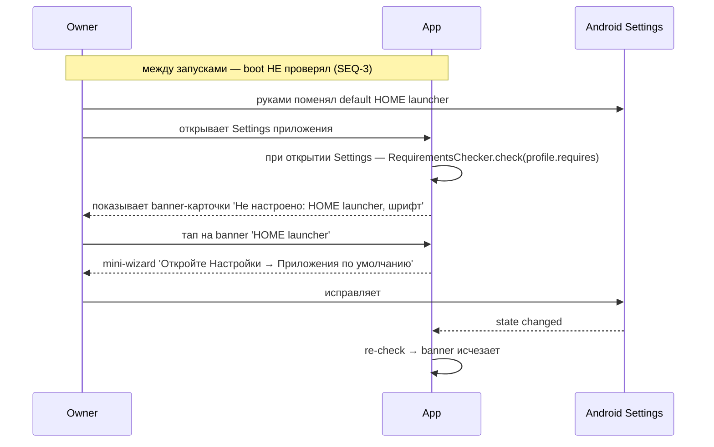
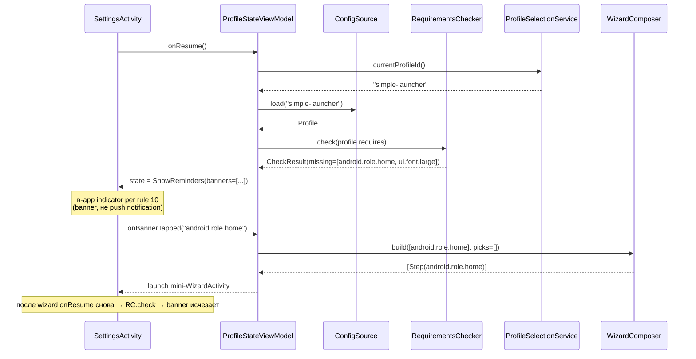

## Description

<!-- SECTION:DESCRIPTION:BEGIN -->
> **Про роли в этой задаче.** Эта задача — чисто **архитектурная инфраструктура**. Никаких ролей, никаких сценариев конкретного пользователя. Подготавливает почву для будущих профилей (`workspace`, `clinic-patient`, `self-care`), но сама не приносит новой user-facing функциональности — только регрессионно сохраняет `simple-launcher` через generic composition.

## Что это простыми словами

Превращаем «один профиль захардкожен» в «любой профиль = JSON-пик из каталога настроек». После этой задачи приложение знает, как **выбирать** профиль один раз при установке, **переключать** через настройки, и **никогда не проверять** профиль при boot'е.

**Что происходит по шагам (новая установка):**
1. Пользователь устанавливает APK, открывает.
2. Видит экран выбора профиля (как в Telegram при первом запуске выбираешь язык). Сейчас один вариант — `simple-launcher`. После TASK-68 появится второй — `workspace`.
3. Выбрал → запускается визард (как сейчас в TASK-7), но шаги собираются **из профиля**: профиль говорит «мне нужны эти 3 настройки», движок берёт описание шагов из `system-settings.pool.json` и собирает их в порядке.
4. Прошёл визард → приложение работает. Профиль записан в DataStore. **Никаких проверок на boot'е больше нет.**

**Что происходит при переключении профиля:**
1. Зашёл в Settings → «Сменить профиль» → выбрал новый.
2. Движок сравнивает «что требует новый профиль» и «что сейчас настроено в системе». Делает diff.
3. Если есть несоответствия (например, новый профиль не должен быть HOME launcher'ом, а сейчас является) — запускает мини-визард только из недостающих шагов.
4. Прошёл → новый профиль активен. Старые данные (контакты, темы, pairing) — на месте.

## Зачем

Сейчас `simple-launcher` захардкожен: его id вписан в манифест визарда (`appFamilyId: "simple-launcher"`), его шаги ссылаются на pool по жёстким id. Если добавить второй профиль (`workspace` для admin-сценария) — сейчас это означает форк кода. Конституция Article VII §3 явно запрещает форки профилей: profiles are **data, not forks**. Эта задача исправляет нарушение и открывает дорогу для всех будущих профилей (workspace, clinic-patient, self-care) без переписывания кода.

## Что входит технически (для AI-агента)

- **Удалить** `appFamilyId: "simple-launcher"` из `wizard-manifests/simple-launcher.json` body — это profile-leakage в wizard format. Manifest не знает о профиле; профиль ссылается на manifest по file id.
- **`Profile` wire format** — новый JSON документ `profile.json` `schemaVersion=1`. Содержит только picks по pool entry id + `requires:` array обязательных pool entries (любого kind'а, не только Android system).
- **`ConfigSource` port** (CLAUDE.md rule 9) — абстракция источника профилей. `BundledConfigSource` (первый адаптер) грузит из `assets/profiles/*.json`. Future: `NetworkProfileSource`, `ShareIntentProfileSource`.
- **`RequirementsChecker` port** — generic диспатчер. Принимает `List<CheckSpec>` (требования профиля), для каждого entry выбирает правильный checker по `kind` (android-role, android-permission, ui-font, ui-contrast, accessibility-pref, ...), возвращает `CheckResult(missing, satisfied)`. Расширяемо additively через новые `CheckSpec` variants — engine не меняется.
- **First-launch profile picker** — Compose screen в `core/profiles/`, читает список доступных профилей через `ConfigSource`, рендерит карточки с label/description (из i18n keys в profile JSON).
- **Profile switch flow** — в Settings entry «Сменить профиль», запускает diff-engine: `RequirementsChecker.check(newProfile.requires)` → строит wizard из недостающих pool entries.
- **In-app Settings reminders** — баннеры в `SettingsActivity` для missing requirements (SEQ-4). Re-check на `onResume`. Tap → mini-wizard. Per rule 10 — in-app indicator, не push.
- **`CheckSpec` / `ApplySpec` расширение** — новые variants `AuthState` / `RequestSignIn` для будущего sign-in step; demonstration `UIFont` variant (для extension-proof теста) — используется в test-profile.json fitness.
- **Pool naming convention spec** — namespaced immutable IDs `<pool>.<domain>.<subject>` (например `tile.pairing.list`, `wizard.step.google-sign-in`). Documented в `contracts/pool-naming.md`. Per rule 5: id immutable, можно `deprecated: true`, нельзя delete или rename.
- **Lint rule (no profile-id branching)** — fitness function, ловит `if (profileId == "...")` / `when (profileId)` / `appFamilyId == ...` в business logic. Pre-commit hook. Per Article VII §13.
- **Lint rule (extraction-readiness)** — fitness function, запрещает launcher-specific imports (`com.launcher.app.*`, references на tiles/contacts/home-launcher domain types) в модулях `core/profiles/`, `core/wizard/`, `core/pools/`. Обеспечивает что foundation готов к extraction в sub-repo / shared library когда придёт второе family-приложение (messenger / photo). Exit ramp для cross-app vision.
- **Fitness test** — dummy `test-profile.json` (минимальный, с **non-Android** требованием `ui.font.large` для демонстрации generic-ности RequirementsChecker), грузится в test-time DI, проверяет что engine generic (не падает на неизвестное profile id, корректно строит wizard из его requires:).
- **Regression test** — `simple-launcher` через composition выдаёт идентичный wizard и UX как до TASK-65.

## Состояние

**Planned.** Foundation для TASK-66/59/60 и всех будущих профилей. Должна быть закрыта до start работ над workspace.

---

## Готовый промт для `/speckit.specify`

```
Реализуй F-?? (TBD): Profile Composition Foundation v2.

ЧТО СТРОИМ:
Generic profile composition runtime: профиль = JSON-пик из каталога pool entries.
First-launch profile picker + profile switch flow через wizard-diff.
Удаление profile-leakage (`appFamilyId`) из wizard manifest format.
Pool naming convention (namespaced immutable IDs, schemaVersion per pool).
Lint rule «no `profileId == ...` in business logic».

ЗАЧЕМ:
Article VII §3 конституции: profiles are data, not forks. Сейчас simple-launcher
захардкожен в манифесте. Чтобы добавить workspace / clinic-patient / self-care
профили без переписывания кода — нужна generic composition foundation.

SCOPE ВКЛЮЧАЕТ:
- Удаление `appFamilyId` из wizard-manifest.json body.
- `Profile` wire format JSON (`profile.json` schemaVersion=1).
- `ConfigSource` port + `BundledConfigSource` adapter.
- `RequirementsChecker` port — generic диспатчер по CheckSpec.kind (android-role, android-permission, ui-font, ...). Расширяемо additively.
- First-launch profile picker UI (Compose).
- Profile switch flow в Settings (RequirementsChecker.check → WizardComposer.build от missing).
- In-app Settings reminders (banner-карточки по missing requirements, re-check на onResume, tap → mini-wizard) — per rule 10 in-app indicator.
- `CheckSpec.AuthState` + `ApplySpec.RequestSignIn` variants для auth-в-wizard.
- Demo `CheckSpec.UIFont` variant для extension-proof теста (используется в test-profile.json).
- Pool naming convention spec (`contracts/pool-naming.md`).
- Lint rule «no profileId branching» + pre-commit fitness function.
- Lint rule «extraction-readiness» — запрет launcher-specific imports в core/profiles/wizard/pools.
- Regression test: simple-launcher идентичен после рефакторинга.
- Fitness test: dummy test-profile.json (с non-Android требованием) доказывает generic-ность engine.

SCOPE НЕ ВКЛЮЧАЕТ:
- Server-fetched profiles (`NetworkProfileSource`) — добавляется additively позже.
- Sharing/import profiles — TASK-35 (Marketplace) в Phase 5.
- Профильно-специфические pool entries (pairing-list — TASK-67, workspace JSON — TASK-68).
- Extraction в sub-repo / shared library — kept в monorepo per rule 4. Trigger: messenger TASK-27 / photo TASK-28.
- Push notifications для missing requirements — per rule 10 используем in-app reminders, не push.

DEPENDENCIES:
- TASK-7 (Simple Launcher Setup Wizard) — Done.

ACCEPTANCE CRITERIA (проверяет пользователь):
- Установил APK с чистого листа → увидел экран выбора профиля → выбрал simple-launcher → визард прошёл идентично TASK-7.
- В Settings нашёл «Сменить профиль» → переключил на dummy `test-profile` → визард показал только недостающие шаги → после визарда профиль активен.
- Существующий simple-launcher пользователь после установки нового APK видит свой профиль автоматически (миграция в первый запуск).
- Lint падает на попытке закоммитить код с `if (profileId == "simple-launcher")` в core/ или app/.
- Документация pool-naming.md написана простым русским.

LOCAL TEST PATH:
- Emulator pixel_5_api_34 — первый запуск + переключение профиля.
- Unit tests с dummy test-profile.json — engine generic-ness.
- Fitness test для lint rule (gradle task).

CONSTITUTION GATES:
- Article VII §3 (profiles = data, not forks) — fitness через lint rule.
- Article VII §13 (no `if (appFamilyId == "x")` branches) — fitness через lint rule.
- Rule 5 (wire format): profile.json schemaVersion=1, pool naming immutable.
- Rule 9 (shareability): ConfigSource adapter pattern с первого коммита.

EFFORT: Medium (~2 weeks).
```
<!-- SECTION:DESCRIPTION:END -->

## Sequences

> **Одной строкой:** TASK-65 превращает «один профиль захардкожен в коде» в «любой профиль = JSON-пик из каталога, выбирается один раз, дальше boot работает без проверок».

### Данные, которыми мы оперируем (mini-map)

```
Pools (каталоги — истина):                     Профили (JSON, picks из каталогов):
├── system-settings.pool.json                  ├── simple-launcher.profile.json
│   ├── android.role.home                      │   ├── picks: [tile.contacts, tile.calls, ...]
│   ├── android.permission.POST_NOTIFICATIONS  │   └── requires: [android.role.home]
│   └── ... (HOME role, permissions, etc.)     │
├── tile.pool.json                             └── test-profile.json (для fitness)
│   ├── tile.contacts                              ├── picks: [tile.dummy]
│   ├── tile.calls                                 └── requires: [] (ничего не требует)
│   └── tile.settings
└── wizard-step.pool.json (новое в TASK-65)
    ├── wizard.step.google-sign-in
    └── wizard.step.choose-tile-set
```

Профиль НЕ содержит логику. Профиль — это **список ссылок** на pool entries. Engine идёт по ссылкам и собирает UI / wizard / behaviour.

### Cross-app vision (важно для будущего)

Тот же механизм profile + pools + wizard будет переиспользован за пределами лаунчера — у **messenger** и **photo app** (Phase 3+). Core competency family-продукта — **настройки Android + UI customization + elder-friendly UX**. Лаунчер-специфичные pools (`tile.pool`, layout) — application-specific; `system-settings.pool` + `ui-customization.pool` (font size, contrast, tap target) — **shared между всеми family-приложениями**.

**В TASK-65 НЕ извлекаем в sub-repo** (rule 4 — minimum viable architecture). НО соблюдаем **extraction-readiness дисциплину**: lint запрещает launcher-specific imports в `core/profiles`, `core/wizard`, `core/pools`. Когда придёт messenger (TASK-27 P-2) — extraction = `git mv` + dependency swap, не rewrite. Эта инвариантa — fitness function TASK-65.

### SEQ-1: Первая установка → выбор профиля

Pre: APK только что установлен, нет persisted state. Post: профиль выбран, wizard пройден, главный экран показан.

#### Spec-level (behavior)



#### Plan-level (architecture)



<!-- MENTOR-DETAIL:BEGIN -->
#### Пояснение для владельца

- **Сейчас нет picker'а** — APK сразу запускает `FirstLaunchActivity`, который захардкожен под simple-launcher. Этот шаг добавляет picker'у в начало.
- **`ConfigSource`** — это «откуда брать профили». Сейчас один adapter — `BundledConfigSource` (читает из `assets/profiles/`). Завтра можно добавить `NetworkProfileSource` (сервер) или `ShareIntentProfileSource` (импорт от другого устройства) — **без изменения остального кода**.
- **`WizardComposer`** — это новое сердце. Он не знает что такое simple-launcher или workspace. Он знает: «вот requires, вот current state, выдам только шаги для diff». Точно та же логика будет использована при **переключении профиля** (SEQ-2).
- **Ключевая инвариантa:** picker появляется **только** если в DataStore нет profileId. Когда profileId уже записан — picker больше никогда не показывается (см. SEQ-3).
<!-- MENTOR-DETAIL:END -->

### SEQ-2: Переключение профиля через Settings (simple-launcher → workspace)

Pre: пользователь уже работает в simple-launcher, telephone — HOME launcher. Post: профиль = workspace, HOME role снят (отдана другому лаунчеру), главный экран workspace показан.

#### Spec-level (behavior)



#### Plan-level (architecture)



<!-- MENTOR-DETAIL:BEGIN -->
#### Пояснение для владельца

- **Diff-engine — главное.** Не «при переключении выполни весь wizard заново», а «покажи только то, что не совпадает». Если переключаешь между двумя профилями, где `requires:` совпадает на 80% — увидишь только 20% шагов.
- **Никакой магии PackageManager-disable.** Раньше предлагалось «при switch'е disable HOME intent-filter автоматически». По твоей логике — нет, проводим пользователя через явные шаги Android Settings (как в onboarding'е). Это твой принцип «нет магии, есть wizard'ы».
- **Re-scan после wizard'а — гарантия консистентности.** Пользователь мог не закончить шаг (нажал назад). Если diff после wizard'а не пуст — переключение **не происходит**, профиль остаётся старым.
- **На UI restart полагаемся как в TASK-7.** Activity recreate подхватывает новый профиль через DI на следующем `onCreate()`.
<!-- MENTOR-DETAIL:END -->

### SEQ-3: Boot после установки (главная инвариантa — НЕТ проверок)

Pre: профиль выбран, wizard пройден, DataStore содержит `profileId` + `wizardDone=true`. Post: главный экран показан мгновенно.

#### Spec-level (behavior)



#### Plan-level (architecture)



<!-- MENTOR-DETAIL:BEGIN -->
#### Пояснение для владельца

- **Это главная axiom владельца.** Сказано явно: «каждый раз ничего не проверяется и не выбирается! 1 раз выбрали, далее ... все более ничего из профилей не проверяем». Эта диаграмма — кодификация этого правила.
- **Что если пользователь руками отозвал HOME role в Android Settings?** Тогда simple-launcher запустится без HOME-роли. Что-то отвалится (например, лаунчер не перехватит home button). **Это OK** — пользователь сам сделал. Приложение НЕ должно превентивно «уведомлять» или «принудительно перенастраивать». Если хочет восстановить — заходит в Settings → «Перенастроить» → запускается тот же diff-engine из SEQ-2 (требуемое vs текущее).
- **Cached Profile в памяти** — на следующий запуск Activity ConfigSource уже в-памяти, файл повторно не парсится. Простая Singleton'овая cache в DI.
- **Это полная противоположность Phase-5 анти-pattern'а** (constitution Amendment 1.10), который TASK-7 case revert исправил: «на каждом boot'е проверяй custom step → fire-and-forget startActivity → пользователь не знает почему».
<!-- MENTOR-DETAIL:END -->

### SEQ-4: In-app reminders в Settings (passive)

Pre: профиль выбран, пользователь работает в приложении. Между запусками пользователь руками что-то поменял в Android (отозвал permission, сменил default HOME), либо изменился `ui-font` через системные настройки (стало мельче чем требует профиль). Post: пользователь заходит в Settings приложения → видит passive reminder, может тапнуть → mini-wizard этот пункт исправит.

#### Spec-level (behavior)



#### Plan-level (architecture)



<!-- MENTOR-DETAIL:BEGIN -->
#### Пояснение для владельца

- **Это твоя axiom из последнего сообщения:** «в настройках должны висеть напоминалки — смотри вот это и это не настроено, поэтому твое приложение в этом профиле работает некорректно».
- **Per rule 10 (notification minimization):** banner внутри Settings — **in-app indicator**, не push notification. Push'и не отсылаем — пользователь сам пришёл в Settings, увидел картинку.
- **RequirementsChecker — тот же** что в SEQ-1 и SEQ-2. Diff-engine один на все 4 потока: install / switch / reminder / on-demand recheck. Это одна из главных архитектурных побед TASK-65.
- **Boot всё ещё не проверяет (SEQ-3).** Проверка происходит только когда Settings открывается — это **explicit user gesture**, не background работа.
- **Между приложениями (cross-app vision):** messenger / photo app будут иметь свой Settings экран с тем же механизмом — каждый показывает reminders по СВОИМ profile.requires. Shared RC + shared Settings template, app-specific pools.
<!-- MENTOR-DETAIL:END -->

### Что TASK-65 НЕ делает (явно)

- **НЕ строит pairing** (TASK-67). Pool entries `tile.pairing.*` появятся там.
- **НЕ строит bucket registry** (TASK-66). Хранение данных под profile'ом — отдельная foundation.
- **НЕ создаёт workspace профиль** (TASK-68). Создаёт только инфру, чтобы workspace мог появиться как pure JSON.
- **НЕ делает server-fetched profiles.** ConfigSource — port, но только `BundledConfigSource` сейчас реализован. Network — позже, additively.
- **НЕ извлекает foundation в sub-repo / shared library.** Modules `core/profiles`, `core/wizard`, `core/pools` остаются в monorepo per rule 4 (MVA). Extraction-trigger: появление второго family-приложения (messenger TASK-27 / photo app TASK-28). Exit ramp: extraction-readiness lint обеспечивает, что extraction будет `git mv` + dependency swap, не rewrite.

### Самые важные fitness functions (после TASK-65 они охраняют систему)

1. **Lint: no `profileId == "x"`** — никто не сможет добавить ветку по имени профиля, иначе pre-commit падает.
2. **No `appFamilyId` в wizard manifest** — формат manifest'а не знает о профиле; profile.json ссылается на manifest по id, не наоборот.
3. **`test-profile.json` (dummy) грузится в test-time DI** — доказывает, что engine не падает на «незнакомом» профиле. Если кто-то добавит хак под simple-launcher — test-profile сломается.
4. **simple-launcher через composition выдаёт идентичный UX** — regression test против Phase 1 build'а.

## Acceptance Criteria
<!-- AC:BEGIN -->
- [ ] #1 [hand] Установил APK с чистого листа → увидел экран выбора **preset'а** → выбрал simple-launcher → визард прошёл идентично TASK-7 (SC-001)
- [ ] #2 [hand] В Settings → 'Сменить preset' → переключил на dummy test-preset → визард показал только недостающие шаги → preset активен. Switch обратно на simple-launcher → прежние bindings восстановились из истории Profile (SC-002)
- [ ] #3 [hand] Существующий simple-launcher пользователь после установки нового APK видит свой preset автоматически — без picker'а, без re-wizard (SC-003)
- [ ] #4 [hand] Detekt `PresetIdBranchingDetector` падает на `if (presetId == "simple-launcher")`, `when (appFamilyId)` в core/ или app/ (вне whitelisted `core/presets/`) — SC-004
- [ ] #5 [hand] Документация `contracts/pool-naming.md` написана простым русским, владелец-новичок может прочитать за <10 минут (SC-006)
- [ ] #6 [hand] Boot приложения после первой настройки НЕ вызывает `WizardEngine.computePending()` — trace доказывает (SC-007)
- [ ] #7 [hand] В Settings → отозвал ROLE_HOME руками → banner-карточка 'не настроено: HOME launcher' → тап → mini-wizard с ровно одним шагом → исправил → banner исчезает (SC-008 + SC-011)
- [ ] #8 [hand] Generic engine: `CheckSpec.UIFont` variant + `test-preset.json` с non-Android требованием → engine корректно диспатчит, строит wizard step, после применения fontScale re-check возвращает missing=[] (SC-009)
- [ ] #9 [hand] Detekt `ExtractionReadinessDetector` падает на `import com.launcher.app.tiles.Tile` в `core/presets/` / `core/wizard/` / `core/pools/` (SC-005)
- [ ] #10 [hand] `PoolSource` swap: DI переключение между `HardcodedPoolSource` и `JsonAssetPoolSource` (когда последний реализован) — приложение работает идентично; roundtrip test гарантирует identical entries (SC-012)
- [ ] #11 [hand] Naming inversion применён: в коде, spec'е, backlog AC используется **Preset** для shareable top-level и **Profile** для per-device personal data. Constitution amendment подготовлен (Article VII §9), требует владелец-approval перед merge
<!-- AC:END -->
