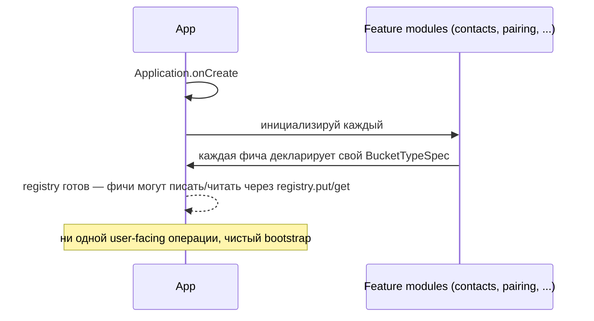
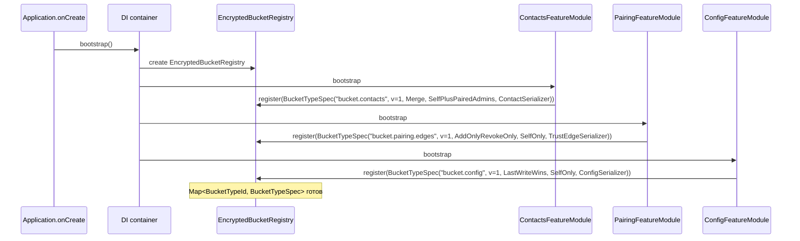
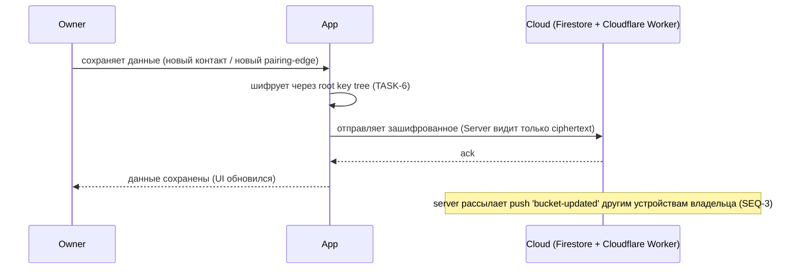
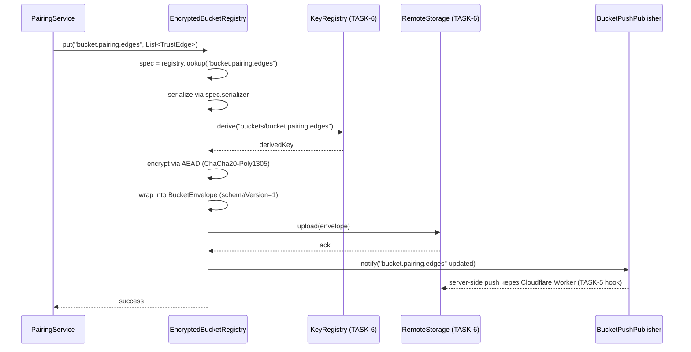
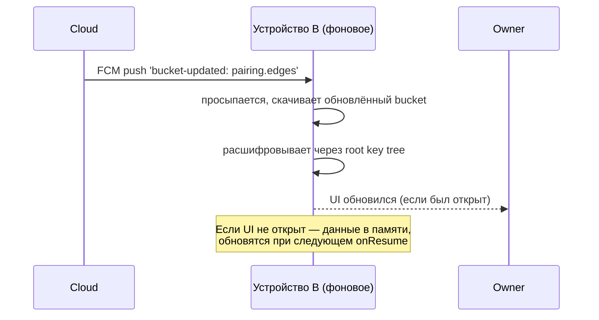
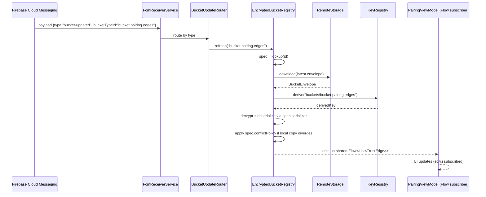
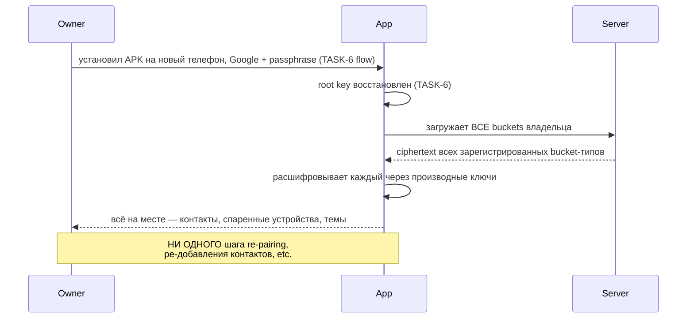
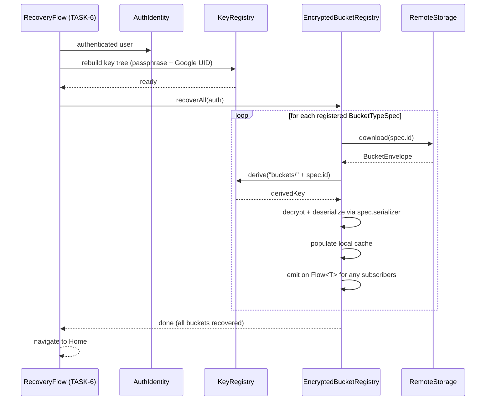
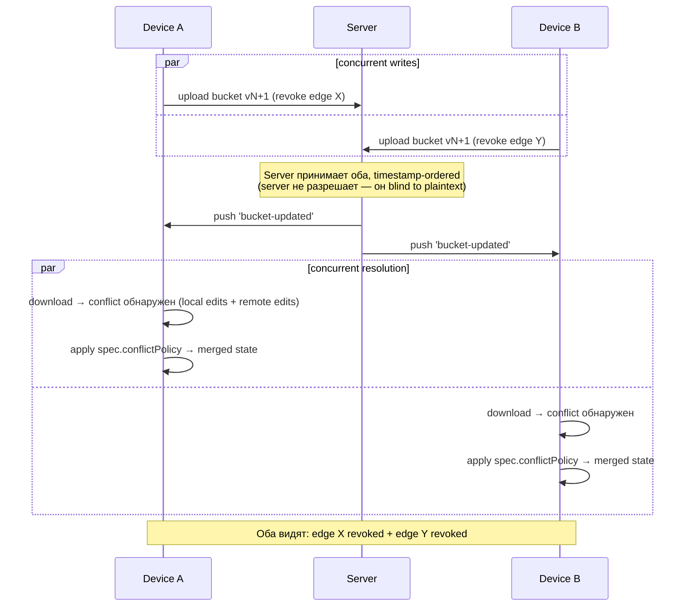

## Description

<!-- SECTION:DESCRIPTION:BEGIN -->
> **Про роли в этой задаче.** Это **архитектурная инфраструктура шифрования**. Никаких user-facing экранов, только plumbing. Превращает работу с шифрованными «вёдрами данных» (контакты, темы, pairing-связи, в будущем — фото, звонки) из «каждое ведро = свой код шифрования/загрузки/восстановления» в «каждое ведро = декларация, всё остальное автоматически».

## Что это простыми словами

Сейчас у нас в системе есть шифрованный конфиг (TASK-4) и шифрованные контакты (TASK-9). Каждый из них **самостоятельно** делает: «зашифровать → отправить на сервер → скачать → расшифровать → восстановить при recovery → разослать push когда обновился». Это **дублирование кода**. Когда добавим pairing (TASK-67), потом фото, потом звонки — будем писать ту же логику пятый раз.

Эта задача делает **один универсальный реестр**: каждое новое «ведро данных» (bucket) объявляет свой паспорт (`BucketTypeSpec`) — какая у него схема, как разрешать конфликты, кто получатели — и **всё остальное движок делает сам**: шифрует, заливает, скачивает, восстанавливает, рассылает уведомления.

**Аналогия:** как USB-порт. До USB — каждое устройство шло со своим кабелем и драйвером. После USB — устройство «представляется» (vendor id + protocol), компьютер автоматически знает что с ним делать. Здесь то же: каждое ведро «представляется» движку, движок делает всё остальное.

**Что происходит технически (для тех кто хочет понимать):**
1. На запуск приложения каждая фича вызывает `EncryptedBucketRegistry.register(BucketTypeSpec(...))` — отдаёт свой паспорт.
2. Когда фича хочет сохранить данные — `registry.put("contacts", data)`. Движок сам шифрует через KeyRegistry (TASK-6), сам отправляет на сервер.
3. Когда приходит push «bucket X обновился» — движок сам скачивает, расшифровывает, отдаёт фиче через listener.
4. Когда происходит recovery на новом устройстве — движок проходит по всем зарегистрированным ведрам и восстанавливает каждое.

## Зачем

Без этой задачи каждый новый encrypted bucket (pairing, photo, voice messages, calendar) — это:
- Новый Kotlin-модуль, повторяющий encrypt/upload/decrypt/recover logic.
- Новая поправка к TASK-6 recovery flow (добавить новый bucket в recovery).
- Новая поправка к TASK-5 push flow (добавить новый bucket в push routing).
- Новый wire format, новая schema versioning, новый migration story.

С этой задачей — каждый новый bucket = одна декларация `BucketTypeSpec` + UI. **Foundation работает один раз, контент добавляется бесплатно.**

Это критично для скорости развития. Phase 3-5 принесут ~5 новых bucket типов. Без foundation — 5 итераций «переписать инфру». С foundation — 5 итераций «написать UI».

## Что входит технически (для AI-агента)

- **`BucketTypeSpec`** — sealed/data class в `core/buckets/`, декларация одного типа ведра:
  - `id: String` (immutable wire-format identifier, namespaced — например `bucket.pairing.edges`).
  - `schemaVersion: Int` + chain миграций.
  - `conflictPolicy: ConflictPolicy` — sealed: `LastWriteWins | AddOnlyRevokeOnly | Merge<T>`.
  - `recipientPolicy: RecipientPolicy` — sealed: `SelfOnly | SelfPlusPairedAdmins | Custom(Set<RecipientPubKey>)`.
  - `(de)serializer: KSerializer<T>`.
- **`EncryptedBucketRegistry`** — port в `core/buckets/`:
  - `register(spec: BucketTypeSpec<*>)` — вызывается на app init из каждой фичи-владельца bucket'а.
  - `put(bucketId: String, data: T)` — шифрует через `KeyRegistry.derive("buckets/$bucketId")`, упаковывает в `BucketEnvelope` (wire format), отправляет через `RemoteStorage` port (TASK-6 deliverable).
  - `get(bucketId: String): Flow<T>` — реактивный listener на изменения.
  - `recoverAll(authIdentity: AuthIdentity)` — вызывается из recovery flow (TASK-6), идёт по всем зарегистрированным buckets, скачивает + расшифровывает.
- **`BucketEnvelope` wire format** — `schemaVersion=1`: `{ bucketTypeId, bucketSchemaVersion, ciphertext, signedBy, timestamp }`.
- **Migration** — `ConfigCipher2` (TASK-4) + contacts cipher (TASK-9, если уже есть) переписать как `BucketTypeSpec`-driven. Ciphertext byte-equal preserved (как в TASK-6 migration story).
- **Push routing** — расширение TASK-5: payload `{ type: "bucket-updated", bucketTypeId: String }`, receiver dispatches в `EncryptedBucketRegistry.refresh(bucketTypeId)`.
- **Recovery hook** — TASK-6 recovery flow получает callback в `EncryptedBucketRegistry.recoverAll(...)`. Координация со spec 020 (TASK-6 spec в stash) — нужен amendment к spec 020 ИЛИ TASK-66 spec ссылается на расширение TASK-6 как dependency.
- **Conflict policies** — реализация трёх sealed variants:
  - `LastWriteWins`: timestamp-based, новейший пишет.
  - `AddOnlyRevokeOnly`: набор edges, add+revoke операции, никогда не удалять напрямую (под pairing).
  - `Merge<T>`: пользовательский merge function (под contacts).
- **Fakes для тестов** — `FakeEncryptedBucketRegistry` + `FakeRemoteStorage` для unit-тестов фичей.
- **Fitness test** — dummy bucket type, регистрация → put → get → encrypt round-trip → recovery → conflict resolution.

## Состояние

**Planned.** Foundation, без неё TASK-67 (pairing) либо пишет свою инфру (regression), либо ждёт. Требует координации с TASK-6 (расширение spec 020) — TASK-6 сейчас Paused, но дизайн bucket registry можно делать против существующих интерфейсов `KeyRegistry` / `RemoteStorage` без блокировки.

---

## Готовый промт для `/speckit.specify`

```
Реализуй F-?? (TBD): Generic Encrypted Bucket Registry.

ЧТО СТРОИМ:
Универсальный реестр шифрованных «вёдер данных» (buckets). Каждая фича декларирует
свой BucketTypeSpec (id, schemaVersion, conflictPolicy, recipientPolicy, serializer).
Реестр сам делает: encrypt через KeyRegistry → upload через RemoteStorage → decrypt → recovery → push routing.

ЗАЧЕМ:
Без foundation каждый новый bucket (pairing, photo, calls) пишет свою инфру encrypt/upload/recover.
С foundation — каждый bucket = декларация + UI. Phase 3-5 экономит ~5 итераций «переписать инфру».

SCOPE ВКЛЮЧАЕТ:
- BucketTypeSpec data class + sealed ConflictPolicy / RecipientPolicy.
- EncryptedBucketRegistry port + impl.
- BucketEnvelope wire format schemaVersion=1.
- Migration: ConfigCipher2 (TASK-4) + contacts cipher (если есть) → BucketTypeSpec-driven. Ciphertext byte-equal.
- Push routing extension (TASK-5): bucket-updated payload.
- Recovery hook (TASK-6 coordination): recoverAll callback из recovery flow.
- Conflict policies: LastWriteWins, AddOnlyRevokeOnly, Merge<T>.
- FakeEncryptedBucketRegistry + FakeRemoteStorage для тестов.
- Fitness test: dummy bucket round-trip.

SCOPE НЕ ВКЛЮЧАЕТ:
- Конкретные bucket types (pairing — TASK-67; photo — Phase 4).
- Server-side bucket inventory API — TASK-24 (Device Inventory Sync) Phase 4.
- Multi-recipient envelope refactor — отложено в TASK-6 enhancement notes (S-2).

DEPENDENCIES:
- TASK-6 (Root Key Hierarchy) — Paused, но KeyRegistry port и RemoteStorage уже в коде после TASK-4 / TASK-6 Phase 1 work. Координация: либо amendment к spec 020, либо TASK-66 расширяет TASK-6 deliverables.

ACCEPTANCE CRITERIA (проверяет пользователь / AI):
- Зарегистрировал dummy bucket type → put(data) → get() возвращает то же → ciphertext не утекает в логах.
- Existing config encryption продолжает работать (no ciphertext break, byte-equal regression).
- Recovery на новом устройстве → ВСЕ зарегистрированные buckets автоматически восстанавливаются (включая dummy).
- Push notification «bucket-updated» обновляет только нужный bucket (по id).
- ConflictPolicy AddOnlyRevokeOnly: add edge → revoke edge → итоговый state корректен.
- Fitness test: новый dummy bucket добавляется через ONE декларацию (никакого нового encrypt/upload/recover кода).
- Документация bucket-registry.md написана простым русским.

LOCAL TEST PATH:
- Unit tests с FakeRemoteStorage — round-trip всех bucket types.
- Integration test на emulator pixel_5_api_34 — recovery flow восстанавливает 2+ buckets.
- Migration test: spec 018 ciphertext → spec X ciphertext byte-equal.

CONSTITUTION GATES:
- Rule 1 (domain isolation): EncryptedBucketRegistry port в core/buckets/, adapter не утекает.
- Rule 2 (ACL): Firestore / cloud storage не вытекают в domain.
- Rule 3 (one-way door): BucketEnvelope wire format — фиксируется навсегда; exit ramp — versioned migration policy.
- Rule 5 (wire format): BucketEnvelope schemaVersion=1, BucketTypeId namespacing immutable.
- Rule 6 (mock-first): FakeEncryptedBucketRegistry + FakeRemoteStorage.

EFFORT: Large (~2-3 weeks). Координация с TASK-6 spec amendment.
```
<!-- SECTION:DESCRIPTION:END -->

## Sequences

> **Одной строкой:** TASK-66 превращает «каждое ведро шифрованных данных пишет свою инфру encrypt/upload/recover» в «каждое ведро — это паспорт (`BucketTypeSpec`), реестр делает остальное».

### Данные, которыми мы оперируем (mini-map)

```
EncryptedBucketRegistry (один на app — реестр известных типов)
└── Map<BucketTypeId, BucketTypeSpec>
    ├── "bucket.config"           ← TASK-4 (после миграции)
    ├── "bucket.contacts"         ← TASK-9
    ├── "bucket.pairing.edges"    ← TASK-67
    └── "bucket.dummy"            ← test fitness

BucketTypeSpec — паспорт одного типа bucket'а:
├── id: "bucket.pairing.edges"   (immutable wire-format identifier, rule 5)
├── schemaVersion: 1
├── conflictPolicy: AddOnlyRevokeOnly  (sealed: LastWriteWins | AddOnlyRevokeOnly | Merge<T>)
├── recipientPolicy: SelfOnly          (sealed: SelfOnly | SelfPlusPairedAdmins | Custom)
└── serializer: KSerializer<List<TrustEdge>>

BucketEnvelope — wire format на проводе (rule 5):
└── { schemaVersion=1, bucketTypeId, bucketSchemaVersion, ciphertext, signedBy, timestamp }
```

Каждая фича декларирует паспорт → реестр делает: serialize → encrypt via KeyRegistry → upload via RemoteStorage → receive push → decrypt → notify subscribers → recover on new device.

### Cross-app vision (важно)

`EncryptedBucketRegistry` будет переиспользован за пределами лаунчера. messenger зарегистрирует `bucket.messenger.threads`. photo app — `bucket.photo.albums`. Foundation **не знает** ни про contacts, ни про pairing, ни про threads — она работает с любым типом, который декларирует BucketTypeSpec. Та же extraction-readiness дисциплина что в TASK-65: lint не пускает launcher-specific imports в `core/buckets/`. Когда придёт messenger — `git mv`, не rewrite.

### SEQ-1: Регистрация bucket-типов на старте app

Pre: APK запускается. Post: registry знает обо всех типах, которые понадобятся фичам.

#### Spec-level (behavior)



#### Plan-level (architecture)



<!-- MENTOR-DETAIL:BEGIN -->
#### Пояснение для владельца
- **«Паспорт» — это BucketTypeSpec.** Фича говорит реестру: «у меня bucket с таким id, такой schema, такой policy, такой serializer». Reg запоминает.
- **Registration — один раз на app start.** Не runtime: bucket-типы не появляются и не исчезают между запусками. Если изменится policy для уже зарегистрированного — это **миграция**, а не просто перерегистрация.
- **Конкретные фичи (contacts/pairing/config) не зависят друг от друга.** Каждая регистрирует свой паспорт независимо. Когда добавится `messenger.threads` — никаких правок в существующих фичах.
- **Cross-app:** в messenger та же сцена, только spec'и другие. Тот же `EncryptedBucketRegistry` код, тот же DI bootstrap.
<!-- MENTOR-DETAIL:END -->

### SEQ-2: Запись данных (put) — encrypt и upload

Pre: registry знает про bucket-тип (SEQ-1). Owner на устройстве A сохраняет что-то (новый контакт / новый pairing-edge).

#### Spec-level (behavior)



#### Plan-level (architecture)



<!-- MENTOR-DETAIL:BEGIN -->
#### Пояснение для владельца
- **Фича не знает про шифрование.** PairingService просто говорит «положи мне эти данные в bucket pairing-edges». Registry сама шифрует через KeyRegistry.
- **`KeyRegistry.derive("buckets/<id>")`** — каждый bucket получает свой sub-ключ из root key. Если один bucket скомпрометирован — другие не страдают (изоляция в дереве).
- **`BucketEnvelope`** — wire format, едет на сервер. Server **видит только ciphertext + metadata** (bucketTypeId, timestamp). Не видит содержимое.
- **Push через Cloudflare Worker (TASK-5):** после успешного upload registry дёргает worker `/notify` с `{type:"bucket-updated", bucketTypeId}`. Worker рассылает FCM на все устройства владельца.
- **Этот же путь** для contacts, config, pairing, и любого future bucket-типа. **Один и тот же код**, разные паспорта.
<!-- MENTOR-DETAIL:END -->

### SEQ-3: Приём обновления (push) — другое устройство владельца

Pre: устройство A записало bucket (SEQ-2). Устройство B (тот же владелец, тот же Google UID) спит в Doze. Post: B автоматически имеет последнюю версию.

#### Spec-level (behavior)



#### Plan-level (architecture)



<!-- MENTOR-DETAIL:BEGIN -->
#### Пояснение для владельца
- **Routing по bucketTypeId** — registry знает, какая фича подписана на bucket. Push payload содержит **только id** (не содержимое).
- **`Flow<T>` подписчики** — каждая фича получает свой реактивный поток. ViewModel жив (UI открыт) → мгновенно обновляется. Убит → данные в локальной cache, обновятся на `onResume`.
- **Conflict policy применяется здесь.** Если локальная копия что-то писала пока push шёл — registry мерджит по policy. Подробно — SEQ-5.
- **Boot-инвариантa (как в TASK-65):** push приёмник работает в Background WorkManager job — **не требует Activity**. Приложение убито OS — push всё равно скачается и обновит cache.
- **Cross-app:** messenger получит push для своих bucket'ов через тот же `BucketUpdateRouter`. Routing полностью generic.
<!-- MENTOR-DETAIL:END -->

### SEQ-4: Recovery на новом устройстве — главная фишка

Pre: устройство A потеряно. Owner купил новый телефон B. Прошёл TASK-6 recovery flow (Google + passphrase). Root key восстановлен. Post: ВСЕ зарегистрированные buckets автоматически восстановлены — contacts, pairing-edges, config, темы — без отдельного recovery кода для каждого.

#### Spec-level (behavior)



#### Plan-level (architecture)



<!-- MENTOR-DETAIL:BEGIN -->
#### Пояснение для владельца
- **Это killer feature TASK-66.** До этой задачи каждый bucket нуждался в собственном recovery коде в TASK-6 flow. После — ноль. Зарегистрировал паспорт → recovery работает.
- **Loop по spec'ам** — registry просто проходит по своему Map'у. Не знает что внутри. Decryption + deserialization — generic, через KSerializer из спецификации.
- **Это значит** что TASK-9 (contacts), TASK-67 (pairing), будущие TASK-11 (photo), TASK-27 (messenger) — **не пишут recovery код**. Только декларируют BucketTypeSpec + UI.
- **Координация с TASK-6 spec 020.** Сейчас spec 020 (в stash) предполагает recovery конкретных buckets (config + contacts mentioned explicitly). TASK-66 spec ДОЛЖЕН включать amendment к spec 020: «recovery flow дёргает `EncryptedBucketRegistry.recoverAll()` вместо per-feature кода». Это first agenda item в `/speckit.specify` TASK-66.
<!-- MENTOR-DETAIL:END -->

### SEQ-5: Разрешение конфликтов (compact)

Pre: два устройства A и B одновременно пишут в один bucket (например, оба отзывают разные pairing-edges). Post: оба видят согласованное состояние.



**Три conflict policy (sealed):**

| Policy | Поведение | Применение |
|---|---|---|
| **`LastWriteWins`** | Берётся версия с большим timestamp'ом | `bucket.config` (одна правда от владельца, последний выигрывает) |
| **`AddOnlyRevokeOnly`** | Множество элементов с операциями add/revoke. Union add'ов, union revoke'ов | `bucket.pairing.edges` (никто не «удаляет» edge молча, только revoke) |
| **`Merge<T>`** | Пользовательская merge function (передаётся в BucketTypeSpec) | `bucket.contacts` (smart merge по contact id) |

<!-- MENTOR-DETAIL:BEGIN -->
#### Пояснение для владельца
- **Конфликт = когда два устройства пишут в один bucket почти одновременно.** Без policy одно перетрёт другое.
- **Policy выбирается при регистрации.** PairingService регистрирует `AddOnlyRevokeOnly` потому что revoke edge должен быть видим обоим. ConfigService — `LastWriteWins` потому что config — одна правда.
- **Server (Cloudflare Worker + Firestore) не разрешает конфликты сам.** Server принимает оба upload'а timestamp-ordered, рассылает оба push'а. **Разрешение — на клиенте**, через policy. Это **client-side resolution** — не нарушает invariant «server видит только ciphertext».
- **`Merge<T>` — single one-way door:** если решим что contacts merge нужно server-side (для очень больших buckets) — это потребует server-side decryption, что нарушает E2E encryption. Exit ramp — не использовать Merge для больших buckets; ограничивать размер.
<!-- MENTOR-DETAIL:END -->

### Что TASK-66 НЕ делает (явно)

- **НЕ строит конкретные bucket-типы.** Pairing — TASK-67. Photo — Phase 4. Messenger — Phase 3.
- **НЕ строит server-side bucket inventory API.** Server остаётся «глупым» — Firestore документы + Cloudflare Worker push relay. Inventory считает client. TASK-24 (Device Inventory Sync) Phase 4 — другая фича.
- **НЕ извлекает foundation в sub-repo** (как и TASK-65). Extraction-trigger — второе family-приложение.
- **НЕ строит multi-recipient encryption refactor.** S-2 enhancement из TASK-6 notes — отложено. Сейчас `recipientPolicy` ограничена тремя вариантами; multi-pair-admin сценарий — через `RecipientPolicy.Custom` override.
- **НЕ разрешает конфликты на сервере.** Per E2E invariant — server blind to plaintext. Client-side resolution через policy.

### Самые важные fitness functions

1. **Round-trip test для `BucketEnvelope`** — write → read → assert equal (rule 5).
2. **Backward-compat test** — старый envelope (schemaVersion=1) корректно читается после введения schemaVersion=2 (когда-нибудь).
3. **Dummy bucket fitness** — `bucket.dummy` registered → put → recovery на новом инстансе → данные восстановлены. Один integration test покрывает всю foundation.
4. **Extraction-readiness lint** — `core/buckets/` не импортирует ничего launcher-specific.
5. **Migration test** — существующий ConfigCipher2 ciphertext byte-equal после миграции на BucketRegistry.

## Acceptance Criteria
<!-- AC:BEGIN -->
- [ ] #1 Зарегистрировал dummy bucket type → put(data) → get() возвращает то же → ciphertext не утекает в логах
- [ ] #2 Existing config encryption (TASK-4) продолжает работать — ciphertext byte-equal до и после миграции
- [ ] #3 Recovery на новом устройстве → ВСЕ зарегистрированные buckets автоматически восстанавливаются (включая dummy)
- [ ] #4 Push notification 'bucket-updated' с bucketTypeId обновляет только нужный bucket
- [ ] #5 ConflictPolicy AddOnlyRevokeOnly работает: add → revoke → итоговый state корректен
- [ ] #6 Новый dummy bucket добавляется через ОДНУ декларацию BucketTypeSpec — никакого нового encrypt/upload/recover кода
- [ ] #7 Документация bucket-registry.md написана простым русским, можно прочитать и понять как добавить новый bucket
<!-- AC:END -->
