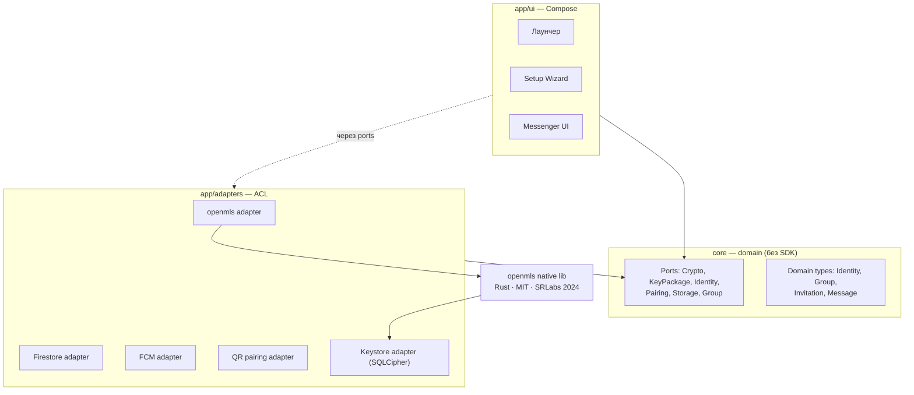
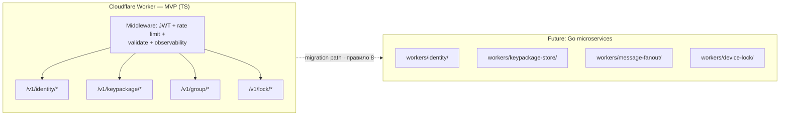
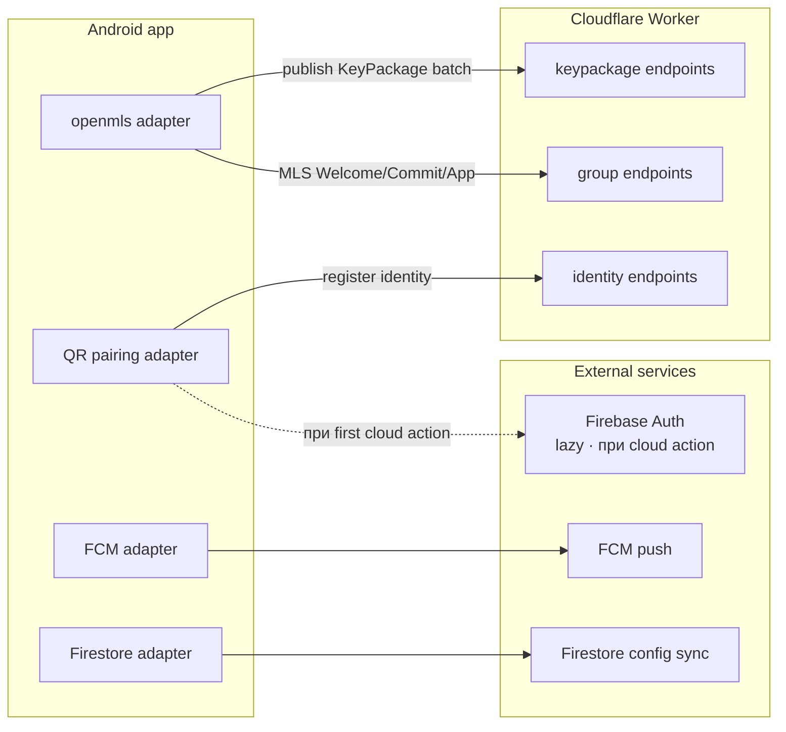

# Архитектурная карта — обзор

**Что это**: одностраничный snapshot текущего стека — какую библиотеку, платформу, механизм мы выбрали и **где** это живёт в кодовой базе. Читается за 3-5 минут, даёт полную картину.

**Что это НЕ**: не документация "почему выбрали". Причины — в Decision-блоках соответствующих backlog task'ов. Ссылки — в таблице ниже.

**Как поддерживается актуальным**: когда backlog task переходит из статуса `Discussion` в `Draft` (Decision block frozen) — соответствующий раздел этой карты обновляется в том же commit'е. Skill автоматизации — см. TODO ниже.

---

## Master diagram — все "коробки" сразу

### Диаграмма 1 — устройство пользователя (Android app)

### Диаграмма 2 — сервер (MVP → миграция)

### Диаграмма 3 — как устройство говорит с сервером и внешними

**Как читать**:
- **Стрелки сплошные** = реальный runtime-вызов.
- **Стрелки пунктирные** = "через порты" (правило 1 domain isolation) или "будущий migration path".
- **Цвет subgraph** отражает уровень: android (устройство) → worker (текущий сервер) → gomicro (будущий сервер) → external (внешние сервисы).

---

## Registry — что выбрано, где живёт, кто решил

### Crypto

| Компонент | Выбор | Task-решение | Статус | Exit ramp |
|---|---|---|---|---|
| Групповой e2e-протокол | MLS TreeKEM (RFC 9420) | [TASK-104](../../backlog/tasks/task-104%20-%20Decision-KeyPackage-rate-limit.md) | Draft | Sender Keys (major refactor) |
| MLS client-библиотека | **openmls** (Rust · MIT · аудирован SRLabs 2024) | [TASK-58](../../backlog/tasks/task-58%20-%20Research-Signal-Sender-Keys-vs-MLS-for-family-group-E2E.md) research → owner Decision pending | **Proposed** | `mls-rs` swap в адаптере (~3-5 дней через GroupCryptoPort) |
| Kotlin binding для openmls | UniFFI-сгенерированные bindings | [TASK-58](../../backlog/tasks/task-58%20-%20Research-Signal-Sender-Keys-vs-MLS-for-family-group-E2E.md) | **Proposed** | Manual JNI (~2-3 недели rewrite) |
| Encrypted keystore | SQLCipher provider для openmls | [TASK-58](../../backlog/tasks/task-58%20-%20Research-Signal-Sender-Keys-vs-MLS-for-family-group-E2E.md) | **Proposed** | Room + separate Android Keystore |
| IdentityVault port boundary | Operation-on-vault + narrow `exportDerivedKey` hatch + newtype-per-object | [TASK-112](../../backlog/tasks/task-112%20-%20Decision-Cross-platform-IdentityVault.md) (Discussion) | **Discussion** | Rust `vault-rs` через UniFFI (Phase-4+) |
| KeyPackage pool cap | 100 per identity | [TASK-104](../../backlog/tasks/task-104%20-%20Decision-KeyPackage-rate-limit.md) | Draft | Preset field |
| KeyPackage dedup TTL | 10 min | [TASK-104](../../backlog/tasks/task-104%20-%20Decision-KeyPackage-rate-limit.md) | Draft | Preset field |
| Last-resort rotation | 7 дней (family default) | [TASK-104](../../backlog/tasks/task-104%20-%20Decision-KeyPackage-rate-limit.md) | Draft | Preset field |
| Group revoke policy | Immediate hard kick via MLS Remove, 3-tier role (owner/admin/other) | [TASK-102](../../backlog/tasks/task-102%20-%20Decision-Revoke-policy.md) | Draft | Per-revoke reason enum for beta |
| History backup | Signal-style (нет восстановления истории на MVP) | [TASK-100](../../backlog/tasks/task-100%20-%20Decision-History-backup-strategy-for-MVP.md) | Draft | HIST-BACKUP-001 (Phase-3+) |

Детально — см. **umbrella + zone map** [crypto.md](crypto.md), и per-zone SoT-файлы: [crypto-primitives.md](crypto-primitives.md) (примитивы, built), [crypto-key-hierarchy.md](crypto-key-hierarchy.md) (root key / envelope / recovery, built), [crypto-pairing.md](crypto-pairing.md) (pairing / AS / revoke). Extraction в shared-модуль — [extraction-policy.md](extraction-policy.md). Для любого крипто-вопроса — skill `crypto` (маршрутизирует в нужный файл). MLS/KeyPackage — 0 кода, контракт = Decision-блоки TASK-124/TASK-104.

### Messaging

| Компонент | Выбор | Task-решение | Статус | Exit ramp |
|---|---|---|---|---|
| Субстрат | MLS-транспорт → opaque payload набору получателей; только МЕССЕНДЖЕР (chat+calls+features). Config-sync и галерея — отдельные домены | [TASK-148](../../backlog/tasks/task-148%20-%20Messaging-architecture-SoT-plus-skill.md) | **Designed, not built** | — |
| Транспорт | Facade `MessagingPort`; MVP maybe Matrix (Apache-2.0) → target MLS (openmls) | [TASK-27](../../backlog/tasks/task-27%20-%20Elderly-Friendly-Messenger-Jitsi-based.md) | **Not decided** (facade делает swappable) | Второй адаптер Matrix→MLS (данные НЕ мигрируют авто) |
| Сервер доставки | Blind courier: opaque id + epoch + mailbox tokens | [TASK-27](../../backlog/tasks/task-27%20-%20Elderly-Friendly-Messenger-Jitsi-based.md) | **Designed, not built** | Cloudflare stopgap → свой Rust (rule 8) |
| Таксономия фич | Reactions/replies/edits/roles/blocks = доменные типы; адаптер маршалит | [TASK-148](../../backlog/tasks/task-148%20-%20Messaging-architecture-SoT-plus-skill.md) | **Designed** | Копируется из Matrix events / MIMI |
| Звонки | Adopt SFU — Jitsi (Apache-2.0) + SFrame/MLS | [TASK-27](../../backlog/tasks/task-27%20-%20Elderly-Friendly-Messenger-Jitsi-based.md) | **Designed, not built** | Jitsi→LiveKit (адаптер) |

Детально — см. **umbrella** [messaging.md](messaging.md) (разрез volatile↔stable, build-vs-buy, copyable blueprints) + [messaging-substrate.md](messaging-substrate.md) (стабильный шов). Для любого messenger-вопроса — skill `messaging`. Крипта (MLS/keys) — НЕ здесь, а в `crypto.md`.

### Identity

| Компонент | Выбор | Task-решение | Статус | Exit ramp |
|---|---|---|---|---|
| Identity model | Hybrid: LOCAL per-device (для MLS) + CLOUD per-user (для sync) | [TASK-106](../../backlog/tasks/task-106%20-%20Decision-Sybil-resistance-and-signup-gate.md) | **Discussion** | Change requires MLS group re-key |
| Signup gate (family MVP) | Invitation-code от admin'а (мама-дочка выдаёт бабушке) | [TASK-106](../../backlog/tasks/task-106%20-%20Decision-Sybil-resistance-and-signup-gate.md) | **Discussion** | Pool entry — preset-parameterizable |
| Signup gate (clinic) | TBD | TASK-106 (Phase-3+) | Deferred | — |
| Recovery flow | Auto MLS Add + post-facto notification (Chrome/Google Account model) | [TASK-101](../../backlog/tasks/task-101%20-%20Decision-Peer-confirmation-on-recovery.md) | Draft | RECOVERY-2FA-001 (opt-in 2FA) |
| Remote app lock | Cryptographic defense: Keystore wipe + full recovery on unlock | [TASK-103](../../backlog/tasks/task-103%20-%20Decision-Remote-app-lock-for-stolen-device.md) | Draft | Wipe-verification token + Google Find My integration |
| Cloud identity provider | Firebase Auth (lazy, only при first cloud action) | (existing) | Prod | Own OIDC provider (Go migration) |

Детально — см. [identity.md](identity.md) (пока skeleton, ждёт закрытия TASK-106).

### Server

| Компонент | Выбор | Task-решение | Статус | Exit ramp |
|---|---|---|---|---|
| Runtime (MVP) | Cloudflare Worker (TypeScript) | [TASK-105](../../backlog/tasks/task-105%20-%20Decision-Server-side-abuse-defense-baseline.md) | Draft | Go microservices per `workers/` |
| Runtime (Phase-3+) | Go microservices (workers/identity, workers/keypackage-store, workers/message-fanout, workers/device-lock) | (roadmap) | Deferred | — |
| API URL scheme | `/v1/<domain>/<action>` versioned | [TASK-105](../../backlog/tasks/task-105%20-%20Decision-Server-side-abuse-defense-baseline.md) | Draft | Major version bump on breaking change |
| Request/response schema | `{ schemaVersion: N, data | error }` | [TASK-105](../../backlog/tasks/task-105%20-%20Decision-Server-side-abuse-defense-baseline.md) | Draft | правило 5 |
| JWT verify | `jose` npm + JWKS memory cache 10 min | [TASK-105](../../backlog/tasks/task-105%20-%20Decision-Server-side-abuse-defense-baseline.md) | Draft | `go-jose` |
| Rate limit (normal) | Cloudflare RATE_LIMITER binding (edge, 60s окно) | [TASK-105](../../backlog/tasks/task-105%20-%20Decision-Server-side-abuse-defense-baseline.md) | Draft | `go-redis/redis_rate` |
| Rate limit (critical) | Cloudflare Durable Object counter | [TASK-105](../../backlog/tasks/task-105%20-%20Decision-Server-side-abuse-defense-baseline.md) | Draft | Go actor + Redis Cluster |
| Rate limit dimension | per-identity (JWT claim `identity_id`) | [TASK-105](../../backlog/tasks/task-105%20-%20Decision-Server-side-abuse-defense-baseline.md) | Draft | `TODO(server-roadmap)`: per-device |
| Input validation | `zod` schema | [TASK-105](../../backlog/tasks/task-105%20-%20Decision-Server-side-abuse-defense-baseline.md) | Draft | `go-playground/validator` |
| Observability | Structured JSON logs + Cloudflare Analytics Engine counters | [TASK-105](../../backlog/tasks/task-105%20-%20Decision-Server-side-abuse-defense-baseline.md) | Draft | Prometheus + Grafana Loki |
| Idempotency | Natural dedup + `Idempotency-Key` header для state-modifying без natural bound | [TASK-105](../../backlog/tasks/task-105%20-%20Decision-Server-side-abuse-defense-baseline.md) | Draft | — |

Детально — см. [server.md](server.md) (пока skeleton).

### Client-Android

| Компонент | Выбор | Статус |
|---|---|---|
| UI framework | Jetpack Compose | Prod |
| Domain layer | `core/` KMP module (чистый Kotlin) | Prod |
| Adapter modules | `app/adapters/<vendor>/` — один subfolder на внешнюю зависимость | Prod |
| DI | Manual constructor injection (без DI framework в MVP) | Prod |

Детально — см. [client-android.md](client-android.md) (пока skeleton).

### External services

| Компонент | Выбор | Стоимость | Exit ramp |
|---|---|---|---|
| Push notifications | FCM (Firebase Cloud Messaging) | Free tier достаточно | Own APNS-like server |
| Cloud identity | Firebase Auth | Spark plan (free) | Own OIDC provider |
| Config sync | Firestore | Spark plan (free) | PostgreSQL row-level security |

Детально — см. [external-services.md](external-services.md) (пока skeleton).

---

## Что открыто прямо сейчас (pending decisions)

- **[TASK-106](../../backlog/tasks/task-106%20-%20Decision-Sybil-resistance-and-signup-gate.md)** (Discussion) — identity signup gate. Влияет на `identity.md` registry. Разделы `signupGate`, `identityModel`, `bootstrapSource` изменятся после закрытия.
- **[TASK-58](../../backlog/tasks/task-58%20-%20Research-Signal-Sender-Keys-vs-MLS-for-family-group-E2E.md)** (Draft) — Research: Signal Sender Keys vs MLS. Из research 2026-06-26. Разделы crypto: `MLS-библиотека`, `Kotlin binding`, `Encrypted keystore`. Owner Decision pending — pick winner + move to formal Decision block.
- **[TASK-112](../../backlog/tasks/task-112%20-%20Decision-Cross-platform-IdentityVault.md)** (Discussion) — IdentityVault port boundary. Session 1 закрыла research 2026-07-07. Раздел crypto: новая строка `IdentityVault port boundary`.

Пока эти task'и в `Discussion` — соответствующие ячейки в registry отмечены **Discussion** / **Proposed**.

---

## Как это связано с backlog-task'ами

- **Backlog Decision-блок** = **"почему"**. Immutable исторический контракт. Rationale + alternatives + trade-offs + exit ramp.
- **Architecture registry (эта страница)** = **"что и где"**. Текущий snapshot, обновляется при закрытии Decision.

Ссылки в обе стороны:
- Registry → Decision task (колонка `Task-решение`).
- Decision task Applies-to section → упоминание разделов Architecture doc (`Applies to: docs/architecture/crypto.md § MLS library`).

Один источник правды для каждого вопроса, никакого дублирования.

---

## TODO — автоматизация

- [ ] Skill `procedure-sync-architecture-map` — вызывается автоматически при переходе Decision task `Discussion → Draft`. Читает Decision block + обновляет соответствующий раздел registry + domain-файл. Спроектировать после того как убедимся что паттерн работает на `crypto.md`.
- [ ] Fitness function: linter проверяет что каждая `decision-task: TASK-N` в YAML frontmatter существует и имеет статус ≥ `Draft`. При `Discussion` — предупреждение "поле помечено `Proposed`, обновить после закрытия".
- [ ] Добавить в `procedure-decision-drift-check` шаг: проверять synchronization Architecture ↔ Decision. Flag drift.
- [ ] Rule в CLAUDE.md: **при commit'е закрывающем Decision task — обязательно update соответствующей секции Architecture в том же commit'е**. Refuse pattern для сессии.

---

## История версий этой карты

| Дата | Изменение | Commit |
|---|---|---|
| 2026-07-08 | server.md v1 snapshot создан. Крипто-документация полностью консолидирована из `docs/dev/crypto-*` (5 файлов удалено). | (pending) |
| 2026-07-06 | Initial version. Registry заполнен по Decision blocks TASK-100…105. TASK-106 pending. | (pending) |
