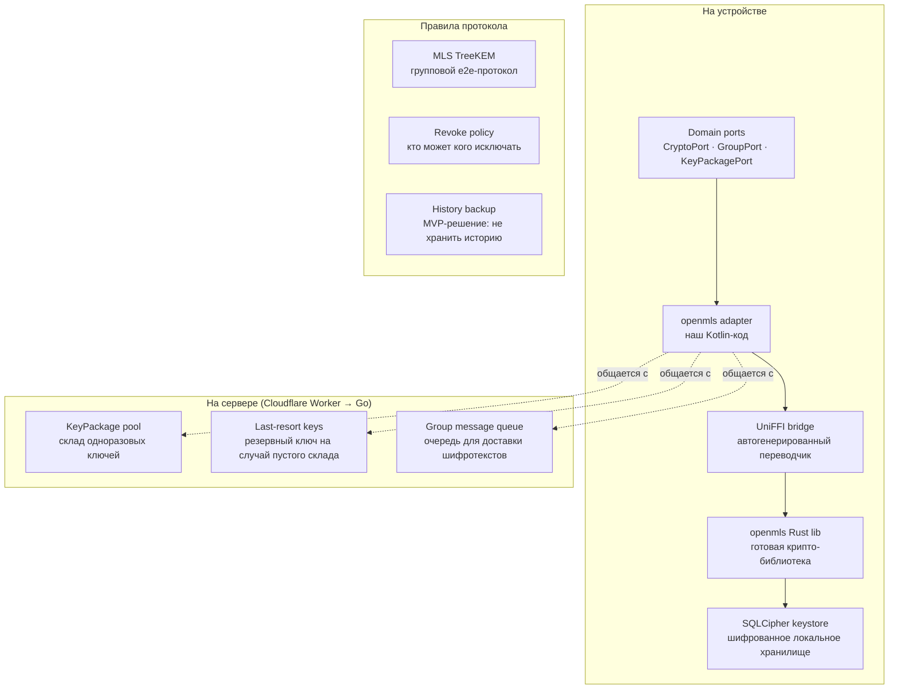
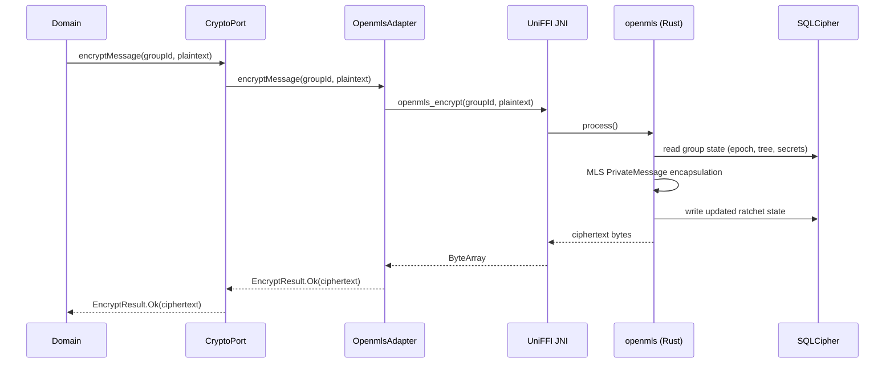
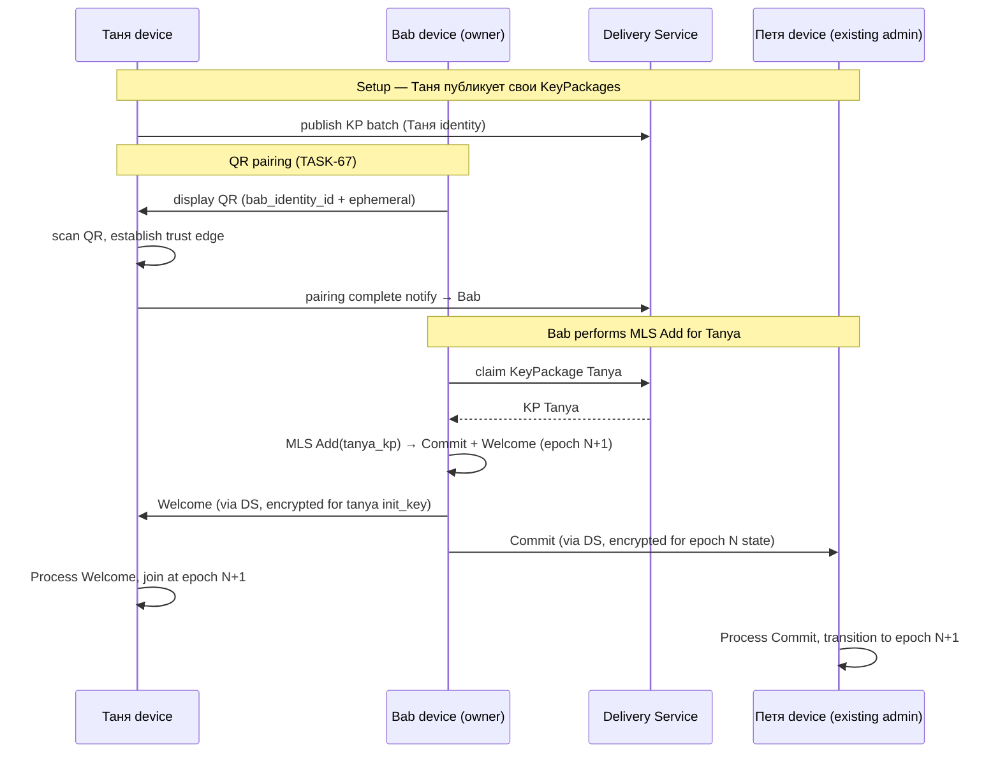
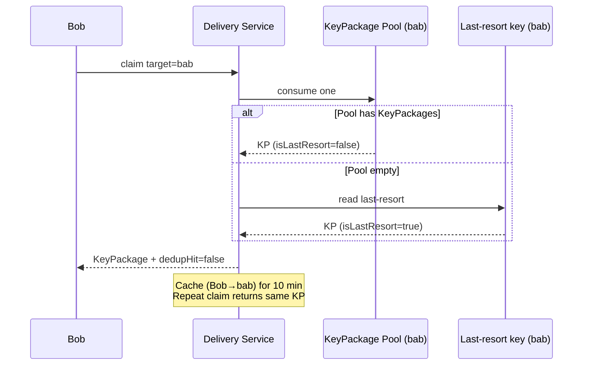
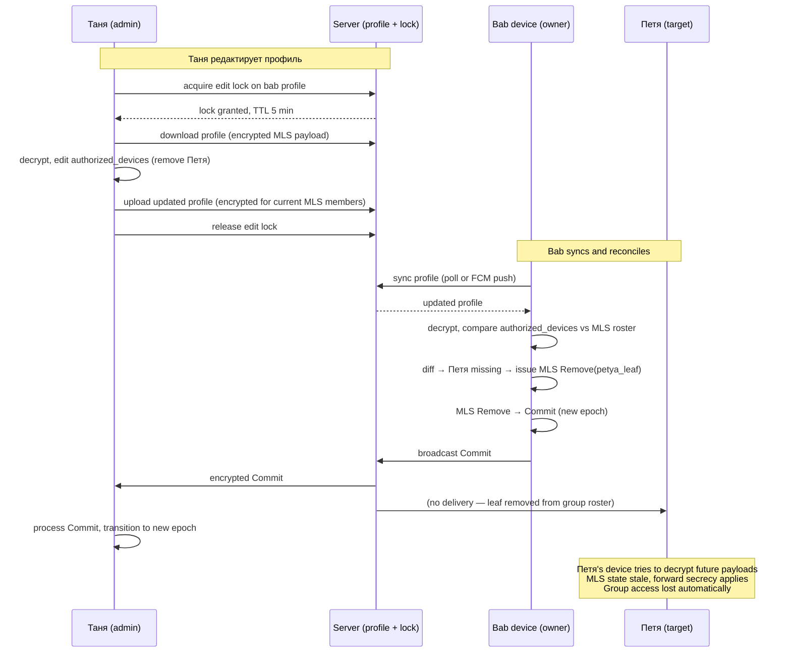

# Домен: Крипто

**Крипто-слой отвечает за то, чтобы**:

1. **Сообщение в family-чате мог прочитать только его адресат**, а не сервер и не атакующий, перехвативший трафик.
2. **Если старый ключ утечёт, старые сообщения нельзя расшифровать задним числом** (forward secrecy).
3. **Если новый member добавляется в группу — он не видит старую переписку** (post-compromise security).
4. **Групповая переписка масштабируется**: 20 родственников в чате не приводит к 20× стоимости на каждое сообщение.

---

## Как работает MLS — простыми словами (для новичка)

Прочитай этот раздел один раз — дальше всё остальное будет понятно.

### Аналогия — сейф с ключом-храповиком

У family-группы есть общий "виртуальный сейф". Ключ от сейфа знают только участники группы. Каждое сообщение = кладём письмо в сейф, шифруя текущим ключом.

**Особенность**: после каждого сообщения ключ **необратимо** меняется — "шагает вперёд". Старый ключ уничтожается сразу. Это называется **ratcheting** (по-русски "храповик" — механизм, работающий только в одну сторону, как в наручных часах).

**Зачем**: если завтра украдут наш планшет и извлекут текущий ключ — вчерашние сообщения расшифровать нельзя, потому что вчерашнего ключа уже **физически не существует**. Это свойство называется **forward secrecy** — прошлое защищено даже при компрометации сегодняшнего ключа.

### Почему группа сложнее чем 1-на-1

В личной переписке Alice ↔ Bob всё просто: у Alice ключ Bob'а, у Bob'а ключ Alice — шифруем.

**В группе Alice + Bob + бабушка + Таня + Петя** проблема: как сделать чтобы все пятеро знали **один и тот же** групповой ключ, никто снаружи не знал, и когда добавляем шестого — обновить всем удобно?

- **Signal (WhatsApp)** для групп использует **Sender Keys**: каждый member шлёт свой групповой ключ 4 раза (каждому другому лично). Работает, но **O(N)** сообщений. При 50 членах = 50 pairwise-сессий на обновление.
- **MLS изящнее**: строит **дерево** ключей.

### TreeKEM — дерево ключей группы

Каждый member = лист в binary-дереве. Внутренние узлы содержат промежуточные ключи. Корневой узел = групповой ключ.

```
             корневой ключ (групповой)
             /                    \
          узел1                  узел2
         /     \                /     \
      Alice   Bob            бабушка  Таня
```

**Почему дерево удобно**:
- Alice знает свой лист + путь к корню (Alice → узел1 → корень). Из этих ключей она может **вывести** групповой ключ.
- То же самое каждый другой member для своего пути.
- **Когда добавляем бабушку** → обновляются ключи **только по её пути** к корню (узел2 + корень). Это **O(log N)** — при 50 членах достаточно ~6 узлов обновить.
- В Sender Keys было бы 50 pairwise-сессий.

**Для family группы (5 человек)** разницы почти нет. Для клиники (100 пациентов) — MLS дешевле в 15 раз.

### Ключевые термины (пригодятся ниже)

- **Group state** — текущее состояние группы: кто в ней, версия ключа, TreeKEM дерево, приватные секреты для ratchet'а. Хранится **зашифрованно локально**.
- **Epoch** — версия группового ключа. Каждый add/remove/update повышает epoch. Между epoch'ами ключ полностью новый — это даёт **post-compromise security**.
- **KeyPackage** — пакет одноразовых публичных ключей бабушки, который её планшет заранее публикует на сервер. Bob использует его чтобы добавить бабушку когда она офлайн.
- **Commit** — операция обновления группы (add/remove/update). Автор Commit'а вычисляет новые ключи и шифрует их для остающихся членов.
- **Welcome** — стартовое сообщение для новичка при add. Полный snapshot group state, зашифрован на его `init_key` из KeyPackage.
- **AppMessage** — обычное зашифрованное сообщение ("Привет бабушка").
- **Ratchet** — механизм, обновляющий ключ шифрования после каждого сообщения без обратимости.
- **AEAD** — тип шифра (AES-GCM или ChaCha20-Poly1305) — одновременно шифрует и защищает от подмены.

### Кто что делает в нашем стеке

- **openmls (Rust)** — вся крипта. Держит group state в памяти, выполняет ratchet, шифрует, дешифрует.
- **SQLCipher** — сохраняет group state на диск зашифрованно (чтобы не потерять при закрытии app'а).
- **Наш Kotlin adapter** — переводит domain-запросы ("зашифруй это") в вызовы openmls.
- **UniFFI bridge** — автогенерированный "переводчик" между Kotlin и Rust (руками не пишем).
- **Delivery Service (Cloudflare Worker)** — только доставляет запечатанные конверты. Не видит содержимое. Хранит пул KeyPackages бабушки чтобы Alice могла её добавить пока она офлайн.

---

## Карта компонентов

Инвентарь — все кубики крипто-слоя в одной картинке.



**Легенда — что каждый кубик делает** (клик по ссылке → прыжок к описанию решения):

| Кубик | Что это | Куда читать |
|---|---|---|
| **C1** Domain ports | Договор — какие функции crypto-слой предоставляет остальному приложению. | [MLS библиотека](#mls-библиотека-openmls) |
| **C2** openmls adapter | Наш Kotlin-код, реализующий ports через вызовы Rust-библиотеки. Здесь живёт ACL (правило 2). | [MLS библиотека](#mls-библиотека-openmls) |
| **C3** UniFFI bridge | Автопереводчик между Kotlin и Rust. Генерируется скриптом. | [Kotlin binding](#kotlin-binding-uniffi) |
| **C4** openmls Rust lib | Готовая крипто-библиотека RFC 9420. MIT, аудирована SRLabs 2024. | [MLS библиотека](#mls-библиотека-openmls) |
| **C5** SQLCipher keystore | Локальное шифрованное хранилище для ключей и MLS state. | [Encrypted keystore](#encrypted-keystore-sqlcipher) |
| **S1** KeyPackage pool | Серверный склад одноразовых ключей бабушки. Cap=100, dedup 10 мин. | [KeyPackage pool](#keypackage-pool-server) |
| **S2** Last-resort keys | Один переиспользуемый ключ на случай пустого склада. | [Last-resort key](#last-resort-key) |
| **S3** Group message queue | Очередь для доставки шифротекстов. Сервер видит только конверт. | [Group protocol](#group-protocol-mls-treekem) |
| **R1** MLS TreeKEM | Групповой e2e-протокол. O(log N) обновление, forward + post-compromise security automatic. | [Group protocol](#group-protocol-mls-treekem) |
| **R2** Revoke policy | Bab's device = sole MLS executor; admins отзывают через редактирование профиля + reconciliation. | [Revoke policy](#revoke-policy) |
| **R3** History backup | MVP-решение: не восстанавливаем историю сообщений при recovery. | [History backup](#history-backup-mvp) |

---

## Как это работает — сценарии

### Сценарий 1 — устройство шифрует payload для группы

**Контекст**: в MVP это encrypted bucket sync payload (обновление contact list, tile arrangement — TASK-19). В future TASK-42 — тот же flow для messenger сообщений. MLS PrivateMessage encapsulation одинакова, отличается только применение — bucket sync vs chat message.

**Кто участвует** (внутри устройства отправителя, например Таны):

- **Domain** — приложение, решает "надо отправить сообщение".
- **CryptoPort** — контракт-интерфейс к крипто-слою (правило 1).
- **OpenmlsAdapter** — наш Kotlin-класс, реализующий CryptoPort через openmls.
- **UniFFI JNI** — автогенерированный мост между Kotlin и Rust.
- **openmls (Rust)** — крипто-библиотека, делает реальную работу.
- **SQLCipher** — шифрованное локальное хранилище, держит group state.

**Диаграмма**:



**Что происходит по шагам**:

1. **Domain → CryptoPort** — `encryptMessage(groupId, plaintext)`.
   Приложение говорит крипто-слою "вот текст, зашифруй". Domain **не знает** что мы используем openmls — только контракт Port'а. **Зачем такой слой**: правило 1 (изоляция от вендоров). Завтра swap на mls-rs — Domain не заметит.

2. **CryptoPort → OpenmlsAdapter**.
   Просто перенаправление вызова. CryptoPort — интерфейс, OpenmlsAdapter — реализация через openmls. **Зачем**: тесты подставляют fake-adapter, domain-логику можно тестировать без крипты.

3. **OpenmlsAdapter → UniFFI JNI** — `openmls_encrypt(...)`.
   Наш Kotlin-код вызывает Rust-функцию через мост **JNI** (Java Native Interface — стандартный Android механизм). UniFFI сгенерировал мост автоматически. **Зачем**: Rust и Kotlin — разные языки, напрямую вызывать нельзя.

4. **UniFFI JNI → openmls (Rust)** — `process()`.
   Управление перешло в Rust. Начинается реальная крипта.

5. **openmls → SQLCipher: read group state**.
   openmls читает **текущее состояние группы** с диска: какой epoch, TreeKEM дерево, приватные секреты ratchet'а. SQLCipher расшифровывает по ходу чтения. **Зачем**: без state'а неизвестно каким ключом шифровать.

6. **MLS PrivateMessage encapsulation** (внутри openmls, loopback).
   Сама крипто-магия:
   - Из group state выводится **ключ шифрования** для этого сообщения (через HKDF).
   - Через **AEAD** (AES-GCM или ChaCha20-Poly1305) шифруется текст.
   - Оборачивается в структуру `PrivateMessage` по RFC 9420.
   - **Ratchet шагает вперёд**: старый ключ уничтожается.

7. **openmls → SQLCipher: write updated ratchet state**.
   Обновлённая позиция ratchet'а пишется обратно на диск. **Зачем**: forward secrecy. Даже если завтра планшет украдут — вчерашние сообщения не расшифровать, вчерашней позиции ratchet'а нет.

8. **Обратный путь** — ciphertext возвращается через все слои. На каждом уровне тип оборачивается: Rust `Vec<u8>` → JNI `ByteArray` → Adapter → sealed class `EncryptResult.Ok(ciphertext)` → Domain. **Зачем sealed class**: типобезопасно, Domain видит либо `Ok` либо `Failed`, не raw bytes.

**Почему конвейер такой длинный** (каждый слой — по конкретной причине):

| Слой | Существует ради | Убрать = |
|---|---|---|
| Domain / Port | Правило 1 (изоляция от вендоров) | Домен привязан к openmls, swap невозможен без rewrite |
| Adapter | Правило 2 (ACL) | Тесты домена требуют реальной крипты |
| UniFFI / JNI | Kotlin и Rust — разные языки | Мостить руками = баги, memory leaks |
| openmls (Rust) | Крипту НЕ пишем сами | Свою крипту писать = высокая вероятность фатальных багов |
| SQLCipher | Ключи на диске должны быть зашифрованы | Кто угодно с root доступом читает ключи |

---

### Сценарий 2 — Таня подключается admin к бабушкиному планшету (QR pairing + MLS handshake)

**Контекст**: в MVP главная MLS-группа = **device management group бабушки**. Не family-мессенджер. Бабушкин планшет = MLS group owner (sole executor). Таня становится admin через QR pairing (TASK-67), что триггерит MLS Add на бабушкиной стороне.

**Кто участвует**:

- **Устройства**:
  - **Bab's device** — owner группы, единственный кто issues MLS Commits. Инициирует Add при pairing.
  - **Таня's device** — новый admin, публикует свои KeyPackages, получает Welcome, начинает участвовать.
  - **Петя's device** — existing admin (если уже подключён ранее), получает Commit при add новой Таны.
- **Сервер (Delivery Service, Cloudflare Worker)**:
  - Хранит KeyPackage pool каждой identity (в том числе Таны, опубликованный при её setup).
  - Пропускает Welcome / Commit конверты. Содержимое не читает.

**Диаграмма**:



**Что происходит по шагам**:

**Шаг 1 — Таня заранее публикует свои KeyPackages**.
При первом cloud action Танино устройство генерирует batch KeyPackages и upload'ит на сервер (endpoint `/v1/keypackage/publish`). **Зачем**: чтобы кто угодно (в нашем случае — bab's device) мог добавить Таню в группу пока она offline. Каждый KP одноразовый.

**Шаг 2 — QR pairing establishes trust edge**.
Таня физически сканирует QR отображённый на бабушкином планшете. QR содержит bab's `identity_id` + ephemeral pairing key. Обмен через local physical + server round-trip завершает trust edge (детали протокола — TASK-67).

**Зачем physical scan**: это наш Sybil-defense mechanism (TASK-106). Automated attacker не может remote'но получить bab's QR — нужен физический доступ.

**Шаг 3 — Bab's device claims Танин KeyPackage**.
Bab's device получает pairing complete notification → запрашивает у DS один Танин KeyPackage. **Зачем direction именно такой**: bab's device = sole executor MLS group. Только она может issue MLS Add. Значит она должна получить public keys нового member'а (Таны).

**Шаг 4 — Bab's device выполняет MLS Add(tanya_kp)**.
openmls на bab's device генерирует **два выходных сообщения**:
- **Commit** (для Петя, если он existing member) — обновляет TreeKEM: добавляет лист Тани, обновляет пути. Зашифрован на epoch N secrets, которые Петя знает.
- **Welcome** (для Тани) — полный snapshot стартового group state. Зашифрован на Танин `init_key` из KeyPackage.

Epoch сдвигается N → N+1.

**Шаг 5 — Bab's device отправляет Welcome Тане через DS**.
Welcome зашифрован ключом, который расшифрует только Таня. **Зачем отдельно от Commit**: у Тани ещё нет group state, ей нужен полный snapshot чтобы начать участвовать.

**Шаг 6 — Bab's device отправляет Commit Пете через DS**.
Commit зашифрован на epoch N state (Петя его знает). **Зачем отдельно**: Петя уже в группе, ему достаточно delta ("add этот leaf, обнови пути"). После обработки — transitions в epoch N+1.

**После handshake**: bab + Таня + Петя все в epoch N+1, могут шифровать/дешифровать group payloads (bucket sync). Старый ключ epoch N уничтожен на всех устройствах.

**Особенности device management vs future messenger**:
- **Кто может issue Add**: только bab's device (не Таня, не Петя). См. TASK-102.
- **Что group encrypts**: в MVP — bucket sync payloads (config, contacts, tiles). Future TASK-42 — messenger messages.
- **First pairing = group creation**: если у бабушки нет existing group, при первом pairing bab's device MLS GroupCreate → добавляет только Таню. Subsequent pairings = join existing.

---

### Сценарий 3 — Bob claim'ит бабушкин KeyPackage (защита от drain-атаки)

**Кто участвует**:

- **Клиент** (устройство Bob'а):
  - **Bob's adapter** — запрашивает пакет бабушки.
- **Сервер (Cloudflare Worker)**:
  - **Delivery Service handler** — обрабатывает `/v1/keypackage/claim`, проверяет JWT.
  - **KeyPackage Pool** (Cloudflare KV) — склад до 100 одноразовых пакетов бабушки.
  - **Last-resort key** (Cloudflare KV) — один переиспользуемый пакет на случай пустого склада.
  - **Claim dedup cache** (Cloudflare KV, TTL 10 мин) — запоминает пару `(Bob, бабушка)` → возвращает тот же пакет при повторном запросе.

**Диаграмма**:



**Что происходит по шагам**:

1. **Bob запрашивает KeyPackage** — POST `/v1/keypackage/claim { targetIdentityId: "bab" }`.
2. **DS проверяет JWT**, потом идёт в pool → `consume one`.
3. **Развилка**:
   - **Pool имеет KeyPackage'ы** → отдаёт один, `isLastResort=false`. Pool уменьшается на 1.
   - **Pool пустой** → fallback на last-resort key, возвращает его с `isLastResort=true`. Bob знает что это "запасник" (первый handshake со сниженной forward secrecy).
4. **DS запоминает** пару `(Bob, бабушка) → KP #N` в dedup cache на 10 минут. Повторный запрос той же пары в этом окне вернёт **тот же самый KeyPackage** (не consume'ит новый из pool).
5. **Bob получает KeyPackage** — может делать MLS Add(bab_kp) как в Сценарии 2.

**Зачем такая защита**:

**Drain-атака**: атакующий пытается запросить много бабушкиных KeyPackages подряд чтобы выжечь весь pool. Тогда бабушку никто не сможет добавить в новые группы пока её планшет не проснётся и не опубликует новую пачку.

Три механизма защищают:

| Механизм | От чего защищает |
|---|---|
| **Pool cap = 100** | Ограничивает урон: даже если атакующий один — максимум 100 пакетов может выжечь до бабушкиного refill'а |
| **Claim dedup 10 мин** | Тот же атакующий не может тратить много: 100 запросов от одного `requester_id` = 1 consume'ленный пакет |
| **Last-resort key** | Пул выжжен → бабушка всё равно addable. Weakened forward secrecy на первом handshake — приемлемый trade-off |

**Что защита НЕ ловит** (Sybil-атака): атакующий с 100 разных identity → dedup обходится через разные `requester_id`. Это область TASK-106 (signup gate — сделать создание identity дорогим).

---

### Сценарий 4 — Таня отзывает Петю через редактирование профиля (revoke via reconciliation)

**Контекст**: в device management model bab's device — единственный MLS Commit signer. Admins **не могут** напрямую issue MLS Remove. Отзыв происходит через двухступенчатый процесс: admin редактирует бабушкин профиль → bab's device at sync detects roster diff → issues MLS Remove. См. TASK-102.

**Кто участвует**:

- **Устройства**:
  - **Таня device** — admin инициирующий revoke. Редактирует бабушкин профиль.
  - **Bab's device** — group owner. Единственный кто фактически issues MLS Remove. Выполняет reconciliation at sync.
  - **Петя device (target)** — исключаемый admin. Его leaf будет удалён из MLS group. Пока bab's device не sync — Петя сохраняет group access (accepted eventual consistency).
- **Сервер (Cloudflare Worker)**:
  - **Profile storage** — держит encrypted MLS payload с `authorized_devices` list.
  - **Edit lock endpoint** — координирует concurrent edits.
  - **Delivery Service** — fanout Commit'ов после reconciliation.

**Диаграмма**:



**Что происходит по шагам**:

**Шаг 1 — Таня берёт edit lock**.
Endpoint `POST /v1/profile/lock` → сервер записывает `editing_by: tanya_identity_id, expires_at: now+5min`. **Зачем**: предотвратить split-brain (два admin'а редактируют concurrent'но, кто-то теряет изменения). Если lock уже held — сервер возвращает 409 Conflict, UI показывает "сейчас редактирует X".

**Шаг 2 — Таня скачивает и расшифровывает профиль**.
Profile — encrypted MLS payload (AppMessage). Только текущие members MLS group могут расшифровать. Таня как member — может.

**Шаг 3 — Таня редактирует `authorized_devices` list**.
Убирает Петю из списка. Список содержит `{identity_id, device_id, role, added_at, ...}` per device.

**Шаг 4 — Таня uploads обновлённый профиль**.
Encrypt новый payload для current MLS group (**включая Петю** — он ещё member на этот момент), upload на сервер. Release lock.

**Шаг 5 — Bab's device синкается**.
Либо poll'ом (background sync), либо FCM push notify'ом. Скачивает новую версию профиля, расшифровывает.

**Шаг 6 — Reconciliation on bab's device**.
Bab's device compare'ит `authorized_devices` list в profile против actual MLS group roster. Diff: Пети нет в profile, но есть в MLS → нужно MLS Remove.

**Шаг 7 — Bab's device issues MLS Remove(petya_leaf)**.
openmls генерирует Commit с новым epoch. Танин leaf остаётся, Петин удалён.

**Шаг 8 — Commit fanout через DS**.
Только к remaining members (Тане). Петя не получает — его leaf уже физически удалён из group tree, server-side roster его identity_id больше не lists как authorized recipient.

**Шаг 9 — Forward secrecy applies**.
Петин device пытается decrypt новые group payloads → его MLS state устарел, новый epoch key вывести нельзя. Group access lost automatically.

**Ключевые свойства этой модели** (per [TASK-102](../../backlog/tasks/task-102%20-%20Decision-Revoke-policy.md)):

| Свойство | Что даёт |
|---|---|
| **Bab's device = sole executor** | Нет split-brain, единственный источник правды для group state |
| **Profile change visible** | Rogue admin не может silently kick — его действие видно всем synced clients |
| **Edit lock** | Concurrent-edit protection, TTL 5 min balance между safety и stuck-lock UX |
| **Eventual consistency accepted** | Bab offline → change waits until sync. Compromised admin escalation = TASK-103 remote lock |
| **No blacklist** | Removed admin может re-join через new QR pairing (rate-limited per TASK-104) |

**Локальная альтернатива** (без server round-trip): на bab's device есть local UI "Кто управляет" — там прямое отключение любого admin'а. Тот же reconciliation path через local profile edit, просто без server-side lock (bab's device — sole authority локально).

---

## Какие компоненты выбрали и почему

### MLS библиотека: openmls

- **Что**: reference implementation MLS (RFC 9420) в Rust. Автор — Phoenix R&D, maintained by open community.
- **Почему**: MIT-лицензия (позволяет закрытое распространение), аудирован SRLabs 2024 (8 findings, 1 High, все fixed), RFC 9420 conformance = interop path на будущее (MIMI IETF standard).
- **Альтернативы рассмотрены**:

| Library | License | Verdict |
|---|---|---|
| libsignal | AGPL-3.0 | Reject — заражает лаунчер, "unsupported outside Signal" |
| matrix-rust-sdk | AGPL-3.0 | Reject — AGPL + требует Synapse |
| Kalium (Wire) | GPL-3.0 | Reject — GPL + coupled с Wire backend |
| CoreCrypto (Wire) | GPL-3.0 | Reject — GPL blocks proprietary distribution |
| mls-rs (AWS Labs) | Apache-2.0 / MIT | Runner-up — no third-party audit |
| **openmls** | **MIT** | **Chosen** — audited, permissive, community-maintained |

- **Где живёт**:

| Element | Path |
|---|---|
| Domain port | `core/src/commonMain/kotlin/domain/crypto/CryptoPort.kt` |
| Domain port | `core/src/commonMain/kotlin/domain/crypto/GroupPort.kt` |
| Domain port | `core/src/commonMain/kotlin/domain/crypto/KeyPackagePort.kt` |
| Adapter module | `app/adapters/openmls/` |
| Adapter class | `app/adapters/openmls/src/OpenmlsAdapter.kt` |
| Native lib | `app/src/main/jniLibs/arm64-v8a/libopenmls_ffi.so` |
| Native source | `native/openmls-ffi/` (Rust crate вызывающий openmls) |

- **Decision task**: [TASK-58](../../backlog/tasks/task-58%20-%20Research-Signal-Sender-Keys-vs-MLS-for-family-group-E2E.md) research complete → owner Decision pending.
- **Exit ramp**: swap на `mls-rs` (тот же RFC 9420 wire format) в адаптере, ~3-5 дней через `GroupCryptoPort`, domain не трогается.

---

### Kotlin binding: UniFFI

- **Что**: инструмент от Mozilla для автогенерации Kotlin/Swift bindings из Rust библиотеки. Мы описываем интерфейс в маленьком `.udl` файле, UniFFI генерирует Kotlin-обёртку + JNI-мосты автоматически.
- **Почему**: индустриальный стандарт (matrix-rust-sdk, CoreCrypto используют), type safety across FFI, никаких manual JNI (известный источник багов и memory leaks).
- **Где живёт**:

| Element | Path |
|---|---|
| UDL interface | `native/openmls-ffi/openmls-ffi.udl` |
| Rust FFI wrapper | `native/openmls-ffi/src/lib.rs` |
| Cargo config | `native/openmls-ffi/Cargo.toml` |
| Generated Kotlin | `app/adapters/openmls/build/generated/openmls_ffi/Openmls.kt` |

- **Как это выглядит**: Rust код openmls → тонкая обёртка возвращающая opaque handles → cargo-ndk cross-compile → `libopenmls_ffi.so` в APK → UniFFI-сгенерированный Kotlin wrapper → наш `OpenmlsAdapter` реализующий `CryptoPort`.
- **Exit ramp**: manual JNI (2-3 недели переписки на прямые `JNIEXPORT` функции). Не рекомендуется — потеряем автоматическую type safety.

---

### Encrypted keystore: SQLCipher

- **Что**: SQLite с встроенным шифрованием на диске (AES-256). Открытый источник, зрелая библиотека.
- **Почему**: openmls-у нужно куда-то писать group state, ratchet secrets, приватные ключи identity. На диске в plain-text — доступно любому с root-доступом. SQLCipher шифрует прозрачно; ключ шифрования выводится из user passphrase через PBKDF2.
- **Где живёт**:

| Element | Path |
|---|---|
| Adapter | `app/adapters/openmls/storage/SQLCipherStorageProvider.kt` |
| Passphrase derivation | `app/adapters/keystore/PassphraseDerivation.kt` |

- **Decision task**: [TASK-58](../../backlog/tasks/task-58%20-%20Research-Signal-Sender-Keys-vs-MLS-for-family-group-E2E.md) (research-complete-owner-decision-pending).
- **Exit ramp**: Room DB + отдельный ключ из Android Keystore (`AES/GCM/NoPadding` в hardware-backed slot). Requires migration existing SQLCipher stores.

---

### KeyPackage pool (server)

- **Что**: серверный склад одноразовых KeyPackages бабушки. Cap = 100, dedup TTL = 10 min, dedup key `(requester_identity_id, target_identity_id)`.
- **Почему**: защита от drain-атаки без нарушения UX (addability preserved через last-resort).
- **Preset fields** (family default):

| Поле | Значение | Изменяется в clinic preset? |
|---|---|---|
| `poolCap` | 100 | Да (клиника может поднять до 500) |
| `claimDedupTTLSeconds` | 600 (10 мин) | Возможно (клиника — 60 сек для faster fanout) |
| `lastResortRotationDays` | 7 | Возможно (клиника — 1 день для strict FS) |
| `refillThreshold` | 20 | Возможно |

- **Где живёт**:

| Element | Path |
|---|---|
| Publish handler | `push-worker/routes/keypackage/publish.ts` |
| Claim handler | `push-worker/routes/keypackage/claim.ts` |
| Pool storage | Cloudflare KV binding `KEYPACKAGE_POOL` |
| Dedup storage | Cloudflare KV binding `CLAIM_DEDUP` (TTL 600s) |
| Contract | `push-worker/contracts/keypackage.ts` |

- **API endpoints**:

```
POST /v1/keypackage/publish
Request:  { schemaVersion: 1, batch: KeyPackage[], isLastResort?: boolean }
Response: { schemaVersion: 1, data: { stored: number, dropped: number, poolSize: number } }
Errors:   401 (auth), 400 (schema), 413 (batch too large)

POST /v1/keypackage/claim
Request:  { schemaVersion: 1, targetIdentityId: string }
Response: { schemaVersion: 1, data: { keyPackage: KeyPackage, isLastResort: boolean, dedupHit: boolean } }
Errors:   401 (auth), 404 (target unknown), 429 (edge rate limit hit)
```

- **Decision task**: [TASK-104](../../backlog/tasks/task-104%20-%20Decision-KeyPackage-rate-limit.md).
- **Future Go microservice**: `workers/keypackage-store/` — mirror TS реализацию 1-to-1 через ~100 строк Go + PostgreSQL keypackage_pool table.

---

### Last-resort key

- **Что**: один переиспользуемый KeyPackage per identity, помечен `is_last_resort=true`. Rotation 7 дней (family). MLS RFC 9420 first-class concept.
- **Почему**: гарантирует что бабушку всегда можно добавить в группу, даже когда pool empty. Иначе — attacker выжигает pool → бабушка unaddable до её next refill.
- **Trade-off**: weakened forward secrecy на первом handshake с бабушкой (если last-resort private key утечёт — этот один handshake расшифровывается). Family preset приоритизирует availability. Weekly rotation ограничивает blast radius одной неделей.
- **Preset field**: `lastResortRotationDays: 7` (family) / `1` (clinic strict).
- **Decision task**: [TASK-104](../../backlog/tasks/task-104%20-%20Decision-KeyPackage-rate-limit.md).
- **Exit ramp**: `TODO(server-roadmap)`: switch to on-use rotation (immediate re-publish after consume) если last-resort compromise incident observed.

---

### Group protocol: MLS TreeKEM

- **Что**: RFC 9420 групповой e2e-протокол. Древовидная структура ключей, O(log N) обновление при add/remove/update.
- **Почему**: **scale** (family группа до ~50 членов, клиника — до ~200), **forward + post-compromise security automatic**, IETF standard (interop path через MIMI).
- **Где живёт**:

| Element | Path |
|---|---|
| Domain port | `core/src/commonMain/kotlin/domain/crypto/GroupPort.kt` |
| Adapter operations | `app/adapters/openmls/src/OpenmlsGroupOperations.kt` |
| Server message queue | `push-worker/routes/group/` |
| Message storage | Cloudflare KV binding `GROUP_INBOX` (per-recipient inbox) |
| Delivery | FCM push (immediate) + poll fallback (offline reconciliation) |

- **Decision task**: [TASK-104](../../backlog/tasks/task-104%20-%20Decision-KeyPackage-rate-limit.md).
- **Exit ramp**: Sender Keys (Signal group protocol) = major refactor (~30-60 дней). Reason to swap: MLS deprecated (маловероятно) или critical protocol vulnerability found.

---

### Revoke policy

- **Что**: **bab's device = sole MLS Commit signer** для device management group. Admins **не могут** напрямую issue MLS Remove — они отзывают через **редактирование бабушкиного профиля** на сервере с edit lock. Bab's device at sync compares `authorized_devices` list в profile против actual MLS roster → detects diff → issues MLS Remove Commit. Полный flow — см. [Сценарий 4](#сценарий-4--таня-отзывает-петю-через-редактирование-профиля-revoke-via-reconciliation).
- **Почему**: single source of truth (bab's device = anchor), split-brain невозможен, rogue admin не может silently kick (profile change visible всем synced clients), fits device management natural authority.
- **Roster roles** (declared in profile, not enforced by MLS itself):

| Role | Что означает |
|---|---|
| owner | Bab's device (sole MLS executor) |
| admin | Paired admin devices (can propose profile edits) |
| additional roles | Reserved для Phase-3+ (clinic head-nurse/junior-nurse), wire format extensible via schemaVersion |

- **Edit lock**: server-side, TTL 5 min (family default, preset-parameterizable). При concurrent-edit — UI показывает "editing by X, try later". Optional force-release by bab's device — TBD post-MVP.
- **Granularity**: identity-level в UI (одна кнопка "отключить" удаляет все leaves target'а). Device-level revoke — TASK-103 (remote app lock).
- **Bab offline gap**: profile changes queue до sync. Removed admin сохраняет group access в этом окне. Escalation для compromised admin = TASK-103.
- **Не применяется к**: future family messenger group (TASK-42, Phase-3+). Peer-to-peer revoke может быть уместен там — отдельное решение при активации.
- **Где живёт**:

| Element | Path |
|---|---|
| Domain rules | `core/src/commonMain/kotlin/domain/group/ReconciliationPolicy.kt` |
| Adapter | `app/adapters/openmls/src/OpenmlsReconciliation.kt` |
| Server profile storage | Cloudflare KV binding `PROFILE_STORE` |
| Server edit lock | Cloudflare KV binding `PROFILE_LOCKS` (TTL 300s) |
| Lock endpoints | `push-worker/routes/profile/lock.ts`, `unlock.ts` |
| Local UI "Кто управляет" | `app/ui/settings/DeviceManagementScreen.kt` |

- **Decision task**: [TASK-102](../../backlog/tasks/task-102%20-%20Decision-Revoke-policy.md).
- **Exit ramp**: server-side "eviction quorum" mechanism (если reconciliation-based revoke слишком медленный для bab-offline scenarios в beta data). N admins подписывают immediate Remove signal, bab's device applies at next sync. Additive change, no wire format break.

---

### History backup (MVP)

- **Что**: Signal-style — пользователь на новом устройстве **не видит** past messages, past photos, historic audit log. Только текущий Profile snapshot (contacts + tiles + themes), покрытый MLS bucket sync recovery.
- **Почему**: Article XX (Pre-MVP no-migration override) — не тратим effort на backup infrastructure пока нет реальных пользователей. HKDF context strings, wire format schema, retention policies остаются modifiable без cost.
- **Decision task**: [TASK-100](../../backlog/tasks/task-100%20-%20Decision-History-backup-strategy-for-MVP.md).
- **Exit ramp** — **HIST-BACKUP-001** (Phase-3+): SQLCipher local DB + backup encryption key через HKDF slot `history-backup-v1` + upload в iCloud/Drive/R2. Estimated: 4-6 weeks impl + 2 weeks UX. Additive — no migration existing MLS/bucket code. Server-roadmap entry: [server-roadmap.md § HIST-BACKUP-001](../dev/server-roadmap.md).

---

## Открытые вопросы (pending decisions)

- **[TASK-58](../../backlog/tasks/task-58%20-%20Research-Signal-Sender-Keys-vs-MLS-for-family-group-E2E.md)** — MLS library formal Decision (research complete, owner sign-off pending). Пока `Proposed` в frontmatter.
- **[TASK-112](../../backlog/tasks/task-112%20-%20Decision-Cross-platform-IdentityVault.md)** — IdentityVault port boundary (Discussion, session 1 закрыла research 2026-07-07, Session 2 awaiting owner).
- **On-use rotation last-resort key** — TASK-104 non-goal, `TODO(server-roadmap)`.
- **Cross-region drain detection** — TASK-104 non-goal, требует Durable Object promotion path (см. [SRV-BASELINE-003](../dev/server-roadmap.md#srv-baseline-zero-trust-posture-claudemd-rule-12--task-105)).
- **Metadata privacy at KeyPackage claim** (Sealed Sender-like) — parked → **[TASK-108](../../backlog/tasks/task-108%20-%20Decision-Metadata-privacy-what-server-sees.md)** T2 tier, не MVP.

---

## Related domains

- [identity.md](identity.md) — signup gate (TASK-106 pending), identity model (LOCAL/CLOUD), recovery (TASK-101), remote lock (TASK-103).
- [server.md](server.md) — Cloudflare Worker runtime, rate limits, storage tiers, Go migration path.
- [client-android.md](client-android.md) — Compose UI, DI wiring, adapter modules organization.

---

## История версий

| Дата | Изменение |
|---|---|
| 2026-07-06 | v3 — сценарии переработаны под device management model (TASK-102 rewrite). Сценарий 2: QR pairing + bab's device как sole executor вместо peer-admin add. Сценарий 4: revoke через profile reconciliation вместо peer-admin kick. Section 5 Revoke policy обновлена. |
| 2026-07-06 | v2 — rewrite in mentor style. Карта компонентов вынесена наружу, каждый сценарий склеен с пошаговым разбором inline, убрана дублирующая секция "Какие проблемы решает". |
| 2026-07-06 | v1 — initial version. |
