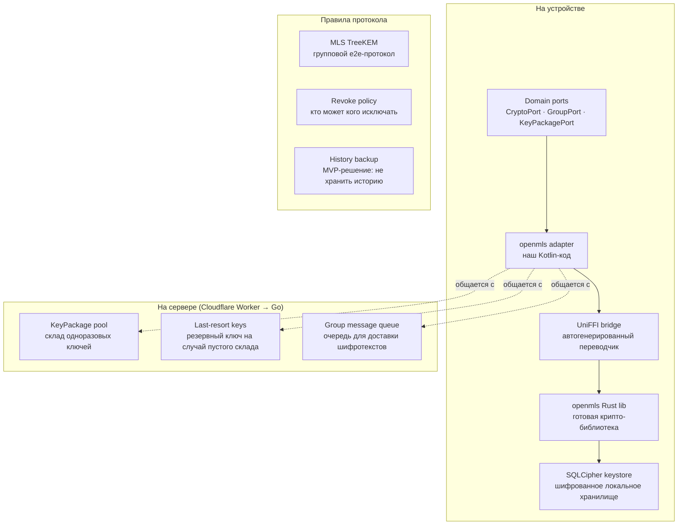
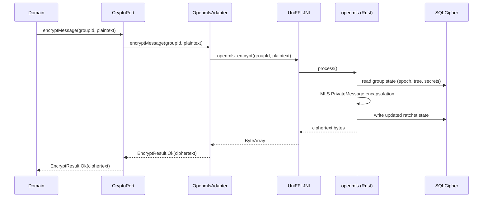
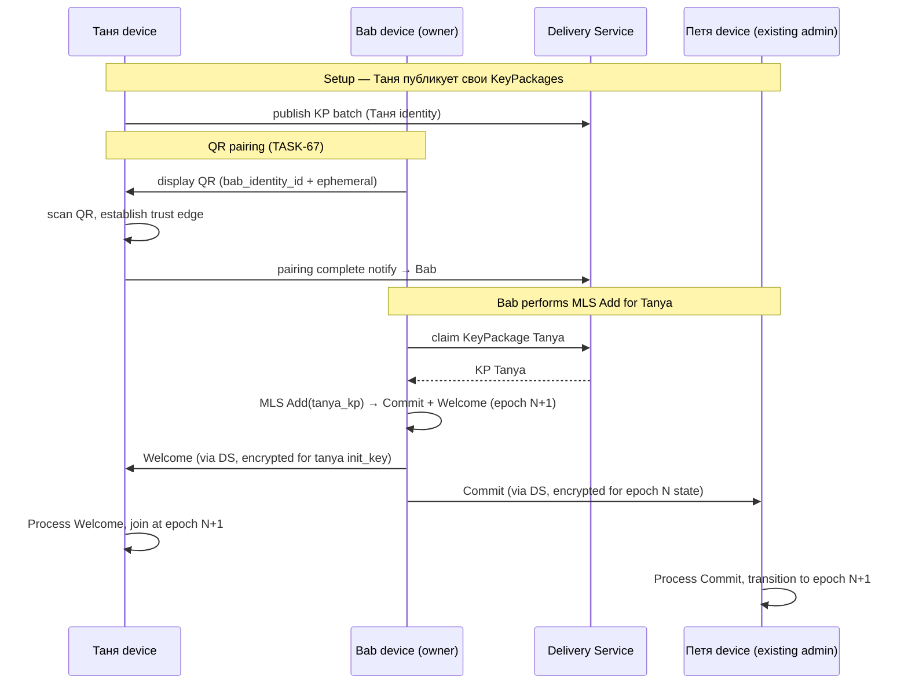
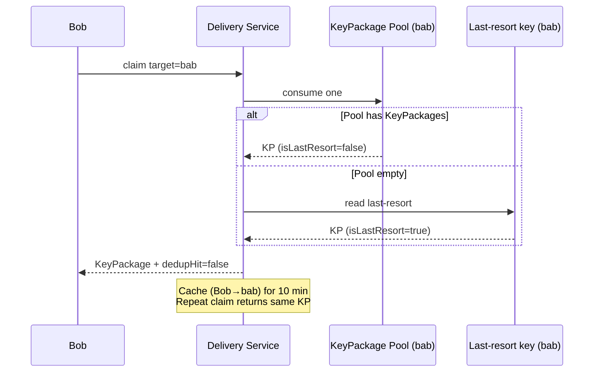
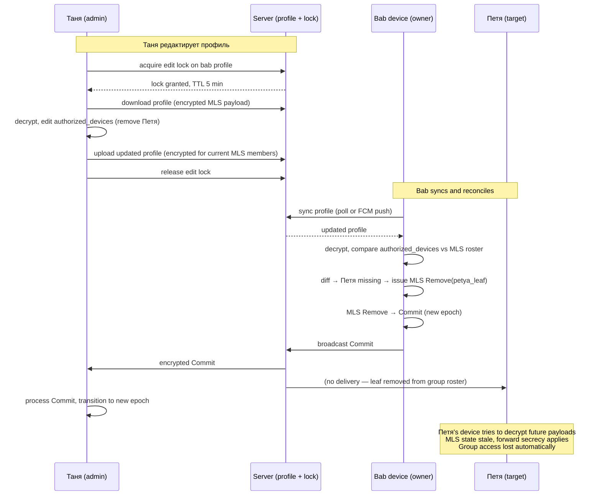

# Домен: Крипто

<!-- AI-TLDR:BEGIN — READ THIS FIRST. If you can answer the user's question from this block alone, STOP reading further. Deeper sections are for owner explanation / spec authoring / audit, not routine AI work. -->

## AI TL;DR — крипто-система в 60 строк

**Что защищаем**: E2E-encrypted семейное общение (config sync MVP → messenger + photo album Phase-3+). Server видит только конверты. Forward secrecy + post-compromise security через MLS ratchet.

**Stack (готовые компоненты, ~90% кода не наш)**:

| Слой | Компонент | Язык | License | Version |
|---|---|---|---|---|
| Primitives (AEAD, ECDH, sign, KDF, CSPRNG) | libsodium via [ionspin KMP](https://github.com/ionspin/kotlin-multiplatform-libsodium) | Kotlin | ISC | 0.9.5 |
| Group protocol (RFC 9420) | [openmls](https://github.com/openmls/openmls) | Rust | MIT | 0.8.1 |
| Handshake (Noise_XX) | `snow` | Rust | Apache-2.0 | pinned |
| FFI bridge | UniFFI | Rust→Kotlin gen | Mozilla | — |
| Encrypted at-rest | SQLCipher (openmls storage provider) + Android Keystore wrap | C + Android | BSD-style | — |
| Delivery service | Cloudflare Worker (TS) | TypeScript | — | — |
| Push | FCM | — | Firebase Spark | — |

**Наш код (~10%)**: domain ports (`core/src/commonMain/kotlin/domain/crypto/`), UniFFI wrapper, wire format + roundtrip tests, storage adapter, UI wizards.

**Domain ports (правило 1 — domain talks only to ports)**:

- `CryptoPort` — encrypt / decrypt message.
- `GroupPort` — create group / add member / remove member / process commit.
- `KeyPackagePort` — publish / claim KeyPackage batches.
- `IdentityVaultPort` (a.k.a. `KeyVault`) — operation-on-vault + narrow `exportDerivedKey` hatch. See TASK-112.

**Adapter modules (правило 2 — ACL за каждым внешним SDK)**:

- `app/adapters/openmls/` — Kotlin adapter → UniFFI → openmls Rust.
- `app/adapters/openmls/storage/` — SQLCipherStorageProvider.
- `app/adapters/keystore/` — Android Keystore AES-256-GCM wrap для priv keys.
- Native lib: `app/src/main/jniLibs/*/libopenmls_ffi.so` (cross-compiled cargo-ndk).

**Как это работает (одна фраза)**: домен вызывает `CryptoPort.encryptMessage(groupId, plaintext)` → Kotlin adapter → UniFFI JNI → openmls Rust читает group state из SQLCipher → делает MLS PrivateMessage encapsulation → ratchet шагает вперёд (старый ключ уничтожен = forward secrecy) → возвращает ciphertext. Сервер видит только конверт. Полные сценарии — § «Как это работает — сценарии».

**Server contract (что зашифрованные endpoints делают)** — см. [server.md § Крипто-relevant endpoints](server.md#крипто-relevant-endpoints-карта):
- `POST /v1/keypackage/publish|claim` — pool одноразовых ключей.
- `POST /v1/group/send` + `GET /v1/group/inbox` — fanout + poll fallback.
- `POST /v1/profile/lock|unlock` + `PUT /v1/profile/{id}` — revoke via reconciliation (TASK-102).
- `POST /v1/lock/trigger` — remote app lock (TASK-103).
- Все endpoints — zero-trust (JWT + rate limit + validate + observe + explicit failure), правило 12.

**Ключевые решения (frozen)**: MLS TreeKEM > Sender Keys (post-compromise security). openmls > mls-rs > CoreCrypto (лицензия + аудит). UniFFI > manual JNI (indus standard). SQLCipher > Room+Keystore split (openmls storage provider ready). Weekly rotation last-resort key. Bab's device = sole MLS Commit signer (device management model). Signal-style no-history MVP.

**Rejected (do not re-litigate)**: SGX, свой ECDH, свой MLS wire format, access-grant envelope-per-recipient, `mls-kotlin` (hobby), `libsignal` (AGPL), `matrix-rust-sdk` (AGPL + Synapse), `CoreCrypto` (GPL), `Kalium` (GPL). Полный список — § «Rejected alternatives».

**Что открыто Draft — foundation research, ждут `/speckit.specify`**:
- **TASK-57** Zero-Knowledge Server Architecture audit — **пересматривает server.md**, blocks TASK-59/60.
- **TASK-59** Recovery vault anti-brute-force research (SVR vs OPAQUE vs HMAC) — blocks TASK-6, TASK-21.
- **TASK-60** Push payload encryption + FCM 4KB — blocks все push-based features.

**Что открыто Draft — MLS foundation implementation** (созданы 2026-07-10 для заполнения gap'а: TASK-58 closure note назначила «MLS integration → TASK-2», но TASK-2 закрыт только с libsodium; реальной openmls-integration нет в коде):
- **TASK-122** F-CRYPTO Rust FFI Foundation — cargo-ndk + UniFFI toolchain. Deps: none. Blocks TASK-124.
- **TASK-123** F-CRYPTO Domain ports + fakes — `CryptoPort` / `GroupPort` / `KeyPackagePort` (mock-first, rule 6). Deps: TASK-112. Blocks TASK-124.
- **TASK-124** F-CRYPTO openmls integration — Rust wrapper + Kotlin adapter + in-memory storage + wire format tests. Deps: TASK-122 + TASK-123. Blocks TASK-125, unblocks TASK-67/42 domain-side.
- **TASK-125** F-CRYPTO SQLCipher storage provider — persistence layer для openmls. Deps: TASK-124.

**Что открыто Discussion — ждут Session 2 mentor**:
- TASK-112 KeyVault port boundary.
- TASK-115 Family app onboarding chain via Install Referrer (blocks messenger release).
- TASK-116 Iconic pairing challenge component.
- TASK-117 Universal attestation mechanism.

**Что paused** (ждут внешних триггеров):
- TASK-107 abuse response umbrella (post-MVP).
- TASK-109 concrete DO schema (ждёт первого TASK-105 endpoint).
- TASK-113 Outcome→exceptions refactor (ждёт активного FFI use).

**Что parked без task'ов** (edge cases / физические зависимости):
- Q-05 zombie devices (Phase-3+ edge case).
- Q-13 Huawei без GMS push fallback (physical device dependent, ждём железа).
- Q-16 sealed sender (absorbed в TASK-108 T2 future tier).

**Как AI должен использовать этот файл**:
- Routine question про крипту (какой primitive, где живёт, кто решил) — **этот TL;DR + § Decision index** достаточно, остальное **не читать**.
- «Что делать следующим / порядок реализации» — § Implementation sequence (living snapshot графа зависимостей, cross-verify через `backlog sequence list --plain`).
- Работа над спекой / crypto change / audit — читать сценарии + validation set + известные риски.
- Работа над server endpoint — читать [server.md](server.md) **+ note про TASK-57 pending audit** (server.md сейчас = pre-TASK-57 snapshot «умного» сервера; TASK-57 переопределит на zero-knowledge model).
- Novice explanation для владельца — читать § «Как работает MLS — простыми словами» + § «Novice glossary».
- Onboarding в архитектуру — читать сначала [INDEX.md](INDEX.md).

<!-- AI-TLDR:END -->

---

**Крипто-слой отвечает за то, чтобы**:

1. **Сообщение в family-чате мог прочитать только его адресат**, а не сервер и не атакующий, перехвативший трафик.
2. **Если старый ключ утечёт, старые сообщения нельзя расшифровать задним числом** (forward secrecy).
3. **Если новый member добавляется в группу — он не видит старую переписку** (post-compromise security).
4. **Групповая переписка масштабируется**: 20 родственников в чате не приводит к 20× стоимости на каждое сообщение.

---

## Как работает MLS — простыми словами (для новичка)

Прочитай этот раздел один раз — дальше всё остальное будет понятно.

### Аналогия — сейф с ключом-храповиком

У family-группы есть общий "виртуальный сейф". Ключ от сейфа знают только участники группы. Каждое сообщение = кладём письмо в сейф, шифруя текущим ключом.

**Особенность**: после каждого сообщения ключ **необратимо** меняется — "шагает вперёд". Старый ключ уничтожается сразу. Это называется **ratcheting** (по-русски "храповик" — механизм, работающий только в одну сторону, как в наручных часах).

**Зачем**: если завтра украдут наш планшет и извлекут текущий ключ — вчерашние сообщения расшифровать нельзя, потому что вчерашнего ключа уже **физически не существует**. Это свойство называется **forward secrecy** — прошлое защищено даже при компрометации сегодняшнего ключа.

### Почему группа сложнее чем 1-на-1

В личной переписке Alice ↔ Bob всё просто: у Alice ключ Bob'а, у Bob'а ключ Alice — шифруем.

**В группе Alice + Bob + бабушка + Таня + Петя** проблема: как сделать чтобы все пятеро знали **один и тот же** групповой ключ, никто снаружи не знал, и когда добавляем шестого — обновить всем удобно?

- **Signal (WhatsApp)** для групп использует **Sender Keys**: каждый member шлёт свой групповой ключ 4 раза (каждому другому лично). Работает, но **O(N)** сообщений. При 50 членах = 50 pairwise-сессий на обновление.
- **MLS изящнее**: строит **дерево** ключей.

### TreeKEM — дерево ключей группы

Каждый member = лист в binary-дереве. Внутренние узлы содержат промежуточные ключи. Корневой узел = групповой ключ.

```
             корневой ключ (групповой)
             /                    \
          узел1                  узел2
         /     \                /     \
      Alice   Bob            бабушка  Таня
```

**Почему дерево удобно**:
- Alice знает свой лист + путь к корню (Alice → узел1 → корень). Из этих ключей она может **вывести** групповой ключ.
- То же самое каждый другой member для своего пути.
- **Когда добавляем бабушку** → обновляются ключи **только по её пути** к корню (узел2 + корень). Это **O(log N)** — при 50 членах достаточно ~6 узлов обновить.
- В Sender Keys было бы 50 pairwise-сессий.

**Для family группы (5 человек)** разницы почти нет. Для клиники (100 пациентов) — MLS дешевле в 15 раз.

### Ключевые термины (пригодятся ниже)

- **Group state** — текущее состояние группы: кто в ней, версия ключа, TreeKEM дерево, приватные секреты для ratchet'а. Хранится **зашифрованно локально**.
- **Epoch** — версия группового ключа. Каждый add/remove/update повышает epoch. Между epoch'ами ключ полностью новый — это даёт **post-compromise security**.
- **KeyPackage** — пакет одноразовых публичных ключей бабушки, который её планшет заранее публикует на сервер. Bob использует его чтобы добавить бабушку когда она офлайн.
- **Commit** — операция обновления группы (add/remove/update). Автор Commit'а вычисляет новые ключи и шифрует их для остающихся членов.
- **Welcome** — стартовое сообщение для новичка при add. Полный snapshot group state, зашифрован на его `init_key` из KeyPackage.
- **AppMessage** — обычное зашифрованное сообщение ("Привет бабушка").
- **Ratchet** — механизм, обновляющий ключ шифрования после каждого сообщения без обратимости.
- **AEAD** — тип шифра (AES-GCM или ChaCha20-Poly1305) — одновременно шифрует и защищает от подмены.

### Кто что делает в нашем стеке

- **openmls (Rust)** — вся крипта. Держит group state в памяти, выполняет ratchet, шифрует, дешифрует.
- **SQLCipher** — сохраняет group state на диск зашифрованно (чтобы не потерять при закрытии app'а).
- **Наш Kotlin adapter** — переводит domain-запросы ("зашифруй это") в вызовы openmls.
- **UniFFI bridge** — автогенерированный "переводчик" между Kotlin и Rust (руками не пишем).
- **Delivery Service (Cloudflare Worker)** — только доставляет запечатанные конверты. Не видит содержимое. Хранит пул KeyPackages бабушки чтобы Alice могла её добавить пока она офлайн.

---

## Карта компонентов

Инвентарь — все кубики крипто-слоя в одной картинке.



**Легенда — что каждый кубик делает** (клик по ссылке → прыжок к описанию решения):

| Кубик | Что это | Куда читать |
|---|---|---|
| **C1** Domain ports | Договор — какие функции crypto-слой предоставляет остальному приложению. | [MLS библиотека](#mls-библиотека-openmls) |
| **C2** openmls adapter | Наш Kotlin-код, реализующий ports через вызовы Rust-библиотеки. Здесь живёт ACL (правило 2). | [MLS библиотека](#mls-библиотека-openmls) |
| **C3** UniFFI bridge | Автопереводчик между Kotlin и Rust. Генерируется скриптом. | [Kotlin binding](#kotlin-binding-uniffi) |
| **C4** openmls Rust lib | Готовая крипто-библиотека RFC 9420. MIT, аудирована SRLabs 2024. | [MLS библиотека](#mls-библиотека-openmls) |
| **C5** SQLCipher keystore | Локальное шифрованное хранилище для ключей и MLS state. | [Encrypted keystore](#encrypted-keystore-sqlcipher) |
| **S1** KeyPackage pool | Серверный склад одноразовых ключей бабушки. Cap=100, dedup 10 мин. | [KeyPackage pool](#keypackage-pool-server) |
| **S2** Last-resort keys | Один переиспользуемый ключ на случай пустого склада. | [Last-resort key](#last-resort-key) |
| **S3** Group message queue | Очередь для доставки шифротекстов. Сервер видит только конверт. | [Group protocol](#group-protocol-mls-treekem) |
| **R1** MLS TreeKEM | Групповой e2e-протокол. O(log N) обновление, forward + post-compromise security automatic. | [Group protocol](#group-protocol-mls-treekem) |
| **R2** Revoke policy | Bab's device = sole MLS executor; admins отзывают через редактирование профиля + reconciliation. | [Revoke policy](#revoke-policy) |
| **R3** History backup | MVP-решение: не восстанавливаем историю сообщений при recovery. | [History backup](#history-backup-mvp) |

---

## Как это работает — сценарии

### Сценарий 1 — устройство шифрует payload для группы

**Контекст**: в MVP это encrypted bucket sync payload (обновление contact list, tile arrangement — TASK-19). В future TASK-42 — тот же flow для messenger сообщений. MLS PrivateMessage encapsulation одинакова, отличается только применение — bucket sync vs chat message.

**Кто участвует** (внутри устройства отправителя, например Таны):

- **Domain** — приложение, решает "надо отправить сообщение".
- **CryptoPort** — контракт-интерфейс к крипто-слою (правило 1).
- **OpenmlsAdapter** — наш Kotlin-класс, реализующий CryptoPort через openmls.
- **UniFFI JNI** — автогенерированный мост между Kotlin и Rust.
- **openmls (Rust)** — крипто-библиотека, делает реальную работу.
- **SQLCipher** — шифрованное локальное хранилище, держит group state.

**Диаграмма**:



**Что происходит по шагам**:

1. **Domain → CryptoPort** — `encryptMessage(groupId, plaintext)`.
   Приложение говорит крипто-слою "вот текст, зашифруй". Domain **не знает** что мы используем openmls — только контракт Port'а. **Зачем такой слой**: правило 1 (изоляция от вендоров). Завтра swap на mls-rs — Domain не заметит.

2. **CryptoPort → OpenmlsAdapter**.
   Просто перенаправление вызова. CryptoPort — интерфейс, OpenmlsAdapter — реализация через openmls. **Зачем**: тесты подставляют fake-adapter, domain-логику можно тестировать без крипты.

3. **OpenmlsAdapter → UniFFI JNI** — `openmls_encrypt(...)`.
   Наш Kotlin-код вызывает Rust-функцию через мост **JNI** (Java Native Interface — стандартный Android механизм). UniFFI сгенерировал мост автоматически. **Зачем**: Rust и Kotlin — разные языки, напрямую вызывать нельзя.

4. **UniFFI JNI → openmls (Rust)** — `process()`.
   Управление перешло в Rust. Начинается реальная крипта.

5. **openmls → SQLCipher: read group state**.
   openmls читает **текущее состояние группы** с диска: какой epoch, TreeKEM дерево, приватные секреты ratchet'а. SQLCipher расшифровывает по ходу чтения. **Зачем**: без state'а неизвестно каким ключом шифровать.

6. **MLS PrivateMessage encapsulation** (внутри openmls, loopback).
   Сама крипто-магия:
   - Из group state выводится **ключ шифрования** для этого сообщения (через HKDF).
   - Через **AEAD** (AES-GCM или ChaCha20-Poly1305) шифруется текст.
   - Оборачивается в структуру `PrivateMessage` по RFC 9420.
   - **Ratchet шагает вперёд**: старый ключ уничтожается.

7. **openmls → SQLCipher: write updated ratchet state**.
   Обновлённая позиция ratchet'а пишется обратно на диск. **Зачем**: forward secrecy. Даже если завтра планшет украдут — вчерашние сообщения не расшифровать, вчерашней позиции ratchet'а нет.

8. **Обратный путь** — ciphertext возвращается через все слои. На каждом уровне тип оборачивается: Rust `Vec<u8>` → JNI `ByteArray` → Adapter → sealed class `EncryptResult.Ok(ciphertext)` → Domain. **Зачем sealed class**: типобезопасно, Domain видит либо `Ok` либо `Failed`, не raw bytes.

**Почему конвейер такой длинный** (каждый слой — по конкретной причине):

| Слой | Существует ради | Убрать = |
|---|---|---|
| Domain / Port | Правило 1 (изоляция от вендоров) | Домен привязан к openmls, swap невозможен без rewrite |
| Adapter | Правило 2 (ACL) | Тесты домена требуют реальной крипты |
| UniFFI / JNI | Kotlin и Rust — разные языки | Мостить руками = баги, memory leaks |
| openmls (Rust) | Крипту НЕ пишем сами | Свою крипту писать = высокая вероятность фатальных багов |
| SQLCipher | Ключи на диске должны быть зашифрованы | Кто угодно с root доступом читает ключи |

---

### Сценарий 2 — Таня подключается admin к бабушкиному планшету (QR pairing + MLS handshake)

**Контекст**: в MVP главная MLS-группа = **device management group бабушки**. Не family-мессенджер. Бабушкин планшет = MLS group owner (sole executor). Таня становится admin через QR pairing (TASK-67), что триггерит MLS Add на бабушкиной стороне.

**Кто участвует**:

- **Устройства**:
  - **Bab's device** — owner группы, единственный кто issues MLS Commits. Инициирует Add при pairing.
  - **Таня's device** — новый admin, публикует свои KeyPackages, получает Welcome, начинает участвовать.
  - **Петя's device** — existing admin (если уже подключён ранее), получает Commit при add новой Таны.
- **Сервер (Delivery Service, Cloudflare Worker)**:
  - Хранит KeyPackage pool каждой identity (в том числе Таны, опубликованный при её setup).
  - Пропускает Welcome / Commit конверты. Содержимое не читает.

**Диаграмма**:



**Что происходит по шагам**:

**Шаг 1 — Таня заранее публикует свои KeyPackages**.
При первом cloud action Танино устройство генерирует batch KeyPackages и upload'ит на сервер (endpoint `/v1/keypackage/publish`). **Зачем**: чтобы кто угодно (в нашем случае — bab's device) мог добавить Таню в группу пока она offline. Каждый KP одноразовый.

**Шаг 2 — QR pairing establishes trust edge**.
Таня физически сканирует QR отображённый на бабушкином планшете. QR содержит bab's `identity_id` + ephemeral pairing key. Обмен через local physical + server round-trip завершает trust edge (детали протокола — TASK-67).

**Зачем physical scan**: это наш Sybil-defense mechanism (TASK-106). Automated attacker не может remote'но получить bab's QR — нужен физический доступ.

**Шаг 3 — Bab's device claims Танин KeyPackage**.
Bab's device получает pairing complete notification → запрашивает у DS один Танин KeyPackage. **Зачем direction именно такой**: bab's device = sole executor MLS group. Только она может issue MLS Add. Значит она должна получить public keys нового member'а (Таны).

**Шаг 4 — Bab's device выполняет MLS Add(tanya_kp)**.
openmls на bab's device генерирует **два выходных сообщения**:
- **Commit** (для Петя, если он existing member) — обновляет TreeKEM: добавляет лист Тани, обновляет пути. Зашифрован на epoch N secrets, которые Петя знает.
- **Welcome** (для Тани) — полный snapshot стартового group state. Зашифрован на Танин `init_key` из KeyPackage.

Epoch сдвигается N → N+1.

**Шаг 5 — Bab's device отправляет Welcome Тане через DS**.
Welcome зашифрован ключом, который расшифрует только Таня. **Зачем отдельно от Commit**: у Тани ещё нет group state, ей нужен полный snapshot чтобы начать участвовать.

**Шаг 6 — Bab's device отправляет Commit Пете через DS**.
Commit зашифрован на epoch N state (Петя его знает). **Зачем отдельно**: Петя уже в группе, ему достаточно delta ("add этот leaf, обнови пути"). После обработки — transitions в epoch N+1.

**После handshake**: bab + Таня + Петя все в epoch N+1, могут шифровать/дешифровать group payloads (bucket sync). Старый ключ epoch N уничтожен на всех устройствах.

**Особенности device management vs future messenger**:
- **Кто может issue Add**: только bab's device (не Таня, не Петя). См. TASK-102.
- **Что group encrypts**: в MVP — bucket sync payloads (config, contacts, tiles). Future TASK-42 — messenger messages.
- **First pairing = group creation**: если у бабушки нет existing group, при первом pairing bab's device MLS GroupCreate → добавляет только Таню. Subsequent pairings = join existing.

---

### Сценарий 3 — Bob claim'ит бабушкин KeyPackage (защита от drain-атаки)

**Кто участвует**:

- **Клиент** (устройство Bob'а):
  - **Bob's adapter** — запрашивает пакет бабушки.
- **Сервер (Cloudflare Worker)**:
  - **Delivery Service handler** — обрабатывает `/v1/keypackage/claim`, проверяет JWT.
  - **KeyPackage Pool** (Cloudflare KV) — склад до 100 одноразовых пакетов бабушки.
  - **Last-resort key** (Cloudflare KV) — один переиспользуемый пакет на случай пустого склада.
  - **Claim dedup cache** (Cloudflare KV, TTL 10 мин) — запоминает пару `(Bob, бабушка)` → возвращает тот же пакет при повторном запросе.

**Диаграмма**:



**Что происходит по шагам**:

1. **Bob запрашивает KeyPackage** — POST `/v1/keypackage/claim { targetIdentityId: "bab" }`.
2. **DS проверяет JWT**, потом идёт в pool → `consume one`.
3. **Развилка**:
   - **Pool имеет KeyPackage'ы** → отдаёт один, `isLastResort=false`. Pool уменьшается на 1.
   - **Pool пустой** → fallback на last-resort key, возвращает его с `isLastResort=true`. Bob знает что это "запасник" (первый handshake со сниженной forward secrecy).
4. **DS запоминает** пару `(Bob, бабушка) → KP #N` в dedup cache на 10 минут. Повторный запрос той же пары в этом окне вернёт **тот же самый KeyPackage** (не consume'ит новый из pool).
5. **Bob получает KeyPackage** — может делать MLS Add(bab_kp) как в Сценарии 2.

**Зачем такая защита**:

**Drain-атака**: атакующий пытается запросить много бабушкиных KeyPackages подряд чтобы выжечь весь pool. Тогда бабушку никто не сможет добавить в новые группы пока её планшет не проснётся и не опубликует новую пачку.

Три механизма защищают:

| Механизм | От чего защищает |
|---|---|
| **Pool cap = 100** | Ограничивает урон: даже если атакующий один — максимум 100 пакетов может выжечь до бабушкиного refill'а |
| **Claim dedup 10 мин** | Тот же атакующий не может тратить много: 100 запросов от одного `requester_id` = 1 consume'ленный пакет |
| **Last-resort key** | Пул выжжен → бабушка всё равно addable. Weakened forward secrecy на первом handshake — приемлемый trade-off |

**Что защита НЕ ловит** (Sybil-атака): атакующий с 100 разных identity → dedup обходится через разные `requester_id`. Это область TASK-106 (signup gate — сделать создание identity дорогим).

---

### Сценарий 4 — Таня отзывает Петю через редактирование профиля (revoke via reconciliation)

**Контекст**: в device management model bab's device — единственный MLS Commit signer. Admins **не могут** напрямую issue MLS Remove. Отзыв происходит через двухступенчатый процесс: admin редактирует бабушкин профиль → bab's device at sync detects roster diff → issues MLS Remove. См. TASK-102.

**Кто участвует**:

- **Устройства**:
  - **Таня device** — admin инициирующий revoke. Редактирует бабушкин профиль.
  - **Bab's device** — group owner. Единственный кто фактически issues MLS Remove. Выполняет reconciliation at sync.
  - **Петя device (target)** — исключаемый admin. Его leaf будет удалён из MLS group. Пока bab's device не sync — Петя сохраняет group access (accepted eventual consistency).
- **Сервер (Cloudflare Worker)**:
  - **Profile storage** — держит encrypted MLS payload с `authorized_devices` list.
  - **Edit lock endpoint** — координирует concurrent edits.
  - **Delivery Service** — fanout Commit'ов после reconciliation.

**Диаграмма**:



**Что происходит по шагам**:

**Шаг 1 — Таня берёт edit lock**.
Endpoint `POST /v1/profile/lock` → сервер записывает `editing_by: tanya_identity_id, expires_at: now+5min`. **Зачем**: предотвратить split-brain (два admin'а редактируют concurrent'но, кто-то теряет изменения). Если lock уже held — сервер возвращает 409 Conflict, UI показывает "сейчас редактирует X".

**Шаг 2 — Таня скачивает и расшифровывает профиль**.
Profile — encrypted MLS payload (AppMessage). Только текущие members MLS group могут расшифровать. Таня как member — может.

**Шаг 3 — Таня редактирует `authorized_devices` list**.
Убирает Петю из списка. Список содержит `{identity_id, device_id, role, added_at, ...}` per device.

**Шаг 4 — Таня uploads обновлённый профиль**.
Encrypt новый payload для current MLS group (**включая Петю** — он ещё member на этот момент), upload на сервер. Release lock.

**Шаг 5 — Bab's device синкается**.
Либо poll'ом (background sync), либо FCM push notify'ом. Скачивает новую версию профиля, расшифровывает.

**Шаг 6 — Reconciliation on bab's device**.
Bab's device compare'ит `authorized_devices` list в profile против actual MLS group roster. Diff: Пети нет в profile, но есть в MLS → нужно MLS Remove.

**Шаг 7 — Bab's device issues MLS Remove(petya_leaf)**.
openmls генерирует Commit с новым epoch. Танин leaf остаётся, Петин удалён.

**Шаг 8 — Commit fanout через DS**.
Только к remaining members (Тане). Петя не получает — его leaf уже физически удалён из group tree, server-side roster его identity_id больше не lists как authorized recipient.

**Шаг 9 — Forward secrecy applies**.
Петин device пытается decrypt новые group payloads → его MLS state устарел, новый epoch key вывести нельзя. Group access lost automatically.

**Ключевые свойства этой модели** (per [TASK-102](../../backlog/tasks/task-102%20-%20Decision-Revoke-policy.md)):

| Свойство | Что даёт |
|---|---|
| **Bab's device = sole executor** | Нет split-brain, единственный источник правды для group state |
| **Profile change visible** | Rogue admin не может silently kick — его действие видно всем synced clients |
| **Edit lock** | Concurrent-edit protection, TTL 5 min balance между safety и stuck-lock UX |
| **Eventual consistency accepted** | Bab offline → change waits until sync. Compromised admin escalation = TASK-103 remote lock |
| **No blacklist** | Removed admin может re-join через new QR pairing (rate-limited per TASK-104) |

**Локальная альтернатива** (без server round-trip): на bab's device есть local UI "Кто управляет" — там прямое отключение любого admin'а. Тот же reconciliation path через local profile edit, просто без server-side lock (bab's device — sole authority локально).

---

## Какие компоненты выбрали и почему

### MLS библиотека: openmls

- **Что**: reference implementation MLS (RFC 9420) в Rust. Автор — Phoenix R&D, maintained by open community.
- **Почему**: MIT-лицензия (позволяет закрытое распространение), аудирован SRLabs 2024 (8 findings, 1 High, все fixed), RFC 9420 conformance = interop path на будущее (MIMI IETF standard).
- **Альтернативы рассмотрены**:

| Library | License | Verdict |
|---|---|---|
| libsignal | AGPL-3.0 | Reject — заражает лаунчер, "unsupported outside Signal" |
| matrix-rust-sdk | AGPL-3.0 | Reject — AGPL + требует Synapse |
| Kalium (Wire) | GPL-3.0 | Reject — GPL + coupled с Wire backend |
| CoreCrypto (Wire) | GPL-3.0 | Reject — GPL blocks proprietary distribution |
| mls-rs (AWS Labs) | Apache-2.0 / MIT | Runner-up — no third-party audit |
| **openmls** | **MIT** | **Chosen** — audited, permissive, community-maintained |

- **Где живёт**:

| Element | Path |
|---|---|
| Domain port | `core/src/commonMain/kotlin/domain/crypto/CryptoPort.kt` |
| Domain port | `core/src/commonMain/kotlin/domain/crypto/GroupPort.kt` |
| Domain port | `core/src/commonMain/kotlin/domain/crypto/KeyPackagePort.kt` |
| Adapter module | `app/adapters/openmls/` |
| Adapter class | `app/adapters/openmls/src/OpenmlsAdapter.kt` |
| Native lib | `app/src/main/jniLibs/arm64-v8a/libopenmls_ffi.so` |
| Native source | `native/openmls-ffi/` (Rust crate вызывающий openmls) |

- **Decision task**: [TASK-58](../../backlog/tasks/task-58%20-%20Research-Signal-Sender-Keys-vs-MLS-for-family-group-E2E.md) — **Done (superseded 2026-07-07)**. Формальное решение живёт в frontmatter этого файла.
- **Exit ramp**: swap на `mls-rs` (тот же RFC 9420 wire format) в адаптере, ~3-5 дней через `GroupCryptoPort`, domain не трогается.

---

### Kotlin binding: UniFFI

- **Что**: инструмент от Mozilla для автогенерации Kotlin/Swift bindings из Rust библиотеки. Мы описываем интерфейс в маленьком `.udl` файле, UniFFI генерирует Kotlin-обёртку + JNI-мосты автоматически.
- **Почему**: индустриальный стандарт (matrix-rust-sdk, CoreCrypto используют), type safety across FFI, никаких manual JNI (известный источник багов и memory leaks).
- **Где живёт**:

| Element | Path |
|---|---|
| UDL interface | `native/openmls-ffi/openmls-ffi.udl` |
| Rust FFI wrapper | `native/openmls-ffi/src/lib.rs` |
| Cargo config | `native/openmls-ffi/Cargo.toml` |
| Generated Kotlin | `app/adapters/openmls/build/generated/openmls_ffi/Openmls.kt` |

- **Как это выглядит**: Rust код openmls → тонкая обёртка возвращающая opaque handles → cargo-ndk cross-compile → `libopenmls_ffi.so` в APK → UniFFI-сгенерированный Kotlin wrapper → наш `OpenmlsAdapter` реализующий `CryptoPort`.
- **Exit ramp**: manual JNI (2-3 недели переписки на прямые `JNIEXPORT` функции). Не рекомендуется — потеряем автоматическую type safety.

---

### Encrypted keystore: SQLCipher

- **Что**: SQLite с встроенным шифрованием на диске (AES-256). Открытый источник, зрелая библиотека.
- **Почему**: openmls-у нужно куда-то писать group state, ratchet secrets, приватные ключи identity. На диске в plain-text — доступно любому с root-доступом. SQLCipher шифрует прозрачно; ключ шифрования выводится из user passphrase через PBKDF2.
- **Где живёт**:

| Element | Path |
|---|---|
| Adapter | `app/adapters/openmls/storage/SQLCipherStorageProvider.kt` |
| Passphrase derivation | `app/adapters/keystore/PassphraseDerivation.kt` |

- **Decision task**: [TASK-58](../../backlog/tasks/task-58%20-%20Research-Signal-Sender-Keys-vs-MLS-for-family-group-E2E.md) — **Done (superseded 2026-07-07)**.
- **Exit ramp**: Room DB + отдельный ключ из Android Keystore (`AES/GCM/NoPadding` в hardware-backed slot). Requires migration existing SQLCipher stores.

---

### KeyPackage pool (server)

- **Что**: серверный склад одноразовых KeyPackages бабушки. Cap = 100, dedup TTL = 10 min, dedup key `(requester_identity_id, target_identity_id)`.
- **Почему**: защита от drain-атаки без нарушения UX (addability preserved через last-resort).
- **Preset fields** (family default):

| Поле | Значение | Изменяется в clinic preset? |
|---|---|---|
| `poolCap` | 100 | Да (клиника может поднять до 500) |
| `claimDedupTTLSeconds` | 600 (10 мин) | Возможно (клиника — 60 сек для faster fanout) |
| `lastResortRotationDays` | 7 | Возможно (клиника — 1 день для strict FS) |
| `refillThreshold` | 20 | Возможно |

- **Где живёт**:

| Element | Path |
|---|---|
| Publish handler | `push-worker/routes/keypackage/publish.ts` |
| Claim handler | `push-worker/routes/keypackage/claim.ts` |
| Pool storage | Cloudflare KV binding `KEYPACKAGE_POOL` |
| Dedup storage | Cloudflare KV binding `CLAIM_DEDUP` (TTL 600s) |
| Contract | `push-worker/contracts/keypackage.ts` |

- **API endpoints**:

```
POST /v1/keypackage/publish
Request:  { schemaVersion: 1, batch: KeyPackage[], isLastResort?: boolean }
Response: { schemaVersion: 1, data: { stored: number, dropped: number, poolSize: number } }
Errors:   401 (auth), 400 (schema), 413 (batch too large)

POST /v1/keypackage/claim
Request:  { schemaVersion: 1, targetIdentityId: string }
Response: { schemaVersion: 1, data: { keyPackage: KeyPackage, isLastResort: boolean, dedupHit: boolean } }
Errors:   401 (auth), 404 (target unknown), 429 (edge rate limit hit)
```

- **Decision task**: [TASK-104](../../backlog/tasks/task-104%20-%20Decision-KeyPackage-rate-limit.md).
- **Future Go microservice**: `workers/keypackage-store/` — mirror TS реализацию 1-to-1 через ~100 строк Go + PostgreSQL keypackage_pool table.

---

### Last-resort key

- **Что**: один переиспользуемый KeyPackage per identity, помечен `is_last_resort=true`. Rotation 7 дней (family). MLS RFC 9420 first-class concept.
- **Почему**: гарантирует что бабушку всегда можно добавить в группу, даже когда pool empty. Иначе — attacker выжигает pool → бабушка unaddable до её next refill.
- **Trade-off**: weakened forward secrecy на первом handshake с бабушкой (если last-resort private key утечёт — этот один handshake расшифровывается). Family preset приоритизирует availability. Weekly rotation ограничивает blast radius одной неделей.
- **Preset field**: `lastResortRotationDays: 7` (family) / `1` (clinic strict).
- **Decision task**: [TASK-104](../../backlog/tasks/task-104%20-%20Decision-KeyPackage-rate-limit.md).
- **Exit ramp**: `TODO(server-roadmap)`: switch to on-use rotation (immediate re-publish after consume) если last-resort compromise incident observed.

---

### Group protocol: MLS TreeKEM

- **Что**: RFC 9420 групповой e2e-протокол. Древовидная структура ключей, O(log N) обновление при add/remove/update.
- **Почему**: **scale** (family группа до ~50 членов, клиника — до ~200), **forward + post-compromise security automatic**, IETF standard (interop path через MIMI).
- **Где живёт**:

| Element | Path |
|---|---|
| Domain port | `core/src/commonMain/kotlin/domain/crypto/GroupPort.kt` |
| Adapter operations | `app/adapters/openmls/src/OpenmlsGroupOperations.kt` |
| Server message queue | `push-worker/routes/group/` |
| Message storage | Cloudflare KV binding `GROUP_INBOX` (per-recipient inbox) |
| Delivery | FCM push (immediate) + poll fallback (offline reconciliation) |

- **Decision task**: [TASK-104](../../backlog/tasks/task-104%20-%20Decision-KeyPackage-rate-limit.md).
- **Exit ramp**: Sender Keys (Signal group protocol) = major refactor (~30-60 дней). Reason to swap: MLS deprecated (маловероятно) или critical protocol vulnerability found.

---

### Revoke policy

- **Что**: **bab's device = sole MLS Commit signer** для device management group. Admins **не могут** напрямую issue MLS Remove — они отзывают через **редактирование бабушкиного профиля** на сервере с edit lock. Bab's device at sync compares `authorized_devices` list в profile против actual MLS roster → detects diff → issues MLS Remove Commit. Полный flow — см. [Сценарий 4](#сценарий-4--таня-отзывает-петю-через-редактирование-профиля-revoke-via-reconciliation).
- **Почему**: single source of truth (bab's device = anchor), split-brain невозможен, rogue admin не может silently kick (profile change visible всем synced clients), fits device management natural authority.
- **Roster roles** (declared in profile, not enforced by MLS itself):

| Role | Что означает |
|---|---|
| owner | Bab's device (sole MLS executor) |
| admin | Paired admin devices (can propose profile edits) |
| additional roles | Reserved для Phase-3+ (clinic head-nurse/junior-nurse), wire format extensible via schemaVersion |

- **Edit lock**: server-side, TTL 5 min (family default, preset-parameterizable). При concurrent-edit — UI показывает "editing by X, try later". Optional force-release by bab's device — TBD post-MVP.
- **Granularity**: identity-level в UI (одна кнопка "отключить" удаляет все leaves target'а). Device-level revoke — TASK-103 (remote app lock).
- **Bab offline gap**: profile changes queue до sync. Removed admin сохраняет group access в этом окне. Escalation для compromised admin = TASK-103.
- **Не применяется к**: future family messenger group (TASK-42, Phase-3+). Peer-to-peer revoke может быть уместен там — отдельное решение при активации.
- **Где живёт**:

| Element | Path |
|---|---|
| Domain rules | `core/src/commonMain/kotlin/domain/group/ReconciliationPolicy.kt` |
| Adapter | `app/adapters/openmls/src/OpenmlsReconciliation.kt` |
| Server profile storage | Cloudflare KV binding `PROFILE_STORE` |
| Server edit lock | Cloudflare KV binding `PROFILE_LOCKS` (TTL 300s) |
| Lock endpoints | `push-worker/routes/profile/lock.ts`, `unlock.ts` |
| Local UI "Кто управляет" | `app/ui/settings/DeviceManagementScreen.kt` |

- **Decision task**: [TASK-102](../../backlog/tasks/task-102%20-%20Decision-Revoke-policy.md).
- **Exit ramp**: server-side "eviction quorum" mechanism (если reconciliation-based revoke слишком медленный для bab-offline scenarios в beta data). N admins подписывают immediate Remove signal, bab's device applies at next sync. Additive change, no wire format break.

---

### History backup (MVP)

- **Что**: Signal-style — пользователь на новом устройстве **не видит** past messages, past photos, historic audit log. Только текущий Profile snapshot (contacts + tiles + themes), покрытый MLS bucket sync recovery.
- **Почему**: Article XX (Pre-MVP no-migration override) — не тратим effort на backup infrastructure пока нет реальных пользователей. HKDF context strings, wire format schema, retention policies остаются modifiable без cost.
- **Decision task**: [TASK-100](../../backlog/tasks/task-100%20-%20Decision-History-backup-strategy-for-MVP.md).
- **Exit ramp** — **HIST-BACKUP-001** (Phase-3+): SQLCipher local DB + backup encryption key через HKDF slot `history-backup-v1` + upload в iCloud/Drive/R2. Estimated: 4-6 weeks impl + 2 weeks UX. Additive — no migration existing MLS/bucket code. Server-roadmap entry: [server-roadmap.md § HIST-BACKUP-001](../dev/server-roadmap.md).

---

## Открытые вопросы (pending decisions)

**В backlog как Discussion (ждут Session 2 mentor)**:
- **[TASK-112](../../backlog/tasks/task-112%20-%20Decision-Cross-platform-IdentityVault.md)** — IdentityVault port boundary.
- **[TASK-115](../../backlog/tasks/task-115%20-%20Decision-Launcher-anchored-spoke-app-onboarding.md)** — Family app onboarding chain via Install Referrer.
- **[TASK-116](../../backlog/tasks/task-116%20-%20Iconic-pairing-challenge-component.md)** — Iconic pairing challenge component.
- **[TASK-117](../../backlog/tasks/task-117%20-%20Social-recovery-attestor-infrastructure.md)** — Universal attestation mechanism.

**Parked в server-roadmap** (не блокируют MVP приложения):
- **On-use rotation last-resort key** — TASK-104 non-goal, `TODO(server-roadmap)`.
- **Cross-region drain detection** — TASK-104 non-goal, требует Durable Object promotion path.
- **Metadata privacy at KeyPackage claim** (Sealed Sender-like) — absorbed в **[TASK-108](../../backlog/tasks/task-108%20-%20Decision-Metadata-privacy-what-server-sees.md)** T2 tier, не MVP.

**Parked без task'ов (edge cases / физические зависимости)**:
- **Q-05 Zombie devices** — устройства не активные 6+ месяцев, auto-cleanup из MLS group. Phase-3+ edge case.
- **Q-13 Huawei без GMS push fallback** — HMS Push Kit / MQTT / WebSocket. Physical device dependent, ждём железа (появится когда шлифуем приложение на дополнительных платформах).
- **Q-16 Group ID visible серверу** — sealed sender pattern (Signal-tier). Absorbed как TASK-108 T2 future tier.

---

## Rejected alternatives (do not re-litigate)

Эти варианты обсуждались и отброшены в mentor-сессиях. Не пере-обсуждать без нового evidence.

**Cryptography / protocol level:**
- ❌ SGX enclave — не строим никогда. Ограниченная availability на consumer Android, complexity не оправдана.
- ❌ Собственный ECDH handshake — используем `snow` (Rust via UniFFI). Правило 6 (mock-first) + правило 2 (ACL).
- ❌ Access-grant + envelope-per-recipient — заменён MLS group membership. Whole pattern superseded в [Сценарий 4](#сценарий-4--таня-отзывает-петю-через-редактирование-профиля-revoke-via-reconciliation).
- ❌ Собственный MLS wire format — используем RFC 9420 conformance для interop path через MIMI IETF standard.

**Libraries rejected:**
- ❌ `mls-kotlin` (Traderjoe95) — JVM-only hobby project, no audit, no releases, 1 contributor. См. [TASK-104](../../backlog/tasks/task-104%20-%20Decision-KeyPackage-rate-limit.md).
- ❌ `com.wire:core-crypto` shortcut — GPL-3 contamination breaks commercial subscription model.
- ❌ `libsignal` — AGPL-3.0 + "unsupported outside Signal".
- ❌ `matrix-rust-sdk` — AGPL-3.0 + требует Synapse backend.
- ❌ `Kalium` / `CoreCrypto` (Wire) — GPL blocks proprietary distribution.

**Multi-app cohabitation:**
- ❌ `android:sharedUserId` — deprecated в Android 10, удалён в Android 13.
- ❌ `MODE_WORLD_READABLE` для shared crypto files — Android Security Bulletin SA-2017, deprecated.
- ❌ Один master ключ через сервер для всех app семейства — концентрация риска.
- ❌ iCloud Keychain как cross-app sync механизм — only-Apple-id-tied, не работает cross-platform.

**Process:**
- ❌ External crypto audit pre-ship — заменён на fitness tests + threat model + bug bounty + agent-audit (см. § Post-MVP roadmap → A4 в этом файле).

---

## Novice glossary (аналогии для базовых понятий)

Полезно для fresh AI onboarding и для владельца при возврате к теме через месяцы.

- **Паспорт человека** = **identity_id** — уникальный номер, детерминистически = `hash(root_public)`, не меняется.
- **Пароль от сейфа** = **passphrase** — что человек помнит.
- **Домашний ключ** = **root key** — сам сейф, из которого рождаются все остальные ключи.
- **Личный автограф** = **identity key** — доказывает «это я как личность».
- **Ключ от квартиры** = **device key** — принадлежит конкретному телефону.
- **Общая комната с замком** = **MLS group** — у всех членов свои пропуска, ключ комнаты общий.
- **Список членов комнаты** = **MLS roster** — кто внутри.
- **Ритуал знакомства** = **handshake** — два устройства впервые встречаются.
- **Личная записная книжка** = **TrustEdge** — мои имена для знакомых.
- **Сейф с храповиком** = **ratcheting** — ключ шифрования после каждого сообщения необратимо меняется. Даёт **forward secrecy**.
- **Дерево ключей** = **TreeKEM** — MLS основа. Каждый member = лист, корень = групповой ключ. `O(log N)` обновлений вместо `O(N)` у Sender Keys.
- **Версия ключа** = **epoch** — каждый add/remove/update повышает. Между epoch ключ полностью новый = **post-compromise security**.
- **Одноразовые пакеты** = **KeyPackage** — публичные ключи, публикуемые заранее для добавления пока вы офлайн.
- **Стартовое сообщение** = **Welcome** — для новичка при add, полный snapshot group state, зашифрован на его init_key.

### Наши инструменты (что делают)

Мы не пишем крипту сами — склеиваем три готовых инструмента:

| Инструмент | Что делает | Кто ещё использует |
|---|---|---|
| **libsodium** (ionspin KMP) | Крипто-примитивы (шифрование, ключи, KDF) | Signal, WhatsApp, Wire |
| **snow** (Rust via UniFFI) | Handshake Noise_XX | WireGuard, WhatsApp companion |
| **openmls** (Rust via UniFFI) | Групповая крипта MLS RFC 9420 | Wire, Cisco Webex, Discord DAVE |

**Наш код (~10%)**: domain ports, UniFFI wrapper, wire format + roundtrip тесты, storage adapter, UI wizard'ов.

---

## Terminology mapping (old → current)

Для чтения старых спек / decisions / чат-логов до 2026-07-07 сессий.

| Old | Current | Where |
|---|---|---|
| `stableId` | `identity_id = hash(root_public)` | TASK-106 |
| `mls-rs` (main choice) | `openmls` (main), `mls-rs` (exit ramp) | этот файл, frontmatter |
| Firestore paths `/users/{stableId}/*` | opaque `OwnerRef` via adapter | TASK-108 |
| Google Sign-In at first launch | LOCAL identity, cloud upgrade lazy at pairing | TASK-106 |
| Peer-admin MLS Remove kick | bab's device sole executor + profile reconciliation | TASK-102 |
| Access-grants + envelope-per-recipient | MLS group membership | Сценарий 4 |
| Firebase ID token (hardcoded) | Generic JWT verification | TASK-105 |
| Noise XXpsk3 | Noise_XX | TASK-67 |

---

## Топ-7 способов взорвать систему нашим кодом

Timeless engineering principles — актуальны через любые технологические изменения. Каждый пункт закрывается concrete митигацией.

1. **Nonce reuse в AEAD** — используем только `libsodium.secretbox` / `crypto_secretstream` (random nonce), никогда свой counter. Fitness: «encrypt два раза одинаковое → выход разный».
2. **Wrong Server Rules / Worker validation** — attacker с валидным JWT становится admin. Митигация: rules tests + Worker unit tests + negative-path + 2-глазный review. См. [TASK-105](../../backlog/tasks/task-105%20-%20Decision-Server-side-abuse-defense-baseline.md).
3. **Argon2id iteration count слишком низкий** — brute-force за часы вместо десятилетий. Митигация: hardcoded константа + roundtrip test `assert iterations >= MIN`.
4. **QR wire format без `schemaVersion`** — сломали всех на v1 при добавлении поля. Правило 5. Митигация: обязательное поле + [TASK-16 fitness rule](../../backlog/tasks/task-16%20-%20Preset-Schema-v2-Wizard-Engine.md).
5. **`android:allowBackup="true"` по умолчанию** — root_key утечёт в Google Cloud Backup. Митигация: `allowBackup="false"` + `dataExtractionRules.xml` + CI check.
6. **KeyPackage reuse** — forward secrecy теряется. Митигация: openmls соблюдает одноразовость + test on marked-used → refuse.
7. **Trust JWT для authorization вместо MLS group membership** — attacker с чужим JWT получит доступ. Митигация: Worker всегда verify JWT **И** roster membership (правило 12 zero-trust).

**Как не сделать**: `checklist-security`, `checklist-wire-format`, `checklist-domain-isolation`, `checklist-server-hardening` — обязательны для каждого крипто-спека.

---

## Decision index (что закрыто, статус, что решено)

Snapshot decision-tasks 16, 57–60, 100..117. Обновляется при закрытии Decision или переходе статуса.

| Task | Title | Status | Кратко |
|---|---|---|---|
| [TASK-16](../../backlog/tasks/task-16%20-%20Preset-Schema-v2-Wizard-Engine.md) | Wire format evolution discipline | Draft | `schemaVersion: String` Kubernetes-style suffix, two modes / one fitness rule, Bitwarden first-byte inband для E2E форматов. Applies to 7 wire formats. |
| [TASK-57](../../backlog/tasks/task-57%20-%20Zero-Knowledge-Server-Architecture-audit-Article-XX-adoption.md) | Zero-Knowledge Server Architecture audit + Article XX | **Draft** | Foundational architectural reformulation: сервер видит только opaque blobs + Ed25519 signatures, не строит ACL graph, не понимает eventType / content / ownership relations. Всё membership/history/routing на клиенте. **Blocks TASK-59, TASK-60. Пересматривает server.md snapshot** (текущий = pre-TASK-57 модель "умного" Cloudflare Worker'а). |
| [TASK-58](../../backlog/tasks/task-58%20-%20Research-Signal-Sender-Keys-vs-MLS-for-family-group-E2E.md) | MLS library formal choice | Done — superseded | MLS vs Sender Keys — MLS. openmls vs mls-rs — openmls (mls-rs = exit ramp). Formal Decision в этом файле frontmatter. |
| [TASK-59](../../backlog/tasks/task-59%20-%20Research-Recovery-vault-anti-brute-force-counter-—-SVR-vs-OPAQUE-vs-simple-HMAC.md) | Research: Recovery vault anti-brute-force counter | **Draft** | SVR (SGX enclave) vs OPAQUE (asymmetric PAKE) vs simple server-side HMAC. Foundation для recovery vault wire format. **Blocks TASK-6 (Root Key Hierarchy) и TASK-21 (Recovery)**. Depends TASK-57. |
| [TASK-60](../../backlog/tasks/task-60%20-%20Research-Push-payload-encryption-FCM-4KB-constraint.md) | Research: Push payload encryption + FCM 4KB constraint | **Draft** | Encrypted push payload под FCM 4KB limit. Wire-format для event types (config-updated, SOS, health, reminder, activity, messenger). **Blocks все push-based features**. Depends TASK-57. |
| [TASK-100](../../backlog/tasks/task-100%20-%20Decision-History-backup-strategy-for-MVP.md) | History backup strategy | Done | MVP Signal-style (нет истории после recovery); Phase-3+ WhatsApp-style opt-in backup. |
| [TASK-101](../../backlog/tasks/task-101%20-%20Decision-Peer-confirmation-on-recovery.md) | Peer confirmation on recovery | Draft | Chrome-model auto-add + post-facto notification. Multi-device как first-class. |
| [TASK-102](../../backlog/tasks/task-102%20-%20Decision-Revoke-policy.md) | MLS revoke policy | Draft | Three-tier language (owner/admin/other), MVP flat + admin, identity-level UI, no blacklist. |
| [TASK-103](../../backlog/tasks/task-103%20-%20Decision-Remote-app-lock-for-stolen-device.md) | Remote app lock for stolen device | Draft | Full logout + Keystore wipe = crypto defense (не UX). 5 preset fields. |
| [TASK-104](../../backlog/tasks/task-104%20-%20Decision-KeyPackage-rate-limit.md) | KeyPackage rate limit | Draft | Signal-inspired hybrid: pool cap + claim dedup + last-resort. 4 preset fields. |
| [TASK-105](../../backlog/tasks/task-105%20-%20Decision-Server-side-abuse-defense-baseline.md) | Server-side abuse defense baseline | Draft | Contract stability first-class + zero-trust posture. CLAUDE.md rule 12 + refuse pattern 20. |
| [TASK-106](../../backlog/tasks/task-106%20-%20Decision-Sybil-resistance-and-signup-gate.md) | Sybil resistance / signup gate | Draft | LOCAL-first identity generation; QR pairing = cloud gate. `identity_id = hash(root_public)`. |
| [TASK-107](../../backlog/tasks/task-107%20-%20Decision-Abuse-response-mechanism-legal-minimum.md) | Abuse response umbrella | **Paused** | Post-MVP: arbitration + open/closed groups + auto-detection. Blocks TASK-11, TASK-28. |
| [TASK-108](../../backlog/tasks/task-108%20-%20Decision-Metadata-privacy-what-server-sees.md) | Metadata privacy | Draft | T0 MVP (identity_id + roster + timing visible). Opaque ports для T1 adapter swap ~2-3 недели. |
| [TASK-109](../../backlog/tasks/task-109%20-%20Decision-Durable-Objects-concrete-design-security-critical-endpoints.md) | Anti-brute-force / Durable Objects | **Paused** | Own-server phase concrete DO schema. Ladder RATE_LIMITER → DO уже определен TASK-105. |
| [TASK-110](../../backlog/tasks/task-110%20-%20Decision-Client-side-media-transformation.md) | Client-side media transformation | Draft | WhatsApp pattern: compression + EXIF strip + resize на клиенте, потом encrypt. |
| [TASK-111](../../backlog/tasks/task-111%20-%20Decision-Signed-upload-tokens-quotas-abuse-response.md) | Signed upload tokens + quotas | Draft (Deferred) | R2 presigned URL + DO counter per (pseudonym, resource). 100 MB quota per identity. |
| [TASK-112](../../backlog/tasks/task-112%20-%20Decision-Cross-platform-IdentityVault.md) | KeyVault port boundary | **Verification** (phase-1+2 code merged, emulator gate pending) | `KeyVault` port + `Purpose` enum (CONFIG + RECOVERY_BLOB, explicit stableId) + sealed `VaultException` (7 variants). Suspend API. Cross-platform blob header (`magic || fmt_ver || purpose_id || key_epoch || nonce`). Pluggable `RecoveryStrategy` (Argon2id V1 MVP). Adapters: `AndroidKeyVault` (SecureKeyStore + libsodium-JNI), `FakeKeyVault` (libsodium in-memory). See PR-DRAFT.md. |
| [TASK-113](../../backlog/tasks/task-113%20-%20Refactor-Outcome-to-sealed-exceptions.md) | Outcome → sealed exceptions refactor | **Paused** | Триггер unpause: начата implementation TASK-42/TASK-67 (Rust FFI активно). |
| [TASK-114](../../backlog/tasks/task-114%20-%20Decision-Encrypted-co-admin-display-directory.md) | Encrypted co-admin display directory | Draft | UI multi-admin показывает display names без metadata leak. `AdminDisplayDirectoryPort` в domain. |
| [TASK-115](../../backlog/tasks/task-115%20-%20Decision-Launcher-anchored-spoke-app-onboarding.md) | Family app onboarding chain via Install Referrer | **Discussion** (2026-07-08, updated) | Chain of symmetric trusted anchors — любое recovered family app приглашает следующее через Play Install Referrer + sealed handoff + opaque server tokens (SRV-OPAQUE-TOKENS-001). Consumes TASK-116, TASK-117. Blocks messenger release (one-way door). |
| [TASK-116](../../backlog/tasks/task-116%20-%20Iconic-pairing-challenge-component.md) | Iconic pairing challenge component | **Discussion** (2026-07-08) | Deterministic SVG icons из seed, N-of-3 challenge для visual social confirmation. Reused по 5+ use cases (cross-app / QR SAS / recovery / SOS / avatars). |
| [TASK-117](../../backlog/tasks/task-117%20-%20Social-recovery-attestor-infrastructure.md) | Universal attestation mechanism | **Discussion** (2026-07-08, updated) | Mechanism-only (не policy). Attestor подписывает утверждение о заявителе, verifier проверяет. Использ. cross-app (TASK-115), recovery (TASK-101), admin approval (future), multi-device (future). Policy — в consumer tasks. |

**Как читать**: Decision blocks (English) в task-файлах — machine-readable контракт. Downstream feature-tasks добавляют `dependencies: [TASK-N]` при следующем touch'е.

### Implementation sequence — порядок реализации крипто-tasks

**Как этот раздел работает** — это **living snapshot** графа зависимостей крипто-tasks в человекочитаемой форме. Машинный source of truth — команда `backlog sequence list --plain`, которая вычисляет граф из `dependencies:` полей frontmatter'ов. Раздел ниже пишется вручную и обновляется при каждом изменении статусов / dependencies. Расхождение между этим разделом и `backlog sequence list` = баг, должен быть исправлен в том же коммите что и изменение.

**Правила чтения**:
- **Волна N** = task'и, которые могут стартовать когда предыдущие волны завершены (или их Decision block закрыт для decision-tasks).
- Task в **волне N не блокирует** другой task в той же волне — параллельная работа возможна.
- **Discussion / Draft** — pre-implementation, Decision block ещё может измениться.
- **In Progress** — код пишется прямо сейчас.
- **Verification** — PR merged, ждём физических гейтов.
- **Paused** — временно отложено, триггер unpause указан.
- **Done** — implementation завершена, Decision immutable.

---

**Волна 0 — foundation decisions (все Draft/Done, не блокируется ничем)**:

- [TASK-57](../../backlog/tasks/task-57%20-%20Zero-Knowledge-Server-Architecture-audit-Article-XX-adoption.md) Zero-Knowledge Server Architecture — **Draft**, готова к `/speckit.specify`. Foundational reformulation: сервер видит только opaque blobs + Ed25519 signatures, всё membership/history/routing на клиенте. **Пересматривает server.md snapshot** (текущий = pre-TASK-57). Blocks TASK-59, TASK-60.
- [TASK-58](../../backlog/tasks/task-58%20-%20Research-Signal-Sender-Keys-vs-MLS-for-family-group-E2E.md) MLS library choice — **Done, superseded** (снапшот в crypto.md frontmatter).
- [TASK-100](../../backlog/tasks/task-100%20-%20Decision-History-backup-strategy-for-MVP.md) History backup — **Done** (MVP Signal-style, Phase-3+ WhatsApp-style).
- [TASK-16](../../backlog/tasks/task-16%20-%20Preset-Schema-v2-Wizard-Engine.md) Wire format discipline — **Draft**, готова к `/speckit.specify`. Разблокирует правильные wire formats для всего последующего.
- [TASK-105](../../backlog/tasks/task-105%20-%20Decision-Server-side-abuse-defense-baseline.md) Server zero-trust baseline — **Draft**, готова к `/speckit.specify`. Обязательна для всех серверных endpoints ниже.
- [TASK-112](../../backlog/tasks/task-112%20-%20Decision-Cross-platform-IdentityVault.md) KeyVault port — **Draft**, готова к `/speckit.specify`. Foundation для всех key operations.

**Волна 1a — MLS foundation implementation** (созданы 2026-07-10 для заполнения TASK-58 closure gap'а):

- [TASK-122](../../backlog/tasks/task-122%20-%20F-CRYPTO-Rust-FFI-Foundation.md) F-CRYPTO Rust FFI Foundation — **Draft**. cargo-ndk + UniFFI toolchain + «hello from Rust» smoke. Zero crypto — pure infrastructure. Deps: none. Параллельна TASK-123.
- [TASK-123](../../backlog/tasks/task-123%20-%20F-CRYPTO-Domain-ports-and-fakes.md) F-CRYPTO Domain ports + fakes — **Draft**. `CryptoPort` / `GroupPort` / `KeyPackagePort` + in-memory fakes + contract tests. Pure Kotlin, zero Rust. Deps: **TASK-112** (KeyVault Decision влияет на shape).
- [TASK-124](../../backlog/tasks/task-124%20-%20F-CRYPTO-openmls-integration-in-memory.md) F-CRYPTO openmls integration — **Draft**. Rust wrapper над openmls 0.8.1 + UniFFI Kotlin adapter + in-memory StorageProvider + wire format roundtrip + property-based tests. Deps: **TASK-122 + TASK-123**. Unblocks TASK-67/42 domain-side.
- [TASK-125](../../backlog/tasks/task-125%20-%20F-CRYPTO-SQLCipher-storage-provider.md) F-CRYPTO SQLCipher storage provider — **Draft**. SQLCipher-backed `StorageProvider` implementing openmls trait + Android Keystore-wrapped key + persistence integration tests. Deps: **TASK-124**. Отдельно чтобы TASK-124 «MLS работает» merge'ится independent от «MLS переживает reboot».

**Effort estimate по цепочке** (из TASK-58 research + our decomposition):
- TASK-122: ~1 week (32-40h). TASK-123: ~3-5d (12-20h). TASK-124: ~1-2w (30-50h). TASK-125: ~3-5d (12-20h).
- Total: ~4-6 weeks calendar (TASK-122+123 параллельны, TASK-124 sequential, TASK-125 sequential).

**Волна 1 — крипто-decisions + research построенные на foundation**:

- [TASK-59](../../backlog/tasks/task-59%20-%20Research-Recovery-vault-anti-brute-force-counter-—-SVR-vs-OPAQUE-vs-simple-HMAC.md) Recovery vault anti-brute-force — **Draft**. Research: SVR vs OPAQUE vs simple HMAC. Depends TASK-57. **Blocks TASK-6 (Root Key Hierarchy) и TASK-21 (Recovery)** — wire format vault фиксируется здесь.
- [TASK-60](../../backlog/tasks/task-60%20-%20Research-Push-payload-encryption-FCM-4KB-constraint.md) Push payload encryption + FCM 4KB — **Draft**. Research: encrypted push под 4KB limit. Depends TASK-57. **Blocks все push-based features** (TASK-5 config-updated, TASK-10 SOS, TASK-14 health, TASK-22 reminder, TASK-47 activity, TASK-27 messenger).
- [TASK-101](../../backlog/tasks/task-101%20-%20Decision-Peer-confirmation-on-recovery.md) Peer confirmation — **Draft**. Расширяется в TASK-117 (universal attestation).
- [TASK-102](../../backlog/tasks/task-102%20-%20Decision-Revoke-policy.md) MLS revoke — **Draft**. Использует edit lock endpoints (server).
- [TASK-103](../../backlog/tasks/task-103%20-%20Decision-Remote-app-lock-for-stolen-device.md) Remote app lock — **Draft**. Foundation для anti-theft всей системы.
- [TASK-104](../../backlog/tasks/task-104%20-%20Decision-KeyPackage-rate-limit.md) KeyPackage rate limit — **Draft**. Использует TASK-105 baseline.
- [TASK-106](../../backlog/tasks/task-106%20-%20Decision-Sybil-resistance-and-signup-gate.md) Signup gate — **Discussion**. Blocks: TASK-27 messenger scale, TASK-107 abuse response.
- [TASK-108](../../backlog/tasks/task-108%20-%20Decision-Metadata-privacy-what-server-sees.md) Metadata privacy — **Draft**. T0 tier для MVP, T2 sealed sender parked.
- [TASK-110](../../backlog/tasks/task-110%20-%20Decision-Client-side-media-transformation.md) Client-side media transform — **Draft**. Foundation для TASK-11 (family album) + TASK-28.
- [TASK-114](../../backlog/tasks/task-114%20-%20Decision-Encrypted-co-admin-display-directory.md) Encrypted co-admin directory — **Draft**. Использует TASK-102, TASK-108.

**Волна 2 — new decision cluster (2026-07-08, все Discussion)**:

- [TASK-116](../../backlog/tasks/task-116%20-%20Iconic-pairing-challenge-component.md) Iconic pairing challenge — **Discussion**. Реюзабельный UI компонент, foundation для attestation UX (5+ use cases).
- [TASK-117](../../backlog/tasks/task-117%20-%20Social-recovery-attestor-infrastructure.md) Universal attestation mechanism — **Discussion**. Mechanism-only (не policy). Consumers: TASK-115 (cross-app), TASK-101 (recovery peer confirmation), future social recovery, future admin approval flows.
- [TASK-115](../../backlog/tasks/task-115%20-%20Decision-Launcher-anchored-spoke-app-onboarding.md) Family app onboarding chain — **Discussion**. Consumes TASK-116 + TASK-117. Chain of symmetric trusted anchors через Play Install Referrer. **Blocks messenger release** (one-way door — architecture identity-link cross_app_attestation_key должна быть в первой версии launcher'а в production).

**Волна 3 — paused / deferred (ждут внешних триггеров)**:

- [TASK-107](../../backlog/tasks/task-107%20-%20Decision-Abuse-response-mechanism-legal-minimum.md) Abuse response umbrella — **Paused**. Триггер: MVP-close момент, первый paying customer, legal input.
- [TASK-109](../../backlog/tasks/task-109%20-%20Decision-Durable-Objects-concrete-design-security-critical-endpoints.md) DO concrete design — **Paused**. Триггер: начата implementation первого TASK-105 endpoint.
- [TASK-111](../../backlog/tasks/task-111%20-%20Decision-Signed-upload-tokens-quotas-abuse-response.md) Signed upload tokens — **Draft (Deferred)**. Триггер: активация TASK-11/28 vertical.
- [TASK-113](../../backlog/tasks/task-113%20-%20Refactor-Outcome-to-sealed-exceptions.md) Outcome→exceptions refactor — **Paused**. Триггер: implementation TASK-42/TASK-67 (активный Rust FFI use).

**Волна 4 — feature implementation (использует decisions выше)**:

Feature tasks которые consumers Decision blocks. Ссылки на dependencies указаны в § Downstream tasks awaiting Decision integration ниже.

Приоритетные implementation candidates (по состоянию 2026-07-10, порядок отражает dependencies):

**Client-side MLS foundation chain (Волна 1a, независимо от server work)**:
1. **TASK-112** Decision — KeyVault port. Blocks TASK-123. Mentor-сессия → Decision block.
2. **TASK-122** Rust FFI Foundation — параллельно с TASK-112/123. Deps: none.
3. **TASK-123** Domain ports + fakes — параллельно с TASK-122. Deps: TASK-112.
4. **TASK-124** openmls integration — sequential. Deps: TASK-122 + TASK-123.
5. **TASK-125** SQLCipher persistence — sequential. Deps: TASK-124.
6. **TASK-16** Preset Schema v2 — параллельно с MLS chain. Wire format discipline.

**Server-side chain (когда владелец готов к server-контексту)**:
7. **TASK-57** Zero-Knowledge Server Architecture audit → `/speckit.specify`. **Blocks TASK-59, TASK-60**.
8. **TASK-59** Recovery vault anti-brute-force research. **Blocks TASK-6, TASK-21**.
9. **TASK-60** Push payload encryption + FCM 4KB.

**Historical / superseded**:
- **TASK-2** F-CRYPTO Core — **Done, scoped narrowly** (libsodium primitives only). TASK-58 closure note ошибочно назначила «MLS integration → TASK-2» до fact-check'а; реальная openmls-integration переехала в TASK-122...125 (созданы 2026-07-10).

**Что дальше** (после implementation Волны 0 foundation):
- Feature tasks (TASK-6 root key hierarchy → TASK-67 pairing → TASK-42 messenger encryption → TASK-11 photo album) активируются в порядке product priority.
- **Messenger release (TASK-27) blocked by TASK-115** — cross_app_attestation_key должен быть в launcher v1.0 в production до messenger release (one-way door). Значит TASK-115/116/117 Session 2 mentor должен пройти **до** активной работы над messenger spec.

**Cross-verify graph**: запусти `backlog sequence list --plain` — граф должен совпадать с этим разделом плюс-минус non-crypto tasks (labels `crypto` фильтруют только крипто-подмножество).

### Downstream tasks awaiting Decision integration

Feature-tasks, которые при следующем touch должны добавить соответствующие dependencies:

- **TASK-6** (Root Key Hierarchy) → TASK-100, 101, 102, 103, 105, **TASK-59** (recovery vault wire format).
- ~~**TASK-25** (Multi-app cohabitation)~~ — **Done, superseded by TASK-115** 2026-07-08.
- **TASK-27** (Messenger Jitsi) → TASK-100, 105, **TASK-115** (blocks release without cross-app onboarding).
- **TASK-28** (Full family album) → TASK-100, 105, **TASK-115** (третье family app в chain).
- **TASK-32** (Audit log) → TASK-100, 102, 103.
- **TASK-40** (Multi-device) → unparked by TASK-101 (multi-device first-class).
- **TASK-42** (Family group encryption) → TASK-102, 58, 104.
- **TASK-46** (Shared admin book) → TASK-102.
- **TASK-67** (Pairing feature) → TASK-101, 102, 103, 104, 105.
- **TASK-70** (Profile sync) → TASK-100, 105.
- **TASK-16** (Preset Schema v2) → должен интегрировать preset fields из TASK-103 (`deviceLock` namespace: 5 fields) + TASK-104 (`mls` namespace: 4 fields).
- **TASK-19** (Config sync) → TASK-105.

Integration — на touch каждого task, не bulk update. Rule 11 «migration by touch».

---

## Primitives в production (текущий инвентарь)

Все primitives — libsodium через [`ionspin/kotlin-multiplatform-libsodium`](https://github.com/ionspin/kotlin-multiplatform-libsodium) pinned **`0.9.5`** (released 2025-11-23).

| Purpose | Primitive | Adapter |
|---|---|---|
| AEAD (envelope encryption) | XChaCha20-Poly1305 IETF (24-byte nonce) | [`LibsodiumAeadCipher`](../../core/crypto/src/commonMain/kotlin/cryptokit/crypto/libsodium/LibsodiumAeadCipher.kt) |
| Key agreement | X25519 raw `crypto_scalarmult` (RFC 7748) | `LibsodiumAsymmetricCrypto.deriveSharedSecret` |
| Digital signatures | Ed25519 detached (`crypto_sign_detached`) | `LibsodiumAsymmetricCrypto.sign` / `verify` |
| Sealed-box envelope | `crypto_box_seal` / `crypto_box_seal_open` | `LibsodiumAsymmetricCrypto.sealForRecipient` / `openSealed` |
| Key derivation | HKDF-SHA256 (RFC 5869) — hand-rolled over platform HMAC-SHA256 | [`LibsodiumKeyDerivation`](../../core/crypto/src/commonMain/kotlin/cryptokit/crypto/libsodium/LibsodiumKeyDerivation.kt) + `HmacSha256` expect/actual |
| CSPRNG | libsodium `randombytes_buf` | `LibsodiumRandomSource` |
| Key-at-rest (Android) | Android Keystore AES-256-GCM wrap, StrongBox where available, TEE fallback | [`SecureKeyStore.android.kt`](../../core/crypto/src/androidMain/kotlin/cryptokit/crypto/SecureKeyStore.android.kt) |

**iOS adapters** — stub-screamers, реализация при V-1 (iOS Admin Preset). См. § Post-MVP roadmap → A1.

### Industrial reference baseline (кто ещё использует)

- **XChaCha20-Poly1305** — WireGuard file format, age, Signal Sealed Sender, Threema, Bitwarden Send. IRTF draft-irtf-cfrg-xchacha-03.
- **X25519 ECDH** — Signal Protocol, WhatsApp, WireGuard, Wire, age. RFC 7748.
- **Ed25519** — Signal Sealed Sender, age, OpenSSH default, Tor, WireGuard handshake. RFC 8032.
- **HKDF-SHA256** — TLS 1.3, Signal Double Ratchet, age, WireGuard, MLS. RFC 5869.
- **Android Keystore wrap для Curve25519** — Signal Android (`IdentityKeyUtil`), Bitwarden Android, Threema Android. Android Keystore не хранит Curve25519 native — все wrap raw priv под TEE-resident AES key.

**Не изобретаем крипту.** Где diff с вендором (например hand-rolled HKDF до появления в ionspin) — маленький, проверен против RFC verbatim.

---

## Validation set (как проверяем что не сломали)

Заменяет разовую friend-review постоянным CI-runnable набором. Решение drop friend review 2026-06-17.

### A. RFC Known-Answer-Test vectors

Живут под `core/crypto/src/jvmTest/kotlin/family/crypto/kat/`. Каждый тест asserts байт-в-байт против RFC.

| Test class | RFC | Coverage |
|---|---|---|
| `X25519KatTest` | RFC 7748 §5.2 + §6.1 | 2 scalar*basepoint vectors + Alice/Bob ECDH symmetry vector |
| `Ed25519KatTest` | RFC 8032 §7.1 | TEST 1-3 + tamper-fails-verify |
| `ChaCha20Poly1305KatTest` | RFC 8439 §2.8.2 + draft-irtf-cfrg-xchacha-03 §A.3 | ChaCha20-Poly1305 IETF + XChaCha20 forced nonce + tamper detection |
| `HkdfKatTest` | RFC 5869 §A.1 + §A.3 | Test Case 1 + Test Case 3 (zero-length salt+info) |
| `SealedBoxRoundtripTest` | libsodium spec | roundtrip + wrong-recipient rejection + CSPRNG sanity |

CI: `./gradlew :core:crypto:jvmTest` на каждом PR.

### B. Google Wycheproof subset

Adversarial test corpus. Full ~50 MB — out of scope MVP; берём subset на failure modes самые опасные:
- X25519 low-order points — `deriveSharedSecret` reject (`CryptoException.InvalidPublicKey`).
- Ed25519 malleable signatures — must fail verify.
- ChaCha20-Poly1305 AAD edge cases (empty, large).

**Pinning policy**: pinned to Wycheproof commit SHA `<TBD-in-T658>`. Subset под `core/crypto/src/commonTest/resources/wycheproof-subset/`. Bump = deliberate PR, CI не auto-update.

### C. Property-based tests (1000 iterations, deterministic seeds)

`core/crypto/src/commonTest/kotlin/family/crypto/property/`:
- `AeadRoundtripPropertyTest` — 1000 encrypt→decrypt + 200 tamper-detection.
- `EcdhSymmetryPropertyTest` — 1000 `DH(a, B) == DH(b, A)`.
- `SignVerifyTamperPropertyTest` — 1000 sign+verify + 200 signature tamper + 200 message tamper.
- `NonceReuseRejectionPropertyTest` — forced-nonce-reuse → `CryptoException.NonceReuseDetected`.
- `KeyIdPrefixPropertyTest` — 100 valid + 100 invalid prefixes.

### D. Cross-platform byte parity

`KeyBlobCrossPlatformParityTest` + planned encryption-vector parity assert JSON `KeyBlob` + deterministic AEAD output совпадают JVM ↔ Android. Это FR-022 guarantee что config написанный Android launcher-ом читается iOS/desktop launcher-ом.

### E. Backward-compat fixtures (FR-026)

`v1-sample.json` + `v1-retired-sample.json` **frozen at F-CRYPTO 1.0.0**. Future minor releases must continue to parse them. `KeyBlobBackwardCompatReadTest` также verifies `UnsupportedSchemaVersion` throws при `schemaVersion=999`.

### F. Android Keystore instrumentation

`core/crypto/src/androidInstrumentedTest/kotlin/family/crypto/`:
- `SecureKeyStorePersistenceTest` (SC-008) — store/load против real TEE.
- `SecureKeyStoreNoPlaintextLeakTest` (SC-009) — disk-resident blob НЕ содержит 4-byte plaintext subsequence секрета.

Verified эмулятор API 34/35; physical-device verification pending (`TODO(physical-device)`).

---

## Post-MVP roadmap (что отложено и триггер)

### A1. iOS reuse strategy

F-CRYPTO 1.0.0 включает `iosX64`, `iosArm64`, `iosSimulatorArm64` targets. `commonMain` переиспользуется 1-к-1 (ionspin libsodium binding поддерживает iOS).

**Что нужно заменить на iOS** (3 файла):

1. **`iosMain/SecureKeyStore.ios.kt`** (сейчас stub). Замена — iOS Keychain Services:
   - `kSecClass = kSecClassGenericPassword`.
   - `kSecAttrAccount = keyId.raw`.
   - `kSecAttrService = "cryptokit.crypto.v1"`.
   - `kSecAttrAccessible = kSecAttrAccessibleAfterFirstUnlock`.

2. **`iosMain/HmacSha256.ios.kt`** (сейчас stub). Замена — `CCHmac(kCCHmacAlgSHA256, ...)` из CommonCrypto.

3. **Никаких изменений в commonMain** — нарушение правила 1.

**Wire format compat**: `KeyBlob` JSON от Android читается на iOS байт-в-байт. **Wrapped private keys** — НЕ переносимы (Android Keystore alias ≠ iOS Keychain). Cross-device migration = ADR-008 social recovery, не direct file transfer.

**iOS Team ID**: все 3 app семейства (launcher + messenger + photo) — один Apple Developer account для App Groups + shared Keychain access groups.

**Testing**: `:core:crypto:iosTest` требует macOS host. Триггер implementation — покупка Mac + активация V-1 spec.

### A2. Multi-app cohabitation — chain-of-trust

**Резолвнуто 2026-07-08 в TASK-115**: chain of symmetric trusted anchors через Play Install Referrer. Любое recovered family app приглашает следующее.

- [TASK-115](../../backlog/tasks/task-115%20-%20Decision-Launcher-anchored-spoke-app-onboarding.md) — Family app onboarding chain (Discussion). Blocks messenger release (one-way door).
- [TASK-117](../../backlog/tasks/task-117%20-%20Social-recovery-attestor-infrastructure.md) — Universal attestation mechanism (Discussion). Consumer TASK-115.
- [TASK-116](../../backlog/tasks/task-116%20-%20Iconic-pairing-challenge-component.md) — Iconic pairing challenge (Discussion). Consumer TASK-115.
- **TASK-25** — **Done, superseded 2026-07-08**. Устаревшая модель «три варианта B/C/hybrid».

**Триггер implementation**: подход к messenger spec.md, Session 2 mentor по TASK-115.

### A3. Data export (EU Data Act)

**Решение owner 2026-06-18**: кнопка «Экспорт моих данных» → **plaintext ZIP** с warning UI на простом русском:

> «**Внимание**: экспортированный файл **не зашифрован**. Любой, кто получит этот файл, увидит ваши контакты, фото, настройки. Храните его в безопасном месте.»

`KeyEscrow` port НЕ используется для этого — разные flows (recovery vs compliance dump).

**Триггер**: EU users в base или Data Act enforcement.

### A4. Pre-release audit checklist

**Стратегия**: внешний платный crypto-аудит **не проводится** до накопления user base + запуска монетизации. До этого — **agent-based pre-release audit** перед каждым крупным релизом.

Каждый пункт — вопрос агенту. Ответ «не закрыто» → релиз не уходит.

**Cryptography correctness:**
- [ ] Wycheproof subset SHA pinned, файлы в `core/crypto/src/commonTest/resources/wycheproof-subset/`.
- [ ] Все RFC KAT зеленые на JVM и iOS (если iOS релиз).
- [ ] Property tests зеленые на JVM, Android, iOS.
- [ ] CVE database (NVD, GHSA) для libsodium / ionspin — no unpatched HIGH/CRITICAL.

**Android Keystore security:**
- [ ] Real-device verification Pixel (StrongBox) + Samsung Galaxy A-series (Knox).
- [ ] `SecureKeyStoreNoPlaintextLeakTest` зеленый на физическом устройстве.
- [ ] `KeyInfo.isInsideSecureHardware` проверяется на init — false → log + telemetry.
- [ ] TEE attestation hard-fail wired для billing-protected features.

**iOS Keychain security** (если iOS релиз):
- [ ] `iosMain/SecureKeyStore.ios.kt` + `HmacSha256.ios.kt` реализованы.
- [ ] `:core:crypto:iosTest` зеленый на macOS host.
- [ ] Verified на физическом iPhone.

**Wire format integrity:**
- [ ] `KeyBlob v1-sample.json` + `v1-retired-sample.json` НЕ изменялись (frozen since 1.0.0).
- [ ] Schema version check (UnsupportedSchemaVersion) работает.

**Production hygiene:**
- [ ] `verifyCryptoIsolation` Gradle task зеленый — `:core:crypto` не зависит от других модулей.
- [ ] Konsist fitness `NoFakeCryptoInAppTest` зеленый — нет `cryptokit.crypto.fake.*` imports в `app/src/main`.
- [ ] R8/ProGuard рулы strip `cryptokit.crypto.fake.**` из release APK.
- [ ] `assertNoFakeCryptoInRelease()` вызывается в `LauncherApplication.onCreate` под `!BuildConfig.DEBUG`.

**Backup safety:**
- [ ] `data_extraction_rules.xml` + `backup_rules.xml` exclude `keys/`.
- [ ] Manual test: cloud backup + restore — wrapped keys НЕ переносятся.

**Multi-app cohabitation** (если ≥2 app):
- [ ] Cross-app chain onboarding реализован per TASK-115 Decision. Verified для 2+ family apps end-to-end.
- [ ] Cross-app sealed-box handoff протестирован end-to-end.

**Data sovereignty:**
- [ ] Data export UI реализован с senior-safe warning.
- [ ] Google Play Data Safety form заполнен.
- [ ] Apple App Privacy nutrition labels заполнены (если iOS релиз).

**Research before release:**
- [ ] Прогон по Signal Android, Bitwarden Android, Threema Android — что появилось за прошедшие месяцы.
- [ ] Актуальные Wycheproof commits — pin последний.
- [ ] Android Keystore behavior changes в latest Android version.
- [ ] iOS Keychain behavior changes в latest iOS version.

**Когда переходим к платному аудиту** ($3-12k, Cure53 / 7ASecurity / Radically Open Security / Trail of Bits): монетизация запущена + user base ≥ 10k активных + revenue ≥ $50/мо устойчиво; **ИЛИ** PR-инцидент / CVE.

### A5. Deferred items (сводка триггеров)

| Item | Триггер «делать сейчас» | Текущий статус |
|---|---|---|
| Wycheproof subset SHA pin | Перед Play Store submission | TODO + checklist |
| iOS Keychain + HmacSha256 | Решение делать iOS-релиз | stub-screamer + reuse strategy в A1 |
| TEE attestation hard-fail | Перед платным релизом | Документировано в A4 |
| Library extract `family-crypto-kmp` | До 2-го потребителя (messenger spec.md) | TODO inline |
| Real-device StrongBox verification | Покупка Pixel б/у | Запланировано |
| Multi-app cohabitation chain-of-trust | Создание messenger спеки | **[TASK-115](../../backlog/tasks/task-115%20-%20Decision-Launcher-anchored-spoke-app-onboarding.md)** Discussion (chain of symmetric anchors через Install Referrer + TASK-117 attestation mechanism + TASK-116 iconic challenge) |
| Data export UI | EU релиз или Data Act enforcement | TODO в коде |
| Платный crypto-аудит | User base ≥ 10k + revenue ≥ $50/мо | Agent-audit до этого |

**Grep-discoverable**: `grep -r "TODO(pre-release-audit):" core/ app/ docs/` — живой список открытых пунктов.

---

## Known risks / open TODOs (текущий момент)

- **`crypto_box_seal` / HKDF-SHA256 not в ionspin public API** — Phase 5 использует `Box.seal` / `Box.sealOpen` + hand-rolled HKDF. Future ionspin релиз с first-class HKDF → switch + remove hand-rolled.
- **iOS path — stub-only.** Replaced with Keychain при V-1.
- **TEE attestation not enforced.** `KeyInfo.isInsideSecureHardware == false` на эмуляторах logged но не hard-fail на MVP. При billing — hard-fail.
- **Wycheproof subset not yet pinned.** T658 picks commit SHA во время full Phase 5 impl.
- **Key rotation interface-only.** `StubKeyRotation` throws `NotImplementedError` с cross-ref. Real impl в [SRV-CRYPTO-002](../dev/server-roadmap.md#srv-crypto-002).

---

## FFI Toolchain — Exit Ramps
<!-- TASK-122 -->

Foundation, установленный в TASK-122, использует:
- **UniFFI 0.28+** (proc-macro mode) — генератор биндингов Rust ↔ Kotlin.
- **cargo-ndk 4.1.2** — плагин для кросс-компиляции Rust под Android под Gradle.
- **Прямые `Exec` таски** в `crypto-ffi/build.gradle.kts` (никаких third-party cargo-ndk Gradle-плагинов — willir / mozilla плагины отстают от AGP 8.7 по состоянию на 2026-07).

### Exit ramp — UniFFI умирает или ломает контракт

Стоимость: ~2–3 недели на каждую crypto-поверхность, процедура хорошо задокументирована.
Путь:
1. Заменить `#[uniffi::export]` на ручные `extern "C"` функции.
2. Использовать `cbindgen` для генерации C-хедера из Rust.
3. Написать Kotlin `external fun` декларации против C ABI.
4. Обернуть каждый `Java_...` в `std::panic::catch_unwind` (см. [Rustonomicon — Unwinding](https://doc.rust-lang.org/nomicon/unwinding.html)).
5. Reference-реализация: Signal `libsignal` `bridge_fn` macro — production-quality pattern (https://github.com/signalapp/libsignal).

### Exit ramp — cargo-ndk сломался / заброшен

Стоимость: ~1–2 дня на каждый Rust crate.
Путь: заменить вызовы `cargo ndk build` на прямой `cargo build --target aarch64-linux-android --release` + ручное копирование `.so` в `jniLibs/arm64-v8a/`. Понадобится выставить env переменные NDK toolchain (`CC_aarch64_linux_android`, `AR_aarch64_linux_android`) — см. [Android NDK docs](https://developer.android.com/ndk/guides/other_build_systems).

### Panic contract (FR-011 fitness function)

UniFFI 0.28+ автоматически оборачивает экспортируемые функции в `catch_unwind`. Для non-throwing сигнатур (как наша `panics(msg: String) -> String`) Rust-паника превращается в `InternalException` на Kotlin-стороне — **не** в abort процесса. Этот behavior **не задокументирован** в официальных UniFFI docs (выведен из source + issue #485). Мы шипим явный smoke-тест (`PanicFfiTest.panic_isConvertedToKotlinException`) и skill [`crypto-ffi-panic-check`](../../.claude/skills/crypto-ffi-panic-check/SKILL.md) чтобы ловить breakage при апгрейдах UniFFI.

<!-- /TASK-122 -->

---

## Cross-reference index

- Spec F-CRYPTO: [`specs/016-f-crypto-core-module/spec.md`](../../specs/016-f-crypto-core-module/spec.md).
- Plan: [`specs/016-f-crypto-core-module/plan.md`](../../specs/016-f-crypto-core-module/plan.md).
- Research (one-way-door analysis): [`specs/016-f-crypto-core-module/research.md`](../../specs/016-f-crypto-core-module/research.md).
- Wire-format contract: [`specs/016-f-crypto-core-module/contracts/key-blob-v1.md`](../../specs/016-f-crypto-core-module/contracts/key-blob-v1.md).
- Server-roadmap entries: [SRV-CRYPTO-001](../dev/server-roadmap.md#srv-crypto-001), [SRV-CRYPTO-002](../dev/server-roadmap.md#srv-crypto-002), SRV-CRYPTO-003 (paid audit gate).

---

## Related domains

- [server.md](server.md) — Cloudflare Worker runtime, zero-trust baseline, крипто-relevant endpoints, migration path.
- [../dev/server-roadmap.md](../dev/server-roadmap.md) — SRV-* migration tracking (правило 8).
- **identity.md, client-android.md, external-services.md** — skeleton файлы, декларированы в INDEX.md, ещё не написаны. Крипто-relevant содержимое (signup gate TASK-106, recovery TASK-101, remote lock TASK-103, Compose UI wiring) живёт в этом файле + task-blocks до создания отдельных domain-документов.

---

## История версий

| Дата | Изменение |
|---|---|
| 2026-07-10 | v10 — MLS foundation gap fix: обнаружено что TASK-58 closure note назначила «MLS integration → TASK-2», но TASK-2 закрыт со scope'ом только на libsodium; реальной openmls-integration нет в коде (нет Cargo.toml, нет libcrypto_ffi.so, нет CryptoPort/GroupPort/KeyPackagePort). Созданы 4 implementation-таски: **TASK-122** (Rust FFI foundation, cargo-ndk + UniFFI), **TASK-123** (domain ports + fakes, mock-first per rule 6), **TASK-124** (openmls integration + in-memory storage + wire format tests), **TASK-125** (SQLCipher persistence). Добавлена «Волна 1a» в Implementation sequence. Frontmatter components (mls-library / kotlin-binding / encrypted-keystore) получили `implementation-task:` + `implementation-status:` поля отдельно от `decision-task:`. Priority queue переупорядочен: client-side MLS chain (TASK-112 → 122/123 → 124 → 125) идёт **до** server chain (TASK-57/59/60), потому что владелец идёт frontend-first. TASK-2 переклассифицирован как «Done, scoped narrowly» с явным сноской что openmls-work переехала в TASK-122...125. |
| 2026-07-08 | v9 — foundation sync: добавлены TASK-57 (Zero-Knowledge Server Architecture audit), TASK-59 (Recovery vault anti-brute-force research), TASK-60 (Push payload encryption research) в Decision index + Волна 0/1 Implementation sequence + AI TL;DR «Что открыто Draft». TASK-6 gains TASK-59 dependency. Priority queue переупорядочен: TASK-57 первый (blocks TASK-59/60). Server.md получил PRE-TASK-57 SNAPSHOT banner. |
| 2026-07-08 | v8 — consistency sweep: TASK-58 обновлён с "Proposed pending" на "Done superseded". Дублирующая секция «Открытые вопросы» смерджена. A5 row про multi-app cohabitation обновлён с "P-10 в Phase 3" на актуальные TASK-115/116/117. Broken Related domains links (identity.md, client-android.md) отмечены как skeleton pending. AI TL;DR «Что открыто» пересобран по new task cluster. § A2 Multi-app cohabitation секция сжата с 12 строк устаревших вариантов B/C/hybrid до 6 строк links to TASK-115. TASK-25 закрыт как Done superseded by TASK-115. Downstream integration table updated для TASK-27/TASK-28 (add TASK-115 dep). |
| 2026-07-08 | v7 — добавлена **Implementation sequence** секция в Decision index — living human-readable snapshot графа зависимостей (4 волны). Machine source of truth = `backlog sequence list --plain`. Расхождение = баг. |
| 2026-07-08 | v6 — добавлен AI TL;DR block (~60 строк) в начало файла. Compact snapshot всей системы для fresh AI без чтения 1080 строк. Pattern распространяется на все architecture domain files (CLAUDE.md updated). |
| 2026-07-08 | v5 — full consolidation: перенесены Decision index + Downstream tasks trace + Primitives + Validation set A-F + Post-MVP roadmap (A1 iOS / A2 multi-app / A3 data export / A4 pre-release checklist / A5 deferred) + Known risks + Cross-reference index. Источники crypto-review.md + crypto-status.md удалены. Priority queue = backlog Kanban (`backlog sequence list --plain`). |
| 2026-07-08 | v4 — consolidation: перенесены Rejected alternatives + Novice glossary + Terminology mapping + Топ-7 способов взорвать + расширены открытые вопросы (Q-05/Q-13/Q-16). Источники crypto-mentor-overview.md / crypto-open-questions.md / crypto-topics-handoff.md удалены. |
| 2026-07-06 | v3 — сценарии переработаны под device management model (TASK-102 rewrite). Сценарий 2: QR pairing + bab's device как sole executor вместо peer-admin add. Сценарий 4: revoke через profile reconciliation вместо peer-admin kick. Section 5 Revoke policy обновлена. |
| 2026-07-06 | v2 — rewrite in mentor style. Карта компонентов вынесена наружу, каждый сценарий склеен с пошаговым разбором inline, убрана дублирующая секция "Какие проблемы решает". |
| 2026-07-06 | v1 — initial version. |
