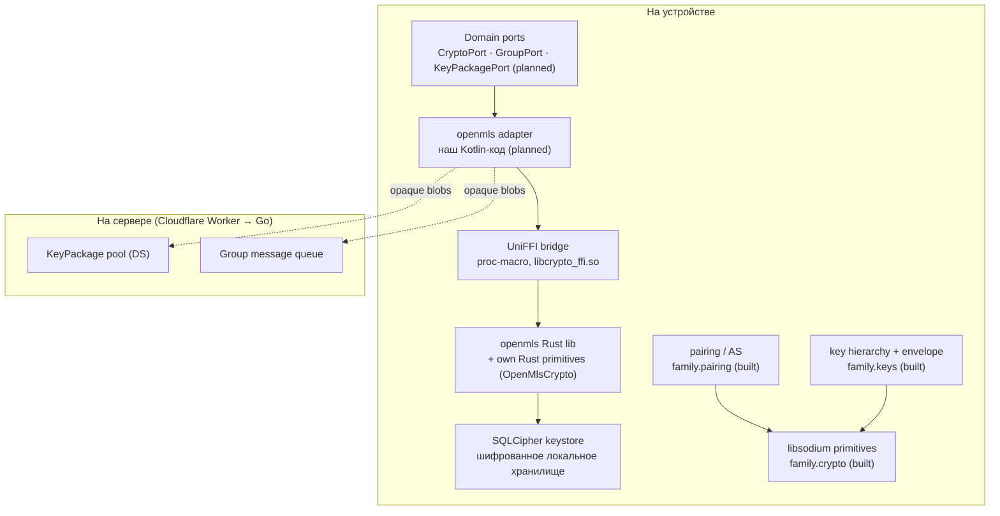

# Домен: Крипто — umbrella & zone map

**This file is the router for the crypto domain.** It owns the zone map and the routing table; the *architecture* of each zone lives in its own file (below). Precedence: on any single topic, the zone's own file wins; versioning is owned by [`wire-format.md`](wire-format.md); server endpoints by [`server.md`](server.md). Change the map → update this file in the same commit. The `crypto` skill is a thin router over this file — never a second copy.

<!-- AI-TLDR:BEGIN — READ THIS FIRST. If you can answer from this block, STOP. -->

## AI TL;DR

**What we protect**: E2E-encrypted family communication (config sync MVP → messenger + photo album Phase-3+). The server sees only opaque envelopes. Forward secrecy + post-compromise security via the MLS ratchet.

**THE BEACON — the layering (do NOT re-decide)**: crypto is **layers, each knowing only what it may**. Primitives (bytes math) ← key hierarchy (what keys are *for*) ← protocols (pairing, MLS group). Two primitive stacks coexist across the FFI border: **Kotlin libsodium** (built) and **openmls's own Rust primitives** (planned) — they are NOT unified.

## Zone map (the one table to read)

| Zone | File | Status | Contract source |
|---|---|---|---|
| **Primitives** (`family.crypto`) | [`crypto-primitives.md`](crypto-primitives.md) | **built** | the file |
| **Key hierarchy** (`family.keys`) — root key, HKDF, envelope, recovery vault | [`crypto-key-hierarchy.md`](crypto-key-hierarchy.md) | **built** | the file |
| **Pairing / membership = AS** (`family.pairing`) — binding + revoke policy | [`crypto-pairing.md`](crypto-pairing.md) | **built** (Kotlin); handshake `snow` planned | the file + TASK-102 Decision block |
| **MLS core** — TreeKEM, epochs, KeyPackage *format* | *no file yet* | **designed, not built** (0 code) | **TASK-124** + TASK-104 Decision block |
| **KeyPackage lifecycle = DS** — pool/claim/last-resort/drain | *no file yet* | **designed, not built** | **TASK-104** Decision block |
| **FFI** (`:crypto-ffi`, `libcrypto_ffi.so`) — dumb bridge | *summary below* | **foundation done** (TASK-122) | this file |
| **Wire / versioning** (`:core:wire`) | [`wire-format.md`](wire-format.md) | **built** | wire-format.md |
| **Extraction** (crypto → shared module) | [`extraction-policy.md`](extraction-policy.md) | policy | extraction-policy.md |

For zones marked **designed, not built**: their contract is the `### Decision (English)` block of the owning task — read it. The mermaid/prose that predated this consolidation is secondary and may be stale.

**Two primitive stacks (do NOT unify)**: Kotlin libsodium primitives serve key hierarchy / envelope / recovery / pairing. **MLS does NOT use them** — openmls carries its own Rust crypto backend (`OpenMlsCrypto` provider) below the FFI bridge. Wire core-crypto ships exactly this shape.

**FFI zone (compact)**: `:crypto-ffi` = UniFFI (proc-macro 0.28, **no .udl**) + cargo-ndk; native lib `libcrypto_ffi.so`. The bridge is dumb — no crypto logic, no policy (libsignal/Wire pattern). Foundation is a `hello`/`panics` smoke test (TASK-122). Panic contract guarded by skill [`crypto-ffi-panic-check`](../../.claude/skills/crypto-ffi-panic-check/SKILL.md). Exit ramps (manual JNI, cbindgen) — details in that skill's referenced material.

**Frozen decisions**: MLS TreeKEM > Sender Keys (post-compromise security, TASK-58). openmls `=0.8.1` > mls-rs (audit + license). UniFFI > manual JNI. SQLCipher storage provider. Primary-user device = sole MLS Commit signer (TASK-102). KeyPackage defense = cap+dedup+last-resort (TASK-104). Signal-style no-history MVP (TASK-100).

**Rejected (do not re-litigate)**: SGX; own ECDH; own MLS wire format; access-grant envelope-per-recipient; unifying the two primitive stacks; `mls-kotlin` (hobby); `libsignal` (AGPL); `matrix-rust-sdk` (Apache-2.0 — NOT a license reject; the Matrix homeserver must see the membership graph → breaks rule 13, and Megolm lacks PCS while Matrix itself migrates to MLS — see [`messaging.md`](messaging.md)); `CoreCrypto`/`Kalium` (GPL). See §Rejected.

**Domain ports** (rule 1): `CryptoPort`, `GroupPort`, `KeyPackagePort` (all PLANNED — 0 code, TASK-123). Built ports live in the zone files. `IdentityVault`/`KeyVault` is NOT built and NOT finally decided — TASK-112.

**Routing for the AI**:
- Primitive / algorithm question → [`crypto-primitives.md`](crypto-primitives.md).
- Key / envelope / recovery → [`crypto-key-hierarchy.md`](crypto-key-hierarchy.md).
- Pairing / binding / revoke → [`crypto-pairing.md`](crypto-pairing.md) (+ TASK-102 Decision block).
- MLS / KeyPackage → **STOP**, read the owning Decision task (TASK-124 / TASK-104) — do not improvise; zone is not built.
- Versioning → [`wire-format.md`](wire-format.md). Server endpoints → [`server.md`](server.md). Extraction → [`extraction-policy.md`](extraction-policy.md).
- Implementation order → `backlog sequence list --plain` (NOT this file — rule 11).
- Pre-release / roadmap → [`../dev/crypto-prerelease.md`](../dev/crypto-prerelease.md).

<!-- AI-TLDR:END -->

## Component inventory map

Legend: **K1/K2/P1 = built Kotlin zones** (see their files). **C1–C5 = MLS path, planned** (TASK-123/124/125). MLS runs on **C4's own Rust primitives**, not K1.

## Decision index (status snapshot)

Machine-readable contract = the `### Decision (English)` block in each task file. Downstream feature-tasks add `dependencies: [TASK-N]`.

| Task | Title | Status | Кратко |
|---|---|---|---|
| TASK-57 | Zero-Knowledge Server Architecture audit | Draft | Server sees opaque blobs + Ed25519 sigs only; no ACL graph, no eventType. Revises server.md snapshot. Blocks TASK-59/60. |
| TASK-58 | MLS library formal choice | Done — superseded→104 | MLS > Sender Keys; openmls > mls-rs (exit ramp). |
| TASK-59 | Recovery vault anti-brute-force research | Draft | SVR vs OPAQUE vs HMAC. Blocks recovery vault wire format. |
| TASK-60 | Push payload encryption + FCM 4KB | Draft | Encrypted payload under 4KB. Blocks push-based features. |
| TASK-100 | History backup strategy | Done | MVP Signal-style; Phase-3+ opt-in backup. |
| TASK-101 | Peer confirmation on recovery | Draft (decided) | Auto-add + post-facto notification; multi-device first-class. |
| TASK-102 | MLS revoke policy | Draft (decided) | Primary-user device sole signer; profile-edit + reconciliation. |
| TASK-103 | Remote app lock for stolen device | Draft (decided) | Full logout + Keystore wipe = crypto defense. |
| TASK-104 | KeyPackage rate limit | Draft (accepted 07-03) | Pool cap + claim dedup + last-resort. 4 preset fields. |
| TASK-105 | Server-side abuse defense baseline | Draft (decided) | Zero-trust posture, rule 12. |
| TASK-106 | Sybil resistance / signup gate | Draft (decided) | LOCAL-first identity; QR pairing = cloud gate. |
| TASK-108 | Metadata privacy | Draft (decided) | T0 MVP; opaque ports for T1 adapter swap. |
| TASK-110 | Client-side media transformation | Draft (decided) | Compress + EXIF strip + resize before encrypt. |
| TASK-111 | Signed upload tokens + quotas | Draft (NOT decided) | R2 presigned + DO counter. 100 MB quota. |
| TASK-112 | KeyVault port boundary | Draft (decided) | `KeyVault` port + `Purpose` enum + sealed exceptions. NOT built. |
| TASK-114 | Encrypted co-admin display directory | Draft (NOT decided) | Multi-admin display names without metadata leak. |
| TASK-115 | Family app onboarding chain | Discussion | Symmetric trusted anchors via Install Referrer. Blocks messenger. |
| TASK-116 | Iconic pairing challenge component | Discussion | Deterministic SVG icons, N-of-3 SAS challenge. |
| TASK-117 | Universal attestation mechanism | Discussion | Mechanism-only; attestor signs claim, verifier checks. |
| TASK-122–125 | F-CRYPTO implementation chain | Draft | Rust FFI → ports+fakes → openmls → SQLCipher. |

## Rejected alternatives (do not re-litigate)

- ❌ SGX enclave; ❌ own ECDH handshake (use `snow`); ❌ own MLS wire format (RFC 9420 conformance for MIMI interop); ❌ access-grant + envelope-per-recipient (superseded by MLS membership); ❌ unifying the two primitive stacks.
- ❌ Libraries: `mls-kotlin` (hobby), `libsignal` (AGPL), `matrix-rust-sdk` (Apache-2.0 — NOT a license reject; the Matrix homeserver must see the membership graph → breaks rule 13, and Megolm lacks PCS while Matrix itself migrates to MLS — see [`messaging.md`](messaging.md)), `CoreCrypto`/`Kalium` (GPL).
- ❌ Multi-app: `android:sharedUserId` (removed Android 13), `MODE_WORLD_READABLE`, one server master key, iCloud Keychain cross-app.
- ❌ External paid crypto audit pre-ship — replaced by fitness tests + threat model + agent-audit (see [`../dev/crypto-prerelease.md`](../dev/crypto-prerelease.md) A4).

## Terminology mapping (old → current)

| Old | Current | Where |
|---|---|---|
| `stableId` | `identity_id = hash(root_public)` | TASK-106 |
| `mls-rs` (main) | `openmls` (main), `mls-rs` (exit ramp) | frontmatter |
| Google Sign-In at first launch | LOCAL identity, lazy cloud upgrade at pairing | TASK-106 |
| Peer-admin MLS Remove kick | primary-user device sole executor + reconciliation | TASK-102 |
| `cryptokit.*` namespace | `family.*` | TASK-141 |
| Noise XXpsk3 | Noise_XX (`snow`) | TASK-67 |

## Related domains

- [`crypto-primitives.md`](crypto-primitives.md) · [`crypto-key-hierarchy.md`](crypto-key-hierarchy.md) · [`crypto-pairing.md`](crypto-pairing.md) · [`extraction-policy.md`](extraction-policy.md) · [`wire-format.md`](wire-format.md) · [`server.md`](server.md)
- Messenger substrate that *consumes* this crypto (MLS group, KeyPackage, pairing): [`messaging.md`](messaging.md) — crypto is owned here, not re-decided there.
- Operational: [`../dev/crypto-prerelease.md`](../dev/crypto-prerelease.md) · [`../dev/key-hierarchy.md`](../dev/key-hierarchy.md) · [`../dev/server-roadmap.md`](../dev/server-roadmap.md)
- Onboarding: [`INDEX.md`](INDEX.md)
