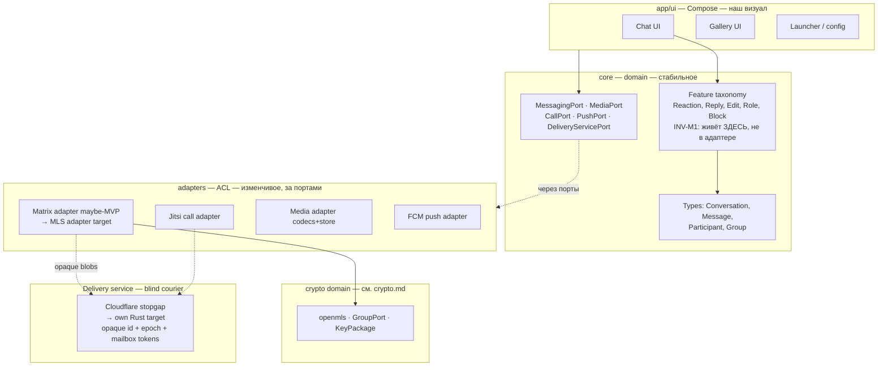

# Домен: Messaging — umbrella & the cutting

**This file is the router for the messaging domain.** It owns the substrate model, the port cutting, the build-vs-buy map, and the routing table. Precedence: **crypto** (MLS, keys, primitives) is owned by [`crypto.md`](crypto.md) and is NOT re-decided here; **versioning** by [`wire-format.md`](wire-format.md); **server endpoints** by [`server.md`](server.md). Change the map → update this file in the same commit. The `messaging` skill is a thin router over this file — never a second copy.

<!-- AI-TLDR:BEGIN — READ THIS FIRST. If you can answer from this block, STOP. -->

## AI TL;DR

**What we build**: an E2E-encrypted family **messenger** — chat + calls + message features, on an MLS transport substrate through a blind server. **This domain is the messenger ONLY.** The earlier framing "launcher = reduced messenger / one pipe, three faucets" was **wrong** and is retired: config-sync and the messenger do NOT share a substrate — they share only [`crypto.md`](crypto.md) primitives + the zero-knowledge principle. Two distinct sibling domains live elsewhere: **config-sync** = domain [`ecs.md`](ecs.md) on a *different* mechanism (envelope-per-recipient + Firestore, already built); **gallery/album** = domain [`gallery.md`](gallery.md) owning the media mechanism (`MediaPort`). Messenger, config-sync, gallery are **distinct consumers over shared crypto**, not faucets on one pipe.

**THE BEACON — the cutting (do NOT re-derive; this is what prevents a rewrite)**: isolate the **volatile** behind ports, keep the **stable** in the domain.

| Stable (domain — never rewritten) | Volatile (behind a port — swappable) |
|---|---|
| `Conversation`, `Message`, `Participant`, `Group`, ids | **Transport**: Matrix (maybe MVP) → MLS — `MessagingPort` |
| **Feature taxonomy** (reactions, replies, edits, roles, blocks) as OUR typed messages | **Server**: Cloudflare stopgap → own Rust — `DeliveryServicePort` |
| Product rules (who may kick, how a reaction renders) | **Calls**: Jitsi — `CallPort` |
|  | **Media** codecs + blob store — `MediaPort`; **Push**: FCM — `PushPort` |

**Invariants (INV-M1…M5 — do NOT violate, see §Invariants):**
- **INV-M1 (the anti-rewrite cut)**: **feature taxonomy lives in the DOMAIN, adapters only marshal.** A reaction is our `Reaction(targetId, emoji)` — the Matrix adapter translates it to a Matrix event, the MLS adapter to an MLS app-message. Implementing a feature *as* a vendor event type inside an adapter = every feature must be rewritten on transport swap. Never do it.
- **INV-M2 (this substrate is the messenger's, not the ecosystem's; media by reference)**: `MessagingPort` carries opaque payload → opaque recipient-token list for the MESSENGER only (chat/calls/features). It is NOT the config-sync mechanism (envelope+Firestore, [`ecs.md`](ecs.md)). Rich media (voice/file/video) is content-key-encrypted into a blob store via the sibling [`gallery.md`](gallery.md) `MediaPort`, and only a *pointer* rides `MessagingPort` — never a 5 MB blob through the MLS ratchet.
- **INV-M3 (blind courier — rule 13)**: the server sees only an **opaque group id + integer epoch + opaque mailbox tokens**. No content, no identities, no relationships, zero crypto ops. **App (chat) messages are NOT ordered by the server** — the client sorts by an inner counter; **only Commits (group changes) are serialized** — one per epoch per group, an integer compare on the outside of a sealed blob.
- **INV-M4 (crypto not re-decided here)**: MLS / openmls / KeyPackage / pairing are owned by [`crypto.md`](crypto.md). Messaging *consumes* `GroupPort` / `CryptoPort` / `KeyPackagePort`.
- **INV-M5 (volatile behind ports, rule 8 exit ramps)**: every swappable choice (transport, server, calls, media, push) sits behind a port with an inline `TODO(exit-ramp)`; migration = new adapter, not rewrite.
- **INV-M6 (transport-kind discriminator — the public-groups seam)**: a `Conversation` carries a **kind** (`private-e2e` vs future `public-broadcast`) so `MessagingPort` routes to the right adapter. The domain/wire must NOT assume "every conversation is an MLS group on the blind server" — that assumption lives inside the private adapter only. This is the one-way-door cut that keeps public groups additive (see §Public groups).

**Zone map (the one table to read)**

Every zone's truth lives IN its file (the `ecs.md` standard) — never "see a task". Tasks are named only as history/owners.

| Zone | File (the SoT — read it) | Status | Build-vs-buy |
|---|---|---|---|
| **Substrate** (`MessagingPort`, envelope, ordering, mailbox) | [`messaging-substrate.md`](messaging-substrate.md) | designed | 🟢 openmls + 🔴 own delivery |
| **Features** (reactions/replies/edits/roles/blocks/receipts) | [`messaging-features.md`](messaging-features.md) | designed | 🟡 thin app-logic, copy Matrix/MIMI taxonomy |
| **Delivery** (blind-courier server, `DeliveryServicePort`) | [`messaging-delivery.md`](messaging-delivery.md) | designed | 🔴 own Rust (CF stopgap) |
| **Calls** (Jitsi SFU + SFrame/MLS media keys, `CallPort`) | [`messaging-calls.md`](messaging-calls.md) | designed | 🔴 adopt SFU + media-key glue |
| **Group crypto** (MLS, KeyPackage, pairing) | [`crypto.md`](crypto.md) zone map | designed/built per zone | 🟢 openmls (MIT) |
| **Versioning** of every wire shape | [`wire-format.md`](wire-format.md) | rules | — |

**Sibling domains (consumed, NOT messaging zones — do not absorb them here):** media/gallery → [`gallery.md`](gallery.md) (`MediaPort`; chat attachments consume it) · location/SOS/safety → [`safety.md`](safety.md) (`LocationPort`; message shapes in messaging-features) · config-sync → [`ecs.md`](ecs.md) (envelope+Firestore, a *different* mechanism) · identity/registration/profile/contacts → the identity domain (TASK-106; identity.md pending) + [`crypto-pairing.md`](crypto-pairing.md). See §Cross-cutting.

Each zone file is self-sufficient (AI-TLDR + invariants + build-vs-buy + industry grounding with URLs + Rejected). The umbrella owns only what is cross-zone: the cutting, the open transport decision (§Open), and routing.

**Build-vs-buy in one breath**: 🟢 *import* — MLS crypto (openmls MIT), server frameworks (axum/tokio/sqlx MIT/Apache), media codecs (Opus/VP8/VP9 BSD), image (Coil/`image`), calls SFU (Jitsi/LiveKit Apache-2.0), SFrame (RFC 9605). 🟡 *thin app-logic, copy a spec* — all message features + group governance + search + file transfer. 🔴 *heavy* — voice/video calls, the delivery server itself, multi-device (per-user↔N-leaves) state. **There is no per-feature SDK marketplace**; reusable assets are only (a) infra libs and (b) published spec-taxonomies.

**Frozen decisions (TASK-148 Decision block)**: messenger-as-core substrate; facade over transport (Matrix maybe-MVP → MLS target); feature taxonomy in domain not adapter; blind courier server (rule 13); own Rust server is the target (Cloudflare rule-8 stopgap); clean-room from published blueprints only.

**Rejected (do not re-litigate)**: Matrix homeserver as permanent backend (leaks membership graph — rule 13); Matrix/Megolm crypto (no PCS; Matrix itself migrating to MLS); AGPL code adoption (Phoenix/Wire — copyleft breaks commercial model); sacrificing PCS (MLS gives it free via Remove+Commit); sacrificing rule 13 (Phoenix shows metadata-blind MLS server is achievable); big blobs through the group ratchet; feature-as-vendor-event-type in the adapter (INV-M1). See §Rejected.

**Ports (rule 1 — all PLANNED, 0 code)**: `MessagingPort`, `DeliveryServicePort`, `CallPort`, `PushPort` (+ consumed: `MediaPort` from [`gallery.md`](gallery.md); `GroupPort`/`CryptoPort`/`KeyPackagePort` from [`crypto.md`](crypto.md)).

**Routing for the AI**:
- Substrate / `MessagingPort` / envelope / ordering / mailbox → [`messaging-substrate.md`](messaging-substrate.md).
- A message feature (reaction, reply, edit, role, block, receipt) → [`messaging-features.md`](messaging-features.md).
- Server / delivery / KeyPackage directory / push routing → [`messaging-delivery.md`](messaging-delivery.md) (baseline: [`server.md`](server.md)).
- Calls / voice / video / SFU → [`messaging-calls.md`](messaging-calls.md).
- Media / gallery / photos / voice / files / video / stickers → [`gallery.md`](gallery.md) (sibling domain).
- Location / live-location / SOS / emergency → [`safety.md`](safety.md) (sibling domain; message shapes in [`messaging-features.md`](messaging-features.md)).
- Public groups / channels / discoverable / search → §Public groups below (a separate architecture; only the seam is preserved now).
- Config-sync (launcher state) → [`ecs.md`](ecs.md) — a *separate* domain/mechanism, NOT this substrate.
- Identity / registration / profile / contacts → the identity domain (TASK-106; identity.md pending) + [`crypto-pairing.md`](crypto-pairing.md).
- Multi-device / history / presence → §Cross-cutting below.
- Anything crypto (MLS, keys, pairing, KeyPackage) → **STOP**, [`crypto.md`](crypto.md) — not re-decided here.
- Versioning → [`wire-format.md`](wire-format.md).
- The open transport decision (Matrix MVP vs MLS) → §Open below (stated completely here, not in a task).

<!-- AI-TLDR:END -->

## Component inventory map



Legend: **domain = stable** (types + feature taxonomy + ports). **adapters/server = volatile**, behind ports. Crypto is a **separate owned domain** ([`crypto.md`](crypto.md)), consumed via ports.

## Invariants (decided — do NOT re-derive; changing one is a `decision-supersedes` task)

- **INV-M1 — feature taxonomy lives in the domain, adapters only marshal.** The single cut that prevents a rewrite on transport swap. Symptom of violation: a `Reaction`/`Reply` type that references a Matrix event JSON or an MLS frame *inside the domain*, or a feature implemented only inside the Matrix adapter. (Grounding: Matrix/MIMI define features as spec taxonomies interpreted by the client — the taxonomy is reusable, the vendor wire is not.)
- **INV-M2 — this substrate is the messenger's, not the ecosystem's; media by reference.** `MessagingPort` serves chat/calls/features only. Config-sync is a separate mechanism ([`ecs.md`](ecs.md): envelope + Firestore). Media blobs go via the sibling [`gallery.md`](gallery.md) `MediaPort` + a pointer message; big blobs never ride the ratchet. (Grounding: Signal/Matrix/WhatsApp encrypt media with a content key in a blob store and send the reference.)
- **INV-M3 — the server is a blind courier (rule 13).** Opaque group id + integer epoch + opaque mailbox tokens; zero crypto, zero content, zero relationships. App messages loose-ordered (client sorts); only Commits serialized one-per-epoch. (Grounding: RFC 9420 requires one Commit per epoch; RFC 9750 assumes an *untrusted* DS; Phoenix shows the DS can be identity- and graph-blind.)
- **INV-M4 — crypto is owned by `crypto.md`, not re-decided here.** Messaging consumes `GroupPort`/`CryptoPort`/`KeyPackagePort`.
- **INV-M5 — volatile choices behind ports with rule-8 exit ramps.** Transport, server, calls, media, push — each an adapter swap, never a rewrite; inline `TODO(exit-ramp)` / `TODO(server-roadmap)`.

## Build-vs-buy catalog (condensed — full novice walkthrough in TASK-148 Session 1)

**The headline truth**: most messenger "features" have NO ready library anywhere — they are "a typed message pointing at another message id + a render rule". Reusable assets are only two piles: **infra libs** and **published spec-taxonomies**.

| Capability | Verdict | Source |
|---|---|---|
| MLS group crypto | 🟢 import | openmls (MIT) — via `crypto.md` |
| Own server stack | 🟢 import frameworks | axum + tokio + sqlx + PostgreSQL (MIT/Apache) |
| Voice codec / image / video codecs | 🟢 import | Opus (BSD), Coil (Apache), `image`, libvpx VP8/VP9 (BSD — avoid x264/x265 GPL) |
| Voice/video calls | 🔴 adopt SFU + glue | **Jitsi** (Apache-2.0); E2E via SFrame (RFC 9605) + MLS keys (design from Discord DAVE) |
| Reactions, replies, threads, edits, delete, forward, mentions, receipts, typing, pin | 🟡 thin app-logic | copy **Matrix event relations** (MSC2674-2677) + **MIMI content** draft → put type in DOMAIN |
| Roles, admin-block/kick/mute, invite-by-link | 🟡 thin app-logic | MLS enforces none (RFC 9750 §3.5); copy **Matrix power-levels** + **MIMI room-policy** draft |
| Message search | 🟡 client-side only | SQLite FTS5 / Tantivy on device (server is blind) |
| Multi-device (user ↔ N leaves) | 🔴 substantial custom | pattern = Signal **Sesame**; no lib exists |
| The delivery server itself | 🔴 substantial custom | assemble frameworks + write handlers from **Phoenix** published design (AGPL code — read docs, not repo) |
| Push | 🟢 import | FCM data-only wake-ping (opaque) |

## Copyable architecture blueprints (clean-room — read the SPEC, never the AGPL code)

The reusable *design* (legal to reimplement; copyright protects code, not architecture):
- **RFC 9750** (MLS Architecture) — the skeleton: AS/DS split, client model, security goals. https://www.rfc-editor.org/rfc/rfc9750.html
- **RFC 9420** (MLS Protocol) — group crypto, epochs, Remove+Commit re-key. https://www.rfc-editor.org/rfc/rfc9420.html
- **Phoenix R&D specs** (docs.phnx.im) — the most complete MLS-native messenger design (DS/QS/AS/federation/threat-model, metadata-minimizing). Code is AGPL — reimplement from the docs only. https://docs.phnx.im/spec.html · SRLabs audit: https://srlabs.de/
- **Signal specs** — the plumbing patterns: Sesame (multi-device), Sealed Sender (metadata privacy), X3DH/PQXDH (prekey ≈ KeyPackage directory). https://signal.org/docs/specifications/
- **IETF MIMI drafts** — feature taxonomy + federation on MLS: `draft-ietf-mimi-content`, `draft-ietf-mimi-room-policy`, `draft-ietf-mimi-protocol`. https://datatracker.ietf.org/wg/mimi/
- **Matrix spec** — event relations taxonomy + key-backup/SSSS ideas (crypto lineage differs — mine the taxonomy, not Megolm). https://spec.matrix.org/
- **Discord DAVE** — MLS→SFrame media-key design for calls. https://daveprotocol.com/

Caveat: `docs.phnx.im` blocks bots — open in a browser; verify exact wording at implementation time.

## Rejected alternatives (do not re-litigate)

- ❌ **Matrix homeserver as permanent backend** — must see the membership/social graph to route + resolve room state; structurally breaks rule 13 (refuse patterns 21/22/23). Fine only as a throwaway MVP prototype behind the facade.
- ❌ **Matrix Olm/Megolm crypto** — no post-compromise security; Matrix itself is migrating to MLS (MSC4244/4256). We are already at the target.
- ❌ **AGPL code adoption** (Phoenix `air`/`infra`, Wire `wire-server`/`core-crypto`/`kalium`) — network-copyleft breaks the commercial subscription model (same reason libsignal/Wire were rejected in `crypto.md`). Reuse their *published design*, never their code.
- ❌ **Sacrificing PCS "for simplicity"** — unnecessary; MLS Remove+Commit self-heals natively (the stolen-phone scenario, TASK-103).
- ❌ **Sacrificing rule 13** — unnecessary; Phoenix proves an identity- and graph-blind MLS delivery service is achievable.
- ❌ **Big media blobs through the MLS group ratchet** — encrypt with a content key into a blob store, send a pointer (INV-M2).
- ❌ **Feature implemented as a vendor event type inside the adapter** — forces rewrite of every feature on transport swap (INV-M1).
- ❌ **Janus (GPLv3) for calls; FFmpeg with x264/x265 (GPL)** — copyleft traps; use Jitsi/LiveKit (Apache-2.0) + libvpx/libopus (BSD).

## Cross-cutting concerns & sibling domains (the coverage the zones don't each own)

These span zones or live in a sibling domain — captured here so nothing is re-derived.

- **Multi-device (one user ↔ N devices).** 🔴 substantial custom; no library (pattern = Signal **Sesame**). Ownership is split, by design: **crypto** owns "a device = an MLS leaf; removing a device is a Remove+Commit re-key" ([`crypto-pairing.md`](crypto-pairing.md) revoke, TASK-102); **identity** owns the "user ↔ its devices" mapping (identity domain, TASK-106; identity.md pending); the **substrate** owns syncing the same user's devices via their mailboxes ([`messaging-substrate.md`](messaging-substrate.md)). No single zone owns it — this bullet IS its home. Each device holds its own keys (per-device identity), consistent with [`crypto-primitives.md`](crypto-primitives.md).
- **History / backup.** Decided: **MVP = Signal-style, no history restore on a new device** (TASK-100, owned by [`crypto.md`](crypto.md) decision index). Forward secrecy deletes keys; the app keeps a local plaintext copy for its own history (OpenMLS note). Exit ramp: Phase-3+ opt-in E2E backup (HIST-BACKUP-001) — additive, behind a future `HistoryBackup` port.
- **Identity / registration / profile / contacts.** NOT a messaging concern — owned by the identity domain (TASK-106; identity.md pending) (model, signup gate, JWT) + [`crypto-pairing.md`](crypto-pairing.md) (QR pairing = the Authentication Service, identity↔key binding). The messenger **consumes** these; it does not re-decide them. Profile (name/avatar) is identity-domain metadata.
- **Presence (online / last-seen).** Deferred and questioned — it is **metadata** the blind server should not learn (rule 13) and often better served as an in-app indicator than a broadcast (rule 10). Not built; see OQ-4.
- **Personal block (a user blocks another user).** A governance feature — lives in [`messaging-features.md`](messaging-features.md) alongside admin-block/mute (client-side filter + optional Remove if in a shared group).
- **Config-sync (launcher state).** A **separate domain** — [`ecs.md`](ecs.md) — on a *different* mechanism (envelope-per-recipient via `ConfigCipher2` + Firestore, already built). It is NOT on this substrate; do not fold it in.

## Public groups / channels — private now, additive later (the one-way-door seam)

**Verdict (researched, do NOT re-derive)**: public discoverable groups/channels are **a second, different architecture** — NOT "the same primitives on top". You **cannot** run them on MLS + the blind server, because:
- **MLS does not scale to public sizes** — RFC 9420 targets closed groups "two to many thousands"; sequential one-Commit-per-epoch + a tree linear in membership + read-mostly (worst case for TreeKEM) make public channels of millions infeasible.
- **Discoverable/searchable REQUIRES the server to see + index content** — you cannot search what you cannot read. This is inherently the OPPOSITE of the blind zero-knowledge server (rule 13). Every real system confirms it: Telegram channels, WhatsApp Channels, Matrix public rooms are all **not E2E, server-stored, server-indexed**; Signal has **no** public groups by design. Public content is not secret, so losing E2E there is acceptable — but it means a **content-visible server**, a different posture.

So public = **content-visible server + search index + broadcast/fanout + CDN + moderation** — the architectural inverse of the private stack.

**What reuses (private ↔ public) — the boundary:**
- ✅ **Identity/Ed25519** (same signer authenticates a private Commit and a public post), **client domain types** (`Conversation`/`Message`/`Participant`, if transport-agnostic), **feature-taxonomy shape** (INV-M1 — a reaction is a domain concept, transport-independent), **media mechanism** ([`gallery.md`](gallery.md)), **infra libs** (axum/tokio/sqlx/Postgres = same toolkit for the content server).
- ❌ **MLS group-key agreement, the blind server (rule 13), zero-knowledge on content, per-message E2E, the opaque-mailbox delivery model** — none extend to public.

**The one-way-door cut to protect NOW (mostly already made — do NOT regress):**
- Keep `Conversation`/`Message`/taxonomy/media **transport-agnostic** (INV-M1/M2 already do this).
- **Add a `Conversation.kind` / transport discriminator** (`private-e2e` vs `public-broadcast`) so the `MessagingPort` facade routes to the right adapter. This is the single field that must exist (INV-M6).
- **Never let MLS/blind-server assumptions leak into the domain or wire formats** — no MLS group state, epoch, or mailbox token as a *domain* field (they live inside the private adapter only).

If the cut holds, adding public later = **one new `PublicBroadcastAdapter` behind `MessagingPort` + a content server + a search index** — additive, not a rewrite. Search index (permissive): **Tantivy (MIT)** to embed, or **Meilisearch CE (MIT)** standalone; ❌ **Typesense (GPL-3)** (copyleft). Owner: a future public-spaces task (do NOT design it now — only preserve the seam).

**Frame for the owner: one messenger domain, two delivery worlds.** Private = sealed courier (MLS + blind server). Public = a content platform (visible server + index + CDN). They share the *client's* identity, messages, reactions, and media — nothing of the *server or the encryption*.

## Open questions (stated completely here — do NOT defer to a task)

Per the `ecs.md` standard, open decisions live IN this file with options + criteria + current lean, not "see TASK-X".

- **OQ-1 — MVP transport: Matrix (Apache-2.0) vs go straight to MLS.** *Options*: (A) ship the MVP on a Matrix homeserver behind `MessagingPort`, migrate to MLS later; (B) build on MLS + own delivery from the start. *Criteria*: A wins if time-to-first-messenger dominates and Matrix's membership-graph leak + Megolm (no PCS) are acceptable for MVP; B wins if zero-knowledge is a shipped promise (clinic/B2B) and the delivery-glue effort (now known to be modest — [`messaging-delivery.md`](messaging-delivery.md)) is affordable. *Current lean*: B is the target regardless (MLS is where the industry, incl. Matrix, is going); A is only a throwaway prototype **if** validated behind the facade. *Cost the facade does NOT erase*: if A ships, Megolm history + Matrix identities do not auto-migrate ([`messaging-substrate.md`](messaging-substrate.md) §Data-migration honesty). *Owner*: TASK-27.
- **OQ-2 — strong metadata privacy for calls.** The SFU sees call participation (CL3). Deferred; owner TASK-27.
- **OQ-3 — upload tokens / quotas for media blobs.** Not decided; owner TASK-111 (see [`gallery.md`](gallery.md)).
- **OQ-4 — presence (online / last-seen): expose it at all?** *Options*: (A) none (privacy-max); (B) in-app indicator only (rule 10, no server broadcast); (C) server-observed presence (rejected — leaks metadata, rule 13). *Current lean*: A or B; C is out. Not built; owner TASK-27.

## Superseded / outdated decisions (marking convention)

When a decision here is replaced, do **not** delete it silently and do **not** leave a live reference to a moved/renamed target. Mark it:

```
> ⚠️ SUPERSEDED (YYYY-MM-DD): <old choice> → replaced by <new choice / file#section>. Reason: <one line>.
```

Move the superseded item into the zone's **Rejected** section (so the current body stays the single truth), and update every cross-reference in the same commit. A dangling arch-pack link (target file/section gone or renamed) or a live reference to a superseded choice is an integrity defect — caught by skill [`procedure-archpack-integrity`](../../.claude/skills/procedure-archpack-integrity/SKILL.md). Currently: none.

## Related domains

- Messenger zone files (each self-sufficient): [`messaging-substrate.md`](messaging-substrate.md) · [`messaging-features.md`](messaging-features.md) · [`messaging-delivery.md`](messaging-delivery.md) · [`messaging-calls.md`](messaging-calls.md).
- Sibling domains (consumed, NOT part of messaging): [`gallery.md`](gallery.md) (media/album, `MediaPort`) · [`safety.md`](safety.md) (location/SOS, `LocationPort`) · [`ecs.md`](ecs.md) (config-sync, separate mechanism) · the identity domain (TASK-106; identity.md pending) + [`crypto-pairing.md`](crypto-pairing.md) (identity/pairing).
- Consumed infra: [`crypto.md`](crypto.md) (MLS/keys — not re-decided here) · [`server.md`](server.md) (endpoint baseline rules 12/13) · [`wire-format.md`](wire-format.md) (versioning).
- Owner tasks (history, not truth): TASK-27 (messenger), TASK-100 (history decision), TASK-106 (identity), TASK-110/111 (media — in gallery.md). This SoT: TASK-148.
- Onboarding: [`INDEX.md`](INDEX.md).
