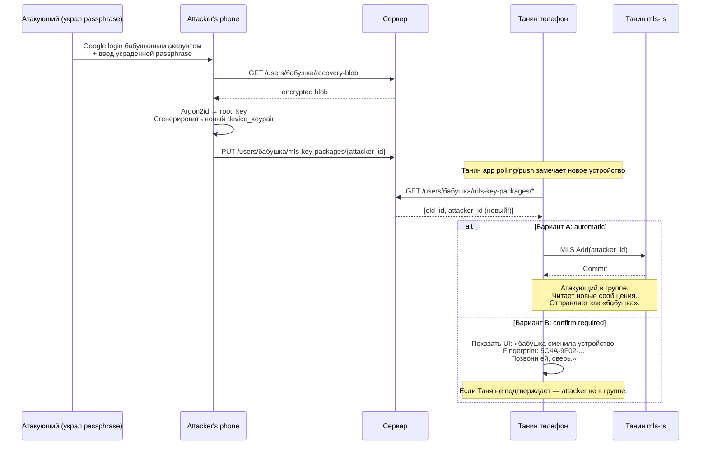

# Q-12: Peer confirmation при recovery peer'а

- **Status**: 🟡 in-discussion
- **Priority**: high
- **Blocks tasks**: TASK-6, TASK-25
- **Session-tag**: `theme-9-recovery-propagation`
- **Related decided**: Q-09 (см. [Блок 20](../crypto-mentor-overview.md#блок-20--history-backup-при-recovery-q-09-decision))
- **Session started**: 2026-07-02
- **Register entry**: [crypto-open-questions.md Q-12](../crypto-open-questions.md#q-12-peer-confirmation-при-recovery-peerа--automatic-trust-или-ux-confirm)

## Постановка задачи

Бабушка потеряла телефон и восстановилась на новом. Танин app **автоматически** видит новое устройство (новый device_pub появился в directory). Танин app должен решить — **сам** сделать `MLS Add(new_device)` или **спросить** Таню «это правда бабушка?».

Это **не** про то как бабушка себя аутентифицирует (это Q-01/Q-02 — passphrase + Google). Это про то, как **peer'ы** решают доверять новому устройству бабушки.

Прямая параллель — «Signal Safety Number changed» warning или «Matrix cross-signing».

---

## Часть A — Mentor карта темы

### A.1 Что за область

Trust decision при peer device rotation. В крипто-протоколах это называется **peer device change verification**. Ключевые прототипы: Signal Safety Number changed, Matrix cross-signing, WhatsApp security code changed, Apple Contact Key Verification.

### A.2 Карта темы

**Атакующий сценарий** (motivating case):

**Слои решения** (где это ложится в код):

- **Detection** (`core/` port `PeerDeviceMonitor`) — обнаружение новой KeyPackage у peer'а.
- **Policy engine** (`core/` port `RecoveryTrustPolicy`) — auto vs confirm vs deferred.
- **UI adapter** (`app/`) — fingerprint display, confirmation dialogs, notifications.
- **Audit log** (TASK-32) — фиксация «recovery detected at HH:MM, admin=Таня подтвердил / отклонил».

**Смежная тема — old-device notification**:

Даже если Таня auto-add'ит новое устройство, **старое** устройство бабушки может получить push «recovery на новом устройстве, это ты?». Если бабушка **реально** его потеряла — push уйдёт в никуда. Если атакующий украл passphrase но **не** телефон — старый бабушкин телефон получит push, она позвонит Тане: «отмени, это не я».

Это **CANDIDATE-1** из handoff'а («Recovery notification + Old-device invalidation») — та же тема.

### A.3 Главное для новичка

1. **MLS Add — это операция крипто-протокола, не UX.** Кто-то в группе (в нашем случае Таня как admin) обязан её выполнить. Вопрос — с confirmation'ом или без.
2. **Forward secrecy защищает прошлое** (Q-09 → нет истории после recovery). Атакующий с passphrase **не** прочитает старую переписку. Но **читает будущую** после Add.
3. **Fingerprint сверка** — стандартный крипто-инструмент (Signal Safety Number, Matrix device verification, WhatsApp security code). Отпечаток идентичности — 6-8 групп цифр, сверяется голосом.
4. **Реальные пожилые не сверяют fingerprint'ы**. WhatsApp показывает «Security code changed» — 99% пользователей игнорируют. Мы **admin**'ов заставляем, не end-user'ов. Разница.
5. **Три threat vector'а** для нашей аудитории (family launcher):
   - **Кража телефона + phishing passphrase** — редко, но случается.
   - **Семейный конфликт** (внук поругался с бабушкой, украл пароль) — реалистично.
   - **Social engineering** (мошенник по телефону выманил passphrase) — реалистично для пожилых.

   NOT в модели угроз: nation-state, targeted корпоративный шпионаж.

### A.4 Ключевые термины

- **KeyPackage** — «одноразовый пропуск» устройства в MLS. Содержит device_pub, identity_pub, подпись. Публично в directory. При recovery — публикуется новый.
- **Peer device rotation** — событие «peer сменил устройство». Может быть legit (recovery, upgrade) или атака.
- **Fingerprint / Safety Number** — hash от identity_pub. 6-8 групп цифр, показывается пользователю. Одинаковый на обоих устройствах → они одинаково видят identity.
- **Trust On First Use (TOFU)** — модель Signal/WhatsApp: доверяй первому ключу peer'а, warn при смене. Наш `TrustEdgeBootstrap` изначально работает по TOFU.
- **Cross-signing (Matrix)** — user имеет **master key**. Каждое его новое устройство подписывается master key. Peer'ы верифицируют master key **один раз**, дальше доверяют всем устройствам этого user'а автоматически.
- **Out-of-band verification** — сверка через **другой** канал (голос, SMS, встреча). Единственная защита от MITM с помощью манипуляции ключами.
- **Old-device notification** — push старому устройству «на новом устройстве произошло X». Detection механизм post-factum.

### A.5 Уточняющие вопросы (5 organic вопросов)

#### Q1. Насколько Таня технологически готова к fingerprint verification?

Кроме бабушки — есть ли у нас реалистичное ожидание что **admin** (обычно младший родственник, ~30-50 лет) способен:
- Прочитать 6-8 групп цифр по телефону бабушке.
- Понять концепт «если не совпадает — это опасно».
- Проверить в 30% случаев recovery (реалистичная частота смены устройств).

Или **и** admin слишком «нормальный пользователь» для такого UX?

**Зачем спрашиваю**: если ответ «нет, не готов» — Вариант B (confirmation with fingerprint) отпадает, идём в Вариант D (time-delayed) или E (old-device notification без confirm).

---

**Ответ владельца**:

> _(ожидание)_

---

#### Q2. Насколько важна **скорость recovery**?

Бабушка утеряла телефон, купила новый — через сколько времени она должна иметь работающий launcher со всеми контактами?
- **Немедленно** (~1 мин после входа в аккаунт): Вариант A automatic или C hybrid.
- **Через несколько минут** ждать admin confirmation: Вариант B.
- **24 часа delay ок** («настройка в течение суток»): Вариант D — auto с window'ом отмены.

**Зачем спрашиваю**: наш use case — пожилая одинокая бабушка, launcher как основной интерфейс. Час без launcher'а = час без возможности позвонить внукам. Скорость **критична для UX**, но может быть **приемлема** пожертвовать за safety.

---

**Ответ владельца**:

> _(ожидание)_

---

#### Q3. Что делает **старое** устройство бабушки при recovery?

Три возможных состояния:
- **A**. Утеряно / разбито / украдено → push уйдёт в никуда.
- **B**. Живо, у бабушки, но она recovery по ошибке начала (например повторно скачала app и Google login прошёл) → старое всё ещё работает, получит push.
- **C**. Живо, у attacker'а (украл телефон физически) → attacker увидит push.

**Ключевой вопрос**: **должен ли old-device revoke (kick старого устройства) быть автоматическим на recovery** или отдельной командой?

- Если автоматический — sensitive: если бабушка случайно recovery запустила → её текущий телефон умрёт → она в панике.
- Если ручной — attacker с physical access к старому телефону сможет продолжать читать сообщения одновременно с новым.

**Зачем спрашиваю**: это ещё одна дверь одновременно с trust decision.

---

**Ответ владельца**:

> _(ожидание)_

---

#### Q4. Модель «single admin» или «multi admin»?

- Если у бабушки **один** admin (только Таня) — Таня offline = никакого confirm. Нужен fallback.
- Если **несколько** admins (Таня + Петя + мама) — **любой** может confirm.

**Зачем спрашиваю**: определяет достижимость Варианта B в UX. Если реалистично что у бабушки 2-3 admin'а → Вариант B работает (кто-то онлайн всегда). Если только Таня → B ломается.

Также связан с Q-11 (revoke policy) — «кто может revoke» и «кто может confirm recovery» — часто симметричные операции.

---

**Ответ владельца**:

> _(ожидание)_

---

#### Q5. Готов ли ты платить UX-стоимость **невидимой безопасности** vs **явной**?

Два философских подхода:
- **Явная безопасность (Matrix, Signal)**: пользователь видит «Safety Number changed. Verify». Он должен что-то делать. Плюс — знает что происходит. Минус — 99% игнорируют, false sense of security.
- **Невидимая безопасность (Apple Passkey, Google Sign-in)**: система сама принимает решения на основе heuristic (тот же device? Тот же geo? Тот же network?). Плюс — не грузит user'а. Минус — magic, непрозрачно, false positives (пользователь путешествует → ban).

**Зачем спрашиваю**: определяет между Вариантами B (явная) и C/D (невидимая с fallback). Для family launcher скорее всего **невидимая с явным alert'ом на аномалии** — но подтверди.

---

**Ответ владельца**:

> _(ожидание)_

---

### A.6 Гипотеза рекомендации (до ответов)

**Наиболее вероятная рекомендация** — **Вариант D (time-delayed automatic) + Вариант E (old-device notification)**:

1. Recovery → auto-add new device в MLS через N часов (например, 24h) **если** старое устройство не отзвонилось «это не я».
2. Old-device получает push «recovery на новом устройстве, tap если не ты».
3. Все admins получают in-app notification «бабушка recovered — если знаешь это она, ничего не делай; если подозрительно — tap».
4. Таня может **ускорить** до немедленного добавления, tap «это точно бабушка, я знаю».

Это **CANDIDATE-1 из handoff** + time-delayed auto = **hybrid между Signal и Apple Passkey**.

Ответы Q1-Q5 подтвердят или скорректируют эту гипотезу.

---

## Часть B — Рекомендация, альтернативы, adjacent concerns

_(заполняется после ответов на Q1-Q5)_

### B.1 Sanity-check ответов

_(pending)_

### B.2 Best path

_(pending)_

### B.3 Альтернативы

_(pending)_

### B.4 Типичные ошибки

_(pending)_

### B.5 Что свериться в актуальных источниках

_(pending)_

### B.6 Adjacent concerns

_(pending)_

---

## Decision

_(заполняется при закрытии — переносится в mentor-overview как новая секция)_

## Related open questions

- Q-11 (revoke policy) — симметричная операция, часто one skill'ом.
- Q-14 (Durable Objects) — для detection push flood'а.
- Q-17 (abuse response) — false positive recovery events.
