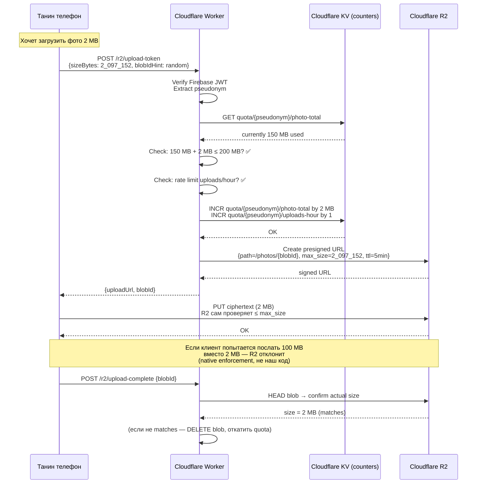
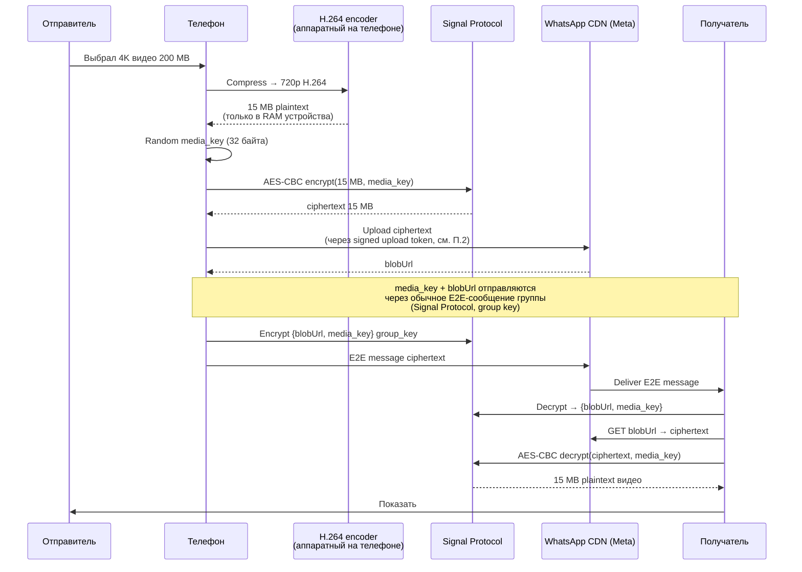
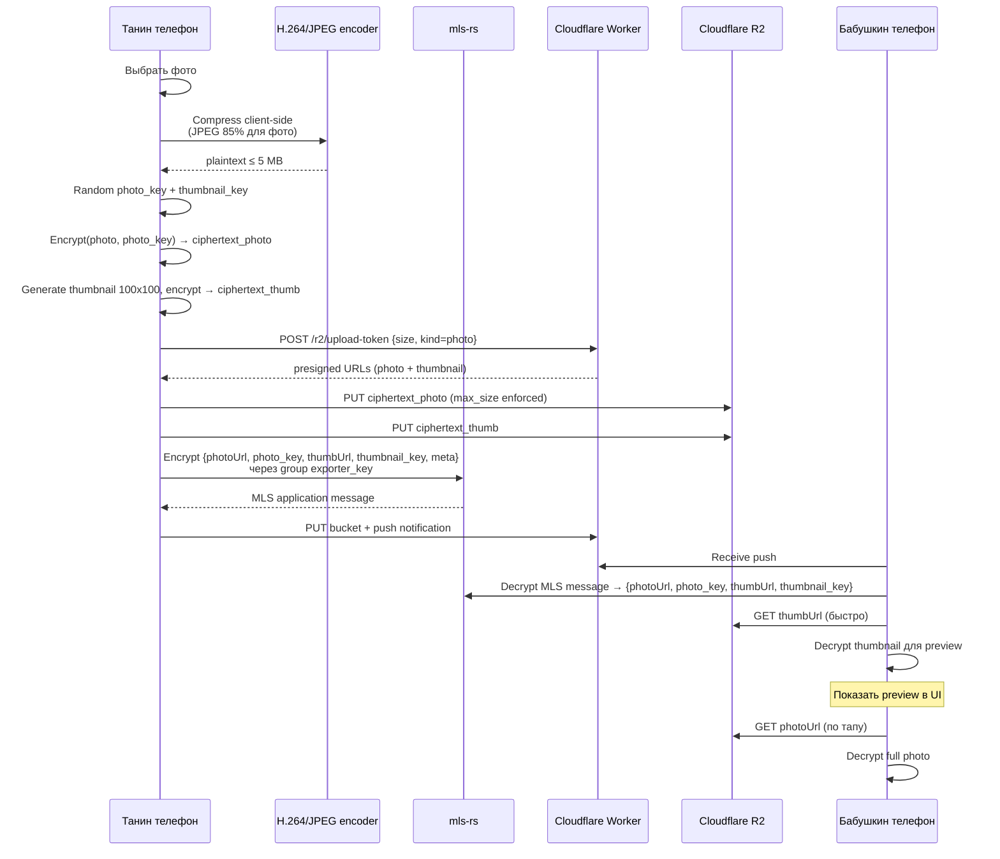

# Шифрование в проекте — обзор для новичка

> **⚠️ LEGACY DOCUMENT — DEPRECATED as authoritative SoT since 2026-07-02.**
>
> Начиная с [CLAUDE.md rule 11 revised (2026-07-02)](../../CLAUDE.md), архитектурные крипто-решения живут как **backlog-task'и** (`backlog/tasks/task-100+`) в статусах `Discussion` → `Draft` → `Done` с `### Decision (English)` блоками, не в этом файле.
>
> **Что делать fresh session'у**:
> 1. **Start here**: [`docs/dev/crypto-status.md`](crypto-status.md) — текущий статус + priority queue + next candidates.
> 2. **Architecture snapshot**: [`docs/architecture/crypto.md`](../architecture/crypto.md) — current stack, компоненты, сценарии.
> 3. **Model**: [CLAUDE.md rule 11](../../CLAUDE.md) — Discussion → Decision → Done workflow.
> 4. **Recent decisions**: `backlog/tasks/task-100..108` (см. crypto-status.md).
> 5. **Legacy content ниже** (Часть 0..Ρ) — читай **только** для понимания секций **ещё не мигрированных** в backlog-task'и.
>
> **Terminology mapping (old → current)**:
> - `stableId` → **`identity_id = hash(root_public)`** (не Google UID, не UUID from Google linking; per TASK-106).
> - `mls-rs` (library) → **`openmls`** (Rust, MIT, аудирован SRLabs; per docs/architecture/crypto.md).
> - Firestore paths `/users/{stableId}/*` → **opaque `OwnerRef`** через adapter (per TASK-108).
> - Google Sign-In at first launch → **LOCAL identity at first launch, cloud upgrade lazy** at first QR pairing (per TASK-106).
> - Peer-admin MLS Remove kick → **bab's device sole executor + profile reconciliation** (per TASK-102).
>
> **Superseded blocks (2026-07-06)** — заменены на pointer к current model:
> - Блок 1 (Первый запуск) → TASK-106.
> - Блок 2 (Pairing) → TASK-67 § Детали протокола.
> - Блок 3 (Второе устройство) → TASK-101.
> - Блок 4 (Формирование группы) → TASK-102 + docs/architecture/crypto.md Сценарий 2.
> - Блок 5 (Profile edit) → TASK-102 reconciliation.
> - Блок 6 (Recovery) → TASK-101 + TASK-6.
> - Блок 8 (Revoke) → TASK-102 + docs/architecture/crypto.md Сценарий 4.
>
> **Не мигрированные (частично содержат outdated tech references)**: Блок 7 (FCM push), Блок 9-10 (future messenger/album), Часть Δ Q&A, Часть Λ use cases catalog, Часть Ξ metadata privacy (базис для TASK-108), Часть Π anti-abuse, Часть Ρ client transformation, Блок 20 history backup (=TASK-100 Draft).
>
> **Что НЕ делать**:
> - ❌ Не расширять этот файл новыми секциями. Новые architectural decisions — новые decision-task'и в backlog.
> - ❌ Не считать секции этого файла окончательными.
> - ❌ Не создавать аналогичные `docs/dev/*-mentor-overview.md` файлы для других доменов.

**Аудитория:** владелец проекта, впервые разбирающийся в системном шифровании.

**Что здесь:** все места в приложении, где нужна крипта, разобранные простыми словами + диаграммы последовательностей. Никакого кода. Только принципы.

**Что НЕ здесь:** имплементационные детали, wire format, API портов — это в спеке и коде.

---

## Часть 0 — Разминка

### 0.1 Правила чтения

Читай по порядку. Каждый блок опирается на предыдущий. Диаграммы (Mermaid sequence) показывают **кто с кем разговаривает по шагам**.

Действующие лица в диаграммах:

| Обозначение | Кто это |
|---|---|
| **Ч** | Человек, живой пользователь |
| **Т** | Телефон человека (наше приложение) |
| **Т2** | Второе устройство того же человека |
| **С** | Сервер (Cloudflare Worker + Firestore) |
| **lib** | libsodium — «сейф с готовыми крипто-алгоритмами» |
| **snow** | snow — готовая библиотека рукопожатия |
| **mls** | mls-rs — готовая библиотека групп |

### 0.2 Аналогии для базовых понятий

Крипто мир полон терминов. Держи под рукой:

- **Паспорт человека** = **stableId** (уникальный номер, не меняется).
- **Пароль от сейфа** = **passphrase** (что человек помнит).
- **Домашний ключ** = **root key** (сам сейф, из которого рождаются все остальные ключи).
- **Личный автограф** = **identity key** (доказывает «это я как личность»).
- **Ключ от квартиры** = **device key** (принадлежит конкретному телефону).
- **Общая комната с замком** = **MLS group** (у всех членов свои пропуска, ключ комнаты общий).
- **Запечатанный конверт** = **envelope** (только адресат может открыть).
- **Ритуал знакомства** = **handshake** (два устройства впервые встречаются).
- **Список гостей квартиры** = **access-grant** (кому разрешено входить).
- **Личная записная книжка** = **TrustEdge** (мои имена для знакомых).

### 0.3 Наши инструменты и что они делают

Мы **не пишем крипту сами**. Мы **склеиваем три готовых инструмента**.

| Инструмент | Что делает | Кто ещё использует | Аналогия |
|---|---|---|---|
| **libsodium** | Готовые крипто-примитивы (шифрование, ключи, пароли) | Signal, WhatsApp, Wire — все | Швейцарский нож крипты |
| **snow** | Готовое рукопожатие (Noise Protocol) | WireGuard, WhatsApp companion | Ритуал знакомства «под ключ» |
| **mls-rs** | Готовые группы (MLS RFC 9420) | Wire мессенджер, AWS RCS для carriers | Комната с автозамками |

**Наш собственный код** — очень тонкий слой:
- Куда положить QR-код (Firestore).
- Что показать в UI («Введите пароль»).
- Как связать три библиотеки в осмысленную последовательность.

**Всё «страшное» (криптография) делают чужие библиотеки.** Мы только оркестрируем.

---

## Блок 1 — Первый запуск. Рождение личности

> **⚠️ Superseded by current model 2026-07-06** — этот block описывал Google Sign-In + `stableId` (UUID from Google identity linking) at first launch. **Current model** (per [TASK-106](../../backlog/tasks/task-106%20-%20Decision-Sybil-resistance-and-signup-gate.md)): **LOCAL identity генерируется при первом запуске без Google, без сервера**. `identity_id = hash(root_public)`. Google Sign-In (если добавим) — lazy, при первом cloud action.
>
> Читай актуальную модель: [`docs/architecture/crypto.md`](../architecture/crypto.md) § MLS библиотека + § Kotlin binding + карта компонентов.

---

## Блок 2 — Знакомство двух устройств (Pairing)

> **⚠️ Superseded by current model 2026-07-06** — использовал `stableId` naming, Firestore для pairing sessions, отсутствовала MLS group integration.
>
> **Current model** (per [TASK-67](../../backlog/tasks/task-67%20-%20Pairing-Feature-And-Bucket.md) § Детали протокола + [TASK-102](../../backlog/tasks/task-102%20-%20Decision-Revoke-policy.md) + [TASK-108](../../backlog/tasks/task-108%20-%20Decision-Metadata-privacy-what-server-sees.md)): **Noise_XX** через `snow` Rust crate (WhatsApp companion pattern), Cloudflare Worker для pairing sessions, `identity_id = hash(root_public)`, opaque `OwnerRef` в endpoints, integrated MLS Add на bab's device (sole executor).
>
> Читай: [`docs/architecture/crypto.md`](../architecture/crypto.md) § Сценарий 2 (Тана подключается admin через QR pairing).

---

## Блок 3 — Второе устройство одного человека (Таня добавляет планшет)

> **⚠️ Superseded 2026-07-06** — Google-based login, `stableId` naming, mls-rs library reference (мы выбрали openmls per architecture doc).
>
> **Current model** (per [TASK-101](../../backlog/tasks/task-101%20-%20Decision-Peer-confirmation-on-recovery.md) + [TASK-6](../../backlog/tasks/task-6%20-%20F-5-Root-Key-Hierarchy-Owner-Recovery.md)): recovery = self-add of new device_keypair for own identity через passphrase, root_key deterministic derivation, MLS Add issued by user's existing device (self-add) + reconciliation. Auto MLS Add + post-facto notification (Chrome/Google Account model).
>
> Читай: TASK-101 Decision block + [`docs/architecture/crypto.md`](../architecture/crypto.md).

---

## Блок 4 — Группа: бабушка + Таня + Петя

> **⚠️ Superseded 2026-07-06** — использовал `stableId` naming, mls-rs library reference, Firestore для delivery.
>
> **Current model** (per [TASK-102](../../backlog/tasks/task-102%20-%20Decision-Revoke-policy.md)): device management MLS group формируется при первом QR pairing, bab's device = sole MLS Commit signer, admins не могут напрямую issue Add/Remove — только через profile edit + reconciliation. Библиотека — **openmls** (не mls-rs). Delivery — Cloudflare Worker (не Firestore для MLS commits).
>
> Читай: [`docs/architecture/crypto.md`](../architecture/crypto.md) § Сценарий 2 (Тана подключается + MLS handshake) + § Section 4 Group protocol.

---

## Блок 5 — Таня редактирует Profile бабушки

> **⚠️ Superseded 2026-07-06** — mls-rs library reference, Firestore для edit-locks и bucket storage.
>
> **Current model** (per [TASK-102](../../backlog/tasks/task-102%20-%20Decision-Revoke-policy.md)): profile edit lock через Cloudflare KV (не Firestore), library — **openmls** (не mls-rs), reconciliation model — bab's device читает profile diff → issues MLS Add/Remove при изменении `authorized_devices` list.
>
> Читай: [`docs/architecture/crypto.md`](../architecture/crypto.md) § Сценарий 4 (revoke через профиль reconciliation).

---

## Блок 6 — Recovery на новом телефоне (бабушка сменила телефон)

> **⚠️ Superseded 2026-07-06** — Google login required + `stableId` naming + mls-rs library reference + peer-driven MLS Add при recovery.
>
> **Current model** (per [TASK-101](../../backlog/tasks/task-101%20-%20Decision-Peer-confirmation-on-recovery.md) + [TASK-6](../../backlog/tasks/task-6%20-%20F-5-Root-Key-Hierarchy-Owner-Recovery.md)): recovery = passphrase → HKDF → deterministic root key restoration, **self-add** нового device_keypair для собственной identity (не peer-adds-peer), post-facto notification (Chrome/Google Account model). Library — openmls. `identity_id = hash(root_public)`, стабильный across restores.
>
> Читай: TASK-101 Decision block + TASK-6 root hierarchy spec.

---

## Блок 7 — Push-уведомления (FCM с ограничением 4KB)

> **⚠️ Superseded 2026-07-07** — блок использовал `mls-rs`, прямые Firestore paths (`/users/бабушка/buckets/*`), Firebase ID token как JWT verification model. Сохранён concept: FCM data-message = wake-up signal без содержимого, реальные данные — из encrypted bucket.
>
> **Current model** (per [TASK-108](../../backlog/tasks/task-108%20-%20Decision-Metadata-privacy-what-server-sees.md), [TASK-105](../../backlog/tasks/task-105%20-%20Decision-Server-side-abuse-defense-baseline.md), [docs/architecture/crypto.md](../architecture/crypto.md)):
> - MLS library — **openmls** (не mls-rs).
> - Push topic — opaque `PushTopic` через adapter; на T0 может быть `HMAC(exporter_key, "push")` вместо `group-{groupId}`.
> - Worker auth — JWT verification (TASK-105 baseline), не hardcoded Firebase ID token.
> - Storage paths — opaque `OwnerRef` + `BucketKey`, не прямые Firestore paths.
> - SOS payload inline — концепция валидна (≤ 2.5KB после base64), но конкретный wire format = отдельный decision-task при работе над SOS feature (не MVP scope).
> - Rate limits — 500 push per identity per hour (TASK-108 quotas table).
>
> **Что закрывает наш выбор** (концепт стабилен):
> - Шифрование push payload — openmls application message ✅
> - FCM delivery — Firebase ✅
> - Worker auth — JWT (TASK-105 baseline) ✅
> - Event types (content-updated, sos, ...) — наш enum
> - Wake-lock policy — Android WorkManager ✅

---

## Блок 8 — Отзыв связи (Revoke)

> **⚠️ Superseded 2026-07-06** — peer-admin direct MLS Remove kick (Signal-style peer-to-peer), Firestore access-grants documents.
>
> **Current model** (per [TASK-102](../../backlog/tasks/task-102%20-%20Decision-Revoke-policy.md)): **bab's device = sole MLS Commit signer** для device management group. Admins **не могут** issue MLS Remove напрямую — только через **profile edit** (убрать target из `authorized_devices` list) + edit lock + reconciliation. Bab's device at sync compares list vs MLS roster → issues MLS Remove. Post-compromise security применяется автоматически после epoch change.
>
> Читай: [`docs/architecture/crypto.md`](../architecture/crypto.md) § Сценарий 4 (revoke через profile reconciliation).

---

## Блок 9 — Будущее: мессенджер

> **⚠️ Superseded 2026-07-07** — блок использовал `mls-rs`, прямые Firestore paths, Firebase-specific delivery. Concept сохранён: MLS group уже даёт messenger «бесплатно» (тот же exporter_key, forward secrecy, post-compromise security).
>
> **Current model для Phase-3+ мессенджера** — [TASK-27 Elderly-Friendly Messenger (Jitsi-based)](../../backlog/tasks/task-27%20-%20Elderly-Friendly-Messenger-Jitsi-based.md). Реализация:
> - MLS library — openmls, ports через opaque types (TASK-108).
> - Storage — bucket через TASK-66 Generic Encrypted Bucket Registry.
> - Delivery — MLS AppMessage через delivery adapter (не прямой Firestore path).
> - Push — как в Блоке 7 обновлённом (openmls + opaque PushTopic + JWT auth).
>
> **Оценка добавления мессенджера когда-либо в будущем**: 4-6 недель UI + storage, ноль недель крипты.

---

## Блок 10 — Будущее: обмен фотками (Family album)

> **⚠️ Superseded 2026-07-07** — блок использовал `mls-rs` + прямые Firestore paths. Concept сохранён: photo encryption via MLS exporter_key derivative, blob upload через R2, message-pointer через MLS.
>
> **Current model для Phase-3+ family album** — [TASK-28 Full Shared Family Album](../../backlog/tasks/task-28%20-%20Full-Shared-Family-Album.md). Уточнения:
> - **[TASK-110 Client-side media transformation](../../backlog/tasks/task-110%20-%20Decision-Client-side-media-transformation.md)** (Done) — фото/видео обрабатываются на клиенте до шифрования (resize, EXIF strip, encoding). Server видит только зашифрованный blob.
> - **[TASK-111 Signed upload tokens & quotas](../../backlog/tasks/task-111%20-%20Decision-Signed-upload-tokens-quotas-abuse-response.md)** (Deferred) — upload идёт через signed presigned URL с server-side quota enforcement (100 MB per identity, R2 native limits).
> - MLS library — openmls.
> - Storage paths — opaque через adapter.

---

## Часть Ω — Резюме

> **⚠️ Superseded 2026-07-07** — обновлённое резюме stack'а живёт в [`docs/architecture/crypto.md`](../architecture/crypto.md) (карта компонентов + Что чем занимается). Ключевые правки против старого текста:
> - MLS library — **openmls** (Rust, MIT, SRLabs audit 2024), не `mls-rs`. `mls-rs` теперь только exit ramp.
> - Handshake — **Noise_XX** через `snow` (не XXpsk3), см. TASK-67.
> - Access-grants заменены MLS group membership.
> - Firestore прямые paths → opaque `OwnerRef`/`BucketKey`/`PushTopic` через adapter (TASK-108).
> - Firebase ID token → generic JWT verification per TASK-105 baseline.

**Что нам НЕ надо писать благодаря готовым решениям** (концепт стабилен):
- ❌ ECDH / X25519 handshake — snow делает.
- ❌ Двусторонняя аутентификация identity — snow делает (Noise_XX mutual auth).
- ❌ Argon2id KDF, AEAD, HKDF — libsodium делает.
- ❌ MLS group setup, Add/Remove, TreeKEM, forward secrecy, PCS — **openmls** делает.

**Что нам надо писать** (~10% code surface):
- ✅ Domain-level ports (`PairingService`, `GroupCryptoPort`, `RecoveryVault`, `DocumentEnvelope`, `RemoteStorage`, `PushChannel`, `AuthTokenProvider`) — с opaque types per TASK-108.
- ✅ UniFFI wrapper (один раз, потом transparent).
- ✅ Wire formats (QR, recovery blob, buckets) + roundtrip тесты + `schemaVersion` per rule 5.
- ✅ Storage adapter (Cloudflare Worker + Firestore/R2 сегодня, own-server завтра).
- ✅ UI wizard'ов.

**Trade-off который мы приняли**:
1. Никакого dedicated crypto audit'а pre-ship. Компенсация — battle-tested off-the-shelf (libsodium: Signal/WhatsApp, openmls: SRLabs-audited 2024, snow: WireGuard/WhatsApp companion).
2. UniFFI + Rust toolchain в CI. Один Rust source → Android + iOS (когда) + Google TV.
3. Cloudflare + Firestore = MLS delivery relay (T0 metadata visibility per TASK-108).
4. iOS pairing в MVP не поддерживается — Phase-4+.

**Итоговая формула**: готовые библиотеки решают ~90% крипто-работы, наш код — ~10% (склеивание + UI + wire format + adapter).

---

## Часть Δ — Ответы на вопросы новичка

Владелец, прочитав документ выше, задал ряд конкретных вопросов. Каждый ответ ниже — самостоятельный кусок, можно читать по одному.

### Δ.1 — SUPERSEDED (removed 2026-07-07)

Ответ о происхождении TrustEdge заменён current решениями:
- **Handshake protocol**: [TASK-67 § Sequence Δ.1a Full pairing flow](../../backlog/tasks/task-67%20-%20Pairing-Feature-And-Bucket.md) — Noise_XX (не XXpsk3), `snow` crate, 3-message pattern.
- **TrustEdge structure**: `{ edgeId, peerIdentity, peerPubKey, role: EdgeRole (ManagedByMe | ManagerOfMe), createdAt, revokedAt? }` — nickname'а в edge нет.
- **Server paths**: opaque `OwnerRef` / `BucketKey` через adapter — не `/users/{name}/*` прямым (см. [TASK-108](../../backlog/tasks/task-108%20-%20Decision-Metadata-privacy-what-server-sees.md)).
- **Identity naming**: `identity_id = hash(root_public)`, не `identity_pub_A/B` (см. [TASK-106](../../backlog/tasks/task-106%20-%20Decision-Sybil-resistance-and-signup-gate.md)).

### Δ.2 — SUPERSEDED (removed 2026-07-07)

Модель Δ.2 «серверный envelope с full MLS state» — **не соответствует current decisions**. Фактически recovery работает иначе:

- **MLS library**: `openmls` (Rust, MIT, SRLabs audit 2024), не `mls-rs`. См. [docs/architecture/crypto.md § Что чем занимается](../architecture/crypto.md).
- **Local storage**: **SQLCipher-backed openmls storage provider**, конкретно, не абстрактный SQLite.
- **Recovery model**: **self-add нового device_keypair** в существующие MLS groups (auto MLS Add без confirmation ceremony), не restore-from-blob. Старые устройства остаются рабочими. См. [TASK-101 Decision](../../backlog/tasks/task-101%20-%20Decision-Peer-confirmation-on-recovery.md), scope clarification 2026-07-06.
- **Что server НЕ хранит**: encrypted full MLS state envelope. Bucket `/users/*/buckets/mls-state` не существует. На сервер уходят только commit/welcome/AppMessage через MLS delivery API + KeyPackage pool + profile access-grants.
- **Что восстанавливается**: current Profile snapshot (contacts + tiles + themes) через MLS bucket sync (TASK-66 buckets), не история.
- **История сообщений/фото/audit при recovery НЕ восстанавливается** в MVP — Signal-style. Отдельное решение: [TASK-100 History backup strategy for MVP](../../backlog/tasks/task-100%20-%20Decision-History-backup-strategy-for-MVP.md). Exit ramp: `HIST-BACKUP-001` (Phase-3+, 4-6 weeks).
- **Server paths**: opaque `OwnerRef` / `BucketKey` через adapter, не `/users/{name}/*` прямым — см. [TASK-108](../../backlog/tasks/task-108%20-%20Decision-Metadata-privacy-what-server-sees.md).

### Δ.3 — SUPERSEDED (removed 2026-07-07)

**Вопрос**: «MLS автоматически всех оповещает — значит FCM нужно?» **Ответ (концепт валиден)**: да, MLS — только крипто-логика, delivery — наша (FCM data message как wake-up).

Устарело: `mls-rs` naming, прямой Firestore path `/users/бабушка/mls-groups/main/commits/{n}`. Current model — MLS AppMessage/Commit/Welcome через delivery adapter, opaque `OwnerRef`/`PushTopic` (TASK-108), openmls (не mls-rs). См. [docs/architecture/crypto.md § Сценарий 3](../architecture/crypto.md) + [TASK-105](../../backlog/tasks/task-105%20-%20Decision-Server-side-abuse-defense-baseline.md) для Worker endpoint baseline.

### Δ.4 — SUPERSEDED (removed 2026-07-07)

**Вопрос**: KeyPackage directory + sender identification в MLS group. **Ответ (концепт валиден)**: KeyPackage pool на identity, роутер identifies sender через MLS ratchet tree `sender_index` + roster mapping.

Устарело: `stableId` naming (current: `identity_id = hash(root_public)`), прямой path `/users/{stableId}/mls-key-packages/{deviceId}` (current: opaque `OwnerRef`), `mls-rs` (current: openmls). Current KeyPackage pool model + rate limits — [TASK-104 Decision](../../backlog/tasks/task-104%20-%20Decision-KeyPackage-rate-limit.md) (pool cap 100 per identity, claim dedup, no active velocity rate). Scale limits + roster mechanics — [docs/architecture/crypto.md § Section 4](../architecture/crypto.md).

### Δ.5 — SUPERSEDED (removed 2026-07-07)

**Вопрос**: contact photo edit + equivalence на всех устройствах группы. **Ответ (концепт валиден)**: split payload — Profile (JSON) через MLS bucket, photo (blob) через R2 с ключом derived от exporter_key.

Устарело: `mls-rs`, прямые Firestore paths, отсутствие client-side transformation. Current model — [TASK-110 Client-side media transformation](../../backlog/tasks/task-110%20-%20Decision-Client-side-media-transformation.md) (Done) + [TASK-102 Profile reconciliation](../../backlog/tasks/task-102%20-%20Decision-Revoke-policy.md) для conflict resolution. Storage через opaque adapter (TASK-108).

### Δ.6 — SUPERSEDED (removed 2026-07-07)

**Вопрос**: новый device pub-key + новый KeyPackage = новый участник? **Ответ (концепт валиден)**: для крипто-модели новый TreeKEM leaf, для application-модели та же identity.

Устарело: `stableId` naming; допущение что "Танин телефон" issue'ит Add/Remove (current model — **self-add** нового device_keypair, не peer-driven, per [TASK-101](../../backlog/tasks/task-101%20-%20Decision-Peer-confirmation-on-recovery.md)). При device compromise (не recovery) — separate revoke path через [TASK-102 profile reconciliation](../../backlog/tasks/task-102%20-%20Decision-Revoke-policy.md).

### Δ.7 «Новое устройство может расшифровать всё после нового входа? А что видит Танин телефон?»

**Концепт валиден, некоторые упоминания устарели** (`mls-rs`, peer-driven Add — в current model recovery = self-add per [TASK-101](../../backlog/tasks/task-101%20-%20Decision-Peer-confirmation-on-recovery.md); история — [TASK-100](../../backlog/tasks/task-100%20-%20Decision-History-backup-strategy-for-MVP.md) не восстанавливается в MVP).

**Что видит новое устройство при recovery:**
- **Сообщения группы** (MLS application messages) — только отправленные **после Welcome**. Старые не расшифрует (post-compromise security как побочный эффект).
- **Buckets** (Profile, contacts) — последнюю версию, поскольку хранится как один blob (перезаписывается целиком под текущий exporter_key).
- **Историю правок** — не расшифровывает (append-only log под старыми epochs). В MVP история Profile не хранится (только current state); история сообщений/фото — отдельный decision [TASK-100](../../backlog/tasks/task-100%20-%20Decision-History-backup-strategy-for-MVP.md), не восстанавливается.

**Что видит remote admin device (другой admin):**
- Уже был в группе → получит Add(new device) commit → epoch обновит → продолжает участие. Ничего не теряет.

Аналогия: MLS-группа — комната с автозамком. Ключ комнаты в старой epoch был у устройства N1. N1 умерло — новое устройство N2 получает Welcome с текущим ключом и продолжает с этого момента. Старые сообщения (до Welcome) на N2 недоступны.

### Δ.8 «Verify JWT + Verify member в group — легко ли перенести на свой сервер?»

**Концепт валиден** (обе проверки — чистая математика без state'а). Устаревшие детали:
- Не «Firebase ID token» specifically — [TASK-105 baseline](../../backlog/tasks/task-105%20-%20Decision-Server-side-abuse-defense-baseline.md) требует generic JWT verification (JWKS cache, expiration + clock skew, claim validation). Firebase Auth — один из возможных JWT issuers.
- `stableId` naming → `identity_id = hash(root_public)` per [TASK-106](../../backlog/tasks/task-106%20-%20Decision-Sybil-resistance-and-signup-gate.md).
- Roster path `/users/бабушка/mls-groups/main/roster` → opaque через adapter (TASK-108); MVP T0 может использовать identity_id прямым, T1 — HMAC pseudonym.

**Portability на свой сервер (Go / Rust / что угодно)**:
- JWT verify — готовые библиотеки любого языка (`github.com/coreos/go-oidc`, `jsonwebtoken` для Rust).
- Roster fetch — обычный HTTP или БД query.
- Стоимость миграции Worker → Go microservice: ~1 неделя. **Two-way door** (обратимо).

### Δ.9 «Push для 3000 участников — это шторм?»

**В MVP — нет** (концепт валиден). Наши группы = 3-10 человек. FCM topic делает fan-out на серверной стороне, sender делает **1 API call** на Cloudflare Worker → 1 FCM topic message.

Устаревшие naming: `mls-rs` → openmls, `group-{groupId}` → opaque `PushTopic` (per TASK-108: `HMAC(exporter_key, "push")` на T1), Firebase JWT → generic JWT per TASK-105.

**Ограничения FCM topic'а**:
- Payload ≤ 4KB — для SOS inline'им ciphertext, для больших — wake-up + fetch.
- 1000 push per second per project — hits at 10 000 events/second при 100 members per event. Не увидим ближайшие 3 года.
- Per-identity rate limit: 500 push/hour (TASK-108 quotas).

**Exit ramp для scale**: clinic с 3000 patients → own push service (Go microservice + APNs/FCM SDKs). Записан в `docs/dev/server-roadmap.md`. Не блокирует MVP.

### Δ.10 — SUPERSEDED (removed 2026-07-07)

**Вопрос**: кто может отозвать admin'а? **Ответ (current model, per [TASK-102 Revoke policy](../../backlog/tasks/task-102%20-%20Decision-Revoke-policy.md))**:

Модель **fundamentally rewritten**: **bab's device (owner) = sole MLS Commit signer** для device management group. Admins **не могут** issue MLS Remove напрямую (ни через client bypass, ни peer-to-peer). Revocation flow:

1. Admin (или owner UI) редактирует profile: убирает target из `authorized_devices` list.
2. Edit lock (через Cloudflare KV) снимает race conditions.
3. Bab's device на sync сравнивает `authorized_devices` vs MLS roster → issues MLS Remove для diff.
4. Post-compromise security применяется автоматически после epoch change.

Устарело: старая модель «application-layer role check» на 4 tier'ах (UI/server/peer/worker). Больше не нужна — architectural constraint (single signer) заменяет application enforcement. Owner lost device → recovery flow (self-add) восстанавливает owner на новом устройстве, revocations выполнимы снова.

См. [docs/architecture/crypto.md § Сценарий 4](../architecture/crypto.md).

### Δ.11 «Могут ли наши 10% быть настолько плохие, что разрушат систему?»

**Концепт валиден** — топ-7 способов «взорвать систему нашим кодом» — timeless developer principles. Устарели только конкретные упоминания (`mls-rs` → openmls, Firestore Rules → Worker validation + Firestore Rules combo per TASK-105 baseline, Firebase JWT → generic JWT per TASK-105).

**Топ-7 способов взорвать систему нашим кодом**:

1. **Nonce reuse в AEAD** — используем только `libsodium.secretbox` / `crypto_secretstream` (random nonce), никогда не свой counter. Fitness function: «encrypt два раза одинаковое → выход разный».
2. **Wrong Firestore Security Rules / Worker validation** — attacker с валидным JWT становится admin. Митигация: rules tests с emulator + Worker unit tests + negative-path тесты + review 2-мя людьми. См. [TASK-105 baseline](../../backlog/tasks/task-105%20-%20Decision-Server-side-abuse-defense-baseline.md).
3. **Argon2id iteration count слишком низкий** — brute-force за часы вместо десятилетий. Митигация: hardcoded константа + roundtrip тест `assert iterations >= MIN`.
4. **QR wire format без `schemaVersion`** — сломали всех на v1 при добавлении поля. Rule 5 CLAUDE.md. Митигация: обязательное поле + fitness function roundtrip test.
5. **`android:allowBackup="true"` по умолчанию** — root_key утечёт в Google Cloud Backup. Митигация: `allowBackup="false"` + `dataExtractionRules.xml` + CI check.
6. **KeyPackage reuse** — forward secrecy частично теряется. Митигация: MLS протокол делает их одноразовыми (openmls соблюдает), тест на marked-used → refuse.
7. **Trust JWT для authorization вместо MLS group membership** — attacker с чужим JWT получит доступ. Митигация: Worker всегда verify JWT **И** roster membership (rule 12 zero-trust posture, [TASK-105](../../backlog/tasks/task-105%20-%20Decision-Server-side-abuse-defense-baseline.md)).

**Как эти ошибки не сделать**:
- Checklists: `checklist-security`, `checklist-wire-format`, `checklist-domain-isolation`, `checklist-server-hardening` — обязательны для каждого крипто-спека.
- Fitness functions: import-lint (никаких SDK в domain), roundtrip tests, Rules/Worker unit tests.
- Independent review: любой PR с крипто-кодом — 2 глаза.
- Explicit trade-offs: каждый выбор — в ADR / decision-task с exit ramp.

**Вердикт**: 10% нашего кода — риск, но управляемый через процесс (checklists + tests + review), не «пишем крипту сами».

---

## Часть Λ — Use case'ы из backlog

> **⚠️ Superseded 2026-07-07** — блоки 11-18 суммировали backlog task'и с раннего этапа проекта. Часть task'ов эволюционировала (изменился scope, decision-модель), часть terminology outdated (`stableId`, `mls-rs`, прямые Firestore paths, Google login). Actual current state — читай task-файлы напрямую.

| Блок | Backlog task | Current status / где актуально |
|---|---|---|
| 11 — Клонирование конфига между своими устройствами | [TASK-20](../../backlog/tasks/task-20%20-%20Config-Copy-Between-Own-Devices.md) | Follows recovery model per TASK-101 (self-add). Concept: MLS self-group даёт preset sync через exporter_key. |
| 12 — Инвентаризация устройств | [TASK-24](../../backlog/tasks/task-24%20-%20Device-Inventory-Sync.md) | Bucket через TASK-66. Privacy: package list — PII, encrypted в bucket. |
| 13 — Audit log | [TASK-32](../../backlog/tasks/task-32%20-%20Audit-Log-Infrastructure.md) | Depends on TASK-101 audit fields (`who_added / when / new_device_fingerprint`). |
| 14 — Link-invite без QR | [TASK-31](../../backlog/tasks/task-31%20-%20Caregiver-Remote-Invite-LinkInvitePairingChannel.md) | Concept: Phase-3+ add-on к QR pairing (TASK-67). Reasoning про PSK hash fragment + TTL остаётся valid. |
| 15 — Multi-app cohabitation | [TASK-25](../../backlog/tasks/task-25%20-%20Multi-app-Cohabitation-Chain-of-trust-Recovery.md) | Depends on cross-platform IdentityVault (Q-08 open per crypto-status.md). Android-first stance. |
| 16 — 2FA escrow при recovery | [TASK-21](../../backlog/tasks/task-21%20-%20Account-Recovery-2FA-escrow.md) | Superseded by [TASK-101 Decision](../../backlog/tasks/task-101%20-%20Decision-Peer-confirmation-on-recovery.md): passphrase = base authentication; 2FA — separate opt-in feature (Phase-3+ RECOVERY-2FA-001). Options A/B/C ретроспективно: подходы всё ещё technically viable, но TASK-101 rejected обязательный ceremony, оставив 2FA opt-in. |
| 17 — Root key rotation | [TASK-41](../../backlog/tasks/task-41%20-%20Key-rotation-forward-secrecy.md) | MVP решение "не поддерживаем root rotation" остаётся. Phase-5 задача в server-roadmap. |
| 18 — Forward secrecy на уровне сообщения | [TASK-41](../../backlog/tasks/task-41%20-%20Key-rotation-forward-secrecy.md) part B | Встроено в openmls через default ciphersuite (MLS_128_DHKEMX25519_AES128GCM_SHA256_Ed25519). No-op задача, покрывается fitness function. |

---

## Часть Σ — Backlog cleanup (historical audit)

> **⚠️ Historical 2026-07-07** — этот раздел был one-shot backlog audit'ом с ранней mentor-сессии (~2026-05). После этого:
> - Research tasks TASK-57 (Zero-Knowledge Architecture), TASK-58 (MLS choice), TASK-59 (recovery counter), TASK-60 (push encryption) частично закрыты (см. [`docs/dev/crypto-status.md`](crypto-status.md) и Done tasks в `backlog/tasks/`).
> - Decision-tasks TASK-100..108 (2026-07-02 → 2026-07-06) заменили multiple предыдущие "SPLIT / RESET / REWRITE" рекомендации.
> - TASK-40/TASK-46/TASK-42/TASK-41/TASK-39/TASK-4/TASK-48 — статусы могли измениться. Не полагаться на классификацию (🔴/🟡/⚫/🟢) из этого блока — проверять актуальный статус через `backlog task view task-N --plain` или напрямую в `backlog/tasks/`.
>
> Оставлено как historical запись process'а — не как action plan.

---

## Часть Θ — Финализация стека + open questions

> **⚠️ Superseded 2026-07-07** — этот раздел фиксировал стек по итогам ранних mentor-сессий (~2026-05). Часть выборов обновлена в Decision blocks TASK-100..108.
>
> **Current stack** — см. [`docs/architecture/crypto.md`](../architecture/crypto.md) frontmatter + карта компонентов:
> - Крипто-примитивы: libsodium-kmp (ionspin) 0.9.5 ✓ unchanged.
> - Handshake: `snow` (Rust) через UniFFI, **Noise_XX** (не XXpsk3), см. [TASK-67](../../backlog/tasks/task-67%20-%20Pairing-Feature-And-Bucket.md).
> - Group crypto: **openmls** (Rust, MIT, SRLabs audit 2024), не `mls-rs`. `mls-rs` (AWS) — exit ramp.
> - Local storage: SQLCipher-backed openmls storage provider.
> - Transport: Cloudflare Worker + Firestore ✓ unchanged; opaque `OwnerRef`/`BucketKey` через adapter (TASK-108).
> - Push: FCM data-messages ✓ unchanged; per TASK-108 quotas (500 push/hour per identity).
>
> **Что мы отвергли явно** (не пере-обсуждать): SGX enclave, собственный ECDH handshake, access-grant + envelope-per-recipient pattern (заменён MLS group membership), external crypto audit pre-ship (замена: fitness tests + threat model).
>
> **Open topics (Темы 4-10)** — все либо закрыты Decision blocks TASK-100..108, либо parked в crypto-status.md priority queue:
> - Тема 4 (Revoke) → **закрыта** [TASK-102](../../backlog/tasks/task-102%20-%20Decision-Revoke-policy.md).
> - Тема 5 (Multi-device одной identity) → **закрыта** [TASK-101](../../backlog/tasks/task-101%20-%20Decision-Peer-confirmation-on-recovery.md) (multi-device как first-class).
> - Тема 6 (Zero-knowledge + metadata leak) → **закрыта** [TASK-108](../../backlog/tasks/task-108%20-%20Decision-Metadata-privacy-what-server-sees.md).
> - Тема 7 (MLS overhead для 100-member clinic) → parked, не MVP.
> - Тема 8 (Push payload > 4 KB, Huawei fallback) → parked, physical device dependent (see crypto-status.md § Medium).
> - Тема 9 (Recovery propagation) → **закрыта** [TASK-101](../../backlog/tasks/task-101%20-%20Decision-Peer-confirmation-on-recovery.md).
> - Тема 10 (Key rotation) → parked, не MVP.
>
> **Session-scoped кандидаты** (CANDIDATE-1..9) — из ранней mentor-сессии, часть материализовалась в TASK-100..111, часть stale. Не полагаться на них как action items.

---

## Часть Ξ — Что видит сервер, что должен видеть, что скрыть можно позже

> **⚠️ Superseded 2026-07-07 — базис для [TASK-108 Metadata privacy Decision](../../backlog/tasks/task-108%20-%20Decision-Metadata-privacy-what-server-sees.md)** (Done).
>
> **Current model (per TASK-108)**:
> - **MVP ships at Tier T0**: content is E2E-encrypted, metadata (identity_id in URLs, bucket type in path, group ID in FCM topic, timing, sizes) is visible to server.
> - **T1 designed-in as adapter-swap** (not built now). Seven ports use opaque types (`OwnerRef`, `BucketKey`, `GroupRef`, `MemberRef`, `PushTopic`, `RecoveryHandle`, `AuthCredential`) so identity_id → HMAC pseudonym migration is **2-3 weeks adapter work**, not domain refactor.
> - **Quota table** (30 groups, 200 members, 100 MB blob storage, 500 push/hour, 100 KeyPackages per device) — preset-parameterizable для clinic segment.
> - **T2+ (Signal-tier sealed sender, VOPRF anonymous credentials)** — parked, не MVP.
>
> Разделы Ξ.1-Ξ.8 ниже — mentor-discussion, из которой родилось TASK-108 Decision. Оставлены для reasoning archive; для контракта — читай Decision block в TASK-108.

Владелец поднял два острых вопроса подряд:
- **«Сервер видит слишком много метаинформации — как сделать тупее?»**
- **«Но серверу же нужно ограничивать — 200 членов в группе, 30 групп на юзера, размер загрузки, — иначе злоумышленники сломают. Значит сервер должен что-то знать про юзера?»**

Оба верны. Это фундаментальное противоречие. Разбираем честно.

### Ξ.1 Полный список того, что сервер знает сегодня

Это **не «пара мелочей»**, это **много**:

| Что | Откуда | Насколько чувствительно |
|---|---|---|
| `stableId` каждого пользователя | Путь `/users/{stableId}/*` + Firebase UID | 🔴 Linkable к Google-аккаунту → к реальному имени |
| Количество устройств на юзера | `mls-key-packages/{deviceId}` — count | 🟡 Раскрывает: «этот юзер имеет 5 устройств» |
| Смена устройства | Новый `deviceId` появился, старый прекратил push | 🟡 Timing события — «сменил телефон 2026-05-12» |
| Список групп юзера | Пути `/users/{stableId}/mls-groups/*` + FCM topics | 🔴 «Кто с кем в group» — граф связей |
| Размер группы | Количество commits + roster (публично) | 🟡 «В этой группе 12 членов» |
| Частота активности | Timestamp'ы commits, push, edits | 🟡 «Юзер активен утром + вечером, спит с 22 до 7» |
| Тип bucket'а | Путь `/buckets/pairing-edges`, `/buckets/profile-store` | 🟡 «Юзер использует pairing feature, profile feature» |
| Размер blob'а | Firestore document size | 🟢 Небольшая утечка — «Profile ~10 KB, photo ~2 MB» |
| Recovery event | GET `/recovery-blob` без предшествующего PUT в течение суток | 🔴 «Юзер потерял устройство сейчас» |
| Pairing event | POST `/pairing-sessions/*` | 🟡 «Юзер только что кого-то спарил» |

**Итог**: сервер знает **социальный граф + временные паттерны + смены устройств**. Это **много**. Content (Profile, сообщения, фото) — зашифрован, это правильно, но **паттерны использования** видны.

### Ξ.2 Иерархия ambition (сколько скрыть, сколько стоит)

| Tier | Что скрыто | Оценка стоимости | Кто там |
|---|---|---|---|
| **T0 (наш MVP)** | Content | 0 (уже есть) | WhatsApp business, обычные family apps |
| **T1 (Matrix-tier)** | + pseudonym вместо Google UID | +2-3 месяца | Matrix, Wire |
| **T2 (Signal-tier)** | + sealed sender + анонимный auth (VOPRF) | +6-12 месяцев | Signal |
| **T3 (Threema/Tor-tier)** | + скрытые размеры (padding) + скрытый timing (cover traffic) | +12-18 месяцев | Threema PFS, Wickr |
| **T4 (paranoid)** | + zero-knowledge proofs для quotas (SNARK-level) | +18-36 месяцев | Никто в production, research |

**Наша позиция**: T0 в MVP. **Готовим port'ы так, чтобы T1 → адаптером за ~2-3 месяца**, T2+ — Phase-5+ / не строить.

**Критическая оговорка**: T1 адаптер даёт **обёртку**, но не magic. Timing (Ξ.5) остаётся видимым. Полная privacy — только T3+.

### Ξ.3 Anti-abuse — что сервер **обязан** знать, иначе умрём

Твоя поправка — самая важная. Даже в T2 (Signal) сервер знает **что-то**, иначе:

| Атака | Что должно предотвратить | Что сервер обязан знать |
|---|---|---|
| DoS storage (залил terabyte в buckets) | Квота размера per user | «Общий объём blob'ов этого юзера ≤ N» |
| DoS через миллион групп | Лимит групп на юзера | «У этого юзера ≤ 30 групп» |
| Spam pairing (100k QR sessions) | Rate limit | «Этот юзер сделал ≤ N pairing/час» |
| Group spam (пригласил 10k членов) | Лимит размера группы | «В группе X ≤ 200 членов» |
| FCM push spam | Rate limit push | «Этот юзер отправил ≤ M push/час» |
| Recovery brute-force | Rate limit + lockout | «Этот юзер сделал ≤ 5 recovery attempts/15 мин» |
| Photo upload flood | R2 квота | «Этот юзер загрузил ≤ 200 MB total» |

**Минимум который сервер обязан различать**: **«тот же самый юзер vs другой юзер»** для каждого класса запросов. Это фундаментально — без linkable pseudonym квоты не работают.

**Конкретные лимиты для нашего MVP**:

| Ресурс | Лимит | Enforcement |
|---|---|---|
| Групп на user | 30 | Firestore Rules подсчёт документов |
| Members в group | 200 | Public roster length check в Rules |
| Bucket size (один) | 5 MB | Firestore document limit (1 MB) + Worker check |
| Общий blob storage per user | 100 MB | Cloudflare KV counter |
| R2 photo total per user | 200 MB | R2 counter в отдельной KV записи |
| MLS commits per group per hour | 100 | Cloudflare Worker in-memory rate limit |
| FCM push per user per hour | 500 | Worker in-memory rate limit |
| Recovery attempts | 5/15 мин, 20/день | Cloudflare KV counter |
| Pairing sessions active | 10 per user | TTL 90 сек cleanup |
| KeyPackages в directory | 100 per device | Firestore Rules count check |

**Каждый из этих лимитов требует linkable pseudonym**. Полная анонимность — невозможна.

**Все эти лимиты записать в спеку** отдельным разделом `## Server-side quotas` (сейчас нигде нет). Записываю в `docs/dev/project-backlog.md`.

### Ξ.4 Что можно скрыть **обёрткой (адаптером)**, а что нельзя

**Можно скрыть через adapter swap (T0 → T1):**

| Что скрываем | Как | Adapter changes |
|---|---|---|
| Google UID в URL | Заменяем `stableId` на `HMAC(root_key, "server-pseudonym")` | `OwnerRef` — opaque type. Adapter вычисляет HMAC. Domain не видит. |
| Тип bucket'а в пути | Заменяем `/buckets/pairing-edges` на `/blobs/{HMAC(root_key, bucket_type)}` | `BucketKey` — opaque hash. Adapter mapping. |
| Group ID в FCM topic | Заменяем `group-{groupId}` на `topic-{HMAC(exporter_key, "push")}` | `PushTopic` — opaque. Adapter деривация. |
| Recovery-blob разоблачение | «Тот же юзер» видно через один и тот же путь. Можно rotation'ить путь: `/recovery/{HMAC(root_key, epoch)}`. | `RecoveryKey` — opaque + epoch. |

**Нельзя скрыть обёрткой (fundamental):**

| Что | Почему | Что бы потребовалось |
|---|---|---|
| Timing (когда юзер онлайн) | Push нужен реально быстро — не отложить | Cover traffic — random puшы в случайное время (24/7 battery cost). T3-tier. |
| Blob sizes (Profile ~10 KB, photo ~2 MB) | Хранить в Firestore/R2 без padding — размер виден | Padding до фикс-размера (waste storage). T3-tier. |
| Group activity rate | FCM push count | Cover traffic. T3-tier. |
| «Тот же самый юзер vs другой» | Требуется для квот (Ξ.3) | Anonymous credentials + rate-limit tokens (VOPRF). T2-tier, ~6-12 месяцев. |
| Смена устройства (event существует) | Firebase push token сменился в FCM registry | Не решается на нашем уровне — часть FCM API |

**Вывод**: T1 (pseudonym instead of Google UID) — обёрткой достигается **если port'ы сегодня правильные**. T2+ — переработка identity/auth model, не только adapter.

### Ξ.5 Как правильно спроектировать port'ы сегодня, чтобы T1 был обёрткой завтра

**Главное правило**: `stableId` **не должен утекать** в domain code кроме identity layer. Domain оперирует opaque типами.

**Плохо (сегодня в некоторых местах уже так — надо исправить):**

```
// В domain коде
val path = "/users/${user.stableId}/buckets/pairing-edges"
firestore.get(path)
```

Проблема: `stableId` попадает в другие модули. При swap на HMAC придётся править 50 файлов.

**Хорошо (что дать в port):**

```
// В domain — opaque типы
data class OwnerRef(private val internal: ByteArray)  // domain не знает содержимое
data class BucketKey(val bucketType: BucketType, val subKey: String?)  // тип известен, но path — нет

port RemoteStorage {
  suspend fun get(owner: OwnerRef, bucket: BucketKey): ByteArray?
  suspend fun put(owner: OwnerRef, bucket: BucketKey, blob: ByteArray)
  suspend fun delete(owner: OwnerRef, bucket: BucketKey)
}
```

**Adapter T0 (сегодня):**

```
class FirestoreRemoteStorageAdapter : RemoteStorage {
  override fun get(owner, bucket) {
    val stableId = owner.internalAs<String>()
    val path = "/users/$stableId/buckets/${bucket.bucketType.name}${bucket.subKey?.let { "/$it" } ?: ""}"
    return firestore.get(path)
  }
}
```

**Adapter T1 (через 2-3 месяца, только один класс меняется):**

```
class FirestoreBlindRemoteStorageAdapter(private val rootKey: RootKey) : RemoteStorage {
  override fun get(owner, bucket) {
    val pseudonym = hmac(rootKey, "server-pseudonym")
    val blobKey = hmac(rootKey, "bucket:${bucket.bucketType.name}:${bucket.subKey}")
    val path = "/blobs/$pseudonym/$blobKey"
    return firestore.get(path)
  }
}
```

**Ключевое**: **domain код не меняется вообще**. Меняется только адаптер + Firestore Rules + Worker validation.

**То же самое для остальных port'ов:**

| Port | Opaque типы | Что encapsulate |
|---|---|---|
| `RemoteStorage` | `OwnerRef`, `BucketKey` | Firestore пути buckets |
| `MlsDelivery` | `GroupRef`, `MemberRef` | Пути MLS commits + KeyPackage directory |
| `PushChannel` | `PushTopic` | FCM topic names |
| `RecoveryStore` | `RecoveryHandle` | Recovery-blob путь |
| `PairingRendezvous` | `RendezvousToken` | Pairing session ID |
| `QuotaEnforcer` | `OwnerRef`, `Resource` (enum) | Абстракция rate limit check |
| `AuthTokenProvider` | `AuthCredential` (opaque) | Firebase JWT сегодня, VOPRF token завтра |

**Стоимость сегодня**: ~2-3 дня внимательного дизайна port'ов (заслуживает того, потому что rule 2 ACL + rule 4 MVA — это как раз про такое).

**Стоимость swap на T1 через 2-3 месяца**: адаптер каждого port'а + Firestore Rules + Worker. Оценка: **2-3 недели**.

**Стоимость retrofit без port'ов сегодня**: **2-3 месяца** + риск утечь пользовательские данные во время миграции (нужно поддерживать оба пути параллельно). Порядок дороже.

### Ξ.6 Anti-abuse на разных tier'ах

**T0 (сегодня)**: сервер видит `stableId` → тривиально считать квоты в Firestore Rules + Worker KV. Всё просто.

**T1 (через 2-3 месяца, обёрткой)**: сервер видит **`pseudonym = HMAC(root_key, "server-pseudonym")`**. **Тот же самый** для одного юзера всегда → квоты считать так же (по `pseudonym` вместо `stableId`). **Работает без потерь**.

**T2 (Signal-tier)**: сервер видит **разные токены** для каждого запроса (VOPRF). Не может связать «тот же юзер». Anti-abuse через **rate-limit tokens** — юзер получает N токенов на час, серверу показывает не-linkable proof «у меня есть валидный токен». Реализация:
- Cloudflare Worker выдаёт signed токены (`RateLimitTokenIssuer`)
- Юзер собирает пул токенов заранее
- Каждый запрос — один токен, valid один раз
- Complexity: ~6 месяцев работы crypto-инженера. **Не MVP**.

**Наш путь**: T0 → T1 (через 2-3 месяца после первого paying customer'а) → **остановиться**. T2+ только если появится regulatory / paying business demand.

### Ξ.7 Что делать прямо сейчас

**Actionable** (для следующего /speckit.specify по TASK-67):

1. **Не проектировать RemoteStorage напрямую с `stableId` в path'е.** Порт принимает `OwnerRef` (opaque). Firestore adapter внутри разворачивает в `stableId`. Domain код никогда не видит plaintext ID.
2. **Не оставлять `stableId` в UI навигации, deep-link'ах, sharing формате.** Только внутри identity layer.
3. **Explicit `QuotaEnforcer` port** — не размазывать rate limits по 5 местам. Один интерфейс, adapter вызывает Cloudflare KV / Firestore Rules.
4. **Explicit `AuthTokenProvider` port** — не хардкодить Firebase JWT в каждое call site. Port возвращает opaque `AuthCredential`, adapter сегодня возвращает JWT, завтра — VOPRF token.
5. **Записать в спеку раздел `## Server-side quotas`** с таблицей из Ξ.3.
6. **Записать в `docs/dev/server-roadmap.md`**:
   - `SRV-QUOTA-001`: quota enforcement layer (Firestore Rules + Cloudflare KV).
   - `SRV-PRIV-001`: миграция T0 → T1 (pseudonym adapter swap). Когда: после первого paying customer'а или ≥ 10 000 users.
   - `SRV-PRIV-002`: миграция T1 → T2. Когда: regulatory pressure или enterprise clinic contract требует.

**Что НЕ делать сегодня** (Article XI, premature abstraction):
- ❌ Не строить VOPRF слой.
- ❌ Не строить padding / cover traffic.
- ❌ Не проектировать anonymous credentials.
- ❌ Не рефакторить существующий код на opaque types **до** TASK-67 speckit.specify (там это будет сделано с самого начала).

### Ξ.8 Честное признание

**Обёртка — не бесплатная волшебная палочка.**

- Она даёт «tier upgrade» из T0 → T1 без переписки domain.
- Она **не даёт** T2+ (там переработка identity/auth).
- Она **не** скрывает timing / sizes / activity patterns (fundamental limits transport'а).

Наша ставка на MVP: T0 достаточно для family/clinic use case. Если ставка не пройдёт — есть готовый путь на T1. За T2 сейчас не платим (нет пользы, дорого).

**Аналогия**: спрятать хранилище **за занавеской** (T0 → T1 обёрткой) — легко. Спрятать **факт что хранилище существует и что кто-то в него ходит** (T2+) — построить целый лабиринт, дорого. В MVP занавески достаточно, лабиринт — потом если понадобится.

---

## Часть Π — Anti-abuse **без чтения содержимого** (E2E-совместимый quota enforcement)

> **⚠️ Superseded 2026-07-07 — базис для [TASK-111 Signed upload tokens, quotas, abuse response](../../backlog/tasks/task-111%20-%20Decision-Signed-upload-tokens-quotas-abuse-response.md)** (status Deferred; scope deferred until first paying user или Phase-3+ family album, per Article XX Pre-MVP no-migration override).
>
> **Current stance**:
> - Server enforcement идёт через **signed upload tokens** (WhatsApp/Signal/R2 pattern) — Worker issues short-lived presigned URL с byte limit, R2 native size enforcement.
> - **Quotas** — из TASK-108 table (100 MB blob per identity, 30 groups, 200 members, 500 push/hour).
> - **Abuse response**: user-report → server hard-delete blob (без просмотра content) + rate-limit reporter identity.
> - **TASK-105 baseline** покрывает rate-limit endpoint hardening.
>
> Разделы Π.1-Π.8 ниже — mentor-discussion, из которой родилось TASK-111 Draft. Для контракта — читай TASK-111 Decision block когда он созреет.

Владелец поднял правильную атаку: **«если сервер не знает что внутри — как запретить залить 100 GB? Client-side лимит = ноль защиты, клиента можно пропатчить»**.

Это стандартная дилемма E2E-систем. Решается **давно** — WhatsApp / Signal / iCloud E2E используют один и тот же pattern. Ключевая мысль:

> Серверу **не нужно знать что** ты загружаешь, чтобы enforce'ить **сколько** ты загружаешь.

Сервер проверяет **байты**, а не **смысл**. Это работает.

### Π.1 Что можно проверить, не расшифровывая

| Что проверяем | Как | E2E нарушается? |
|---|---|---|
| Размер одного blob'а (≤ 5 MB) | Content-Length header + R2 native max_size на upload URL | ❌ Нет |
| Total storage per user (≤ 200 MB photo + 100 MB buckets) | Counter в Cloudflare KV, увеличиваем при PUT | ❌ Нет |
| Uploads per hour (≤ 20 photo/hour) | Rate limit counter per pseudonym | ❌ Нет |
| Файлов на юзера (≤ 5000) | Counter | ❌ Нет |
| Auth: этот запрос от валидного юзера в группе | Firebase JWT + roster check | ❌ Нет |
| Blob не duplicate (тот же content hash) | Server может опционально dedup по hash — **но это утечка**! Если два юзера загрузили одинаковый файл — сервер знает. Не делаем в MVP. | ⚠️ Утечка, отказываемся |

**Что НЕ можем проверить (fundamental E2E limit):**

| Что | Почему не можем |
|---|---|
| Тип файла (photo vs video vs archive) | Encrypted — magic bytes скрыты |
| Содержимое (CSAM, terrorism, копирайт) | Encrypted — не видим |
| Malware внутри | Encrypted — не сканируем |
| Соответствует ли пользовательскому use case | Не наше дело — как WhatsApp не проверяет что ты шлёшь |

Это **осознанный trade-off** — та же позиция, что у Signal / WhatsApp / iMessage. Мы **проактивно не сканируем**, но реагируем на **abuse reports** (см. Π.5).

### Π.2 Pattern — Signed Upload Tokens (WhatsApp / Signal / R2)

Механизм: **клиент не может напрямую писать в R2**. Каждый upload требует **signed token** от нашего Worker'а. Worker выдаёт token **только если квота позволяет**.



**Что здесь работает**:

1. **Клиент патченный не поможет**. R2 презентует upload URL с `max_size=2_097_152` (2 MB). Если клиент попробует послать больше — R2 сам обрежет / отклонит. Cloudflare native enforcement, не наш код.
2. **Квота проверяется до выдачи token'а**. Если у юзера 200 MB заняты — Worker отказывает: `HTTP 429 Quota Exceeded`. Клиент не может обойти — token'а нет, upload URL нет.
3. **Rate limit тоже enforced на Worker'е**. Не in-memory только (Cloudflare Workers stateless), а через KV counter с TTL.
4. **Post-upload verify** — Worker после upload'а проверяет `HEAD blob → actual size`. Если клиент как-то обманул R2 (например, retry attack) — детектим mismatch, удаляем blob, откатываем quota. Двойная защита.

**Кто у нас так делает**:
- **WhatsApp media**: клиент запрашивает upload URL у их backend, backend возвращает S3 presigned URL с ограничением ~100 MB per file.
- **Signal attachments**: аналогично — signed upload token, размер limited на CDN уровне.
- **iCloud Backup E2E**: Apple server выдаёт chunked upload slots, каждый ≤ 4 MB.
- **iMessage media**: Apple CDN native size limit.

Все они **не читают content**. Все они enforce'ят **байты через presigned URLs**.

### Π.3 Как считать квоты правильно (Cloudflare-specific)

**Cloudflare KV** — eventually consistent (60 сек propagation across regions). Значит гоночное условие: два запроса на upload могут одновременно пройти проверку, увеличив quota выше лимита на несколько MB.

**Решения**:

1. **Cloudflare Durable Objects** (правильный путь для counter'а):
   - Single-region single-instance counter, strong consistency.
   - Каждый юзер → свой Durable Object → атомарный `check_and_increment`.
   - Стоимость: ~$0.20 / million requests. Мизер.
   - **Записать в TASK-67 / SRV-QUOTA-001**.

2. **Firestore transaction** (fallback если Durable Objects не устроят):
   - `runTransaction { check quota; increment; return token }`.
   - Strong consistency, но задержка ~200 ms vs 20 ms KV.

3. **KV с over-allocation buffer** (worst option, но простой):
   - Лимит 200 MB → внутренний threshold 195 MB. Гоночное условие → максимум 205 MB. Приемлемо.
   - Не используем — слишком грязно.

**Наш выбор для MVP: Durable Objects per user**. Один DO инстанс = одна пара (`{pseudonym, resource_type}`) → counter внутри. Атомарный check + increment.

### Π.4 Полная таблица лимитов + enforcement механизм

Обновлённая таблица из Ξ.3 с указанием **как** enforce'им:

| Ресурс | Лимит | Механизм | Bypass возможен? |
|---|---|---|---|
| Photo upload single | 5 MB | R2 presigned URL max_size | ❌ Native R2 enforcement |
| Photo total per user | 200 MB | Durable Object counter + presigned URL | ❌ Token не выдастся |
| Photo uploads / hour | 20 | Durable Object rate limiter | ❌ 429 отказ |
| Buckets total per user | 100 MB | Firestore Rules `size < X` check | ❌ Rules native |
| Bucket single doc | 5 MB | Firestore hard limit 1 MB / doc + Worker enforcement | ❌ Firestore native |
| Groups per user | 30 | Firestore Rules `count() < 30` | ❌ Rules native |
| Members per group | 200 | Firestore Rules `roster.length <= 200` | ❌ Rules native |
| MLS commits / group / hour | 100 | Durable Object counter per group | ❌ 429 отказ |
| FCM push / user / hour | 500 | Durable Object counter | ❌ 429 отказ |
| Recovery attempts | 5 / 15min | Durable Object counter + lockout state | ❌ Локаут независимо от клиента |
| Pairing sessions active | 10 | TTL 90 сек в Firestore + count check | ❌ Session Rules |
| KeyPackages per device | 100 | Firestore Rules count | ❌ Rules |

**Все enforcement — server-side native**. Клиента патчить бесполезно.

### Π.5 Что мы **не** делаем (принципиально)

- ❌ **Client-side scanning содержимого** перед encrypt'ом (Apple CSAM 2021 попытка). Нарушает E2E, вызвало community outcry. Не делаем.
- ❌ **Server-side content inspection**. Не можем (encrypted) — и не хотим (нарушает E2E).
- ❌ **Deduplication по hash content'а**. Утечка «два юзера загрузили одинаковый файл» — приемлемая утечка для storage экономии, но нам не критично. Не делаем.
- ❌ **Backdoor keys для «lawful access»**. Никогда.
- ❌ **Отправка metadata на 3rd party analytics** (Google Analytics в crypto-flows). Cloudflare сам логирует edge traffic — это документированный минимум.

### Π.6 Illegal content risk + response mechanism

**Реальность**: E2E-система может хранить нелегальный контент (CSAM, terrorism), мы не видим. То же самое у Signal, WhatsApp, iCloud E2E. Стандартная позиция:

**Legal**: E2E-провайдер **не** несёт ответственности за контент который **не может видеть** (established precedent, US Section 230; EU CSAM Regulation в 2026 evolving — watch). Однако:

**Response mechanism** (обязателен для legal compliance):

1. **Abuse report UI** — в приложении кнопка «Report abuse» для контента, который **юзер видел** (т.е. в группе). Report содержит: `blobId`, `groupId`, timestamp.
2. **Server delete on report** — Worker удаляет blob по `blobId` независимо от того что внутри. Хеш `blobId` → block list (нельзя загрузить снова).
3. **Rate limit reports** — иначе злоумышленник может report'ить чужой legitimate контент.
4. **Log reports** — для legal audit, если запросят.

**Что записать в TASK-67**: раздел `## Abuse response mechanism`. Даже в MVP.

### Π.7 Actionable для TASK-67 и R2 integration

**Новые port'ы для добавления**:

```
port BlobStorage {
  suspend fun requestUploadSlot(
    owner: OwnerRef,
    kind: BlobKind,  // photo, backup, attachment
    sizeBytes: Long
  ): UploadSlot  // содержит presigned URL + blobId + TTL
  
  suspend fun confirmUpload(slot: UploadSlot): Result<BlobRef>
  
  suspend fun download(blob: BlobRef): ByteArray
  
  suspend fun reportAbuse(blob: BlobRef, reporter: OwnerRef, reason: String)
}

port QuotaEnforcer {
  suspend fun checkAndReserve(
    owner: OwnerRef,
    resource: Resource,
    amount: Long
  ): Result<Reservation>
  
  suspend fun release(reservation: Reservation)  // если операция отменена
  suspend fun confirm(reservation: Reservation)  // commit
}
```

**Firestore Rules додумать** (записать в спеку):
- `size` check на bucket documents.
- `count()` check на collections.
- `roster.length <= 200` на group create/update.

**Cloudflare Worker endpoints добавить** (TASK-67 или отдельный TASK):
- `POST /r2/upload-token` — check quota, выдать presigned URL.
- `POST /r2/upload-complete` — confirm actual size, adjust quota.
- `POST /r2/report-abuse` — delete blob + block hash.
- `POST /fcm/push` — уже есть (TASK-5), добавить rate limit через Durable Object.

**Cloudflare Durable Objects** — новая инфраструктура. Спека `docs/dev/server-roadmap.md`:
- `SRV-QUOTA-002`: Durable Objects per (pseudonym, resource) для strong consistency counters.
- `SRV-ABUSE-001`: abuse report ingestion + blob hash blocklist.

### Π.8 Итог по anti-abuse

**Твоя интуиция правильна**: client-side лимиты бесполезны. **Но server МОЖЕТ enforce'ить квоты не читая содержимое** — через presigned upload URLs с native size limits (Cloudflare R2 / Firestore Rules / Durable Objects). Все крупные E2E-системы делают именно так.

**Правильная позиция**:
- **Байты** — сервер enforce'ит, все лимиты работают.
- **Смысл** — сервер не знает, не хочет знать.
- **Abuse response** — reactive через reports + hash blocklist.

**Наш 10% кода** (см. Δ.11) добавляется quota-enforcement логика: presigned URL issuance + Durable Object counters + abuse report handler. Оценка: **1-2 недели** имплементации. Готовое: Cloudflare R2 native size limits, Firestore Rules size/count checks, Durable Objects primitive.

**Записываем в backlog**: TASK-67 addition для BlobStorage + QuotaEnforcer + AbuseReport. Плюс `docs/dev/server-roadmap.md` для SRV-QUOTA-002 и SRV-ABUSE-001.

---

## Часть Ρ — Клиентская трансформация до шифрования (WhatsApp pattern)

> **⚠️ Superseded 2026-07-07 — базис для [TASK-110 Client-side media transformation Decision](../../backlog/tasks/task-110%20-%20Decision-Client-side-media-transformation.md)** (Done).
>
> **Current model (per TASK-110)**:
> - Медиа (фото/видео) обрабатываются **на клиенте** до шифрования: resize, transcoding, EXIF strip.
> - Server видит только зашифрованный blob (не размеры, не EXIF, не GPS, не device fingerprint).
> - Preset fields (compression profile, EXIF policy) — [TASK-16](../../backlog/tasks/task-16%20-%20Preset-schema-evolution.md) preset schema evolution.
> - Combined with [TASK-111 signed upload tokens](../../backlog/tasks/task-111%20-%20Decision-Signed-upload-tokens-quotas-abuse-response.md) — full WhatsApp/Signal media pattern.
>
> Разделы Ρ.1-Ρ.5 ниже — mentor-discussion, из которой родилось TASK-110 Decision. Для контракта — читай Decision block в TASK-110.

Владелец задал важный вопрос: **«В WhatsApp видео сжимается — значит Meta видит содержимое?»** и вспомнил правильно: **WhatsApp — E2E, Telegram — не E2E по умолчанию**. Разбираем механику, потому что мы копируем именно WhatsApp-паттерн для нашего family album (Блок 10) и любых будущих медиа.

### Ρ.1 Фактология

| Мессенджер | E2E по умолчанию? | Кто видит содержимое? |
|---|---|---|
| **WhatsApp** (личные + группы) | ✅ Да, с 2016 (Signal Protocol) | Только участники |
| **WhatsApp Business API** (B2B каналы компаний) | ❌ Нет | Meta видит |
| **Signal** | ✅ Всегда | Только участники |
| **iMessage** (Apple ↔ Apple) | ✅ Да | Только участники (+ иногда iCloud backup если включён) |
| **Telegram Secret Chats** (только 1-на-1) | ✅ Да | Только участники |
| **Telegram обычные чаты** (в том числе группы) | ❌ Нет | Telegram staff технически может |
| **Discord / Slack / Teams** | ❌ Нет | Провайдер видит |

Твоя интуиция «WhatsApp E2E, Telegram — нет» — **точная**. Одна оговорка: **групповые чаты в Telegram никогда не E2E**, даже включив «Secret Chats» — это только 1-на-1.

### Ρ.2 Как WhatsApp обрабатывает видео (compression + encryption)

Ты предположил два варианта — «видит» или «временно видит, потом шифрует и удаляет». **Оба неверны**. Правильный ответ:

> **Compress → Encrypt → Upload**, всё **на устройстве отправителя**. До сервера ничего plaintext'ного не доходит **никогда**.



**Ключевые моменты**:

1. **Компрессия — на устройстве отправителя**. Аппаратный H.264/HEVC encoder любого современного телефона делает это за секунды. Meta не участвует.
2. **Meta никогда не видит plaintext**. Ни в памяти сервера, ни на CDN, ни временно. Ciphertext поступает уже зашифрованным.
3. **`media_key` — random, генерируется клиентом**. Отправляется получателям через обычный E2E-канал (тот же group key что и текстовые сообщения). Meta видит только ciphertext сообщения, ключа не знает.
4. **CDN хранит только ciphertext**. TTL ~30 дней. Автоматическое expire.
5. **HD photo toggle** (WhatsApp 2023) — просто клиентское решение сжимать меньше. Механизм тот же.

### Ρ.3 Trade-off: чего мы теряем из-за client-side compression

| Что нельзя делать | Почему нельзя | Что делают вместо |
|---|---|---|
| Server-side transcoding (пересжать под получателя) | Сервер не видит plaintext | Отправитель делает все версии клиентом |
| Adaptive bitrate streaming (HLS/DASH) | Требует segments на сервере | Fallback на прогрессивную загрузку целого файла |
| Multiple quality variants (SD/HD/4K) | Сервер не может генерить | Отправитель делает 2-3 версии сам, шифрует каждую |
| Server-side thumbnail | Не видит plaintext | Отправитель генерирует thumbnail на клиенте, шифрует отдельно |
| Auto content moderation (CSAM detection) | Не видит | Reactive через abuse reports (см. Π.6) |
| Preview на server side (message list) | Не видит | Encrypted thumbnail в metadata сообщения |

**Для нашего use case** (family album, contact photos, SOS video): всё это **не проблема**. Family album — фото ≤ 5 MB, SOS video ≤ 30 MB. Adaptive streaming не нужен — мы не Netflix.

**Что стоит копировать у WhatsApp**:
- ✅ Compress client-side до encrypt (H.264/JPEG encoder на устройстве).
- ✅ Отдельный `media_key` per blob (не group key напрямую). Экономия: **membership change не требует re-encrypt фото**.
- ✅ Thumbnail отдельным encrypted blob'ом.
- ✅ Signed upload token (Π.2).

### Ρ.4 Обновление Блока 10 (family album) с учётом WhatsApp-паттерна



**Что здесь важно**:

- **`photo_key` — не производный от `exporter_key`, а random per-blob**. Причина: **membership change не требует re-encrypt фото**. Если добавили Петю в группу — он получит MLS Welcome → расшифрует новые сообщения → узнает `photo_key` из них (сообщения содержат key) → скачает и расшифрует старое фото. `exporter_key` меняется, ключ фото — нет.
- **Thumbnail отдельным blob'ом с отдельным ключом**. Preview быстрый, полный photo — по тапу.
- **Client-side compression до encrypt**. Не пытаемся сжать server-side (нельзя в E2E).

### Ρ.5 Для запоминания

- **WhatsApp — E2E**, Telegram обычные чаты — **не E2E**. Ты правильно помнишь.
- **Сервер никогда не видит plaintext**, ни временно, ни на CDN. Compress → encrypt → upload — всё на клиенте.
- **Random `media_key` per blob**, отправляется через group E2E channel. Membership change не требует re-encrypt.
- **Цена**: нет server-side transcoding / adaptive streaming / thumbnails. Всё на клиенте отправителя. Для family album / SOS — не проблема.
- **Мы копируем этот pattern** для Блока 10 и любых будущих медиа-фич.

---

## Блок 20 — History backup при recovery (Q-09 decision)

> **⚠️ Superseded 2026-07-07 — Decision closed as [TASK-100 History backup strategy for MVP](../../backlog/tasks/task-100%20-%20Decision-History-backup-strategy-for-MVP.md)** (Done, 2026-07-02).
>
> **Current model (per TASK-100)**:
> - **MVP: Signal-style** — history не восстанавливается после recovery. Восстанавливается только current Profile snapshot (contacts + tiles + themes) через MLS bucket sync (TASK-66 buckets).
> - **Phase-3+: WhatsApp-style E2E backup** — отдельная задача alongside messenger (TASK-27) + family album (TASK-28).
> - **Exit ramp**: `HIST-BACKUP-001` в server-roadmap. Estimated 4-6 weeks impl + 2 weeks UX. Additive — no migration of existing MLS/bucket code.
> - **Wizard warning** при onboarding: «На новом устройстве история чатов не восстанавливается. Контакты и настройки — сохранятся.» (точная формулировка — Q-21 for TASK-67 speckit-clarify).
>
> Rationale (per TASK-100 Decision): Article XX (Pre-MVP no-migration override) — HKDF context strings + wire format schema + retention policies остаются modifiable без cost до первых реальных пользователей. Ничего не добавляется в код сегодня ради Phase-3 backup'а.
