# Шифрование в проекте — обзор для новичка

**Аудитория:** владелец проекта, впервые разбирающийся в системном шифровании.

**Что здесь:** все места в приложении, где нужна крипта, разобранные простыми словами + диаграммы последовательностей. Никакого кода. Только принципы.

**Что НЕ здесь:** имплементационные детали, wire format, API портов — это в спеке и коде.

---

## Часть 0 — Разминка

### 0.1 Правила чтения

Читай по порядку. Каждый блок опирается на предыдущий. Диаграммы (Mermaid sequence) показывают **кто с кем разговаривает по шагам**.

Действующие лица в диаграммах:

| Обозначение | Кто это |
|---|---|
| **Ч** | Человек, живой пользователь |
| **Т** | Телефон человека (наше приложение) |
| **Т2** | Второе устройство того же человека |
| **С** | Сервер (Cloudflare Worker + Firestore) |
| **lib** | libsodium — «сейф с готовыми крипто-алгоритмами» |
| **snow** | snow — готовая библиотека рукопожатия |
| **mls** | mls-rs — готовая библиотека групп |

### 0.2 Аналогии для базовых понятий

Крипто мир полон терминов. Держи под рукой:

- **Паспорт человека** = **stableId** (уникальный номер, не меняется).
- **Пароль от сейфа** = **passphrase** (что человек помнит).
- **Домашний ключ** = **root key** (сам сейф, из которого рождаются все остальные ключи).
- **Личный автограф** = **identity key** (доказывает «это я как личность»).
- **Ключ от квартиры** = **device key** (принадлежит конкретному телефону).
- **Общая комната с замком** = **MLS group** (у всех членов свои пропуска, ключ комнаты общий).
- **Запечатанный конверт** = **envelope** (только адресат может открыть).
- **Ритуал знакомства** = **handshake** (два устройства впервые встречаются).
- **Список гостей квартиры** = **access-grant** (кому разрешено входить).
- **Личная записная книжка** = **TrustEdge** (мои имена для знакомых).

### 0.3 Наши инструменты и что они делают

Мы **не пишем крипту сами**. Мы **склеиваем три готовых инструмента**.

| Инструмент | Что делает | Кто ещё использует | Аналогия |
|---|---|---|---|
| **libsodium** | Готовые крипто-примитивы (шифрование, ключи, пароли) | Signal, WhatsApp, Wire — все | Швейцарский нож крипты |
| **snow** | Готовое рукопожатие (Noise Protocol) | WireGuard, WhatsApp companion | Ритуал знакомства «под ключ» |
| **mls-rs** | Готовые группы (MLS RFC 9420) | Wire мессенджер, AWS RCS для carriers | Комната с автозамками |

**Наш собственный код** — очень тонкий слой:
- Куда положить QR-код (Firestore).
- Что показать в UI («Введите пароль»).
- Как связать три библиотеки в осмысленную последовательность.

**Всё «страшное» (криптография) делают чужие библиотеки.** Мы только оркестрируем.

---

## Блок 1 — Первый запуск. Рождение личности

### 1.1 Простыми словами

Человек впервые открывает приложение. Ему нужно **придумать пароль**, чтобы:
- Приложение получило из пароля свой «домашний ключ» (root key).
- Копия домашнего ключа была сохранена на сервере **в запечатанном виде** — чтобы при поломке телефона можно было восстановить всё.
- Ключ **никогда не покидает** голову человека и Keystore телефона в открытом виде.

### 1.2 Что видит человек

1. Открыл приложение → «Войди через Google».
2. → «Придумай пароль. 4 слова или 12+ символов. Запомни его — восстановить нельзя.»
3. Ввёл → «Готово».

Никаких «крипто» слов пользователь не видит.

### 1.3 Что происходит внутри

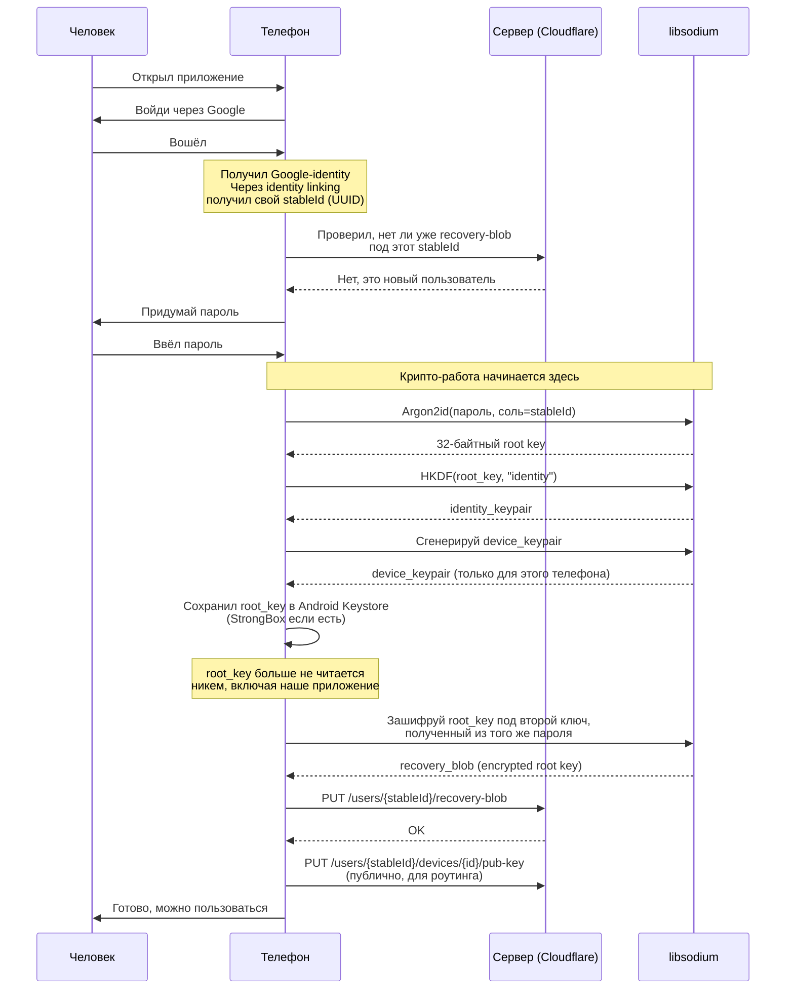
```mermaid
sequenceDiagram
    participant Ч as Человек
    participant Т as Телефон
    participant С as Сервер (Cloudflare)
    participant lib as libsodium

    Ч->>Т: Открыл приложение
    Т->>Ч: Войди через Google
    Ч->>Т: Вошёл
    Note over Т: Получил Google-identity<br/>Через identity linking<br/>получил свой stableId (UUID)
    Т->>С: Проверил, нет ли уже recovery-blob<br/>под этот stableId
    С-->>Т: Нет, это новый пользователь
    Т->>Ч: Придумай пароль
    Ч->>Т: Ввёл пароль
    Note over Т,lib: Крипто-работа начинается здесь
    Т->>lib: Argon2id(пароль, соль=stableId)
    lib-->>Т: 32-байтный root key
    Т->>lib: HKDF(root_key, "identity")
    lib-->>Т: identity_keypair
    Т->>lib: Сгенерируй device_keypair
    lib-->>Т: device_keypair (только для этого телефона)
    Т->>Т: Сохранил root_key в Android Keystore<br/>(StrongBox если есть)
    Note over Т: root_key больше не читается<br/>никем, включая наше приложение
    Т->>lib: Зашифруй root_key под второй ключ,<br/>полученный из того же пароля
    lib-->>Т: recovery_blob (encrypted root key)
    Т->>С: PUT /users/{stableId}/recovery-blob
    С-->>Т: OK
    Т->>С: PUT /users/{stableId}/devices/{id}/pub-key<br/>(публично, для роутинга)
    Т->>Ч: Готово, можно пользоваться
```

### 1.4 Что закрывает наш выбор

| Задача | Решение | Готовое или наше |
|---|---|---|
| Argon2id (медленное превращение пароля в ключ) | libsodium | Готовое ✅ |
| Генерация X25519 keypair | libsodium | Готовое ✅ |
| Симметричное шифрование root_key для recovery-blob | libsodium AEAD | Готовое ✅ |
| Хранение root_key в Keystore | Android API | Готовое ✅ |
| UI wizard'а | Наш код | Наше |
| Wire format recovery-blob | Наш JSON | Наше |
| Cloudflare Worker путь `/users/{stableId}/recovery-blob` | Наш | Наше |

**Итого:** вся крипта — off-the-shelf. Мы пишем UI + JSON format + routing.

---

## Блок 2 — Знакомство двух устройств (Pairing)

### 2.1 Простыми словами

Таня хочет управлять телефоном бабушки. Она **должна доказать бабушкиному телефону**, что она — это Таня, а бабушкин — доказать Таниному, что он — бабушкин. Для этого:
- Бабушка показывает QR-код на своём экране.
- Таня сканирует.
- Оба телефона проделывают «ритуал знакомства» — обмениваются секретными ключами так, чтобы никто в WiFi не подглядел.
- В конце оба знают: «мы точно спарены».

**Мы не изобретаем этот ритуал.** Используем готовый — **Noise XXpsk3** из библиотеки `snow`. Тот же ритуал применяет WhatsApp companion pairing и WireGuard.

### 2.2 Что видит человек

**Бабушка (Managed):**
1. Кнопка «Показать QR».
2. Появился QR-код + таймер 90 секунд.
3. Через 10 секунд: «Таня подключается…».
4. → «Готово. Таня теперь может помогать тебе».

**Таня (Admin):**
1. Кнопка «Сканировать QR».
2. Камера включилась.
3. Навёл на QR → появился фингерпринт бабушки + «Согласиться».
4. Тапнул → «Готово. Ты теперь помощник бабушки».

### 2.3 Что происходит внутри

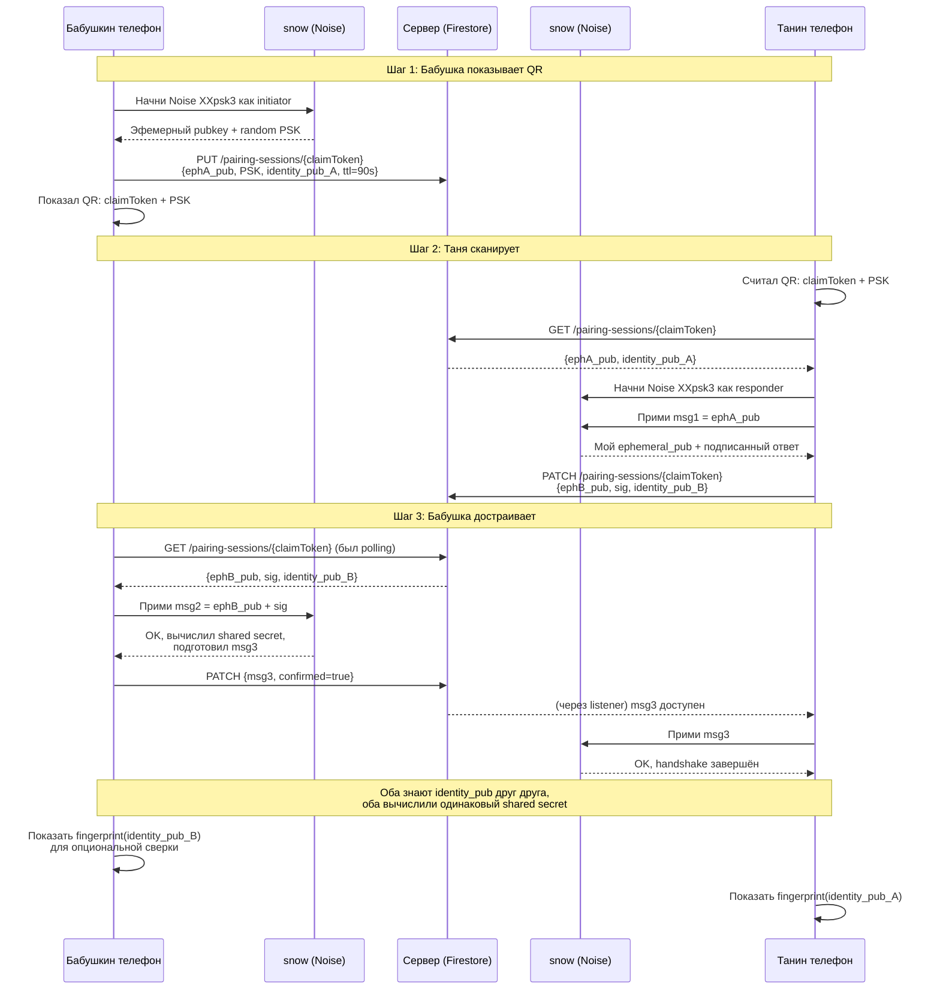
```mermaid
sequenceDiagram
    participant БТ as Бабушкин телефон
    participant snow as snow (Noise)
    participant С as Сервер (Firestore)
    participant snow2 as snow (Noise)
    participant ТТ as Танин телефон

    Note over БТ,ТТ: Шаг 1: Бабушка показывает QR
    БТ->>snow: Начни Noise XXpsk3 как initiator
    snow-->>БТ: Эфемерный pubkey + random PSK
    БТ->>С: PUT /pairing-sessions/{claimToken}<br/>{ephA_pub, PSK, identity_pub_A, ttl=90s}
    БТ->>БТ: Показал QR: claimToken + PSK

    Note over БТ,ТТ: Шаг 2: Таня сканирует
    ТТ->>ТТ: Считал QR: claimToken + PSK
    ТТ->>С: GET /pairing-sessions/{claimToken}
    С-->>ТТ: {ephA_pub, identity_pub_A}
    ТТ->>snow2: Начни Noise XXpsk3 как responder
    ТТ->>snow2: Прими msg1 = ephA_pub
    snow2-->>ТТ: Мой ephemeral_pub + подписанный ответ
    ТТ->>С: PATCH /pairing-sessions/{claimToken}<br/>{ephB_pub, sig, identity_pub_B}

    Note over БТ,ТТ: Шаг 3: Бабушка достраивает
    БТ->>С: GET /pairing-sessions/{claimToken} (был polling)
    С-->>БТ: {ephB_pub, sig, identity_pub_B}
    БТ->>snow: Прими msg2 = ephB_pub + sig
    snow-->>БТ: OK, вычислил shared secret,<br/>подготовил msg3
    БТ->>С: PATCH {msg3, confirmed=true}
    С-->>ТТ: (через listener) msg3 доступен
    ТТ->>snow2: Прими msg3
    snow2-->>ТТ: OK, handshake завершён

    Note over БТ,ТТ: Оба знают identity_pub друг друга,<br/>оба вычислили одинаковый shared secret
    БТ->>БТ: Показать fingerprint(identity_pub_B)<br/>для опциональной сверки
    ТТ->>ТТ: Показать fingerprint(identity_pub_A)
```

### 2.4 Что происходит после handshake

Handshake доказал identity. Теперь надо **записать факт связи** и **дать Тане право писать в бабушкино пространство**.

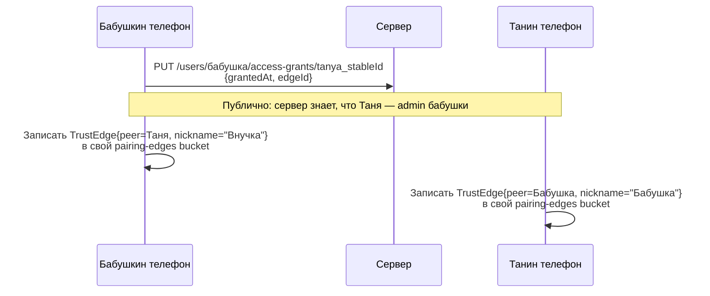
```mermaid
sequenceDiagram
    participant БТ as Бабушкин телефон
    participant С as Сервер
    participant ТТ as Танин телефон

    БТ->>С: PUT /users/бабушка/access-grants/tanya_stableId<br/>{grantedAt, edgeId}
    Note over БТ,ТТ: Публично: сервер знает, что Таня — admin бабушки
    БТ->>БТ: Записать TrustEdge{peer=Таня, nickname="Внучка"}<br/>в свой pairing-edges bucket
    ТТ->>ТТ: Записать TrustEdge{peer=Бабушка, nickname="Бабушка"}<br/>в свой pairing-edges bucket
```

### 2.5 Что закрывает наш выбор

| Задача | Решение | Готовое или наше |
|---|---|---|
| ECDH X25519 обмен ключами | snow (использует libsodium под капотом) | Готовое ✅ |
| Взаимная аутентификация identity | snow (Noise XXpsk3 pattern) | Готовое ✅ |
| Forward secrecy | snow (эфемерные ключи выкидываются) | Готовое ✅ |
| Защита от MITM с фото QR | snow (PSK mix) | Готовое ✅ |
| Transport (передача msg1, msg2, msg3) | Наш Firestore session doc | Наше |
| QR encode/decode | ZXing (уже есть) | Готовое ✅ |
| UI шагов wizard'а | Наш | Наше |

**Что было бы если писали сами:** ~500 строк криптографии с высоким риском ошибок.
**Как сейчас:** snow — 3 вызова API. Wrappet тонкий.

---

## Блок 3 — Второе устройство одного человека (Таня добавляет планшет)

### 3.1 Простыми словами

У Тани уже был телефон, спарен с бабушкой. Теперь она купила планшет и **хочет чтобы планшет тоже мог редактировать бабушкин Profile**.

**Важно:** это НЕ второй pairing с бабушкой. Планшет становится **вторым устройством Тани**, а связь с бабушкой у Тани уже есть (в pairing-edges bucket).

Что должно случиться:
1. Планшет получает **свою** device keypair (у каждого устройства своя).
2. Планшет восстанавливает Танин root key из recovery-blob (по её паролю).
3. Планшет узнаёт о всех Таниных связях (pairing-edges).
4. Танин телефон **добавляет планшет в MLS-группы**, в которых он состоит (в том числе в бабушкину группу).
5. Планшет получает MLS Welcome → может видеть/редактировать бабушкин Profile.

### 3.2 Что видит человек

**Таня на планшете:**
1. Установил APK → «Войди через Google» → тот же аккаунт.
2. → «Введи свой пароль от аккаунта».
3. Ввёл → «Секундочку… восстанавливаю данные».
4. → «Готово. Планшет теперь тоже твой помощник для бабушки, для мамы, для Пети».

Всё автоматически, никаких новых QR.

### 3.3 Что происходит внутри

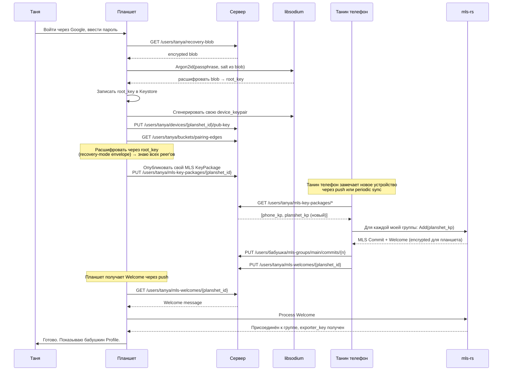
```mermaid
sequenceDiagram
    participant Ч as Таня
    participant ПТ as Планшет
    participant С as Сервер
    participant lib as libsodium
    participant ТТ as Танин телефон
    participant mls as mls-rs

    Ч->>ПТ: Войти через Google, ввести пароль
    ПТ->>С: GET /users/tanya/recovery-blob
    С-->>ПТ: encrypted blob
    ПТ->>lib: Argon2id(passphrase, salt из blob)
    lib-->>ПТ: расшифровать blob → root_key
    ПТ->>ПТ: Записать root_key в Keystore
    ПТ->>lib: Сгенерировать свою device_keypair
    ПТ->>С: PUT /users/tanya/devices/{planshet_id}/pub-key
    ПТ->>С: GET /users/tanya/buckets/pairing-edges
    Note over ПТ: Расшифровать через root_key<br/>(recovery-mode envelope) → знаю всех peer'ов
    ПТ->>С: Опубликовать свой MLS KeyPackage<br/>PUT /users/tanya/mls-key-packages/{planshet_id}

    Note over ТТ: Танин телефон замечает новое устройство<br/>через push или periodic sync
    ТТ->>С: GET /users/tanya/mls-key-packages/*
    С-->>ТТ: [phone_kp, planshet_kp (новый)]
    ТТ->>mls: Для каждой моей группы: Add(planshet_kp)
    mls-->>ТТ: MLS Commit + Welcome (encrypted для планшета)
    ТТ->>С: PUT /users/бабушка/mls-groups/main/commits/{n}
    ТТ->>С: PUT /users/tanya/mls-welcomes/{planshet_id}

    Note over ПТ: Планшет получает Welcome через push
    ПТ->>С: GET /users/tanya/mls-welcomes/{planshet_id}
    С-->>ПТ: Welcome message
    ПТ->>mls: Process Welcome
    mls-->>ПТ: Присоединён к группе, exporter_key получен
    ПТ->>Ч: Готово. Показываю бабушкин Profile.
```

### 3.4 Что закрывает наш выбор

| Задача | Решение | Готовое или наше |
|---|---|---|
| Восстановление root_key на новом устройстве | libsodium (Argon2id + AEAD) | Готовое ✅ |
| MLS Add member операция | mls-rs | Готовое ✅ |
| MLS Welcome для нового устройства | mls-rs | Готовое ✅ |
| Автоматическое обновление group key на всех членов | mls-rs (это TreeKEM внутри) | Готовое ✅ |
| Публикация KeyPackage в directory | Наш Firestore путь | Наше |
| UX «войти на новом устройстве» | Наш | Наше |

**Ключевой момент:** MLS **автоматически** делает так, что все остальные члены группы (бабушка, Петя, все их устройства) получают обновление ключа и знают о планшете. **Мы это не программируем — библиотека делает.**

---

## Блок 4 — Группа: бабушка + Таня + Петя

### 4.1 Простыми словами

У бабушки два помощника — внучка Таня и внук Петя. **Оба должны видеть и редактировать её Profile**. Все правки должны синхронизироваться между всеми троими.

Раньше (в моём старом плане) мы делали это через «конверт с адресами получателей» — envelope-with-recipient-set. Каждое сообщение — конверт с N sealed CEK'ов.

**С MLS всё проще:** есть **одна общая комната** (MLS group). У каждого её члена — свой ключ от неё (получаемый из личного device_key). Когда кто-то шлёт сообщение — оно шифруется общим ключом комнаты. Все читают.

Когда бабушка добавляет Петю — она делает **MLS Add** → все члены (Таня + бабушка сама) получают обновление ключа комнаты → Петя тоже получает ключ через Welcome.

Когда кто-то уходит — **MLS Remove** → ключ комнаты меняется → ушедший больше не может читать новое.

### 4.2 Формирование группы

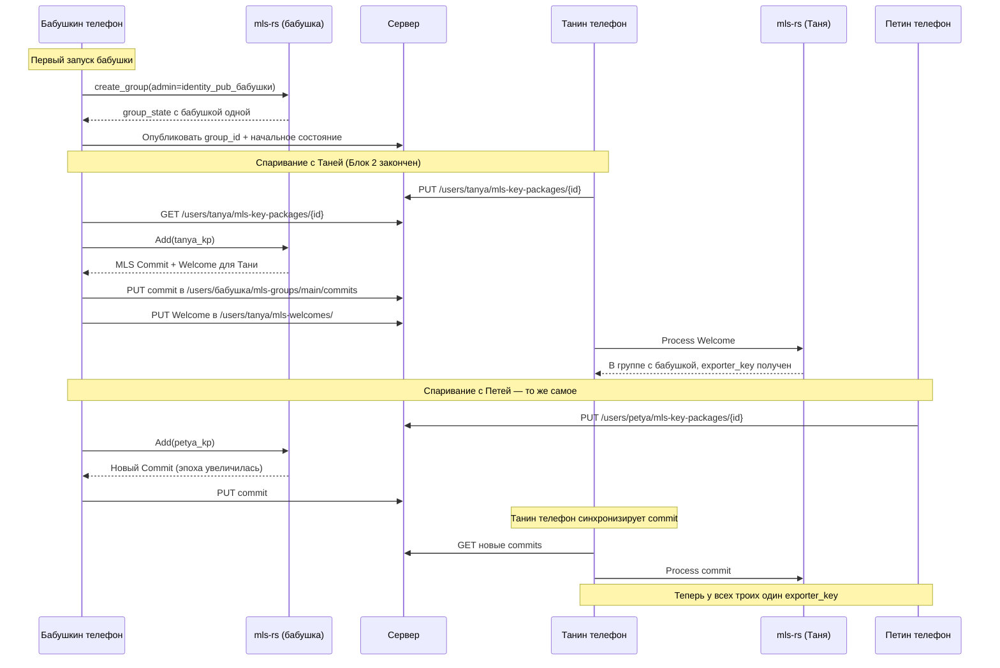
```mermaid
sequenceDiagram
    participant Б as Бабушкин телефон
    participant mlsБ as mls-rs (бабушка)
    participant С as Сервер
    participant Т as Танин телефон
    participant mlsТ as mls-rs (Таня)
    participant П as Петин телефон

    Note over Б: Первый запуск бабушки
    Б->>mlsБ: create_group(admin=identity_pub_бабушки)
    mlsБ-->>Б: group_state с бабушкой одной
    Б->>С: Опубликовать group_id + начальное состояние

    Note over Б,Т: Спаривание с Таней (Блок 2 закончен)
    Т->>С: PUT /users/tanya/mls-key-packages/{id}
    Б->>С: GET /users/tanya/mls-key-packages/{id}
    Б->>mlsБ: Add(tanya_kp)
    mlsБ-->>Б: MLS Commit + Welcome для Тани
    Б->>С: PUT commit в /users/бабушка/mls-groups/main/commits
    Б->>С: PUT Welcome в /users/tanya/mls-welcomes/
    Т->>mlsТ: Process Welcome
    mlsТ-->>Т: В группе с бабушкой, exporter_key получен

    Note over Б,П: Спаривание с Петей — то же самое
    П->>С: PUT /users/petya/mls-key-packages/{id}
    Б->>mlsБ: Add(petya_kp)
    mlsБ-->>Б: Новый Commit (эпоха увеличилась)
    Б->>С: PUT commit
    Note over Т: Танин телефон синхронизирует commit
    Т->>С: GET новые commits
    Т->>mlsТ: Process commit
    Note over Т,П: Теперь у всех троих один exporter_key
```

### 4.3 Что закрывает наш выбор

| Задача | Решение | Готовое или наше |
|---|---|---|
| Формирование MLS group | mls-rs | Готовое ✅ |
| Добавление члена (Add commit) | mls-rs | Готовое ✅ |
| Обновление ключа комнаты при membership change | mls-rs (TreeKEM) | Готовое ✅ |
| Welcome message для нового члена | mls-rs | Готовое ✅ |
| Delivery service (relay commits) | Наш Cloudflare Worker + Firestore | Наше |
| KeyPackage directory | Наш Firestore | Наше |

**Что нам НЕ надо делать:** access-grants (упраздняются), envelope-with-recipient-set (упраздняется), recipient resolver (упраздняется). Это огромное упрощение.

---

## Блок 5 — Таня редактирует Profile бабушки

### 5.1 Простыми словами

Таня хочет добавить бабушке новый контакт «Скорая помощь». Она:
1. Открывает бабушкин Profile у себя в приложении.
2. Editing lock — Firestore документ «Таня редактирует, TTL 20 мин».
3. Редактирует локально.
4. Сохраняет → **весь Profile целиком** (не отдельный «команда добавь контакт») отправляется зашифрованным через MLS group.
5. Бабушкин и Петин телефоны получают push → расшифровывают → применяют.

### 5.2 Что видит человек

**Таня:**
1. Открыл бабушкин Profile.
2. Добавил слот с номером «112».
3. Тап «Сохранить». → «Готово. Изменения применены.»

**Бабушка:**
1. Через 5 секунд — тихое обновление экрана (или уведомление).
2. Новый слот «Скорая помощь» появляется на главном экране.

### 5.3 Что происходит внутри

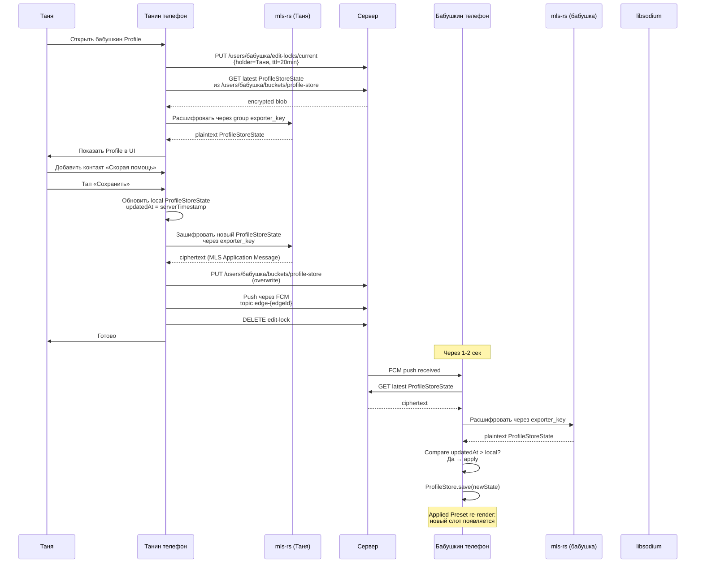
```mermaid
sequenceDiagram
    participant Ч as Таня
    participant Т as Танин телефон
    participant mlsТ as mls-rs (Таня)
    participant С as Сервер
    participant Б as Бабушкин телефон
    participant mlsБ as mls-rs (бабушка)
    participant lib as libsodium

    Ч->>Т: Открыть бабушкин Profile
    Т->>С: PUT /users/бабушка/edit-locks/current<br/>{holder=Таня, ttl=20min}
    Т->>С: GET latest ProfileStoreState<br/>из /users/бабушка/buckets/profile-store
    С-->>Т: encrypted blob
    Т->>mlsТ: Расшифровать через group exporter_key
    mlsТ-->>Т: plaintext ProfileStoreState
    Т->>Ч: Показать Profile в UI
    Ч->>Т: Добавить контакт «Скорая помощь»
    Ч->>Т: Тап «Сохранить»
    Т->>Т: Обновить local ProfileStoreState<br/>updatedAt = serverTimestamp
    Т->>mlsТ: Зашифровать новый ProfileStoreState<br/>через exporter_key
    mlsТ-->>Т: ciphertext (MLS Application Message)
    Т->>С: PUT /users/бабушка/buckets/profile-store<br/>(overwrite)
    Т->>С: Push через FCM<br/>topic edge-{edgeId}
    Т->>С: DELETE edit-lock
    Т->>Ч: Готово

    Note over Б: Через 1-2 сек
    С->>Б: FCM push received
    Б->>С: GET latest ProfileStoreState
    С-->>Б: ciphertext
    Б->>mlsБ: Расшифровать через exporter_key
    mlsБ-->>Б: plaintext ProfileStoreState
    Б->>Б: Compare updatedAt > local?<br/>Да → apply
    Б->>Б: ProfileStore.save(newState)
    Note over Б: Applied Preset re-render:<br/>новый слот появляется
```

### 5.4 Что закрывает наш выбор

| Задача | Решение | Готовое или наше |
|---|---|---|
| Шифрование ProfileStoreState под group key | mls-rs (application message) | Готовое ✅ |
| Forward secrecy на каждое сообщение | mls-rs (epoch key advance) | Готовое ✅ |
| Расшифровка на бабушкином и Петином телефонах | mls-rs | Готовое ✅ |
| Editing lock document | Наш Firestore | Наше |
| Push notification через FCM | Наш push worker | Наше |
| Apply logic (переключение preset'а, rebuild UI) | Наш | Наше |

**Ключевой момент:** Петя тоже получил push и увидит edit Тани. **Это фича** — все admin'ы в sync.

---

## Блок 6 — Recovery на новом телефоне (бабушка сменила телефон)

### 6.1 Простыми словами

Бабушка уронила телефон, купила новый. Хочет чтобы:
- Вернулись все её контакты, темы, layout.
- Таня и Петя продолжали быть её admin'ами.
- Ничего не пришлось заново настраивать.

Для этого:
1. Бабушка входит через Google на новом телефоне → тот же stableId.
2. Вводит свой пароль → скачивает recovery-blob → восстанавливает root_key.
3. Расшифровывает все свои buckets (Profile, pairing-edges).
4. Публикует **новый device pub-key + новый MLS KeyPackage**.
5. Танин / Петин телефон видят новое устройство → **MLS Add** нового устройства в группу.
6. Новое бабушкино устройство получает MLS Welcome → в группе → может расшифровывать всё.

### 6.2 Что видит человек

1. Настроил новый телефон, установил APK.
2. Войти через Google → тот же аккаунт.
3. → «Введи свой пароль».
4. → «Восстанавливаю данные…» (5-30 секунд).
5. → «Готово. Твои настройки, контакты и помощники восстановлены.»

### 6.3 Что происходит внутри

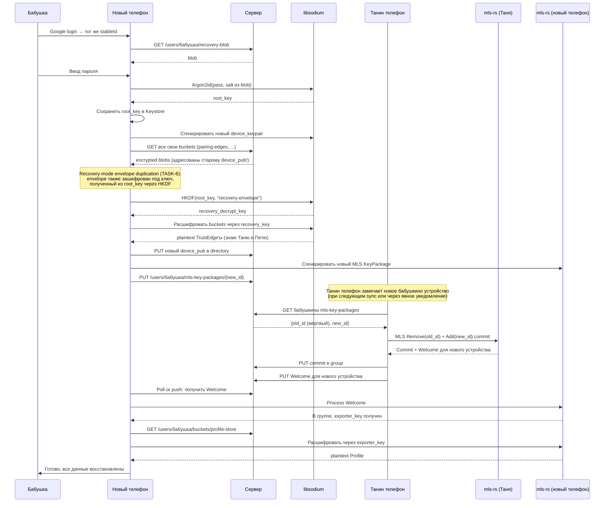
```mermaid
sequenceDiagram
    participant Ч as Бабушка
    participant НТ as Новый телефон
    participant С as Сервер
    participant lib as libsodium
    participant Т as Танин телефон
    participant mlsТ as mls-rs (Таня)
    participant mls as mls-rs (новый телефон)

    Ч->>НТ: Google login → тот же stableId
    НТ->>С: GET /users/бабушка/recovery-blob
    С-->>НТ: blob
    Ч->>НТ: Ввод пароля
    НТ->>lib: Argon2id(pass, salt из blob)
    lib-->>НТ: root_key
    НТ->>НТ: Сохранить root_key в Keystore
    НТ->>lib: Сгенерировать новый device_keypair
    НТ->>С: GET все свои buckets (pairing-edges, ...)
    С-->>НТ: encrypted blobs (адресованы старому device_pub!)
    Note over НТ: Recovery-mode envelope duplication (TASK-6):<br/>envelope также зашифрован под ключ,<br/>полученный из root_key через HKDF
    НТ->>lib: HKDF(root_key, "recovery-envelope")
    lib-->>НТ: recovery_decrypt_key
    НТ->>lib: Расшифровать buckets через recovery_key
    lib-->>НТ: plaintext TrustEdge'ы (знаю Таню и Петю)
    НТ->>С: PUT новый device_pub в directory
    НТ->>mls: Сгенерировать новый MLS KeyPackage
    НТ->>С: PUT /users/бабушка/mls-key-packages/{new_id}

    Note over Т: Танин телефон замечает новое бабушкино устройство<br/>(при следующем sync или через явное уведомление)
    Т->>С: GET бабушкины mls-key-packages
    С-->>Т: [old_id (мёртвый), new_id]
    Т->>mlsТ: MLS Remove(old_id) + Add(new_id) commit
    mlsТ-->>Т: Commit + Welcome для нового устройства
    Т->>С: PUT commit в group
    Т->>С: PUT Welcome для нового устройства
    НТ->>С: Poll or push: получить Welcome
    НТ->>mls: Process Welcome
    mls-->>НТ: В группе, exporter_key получен
    НТ->>С: GET /users/бабушка/buckets/profile-store
    НТ->>mls: Расшифровать через exporter_key
    mls-->>НТ: plaintext Profile
    НТ->>Ч: Готово, все данные восстановлены
```

### 6.4 Что закрывает наш выбор

| Задача | Решение | Готовое или наше |
|---|---|---|
| Восстановление root_key из recovery-blob | libsodium (Argon2id + AEAD) | Готовое ✅ |
| Recovery-mode envelope duplication (для buckets созданных под старый device_pub) | libsodium + наш wire format | Наше (структура) + Готовое (крипта) |
| MLS Remove old + Add new commit | mls-rs | Готовое ✅ |
| Уведомление всех peer'ов о новом устройстве | MLS автоматически | Готовое ✅ |

**Ключевой момент:** Таня НЕ должна ничего делать вручную. Её приложение автоматически замечает изменение и делает MLS commit. Peer's recovery = transparent for us.

---

## Блок 7 — Push-уведомления (FCM с ограничением 4KB)

### 7.1 Простыми словами

Когда Таня редактирует бабушкин Profile — бабушкин телефон должен **сразу** узнать. Но FCM (Firebase Cloud Messaging) имеет **лимит 4KB на push** и **сервер FCM видит содержимое** (плейнтекст).

Поэтому мы:
1. **Никогда не кладём чувствительные данные в push.**
2. Push — только «сигнал»: «есть новое, приходи забирать».
3. Настоящие данные — в шифрованном bucket'е на нашем сервере.

Push для **SOS**, где секундная задержка критична — можно inline'ить зашифрованные данные (payload ≤ 2.5KB после base64 + JSON).

### 7.2 Что видит человек

Ничего специального. Push либо тихо будит приложение, либо показывает уведомление «Нужна помощь!» (для SOS).

### 7.3 Что происходит внутри

**Обычное уведомление (Profile updated):**

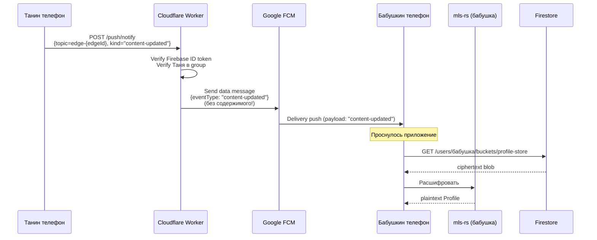
```mermaid
sequenceDiagram
    participant Т as Танин телефон
    participant W as Cloudflare Worker
    participant FCM as Google FCM
    participant Б as Бабушкин телефон
    participant mlsБ as mls-rs (бабушка)
    participant С as Firestore

    Т->>W: POST /push/notify<br/>{topic=edge-{edgeId}, kind="content-updated"}
    W->>W: Verify Firebase ID token<br/>Verify Таня в group
    W->>FCM: Send data message<br/>{eventType: "content-updated"}<br/>(без содержимого!)
    FCM->>Б: Delivery push (payload: "content-updated")
    Note over Б: Проснулось приложение
    Б->>С: GET /users/бабушка/buckets/profile-store
    С-->>Б: ciphertext blob
    Б->>mlsБ: Расшифровать
    mlsБ-->>Б: plaintext Profile
```

**SOS уведомление (payload inline):**

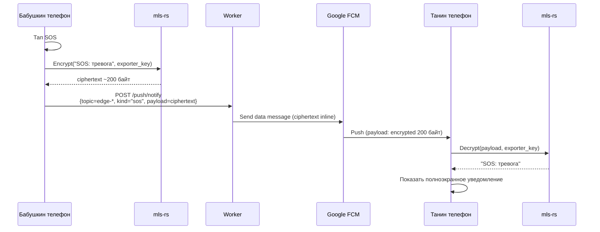
```mermaid
sequenceDiagram
    participant Б as Бабушкин телефон
    participant mlsБ as mls-rs
    participant W as Worker
    participant FCM as Google FCM
    participant Т as Танин телефон
    participant mlsТ as mls-rs

    Б->>Б: Тап SOS
    Б->>mlsБ: Encrypt("SOS: тревога", exporter_key)
    mlsБ-->>Б: ciphertext ~200 байт
    Б->>W: POST /push/notify<br/>{topic=edge-*, kind="sos", payload=ciphertext}
    W->>FCM: Send data message (ciphertext inline)
    FCM->>Т: Push (payload: encrypted 200 байт)
    Т->>mlsТ: Decrypt(payload, exporter_key)
    mlsТ-->>Т: "SOS: тревога"
    Т->>Т: Показать полноэкранное уведомление
```

### 7.4 Что закрывает наш выбор

| Задача | Решение | Готовое или наше |
|---|---|---|
| Шифрование push payload | mls-rs (application message) | Готовое ✅ |
| Google FCM delivery | Firebase | Готовое ✅ |
| Верификация authorization на Worker | Firebase ID token | Готовое ✅ |
| Разделение event types (content-updated, sos, ...) | Наш enum | Наше |
| Wake-lock policy на устройстве | Android WorkManager | Готовое ✅ |

---

## Блок 8 — Отзыв связи (Revoke)

### 8.1 Простыми словами

Бабушка решила больше не давать Тане управлять телефоном (Таня украла деньги, или просто временно не нужна). Механизм:
1. Бабушка открывает список admin'ов → «Отозвать Таню».
2. **MLS Remove commit:** Танино устройство исключается из группы.
3. **Ключ комнаты обновляется** (MLS автоматически).
4. **Таня больше не может расшифровать** новые версии Profile.
5. Старые версии (те что она успела скачать ДО revoke) — она уже видела. Cryptographically нельзя «отменить прошлое».

Дополнительно: бабушкин telefón **удаляет access-grant** документ Firestore, чтобы Security Rules отвергли Танин write.

### 8.2 Что видит человек

**Бабушка:**
1. Открыла список admin'ов → «Внучка Таня».
2. → «Отозвать доступ».
3. → «Ты уверена?»
4. → «Готово».

**Таня:**
1. Открывает бабушкин Profile → «Ошибка: у тебя больше нет доступа».
2. Локальная копия — есть (что была на момент revoke), но она уже устарела.

### 8.3 Что происходит внутри

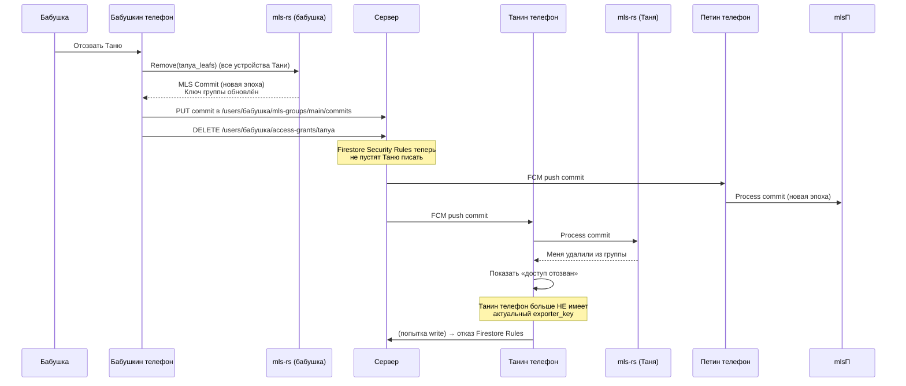
```mermaid
sequenceDiagram
    participant Ч as Бабушка
    participant Б as Бабушкин телефон
    participant mlsБ as mls-rs (бабушка)
    participant С as Сервер
    participant Т as Танин телефон
    participant mlsТ as mls-rs (Таня)
    participant П as Петин телефон

    Ч->>Б: Отозвать Таню
    Б->>mlsБ: Remove(tanya_leafs) (все устройства Тани)
    mlsБ-->>Б: MLS Commit (новая эпоха)<br/>Ключ группы обновлён
    Б->>С: PUT commit в /users/бабушка/mls-groups/main/commits
    Б->>С: DELETE /users/бабушка/access-grants/tanya
    Note over С: Firestore Security Rules теперь<br/>не пустят Таню писать
    С->>П: FCM push commit
    П->>mlsП: Process commit (новая эпоха)
    С->>Т: FCM push commit
    Т->>mlsТ: Process commit
    mlsТ-->>Т: Меня удалили из группы
    Т->>Т: Показать «доступ отозван»
    Note over Т: Танин телефон больше НЕ имеет<br/>актуальный exporter_key
    Т->>С: (попытка write) → отказ Firestore Rules
```

### 8.4 Что закрывает наш выбор

| Задача | Решение | Готовое или наше |
|---|---|---|
| MLS Remove operation | mls-rs | Готовое ✅ |
| Post-compromise security (даже если старый ключ утёк, новая эпоха безопасна) | mls-rs (это встроенное свойство MLS!) | Готовое ✅ |
| Firestore Security Rules отказ write без grant | Firebase | Готовое ✅ |
| UI подтверждения revoke | Наш | Наше |

**Post-compromise security — killer feature MLS для revoke.** Даже если Танин телефон был скомпрометирован до revoke, **после Remove'а attacker с её старыми ключами не может расшифровать новые данные**. Signal-style pairwise sessions этого не дают без явной rotation.

---

## Блок 9 — Будущее: мессенджер

### 9.1 Простыми словами

Через год решили: добавить возможность отправлять текстовые сообщения между бабушкой, Таней и Петей. **Крипту переписывать не нужно.** Тот же MLS group даёт нам:
- Ключ комнаты — уже есть.
- Forward secrecy на каждое сообщение — уже есть.
- Post-compromise security — уже есть.

Мы **только добавляем**:
- UI мессенджера.
- Wire format для сообщений (JSON с полями `text`, `timestamp`, `sender`, ...).
- FCM push для «есть новое сообщение».
- Storage (bucket `/users/бабушка/buckets/messages/{msg_id}` или append-only log).

### 9.2 Что происходит внутри (сокращённо)

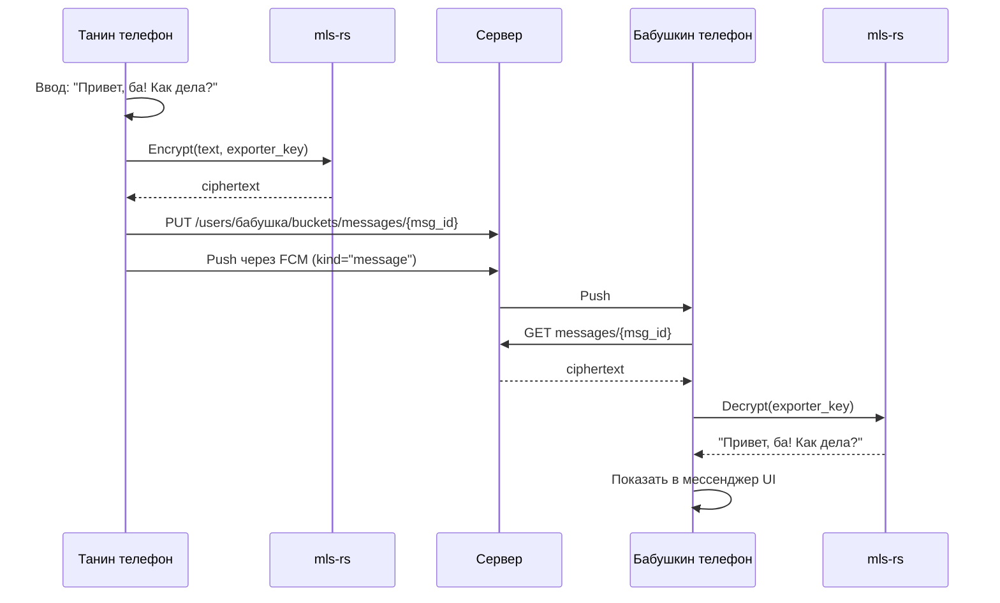
```mermaid
sequenceDiagram
    participant Т as Танин телефон
    participant mlsТ as mls-rs
    participant С as Сервер
    participant Б as Бабушкин телефон
    participant mlsБ as mls-rs

    Т->>Т: Ввод: "Привет, ба! Как дела?"
    Т->>mlsТ: Encrypt(text, exporter_key)
    mlsТ-->>Т: ciphertext
    Т->>С: PUT /users/бабушка/buckets/messages/{msg_id}
    Т->>С: Push через FCM (kind="message")
    С->>Б: Push
    Б->>С: GET messages/{msg_id}
    С-->>Б: ciphertext
    Б->>mlsБ: Decrypt(exporter_key)
    mlsБ-->>Б: "Привет, ба! Как дела?"
    Б->>Б: Показать в мессенджер UI
```

**Тот же exporter_key**, что используется для Profile sync. **Никаких новых крипто-компонентов.**

### 9.3 Что нам понадобится

| Задача | Решение | Готовое или наше |
|---|---|---|
| Шифрование сообщений | mls-rs (уже есть) | Готовое ✅ |
| Delivery | наш FCM path (уже есть) | Готовое ✅ (наш) |
| Storage messages | Наш bucket | Наше |
| Мессенджер UI | Наш | Наше |
| Wire format сообщения | Наш JSON | Наше |

**Оценка добавления мессенджера когда-либо в будущем: 4-6 недель UI + storage, ноль недель крипты.**

---

## Блок 10 — Будущее: обмен фотками (Family album)

### 10.1 Простыми словами

Хотим чтобы Таня отправляла бабушке фото внука. Проблема — фото большое (2-10 MB), не влезает в FCM push и не должно проходить через Firestore document (лимит 1MB).

Решение:
1. Таня шифрует фото через тот же MLS exporter_key.
2. Загружает ciphertext в **Cloudflare R2** (или другой blob storage).
3. Отправляет через MLS **сообщение-указатель**: «есть фото, скачать по адресу X, ключ такой-то».
4. Бабушка получает push → скачивает blob → расшифровывает.

### 10.2 Что происходит внутри

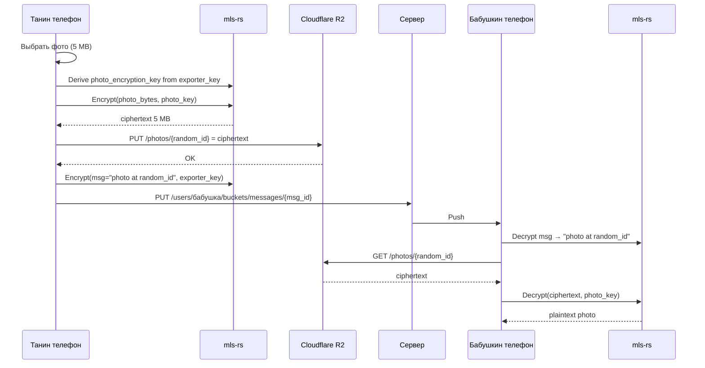
```mermaid
sequenceDiagram
    participant Т as Танин телефон
    participant mlsТ as mls-rs
    participant R2 as Cloudflare R2
    participant С as Сервер
    participant Б as Бабушкин телефон
    participant mlsБ as mls-rs

    Т->>Т: Выбрать фото (5 MB)
    Т->>mlsТ: Derive photo_encryption_key from exporter_key
    Т->>mlsТ: Encrypt(photo_bytes, photo_key)
    mlsТ-->>Т: ciphertext 5 MB
    Т->>R2: PUT /photos/{random_id} = ciphertext
    R2-->>Т: OK
    Т->>mlsТ: Encrypt(msg="photo at random_id", exporter_key)
    Т->>С: PUT /users/бабушка/buckets/messages/{msg_id}
    С->>Б: Push
    Б->>mlsБ: Decrypt msg → "photo at random_id"
    Б->>R2: GET /photos/{random_id}
    R2-->>Б: ciphertext
    Б->>mlsБ: Decrypt(ciphertext, photo_key)
    mlsБ-->>Б: plaintext photo
```

### 10.3 Что закрывает наш выбор

| Задача | Решение | Готовое или наше |
|---|---|---|
| Шифрование фото | mls-rs (той же группы) | Готовое ✅ |
| Blob storage | Cloudflare R2 (уже в roadmap) | Готовое ✅ |
| Метаданные (кто отправил, когда) | Наш message wire format | Наше |
| Photo gallery UI | Наш | Наше |

---

## Часть Ω — Резюме

### Что нам НЕ надо писать благодаря готовым решениям

- ❌ ECDH / X25519 handshake — snow делает.
- ❌ Двусторонняя аутентификация identity — snow делает.
- ❌ Forward secrecy handshake'а — snow делает.
- ❌ Argon2id KDF — libsodium делает.
- ❌ Симметричное шифрование (AEAD) — libsodium делает.
- ❌ MLS group setup + membership — mls-rs делает.
- ❌ MLS Add / Remove с обновлением ключа — mls-rs делает.
- ❌ TreeKEM (внутренняя структура MLS) — mls-rs делает.
- ❌ Forward secrecy на каждое сообщение — mls-rs делает.
- ❌ Post-compromise security — mls-rs делает.

### Что нам надо писать

- ✅ Domain-level ports (`PairingService`, `GroupCryptoPort`, `RecoveryVault`, `DocumentEnvelope`) — ~500 строк.
- ✅ UniFFI wrapper (2-3 недели один раз, потом transparent).
- ✅ QR wire format + roundtrip тесты.
- ✅ Recovery-blob wire format.
- ✅ Firestore paths + Security Rules.
- ✅ Cloudflare Worker push endpoint (частично уже есть).
- ✅ UI wizard'ов.

### Как то же самое решение работает для будущих фич

| Будущая фича | Что нужно докрутить | Что не переписываем |
|---|---|---|
| Мессенджер | UI + wire format сообщений | Крипту |
| Family album | R2 storage + UI | Крипту |
| SOS button | Push priority + UI | Крипту |
| Voice calls | WebRTC transport + UI | Идентификацию peer'а (identity_pub из TrustEdge) |
| Multi-family (родственник управляет двумя людьми) | Ничего специального — просто больше MLS groups | Крипту |
| Clinic (врач управляет 20 пациентами) | Больше MLS groups, наши UI для лестниц связей | Крипту |

### Trade-off, который мы приняли

1. **Никакого dedicated crypto audit'а pre-ship.** Компенсируется тем, что вся крипта — battle-tested off-the-shelf (libsodium используют Signal/WhatsApp, mls-rs — Wire/AWS RCS, Noise Protocol — WireGuard).
2. **UniFFI + Rust toolchain в CI.** Один раз настроить, дальше прозрачно. Позволяет один Rust source → Android + iOS + Google TV.
3. **Cloudflare + Firestore = наш MLS delivery service** (сервер relay'ит commits, не понимает крипту). Zero-knowledge сохраняется.
4. **Server видит граф связей** (открытые access-grants нам не нужны с MLS, но публичные MLS KeyPackages в directory всё равно видны). Blind grants — Phase-5+ TODO.
5. **iOS pairing в MVP не поддерживается** без UniFFI работы. iOS admin — Phase-4+.

### Итоговая формула

**Готовые библиотеки решают 90% крипто-работы. Наш код — 10% (склеивание + UI + wire format + Firestore пути).**

Это лучшая позиция для команды без бюджета на audit — минимизировать surface собственного кода, максимально доверять проверенным примитивам.

---

## Часть Δ — Ответы на вопросы новичка

Владелец, прочитав документ выше, задал ряд конкретных вопросов. Каждый ответ ниже — самостоятельный кусок, можно читать по одному.

### Δ.1 «Откуда телефон узнаёт TrustEdge{peer=Таня, nickname="Внучка"}? Какой-то доп-запрос к Тане?»

**Нет, доп-запроса нет.** Всё нужное уже пришло **внутри самого handshake'а** из Блока 2.

Что произошло во время Noise XXpsk3:
- Танин телефон **прислал бабушке** свой `identity_pub_B` — это часть протокола Noise (шаг «msg2 + sig»).
- Бабушкин телефон **прислал Тане** свой `identity_pub_A` — то же самое (шаг «msg1»).
- После handshake оба **уже знают** identity_pub противоположной стороны + shared secret.

Что бабушка добавляет **локально** (server об этом не знает):
- `nickname="Внучка"` — из UI (бабушка ввела в диалоге «Как назовём? [Таня / Внучка / другое]»).
- `edgeId` — random UUID, сгенерирован локально.
- `createdAt` — локальное время.

**Что такое «pairing-edges bucket»** — это просто путь в Firestore: `/users/бабушка/buckets/pairing-edges`. Внутри лежит **зашифрованный blob** (через root_key + Argon2id-KDF, или через MLS exporter_key — деталь для Блока Ω+, см. Δ.2). Сервер видит:
- Путь `/users/бабушка/buckets/pairing-edges` (публично, для роутинга).
- Размер blob'а (~несколько KB).
- Время последнего update'а.

Сервер **не видит**:
- Сколько peer'ов у бабушки.
- Кто эти peer'ы.
- Никнеймы.

Аналогия: у сервера — это как папка с зашифрованным zip-архивом. Он знает, что архив есть, но не знает, что внутри.

### Δ.2 «Список моих групп — где хранится? В кэше? На сервере для recovery?»

**Локально** список групп хранит `mls-rs` библиотека — в своём внутреннем state (persist'ится в SQLite или подобное хранилище на устройстве).

Но **на recovery** (новый телефон) этого state'а нет. Есть два подхода:

**Подход A (recovery на сервере) — то, что мы выбираем.**

Само `mls-rs` state сериализуется как opaque blob → шифруется через `root_key` (recovery envelope) → загружается на сервер под путь `/users/бабушка/buckets/mls-state`. При recovery — скачивается, расшифровывается, восстанавливается mls-rs state.

Плюс: мгновенное восстановление, не зависит от того, онлайн ли другие члены группы.
Минус: 1 лишний bucket, 1 лишний backup путь.

**Подход B (peer-restore).**

Ничего не хранится. При recovery новое устройство просто **публикует новый KeyPackage** и ждёт, пока Танин / Петин телефон **добавит** его в группу. Пока другие offline — ничего не работает.

Плюс: server знает меньше.
Минус: recovery ломается, если ни один peer не онлайн; в мульти-family scenario — Танин телефон должен добавить бабушку **в каждую** группу вручную.

**Наш выбор: A**. Обоснование: бабушкин telefон — не только member, он **root of trust** для recovery. Ждать peer'а — не приемлемо.

**На сервере это НЕ нарушает zero-knowledge**, потому что mls-state зашифрован под recovery envelope (ключ = HKDF(root_key, "mls-state")). Сервер видит blob, не видит содержимое.

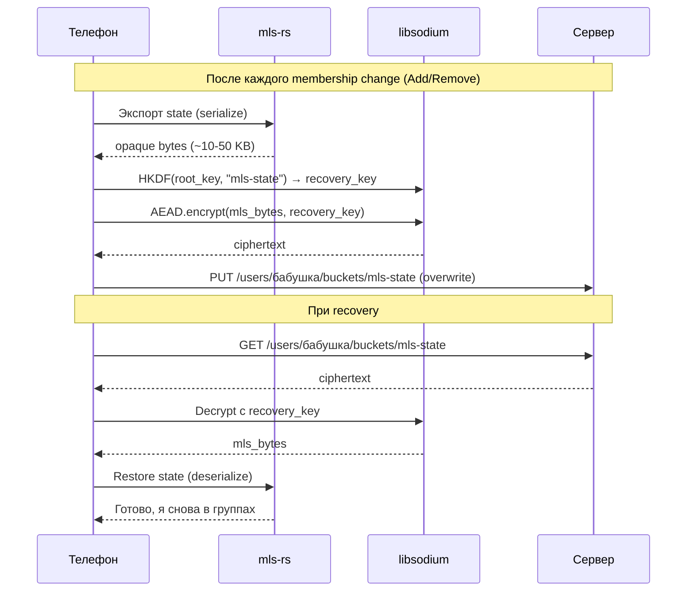
```mermaid
sequenceDiagram
    participant Т as Телефон
    participant mls as mls-rs
    participant lib as libsodium
    participant С as Сервер

    Note over Т,С: После каждого membership change (Add/Remove)
    Т->>mls: Экспорт state (serialize)
    mls-->>Т: opaque bytes (~10-50 KB)
    Т->>lib: HKDF(root_key, "mls-state") → recovery_key
    Т->>lib: AEAD.encrypt(mls_bytes, recovery_key)
    lib-->>Т: ciphertext
    Т->>С: PUT /users/бабушка/buckets/mls-state (overwrite)

    Note over Т,С: При recovery
    Т->>С: GET /users/бабушка/buckets/mls-state
    С-->>Т: ciphertext
    Т->>lib: Decrypt с recovery_key
    lib-->>Т: mls_bytes
    Т->>mls: Restore state (deserialize)
    mls-->>Т: Готово, я снова в группах
```

### Δ.3 «MLS автоматически всех оповещает — значит FCM нужно? Про сервер всё продумано?»

Да, FCM нужно, и да, сервер продуман.

Важно разделить:
- **MLS «автоматически»** относится к **криптографической логике**: как только commit применён, эпоха у всех обновляется. Ключевой момент — **что все получили commit**. MLS **не знает**, как commit доставить.
- **Доставка commit'а** — наша ответственность. Мы используем ту же цепочку из Блока 7:

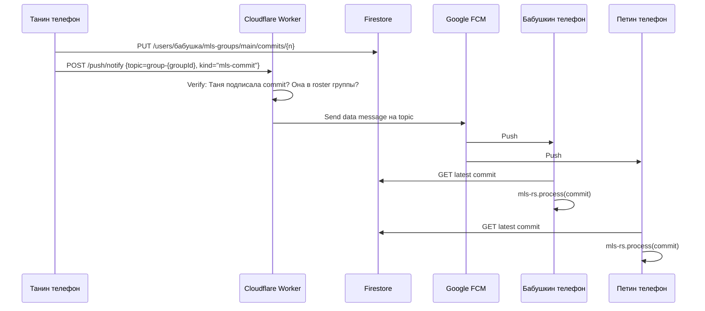
```mermaid
sequenceDiagram
    participant Т as Танин телефон
    participant W as Cloudflare Worker
    participant С as Firestore
    participant FCM as Google FCM
    participant Б as Бабушкин телефон
    participant П as Петин телефон

    Т->>С: PUT /users/бабушка/mls-groups/main/commits/{n}
    Т->>W: POST /push/notify {topic=group-{groupId}, kind="mls-commit"}
    W->>W: Verify: Таня подписала commit? Она в roster группы?
    W->>FCM: Send data message на topic
    FCM->>Б: Push
    FCM->>П: Push
    Б->>С: GET latest commit
    Б->>Б: mls-rs.process(commit)
    П->>С: GET latest commit
    П->>П: mls-rs.process(commit)
```

Что нам нужно построить на серверной стороне:
1. **Firestore путь** `/users/{owner}/mls-groups/{groupId}/commits/{n}` — просто append-only коллекция.
2. **Security Rules** — write разрешён только тем, кто в roster группы (public metadata: `{groupId, memberIds[]}`).
3. **Cloudflare Worker endpoint** `/push/notify` — верифицирует authorization + отправляет FCM topic message. Уже есть в TASK-5.

**Никаких сюрпризов на сервере в MVP.** Всё описано в спеках 014/016/017 (spec-driven track) — крипто-механика существующего Worker'а покроет MLS delivery как «ещё один event type».

**Единственная новая нагрузка**: Firestore-коллекция commits растёт. Compaction (сжатие старых commits) — Phase-5 задача, обозначена в `docs/dev/project-backlog.md`.

### Δ.4 «GET /users/tanya/mls-key-packages/{id} — как получаем данные о члене группы? Ключевой вопрос для мессенджера с 1000 участников»

Это два разных вопроса, разделим.

**Вопрос A: Откуда я получаю KeyPackage нового потенциального члена?**

**KeyPackage directory** — публичный Firestore путь `/users/{stableId}/mls-key-packages/{deviceId}`. Каждое устройство:
- При первом запуске **публикует** несколько KeyPackages (запас на N использований, обычно 10-100).
- Каждый KeyPackage — «одноразовый пропуск»: содержит `identity_pub`, `device_pub`, подпись, срок годности.

Кто хочет добавить меня в группу — читает мой KeyPackage. Это **публичная информация** — она нужна для крипто-механики. Server видит: у tanya есть N устройств и M ключ-пакетов на каждом.

**Приватность**: server знает, **что** tanya существует и **сколько** у неё устройств, **не знает** — с кем она в группах (это encrypted в bucket'ах). Это компромисс, который мы **приняли явно** (см. «Trade-off» в Часть Ω).

**Вопрос B: Кто что сделал в группе — как это узнать?**

Внутри MLS каждое сообщение (application message или commit) **подписано device_key отправителя**. `mls-rs` при decrypt возвращает **`sender_index`** — номер листа в TreeKEM.

`sender_index` → identity mapping:
- Группа хранит **roster** — публичный список `[{leafIndex, stableId, identityPubHash}]`.
- Roster обновляется на каждый Add/Remove commit.

Когда мы получаем сообщение → `sender_index = 3` → смотрим в roster → «это Таня, устройство planshet». Всё автоматически, никаких доп-запросов.

**Scale для 1000+ участников**:
- Directory лукап: `/users/{stableId}/mls-key-packages/*` — небольшой (5-10 KP × 200 байт).
- Roster: ~100 байт × N членов = 100 KB для 1000 членов. OK.
- Delivery commit'а всем: FCM topic scale — миллионы subscribers, no problem.
- **Проблема**: TreeKEM commit размер растёт как O(log N) — для 1000 членов ~2 KB. Приемлемо.

**Для нашего MVP** (family 3-10, clinic 20-50) — вопрос scale вообще не встаёт. Явно оставляем 1000+ как Phase-5+ concern.

### Δ.5 «Профиль edit — понятно, а фото контакта? Любое редактирование должно быть эквивалентно на всех телефонах группы»

**Фото контакта** = слишком большое для MLS application message (обычно ~100 KB - 2 MB), не влезает в 1 MB Firestore document limit.

Паттерн — тот же, что для «family album» (Блок 10):

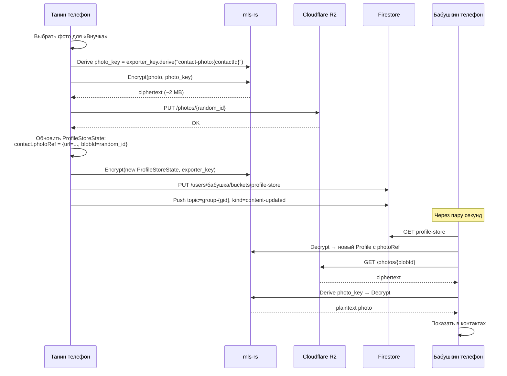
```mermaid
sequenceDiagram
    participant Т as Танин телефон
    participant mls as mls-rs
    participant R2 as Cloudflare R2
    participant С as Firestore
    participant Б as Бабушкин телефон

    Т->>Т: Выбрать фото для «Внучка»
    Т->>mls: Derive photo_key = exporter_key.derive("contact-photo:{contactId}")
    Т->>mls: Encrypt(photo, photo_key)
    mls-->>Т: ciphertext (~2 MB)
    Т->>R2: PUT /photos/{random_id}
    R2-->>Т: OK

    Т->>Т: Обновить ProfileStoreState:<br/>contact.photoRef = {url=..., blobId=random_id}
    Т->>mls: Encrypt(new ProfileStoreState, exporter_key)
    Т->>С: PUT /users/бабушка/buckets/profile-store
    Т->>С: Push topic=group-{gid}, kind=content-updated

    Note over Б: Через пару секунд
    Б->>С: GET profile-store
    Б->>mls: Decrypt → новый Profile с photoRef
    Б->>R2: GET /photos/{blobId}
    R2-->>Б: ciphertext
    Б->>mls: Derive photo_key → Decrypt
    mls-->>Б: plaintext photo
    Б->>Б: Показать в контактах
```

**Ключевая идея**: Profile (лёгкий JSON) идёт через MLS-encrypted bucket; фото (тяжёлое) идёт через R2 encrypted blob, а **указатель на blob** едет вместе с Profile. **Ключ фото** — производный от exporter_key группы, поэтому только члены группы могут расшифровать.

**Эквивалентность редактирования** = каждое сохранение переписывает **весь Profile целиком** + генерирует новый **эпоха-ключ** через `mls-rs.commit()`. Все получают одно и то же (детерминированный merge).

**Что если два admin'а редактируют одновременно?**
- Editing lock (см. Блок 5) снижает вероятность.
- Если всё же конфликт (Таня и Петя оба сохранили за 100ms) — **last-writer-wins по `updatedAt` server timestamp**. Проигравший admin получит push «Petя тоже сохранил», может retry.
- **Никакого CRDT** в MVP. Может быть в Phase-5 если данные покажут проблему.

### Δ.6 «Публикует новый device pub-key + новый MLS KeyPackage — значит это новый участник?»

**Да, для крипто-модели это новый leaf в TreeKEM**, но для application-модели — **та же личность** (бабушка).

MLS forward secrecy — фундаментальное свойство: **старый device_key нельзя переиспользовать**, даже если бы его private часть где-то сохранилась (её нет — Keystore недоступен без passphrase, а на новом телефоне его нет). Поэтому:
- Старый leaf **Remove**'ится (Таниным телефоном).
- Новый leaf **Add**'ится (тоже Таниным телефоном).
- Приложение помечает в roster: `{oldLeafIndex: removed, newLeafIndex: {stableId=бабушка, deviceId=new}}` — это **та же бабушка**, но другой девайс.

**Восстановить старую identity в MLS нельзя.** Это защита: если старый телефон украли и достали ключ — attacker не может продолжать быть «бабушкой» в группе, потому что новый leaf её вытеснил.

### Δ.7 «Новое устройство может расшифровать всё после нового входа? А что видит Танин телефон?»

Разделяем.

**Что видит новое бабушкино устройство:**
- **Сообщения группы** (MLS application messages) — только те, что **отправлены ПОСЛЕ его Welcome**. Старые не расшифрует никогда (post-compromise security как побочный эффект).
- **Buckets (Profile, contacts, ...)** — **последнюю версию** может расшифровать, потому что мы храним последнюю версию как один blob (не как append log). Каждый `updateProfile()` → полная перезапись под текущий exporter_key. При Welcome → устройство узнаёт текущий exporter_key → декодирует последнюю версию.
- **Историю правок** (кто когда что изменил) — **не расшифровывает**, если история хранится как append-only log под старыми эпохами. В MVP мы не храним историю Profile — только current state. Значит вопрос не возникает.

**Что видит Танин телефон (admin 2):**
- Танин телефон уже был в группе → получил Add(new_бабушкино устройство) commit → **эпоху обновил** → продолжает участие.
- **До replacement**: Танин телефон видел всё, что было отправлено, — сохранил себе (в локальном encrypted storage).
- **После replacement**: продолжает видеть новые сообщения (эпоха 2, 3, ...).
- Никакой информации Танин телефон **не теряет** — replacement затрагивает только бабушкино устройство.

Аналогия: MLS-группа — комната с автозамком. Ключ комнаты в течение старой эпохи был у бабушкиного устройства N1. Устройство N1 умерло, ключ утерян. Новый ключ комнаты выдан устройству N2 через Welcome (принёс его Танин телефон). Все, кто был в комнате до, — продолжают: у них уже был текущий ключ (Танин, Петин). Бабушка на новом N2 продолжает с этого момента.

### Δ.8 «Verify Firebase ID token + Verify Таня в group — легко ли перенести на свой сервер?»

**Да, тривиально.** Обе проверки — чистая математика без state'а.

**Firebase ID token verify** — это верификация подписанного JWT:
1. Скачать Google's public keys (JWK): `https://www.googleapis.com/service_accounts/v1/jwk/securetoken@system.gserviceaccount.com` — кешируется 24 часа.
2. Разобрать JWT header → выбрать нужный `kid`.
3. Проверить подпись RSA-SHA256 (готовая функция в любой crypto lib).
4. Проверить claims (`exp`, `iss`, `aud`).

Средняя обработка: **~100 микросекунд** (одна крипто-верификация + JSON parse). CPU-bound, никакой БД.

**Verify Таня в group**:
1. Group roster хранится по пути `/users/бабушка/mls-groups/main/roster` (публичный, ~100 байт).
2. Кешируется в edge cache Cloudflare / in-memory Go server.
3. Проверка: `stableId(Таня) in roster.memberIds`.

Скорость: **1 lookup + 1 comparison** ≈ **~10 микросекунд** при кеш-хите.

**Portability на свой сервер (Go / Rust / что угодно)**:
- Обе операции есть в готовых библиотеках любого языка (`github.com/coreos/go-oidc`, `jsonwebtoken` для Rust).
- Roster fetch — обычный HTTP или БД query.

**Единственная зависимость от Firebase** — источник public keys. Если Firebase Auth заменяется на свой Identity Provider, JWT verify переключается на свои ключи. Wire format JWT — универсальный.

**Стоимость миграции**: ~1 неделя (переписать Worker → Go microservice, поставить nginx / Fly.io / любой хостинг). Явно **two-way door** решение (обратимо).

### Δ.9 «Push для 3000 участников — это шторм?»

**В MVP — нет.** Наши группы = 3-10 человек. Отправка = **1 API call на Cloudflare Worker** → Worker → **1 FCM topic message** → FCM fan-out'ит всем subscribers топика.

**Кто ответственен за отправку**:
1. **Sender's device**: после `mls-rs.commit()` → PUT commit в Firestore → POST `/push/notify` на Worker с полем `topic=group-{groupId}`.
2. **Worker**: верифицирует sender (Firebase JWT), проверяет что sender в roster → отправляет FCM с topic. **Это ОДИН вызов**, не N.
3. **FCM**: делает fan-out на всех subscribers topic'а. Это Google's проблема, у них триллионы push в день, справятся.

**Подписка на topic**: каждое устройство при join группы — вызывает `FirebaseMessaging.subscribeToTopic("group-{groupId}")`. Один раз.

**Для 3000-member group**:
- FCM topic subscribers: до **1 000 000** на topic без проблем (Firebase docs).
- Latency delivery: 1-3 секунды до 95th percentile для 1000 devices (documented Firebase SLA).
- Стоимость: **бесплатно на Spark plan**, только заплатить за Cloudflare Worker (~$5/месяц на весь traffic).

**Ограничения FCM topic'а**:
- Payload ≤ 4KB — для sensitive data (SOS) inline'им ciphertext, для больших — только «wake-up + fetch».
- 1000 push per second per project — hits at 10 000 events/second при 100 members per event. **Мы этого не увидим ближайшие 3 года**.

**Явный exit ramp для scale**: если clinic с 3000 patients → own push service (Go microservice + APNs/FCM SDKs). Записан в `docs/dev/project-backlog.md`. Не блокирует MVP.

### Δ.10 «Отозвать Таню — может только бабушка или любой member?»

**Application-rule: только owner managed identity (бабушка).**

**Крипто-технически MLS позволяет любому члену commit'ить Remove.** Это дизайн — MLS даёт всем равные права, потому что был спроектирован под use case «Slack channel» где любой может leave / kick.

**Наша application-логика поверх**:

1. **Client-side проверка**: Танин UI **прячет** кнопку «revoke» для не-owner. Танин telefон не сможет случайно сделать commit.
2. **Server-side проверка**: Firestore Security Rules на путь `/users/бабушка/access-grants/*` разрешают DELETE **только** от бабушкиного UID. Если Таня попробует hack'нуть — Firestore rules отвергнут.
3. **Peer-side проверка**: каждый member перед `mls-rs.process(commit)` проверяет `commit.signer.identity == roster.owner`. Если Таня сгенерирует commit «Remove бабушки» — Танин Petya отклонит commit (**заглушая эффект** на своей стороне).
4. **Cloudflare Worker**: на push endpoint для commit'а с kind `role-change` — верифицирует, что commit.signer.identity == group.owner. Если не так — отказ 403.

**Аналогия**: MLS даёт всем ключ от замка на комнате «управление roster'ом». Мы говорим: «этот ключ работает только если ты — owner». Другие можно, но UI + сервер + peer не позволяют.

**Edge case: owner потерял устройство.** Тогда никто не может revoke. Решение: recovery flow (Блок 6) восстанавливает identity бабушки на новом телефоне → она снова owner → может revoke. Пока recovery не завершён — Таня остаётся admin (компромисс приемлем: recovery занимает минуты).

**Что запишем в спеки**: этот application-rule должен быть **явным** в спеках владельца ролей. Прямо сейчас не написан. Записываю в `docs/dev/project-backlog.md` как задачу «Multi-admin role enforcement».

### Δ.11 «Могут ли наши 10% быть настолько плохие, что разрушат систему?»

**Да, наши 10% — самый высокий риск-на-строку кода**, потому что это склеивание разных примитивов, и любая ошибка склеивания разрушает гарантии внутренних библиотек.

**Топ-7 способов взорвать систему нашим кодом:**

1. **Nonce reuse в AEAD**. libsodium сам генерирует nonce, если использовать `secretbox` API. Но если мы вручную формируем nonce (например «использую message counter») и **дважды используем то же значение под тем же ключом** — plaintext раскрывается математически. **Митигация**: используем только `libsodium.secretbox` / `crypto_secretstream` (random nonce), никогда не своё counter. Fitness function: тест «encrypt два раза одинаковое → выход разный».

2. **Wrong Firestore Security Rules**. Если правило `allow write: if request.auth.uid != null` (любой авторизованный) вместо `if request.auth.uid == owner || uid in roster` — attacker становится admin для чужой identity. **Митигация**: rules tests с emulator, negative-path тесты, review 2-мя людьми.

3. **Argon2id iteration count слишком низкий**. Если passphrase из 4 слов + iteration count 1000 (вместо 100 000) → brute-force за часы вместо десятилетий. **Митигация**: hardcoded константа в коде, roundtrip тест `assert Argon2id.iterations >= MIN_ITERATIONS`, review checklist.

4. **QR wire format без schemaVersion**. Первая v1 QR-кода прошла в prod. Мы захотели добавить поле → **сломали всех**, кто ещё на v1. Rule 5 из CLAUDE.md прямо про это. **Митигация**: fitness function `roundtrip test v1 → parse v2 → OK`, обязательное поле `schemaVersion: 1`.

5. **`android:allowBackup="true"` по умолчанию**. Android Auto Backup выкачивает Keystore ключи, если разработчик не отключил. Наш root_key может утечь в Google Cloud Backup. **Митигация**: `allowBackup="false"` + `dataExtractionRules.xml`, проверка в CI манифеста.

6. **KeyPackage TTL = «навсегда»**. Если один KeyPackage переиспользуется многократно → forward secrecy теряется частично (compromised leaf key raskryvает несколько pairing'ов). **Митигация**: `mls-rs` их одноразовые по протоколу, мы соблюдаем протокол. Тест: KeyPackage marked used → refuse reuse.

7. **Trust server для authorization вместо MLS group membership**. Если Cloudflare Worker выдаёт push «Тане» на основе только Firebase JWT (без проверки, что Таня в roster группы) — attacker с чужим JWT получит доступ. **Митигация**: Worker всегда verify JWT **И** roster membership.

**Как эти ошибки не сделать**:
- **Checklists**: `checklist-security`, `checklist-wire-format`, `checklist-domain-isolation` — обязательны для каждого спека, затрагивающего крипту.
- **Fitness functions**: import-lint (никаких SDK в domain), roundtrip tests (wire format), Rules unit tests (Firestore emulator).
- **Independent review**: любой PR с крипто-кодом требует apply 2-х глаз.
- **Explicit trade-offs**: каждый выбор «делаем сами вместо готового» — записан в ADR с exit ramp.

**Вердикт**: 10% нашего кода — это **риск, но управляемый**. Управляем через процесс (checklists + tests + review), не через «пишем крипту сами». Если процесс работает — 10% значительно безопаснее, чем 30% чужого code review'а над своим DIY-крипто.

---

## Часть Λ — Use case'ы из backlog, ещё не покрытые основной частью

Ниже — сценарии из backlog task'ов, которые расширяют картину. Порядок — от близких к MVP к далёким. Стиль — краткий (без Mermaid, если не критично).

### Блок 11 — Клонирование конфига между своими устройствами (TASK-20)

**Простыми словами**: у Тани планшет и телефон, оба её. Она сделала конфиг wizard'а на телефоне (какие тайлы, темы, слоты). Хочет **клонировать** на планшет — без нового wizard'а.

**Крипто-механика**: это **не отдельная фича**, это следствие Блока 3 (второе устройство). Как только планшет присоединился к MLS-группе Тани (self-group), он получает `PersonalPresetBundle` через `exporter_key`. Bundle содержит **общее** (theme, tile layout, wizard responses) и **исключает** device-specific (installed apps whitelist — они разные на планшете vs телефоне).

**Wire format**: `PersonalPresetBundle` — JSON с `schemaVersion` (rule 5). Разделение на `commonPart` + `deviceOverrides` — mask в самом JSON.

**Что готовое** — MLS group для self-group, wire format для presets.
**Что наше** — UI «клонировать → выбрать target device», merge logic для device overrides.

### Блок 12 — Инвентаризация устройств (TASK-24)

**Простыми словами**: Таня хочет знать «какие приложения установлены на бабушкином телефоне», чтобы решить какие тайлы включить.

**Крипто-механика**: бабушкин telefон периодически (раз в день) экспортирует **encrypted `AppInventory`** = `{packageId, appName, version, installedAt}[]` через MLS message → publish в bucket `/users/бабушка/buckets/app-inventory`.

**Приватность**: список приложений — sensitive PII (revealing lifestyle, health apps, dating apps, ...). Не должен утечь на сервер. Bucket encrypted → сервер видит blob размер, не видит apps. **Rule 1 (domain isolation)**: `AppInventory` — pure domain type, не зависит от PackageManager API.

**Что готовое** — MLS для передачи, libsodium для encrypt.
**Что наше** — PackageManager wrapper (adapter), sync schedule, UI отображения.

### Блок 13 — Audit log (TASK-32)

**Простыми словами**: «кто когда добавил Петю в группу», «когда бабушка заменила телефон». Log событий, чтобы можно было расследовать инциденты.

**Крипто-механика**: каждое membership-changing событие (Add, Remove, RoleChange) — уже подписано в MLS commit'е (Δ.4 «кто что сделал»). Audit log = **проекция** этих commits в человеко-читаемый формат.

**Хранение**: append-only bucket `/users/бабушка/buckets/audit-log/{year-month}` — каждый item = encrypted event: `{timestamp, actor: stableId, action: enum, target: stableId, epoch: int}`.

**Ключ**: тот же `exporter_key` MLS-группы. Все члены группы видят audit log — по дизайну **прозрачность у admins**.

**Retention**: MVP — год, потом compact. Fitness function: тест «create 10 000 events, storage < 1 MB».

**Что готовое** — MLS message как proof of authorship.
**Что наше** — event schema, UI просмотра log'а, retention policy.

### Блок 14 — Link-invite без QR (TASK-31)

**Простыми словами**: бабушкин telefон **лежит в другом городе**. Таня, которая ещё не спарена, не может сфотографировать QR. Нужен способ pairing'а «по ссылке».

**Крипто-механика** (упрощённо, детали — Блок 2 адаптированный):
1. Бабушкин telefон генерирует **invite token** = `{claimToken, PSK, expiresAt}`.
2. Публикует под путь `/pairing-invites/{claimToken}` с TTL 24 часа.
3. Бабушка отсылает Тане **ссылку** типа `myapp://invite/{claimToken}?psk={base64PSK}` — через WhatsApp, SMS, что угодно.
4. Таня открывает → приложение делает Noise handshake с обычным протоколом (Блок 2).

**Проблема безопасности**: ссылка может утечь (WhatsApp скриншот, копия в буфере обмена). Митигация:
- **PSK в hash-fragment ссылки** (`#psk=...`) — не идёт в HTTP referrer.
- **TTL 24 часа** — окно узкое.
- **Confirmation UX**: бабушка после первого attempt'а видит на своём telefоне «Кто-то использует твою ссылку. Показать fingerprint?» — сверяет с Таней голосом.

**Rule 3 (one-way door)**: link-invite **менее безопасен** чем QR. Записан в `docs/dev/project-backlog.md` как «Phase-3 add-on», не MVP. Exit ramp: если нашли атаку — деактивируем, все pairing только через QR.

**Что готовое** — Noise handshake из Блока 2.
**Что наше** — invite token wire format, TTL enforcement (Firestore Rules), UI дополнительной верификации.

### Блок 15 — Multi-app cohabitation (TASK-25)

**Простыми словами**: наш launcher — не единственное приложение из проекта. Есть отдельные app'ы: «Health monitor» (планируется), «SOS button widget» и т.д. Они должны **разделять identity + группы** — не заставлять пользователя pairing'иться заново.

**Крипто-механика**: **Android App Groups** (shared UID) или **Signed ContentProvider** — способ разделить keystore между app'ами одного вендора.

**Detail**:
- App'ы подписаны одним keystore → могут делить UID.
- `root_key` хранится в keystore одного app'а («identity vault»).
- Другие app'ы через ContentProvider читают identity + текущие MLS group states.
- Каждое app'ы имеет свой **own MLS device leaf** (для forward secrecy — если один app скомпрометирован, другие сохранны).

**Rule 2 (ACL)**: identity provision — port `IdentityVault`, adapter `AndroidContentProviderIdentityVault`.

**Что готовое** — Android ContentProvider infrastructure.
**Что наше** — schema shared identity, sync protocol между app'ами, тесты.

### Блок 16 — 2FA escrow при recovery (TASK-21)

**Простыми словами**: бабушка забыла свой passphrase. Recovery через один только Google login — недостаточно (Google login тоже могут украсть). Нужен **второй фактор** — например, «код на телефоне Тани» или «signed вещь от кого-то из семьи».

**Крипто-механика (не окончательная, зависит от TASK-59 research):**

**Подход A: Server-side counter (SVR-style)**:
- Server считает попытки brute-force. После 5 неудачных — блокирует на час, после 20 — на день.
- Требует server-side state, но не decrypting.

**Подход B: Social recovery (M-of-N shares)**:
- Passphrase → Shamir Secret Sharing на 3 shares → каждый share отправлен peer'у (Таня, Петя, Мама).
- Recovery = собрать 2 из 3 shares → восстановить passphrase → расшифровать recovery-blob.

**Подход C: 2FA HMAC-OTP на устройстве Тани**:
- Recovery-blob шифруется под `HMAC(root_key, tanya_pubkey)`.
- Recovery: бабушка вводит passphrase + подтверждает через Танин telefон (Tany знает свой pubkey → генерирует HMAC → отправляет).

**Что нужно решить в TASK-59** — какой из подходов. Все три technically viable, различаются server complexity + UX.

**Что готовое** — libsodium HMAC, Shamir Secret Sharing (готовые библиотеки существуют).
**Что наше** — recovery UX (для каждого подхода разное), server logic (для A).

### Блок 17 — Root key rotation (TASK-41, часть A)

**Простыми словами**: раз в год бабушка меняет passphrase (например, потому что забыла старый или узнала утечку). Нужно, чтобы recovery-blob обновился, но **старые данные оставались доступны**.

**Крипто-механика**:
1. Бабушка вводит старый passphrase → декодирует root_key (уже в keystore, просто validate).
2. Вводит новый passphrase → генерирует **новый recovery envelope** ключ через Argon2id.
3. **Root key НЕ меняется** (это упростит логику). Меняется только recovery envelope.
4. `PUT /users/бабушка/recovery-blob` — новый encrypted blob.

**Что если хочу поменять сам root_key** (потому что подозреваю утечку)?
- Generate `root_key_v2` = HKDF(root_key_v1, "rotation-{n}").
- Все buckets rekey — читаются под v1, пишутся под v2. Слишком дорого для больших buckets.
- **MVP решение**: не поддерживаем root rotation. Если утечка root_key → создать новый account (новый stableId). Логин через Google → тот же аккаунт → **нельзя**. Значит либо (а) full re-onboarding с потерей истории, либо (б) поменять linked Google account.
- **Phase-5 решение**: implement key rotation, включая migration всех buckets. Записан в `docs/dev/server-roadmap.md`.

### Блок 18 — Forward secrecy на уровне сообщения (TASK-41, часть B)

**Простыми словами**: если сегодня украдут ключ группы, вчерашние сообщения **должны остаться недоступны** attacker'у.

**Крипто-механика**: **это встроено в MLS.** Каждое application message использует **эпоха-ключ**, который derived через **ratchet** (HKDF chain) от предыдущего эпоха-ключа. Старые ключи **удаляются с устройства** после use. Attacker с текущим ключом **не может** восстановить прошлые.

**Как MLS это делает**: TreeKEM structure — каждый commit добавляет entropy в дерево через paths. `mls-rs` реализует это as-is.

**Что нам делать**: ничего сверх Блока 4. **Fitness function**: тест «получить сообщение эпохи 5, потом commit к эпохе 6, попробовать decrypt эпоху 5» → должно fail.

**Соответственно, TASK-41 часть B — no-op**. Просто убедиться, что `mls-rs` инициализирован с правильным ciphersuite (MLS_128_DHKEMX25519_AES128GCM_SHA256_Ed25519 — стандарт).

---

## Часть Σ — Backlog cleanup: устаревшие / redundant task'и

По результатам разбора backlog task'ов на предмет соответствия mentor-архитектуре — ниже task'и, которые нужно пересмотреть.

**Легенда**:
- 🔴 **Reset** — переписать задачу с нуля, старая формулировка не подходит.
- 🟡 **Rewrite scope** — задача осмысленна, но конкретные AC / plan устарели.
- 🟢 **Merge into** — задача дублирует другую, свернуть.
- ⚫ **Split** — задача склеивает два разных concern'а.

### 🔴 TASK-40 (Multi-device per user beyond F-4) — RESET

**Старое допущение**: N устройств одного пользователя нуждаются в **server-mediated key sharing** — то есть server знает, что «телефон + планшет — один человек» и передаёт ключи между ними.

**Почему устарело**: Zero-knowledge server architecture (TASK-57 → Article XX) запрещает server-mediated key sharing. Также **Блок 3 уже покрывает** multi-device через MLS Add — это чистая peer-to-peer механика, где server видит только opaque MLS commits.

**Что вместо**: merge в TASK-58 (MLS group E2E decision). AC TASK-40 покрываются `mls-rs.add_member()` в контексте self-group (MLS-группа своих устройств). Сам TASK-40 закрыть как **duplicate of Блок 3 mentor-документа**.

### 🔴 TASK-46 (Shared admin contact book) — RESET

**Старое допущение**: multi-admin envelope через **recipient-list** — конверт с CEK'ами для каждого admin'а. Server видит список recipients.

**Почему устарело**: (а) recipient-list раскрывает admin graph серверу (нарушает zero-knowledge); (б) envelope-with-recipient-set полностью заменён MLS-группой (Блок 4). MLS даёт то же самое (шифрование для N членов) **без** раскрытия списка серверу.

**Что вместо**: merge в TASK-58 (MLS group E2E) + новый task «Contact book bucket поверх MLS-группы». Bucket = encrypted state `Contacts` через `exporter_key` группы. AC совпадают с Блоком 5 mentor-документа (edit propagation через MLS).

### 🟡 TASK-42 (Family group encryption migration к Signal-style) — REWRITE

**Старое допущение**: сейчас у нас envelope-with-recipient-set, потом мигрируем на Signal Sender Keys. Задача — «migration path».

**Почему устарело**: mentor-документ явно **выбирает MLS**, не Signal. TASK-58 (research) должен подтвердить или опровергнуть этот выбор, но по mentor-документу это уже сделано.

**Что вместо**: переименовать в «MLS group implementation foundation (Блоки 4, 5, 8 mentor)». Убрать упоминания Signal и migration path. Задача сохраняется — это же значительная имплементация, просто fram'ing поменялся.

### ⚫ TASK-41 (Key rotation + forward secrecy) — SPLIT

**Проблема**: смешаны два concern'а — root key rotation (**Блок 17** mentor) и message forward secrecy (**Блок 18** mentor). Они разной сложности, разной приоритетности.

**Что вместо**: разделить на:
- **TASK-41a (Message forward secrecy)** — заводится и **сразу закрывается** как «встроено в MLS через mls-rs default ciphersuite, fitness function test — 1 день работы». Merge в TASK-58 implementation phase.
- **TASK-41b (Root key rotation)** — остаётся как Phase-5 parking-lot задача. Написать exit ramp в `docs/dev/server-roadmap.md`.

### 🟡 TASK-39 (Social recovery) — REWRITE

**Старое допущение**: friends-vouch attestations как **отдельный** recovery path от TASK-6/TASK-21.

**Почему устарело**: (а) Блок 16 mentor определяет 2FA escrow как **зонтичную** тему для recovery — social recovery это подход B внутри неё; (б) отдельная social-recovery инфраструктура vs 2FA — дублирование эффорта.

**Что вместо**: merge в TASK-21 как **альтернативу подхода B**. TASK-39 сохраняет свой AC, но становится «optional 3rd factor» в TASK-21 wizard'е. Если TASK-59 research покажет что social recovery неоправдан → TASK-39 закрывается «won't fix, no user demand».

### 🟢 TASK-4 (F-5b Own config E2E encryption envelope) — MERGE (partial)

**Что старое**: envelope с recipient list для «own config» (single-user, own devices).

**Почему устарело**: с MLS self-group (Блок 3) own-config encryption — это просто ещё один bucket через group `exporter_key`. Отдельный envelope не нужен.

**Что вместо**: TASK-4 не закрывать (в нём уже есть implementation, работает через libsodium+ionspin) — использовать как **тонкий stopgap**, пока MLS не готов. После TASK-58 (MLS implementation) — TASK-4 envelope заменяется MLS message wrap'ом. Wire format bucket'а остаётся тот же (schemaVersion + encrypted payload), меняется только источник ключа.

**Alternative**: если TASK-58 займёт много месяцев — TASK-4 envelope остаётся навсегда для personal (self-group) buckets. Это две-way door, легко переделать.

### ⚫ TASK-48 (Tamper resistance L1+L2+L3) — SPLIT / DEPRIORITIZE

**Проблема**: L3 (Play Integrity API obfuscation) **не крипто-задача**, а anti-fraud. Крипто-архитектура mentor-документа никак не зависит от tamper-resistance — root_key в Keystore защищён на уровне hardware даже если app rooted.

**Что вместо**:
- **L1 (basic checks)** — 1 неделя работы, оставить в MVP.
- **L2, L3** — Phase-5 parking-lot, зависит от business demand. ADR с trade-off (Play Integrity blocks non-Play distributions).

### Task'и подтверждённо compatible (без изменений)

**TASK-2** (F-CRYPTO Core), **TASK-3** (F-4 AuthProvider), **TASK-6** (Root Key Hierarchy), **TASK-27** (Messenger Jitsi — Блок 9), **TASK-28** (Family Album — Блок 10), **TASK-32** (Audit log — Блок 13), **TASK-51** (libsodium consolidation — infrastructure), **TASK-56** (namespace rename — cosmetic), **TASK-66** (Generic Encrypted Bucket Registry — базис для всех bucket'ов), **TASK-67** (Pairing Feature And Bucket — Блок 2 + Δ.1 pairing-edges bucket), **TASK-70** (Profile Sync — Блок 5).

Эти task'и точно соответствуют mentor-документу и продолжают своим путём.

### Research task'и, которые блокируют часть выше

Эти четыре — **вход** к переработке верхнего списка:

- **TASK-57** (Zero-Knowledge Server Architecture audit → Article XX). Определяет базовые ограничения. Часть выше исходит из тезиса, что TASK-57 принят.
- **TASK-58** (Signal Sender Keys vs MLS). Mentor-документ выбрал MLS; TASK-58 либо подтверждает, либо возвращает нас к Sender Keys. Если Sender Keys — mentor-документ и часть Λ выше **надо переписать**.
- **TASK-59** (Recovery vault counter — SVR vs OPAQUE vs HMAC). Определяет подход в Блоке 16.
- **TASK-60** (Push payload encryption FCM 4KB). Уточняет Блок 7 — какие события inline'им.

**Порядок работы** (рекомендация владельцу):
1. Закрыть TASK-57 → Article XX в constitution.
2. Закрыть TASK-58 → выбор MLS/Sender Keys подтверждён или пересмотрен.
3. Если MLS выбран → обновить mentor-документ (пометить «choice confirmed»).
4. TASK-59 + TASK-60 параллельно.
5. После этого — переработка backlog по списку выше.

Оценка: **3-4 недели research phase** до готовности начать implementation по mentor-документу.

---

## Часть Θ — Финализация стека + open questions (из crypto-topics-handoff.md)

Этот раздел сводит в mentor-документ то, что уже **принято** на handoff-сессиях по TASK-67, чтобы не потерять при compaction'е чата. Открытые вопросы (Темы 4-11) — не решены, разбираются отдельными сессиями.

### Θ.1 Финализированный стек

По результатам двух сессий (Тема 1 «Личность и корневой ключ», Тема 2 «QR-рукопожатие», Тема 3 «Profile как synced document») стек **зафиксирован**:

| Слой | Выбор | Роль |
|---|---|---|
| Крипто-примитивы | **libsodium-kmp (ionspin) 0.9.5** | AEAD, Argon2id, HKDF, X25519, Ed25519. Уже в проекте. |
| Handshake | **snow (Rust) через UniFFI** | Noise XXpsk3 для pairing. |
| Group crypto | **mls-rs (AWS) через UniFFI** | MLS RFC 9420, TreeKEM, application messages. |
| Transport | **Cloudflare Worker + Firestore** | Zero-knowledge relay для commits + KeyPackages + buckets. |
| Push | **FCM data-messages** | Wake-up trigger + inline encrypted payload для SOS. |

**Что мы отвергли явно** (не пере-обсуждать):
- ❌ **SGX enclave** — Cloudflare не поддерживает, не нужно нашему масштабу. Аналог SVR2/SVR3 (Signal) не строим никогда.
- ❌ **Собственный ECDH handshake** — риск слишком высок, snow битвойпроверен (WireGuard, WhatsApp companion).
- ❌ **Access-grant + envelope-per-recipient pattern** — заменён MLS group membership.
- ❌ **External crypto audit pre-ship** — budget $15k total не позволяет. Замена: fitness tests + threat model + post-launch community bug bounty + академические review requests.

### Θ.2 Escape ramps (записать когда пойдёт в код)

Каждый выбор выше — потенциальный one-way door. Exit ramp'ы:

| Опасение | Escape ramp | Стоимость |
|---|---|---|
| `mls-rs` deprecates или лицензия меняется | Swap на **OpenMLS** (Rust, ETH Zürich). Если `GroupCryptoPort` инкапсулирует их обоих — переключение 3-5 дней. | 3-5 дней |
| `snow` deprecates или нужна кастомизация | Hand-roll Noise XX на libsodium (~150 строк) + cacophony test vectors для проверки соответствия RFC. | 1-2 недели |
| KMP-native MLS созревает | Watch: **Nostr/Marmot** (Quartz KMP) Q4 2026 — если созреет, снимаем UniFFI слой. | Проверить осенью 2026 |
| Firebase / Cloudflare тарифы взлетают | Watch: **Iroh + p2panda-encryption** — decentralized transport, замена Cloudflare/Firestore. | Явно Phase-5+ |
| Firestore serverTimestamp недостаточен для MLS ordering | При миграции на свой сервер — Redis Streams или PostgreSQL SERIAL для commit sequence. Записать в server-roadmap. | 1 неделя |

### Θ.3 Кандидаты в backlog (session-scoped)

По ходу обсуждений всплыли идеи, которые **не решаются сейчас**, но нужно поднять при review backlog'а:

1. **CANDIDATE-1** — Recovery notification. Push старым устройствам «recovery на новом X, это ты?» + опция «kick старое устройство».
2. **CANDIDATE-2** — Profile-level SAS verification policy: `SasRequirement = Off | Optional | Mandatory`. Family = Optional, clinic/B2B = Mandatory через preset.
3. **CANDIDATE-3** — Fitness rule запретить `Clock.System.now()` в crypto-flows (использовать только Firestore serverTimestamp).
4. **CANDIDATE-4** — Editing lock document: 20 мин TTL, per-session, force-override.
5. **CANDIDATE-5** — Encrypted co-admin directory (display names для UI multi-admin). Отдельный bucket, шифруется через group exporter_key.
6. **CANDIDATE-6** — Post-launch community bug bounty + академические review requests (замена external audit).
7. **CANDIDATE-7 / -8** — Noise XXpsk3 через snow + MLS через mls-rs, оба под UniFFI. Один Rust source → Android + iOS + Google TV.
8. **CANDIDATE-9** — Watch tasks для Nostr/Marmot Q4 2026 + Iroh на будущее.

### Θ.4 Open topics (не решены, разбираются отдельными сессиями)

Файл [crypto-topics-handoff.md](crypto-topics-handoff.md) содержит **8 неразобранных тем** для будущих mentor-сессий владельца. Каждая — самостоятельный разговор:

- **Тема 4 — Revoke.** MLS Remove vs access-grant delete first; soft/hard revoke UX; group без admin'ов; self-revoke stolen device. (Частично в Блоке 8 + Δ.10.)
- **Тема 5 — Multi-device одной identity.** Primary vs equal; offline add; concurrent edits ordering; push на все devices vs только активное. (Частично в Блоке 3 + Δ.2.)
- **Тема 6 — Zero-knowledge + metadata leak.** MLS Group ID видна серверу как «граф связей»; sealed sender pattern; government legal requests; Firebase Rules vs Worker в каждый write path. (Частично в Δ.8.)
- **Тема 7 — MLS overhead для 100-member clinic.** Bandwidth Welcome в большую группу; epoch counter overflow; cross-group operations. (Частично в Δ.4.)
- **Тема 8 — Push payload > 4 KB (chunked large payloads).** Huawei без GMS fallback (MQTT/APNs); token rotation; SOS priority. (Частично в Блоке 7 + Δ.9.)
- **Тема 9 — Recovery propagation.** Peer confirmation vs automatic trust; окно рассинхрона; attacker-recovered scenario detection. (Частично в Блоке 6 + Δ.7.)
- **Тема 10 — Key rotation.** Identity_pub rotation отдельно от device rotation; verify старых MLS commits после rotation; cross-group implications. (Частично в Блоках 17-18.)
- **Тема 11 — Post-quantum.** См. Блок 19 ниже.

Не пытаться закрыть все 8 в одной сессии. Каждая тема = отдельный focused разговор с mentor-режимом.

---

## Блок 19 — Post-quantum readiness (Тема 11)

### 19.1 Простыми словами

Через 10-15 лет **квантовые компьютеры** возможно смогут ломать X25519 (наш handshake) и Ed25519 (наши подписи). Это **не сегодняшняя проблема**, но есть один хитрый сценарий:

**«Harvest now, decrypt later»** (собрать сейчас, расшифровать потом): противник (государство, big corp) **сохраняет** наши encrypted blob'ы **сегодня**, ждёт 15 лет, покупает квантовый компьютер, расшифровывает.

Что попадёт под угрозу:
- Recovery-blob на Cloudflare KV (защищён Argon2id + AEAD, KDF часть безопасна, AEAD часть **не** безопасна если ключ восстановлен из компрометированного identity).
- MLS commits в Firestore (архив group operations).
- Backup buckets на R2.

Что **не** попадает:
- Симметричное шифрование (AES-256) — quantum-resistant в разумной перспективе (Grover даёт 2× speedup, AES-128 → AES-256 достаточно).
- Argon2id KDF — quantum-resistant (память-bound задача, не факторизация).

### 19.2 Что делаем в MVP

**Ничего специального.** Мы не строим для nation-state adversary. Аудитория — family / clinic, threat model — обычные атаки (кража телефона, phishing, malware).

**Что мы обеспечиваем**:
- **Long passphrase floor** (4 слова или 12+ знаков) — Argon2id даёт достаточную quantum resistance для KDF части.
- **AES-256** во всех AEAD (libsodium default). Не AES-128.
- **Ephemeral keys** в Noise handshake — уничтожаются после handshake. Даже если через 15 лет квантово взломать identity_pub, уже прошедшие handshake'и **не расшифровать** (forward secrecy).

### 19.3 Что готовим на 3-5 лет вперёд

**MLS PQ ciphersuite** — в разработке (IETF draft `draft-ietf-mls-combined-ciphersuites`). Идея — гибрид X25519 + Kyber-768. Когда войдёт в mls-rs (ориентировочно 2027-2028) — **сможем переключиться** через MLS ciphersuite change (это supported by RFC 9420).

Sequence:

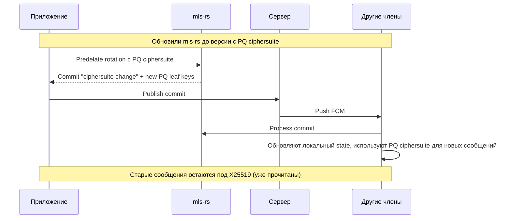
```mermaid
sequenceDiagram
    participant Т as Приложение
    participant mls as mls-rs
    participant С as Сервер
    participant peers as Другие члены

    Note over Т,peers: Обновили mls-rs до версии с PQ ciphersuite
    Т->>mls: Predelate rotation с PQ ciphersuite
    mls-->>Т: Commit "ciphersuite change" + new PQ leaf keys
    Т->>С: Publish commit
    С->>peers: Push FCM
    peers->>mls: Process commit
    peers->>peers: Обновляют локальный state, используют PQ ciphersuite для новых сообщений
    Note over Т,peers: Старые сообщения остаются под X25519 (уже прочитаны)
```

**Migration path**: MLS RFC поддерживает **на ходу** ciphersuite upgrade. Никакого re-onboarding'а. Отдельный effort — обновить UniFFI wrapper + пересобрать app.

### 19.4 Что мы решили не делать

- ❌ **Hybrid ciphersuite вручную** сейчас (X25519 + Kyber через кастомные библиотеки). Слишком сырое, mls-rs пока не поддерживает, риск ошибки высокий.
- ❌ **Signal-style Kyber upgrade** — Signal уже добавил Kyber (PQXDH 2023). Их use case: nation-state target for journalists/activists. Не наш случай. Скопируем pattern если появится в mls-rs.
- ❌ **Отдельный шифрование recovery-blob'ов PQ-safe симметрией**. Argon2id + AES-256 уже quantum-resistant. Не нужно.

### 19.5 Что закрывает наш выбор

| Задача | Решение | Готовое или наше |
|---|---|---|
| PQ-resistant KDF | Argon2id (memory-bound, quantum-resistant) — libsodium | Готовое ✅ |
| PQ-resistant симметрия | AES-256 (Grover не разрушителен) — libsodium | Готовое ✅ |
| PQ handshake (когда придёт) | MLS ciphersuite change через mls-rs (когда PQ ciphersuite войдёт в mls-rs) | Готовое ✅ (когда) |
| PQ подписи (Ed25519 → Dilithium) | MLS RFC поддерживает через ciphersuite | Готовое ✅ (когда) |
| Migration path без re-onboarding | MLS commit «ciphersuite change» | Готовое ✅ |
| Watch mls-rs для PQ | Track dependency (CANDIDATE-9 расширить: watch mls-rs PQ) | Наше (monitoring) |

**Trade-off**: короткий window 10-15 лет — уязвимость **если** противник масштабно harvest'ит сегодня. Наша ставка: нашу аудиторию (family/clinic) не harvest'ят. Если ставка не пройдёт — конкретный recovery-blob старой бабушки может быть расшифрован через 15 лет, но она уже давно этим не пользуется + там нет sensitive PII (Profile — контакты и layout).

**Записать в `docs/dev/server-roadmap.md`**: track mls-rs PQ ciphersuite release + план migration commit'а.

---

## Обновление формулы (учитывая часть Θ и Блок 19)

**Готовые библиотеки решают 90% крипто-работы + предоставляют migration path на PQ через MLS ciphersuite change без переписки нашего кода. Наш код — 10% (склеивание + UI + wire format + Firestore пути + monitoring зависимостей).**

Post-quantum угроза для нашей аудитории — **не MVP concern**. Позиция consistent с Wire, WhatsApp (они добавили PQXDH только в 2024), Matrix (roadmap 2026+). Signal — исключение, они в первой волне.

---

## Часть Ξ — Что видит сервер, что должен видеть, что скрыть можно позже

Владелец поднял два острых вопроса подряд:
- **«Сервер видит слишком много метаинформации — как сделать тупее?»**
- **«Но серверу же нужно ограничивать — 200 членов в группе, 30 групп на юзера, размер загрузки, — иначе злоумышленники сломают. Значит сервер должен что-то знать про юзера?»**

Оба верны. Это фундаментальное противоречие. Разбираем честно.

### Ξ.1 Полный список того, что сервер знает сегодня

Это **не «пара мелочей»**, это **много**:

| Что | Откуда | Насколько чувствительно |
|---|---|---|
| `stableId` каждого пользователя | Путь `/users/{stableId}/*` + Firebase UID | 🔴 Linkable к Google-аккаунту → к реальному имени |
| Количество устройств на юзера | `mls-key-packages/{deviceId}` — count | 🟡 Раскрывает: «этот юзер имеет 5 устройств» |
| Смена устройства | Новый `deviceId` появился, старый прекратил push | 🟡 Timing события — «сменил телефон 2026-05-12» |
| Список групп юзера | Пути `/users/{stableId}/mls-groups/*` + FCM topics | 🔴 «Кто с кем в group» — граф связей |
| Размер группы | Количество commits + roster (публично) | 🟡 «В этой группе 12 членов» |
| Частота активности | Timestamp'ы commits, push, edits | 🟡 «Юзер активен утром + вечером, спит с 22 до 7» |
| Тип bucket'а | Путь `/buckets/pairing-edges`, `/buckets/profile-store` | 🟡 «Юзер использует pairing feature, profile feature» |
| Размер blob'а | Firestore document size | 🟢 Небольшая утечка — «Profile ~10 KB, photo ~2 MB» |
| Recovery event | GET `/recovery-blob` без предшествующего PUT в течение суток | 🔴 «Юзер потерял устройство сейчас» |
| Pairing event | POST `/pairing-sessions/*` | 🟡 «Юзер только что кого-то спарил» |

**Итог**: сервер знает **социальный граф + временные паттерны + смены устройств**. Это **много**. Content (Profile, сообщения, фото) — зашифрован, это правильно, но **паттерны использования** видны.

### Ξ.2 Иерархия ambition (сколько скрыть, сколько стоит)

| Tier | Что скрыто | Оценка стоимости | Кто там |
|---|---|---|---|
| **T0 (наш MVP)** | Content | 0 (уже есть) | WhatsApp business, обычные family apps |
| **T1 (Matrix-tier)** | + pseudonym вместо Google UID | +2-3 месяца | Matrix, Wire |
| **T2 (Signal-tier)** | + sealed sender + анонимный auth (VOPRF) | +6-12 месяцев | Signal |
| **T3 (Threema/Tor-tier)** | + скрытые размеры (padding) + скрытый timing (cover traffic) | +12-18 месяцев | Threema PFS, Wickr |
| **T4 (paranoid)** | + zero-knowledge proofs для quotas (SNARK-level) | +18-36 месяцев | Никто в production, research |

**Наша позиция**: T0 в MVP. **Готовим port'ы так, чтобы T1 → адаптером за ~2-3 месяца**, T2+ — Phase-5+ / не строить.

**Критическая оговорка**: T1 адаптер даёт **обёртку**, но не magic. Timing (Ξ.5) остаётся видимым. Полная privacy — только T3+.

### Ξ.3 Anti-abuse — что сервер **обязан** знать, иначе умрём

Твоя поправка — самая важная. Даже в T2 (Signal) сервер знает **что-то**, иначе:

| Атака | Что должно предотвратить | Что сервер обязан знать |
|---|---|---|
| DoS storage (залил terabyte в buckets) | Квота размера per user | «Общий объём blob'ов этого юзера ≤ N» |
| DoS через миллион групп | Лимит групп на юзера | «У этого юзера ≤ 30 групп» |
| Spam pairing (100k QR sessions) | Rate limit | «Этот юзер сделал ≤ N pairing/час» |
| Group spam (пригласил 10k членов) | Лимит размера группы | «В группе X ≤ 200 членов» |
| FCM push spam | Rate limit push | «Этот юзер отправил ≤ M push/час» |
| Recovery brute-force | Rate limit + lockout | «Этот юзер сделал ≤ 5 recovery attempts/15 мин» |
| Photo upload flood | R2 квота | «Этот юзер загрузил ≤ 200 MB total» |

**Минимум который сервер обязан различать**: **«тот же самый юзер vs другой юзер»** для каждого класса запросов. Это фундаментально — без linkable pseudonym квоты не работают.

**Конкретные лимиты для нашего MVP**:

| Ресурс | Лимит | Enforcement |
|---|---|---|
| Групп на user | 30 | Firestore Rules подсчёт документов |
| Members в group | 200 | Public roster length check в Rules |
| Bucket size (один) | 5 MB | Firestore document limit (1 MB) + Worker check |
| Общий blob storage per user | 100 MB | Cloudflare KV counter |
| R2 photo total per user | 200 MB | R2 counter в отдельной KV записи |
| MLS commits per group per hour | 100 | Cloudflare Worker in-memory rate limit |
| FCM push per user per hour | 500 | Worker in-memory rate limit |
| Recovery attempts | 5/15 мин, 20/день | Cloudflare KV counter |
| Pairing sessions active | 10 per user | TTL 90 сек cleanup |
| KeyPackages в directory | 100 per device | Firestore Rules count check |

**Каждый из этих лимитов требует linkable pseudonym**. Полная анонимность — невозможна.

**Все эти лимиты записать в спеку** отдельным разделом `## Server-side quotas` (сейчас нигде нет). Записываю в `docs/dev/project-backlog.md`.

### Ξ.4 Что можно скрыть **обёрткой (адаптером)**, а что нельзя

**Можно скрыть через adapter swap (T0 → T1):**

| Что скрываем | Как | Adapter changes |
|---|---|---|
| Google UID в URL | Заменяем `stableId` на `HMAC(root_key, "server-pseudonym")` | `OwnerRef` — opaque type. Adapter вычисляет HMAC. Domain не видит. |
| Тип bucket'а в пути | Заменяем `/buckets/pairing-edges` на `/blobs/{HMAC(root_key, bucket_type)}` | `BucketKey` — opaque hash. Adapter mapping. |
| Group ID в FCM topic | Заменяем `group-{groupId}` на `topic-{HMAC(exporter_key, "push")}` | `PushTopic` — opaque. Adapter деривация. |
| Recovery-blob разоблачение | «Тот же юзер» видно через один и тот же путь. Можно rotation'ить путь: `/recovery/{HMAC(root_key, epoch)}`. | `RecoveryKey` — opaque + epoch. |

**Нельзя скрыть обёрткой (fundamental):**

| Что | Почему | Что бы потребовалось |
|---|---|---|
| Timing (когда юзер онлайн) | Push нужен реально быстро — не отложить | Cover traffic — random puшы в случайное время (24/7 battery cost). T3-tier. |
| Blob sizes (Profile ~10 KB, photo ~2 MB) | Хранить в Firestore/R2 без padding — размер виден | Padding до фикс-размера (waste storage). T3-tier. |
| Group activity rate | FCM push count | Cover traffic. T3-tier. |
| «Тот же самый юзер vs другой» | Требуется для квот (Ξ.3) | Anonymous credentials + rate-limit tokens (VOPRF). T2-tier, ~6-12 месяцев. |
| Смена устройства (event существует) | Firebase push token сменился в FCM registry | Не решается на нашем уровне — часть FCM API |

**Вывод**: T1 (pseudonym instead of Google UID) — обёрткой достигается **если port'ы сегодня правильные**. T2+ — переработка identity/auth model, не только adapter.

### Ξ.5 Как правильно спроектировать port'ы сегодня, чтобы T1 был обёрткой завтра

**Главное правило**: `stableId` **не должен утекать** в domain code кроме identity layer. Domain оперирует opaque типами.

**Плохо (сегодня в некоторых местах уже так — надо исправить):**

```
// В domain коде
val path = "/users/${user.stableId}/buckets/pairing-edges"
firestore.get(path)
```

Проблема: `stableId` попадает в другие модули. При swap на HMAC придётся править 50 файлов.

**Хорошо (что дать в port):**

```
// В domain — opaque типы
data class OwnerRef(private val internal: ByteArray)  // domain не знает содержимое
data class BucketKey(val bucketType: BucketType, val subKey: String?)  // тип известен, но path — нет

port RemoteStorage {
  suspend fun get(owner: OwnerRef, bucket: BucketKey): ByteArray?
  suspend fun put(owner: OwnerRef, bucket: BucketKey, blob: ByteArray)
  suspend fun delete(owner: OwnerRef, bucket: BucketKey)
}
```

**Adapter T0 (сегодня):**

```
class FirestoreRemoteStorageAdapter : RemoteStorage {
  override fun get(owner, bucket) {
    val stableId = owner.internalAs<String>()
    val path = "/users/$stableId/buckets/${bucket.bucketType.name}${bucket.subKey?.let { "/$it" } ?: ""}"
    return firestore.get(path)
  }
}
```

**Adapter T1 (через 2-3 месяца, только один класс меняется):**

```
class FirestoreBlindRemoteStorageAdapter(private val rootKey: RootKey) : RemoteStorage {
  override fun get(owner, bucket) {
    val pseudonym = hmac(rootKey, "server-pseudonym")
    val blobKey = hmac(rootKey, "bucket:${bucket.bucketType.name}:${bucket.subKey}")
    val path = "/blobs/$pseudonym/$blobKey"
    return firestore.get(path)
  }
}
```

**Ключевое**: **domain код не меняется вообще**. Меняется только адаптер + Firestore Rules + Worker validation.

**То же самое для остальных port'ов:**

| Port | Opaque типы | Что encapsulate |
|---|---|---|
| `RemoteStorage` | `OwnerRef`, `BucketKey` | Firestore пути buckets |
| `MlsDelivery` | `GroupRef`, `MemberRef` | Пути MLS commits + KeyPackage directory |
| `PushChannel` | `PushTopic` | FCM topic names |
| `RecoveryStore` | `RecoveryHandle` | Recovery-blob путь |
| `PairingRendezvous` | `RendezvousToken` | Pairing session ID |
| `QuotaEnforcer` | `OwnerRef`, `Resource` (enum) | Абстракция rate limit check |
| `AuthTokenProvider` | `AuthCredential` (opaque) | Firebase JWT сегодня, VOPRF token завтра |

**Стоимость сегодня**: ~2-3 дня внимательного дизайна port'ов (заслуживает того, потому что rule 2 ACL + rule 4 MVA — это как раз про такое).

**Стоимость swap на T1 через 2-3 месяца**: адаптер каждого port'а + Firestore Rules + Worker. Оценка: **2-3 недели**.

**Стоимость retrofit без port'ов сегодня**: **2-3 месяца** + риск утечь пользовательские данные во время миграции (нужно поддерживать оба пути параллельно). Порядок дороже.

### Ξ.6 Anti-abuse на разных tier'ах

**T0 (сегодня)**: сервер видит `stableId` → тривиально считать квоты в Firestore Rules + Worker KV. Всё просто.

**T1 (через 2-3 месяца, обёрткой)**: сервер видит **`pseudonym = HMAC(root_key, "server-pseudonym")`**. **Тот же самый** для одного юзера всегда → квоты считать так же (по `pseudonym` вместо `stableId`). **Работает без потерь**.

**T2 (Signal-tier)**: сервер видит **разные токены** для каждого запроса (VOPRF). Не может связать «тот же юзер». Anti-abuse через **rate-limit tokens** — юзер получает N токенов на час, серверу показывает не-linkable proof «у меня есть валидный токен». Реализация:
- Cloudflare Worker выдаёт signed токены (`RateLimitTokenIssuer`)
- Юзер собирает пул токенов заранее
- Каждый запрос — один токен, valid один раз
- Complexity: ~6 месяцев работы crypto-инженера. **Не MVP**.

**Наш путь**: T0 → T1 (через 2-3 месяца после первого paying customer'а) → **остановиться**. T2+ только если появится regulatory / paying business demand.

### Ξ.7 Что делать прямо сейчас

**Actionable** (для следующего /speckit.specify по TASK-67):

1. **Не проектировать RemoteStorage напрямую с `stableId` в path'е.** Порт принимает `OwnerRef` (opaque). Firestore adapter внутри разворачивает в `stableId`. Domain код никогда не видит plaintext ID.
2. **Не оставлять `stableId` в UI навигации, deep-link'ах, sharing формате.** Только внутри identity layer.
3. **Explicit `QuotaEnforcer` port** — не размазывать rate limits по 5 местам. Один интерфейс, adapter вызывает Cloudflare KV / Firestore Rules.
4. **Explicit `AuthTokenProvider` port** — не хардкодить Firebase JWT в каждое call site. Port возвращает opaque `AuthCredential`, adapter сегодня возвращает JWT, завтра — VOPRF token.
5. **Записать в спеку раздел `## Server-side quotas`** с таблицей из Ξ.3.
6. **Записать в `docs/dev/server-roadmap.md`**:
   - `SRV-QUOTA-001`: quota enforcement layer (Firestore Rules + Cloudflare KV).
   - `SRV-PRIV-001`: миграция T0 → T1 (pseudonym adapter swap). Когда: после первого paying customer'а или ≥ 10 000 users.
   - `SRV-PRIV-002`: миграция T1 → T2. Когда: regulatory pressure или enterprise clinic contract требует.

**Что НЕ делать сегодня** (Article XI, premature abstraction):
- ❌ Не строить VOPRF слой.
- ❌ Не строить padding / cover traffic.
- ❌ Не проектировать anonymous credentials.
- ❌ Не рефакторить существующий код на opaque types **до** TASK-67 speckit.specify (там это будет сделано с самого начала).

### Ξ.8 Честное признание

**Обёртка — не бесплатная волшебная палочка.**

- Она даёт «tier upgrade» из T0 → T1 без переписки domain.
- Она **не даёт** T2+ (там переработка identity/auth).
- Она **не** скрывает timing / sizes / activity patterns (fundamental limits transport'а).

Наша ставка на MVP: T0 достаточно для family/clinic use case. Если ставка не пройдёт — есть готовый путь на T1. За T2 сейчас не платим (нет пользы, дорого).

**Аналогия**: спрятать хранилище **за занавеской** (T0 → T1 обёрткой) — легко. Спрятать **факт что хранилище существует и что кто-то в него ходит** (T2+) — построить целый лабиринт, дорого. В MVP занавески достаточно, лабиринт — потом если понадобится.

---

## Часть Π — Anti-abuse **без чтения содержимого** (E2E-совместимый quota enforcement)

Владелец поднял правильную атаку: **«если сервер не знает что внутри — как запретить залить 100 GB? Client-side лимит = ноль защиты, клиента можно пропатчить»**.

Это стандартная дилемма E2E-систем. Решается **давно** — WhatsApp / Signal / iCloud E2E используют один и тот же pattern. Ключевая мысль:

> Серверу **не нужно знать что** ты загружаешь, чтобы enforce'ить **сколько** ты загружаешь.

Сервер проверяет **байты**, а не **смысл**. Это работает.

### Π.1 Что можно проверить, не расшифровывая

| Что проверяем | Как | E2E нарушается? |
|---|---|---|
| Размер одного blob'а (≤ 5 MB) | Content-Length header + R2 native max_size на upload URL | ❌ Нет |
| Total storage per user (≤ 200 MB photo + 100 MB buckets) | Counter в Cloudflare KV, увеличиваем при PUT | ❌ Нет |
| Uploads per hour (≤ 20 photo/hour) | Rate limit counter per pseudonym | ❌ Нет |
| Файлов на юзера (≤ 5000) | Counter | ❌ Нет |
| Auth: этот запрос от валидного юзера в группе | Firebase JWT + roster check | ❌ Нет |
| Blob не duplicate (тот же content hash) | Server может опционально dedup по hash — **но это утечка**! Если два юзера загрузили одинаковый файл — сервер знает. Не делаем в MVP. | ⚠️ Утечка, отказываемся |

**Что НЕ можем проверить (fundamental E2E limit):**

| Что | Почему не можем |
|---|---|
| Тип файла (photo vs video vs archive) | Encrypted — magic bytes скрыты |
| Содержимое (CSAM, terrorism, копирайт) | Encrypted — не видим |
| Malware внутри | Encrypted — не сканируем |
| Соответствует ли пользовательскому use case | Не наше дело — как WhatsApp не проверяет что ты шлёшь |

Это **осознанный trade-off** — та же позиция, что у Signal / WhatsApp / iMessage. Мы **проактивно не сканируем**, но реагируем на **abuse reports** (см. Π.5).

### Π.2 Pattern — Signed Upload Tokens (WhatsApp / Signal / R2)

Механизм: **клиент не может напрямую писать в R2**. Каждый upload требует **signed token** от нашего Worker'а. Worker выдаёт token **только если квота позволяет**.

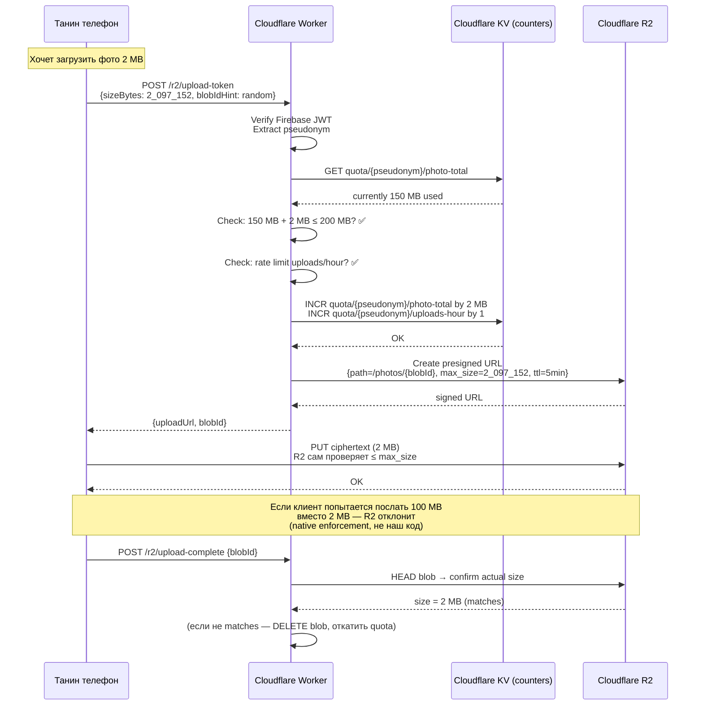
```mermaid
sequenceDiagram
    participant Т as Танин телефон
    participant W as Cloudflare Worker
    participant KV as Cloudflare KV (counters)
    participant R2 as Cloudflare R2

    Note over Т: Хочет загрузить фото 2 MB
    Т->>W: POST /r2/upload-token<br/>{sizeBytes: 2_097_152, blobIdHint: random}
    W->>W: Verify Firebase JWT<br/>Extract pseudonym

    W->>KV: GET quota/{pseudonym}/photo-total
    KV-->>W: currently 150 MB used

    W->>W: Check: 150 MB + 2 MB ≤ 200 MB? ✅
    W->>W: Check: rate limit uploads/hour? ✅

    W->>KV: INCR quota/{pseudonym}/photo-total by 2 MB<br/>INCR quota/{pseudonym}/uploads-hour by 1
    KV-->>W: OK

    W->>R2: Create presigned URL<br/>{path=/photos/{blobId}, max_size=2_097_152, ttl=5min}
    R2-->>W: signed URL
    W-->>Т: {uploadUrl, blobId}

    Т->>R2: PUT ciphertext (2 MB)<br/>R2 сам проверяет ≤ max_size
    R2-->>Т: OK

    Note over Т,R2: Если клиент попытается послать 100 MB<br/>вместо 2 MB — R2 отклонит<br/>(native enforcement, не наш код)

    Т->>W: POST /r2/upload-complete {blobId}
    W->>R2: HEAD blob → confirm actual size
    R2-->>W: size = 2 MB (matches)
    W->>W: (если не matches — DELETE blob, откатить quota)
```

**Что здесь работает**:

1. **Клиент патченный не поможет**. R2 презентует upload URL с `max_size=2_097_152` (2 MB). Если клиент попробует послать больше — R2 сам обрежет / отклонит. Cloudflare native enforcement, не наш код.
2. **Квота проверяется до выдачи token'а**. Если у юзера 200 MB заняты — Worker отказывает: `HTTP 429 Quota Exceeded`. Клиент не может обойти — token'а нет, upload URL нет.
3. **Rate limit тоже enforced на Worker'е**. Не in-memory только (Cloudflare Workers stateless), а через KV counter с TTL.
4. **Post-upload verify** — Worker после upload'а проверяет `HEAD blob → actual size`. Если клиент как-то обманул R2 (например, retry attack) — детектим mismatch, удаляем blob, откатываем quota. Двойная защита.

**Кто у нас так делает**:
- **WhatsApp media**: клиент запрашивает upload URL у их backend, backend возвращает S3 presigned URL с ограничением ~100 MB per file.
- **Signal attachments**: аналогично — signed upload token, размер limited на CDN уровне.
- **iCloud Backup E2E**: Apple server выдаёт chunked upload slots, каждый ≤ 4 MB.
- **iMessage media**: Apple CDN native size limit.

Все они **не читают content**. Все они enforce'ят **байты через presigned URLs**.

### Π.3 Как считать квоты правильно (Cloudflare-specific)

**Cloudflare KV** — eventually consistent (60 сек propagation across regions). Значит гоночное условие: два запроса на upload могут одновременно пройти проверку, увеличив quota выше лимита на несколько MB.

**Решения**:

1. **Cloudflare Durable Objects** (правильный путь для counter'а):
   - Single-region single-instance counter, strong consistency.
   - Каждый юзер → свой Durable Object → атомарный `check_and_increment`.
   - Стоимость: ~$0.20 / million requests. Мизер.
   - **Записать в TASK-67 / SRV-QUOTA-001**.

2. **Firestore transaction** (fallback если Durable Objects не устроят):
   - `runTransaction { check quota; increment; return token }`.
   - Strong consistency, но задержка ~200 ms vs 20 ms KV.

3. **KV с over-allocation buffer** (worst option, но простой):
   - Лимит 200 MB → внутренний threshold 195 MB. Гоночное условие → максимум 205 MB. Приемлемо.
   - Не используем — слишком грязно.

**Наш выбор для MVP: Durable Objects per user**. Один DO инстанс = одна пара (`{pseudonym, resource_type}`) → counter внутри. Атомарный check + increment.

### Π.4 Полная таблица лимитов + enforcement механизм

Обновлённая таблица из Ξ.3 с указанием **как** enforce'им:

| Ресурс | Лимит | Механизм | Bypass возможен? |
|---|---|---|---|
| Photo upload single | 5 MB | R2 presigned URL max_size | ❌ Native R2 enforcement |
| Photo total per user | 200 MB | Durable Object counter + presigned URL | ❌ Token не выдастся |
| Photo uploads / hour | 20 | Durable Object rate limiter | ❌ 429 отказ |
| Buckets total per user | 100 MB | Firestore Rules `size < X` check | ❌ Rules native |
| Bucket single doc | 5 MB | Firestore hard limit 1 MB / doc + Worker enforcement | ❌ Firestore native |
| Groups per user | 30 | Firestore Rules `count() < 30` | ❌ Rules native |
| Members per group | 200 | Firestore Rules `roster.length <= 200` | ❌ Rules native |
| MLS commits / group / hour | 100 | Durable Object counter per group | ❌ 429 отказ |
| FCM push / user / hour | 500 | Durable Object counter | ❌ 429 отказ |
| Recovery attempts | 5 / 15min | Durable Object counter + lockout state | ❌ Локаут независимо от клиента |
| Pairing sessions active | 10 | TTL 90 сек в Firestore + count check | ❌ Session Rules |
| KeyPackages per device | 100 | Firestore Rules count | ❌ Rules |

**Все enforcement — server-side native**. Клиента патчить бесполезно.

### Π.5 Что мы **не** делаем (принципиально)

- ❌ **Client-side scanning содержимого** перед encrypt'ом (Apple CSAM 2021 попытка). Нарушает E2E, вызвало community outcry. Не делаем.
- ❌ **Server-side content inspection**. Не можем (encrypted) — и не хотим (нарушает E2E).
- ❌ **Deduplication по hash content'а**. Утечка «два юзера загрузили одинаковый файл» — приемлемая утечка для storage экономии, но нам не критично. Не делаем.
- ❌ **Backdoor keys для «lawful access»**. Никогда.
- ❌ **Отправка metadata на 3rd party analytics** (Google Analytics в crypto-flows). Cloudflare сам логирует edge traffic — это документированный минимум.

### Π.6 Illegal content risk + response mechanism

**Реальность**: E2E-система может хранить нелегальный контент (CSAM, terrorism), мы не видим. То же самое у Signal, WhatsApp, iCloud E2E. Стандартная позиция:

**Legal**: E2E-провайдер **не** несёт ответственности за контент который **не может видеть** (established precedent, US Section 230; EU CSAM Regulation в 2026 evolving — watch). Однако:

**Response mechanism** (обязателен для legal compliance):

1. **Abuse report UI** — в приложении кнопка «Report abuse» для контента, который **юзер видел** (т.е. в группе). Report содержит: `blobId`, `groupId`, timestamp.
2. **Server delete on report** — Worker удаляет blob по `blobId` независимо от того что внутри. Хеш `blobId` → block list (нельзя загрузить снова).
3. **Rate limit reports** — иначе злоумышленник может report'ить чужой legitimate контент.
4. **Log reports** — для legal audit, если запросят.

**Что записать в TASK-67**: раздел `## Abuse response mechanism`. Даже в MVP.

### Π.7 Actionable для TASK-67 и R2 integration

**Новые port'ы для добавления**:

```
port BlobStorage {
  suspend fun requestUploadSlot(
    owner: OwnerRef,
    kind: BlobKind,  // photo, backup, attachment
    sizeBytes: Long
  ): UploadSlot  // содержит presigned URL + blobId + TTL
  
  suspend fun confirmUpload(slot: UploadSlot): Result<BlobRef>
  
  suspend fun download(blob: BlobRef): ByteArray
  
  suspend fun reportAbuse(blob: BlobRef, reporter: OwnerRef, reason: String)
}

port QuotaEnforcer {
  suspend fun checkAndReserve(
    owner: OwnerRef,
    resource: Resource,
    amount: Long
  ): Result<Reservation>
  
  suspend fun release(reservation: Reservation)  // если операция отменена
  suspend fun confirm(reservation: Reservation)  // commit
}
```

**Firestore Rules додумать** (записать в спеку):
- `size` check на bucket documents.
- `count()` check на collections.
- `roster.length <= 200` на group create/update.

**Cloudflare Worker endpoints добавить** (TASK-67 или отдельный TASK):
- `POST /r2/upload-token` — check quota, выдать presigned URL.
- `POST /r2/upload-complete` — confirm actual size, adjust quota.
- `POST /r2/report-abuse` — delete blob + block hash.
- `POST /fcm/push` — уже есть (TASK-5), добавить rate limit через Durable Object.

**Cloudflare Durable Objects** — новая инфраструктура. Спека `docs/dev/server-roadmap.md`:
- `SRV-QUOTA-002`: Durable Objects per (pseudonym, resource) для strong consistency counters.
- `SRV-ABUSE-001`: abuse report ingestion + blob hash blocklist.

### Π.8 Итог по anti-abuse

**Твоя интуиция правильна**: client-side лимиты бесполезны. **Но server МОЖЕТ enforce'ить квоты не читая содержимое** — через presigned upload URLs с native size limits (Cloudflare R2 / Firestore Rules / Durable Objects). Все крупные E2E-системы делают именно так.

**Правильная позиция**:
- **Байты** — сервер enforce'ит, все лимиты работают.
- **Смысл** — сервер не знает, не хочет знать.
- **Abuse response** — reactive через reports + hash blocklist.

**Наш 10% кода** (см. Δ.11) добавляется quota-enforcement логика: presigned URL issuance + Durable Object counters + abuse report handler. Оценка: **1-2 недели** имплементации. Готовое: Cloudflare R2 native size limits, Firestore Rules size/count checks, Durable Objects primitive.

**Записываем в backlog**: TASK-67 addition для BlobStorage + QuotaEnforcer + AbuseReport. Плюс `docs/dev/server-roadmap.md` для SRV-QUOTA-002 и SRV-ABUSE-001.

---

## Часть Ρ — Клиентская трансформация до шифрования (WhatsApp pattern)

Владелец задал важный вопрос: **«В WhatsApp видео сжимается — значит Meta видит содержимое?»** и вспомнил правильно: **WhatsApp — E2E, Telegram — не E2E по умолчанию**. Разбираем механику, потому что мы копируем именно WhatsApp-паттерн для нашего family album (Блок 10) и любых будущих медиа.

### Ρ.1 Фактология

| Мессенджер | E2E по умолчанию? | Кто видит содержимое? |
|---|---|---|
| **WhatsApp** (личные + группы) | ✅ Да, с 2016 (Signal Protocol) | Только участники |
| **WhatsApp Business API** (B2B каналы компаний) | ❌ Нет | Meta видит |
| **Signal** | ✅ Всегда | Только участники |
| **iMessage** (Apple ↔ Apple) | ✅ Да | Только участники (+ иногда iCloud backup если включён) |
| **Telegram Secret Chats** (только 1-на-1) | ✅ Да | Только участники |
| **Telegram обычные чаты** (в том числе группы) | ❌ Нет | Telegram staff технически может |
| **Discord / Slack / Teams** | ❌ Нет | Провайдер видит |

Твоя интуиция «WhatsApp E2E, Telegram — нет» — **точная**. Одна оговорка: **групповые чаты в Telegram никогда не E2E**, даже включив «Secret Chats» — это только 1-на-1.

### Ρ.2 Как WhatsApp обрабатывает видео (compression + encryption)

Ты предположил два варианта — «видит» или «временно видит, потом шифрует и удаляет». **Оба неверны**. Правильный ответ:

> **Compress → Encrypt → Upload**, всё **на устройстве отправителя**. До сервера ничего plaintext'ного не доходит **никогда**.

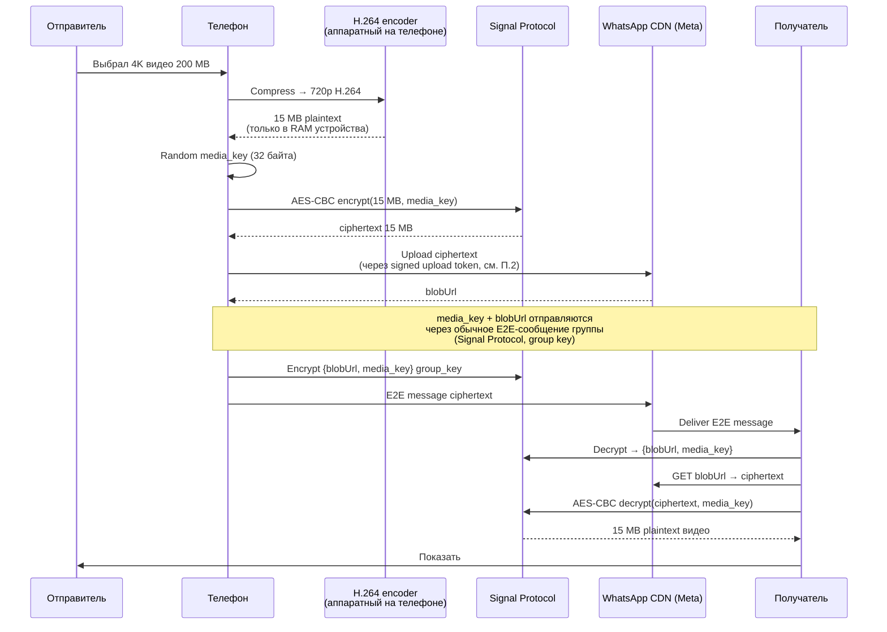
```mermaid
sequenceDiagram
    participant Ч as Отправитель
    participant Т as Телефон
    participant enc as H.264 encoder<br/>(аппаратный на телефоне)
    participant lib as Signal Protocol
    participant CDN as WhatsApp CDN (Meta)
    participant П as Получатель

    Ч->>Т: Выбрал 4K видео 200 MB
    Т->>enc: Compress → 720p H.264
    enc-->>Т: 15 MB plaintext<br/>(только в RAM устройства)
    Т->>Т: Random media_key (32 байта)
    Т->>lib: AES-CBC encrypt(15 MB, media_key)
    lib-->>Т: ciphertext 15 MB
    Т->>CDN: Upload ciphertext<br/>(через signed upload token, см. Π.2)
    CDN-->>Т: blobUrl

    Note over Т,П: media_key + blobUrl отправляются<br/>через обычное E2E-сообщение группы<br/>(Signal Protocol, group key)
    Т->>lib: Encrypt {blobUrl, media_key} group_key
    Т->>CDN: E2E message ciphertext
    CDN->>П: Deliver E2E message
    П->>lib: Decrypt → {blobUrl, media_key}
    П->>CDN: GET blobUrl → ciphertext
    П->>lib: AES-CBC decrypt(ciphertext, media_key)
    lib-->>П: 15 MB plaintext видео
    П->>Ч: Показать
```

**Ключевые моменты**:

1. **Компрессия — на устройстве отправителя**. Аппаратный H.264/HEVC encoder любого современного телефона делает это за секунды. Meta не участвует.
2. **Meta никогда не видит plaintext**. Ни в памяти сервера, ни на CDN, ни временно. Ciphertext поступает уже зашифрованным.
3. **`media_key` — random, генерируется клиентом**. Отправляется получателям через обычный E2E-канал (тот же group key что и текстовые сообщения). Meta видит только ciphertext сообщения, ключа не знает.
4. **CDN хранит только ciphertext**. TTL ~30 дней. Автоматическое expire.
5. **HD photo toggle** (WhatsApp 2023) — просто клиентское решение сжимать меньше. Механизм тот же.

### Ρ.3 Trade-off: чего мы теряем из-за client-side compression

| Что нельзя делать | Почему нельзя | Что делают вместо |
|---|---|---|
| Server-side transcoding (пересжать под получателя) | Сервер не видит plaintext | Отправитель делает все версии клиентом |
| Adaptive bitrate streaming (HLS/DASH) | Требует segments на сервере | Fallback на прогрессивную загрузку целого файла |
| Multiple quality variants (SD/HD/4K) | Сервер не может генерить | Отправитель делает 2-3 версии сам, шифрует каждую |
| Server-side thumbnail | Не видит plaintext | Отправитель генерирует thumbnail на клиенте, шифрует отдельно |
| Auto content moderation (CSAM detection) | Не видит | Reactive через abuse reports (см. Π.6) |
| Preview на server side (message list) | Не видит | Encrypted thumbnail в metadata сообщения |

**Для нашего use case** (family album, contact photos, SOS video): всё это **не проблема**. Family album — фото ≤ 5 MB, SOS video ≤ 30 MB. Adaptive streaming не нужен — мы не Netflix.

**Что стоит копировать у WhatsApp**:
- ✅ Compress client-side до encrypt (H.264/JPEG encoder на устройстве).
- ✅ Отдельный `media_key` per blob (не group key напрямую). Экономия: **membership change не требует re-encrypt фото**.
- ✅ Thumbnail отдельным encrypted blob'ом.
- ✅ Signed upload token (Π.2).

### Ρ.4 Обновление Блока 10 (family album) с учётом WhatsApp-паттерна

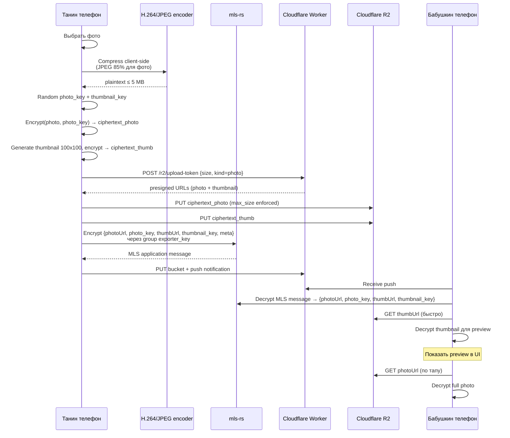
```mermaid
sequenceDiagram
    participant Т as Танин телефон
    participant enc as H.264/JPEG encoder
    participant mls as mls-rs
    participant W as Cloudflare Worker
    participant R2 as Cloudflare R2
    participant Б as Бабушкин телефон

    Т->>Т: Выбрать фото
    Т->>enc: Compress client-side<br/>(JPEG 85% для фото)
    enc-->>Т: plaintext ≤ 5 MB

    Т->>Т: Random photo_key + thumbnail_key
    Т->>Т: Encrypt(photo, photo_key) → ciphertext_photo
    Т->>Т: Generate thumbnail 100x100, encrypt → ciphertext_thumb

    Т->>W: POST /r2/upload-token {size, kind=photo}
    W-->>Т: presigned URLs (photo + thumbnail)
    Т->>R2: PUT ciphertext_photo (max_size enforced)
    Т->>R2: PUT ciphertext_thumb

    Т->>mls: Encrypt {photoUrl, photo_key, thumbUrl, thumbnail_key, meta}<br/>через group exporter_key
    mls-->>Т: MLS application message
    Т->>W: PUT bucket + push notification

    Б->>W: Receive push
    Б->>mls: Decrypt MLS message → {photoUrl, photo_key, thumbUrl, thumbnail_key}
    Б->>R2: GET thumbUrl (быстро)
    Б->>Б: Decrypt thumbnail для preview
    Note over Б: Показать preview в UI
    Б->>R2: GET photoUrl (по тапу)
    Б->>Б: Decrypt full photo
```

**Что здесь важно**:

- **`photo_key` — не производный от `exporter_key`, а random per-blob**. Причина: **membership change не требует re-encrypt фото**. Если добавили Петю в группу — он получит MLS Welcome → расшифрует новые сообщения → узнает `photo_key` из них (сообщения содержат key) → скачает и расшифрует старое фото. `exporter_key` меняется, ключ фото — нет.
- **Thumbnail отдельным blob'ом с отдельным ключом**. Preview быстрый, полный photo — по тапу.
- **Client-side compression до encrypt**. Не пытаемся сжать server-side (нельзя в E2E).

### Ρ.5 Для запоминания

- **WhatsApp — E2E**, Telegram обычные чаты — **не E2E**. Ты правильно помнишь.
- **Сервер никогда не видит plaintext**, ни временно, ни на CDN. Compress → encrypt → upload — всё на клиенте.
- **Random `media_key` per blob**, отправляется через group E2E channel. Membership change не требует re-encrypt.
- **Цена**: нет server-side transcoding / adaptive streaming / thumbnails. Всё на клиенте отправителя. Для family album / SOS — не проблема.
- **Мы копируем этот pattern** для Блока 10 и любых будущих медиа-фич.

---

## Блок 20 — History backup при recovery (Q-09 decision)

### 20.1 Простыми словами

MLS forward secrecy = новое устройство после recovery **не может** расшифровать сообщения / фото, отправленные **до** его вступления в группу. Это математика протокола, не bug.

**Три подхода в индустрии**:
- **Signal**: нет истории после recovery. Явное предупреждение в UX. История — только device-local, backup — только device-to-device sync.
- **WhatsApp** (с 2021): E2E-encrypted local DB (SQLCipher) + backup в iCloud/Google Drive. Ключ backup'а — либо derived от пароля (простое), либо отдельный 64-digit код (безопаснее).
- **Гибрид**: MVP как Signal, upgrade как WhatsApp позже.

### 20.2 Решение

**MVP: Signal-style — история недоступна после recovery.**

Восстанавливается только **Profile state** (контакты, тайлы, layout, темы) через MLS bucket sync (Δ.2). Messages / photos / audit log отправленные до recovery — потеряны для нового устройства.

**Setup wizard явно предупреждает** пользователя при onboarding'е (формулировка — тактический вопрос для /speckit.clarify TASK-67, отслеживается Q-21).

**Phase-3+: WhatsApp-style E2E backup будет продуман отдельной задачей** когда будем строить messenger (TASK-27) и full family album (TASK-28). Подход по аналогии с WhatsApp E2E backup 2021+ — encrypted local DB + backup в iCloud/Drive/наш R2 с отдельным 64-digit code или passphrase-derived ключом (decision дефер).

### 20.3 Rationale (почему не строим сейчас)

**Article XX (Pre-MVP no-migration override)** снимает обычные exit-ramp обязательства. До первых реальных пользователей:
- HKDF context strings — cheap, добавляются позже без миграции (`HKDF(root_key, "history-backup-v1")` через год = ноль стоимости сегодня).
- Wire format сообщений — greenfield до messenger'а. Строим когда строим messenger.
- KeyPackage retention policy — конфиг cleanup job'а, меняется на лету.

**Ничего в код сегодня не добавляется** ради Phase-3 backup'а. Никаких «зарезервированных slot'ов», никаких TODO-комментариев в rootkey hierarchy.

### 20.4 Что зафиксировано (единственная non-technical дверь)

**User expectation management** при первом recovery:
- Не обещать «backup появится в будущем» (может не сдержим слово).
- Не молчать (первый recovery = «где моя переписка?» → отток).
- **Явно сказать в wizard'е**: «На новом устройстве история чатов не восстанавливается. Контакты и настройки — сохранятся.»

Точная формулировка — тактический вопрос Q-21 для /speckit.clarify TASK-67.

### 20.5 Что закрывает наш выбор

| Задача | Решение | Готовое или наше |
|---|---|---|
| Profile recovery | MLS bucket sync через recovery envelope (Δ.2) | Готовое ✅ |
| Явное предупреждение в wizard'е | Наш UX text | Наше |
| History backup implementation | Отложено на Phase-3+ (TASK-27 + TASK-28) | — |
| Exit ramp записать | `docs/dev/server-roadmap.md` → пункт «HIST-BACKUP-001: E2E encrypted history backup, аналог WhatsApp 2021». | Наше (одна строка) |
