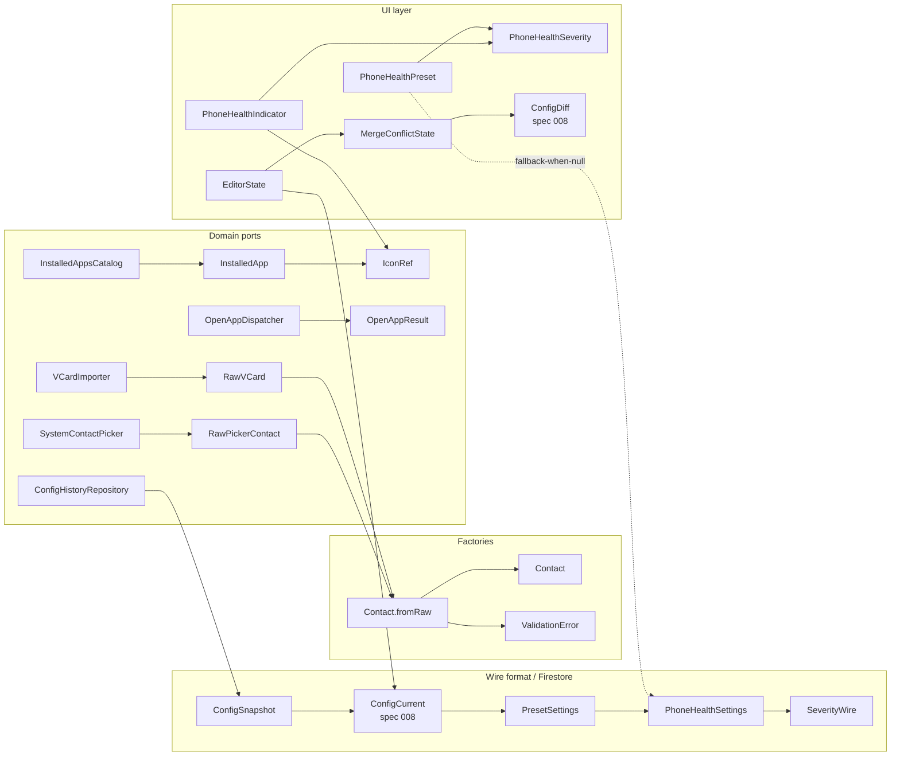

# Data Model: Spec 009 — Admin Mode Flows

**Date**: 2026-05-15
**Spec**: [spec.md](spec.md)
**Plan**: [plan.md](plan.md)

Domain + UI types introduced (or extended) by spec 009. Domain types live in
`core/src/commonMain/kotlin/com/launcher/api/`; UI types live в
`core/src/commonMain/kotlin/com/launcher/ui/`. All wire-bound types carry an
explicit `schemaVersion` per CLAUDE.md rule 5.

This document covers **14 types** — 10 domain (8 new + 2 extensions) and 4 UI.

---

## Domain layer (`core/src/commonMain/kotlin/com/launcher/api/`)

### 1. `Contact.fromRaw()` factory — extension (FR-026, FR-028)

**File**: `api/config/Contact.kt` (extend existing data class with companion factory).

Pure validation factory used by the system contact picker (FR-024), vCard
importer (FR-028), and manual-entry form (FR-026). No I/O — input is already
materialised raw strings; failure modes are categorical (per ux-quality CHK011).

```kotlin
@Serializable
data class Contact(
    val id: ElementId,
    val displayName: String,
    val phoneNumber: String,
    val photoRef: String? = null,
) {
    companion object {
        const val MAX_NAME_LENGTH = 100
        private val PHONE_REGEX = Regex("^\\+?\\d{5,20}$")
        private val PHONE_STRIP_REGEX = Regex("[\\s\\-().]")

        /**
         * Build a Contact from raw user / picker / vCard input.
         *
         * Pipeline:
         *  1. `rawName` — trim + strip ASCII control chars (U+0000..U+001F, U+007F) →
         *     non-empty → ≤ 100 Unicode code points.
         *  2. `rawPhone` — strip whitespace, dashes, parens, dots →
         *     match `^\+?\d{5,20}$`.
         *
         * Pure. No I/O. Idempotent.
         */
        fun fromRaw(
            rawName: String,
            rawPhone: String,
            id: ElementId = ElementId.random(),
        ): Result<Contact, ValidationError> = ...
    }
}
```

| Field          | Type        | Invariant                                                |
|----------------|-------------|----------------------------------------------------------|
| `displayName`  | `String`    | Non-empty after sanitisation; ≤ 100 Unicode code points  |
| `phoneNumber`  | `String`    | Matches `^\+?\d{5,20}$` after stripping separators       |
| `id`           | `ElementId` | UUID v4 — reused from spec 008                           |

**Source FR**: FR-024, FR-026, FR-028.

---

### 2. `ValidationError` sealed type — new (FR-026)

**File**: `api/config/Contact.kt` (co-located with `Contact`).

Categorical error model for `Contact.fromRaw()` failures. Enum-shaped — UI maps
each variant to a localised Russian message via `R.string.contact_error_*`.

```kotlin
sealed interface ValidationError {
    data object NameEmpty : ValidationError
    data class NameTooLong(val actual: Int, val max: Int = Contact.MAX_NAME_LENGTH) : ValidationError
    data class NameInvalid(val reason: String) : ValidationError
    data object PhoneEmpty : ValidationError
    data class PhoneInvalid(val reason: String) : ValidationError
}
```

| Variant         | When                                                       |
|-----------------|------------------------------------------------------------|
| `NameEmpty`     | Trimmed `rawName` is empty                                 |
| `NameTooLong`   | Sanitised name > 100 code points                           |
| `NameInvalid`   | Sanitisation removed *all* content (e.g. only control chars) |
| `PhoneEmpty`    | Stripped `rawPhone` is empty                               |
| `PhoneInvalid`  | Does not match `^\+?\d{5,20}$`                             |

**Source FR**: FR-026, FR-028 (vCard surfaces same error type).

---

### 3. `ConfigSnapshot` — new wire format (FR-036)

**File**: `api/config/ConfigSnapshot.kt`.

Immutable historical record of a `/config/current` state — written every time
an admin pushes from EditorScreen. Persisted in Firestore subcollection
`/links/{linkId}/configHistory/{autoId}`. Pure data; no behaviour.

```kotlin
@Serializable
data class ConfigSnapshot(
    val snapshotSchemaVersion: Int = SUPPORTED_SNAPSHOT_SCHEMA_VERSION,
    val config: ConfigCurrent,            // spec 008 type — carries own schemaVersion
    val recordedAt: Long,                  // epoch millis (server-side `serverTimestamp()` mapped on read)
    val recordedFromDeviceId: String,
) {
    companion object {
        const val SUPPORTED_SNAPSHOT_SCHEMA_VERSION: Int = 1
    }
}
```

| Field                   | Type            | Invariant                              |
|-------------------------|-----------------|----------------------------------------|
| `snapshotSchemaVersion` | `Int`           | ≥ 1; reader does NOT throw on > 1 (FR-043 carried fwd) |
| `config`                | `ConfigCurrent` | `config.schemaVersion ≥ 1`             |
| `recordedAt`            | `Long`          | > 0                                    |
| `recordedFromDeviceId`  | `String`        | Non-empty                              |

**Source FR**: FR-036, FR-037, FR-038, FR-040.

---

### 4. `PresetSettings` — new, forward-compat (FR-013)

**File**: `api/config/PresetSettings.kt`.

Placeholder root for future per-preset overrides. **All fields are null в спеке
9** — type exists today only so adding non-null values в спеке 12 doesn't bump
schema version (additive read per FR-043).

```kotlin
@Serializable
data class PresetSettings(
    val phoneHealthSettings: PhoneHealthSettings? = null,
)
```

| Field                 | Type                    | Invariant                              |
|-----------------------|-------------------------|----------------------------------------|
| `phoneHealthSettings` | `PhoneHealthSettings?`  | Always `null` в спеке 9; non-null reserved for spec 012 |

**Source FR**: FR-013 (forward-compat seam).

---

### 5. `PhoneHealthSettings` — new, forward-compat (FR-021)

**File**: `api/config/PhoneHealthSettings.kt`.

Wire-format projection of `PhoneHealthPreset` (UI type, see §13). Lives in
domain layer because it appears в `/config/current` payload (forward-compat;
not actually written в спеке 9). `SeverityWire` is a **separate enum from UI**
`PhoneHealthSeverity` — wire / UI separation per CLAUDE.md rule 1.

```kotlin
@Serializable
data class PhoneHealthSettings(
    val batteryWarningPercent: Int,
    val batteryCriticalPercent: Int,
    val lastSeenWarningHours: Int,
    val lastSeenCriticalHours: Int,
    val audioMutedSeverity: SeverityWire,
    val connectivityNoneSeverity: SeverityWire,
    val updateCadenceInfoSec: Int,
    val pushAdminOnCritical: Boolean,
)

@Serializable
enum class SeverityWire(val wireValue: String) {
    Info(wireValue = "info"),
    Warning(wireValue = "warning"),
    Critical(wireValue = "critical"),
}
```

| Field                       | Type         | Invariant                                     |
|-----------------------------|--------------|-----------------------------------------------|
| `batteryWarningPercent`     | `Int`        | 0..100, must be > `batteryCriticalPercent`    |
| `batteryCriticalPercent`    | `Int`        | 0..100                                        |
| `lastSeenWarningHours`      | `Int`        | ≥ 0, < `lastSeenCriticalHours`                |
| `lastSeenCriticalHours`     | `Int`        | ≥ 1                                           |
| `audioMutedSeverity`        | `SeverityWire` | closed enum, fail-closed on unknown wire    |
| `connectivityNoneSeverity`  | `SeverityWire` | closed enum                                 |
| `updateCadenceInfoSec`      | `Int`        | ≥ 5                                           |
| `pushAdminOnCritical`       | `Boolean`    | —                                             |

**Default behaviour**: `null` field в `/config` означает «use defaults from
`DEFAULT_PHONE_HEALTH_PRESET` in code» (UI type, see §13).

**Source FR**: FR-019, FR-021.

---

### 6. `ConfigHistoryRepository` — new port (FR-037, FR-038, FR-040)

**File**: `api/history/ConfigHistoryRepository.kt`.

Port owning the snapshot subcollection. Real adapter
(`FirestoreConfigHistoryRepository` in `androidMain`) wraps Firestore
`CollectionReference`; fake adapter (`InMemoryConfigHistoryRepository` in
`commonTest`) uses sorted in-memory list.

```kotlin
interface ConfigHistoryRepository {
    suspend fun recordSnapshot(
        linkId: LinkId,
        snapshot: ConfigSnapshot,
    ): Result<Unit, RepositoryError>

    /** Returns snapshots sorted by `recordedAt` DESC (newest first). */
    suspend fun readAll(
        linkId: LinkId,
    ): Result<List<ConfigSnapshotWithId>, RepositoryError>

    /** Keep newest `retentionCount`; delete the rest. Idempotent. */
    suspend fun housekeep(
        linkId: LinkId,
        retentionCount: Int = DEFAULT_RETENTION_COUNT,
    ): Result<Unit, RepositoryError>

    companion object {
        const val DEFAULT_RETENTION_COUNT: Int = 10
    }
}

data class ConfigSnapshotWithId(
    val autoId: String,
    val snapshot: ConfigSnapshot,
)

sealed interface RepositoryError {
    data class BackendUnavailable(val cause: Throwable?) : RepositoryError
    data class PermissionDenied(val reason: String) : RepositoryError
    data class Corrupt(val cause: Throwable) : RepositoryError
}
```

| Method            | FR        | Notes                                                       |
|-------------------|-----------|-------------------------------------------------------------|
| `recordSnapshot`  | FR-036    | Called on every successful EditorScreen push                |
| `readAll`         | FR-037    | Backs the history viewer screen                             |
| `housekeep`       | FR-038    | Run after `recordSnapshot` (best-effort, errors swallowed)  |

**Source FR**: FR-036, FR-037, FR-038, FR-040.

---

### 7. `InstalledAppsCatalog` — new port (FR-034)

**File**: `api/apps/InstalledAppsCatalog.kt`.

Port over Android `PackageManager.queryIntentActivities(ACTION_MAIN /
CATEGORY_LAUNCHER)`. Domain side sees only `InstalledApp`; vendor type
(`ResolveInfo`, `Drawable`) lives in `androidMain` adapter.

```kotlin
interface InstalledAppsCatalog {
    suspend fun listApps(): List<InstalledApp>
}

data class InstalledApp(
    val packageName: String,
    val label: String,
    val iconResource: IconRef?,
)

/**
 * Port-friendly icon reference. Adapter resolves to `Drawable` /
 * `ImageBitmap`. Domain MUST NOT depend on `android.graphics.*`
 * (CLAUDE.md rule 1).
 */
@Serializable
data class IconRef(
    val packageName: String,
    val resourceId: Int,
)
```

| Field          | Type        | Invariant                          |
|----------------|-------------|------------------------------------|
| `packageName`  | `String`    | Non-empty, valid Android pkg name  |
| `label`        | `String`    | Non-empty                          |
| `iconResource` | `IconRef?`  | `null` ⇒ adapter shows fallback    |

**Source FR**: FR-034.

---

### 8. `SystemContactPicker` — new port (FR-024)

**File**: `api/contacts/SystemContactPicker.kt`.

Suspendable wrapper over `ActivityResultContracts.PickContact`. Result is a
domain projection — adapter resolves `ContactsContract` Cursor / URI, never
leaks them upward.

```kotlin
interface SystemContactPicker {
    suspend fun pickContact(): Result<RawPickerContact, PickError>
}

data class RawPickerContact(
    val displayName: String,
    val phoneNumbers: List<String>,
)

sealed interface PickError {
    data object UserCancelled : PickError
    data object PermissionDenied : PickError
    data class Other(val cause: Throwable) : PickError
}
```

| Field           | Type           | Invariant                                  |
|-----------------|----------------|--------------------------------------------|
| `displayName`   | `String`       | Raw — passed to `Contact.fromRaw()` for normalisation |
| `phoneNumbers`  | `List<String>` | May be empty; UI prompts user to pick one  |

**Source FR**: FR-024.

---

### 9. `VCardImporter` — new port (FR-028)

**File**: `api/contacts/VCardImporter.kt`.

Parses RFC 6350 vCard 3.0/4.0 payloads. Adapter
(**hand-written parser ~100 LOC, FN + TEL only — НЕ `ezvcard` library**, чтобы не leak vendor SDK типы в domain per CLAUDE.md rule 1) lives in `androidMain`. Domain sees only `RawVCard`. См. [contracts/vcard-incoming.md](contracts/vcard-incoming.md) + [research.md R-008](research.md).

```kotlin
interface VCardImporter {
    suspend fun parse(payload: ByteArray): Result<RawVCard, ImportError>
}

data class RawVCard(
    val displayName: String,
    val phoneNumbers: List<String>,
)

sealed interface ImportError {
    data class PayloadTooLarge(val sizeBytes: Long, val maxBytes: Long) : ImportError
    data object NonUtf8 : ImportError
    data object MissingFn : ImportError       // no FN/N field
    data object MissingTel : ImportError      // no TEL field
    data class MalformedVCard(val reason: String) : ImportError
}
```

| Field           | Type           | Invariant                                  |
|-----------------|----------------|--------------------------------------------|
| `displayName`   | `String`       | Non-empty (extracted from FN or N)         |
| `phoneNumbers`  | `List<String>` | At least 1 entry (else `MissingTel`)       |

**Source FR**: FR-028.

---

### 10. `OpenAppDispatcher` — existing port, extended (FR-034)

**File**: `api/apps/OpenAppDispatcher.kt`.

Already exists from spec 003. Spec 009 only **documents** the contract for
new callers; no new methods.

```kotlin
interface OpenAppDispatcher {
    suspend fun openApp(packageName: String): OpenAppResult
}

sealed interface OpenAppResult {
    data object Launched : OpenAppResult
    data object OpenedPlayStore : OpenAppResult
    data object OpenedWebPlayStore : OpenAppResult
    data class FailedAll(val cause: Throwable?) : OpenAppResult
}
```

| Result                | When                                                    |
|-----------------------|---------------------------------------------------------|
| `Launched`            | `getLaunchIntentForPackage` succeeded                   |
| `OpenedPlayStore`     | App not installed; Play Store app handled the deeplink  |
| `OpenedWebPlayStore`  | App not installed; web fallback used                    |
| `FailedAll`           | Neither launch nor any fallback succeeded               |

**Source FR**: FR-034.

---

## UI layer (`core/src/commonMain/kotlin/com/launcher/ui/`)

### 11. `PhoneHealthIndicator` — new UI type (FR-A11Y-001, FR-017)

**File**: `ui/health/PhoneHealthIndicator.kt`.

ViewModel-emitted row representing one indicator chip on
`PhoneHealthIndicatorScreen`. Local UI type — never crosses wire boundary.

```kotlin
data class PhoneHealthIndicator(
    val id: String,                    // "battery"|"connectivity"|"audio"|"lastSeen"|"appVersion"
    val sourceType: String = "phone",  // future: "watch"|"sensor" (FR-035 forward-compat)
    val label: String,                 // localised, e.g. "Заряд"
    val value: String,                 // localised, e.g. "12 %"
    val severity: PhoneHealthSeverity,
    val iconRes: IconRef,
    val contentDescription: String,    // full TalkBack utterance (FR-A11Y-001)
    val updatedAt: Long,               // epoch millis
)
```

| Field                 | Type                  | Invariant                                              |
|-----------------------|-----------------------|--------------------------------------------------------|
| `id`                  | `String`              | One of fixed set (5 today); used as Compose `key()`    |
| `sourceType`          | `String`              | `"phone"` в спеке 9; forward-compat for federated devices |
| `label`               | `String`              | Non-empty, localised                                   |
| `value`               | `String`              | Non-empty, localised                                   |
| `contentDescription`  | `String`              | Concatenates label + value + severity in Russian       |
| `updatedAt`           | `Long`                | > 0                                                    |

**Source FR**: FR-017, FR-A11Y-001.

---

### 12. `PhoneHealthSeverity` — new UI enum

**File**: `ui/health/PhoneHealthSeverity.kt`.

Drives indicator chip colour, icon, and TalkBack severity prefix. Separate
from wire-format `SeverityWire` (§5) to avoid coupling Compose-side enum
ordinals to wire-format ordering.

```kotlin
enum class PhoneHealthSeverity {
    Info,       // green / neutral
    Warning,    // amber
    Critical,   // red
}
```

**Mapping** (one-way, wire → UI): `SeverityWire.Info` → `Info`,
`SeverityWire.Warning` → `Warning`, `SeverityWire.Critical` → `Critical`.

**Source FR**: FR-019.

---

### 13. `PhoneHealthPreset` — new UI type (FR-019)

**File**: `ui/health/PhoneHealthPreset.kt`.

Static, in-code preset used when `/config.presetSettings.phoneHealthSettings ==
null` (the spec-9 default). Read at startup; no runtime mutation. When спека
12 ships per-link override, this moves to `PhoneHealthSettings` (§5) and the
default stays as fallback.

```kotlin
data class PhoneHealthPreset(
    val name: String,
    val battery: BatteryThresholds,
    val lastSeen: LastSeenThresholds,
    val audioMutedSeverity: PhoneHealthSeverity,
    val connectivityNoneSeverity: PhoneHealthSeverity,
    val updateCadenceInfoSec: Int,
    val pushAdminOnCritical: Boolean,
) {
    data class BatteryThresholds(
        val warningBelowPercent: Int,
        val criticalBelowPercent: Int,
    )
    data class LastSeenThresholds(
        val warningAfterHours: Int,
        val criticalAfterHours: Int,
    )
}

val DEFAULT_PHONE_HEALTH_PRESET = PhoneHealthPreset(
    name = "default",
    battery = PhoneHealthPreset.BatteryThresholds(
        warningBelowPercent = 20,
        criticalBelowPercent = 5,
    ),
    lastSeen = PhoneHealthPreset.LastSeenThresholds(
        warningAfterHours = 1,
        criticalAfterHours = 24,
    ),
    audioMutedSeverity = PhoneHealthSeverity.Warning,
    connectivityNoneSeverity = PhoneHealthSeverity.Warning,
    updateCadenceInfoSec = 30,
    pushAdminOnCritical = false,
)
```

| Field                       | Default | Source FR |
|-----------------------------|---------|-----------|
| `battery.warningBelowPercent`  | 20   | FR-019    |
| `battery.criticalBelowPercent` | 5    | FR-019    |
| `lastSeen.warningAfterHours`   | 1    | FR-019    |
| `lastSeen.criticalAfterHours`  | 24   | FR-019    |
| `audioMutedSeverity`           | Warning | FR-019 |
| `connectivityNoneSeverity`     | Warning | FR-019 |
| `updateCadenceInfoSec`         | 30   | FR-021    |
| `pushAdminOnCritical`          | false (спека 9 не шлёт) | FR-021 forward |

**Source FR**: FR-019.

---

### 14. `EditorState` — new (ViewModel) state model

**File**: `api/admin/EditorState.kt` (domain because shared между Compose VM
и persistence layer; pure data).

State held by `EditorScreenViewModel`. `draft` is the user's in-progress
edit (autosaved locally per spec 008 §FR-056); `applied` is the last server-
known config; `mergeConflict` set if push failed due to concurrent edit.

```kotlin
data class EditorState(
    val linkId: LinkId,
    val mode: AdminEditorMode,
    val draft: ConfigCurrent,
    val applied: ConfigCurrent?,
    val pendingPush: Boolean,
    val mergeConflict: MergeConflictState?,
)

enum class AdminEditorMode {
    View,    // read-only browse of /config/current
    Edit,    // local mutations enabled, autosave active
}

data class MergeConflictState(
    val localDraft: ConfigCurrent,
    val serverConfig: ConfigCurrent,
    val diff: ConfigDiff,                // spec 008 type — reused
    val detectedAt: Long,
)
```

| Field            | Type                   | Invariant                                                |
|------------------|------------------------|----------------------------------------------------------|
| `linkId`         | `LinkId`               | Non-empty; must match a link the user is admin of (FR-001) |
| `mode`           | `AdminEditorMode`      | View ⇒ all edit actions disabled                         |
| `draft`          | `ConfigCurrent`        | Starts equal to `applied`; mutated by user; persisted per FR-056 |
| `applied`        | `ConfigCurrent?`       | `null` ⇒ first ever sync hasn't completed; UI shows loader |
| `pendingPush`    | `Boolean`              | True while push RPC in flight                            |
| `mergeConflict`  | `MergeConflictState?`  | Non-null ⇒ EditorScreen renders conflict-resolution UI   |

**Source FR**: FR-001, FR-013, FR-015, FR-040 (spec 008 reused).

---

## Relationships



Key cross-references:
- `ConfigSnapshot.config` reuses **spec 008** `ConfigCurrent` — single source of
  truth for the launcher payload.
- `EditorState.mergeConflict.diff` reuses **spec 008** `ConfigDiff`.
- `Contact.fromRaw()` is the **single entry point** для всех способов добавить
  контакт (picker, vCard, manual) — гарантирует одинаковые правила валидации.
- `SeverityWire` (wire) и `PhoneHealthSeverity` (UI) — **разные типы**; мапятся
  однонаправленно wire → UI (CLAUDE.md rule 1).

---

## FR → type mapping

| FR        | Туда вошёл                                                       |
|-----------|------------------------------------------------------------------|
| FR-001    | `EditorState.linkId`                                             |
| FR-013    | `PresetSettings` (forward-compat seam); `EditorState`            |
| FR-015    | `EditorState.pendingPush`, `EditorState.mergeConflict`           |
| FR-017    | `PhoneHealthIndicator`                                           |
| FR-019    | `PhoneHealthPreset`, `DEFAULT_PHONE_HEALTH_PRESET`               |
| FR-021    | `PhoneHealthSettings`, `PhoneHealthPreset.updateCadenceInfoSec`  |
| FR-024    | `SystemContactPicker`, `RawPickerContact`, `PickError`           |
| FR-026    | `Contact.fromRaw()`, `ValidationError`                           |
| FR-028    | `VCardImporter`, `RawVCard`, `ImportError`                       |
| FR-034    | `InstalledAppsCatalog`, `InstalledApp`, `IconRef`, `OpenAppDispatcher` |
| FR-036    | `ConfigSnapshot`, `ConfigHistoryRepository.recordSnapshot`       |
| FR-037    | `ConfigHistoryRepository.readAll`, `ConfigSnapshotWithId`        |
| FR-038    | `ConfigHistoryRepository.housekeep`                              |
| FR-040    | `ConfigHistoryRepository`, `EditorState.mergeConflict`           |
| FR-A11Y-001 | `PhoneHealthIndicator.contentDescription`                      |

---

<!-- novice summary -->

## TL;DR

В коде спека 9 появится **14 типов**. Главные «вещи»:

- **`Contact.fromRaw()`** + **`ValidationError`** — единая точка валидации
  контактов: трёт пробелы / спецсимволы из имени, проверяет телефон по regex,
  возвращает либо готовый `Contact`, либо категорию ошибки (`NameEmpty`,
  `PhoneInvalid` и т.д.). Используется и picker'ом, и vCard'ом, и ручным
  вводом — чтобы правила были одни.
- **`ConfigSnapshot`** + **`ConfigHistoryRepository`** — история конфигов:
  каждый раз когда админ нажал «Push», полный конфиг копируется в подколлекцию
  `/links/{linkId}/configHistory`. Храним последние 10 (`housekeep`), читаем
  для экрана истории (`readAll`).
- **`PresetSettings`** + **`PhoneHealthSettings`** — пустые «розетки» в
  `/config` для будущего спека 12 (per-link health overrides); в спеке 9
  всегда `null`, но в коде уже есть, чтобы потом не ломать wire format.
- **`InstalledAppsCatalog`** + **`SystemContactPicker`** + **`VCardImporter`**
  — три новых port'а в domain. Каждый возвращает чистые domain-проекции
  (`InstalledApp`, `RawPickerContact`, `RawVCard`) — `Drawable`, `Cursor`,
  `URI` остаются в Android-адаптерах.
- **`PhoneHealthIndicator`** + **`PhoneHealthSeverity`** + **`PhoneHealthPreset`**
  — UI-типы экрана «здоровье телефона». Severity отдельно от wire-формата
  (`SeverityWire`), чтобы UI-код не тащил wire enum, и наоборот.
- **`EditorState`** — состояние ViewModel редактора конфига: `draft` (что
  пользователь редактирует) + `applied` (что лежит на сервере) + флаг
  «push в полёте» + опциональный `mergeConflict` (если кто-то параллельно
  пушнул другую версию).

Главные связи: всё, что идёт по сети (`ConfigSnapshot`, `PhoneHealthSettings`,
`PresetSettings`), несёт `schemaVersion` и проходит через port (никакого
прямого вызова Firestore из domain). UI-типы (`PhoneHealthIndicator`,
`PhoneHealthSeverity`, `PhoneHealthPreset`) живут отдельным слоем и мапятся
из wire-типов через адаптер — не наоборот.
