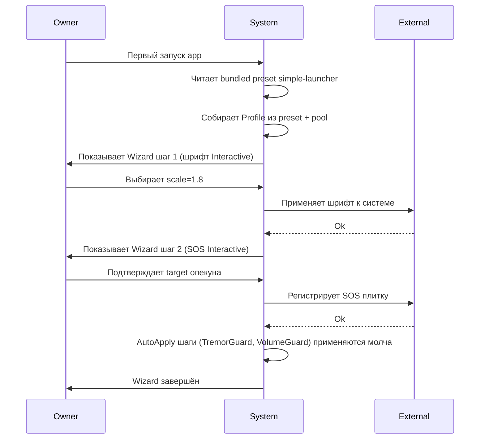
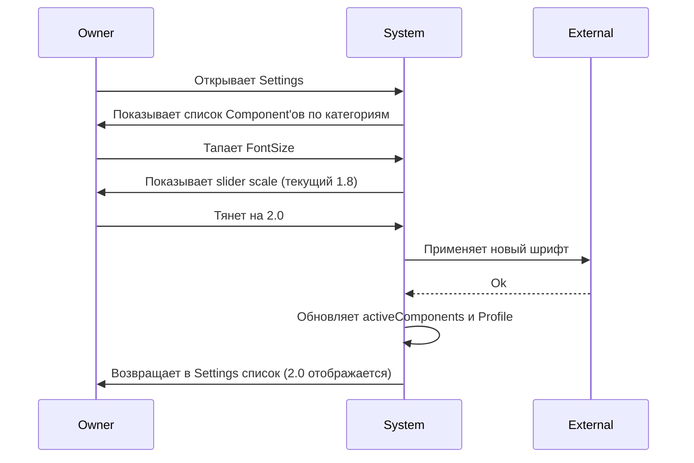
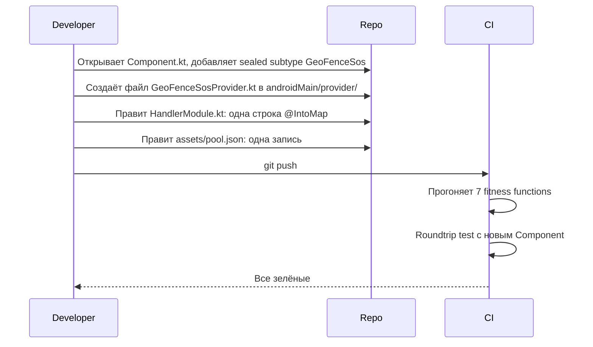
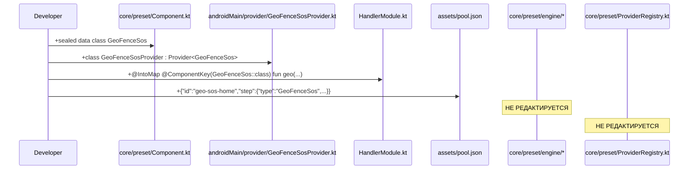

# Feature Specification: Preset Composition Foundation

**Feature Branch**: `task-120-preset-composition`
**Created**: 2026-07-10
**Status**: Draft
**Backlog task**: [task-120](../../backlog/tasks/task-120%20-%20Decision-Preset-conditional-composition-via-visibleIf-JsonLogic.md)
**Input**: TASK-120 Decision block session 2.5 — foundational Component/Preset/Profile model. Заменяет исходный узкий scope «visibleIf/JsonLogic conditional inclusion» на полный фундамент композиции.

---

## User Scenarios & Testing *(mandatory)*

Спецификация задаёт **фундамент** — модель, на которой строятся 5 downstream-фич (draft-1 wizard refactor, TASK-71 hidden steps, TASK-69 Settings as Profile View, TASK-68 workspace preset, TASK-19 Adaptive UX Presets). Пользовательские сценарии сформулированы через **четыре потребителя** модели: Wizard, Settings, BootCheck, Admin push. Пятый сценарий (Developer extensibility) — про инвариант «расширение только добавлением».

### User Story 1 — Первый запуск лаунчера через preset (Priority: P1)

Пользователь получает устройство с уже заложенным preset (bundled, seed или запушенный админом). При первом запуске Wizard проводит его через настраиваемые шаги в порядке `wizardFlow`. Applied-шаги пропускаются, `AutoApply` применяется молча, `Interactive` спрашивает пользователя, `InitialDefault` не задаёт вопросов.

**Why this priority**: без работающего первого запуска устройство неюзабельно. Замена hardcoded `FirstLaunchActivity` (draft-1 tech-debt) на preset-driven flow — центральная user value фичи.

**Independent Test**: собрать Profile из bundled preset «simple-launcher», прогнать `ReconcileEngine.run(RunMode.Wizard)` с fake `InteractionSink`, проверить что все non-applied шаги обошлись, applied — пропущены, статусы обновились.

**Acceptance Scenarios**:

1. **Given** bundled preset `simple-launcher` c 5 wizardFlow-шагами (шрифт, тремор, SOS, layout, плитка мессенджера), **When** пользователь проходит Wizard, **Then** ProfileStep'ы получают статус `Applied`, Interactive-шаги вернули выбранные значения через InteractionSink.
2. **Given** preset содержит шаг `InitialDefault` c дефолтным значением шрифта 1.6, **When** Wizard доходит до этого шага, **Then** `Provider.apply` НЕ вызывается, значение сохраняется в Profile как есть.
3. **Given** Wizard прерван на середине (пользователь закрыл app), **When** Wizard запускается снова, **Then** обход продолжается с первого non-applied шага, applied не переспрашиваются.

---

### User Story 2 — Разработчик расширяет систему добавлением, без правки ядра (Priority: P1)

Разработчик получает задачу «добавить новую фичу — GeoFence SOS» (или любую из списка: TimeLockdown, ScamGuard, Screensaver, BatteryGuard, DateTile, Tts, Checkin). Не редактирует `ReconcileEngine`, `ProviderRegistry`, `ProfileFactory`, `PresetDiff` — только создаёт новые файлы + одну строку DI + одну запись pool.json.

**Why this priority**: это **главный** инвариант всей фичи. Если он не удержан — всё остальное не имеет смысла. Fitness functions в CI enforce эту дисциплину автоматически.

**Independent Test**: реально прогнать «добавь новый Component» на разработчике. Замерить diff. Должен быть: +1 sealed subtype в `Component.kt`, +1 файл Provider, +1 DI-binding, +1 запись pool.json. Diff по `core/preset/engine/**` и `core/preset/provider/ProviderRegistry.kt` — нулевой.

**Acceptance Scenarios**:

1. **Given** MVP set of Component'ов (baseline 5-7), **When** разработчик добавляет 8-й Component (например `GeoFenceSos`), **Then** только 4 файла touched, engine и registry — untouched, fitness function #1 (import guard) и #2 (when-guard) зелёные.
2. **Given** новый Component добавлен без Provider, **When** запущен coverage-test #3, **Then** тест падает с сообщением «Orphan Component: no Provider registered».
3. **Given** разработчик по неведению добавил `import` конкретного Component subtype в engine, **When** прогоняется fitness function #1, **Then** CI падает с указанием файла и строки.

---

### User Story 3 — Пользователь редактирует настройки через Settings (Priority: P1)

Пользователь (или админ у себя) открывает Settings, видит список Component'ов из `settingsMap` сгруппированный по категориям, изменяет любое настраиваемое поле. Изменение уходит в `activeComponents`, ReconcileEngine применяет через `Provider.apply`. Никакой Wizard-семантики — settings это **свободный edit map**, не сценарий.

**Why this priority**: без Settings пользователь заперт в one-way Wizard trip, что противоречит owner intuition (session 2.5: «в Wizard одна логика, в Settings другая»). Settings — daily reality.

**Independent Test**: собрать Profile, изменить параметр Component через Settings-стороны (напрямую в `activeComponents`), прогнать `ReconcileEngine.run(RunMode.Single)`, проверить что Provider вызвал `apply` только для изменённого шага.

**Acceptance Scenarios**:

1. **Given** Profile содержит FontSize с scale=1.6, **When** пользователь через Settings меняет на 1.8, **Then** `activeComponents` обновлён, `FontSizeProvider.apply` вызван с новым значением, статус `Applied`.
2. **Given** Component присутствует в settingsMap но не в wizardFlow, **When** Wizard пройден, **Then** этот Component не участвовал в мастере; открытие Settings показывает его в соответствующей категории.
3. **Given** пользователь пытается изменить immutable поле (например `packageName` у `AppTile`), **When** UI собирает paramsOverride, **Then** валидатор JSON Schema отклоняет — поле не помечено `mutable: true`.

---

### User Story 4 — Устройство восстанавливается после reboot (Priority: P2)

При старте OS Boot-check прогоняет `ReconcileEngine.run(RunMode.BootCheck)`, читает `activeComponents`, для каждого шага с флагом `critical: true` вызывает `Provider.check`. Если `NeedsApply` — вызывает `apply`. Некритичные шаги пропускаются (пользователь настраивает вручную если надо).

**Why this priority**: главный fallback механизм. Решает жалобу «бабушка выключила Wi-Fi → всё сломалось» — Lockdown Component с `critical: true` восстановит блокировку тумблеров при следующем boot.

**Independent Test**: сохранить Profile с одним `critical: true` шагом Lockdown, разломать состояние (симулировать выключение Wi-Fi), запустить BootCheck, проверить что `Provider.apply` вызвался с восстанавливающим действием.

**Acceptance Scenarios**:

1. **Given** Profile содержит Lockdown с `critical: true`, лок Wi-Fi отключён вручную, **When** запускается `RunMode.BootCheck`, **Then** `LockdownProvider.check` вернул `NeedsApply`, `apply` восстановил лок.
2. **Given** Profile содержит FontSize (не critical), Boot-check запущен, **When** engine фильтрует шаги, **Then** FontSize пропущен, только critical проверены.
3. **Given** Provider возвращает `Failed(reason)`, **When** Boot-check заканчивается, **Then** статус в profile обновляется в `Failed`, admin получает возможность посмотреть в Settings (через будущий remote sync).

---

### User Story 5 — Админ пушит обновление preset подопечному (Priority: P2, schema-only в MVP)

Админ у себя редактирует preset подопечного, отправляет через messenger или сервер. Устройство получает новый preset, `PresetDiff` считает изменения относительно текущего Profile, применяются только реально изменившиеся шаги через тот же ReconcileEngine.

**Why this priority**: это core value proposition для семьи/клиники. Runtime реализации transport'а (FCM push, encrypted delivery) deferred в отдельные tasks (TASK-27 messenger, TASK-102 edit-lock). В этой спеке — только **schema-level поддержка** и `PresetDiff` domain code без сетевой части.

**Independent Test**: два preset (v3 и v4) с одним изменённым шагом; прогнать `PresetDiff.diff(oldProfile, newPreset, pool)`, проверить что вернулся один `ChangeItem.ParamsChanged`, применить через `RunMode.Wizard`, проверить что Provider вызвался только для изменённого шага.

**Acceptance Scenarios**:

1. **Given** Profile v3 с FontSize scale=1.6, **When** приходит preset v4 с scale=1.8, **Then** `PresetDiff` возвращает один `ChangeItem(id="font-tile", kind=ParamsChanged)`, только FontSizeProvider.apply вызван.
2. **Given** preset v4 содержит новый шаг `GeoFenceSos` (Added), **When** устройство обрабатывает push, **Then** ChangeItem `Added` пополняет `activeComponents`, Provider применяется.
3. **Given** preset v4 не содержит шаг `TimeLockdown` который был в v3, **When** обрабатывается diff, **Then** ChangeItem `Removed`, локальный статус помечается `Skipped` (Provider.rollback пока отложен, реальный откат в MVP не делается — flagged в spec.md для future work).

---

### User Story 6 — Условное включение шагов (visibleIf, schema seam) (Priority: P3, seam-only)

Preset содержит шаг с полем `visibleIf: JsonLogicExpression?` в wizardFlow-элементе. Wizard пропускает шаг если условие false. В MVP — **schema seam only**: поле присутствует в wire format, но `ConditionEvaluator.evaluate` реализуется hardcoded skip по `device.hasGms` (для Sign-In шага) без полного JsonLogic runtime.

**Why this priority**: полный JsonLogic runtime — separate work item. Owner directive session 2.5: seams reserved, runtime deferred to first real conditional preset. Пока — минимальный hardcoded evaluator, чтобы не блокировать draft-1 wizard refactor.

**Independent Test**: preset с шагом Sign-In и `visibleIf: {"var":"device.hasGms"}`; прогнать через WizardEngine на fake device с `hasGms=false`, проверить что шаг пропущен.

**Acceptance Scenarios**:

1. **Given** wizardFlow-шаг с `visibleIf` объявлен, **When** wire format сериализуется/десериализуется, **Then** поле сохранено без потерь (roundtrip test #4 зелёный).
2. **Given** MVP `ConditionEvaluator` содержит hardcoded правило `device.hasGms`, **When** wizard встречает такое условие, **Then** оно вычисляется корректно; более сложные выражения — Unsupported с fallback «показать шаг».
3. **Given** будущая полная JsonLogic-реализация приходит, **When** старый preset читается, **Then** совместимость сохраняется (rule 5 backward-compat).

---

### Edge Cases

- **Preset ссылается на `poolRef` которого нет** (например preset от новой версии приложения, а устройство на старой): `ProfileFactory` пропускает шаг + помечает в profile.unknownRefs. При upgrade — повторная попытка.
- **Provider для (componentType, platform, vendor) не найден**: `ProviderRegistry` спускается по fallback vendor→platform→NoOp; NoOp возвращает `Unsupported`; engine пропускает шаг.
- **`paramsOverride` содержит невалидное поле или значение**: JSON Schema валидация при загрузке preset. Отклонить весь preset (не тихо игнорировать) — better fail loud.
- **schemaVersion preset выше чем поддерживаемая приложением**: отклонить preset с сообщением «Update app to load this preset».
- **Wizard прерван на Interactive-шаге**: partial state сохраняется в Profile, статус шага `Pending`, при resume — снова показывается.
- **`activeComponents` содержит Component которого нет в pool** (например после deprecation): помечается `Skipped`, не вызывает crash.
- **Два preset одновременно (multiple identities на устройстве)**: НЕ поддерживается в MVP; один active preset per device. Задокументировано в Assumptions.
- **Preset content больше 64KB**: warning в CI но не блокировка. Reasonable soft-limit для future admin push transport.

---

## Requirements *(mandatory)*

### Functional Requirements

- **FR-001**: System MUST express configurable features as `Component` — Kotlin `sealed class` в модуле `core/preset/` без Android-зависимостей. Каждый подтип помечен `@Serializable` + `@SerialName` для polymorphic JSON.
- **FR-002**: System MUST load Pool (catalog of `ComponentDeclaration`) через порт `PoolSource`. Реализация MVP — `BundledPoolSource` читает `assets/pool.json`. Другие источники (file, share intent, network, QR) добавляются additive.
- **FR-003**: Preset wire format MUST содержать три ортогональных поля: `wizardFlow: List<WizardFlowEntry>`, `settingsMap: List<SettingsMapEntry>`, `activeComponents: List<ActiveComponentEntry>`. schemaVersion=2.
- **FR-004**: System MUST allow `paramsOverride` on preset entries, валидируемый по JSON Schema заготовки; только поля с `mutable: true` могут быть переопределены.
- **FR-005**: `ProfileFactory` MUST собирать `Profile` из preset + pool: развернуть каждый `poolRef` в полный `ProfileStep`, применить `paramsOverride`, инициализировать статусы `Pending`.
- **FR-006**: `Provider<T : Component>` port MUST предоставлять `suspend fun check(step: T, profile: Profile): Outcome` и `suspend fun apply(step: T, profile: Profile): Outcome`. Никакого постоянного background loop внутри apply — только включение (через WorkManager / AlarmManager / geofencing API) и выход.
- **FR-007**: `ProviderRegistry.resolve(step: Component): Provider<Component>` MUST выполнять fallback: `(type, platform, vendor)` → `(type, platform, null)` → `(type, null, null)` → `NoOpProvider`. NoOp возвращает `Outcome.Unsupported`.
- **FR-008**: `Outcome` MUST быть sealed hierarchy: `Ok | NeedsApply | Failed(reason: String) | Unsupported`.
- **FR-009**: `WizardBehavior` MUST быть enum `Interactive | AutoApply | InitialDefault`, поле только на wizardFlow entries (не на pool declaration, не на settingsMap).
- **FR-010**: `ReconcileEngine.run(RunMode, InteractionSink?)` MUST поддерживать четыре режима: `Wizard` (non-applied только, через InteractionSink для Interactive), `BootCheck` (только critical), `Single` (точечно один шаг — для Settings), `RemotePush` (после `PresetDiff`).
- **FR-011**: `PresetDiff.diff(current: Profile, incoming: Preset, pool: PoolRepository): List<ChangeItem>` MUST различать `Added | Removed | ParamsChanged`. Rollback самой Removed — deferred (see FR-020 seam).
- **FR-012**: System MUST reject preset с `schemaVersion` выше чем поддерживает приложение (fail loud).
- **FR-013**: System MUST persist Profile через `ProfileStore` port (реализация DataStore). После каждого шага engine сохраняет.
- **FR-014**: `MessengerTile` MUST быть отдельным `Component` subtype (не поле у `AppTile`), с параметром `handoffService: String` указывающим на `AuthHandoffService` port для SSO handoff генерации referrer-ссылки.
- **FR-015**: Vendor peripherals (Omron / A&D BT devices) MUST handling'иться через nested-adapter pattern внутри одного Provider (`BloodPressureDeviceProvider` с sub-adapters `OmronBpAdapter` / `AndBpAdapter`), НЕ через расширение `HandlerKey` четвёртой осью.
- **FR-016**: Wire formats `pool.json`, `preset.json`, `profile.json` MUST нести `schemaVersion: Int`. Изменения только additive; renaming / removing требует migration writer per rule 5.
- **FR-017**: DI wiring MUST использовать Hilt `@IntoMap` с custom `@ComponentKey` annotation. `ProviderRegistry` получает готовую `Map<HandlerKey, Provider<*>>` в конструкторе.
- **FR-018**: `Vendor` enum MUST быть explicit list: `Xiaomi | Samsung | Huawei | GoogleTV | GenericAndroid | iOS`. Vendor определяется через `Build.MANUFACTURER` mapping.
- **FR-019**: Fitness functions (7 штук) MUST быть выполнены в CI test suite — см. Assumptions section detail.
- **FR-020** (seam, deferred runtime): `ConditionEvaluator` port MUST существовать как interface + minimal MVP-адаптер (hardcoded `device.hasGms` handling). Полный JsonLogic runtime — deferred до первого preset реально требующего conditional inclusion. `visibleIf` поле присутствует в wireFormat wizardFlow entries.
- **FR-021** (seam, deferred runtime): `SosDispatcher` / cross-Component event bus port — NOT introduced в MVP. Fitness function #6 (cross-provider isolation guard) enforce'ит что Provider'ы не зовут друг друга напрямую, чтобы будущее введение port'а было чистым добавлением.
- **FR-022** (seam, deferred): `Provider.rollback` для admin push undo — NOT в MVP. `PanicReset` Component покрывает coarse recovery. Если позже понадобится, extend Provider interface с default no-op.
- **FR-023**: PoolSource MUST быть **additive-only** от версии к версии приложения. Удаление записи запрещено (ломает старые preset'ы). Изменение параметров — только новое опциональное поле.

### Key Entities

- **Component**: sealed hierarchy of what-is-configurable (FontSize, TremorGuard, VolumeGuard, Lockdown, Sos, AppTile, MessengerTile, etc.). Domain type, zero Android imports.
- **ComponentDeclaration**: заполненный экземпляр `Component` с параметрами + метаданные (id, признак `critical`). Живёт в Pool.
- **Pool**: реестр `ComponentDeclaration`, загружается через `PoolSource` port. MVP реализация `BundledPoolSource` из `assets/pool.json`.
- **Preset**: shareable JSON template с schemaVersion, тремя полями `wizardFlow` / `settingsMap` / `activeComponents`, доступный через `PresetSource` port (реализации: bundled, file, share, network, QR — additive).
- **Profile**: device-local snapshot copy of `activeComponents` + user edits + Provider результатов, persisted через `ProfileStore`.
- **Provider**: per-platform/vendor реализация check + apply. Живёт в adapter модуле (`androidMain/provider/`, `iosMain/provider/`).
- **ProviderRegistry**: диспетчер, resolve'ит `Provider` по `HandlerKey(type, platform, vendor)` с fallback.
- **Outcome**: sealed `Ok | NeedsApply | Failed | Unsupported` — результат check/apply.
- **WizardBehavior**: enum `Interactive | AutoApply | InitialDefault` — семантика поведения в Wizard.
- **ReconcileEngine**: петля over profile.steps с disptach через Registry. Пять сущностей знают друг о друге только через port'ы.
- **InteractionSink**: port для UI взаимодействия (Wizard спрашивает пользователя). Реализации: `TouchInteractionSink`, будущий `TvRemoteInteractionSink`, `SilentInteractionSink` (для admin push).
- **PresetDiff / ChangeItem**: domain-level diff для admin push handling.
- **ConditionEvaluator**: port для visibleIf-условий (schema seam, MVP-адаптер минимальный).

---

## Success Criteria *(mandatory)*

### Measurable Outcomes

- **SC-001 [backlog]**: Добавление нового Component (например `GeoFenceSos`) требует правки ровно 4 мест: `Component.kt` (+1 sealed subtype), `androidMain/provider/GeoFenceSosProvider.kt` (новый файл), `HandlerModule.kt` (+1 строка DI), `assets/pool.json` (+1 запись). Diff по `core/preset/engine/**` и `ProviderRegistry.kt` — **нулевой**. Проверяется прогоном на реальном разработчике или AI-агенте.
- **SC-002 [backlog]**: Три bundled seed preset (`simple-launcher`, `launcher`, `workspace`) применяются end-to-end на fake `InteractionSink` без ошибок; все ProfileStep получают статус `Applied` или `Skipped` (не `Failed`).
- **SC-003 [backlog]**: Wizard, Settings, BootCheck работают на одном `ReconcileEngine`, различаясь только `RunMode` — четыре RunMode enum значения, ноль спец-логики в engine.
- **SC-004**: Все 7 fitness functions зелёные в CI (`./gradlew :core:test --tests *FitnessTest`): (1) import guard engine, (2) when-guard engine, (3) coverage Component↔Provider, (4) roundtrip pool+preset→profile, (5) backward-compat pool v1→v2, (6) cross-provider isolation, (7) paramsOverride schema validation.
- **SC-005**: Roundtrip test `pool.json + preset.json → Profile → serialize → deserialize → Profile'` возвращает bit-identical результат. Проверяется unit-тестом.
- **SC-006 [backlog]**: Platform-specific различия handling'ятся через ProviderRegistry: HomeRole Component имеет Android Provider, iOS Provider отсутствует → NoOp fallback → `Unsupported` → engine пропускает шаг без ошибки.
- **SC-007 [backlog]**: `MessengerTile` Component с параметром `handoffService` работает через `AuthHandoffService` port — тап на плитке генерирует referrer, мессенджер (fake `MessengerAppFake`) получает и принимает handoff. Тест: fake AuthHandoffService возвращает signed referrer → MessengerTileProvider вешает click-handler → click эмитит intent с referrer.
- **SC-008**: Wire format `preset.json` v2 читается кодом v2 (roundtrip); при появлении preset schemaVersion=3 в будущем — migration writer v2→v3 добавлен до слива breaking change (rule 5).
- **SC-009 [backlog]**: `PresetDiff` для 6 concrete features (Android/iOS, TV, Omron/A&D, TimeLockdown, GeoFence SOS, MessengerTile) корректно классифицирует Added/Removed/ParamsChanged — 6 unit-тестов зелёные.
- **SC-010**: Coverage-test #3: `Component::class.sealedSubclasses.all { registry.resolve(mock(it)) !is NoOpProvider }` — каждый Component subtype имеет зарегистрированный Provider (кроме явно orphan-marked). Тест падает при добавлении Component без Provider.

---

## Assumptions

- **Один active preset per device** — MVP не поддерживает несколько параллельных preset. Multi-preset (для multi-identity устройств) — future work.
- **`activeComponents` — source of truth для reconcile**. Wizard и Settings обновляют его; PresetDiff читает и обновляет по push.
- **Pool growth additive across releases**. Мы обещаем не удалять записи и не менять параметры несовместимо. Это rule 5 wire-format-versioning, применённый к pool.json.
- **DI framework — Hilt** (проект уже на нём). Koin альтернатива рассмотрена и отклонена (session 2.5).
- **JSON runtime — kotlinx.serialization с polymorphic sealed через `classDiscriminator = "type"`**. Не свой парсер, не Jackson, не Moshi.
- **Persistence — DataStore** для `Profile` (уже используется в проекте). Room не требуется на этом уровне.
- **No ECS runtime framework** (Fleks / Ashley / Artemis). Обсуждено session 2.5 и отклонено по scale mismatch.
- **Foundation этого spec'а живёт в `core/preset/` KMP commonMain** — pure Kotlin, zero Android. Android SDK usage — только в `app/androidMain/provider/*` adapter модуле.
- **iOS Provider реализации** — placeholder (интерфейсы объявлены, реализации no-op) в MVP. iOS порт — future work.
- **Vendor detection через `Build.MANUFACTURER`** — приемлемо для phone vendor. Для peripheral vendor — через параметр Component.
- **Local test path**: JVM unit tests достаточно для foundation. Emulator тесты нужны только для конкретных adapter-реализаций (это в отдельных spec'ах downstream tasks).

---

## Local Test Path *(mandatory)*

- **Emulator / device**: **не требуется** для foundation спеки. Всё core/preset/ — pure JVM.
- **Fake adapters used**:
  - `FakePoolSource` — возвращает in-memory list of `ComponentDeclaration`.
  - `FakePresetSource` — возвращает hardcoded Preset.
  - `FakeProfileStore` — in-memory `MutableStateFlow<Profile>`.
  - `FakeInteractionSink` — возвращает preset-canned ответы.
  - `FakeProvider<T>` per Component subtype — возвращает конфигурируемые Outcome в тестах.
  - `FakeAuthHandoffService` — возвращает mock referrer.
- **Fixtures / seed data**:
  - `core/src/test/resources/fixtures/pool-v1.json` — MVP pool с 5-7 Component declarations.
  - `core/src/test/resources/fixtures/preset-simple-launcher-v2.json` — seed preset.
  - `core/src/test/resources/fixtures/preset-workspace-v2.json` — seed preset.
  - `core/src/test/resources/fixtures/profile-partial-applied.json` — Profile с mixed статусами для diff тестов.
- **Verification command**:
  - `./gradlew :core:test --tests "com.launcher.preset.*"` — все unit-тесты domain.
  - `./gradlew :core:test --tests "com.launcher.preset.fitness.*"` — 7 fitness functions.
  - `./gradlew :app:testDebugUnitTest` — Hilt wiring smoke (реальный ProviderRegistry с fake Providers).
- **Cannot-test-locally gaps**: `none` для foundation. Downstream tasks (draft-1 wizard, TASK-71, TASK-19) будут иметь свои emulator/device gaps в их spec'ах.

---

## AI Affordance *(mandatory)*

**Exposable capabilities** (для future Capability Registry / MCP exposure):
- `listAvailableComponents(): List<ComponentDeclaration>` — что можно настраивать сейчас.
- `getActivePreset(): PresetRef` + `getProfile(): ProfileSnapshot` — что стоит на устройстве.
- `applyComponentChange(componentId: String, paramsOverride: JsonObject): Outcome` — точечное изменение.
- `installPreset(preset: Preset): List<ChangeItem>` — polymorphic install из любого source (bundled/file/share/network).

**Required affordances on data**:
- Read-only access to `activeComponents` для explanation flows («что сейчас включено у бабушки?»).
- Write access к `activeComponents` через `applyComponentChange` verb, идёт через `ProviderRegistry.resolve` + `Provider.apply` — те же гарантии что owner-driven flow.
- No PII leaves device — `Profile` содержит только Component-параметры (шрифт 1.8, target SOS = pairing-777). Identity-bound данные (pairing keys, contact PII) — в отдельном encrypted блоке, не в Profile.

**Provider-agnostic shape**: capability verbs выражены в domain-типах (`ComponentDeclaration`, `Outcome`, `PresetRef`), не в vendor SDK signatures. Никаких `GeminiTool`, `OpenAIFunction`, `MCPTool` в port'ах.

**Out of scope for this spec**: no provider implementation, no LLM prompt design, no telemetry. Экспозиция capability registry — future work (F-2 per constitution).

---

## OEM Matrix *(mandatory if feature touches device behavior)*

**Not applicable at foundation level.** Этот spec задаёт **порты** и **wire format** — Android SDK не участвует в domain коде. OEM matrix живёт в spec'ах конкретных adapter-реализаций (например: `LockdownProvider` для Xiaomi vs Samsung vs Huawei device-owner quirks — отдельный spec).

Единственный foundation-level OEM concern: `Build.MANUFACTURER` mapping в `Vendor` enum. Известные значения: `"xiaomi"` → `Vendor.Xiaomi`, `"samsung"` → `Vendor.Samsung`, `"huawei"` → `Vendor.Huawei`, `"google"` → `Vendor.GenericAndroid` (Pixel — baseline, не special-cased), прочие → `Vendor.GenericAndroid`. GoogleTV detection через package feature check `PackageManager.FEATURE_LEANBACK`.

---

## Sequences *(ADR-011 mandatory)*

### SEQ-1: Первый запуск лаунчера через Wizard из preset

Pre: устройство свежее, preset `simple-launcher` в assets, ProfileStore пустой. Post: Profile с активированными Component'ами, все ProfileStep статус `Applied` (или `Skipped` для Unsupported).
Used-in: spec/task-120-preset-composition-foundation.

#### Spec-level (behavior)


#### Plan-level (architecture)
```mermaid
sequenceDiagram
  participant UI as WizardActivity/Composable
  participant VM as WizardViewModel
  participant EN as ReconcileEngine
  participant PF as ProfileFactory
  participant PS as PresetSource
  participant PL as PoolSource
  participant SK as InteractionSink
  participant PR as ProviderRegistry
  participant AD as Provider(FontSize/Sos/...)
  UI->>VM: onStart
  VM->>PS: loadPreset("simple-launcher")
  PS-->>VM: Preset
  VM->>PL: loadPool()
  PL-->>VM: Pool
  VM->>PF: create(preset, pool)
  PF-->>VM: Profile
  VM->>EN: run(RunMode.Wizard, sink=SK)
  EN->>PR: resolve(FontSize)
  PR-->>EN: FontSizeProvider
  EN->>AD: check(step, profile)
  AD-->>EN: NeedsApply
  EN->>SK: askUser(step) [Interactive]
  SK->>UI: showStep(step)
  UI->>SK: userChoice(scale=1.8)
  SK-->>EN: modified step
  EN->>AD: apply(step', profile)
  AD-->>EN: Ok
  EN->>EN: profile.mark(step.id, Applied); save
```

<!-- MENTOR-DETAIL:BEGIN -->
#### Пояснение для владельца
- **Owner** — бабушка (или дочка при первичном setup'е).
- **System** — приложение-лаунчер как чёрный ящик.
- **External** — Android OS (шрифт, launcher tile registry, permission grants).
- Что пользователь видит на экране: приветствие → «Выберите размер шрифта» → «Подтвердите SOS-контакт» → «Готово». Три Interactive-шага + два AutoApply молча под капотом. Wizard = one-way trip: закончил и забыл.
- На plan-level: `WizardViewModel` — глазами пользователя, `ReconcileEngine` — ядро (никогда не редактируется при добавлении фичи), `Provider` — конкретный повар (для FontSize / SOS / TremorGuard свой).
<!-- MENTOR-DETAIL:END -->

---

### SEQ-2: Пользователь редактирует настройку через Settings

Pre: Profile существует с активированными Component'ами. Post: изменённый Component применён, статус обновлён, Profile persisted.
Used-in: spec/task-120-preset-composition-foundation.

#### Spec-level (behavior)


#### Plan-level (architecture)


<!-- MENTOR-DETAIL:BEGIN -->
#### Пояснение для владельца
- Settings — не Wizard. Пользователь свободно кликает по любой настройке, меняет, идёт дальше. Никакого линейного сценария.
- `settingsMap` из preset определяет какие Component'ы вообще показывать и по каким категориям («Зрение», «Слух», «Безопасность», «Приложения»).
- `RunMode.Single` — целевой прогон engine для одного шага, а не полный обход. То же ядро, тот же Provider, но для одного шага, не для всей тарелки.
<!-- MENTOR-DETAIL:END -->

---

### SEQ-3: Разработчик добавляет новый Component (GeoFenceSos)

Pre: MVP set of 5-7 Component'ов работает. Post: 8-й Component добавлен, все fitness functions зелёные, ядро не редактировалось.
Used-in: spec/task-120-preset-composition-foundation.

#### Spec-level (behavior)


#### Plan-level (architecture)


<!-- MENTOR-DETAIL:BEGIN -->
#### Пояснение для владельца
- Это main инвариант всей системы: добавить новую фичу = **дописать**, а не **переписать**.
- Разработчик редактирует ровно 4 места. Ядро (engine и registry) — не трогает вообще. Fitness functions в CI автоматически проверяют что он не «случайно» отредактировал ядро.
- Если бы этот инвариант ломался — каждая новая фича стоила бы правку в 10-15 местах, ошибки бы плодились, тестирование мучительно. С инвариантом — фича = ~4 файла.
<!-- MENTOR-DETAIL:END -->

---

## Clarifications *(populated by /speckit.clarify)*

*Раздел пуст. Открытые вопросы OQ-A..OQ-E из session 2.5 закрываются на этапе `/speckit.clarify`:*

- **OQ-A**: Точный список Component'ов первой волны (MVP subset ~5-7 из общего списка ~20). Кандидаты для baseline: `AppTile`, `FontSize`, `TremorGuard`, `Sos`, `Lockdown`, `Toolbar`, `MessengerTile`. Что критически нужно в первой волне, что откладывается на волну 2?
- **OQ-B**: Содержимое трёх bundled seed preset (`simple-launcher`, `launcher`, `workspace`) — точный список wizardFlow и settingsMap элементов у каждого.
- **OQ-C**: MessengerTile Component — заводим сейчас (даже до появления мессенджера в TASK-27) чтобы паттерн handoff-плитки был заявлен, или подождать TASK-27 (стороннее приложение / собственный мессенджер)?
- **OQ-D**: `wizardFlow` элементы могут переопределять `paramsOverride`, а `settingsMap` элементы — тоже? Или settings берёт params только из pool defaults + user edits через runtime?
- **OQ-E**: Vendor mapping edge cases: `"redmi"` vs `"xiaomi"` (Xiaomi sub-brand), `"honor"` (Huawei spin-off) — как маппить? Default to `GenericAndroid` или отдельные enum значения?

---

## Downstream contract

**Downstream tasks** зависят от этого foundation'а и получают machine-readable контракт через `dependencies: [TASK-120]`:

- **draft-1** — Wizard manifest-driven refactoring: удаляет hardcoded Sign-In из `FirstLaunchActivity`, переводит на preset-driven `wizardFlow`.
- **TASK-71** — Wizard hidden steps and defaults: использует `WizardBehavior.InitialDefault` и `visibleIf` (когда придёт).
- **TASK-69** — Settings as Profile View: реализует `SettingsScreen` через `settingsMap`.
- **TASK-68** — Workspace preset: создаёт bundled `workspace.json` для B2B-сценария.
- **TASK-19** — Adaptive UX Presets: preset variants под tremor/vision — использует `paramsOverride`.
