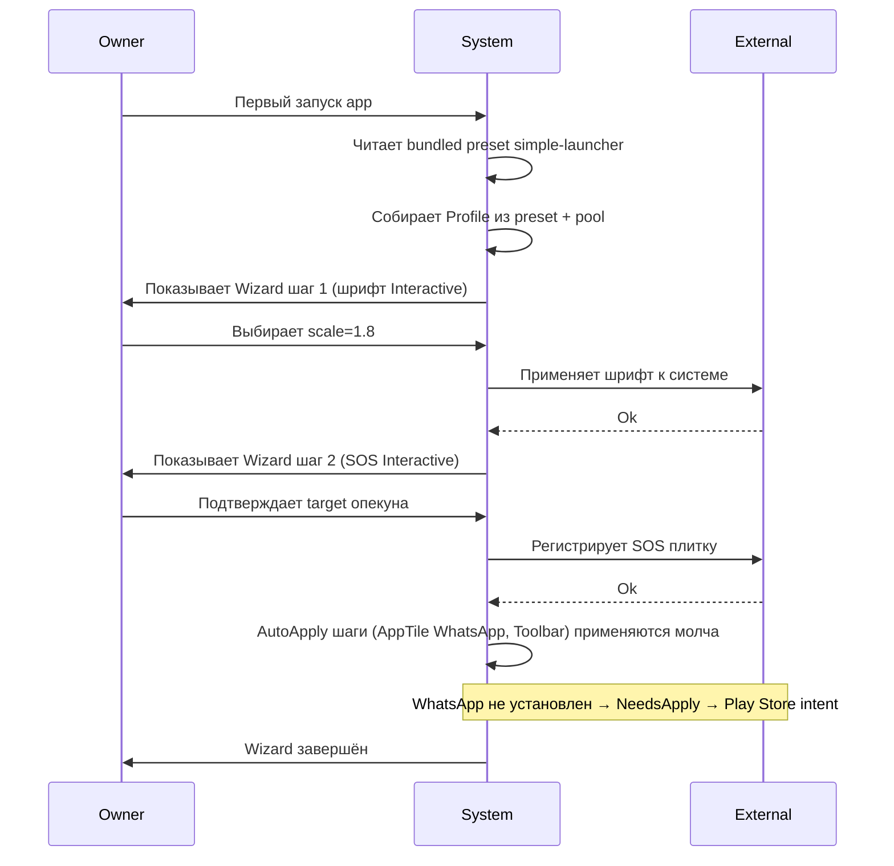
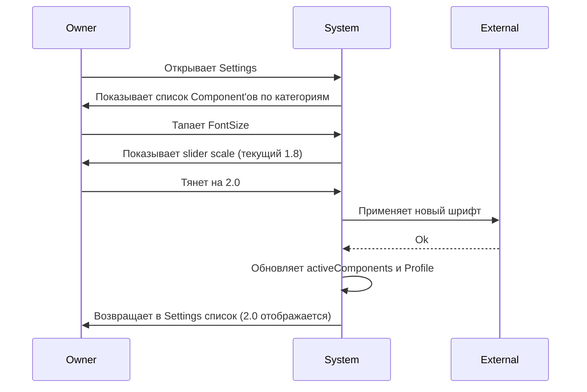
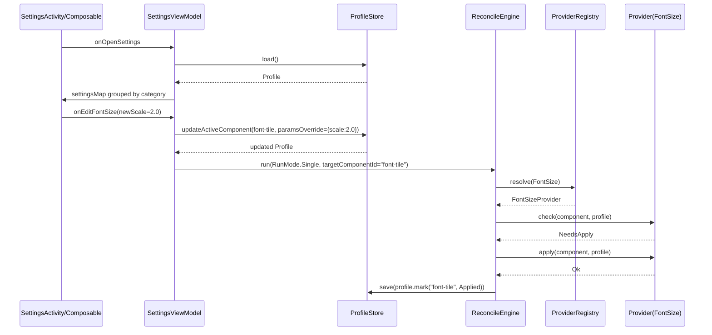
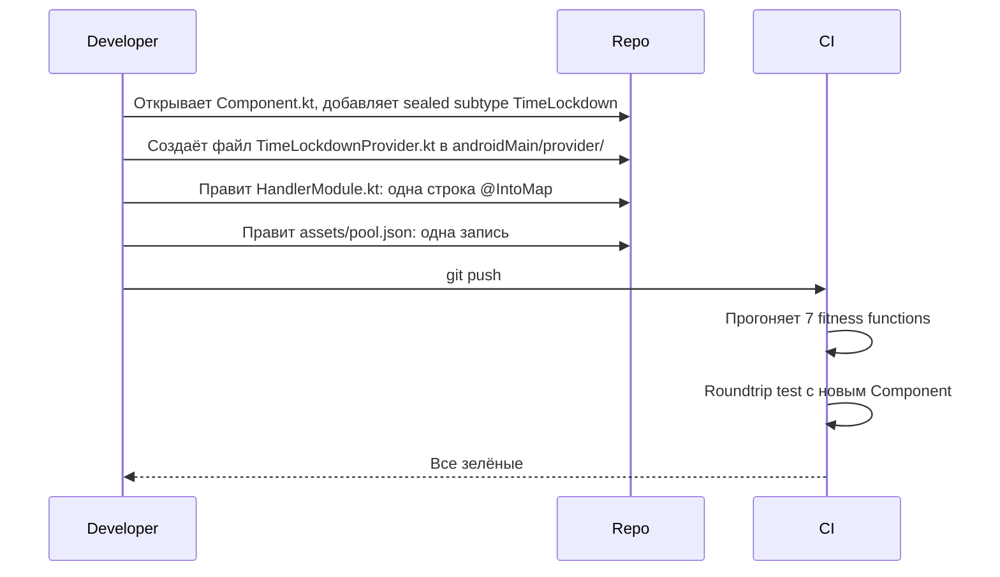
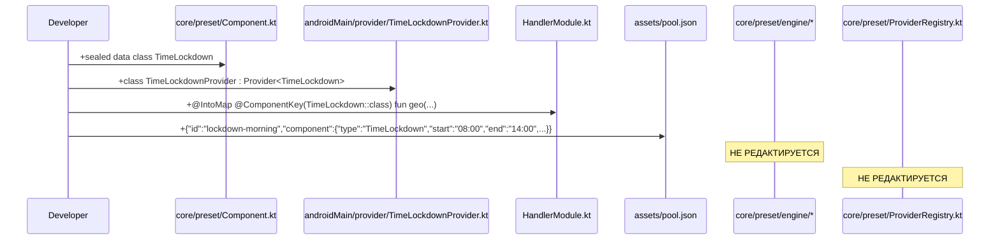

# Feature Specification: Preset Composition Foundation

**Feature Branch**: `task-120-preset-composition`
**Created**: 2026-07-10
**Status**: Draft
**Backlog task**: [task-120](../../backlog/tasks/task-120%20-%20Decision-Preset-conditional-composition-via-visibleIf-JsonLogic.md)
**Input**: TASK-120 Decision block session 2.5 — foundational Component/Preset/Profile model. Заменяет исходный узкий scope «visibleIf/JsonLogic conditional inclusion» на полный фундамент композиции.

---

## User Scenarios & Testing *(mandatory)*

Спецификация задаёт **фундамент** — модель, на которой строятся 5 downstream-фич (draft-1 wizard refactor, TASK-71 hidden steps, TASK-69 Settings as Profile View, TASK-68 workspace preset, TASK-19 Adaptive UX Presets). Пользовательские сценарии сформулированы через **четыре потребителя** модели: Wizard, Settings, BootCheck, Admin push. Пятый сценарий (Developer extensibility) — про инвариант «расширение только добавлением».

### User Story 1 — Первый запуск лаунчера через preset (Priority: P1)

Пользователь получает устройство с уже заложенным preset (bundled, seed или запушенный админом). При первом запуске Wizard проводит его через настраиваемые шаги в порядке `wizardFlow`. Applied-шаги пропускаются, `AutoApply` применяется молча, `Interactive` спрашивает пользователя, `InitialDefault` не задаёт вопросов.

**Why this priority**: без работающего первого запуска устройство неюзабельно. Замена hardcoded `FirstLaunchActivity` (draft-1 tech-debt) на preset-driven flow — центральная user value фичи.

**Independent Test**: собрать Profile из bundled preset «simple-launcher», прогнать `ReconcileEngine.run(RunMode.Wizard)` с fake `InteractionSink`, проверить что все non-applied шаги обошлись, applied — пропущены, статусы обновились.

**Acceptance Scenarios**:

1. **Given** bundled preset `simple-launcher` c 4 wizardFlow-шагами (шрифт, SOS, AppTile WhatsApp, Toolbar layout), **When** пользователь проходит Wizard, **Then** ProfileComponent'ы получают статус `Applied` (или `Failed` для WhatsApp если не установлен), Interactive-шаги вернули выбранные значения через InteractionSink.
2. **Given** preset содержит шаг `InitialDefault` c дефолтным значением шрифта 1.6, **When** Wizard доходит до этого шага, **Then** `Provider.apply` НЕ вызывается, значение сохраняется в Profile как есть.
3. **Given** Wizard прерван на середине (пользователь закрыл app), **When** Wizard запускается снова, **Then** обход продолжается с первого non-applied шага, applied не переспрашиваются.
4. **Given** пользователь запустил Wizard, прошёл 2 шага, нажимает «Отменить», **When** confirm-диалог принят, **Then** Profile восстановлен из `preWizardSnapshot`, partial применения откачены (шрифт вернулся к предыдущему значению, SOS-плитка убрана), статус — до-wizard state.

---

### User Story 2 — Разработчик расширяет систему добавлением, без правки ядра (Priority: P1)

Разработчик получает задачу «добавить новую фичу — GeoFence SOS» (или любую из списка: TimeLockdown, ScamGuard, Screensaver, BatteryGuard, DateTile, Tts, Checkin). Не редактирует `ReconcileEngine`, `ProviderRegistry`, `ProfileFactory`, `PresetDiff` — только создаёт новые файлы + одну строку DI + одну запись pool.json.

**Why this priority**: это **главный** инвариант всей фичи. Если он не удержан — всё остальное не имеет смысла. Fitness functions в CI enforce эту дисциплину автоматически.

**Independent Test**: реально прогнать «добавь новый Component» на разработчике. Замерить diff. Должен быть: +1 sealed subtype в `Component.kt`, +1 файл Provider, +1 DI-binding, +1 запись pool.json. Diff по `core/preset/engine/**` и `core/preset/provider/ProviderRegistry.kt` — нулевой.

**Acceptance Scenarios**:

1. **Given** MVP set of Component'ов (baseline 5-7), **When** разработчик добавляет 8-й Component (например `TimeLockdown`), **Then** только 4 файла touched, engine и registry — untouched, fitness function #1 (import guard) и #2 (when-guard) зелёные.
2. **Given** новый Component добавлен без Provider, **When** запущен coverage-test #3, **Then** тест падает с сообщением «Orphan Component: no Provider registered».
3. **Given** разработчик по неведению добавил `import` конкретного Component subtype в engine, **When** прогоняется fitness function #1, **Then** CI падает с указанием файла и строки.

---

### User Story 3 — Пользователь редактирует настройки через Settings (Priority: P1)

Пользователь (или админ у себя) открывает Settings, видит список Component'ов из `settingsMap` сгруппированный по категориям, изменяет любое настраиваемое поле. Изменение уходит в `activeComponents`, ReconcileEngine применяет через `Provider.apply`. Никакой Wizard-семантики — settings это **свободный edit map**, не сценарий.

**Why this priority**: без Settings пользователь заперт в one-way Wizard trip, что противоречит owner intuition (session 2.5: «в Wizard одна логика, в Settings другая»). Settings — daily reality.

**Independent Test**: собрать Profile, изменить параметр Component через Settings-стороны (напрямую в `activeComponents`), прогнать `ReconcileEngine.run(RunMode.Single)`, проверить что Provider вызвал `apply` только для изменённого шага.

**Acceptance Scenarios**:

1. **Given** Profile содержит FontSize с scale=1.6, **When** пользователь через Settings меняет на 1.8, **Then** `activeComponents` обновлён, `FontSizeProvider.apply` вызван с новым значением, статус `Applied`.
2. **Given** Component присутствует в settingsMap но не в wizardFlow, **When** Wizard пройден, **Then** этот Component не участвовал в мастере; открытие Settings показывает его в соответствующей категории.
3. **Given** пользователь пытается изменить immutable поле (например `packageName` у `AppTile`), **When** UI собирает paramsOverride, **Then** валидатор JSON Schema отклоняет — поле не помечено `mutable: true`.

---

### User Story 4 — Устройство восстанавливается после reboot (Priority: P2)

При старте OS Boot-check прогоняет `ReconcileEngine.run(RunMode.BootCheck)`, читает `activeComponents`, для каждого шага с флагом `critical: true` вызывает `Provider.check`. Если `NeedsApply` — вызывает `apply`. Некритичные шаги пропускаются (пользователь настраивает вручную если надо).

**Why this priority**: главный fallback механизм. Решает жалобу «бабушка выключила Wi-Fi → всё сломалось» — Lockdown Component с `critical: true` восстановит блокировку тумблеров при следующем boot.

**Independent Test**: сохранить Profile с одним `critical: true` шагом Lockdown, разломать состояние (симулировать выключение Wi-Fi), запустить BootCheck, проверить что `Provider.apply` вызвался с восстанавливающим действием.

**Acceptance Scenarios**:

1. **Given** Profile содержит Lockdown с `critical: true`, лок Wi-Fi отключён вручную, **When** запускается `RunMode.BootCheck`, **Then** `LockdownProvider.check` вернул `NeedsApply`, `apply` восстановил лок.
2. **Given** Profile содержит FontSize (не critical), Boot-check запущен, **When** engine фильтрует шаги, **Then** FontSize пропущен, только critical проверены.
3. **Given** Provider возвращает `Failed(reason)`, **When** Boot-check заканчивается, **Then** статус в profile обновляется в `Failed`, admin получает возможность посмотреть в Settings (через будущий remote sync).

---

### User Story 5 — Админ пушит обновление preset подопечному (Priority: P2, schema-only в MVP)

Админ у себя редактирует preset подопечного, отправляет через messenger или сервер. Устройство получает новый preset, `PresetDiff` считает изменения относительно текущего Profile, применяются только реально изменившиеся шаги через тот же ReconcileEngine.

**Why this priority**: это core value proposition для семьи/клиники. Runtime реализации transport'а (FCM push, encrypted delivery) deferred в отдельные tasks (TASK-27 messenger, TASK-102 edit-lock). В этой спеке — только **schema-level поддержка** и `PresetDiff` domain code без сетевой части.

**Independent Test**: два preset (v3 и v4) с одним изменённым шагом; прогнать `PresetDiff.diff(oldProfile, newPreset, pool)`, проверить что вернулся один `ChangeItem.ParamsChanged`, применить через `RunMode.Wizard`, проверить что Provider вызвался только для изменённого шага.

**Acceptance Scenarios**:

1. **Given** Profile v3 с FontSize scale=1.6, **When** приходит preset v4 с scale=1.8, **Then** `PresetDiff` возвращает один `ChangeItem(id="font-tile", kind=ParamsChanged)`, только FontSizeProvider.apply вызван.
2. **Given** preset v4 содержит новый шаг `TimeLockdown` (Added), **When** устройство обрабатывает push, **Then** ChangeItem `Added` пополняет `activeComponents`, Provider применяется.
3. **Given** preset v4 не содержит шаг `TimeLockdown` который был в v3, **When** обрабатывается diff, **Then** ChangeItem `Removed`, локальный статус помечается `Skipped` (Provider.rollback пока отложен, реальный откат в MVP не делается — flagged в spec.md для future work).

---

### User Story 5.5 — Битый preset ловится до запуска Wizard (Priority: P2)

Пользователь / админ импортирует preset (через share intent, file, network). До того как Wizard стартует — `PresetValidator` проверяет ordering: если Component с `requires=[CloudSession]` идёт до Component с `provides=[CloudSession]` — preset отклоняется с понятной ошибкой. Пользователь не попадает в поломанный flow.

**Why this priority**: без валидатора битый preset начинает Wizard, доходит до HealthForward, тот возвращает `Unsupported` — пользователь видит непонятный «шаг пропущен» без объяснения причины. Валидатор ловит это заранее с диагностическим сообщением админу.

**Independent Test**: два preset (правильный `[FontSize, SignInGoogle, HealthForward]` и битый `[FontSize, HealthForward, SignInGoogle]`), fake `CapabilityContract` возвращает canned requires/provides, PresetValidator прогоняется на обоих — первый ok, второй возвращает `ValidationError.CapabilityMissing`.

**Acceptance Scenarios**:

1. **Given** preset с правильным ordering (`SignInGoogle → HealthForward`), **When** пользователь запускает preset, **Then** валидатор проходит, Wizard стартует.
2. **Given** preset с битым ordering (`HealthForward → SignInGoogle`), **When** пользователь запускает preset, **Then** валидатор возвращает `ValidationError.CapabilityMissing("HealthForward", {CloudSession})`, Wizard **не стартует**, пользователь / админ видит понятное сообщение (i18n key: `validator.error.capability_missing`).
3. **Given** preset содержит `poolRef` который не существует в текущем pool (например от новой версии приложения), **When** валидатор прогоняется, **Then** возвращает `ValidationError.UnknownPoolRef`, admin получает возможность обновить app или изменить preset.
4. **Given** preset schemaVersion=3 приходит в приложение schemaVersion=2, **When** валидатор прогоняется, **Then** возвращает `ValidationError.SchemaVersionUnsupported`, пользователь видит «Обновите приложение».

---

### User Story 6 — Условное включение шагов (visibleIf, schema seam) (Priority: P3, seam-only)

Preset содержит шаг с полем `visibleIf: JsonLogicExpression?` в wizardFlow-элементе. Wizard пропускает шаг если условие false. В MVP — **schema seam only**: поле присутствует в wire format, но `ConditionEvaluator.evaluate` реализуется hardcoded skip по `device.hasGms` (для Sign-In шага) без полного JsonLogic runtime.

**Why this priority**: полный JsonLogic runtime — separate work item. Owner directive session 2.5: seams reserved, runtime deferred to first real conditional preset. Пока — минимальный hardcoded evaluator, чтобы не блокировать draft-1 wizard refactor.

**Independent Test**: preset с шагом Sign-In и `visibleIf: {"var":"device.hasGms"}`; прогнать через WizardEngine на fake device с `hasGms=false`, проверить что шаг пропущен.

**Acceptance Scenarios**:

1. **Given** wizardFlow-шаг с `visibleIf` объявлен, **When** wire format сериализуется/десериализуется, **Then** поле сохранено без потерь (roundtrip test #4 зелёный).
2. **Given** MVP `ConditionEvaluator` содержит hardcoded правило `device.hasGms`, **When** wizard встречает такое условие, **Then** оно вычисляется корректно; более сложные выражения — Unsupported с fallback «показать шаг».
3. **Given** будущая полная JsonLogic-реализация приходит, **When** старый preset читается, **Then** совместимость сохраняется (rule 5 backward-compat).

---

### Edge Cases

- **Preset ссылается на `poolRef` которого нет** (например preset от новой версии приложения, а устройство на старой): `ProfileFactory` пропускает шаг + помечает в profile.unknownRefs. При upgrade — повторная попытка.
- **Provider для (componentType, platform, vendor) не найден**: `ProviderRegistry` спускается по fallback vendor→platform→NoOp; NoOp возвращает `Unsupported`; engine пропускает шаг.
- **`paramsOverride` содержит невалидное поле или значение**: JSON Schema валидация при загрузке preset. Отклонить весь preset (не тихо игнорировать) — better fail loud.
- **schemaVersion preset выше чем поддерживаемая приложением**: отклонить preset с сообщением «Update app to load this preset».
- **Wizard прерван на Interactive-шаге**: partial state сохраняется в Profile, статус шага `Pending`, при resume — снова показывается.
- **`activeComponents` содержит Component которого нет в pool** (например после deprecation): помечается `Skipped`, не вызывает crash.
- **Два preset одновременно (multiple identities на устройстве)**: НЕ поддерживается в MVP; один active preset per device. Задокументировано в Assumptions.
- **Preset content больше 64KB**: warning в CI но не блокировка. Reasonable soft-limit для future admin push transport.
- **Owner отменяет Wizard в середине** (per FR-029): Profile восстанавливается из `preWizardSnapshot`. Runtime state (default launcher, permissions, active alarms) НЕ откатывается автоматически. Следующий `RunMode.BootCheck` или явный user-run Settings reconcile'ит drift через тот же `Provider.apply` на восстановленных значениях. UX: toast «Настройки отменены; некоторые изменения (лаунчер, разрешения) вернутся вручную через Settings».
- **AppTile ссылается на не установленный пакет**: `check()` возвращает `NeedsApply`, `apply()` эмитит `Intent.ACTION_VIEW` на Play Store link для установки (fallback: `Failed("app unavailable")` если Play Store недоступен). Плитка остаётся видимой но помечена «not installed» в UI.
- **Same-version preset пришёл заново с другим content**: reject с log entry, требуем bump. UX: showToast для owner-driven install, silent log для admin push (admin получит feedback через собственный dashboard, out of MVP scope).
- **preWizardSnapshot старше 7 суток**: очищается автоматически, undo Wizard больше недоступен (пользователь получил достаточно времени осознать изменения).

---

## Requirements *(mandatory)*

### Functional Requirements

- **FR-001**: System MUST express configurable features as `Component` — Kotlin `sealed class` в модуле `core/preset/` без Android-зависимостей. Каждый подтип помечен `@Serializable` + `@SerialName` для polymorphic JSON.
- **FR-002**: System MUST load Pool (catalog of `ComponentDeclaration`) через порт `PoolSource`. Реализация MVP — `BundledPoolSource` читает `assets/pool.json`. Другие источники (file, share intent, network, QR) добавляются additive. **Implementation requirement**: `BundledPoolSource` файл MUST содержать inline-TODO комментарий: `// TODO(shareability): future PoolSource adapters — file import, share intent, marketplace. Add here as new adapter classes without changing existing wire format.` (rule 9 shareability-readiness).
- **FR-003**: Preset wire format MUST содержать три ортогональных поля: `wizardFlow: List<WizardFlowEntry>`, `settingsMap: List<SettingsMapEntry>`, `activeComponents: List<ActiveComponentEntry>`. schemaVersion=2. **Implementation requirement**: `Preset` data class + `BundledPresetSource` MUST содержать inline-TODO комментарий: `// TODO(shareability): future PresetSource adapters — file import (Intent.ACTION_VIEW), share intent (ACTION_SEND), network fetch, QR-scan. Add as additive adapters without wire format change.` (rule 9).
- **FR-004**: System MUST allow `paramsOverride` on preset entries **всех трёх типов** (`wizardFlow`, `settingsMap`, `activeComponents`) — валидируется по JSON Schema заготовки; только поля с `mutable: true` могут быть переопределены. Owner decision Q4 session 2.5 clarify: не ограничиваем override wizard-семантикой, потому что «незнаем где может пригодиться».
- **FR-005**: `ProfileFactory` MUST собирать `Profile` из preset + pool: развернуть каждый `poolRef` в полный `ProfileComponent`, применить `paramsOverride`, инициализировать статусы `Pending`.
- **FR-006**: `Provider<T : Component>` port MUST предоставлять `suspend fun check(component: T, profile: Profile): Outcome` и `suspend fun apply(component: T, profile: Profile): Outcome`. Никакого постоянного background loop внутри apply — только включение (через WorkManager / AlarmManager / geofencing API) и выход. **Implementation requirement**: Provider port MUST содержать inline-TODO комментарий: `// TODO(capability-registry): apply()/check() будут exposed как domain-verbs через будущий Capability Registry (F-2). Каждая реализация Provider становится точкой exposure. Provider-side rollback (`suspend fun rollback(component, profile): Outcome = Outcome.Unsupported`) — additive extension when needed per FR-029.` Runtime-check требуемых capability'ей — через `CapabilityQuery` port (FR-027), не через прямой Profile access.
- **FR-007**: `ProviderRegistry.resolve(component: Component): Provider<Component>` MUST выполнять fallback: `(type, platform, vendor)` → `(type, platform, null)` → `(type, null, null)` → `NoOpProvider`. NoOp возвращает `Outcome.Unsupported`.
- **FR-008**: `Outcome` MUST быть sealed hierarchy: `Ok | NeedsApply | Failed(reason: FailReason) | Unsupported`. **`FailReason`** — separate sealed hierarchy: `PermissionDenied(permission: String) | PolicyBlocked(policy: String) | NetworkUnavailable | Cancelled | InternalError(messageKey: String, args: Map<String, String> = emptyMap())`. Every FailReason MUST provide `fun toI18nKey(): String` (default via subtype-name mapping: `PermissionDenied` → `outcome.failed.permission_denied` etc.) enabling UI/AI-agent to translate structured failures. Free-form strings are ONLY allowed inside `InternalError.messageKey` (which itself is an i18n key not a literal). Owner directive session 2.5 clarify Q5 refinement: «изначально неправильно, как минимум литерал что бы можно было переводить» — structured hierarchy provides that plus categorization.
- **FR-009**: `WizardBehavior` MUST быть enum `Interactive | AutoApply | InitialDefault`, поле только на wizardFlow entries (не на pool declaration, не на settingsMap).
- **FR-010**: `ReconcileEngine.run(RunMode, InteractionSink?)` MUST поддерживать четыре режима: `Wizard` (non-applied только, через InteractionSink для Interactive), `BootCheck` (только critical), `Single` (точечно один component — для Settings), `RemotePush` (после `PresetDiff`). **Implementation requirement**: ReconcileEngine MUST содержать inline-TODO комментарий: `// TODO(capability-registry): run(RunMode) — фьючер AI-агент/exposure adapter дёргает через verb-mapping (F-2). Каждый RunMode станет invokable capability.` Engine MUST invoke `PresetValidator` (FR-027) до старта Wizard-режима — validation failure блокирует запуск.
- **FR-011**: `PresetDiff.diff(current: Profile, incoming: Preset, pool: PoolRepository): List<ChangeItem>` MUST различать `Added | Removed | ParamsChanged`. Rollback самой Removed — deferred (see FR-020 seam). **MVP semantic**: single-shot install — same-version-different-content preset **rejected** с логированием «version conflict; require version bump». Full merge mechanism (multi-source preset consolidation) — future feature, not in this spec.
- **FR-012**: System MUST reject preset с `schemaVersion` выше чем поддерживает приложение (fail loud).
- **FR-013**: System MUST persist Profile через `ProfileStore` port (реализация DataStore). После каждого шага engine сохраняет.
- **FR-014**: `AppTile` Component MUST properly handle «app not installed» через `check() → NeedsApply → apply() → requestInstall` (system intent) или `Failed("app unavailable")` при невозможности. Owner Q3 session 2.5 clarify: паттерн «плитка приложения с проверкой доступности» — часть MVP wave, работает generically для WhatsApp / Gosuslugi / VK / Telegram / etc. Проверка installed выполняется через `PackageManagerFacade` port (обёртка над Android PackageManager, чтобы domain остался чист). **MessengerTile Component (SSO handoff pattern) вынесен в отдельный [task-121](../../backlog/tasks/task-121%20-%20Messenger-tile-with-SSO-handoff.md)** — потенциально сильное разрастание кода (AuthHandoffService port, signing key management, referrer refresh policy) не должно раздувать foundation-фичу.
- **FR-015**: Vendor peripherals (Omron / A&D BT devices) MUST handling'иться через nested-adapter pattern внутри одного Provider (`BloodPressureDeviceProvider` с sub-adapters `OmronBpAdapter` / `AndBpAdapter`), НЕ через расширение `HandlerKey` четвёртой осью.
- **FR-016**: Wire formats `pool.json`, `preset.json`, `profile.json` MUST нести `schemaVersion: Int`. Изменения только additive; renaming / removing требует migration writer per rule 5.
- **FR-017**: DI wiring MUST использовать Hilt `@IntoMap` с custom `@ComponentKey` annotation. `ProviderRegistry` получает готовую `Map<HandlerKey, Provider<*>>` в конструкторе.
- **FR-018**: `Vendor` enum MUST быть explicit list: `Xiaomi | Samsung | Huawei | GoogleTV | GenericAndroid | iOS`. Vendor определяется через `Build.MANUFACTURER` mapping.
- **FR-019**: Fitness functions (7 штук) MUST быть выполнены в CI test suite — см. Assumptions section detail.
- **FR-020** (seam, deferred runtime): `ConditionEvaluator` port MUST существовать как interface + minimal MVP-адаптер (hardcoded `device.hasGms` handling). Полный JsonLogic runtime — deferred до первого preset реально требующего conditional inclusion. `visibleIf` поле присутствует в wireFormat wizardFlow entries.
- **FR-021** (seam, deferred runtime): `SosDispatcher` / cross-Component event bus port — NOT introduced в MVP. Fitness function #6 (cross-provider isolation guard) enforce'ит что Provider'ы не зовут друг друга напрямую, чтобы будущее введение port'а было чистым добавлением.
- **FR-022** (seam, deferred): `Provider.rollback` для admin push undo — NOT в MVP. `PanicReset` Component покрывает coarse recovery. Если позже понадобится, extend Provider interface с default no-op.
- **FR-023**: PoolSource MUST быть **additive-only** от версии к версии приложения. Удаление записи запрещено (ломает старые preset'ы). Изменение параметров — только новое опциональное поле.
- **FR-024**: `Profile` MUST хранить `preWizardSnapshot: Profile?` — copy состояния **до старта Wizard'а**. Owner-triggered «Отменить Wizard» **MUST** восстанавливать Profile из snapshot. Snapshot lifecycle + runtime state reconciliation semantics — см. **FR-029** (замещающая формулировка после session 2.5 clarify Q4 refinement — runtime state НЕ откатывается автоматически, только Profile). Admin push НЕ использует preWizardSnapshot — для push схема `PresetDiff` + FR-011 single-shot install.
- **FR-025** (anti-explosion principle, owner Q1 concern): **Component sealed hierarchy проектируется под параметризацию, не под каталог**. Заводить новый `Component` subtype разрешено ТОЛЬКО когда семантика `apply()` или click-обработки принципиально другая (разные Android APIs, разный контракт с UI). Если разница только в значениях параметров — это `paramsOverride` **на существующий** Component, не новый Component subtype. **Fitness function #8**: `pool.json` содержит ≤ 3 declarations per Component subtype в MVP (soft warn при N=4-5, error при N≥6). Превышение = signal что параметризация под-использована. Правило enforce'ится тестом при сборке.
- **FR-026** (i18n-keys in wire formats, session 2.5 clarify follow-up + localization-ui checklist blocker): user-facing строковые поля в `pool.json`, `preset.json`, `profile.json` MUST быть **i18n keys**, не литералы. Именование: `labelKey`, `descriptionKey`, `wizardTitleKey`, `categoryKey`, `wizardIntroKey` — pattern `<domain>.<component>.<field>` (пример: `pool.tile.jitsi.label`, `wizard.font.title`, `settings.category.vision`). Резолвинг в runtime через `LocalizedResources` port (реализация StringResources на Android). Никаких hardcoded строк типа `"label": "Видеозвонок"` в wire format. Пул-декларации без соответствующего i18n key = build-time error (fitness function #10, new). Exit ramp: если понадобится fallback text (например для admin-created preset до перевода) — добавляется опциональное поле `fallbackText: String?` без bump schemaVersion.
- **FR-027** (Capability model, owner directive session 2.5 clarify Q6 reframe): вводится **три domain port'а** для outstanding cloud/runtime state gating без coupling через JSON:
  - `CapabilityFlag` — sealed hierarchy runtime-флажков (MVP: `CloudSession`; future additions additive: `PairedWithAdmin`, `ContactsGranted`, `HealthConnectAccessGranted`).
  - `CapabilityQuery` port — метод `suspend fun isActive(flag: CapabilityFlag): Boolean` для Provider-side runtime-проверок. Провайдер, которому нужен cloud (например `HealthForwardProvider`), внутри `check()` дёргает `cap.isActive(CloudSession)` — если false, возвращает `Unsupported`. Никакого прямого чтения `Profile.state.cloud` или Android `AccountManager` — только через port.
  - `CapabilityContract` port — метод `fun requires(component: KClass<out Component>): Set<CapabilityFlag>` + `fun provides(component: KClass<out Component>): Set<CapabilityFlag>` для metadata-декларации. Регистрируется в DI рядом с каждым Provider'ом (одна строка).
  - **`PresetValidator`** (новый domain-level use case) — прогоняется **до** `ReconcileEngine.run()`. Walks `wizardFlow` в порядке, накапливает `provides` в множество, проверяет что каждый `requires` покрыт множеством к моменту шага. Malformed preset (Required без предшествующего provides) → `ValidationError` с понятным сообщением, Wizard **не стартует**. Аналогично для `settingsMap` (проверка что required-capability активна на момент открытия Settings через `CapabilityQuery`).
  - **Fitness function #9** (new): PresetValidator тесты покрывают три сценария — правильный ordering (SignIn→HealthForward), malformed (HealthForward→SignIn), optional path (Component с cloudRequirement=None не блокирует).
- **FR-028** (LOCAL mode declaration, session 2.5 clarify Q6 owner reframe): Foundation TASK-120 сама по себе — **LOCAL**. Bundled seed presets (`simple-launcher`, `launcher`, `workspace`) — **LOCAL** (не эмиттят `CapabilityFlag.CloudSession`). Отдельные Component'ы (`SignInGoogle`, `HealthForward`, `MessengerTile`) могут быть CLOUD/HYBRID — каждый Component-спека сам объявляет через `CapabilityContract` DI registration. Cloud mode preset'а **эмерджентен** из composition + validator, не декларируется в шапке preset'а. Draft-1 (следующая downstream task) вводит `SignInGoogle` Component с `provides: {CloudSession}`. Cloud upgrade path для owner — через explicit adding SignIn в preset (owner-triggered) или через admin push с cloud-preset.
- **FR-029** (Undo Wizard — snapshot-only, session 2.5 clarify Q5): при старте `RunMode.Wizard` `ReconcileEngine` MUST сохранить `Profile.preWizardSnapshot = current Profile`. При owner-triggered undo — Profile восстанавливается из snapshot. **Runtime state (реальные Android настройки: default launcher, permissions, active alarms, geofences) НЕ откачивается автоматически** — это deferred per-Component work (TODO(component-rollback) в FR-006 Provider port). Следующий `RunMode.BootCheck` или явный пользовательский re-run reconcile'ит drift между restored Profile и Android runtime через тот же `Provider.apply` (реapply старых значений если Component это поддерживает). UX: пользователь видит toast «Настройки отменены. Некоторые изменения (лаунчер по умолчанию, разрешения) вернутся вручную через Settings». Snapshot очистка: (a) explicit commit пользователя, (b) 7 суток soft-limit с `Clock.systemUTC()` momentом создания.

### Key Entities

- **Component**: sealed hierarchy of what-is-configurable. **MVP wave** (owner Q1 clarify — minimal for launcher startup): `AppTile`, `FontSize`, `Sos`, `Toolbar`. Full roadmap (~15-20 subtypes) — additive через downstream tasks. Domain type, zero Android imports. **Anti-explosion principle** (FR-025): new Component subtype ТОЛЬКО когда семантика `apply()` принципиально другая, не когда меняется значение параметра.
- **ComponentDeclaration**: заполненный экземпляр `Component` с параметрами + метаданные (id, признак `critical`). Живёт в Pool.
- **Pool**: реестр `ComponentDeclaration`, загружается через `PoolSource` port. MVP реализация `BundledPoolSource` из `assets/pool.json`.
- **Preset**: shareable JSON template с schemaVersion, тремя полями `wizardFlow` / `settingsMap` / `activeComponents`, доступный через `PresetSource` port (реализации: bundled, file, share, network, QR — additive).
- **Profile**: device-local snapshot copy of `activeComponents` + user edits + Provider результатов, persisted через `ProfileStore`.
- **Provider**: per-platform/vendor реализация check + apply. Живёт в adapter модуле (`androidMain/provider/`, `iosMain/provider/`).
- **ProviderRegistry**: диспетчер, resolve'ит `Provider` по `HandlerKey(type, platform, vendor)` с fallback.
- **Outcome**: sealed `Ok | NeedsApply | Failed | Unsupported` — результат check/apply.
- **WizardBehavior**: enum `Interactive | AutoApply | InitialDefault` — семантика поведения в Wizard.
- **ReconcileEngine**: петля over profile.components с disptach через Registry. Пять сущностей знают друг о друге только через port'ы.
- **InteractionSink**: port для UI взаимодействия (Wizard спрашивает пользователя). Реализации: `TouchInteractionSink`, будущий `TvRemoteInteractionSink`, `SilentInteractionSink` (для admin push).
- **PresetDiff / ChangeItem**: domain-level diff для admin push handling.
- **ConditionEvaluator**: port для visibleIf-условий (schema seam, MVP-адаптер минимальный: только `{"var": "profile.state.<flag>"}` для CapabilityFlag gating).
- **CapabilityFlag**: sealed hierarchy runtime-флажков (MVP: `CloudSession`; future additive: `PairedWithAdmin`, `ContactsGranted`, `HealthConnectAccessGranted`). Домен port, не JSON поле.
- **CapabilityQuery**: runtime-read port. `suspend fun isActive(flag: CapabilityFlag): Boolean` + write-side `suspend fun markActive(flag: CapabilityFlag, evidence: Any)` для providers-эмиттеров (SignIn store token, verify → mark cloud active).
- **CapabilityContract**: metadata port для validator. `fun requires(component: KClass<out Component>): Set<CapabilityFlag>` + `fun provides(component: KClass<out Component>): Set<CapabilityFlag>` — регистрируется в DI рядом с Provider.
- **PresetValidator**: domain use-case, прогоняется до `ReconcileEngine.run(Wizard)`. Walks wizardFlow, накапливает provides, чекает requires, отклоняет malformed preset до старта.
- **ValidationError**: sealed hierarchy validator-ошибок (`CapabilityMissing(componentId, missing: Set<CapabilityFlag>)`, `UnknownPoolRef(ref)`, `SchemaVersionUnsupported(version)`, `CircularOrdering`, etc.).
- **FailReason**: sealed hierarchy для Outcome.Failed (`PermissionDenied | PolicyBlocked | NetworkUnavailable | Cancelled | InternalError`) — structured категоризация с `toI18nKey()` mapping.
- **LocalizedResources**: port для resolve i18n keys → localized strings (Android impl через `StringResources`, тест через `FakeLocalizedResources` с canned bundle).

---

## Success Criteria *(mandatory)*

### Measurable Outcomes

- **SC-001 [backlog]**: Добавление нового Component (например `TimeLockdown`) требует правки ровно 4 мест: `Component.kt` (+1 sealed subtype), `androidMain/provider/TimeLockdownProvider.kt` (новый файл), `HandlerModule.kt` (+1 строка DI), `assets/pool.json` (+1 запись). Diff по `core/preset/engine/**` и `ProviderRegistry.kt` — **нулевой**. Проверяется прогоном на реальном разработчике или AI-агенте.
- **SC-002 [backlog]**: Три bundled seed preset (`simple-launcher`, `launcher`, `workspace`) применяются end-to-end на fake `InteractionSink` без ошибок; все ProfileComponent получают статус `Applied` или `Skipped` (не `Failed`).
- **SC-003 [backlog]**: Wizard, Settings, BootCheck работают на одном `ReconcileEngine`, различаясь только `RunMode` — четыре RunMode enum значения, ноль спец-логики в engine.
- **SC-004**: Все 7 fitness functions зелёные в CI (`./gradlew :core:test --tests *FitnessTest`): (1) import guard engine, (2) when-guard engine, (3) coverage Component↔Provider, (4) roundtrip pool+preset→profile, (5) backward-compat pool v1→v2, (6) cross-provider isolation, (7) paramsOverride schema validation.
- **SC-005**: Roundtrip test `pool.json + preset.json → Profile → serialize → deserialize → Profile'` возвращает bit-identical результат. Проверяется unit-тестом.
- **SC-006 [backlog]**: Platform-specific различия handling'ятся через ProviderRegistry: HomeRole Component имеет Android Provider, iOS Provider отсутствует → NoOp fallback → `Unsupported` → engine пропускает шаг без ошибки.
- **SC-007 [backlog]**: `AppTile` Component корректно handling'ит «app not installed» — WhatsApp-пример: check() возвращает NeedsApply если не установлено, apply() эмитит install-intent или fallback Failed("app unavailable"), при `Ok` state — плитка кликабельна и открывает пакет. Тест на FakePackageManagerFacade с двумя сценариями (installed / not-installed).
- **SC-008**: Wire format `preset.json` v2 читается кодом v2 (roundtrip); при появлении preset schemaVersion=3 в будущем — migration writer v2→v3 добавлен до слива breaking change (rule 5).
- **SC-009 [backlog]**: `PresetDiff` для 5 concrete features (Android/iOS, TV, Omron/A&D через FakePeripheralAdapter, TimeLockdown, GeoFence SOS) корректно классифицирует Added/Removed/ParamsChanged — 5 unit-тестов зелёные.
- **SC-010**: Coverage-test #3: `Component::class.sealedSubclasses.all { registry.resolve(mock(it)) !is NoOpProvider }` — каждый Component subtype имеет зарегистрированный Provider (кроме явно orphan-marked). Тест падает при добавлении Component без Provider.
- **SC-011 [backlog]**: **Property-based test** генерит N=100 случайных valid preset combinations из MVP pool (kotest-property `Arb.preset()`), прогоняет каждый через `ProfileFactory` + `ReconcileEngine.run(RunMode.Wizard)` c FakeInteractionSink возвращающим canned answers, verifies: (a) все ProfileComponent получают terminal статус (Applied / Skipped / Failed), (b) engine не крашится ни на одной комбинации, (c) roundtrip preset → profile → serialize → deserialize → equal. Owner Q2 session 2.5: «наоборот было бы хорошо рандомизировать чтобы проверить не ломается ли в разных комбинациях».
- **SC-012 [backlog]**: **Anti-explosion pool limit** (FR-025 fitness #8): `pool.json` содержит ≤ 3 declarations per Component subtype в MVP release. Тест сборки падает при N≥6 для любого subtype. Тест warn'ит при N=4-5. Owner Q1 session 2.5 concern: «переживаю что это будет расти как снежный ком — параметризовать».
- **SC-013 [backlog]**: **Undo Wizard** (per FR-029): пользователь запускает Wizard, проходит 3 шага, нажимает «Отменить» — Profile восстановлен до состояния до Wizard. Runtime state не трогается (deferred per-Component work). Тест: fake ProfileStore captures pre-wizard snapshot, wizard проходит частично, undo вызван, ProfileStore.load() возвращает pre-wizard Profile. Затем `BootCheck` re-runs reconcile, `Provider.apply` вызван с восстановленными значениями.
- **SC-014**: **Capability model** (per FR-027): 3 unit-теста — (a) правильный ordering `SignInGoogle→HealthForward` проходит validator; (b) malformed ordering `HealthForward→SignInGoogle` возвращает `ValidationError.CapabilityMissing`; (c) Component с `requires=[]` не блокируется независимо от ordering.
- **SC-015**: **i18n keys in wire format** (per FR-026): все pool declarations в `assets/pool.json` MUST иметь `labelKey` (не `label`), `descriptionKey?`, все wizardFlow entries — `wizardTitleKey`, все settingsMap entries — `categoryKey`. Fitness function #10 (new): JSON validator падает если встречает literal string в этих полях (regex-based check). Тест: FakeLocalizedResources возвращает canned переводы, roundtrip сохраняет keys, не literals.
- **SC-016**: **FailReason structured** (per FR-008 revised): 5 unit-тестов, по одному на каждый sealed subtype `FailReason`. Проверка `toI18nKey()` mapping для каждого возвращает валидный key. Тест агрегации: список из 10 Failed outcomes группируется по subtype-категориям для UI-summary.

---

## Assumptions

- **Один active preset per device** — MVP не поддерживает несколько параллельных preset. Multi-preset (для multi-identity устройств) — future work.
- **`activeComponents` — source of truth для reconcile**. Wizard и Settings обновляют его; PresetDiff читает и обновляет по push.
- **Pool growth additive across releases**. Мы обещаем не удалять записи и не менять параметры несовместимо. Это rule 5 wire-format-versioning, применённый к pool.json.
- **DI framework — Hilt** (проект уже на нём). Koin альтернатива рассмотрена и отклонена (session 2.5).
- **JSON runtime — kotlinx.serialization с polymorphic sealed через `classDiscriminator = "type"`**. Не свой парсер, не Jackson, не Moshi.
- **Persistence — DataStore** для `Profile` (уже используется в проекте). Room не требуется на этом уровне.
- **No ECS runtime framework** (Fleks / Ashley / Artemis). Обсуждено session 2.5 и отклонено по scale mismatch.
- **Foundation этого spec'а живёт в `core/preset/` KMP commonMain** — pure Kotlin, zero Android. Android SDK usage — только в `app/androidMain/provider/*` adapter модуле.
- **iOS Provider реализации** — placeholder (интерфейсы объявлены, реализации no-op) в MVP. iOS порт — future work.
- **Vendor detection через `Build.MANUFACTURER`** — приемлемо для phone vendor. Для peripheral vendor — через параметр Component.
- **Local test path**: JVM unit tests достаточно для foundation. Emulator тесты нужны только для конкретных adapter-реализаций (это в отдельных spec'ах downstream tasks).
- **Mode: LOCAL** для foundation-фичи и трёх bundled seed presets (`simple-launcher`, `launcher`, `workspace`). Никакого Sign-In / сети / облака в MVP wave не требуется. Cloud upgrade path — через explicit добавление `SignInGoogle` (или альтернативного `SignIn*`) Component'а в preset (owner-triggered через draft-1 wizard extension или admin push). Cloud-active state поднимается через `CapabilityQuery.markActive(CloudSession)` внутри SignIn Provider — не через явный preset-level флаг. Preset mode (LOCAL/HYBRID/CLOUD_REQUIRED) **эмерджентен** из Component composition + `CapabilityContract`, не декларируется в JSON. Article V/VII §8 `requiredModules`/`optionalModules` — deliberately skipped per rule 4 MVA (session 2.5 clarify owner directive): один APK в MVP, module-based delivery — future consideration когда конкретный form-factor попросит.

---

## Local Test Path *(mandatory)*

- **Emulator / device**: **не требуется** для foundation спеки. Всё core/preset/ — pure JVM.
- **Fake adapters used**:
  - `FakePoolSource` — возвращает in-memory list of `ComponentDeclaration`.
  - `FakePresetSource` — возвращает hardcoded Preset.
  - `FakeProfileStore` — in-memory `MutableStateFlow<Profile>`.
  - `FakeInteractionSink` — возвращает preset-canned ответы.
  - `FakeProvider<T>` per Component subtype — возвращает конфигурируемые Outcome в тестах.
  - `FakeAuthHandoffService` — возвращает mock referrer.
- **Fixtures / seed data**:
  - `core/src/test/resources/fixtures/pool-v1.json` — MVP pool с 5-7 Component declarations.
  - `core/src/test/resources/fixtures/preset-simple-launcher-v2.json` — seed preset.
  - `core/src/test/resources/fixtures/preset-workspace-v2.json` — seed preset.
  - `core/src/test/resources/fixtures/profile-partial-applied.json` — Profile с mixed статусами для diff тестов.
- **Verification command**:
  - `./gradlew :core:test --tests "com.launcher.preset.*"` — все unit-тесты domain.
  - `./gradlew :core:test --tests "com.launcher.preset.fitness.*"` — 7 fitness functions.
  - `./gradlew :app:testDebugUnitTest` — Hilt wiring smoke (реальный ProviderRegistry с fake Providers).
- **Cannot-test-locally gaps**: `none` для foundation. Downstream tasks (draft-1 wizard, TASK-71, TASK-19) будут иметь свои emulator/device gaps в их spec'ах.

---

## AI Affordance *(mandatory)*

**Exposable capabilities** (для future Capability Registry F-2, protocol-agnostic — конкретный exposure protocol выбирается в F-2 spec, не здесь; MVP имеет seams через inline `TODO(capability-registry)` markers в Provider port и ReconcileEngine per FR-006, FR-010).

Domain verbs (slug-case как canonical identifier для будущего registry, Kotlin implementation в скобках):

- `list_available_components` — `listAvailableComponents(): List<ComponentDeclaration>` — что можно настраивать сейчас. Idempotent, read-only.
- `get_active_preset` — `getActivePreset(): PresetRef` — какой preset стоит на устройстве. Idempotent, read-only.
- `get_profile` — `getProfile(): ProfileSnapshot` — текущее состояние. Idempotent, read-only.
- `apply_component_change` — `applyComponentChange(componentId: String, paramsOverride: JsonObject): Outcome` — точечное изменение. **Не idempotent** (может изменить runtime state). Requires: `CapabilityQuery` runtime auth if target Component's `requires` includes gated CapabilityFlag.
- `install_preset` — `installPreset(preset: Preset): List<ChangeItem>` — polymorphic install из любого source (bundled/file/share/network/QR). **Не idempotent**. Runs `PresetValidator` first — malformed preset → `List<ValidationError>` вместо ChangeItem.
- `undo_last_wizard` — `undoLastWizard(): Outcome` — restore Profile from preWizardSnapshot per FR-029. **Не idempotent**. Fails if snapshot expired (>7 days) или commit'нут.

Все verb identifiers slug-case (`snake_case`) для протокол-нейтральной exposure — canonical registry ID не привязан к Kotlin naming.

**Required affordances on data**:
- Read-only access to `activeComponents` для explanation flows («что сейчас включено у бабушки?»).
- Write access к `activeComponents` через `applyComponentChange` verb, идёт через `ProviderRegistry.resolve` + `Provider.apply` — те же гарантии что owner-driven flow.
- No PII leaves device — `Profile` содержит только Component-параметры (шрифт 1.8, target SOS = pairing-777). Identity-bound данные (pairing keys, contact PII) — в отдельном encrypted блоке, не в Profile.

**Provider-agnostic shape**: capability verbs выражены в domain-типах (`ComponentDeclaration`, `Outcome`, `PresetRef`), не в vendor SDK signatures. Никаких `GeminiTool`, `OpenAIFunction`, `MCPTool` в port'ах.

**Out of scope for this spec**: no provider implementation, no LLM prompt design, no telemetry. Экспозиция capability registry — future work (F-2 per constitution).

---

## OEM Matrix *(mandatory if feature touches device behavior)*

**Not applicable at foundation level.** Этот spec задаёт **порты** и **wire format** — Android SDK не участвует в domain коде. OEM matrix живёт в spec'ах конкретных adapter-реализаций (например: `LockdownProvider` для Xiaomi vs Samsung vs Huawei device-owner quirks — отдельный spec).

Единственный foundation-level OEM concern: `Build.MANUFACTURER` mapping в `Vendor` enum. Известные значения: `"xiaomi"` → `Vendor.Xiaomi`, `"samsung"` → `Vendor.Samsung`, `"huawei"` → `Vendor.Huawei`, `"google"` → `Vendor.GenericAndroid` (Pixel — baseline, не special-cased), прочие → `Vendor.GenericAndroid`. GoogleTV detection через package feature check `PackageManager.FEATURE_LEANBACK`.

---

## Sequences *(ADR-011 mandatory)*

### SEQ-1: Первый запуск лаунчера через Wizard из preset

Pre: устройство свежее, preset `simple-launcher` в assets, ProfileStore пустой. Post: Profile с активированными Component'ами, все ProfileComponent статус `Applied` (или `Skipped` для Unsupported).
Used-in: spec/task-120-preset-composition-foundation.

#### Spec-level (behavior)


#### Plan-level (architecture)
```mermaid
sequenceDiagram
  participant UI as WizardActivity/Composable
  participant VM as WizardViewModel
  participant EN as ReconcileEngine
  participant PF as ProfileFactory
  participant PS as PresetSource
  participant PL as PoolSource
  participant SK as InteractionSink
  participant PR as ProviderRegistry
  participant AD as Provider(FontSize/Sos/...)
  UI->>VM: onStart
  VM->>PS: loadPreset("simple-launcher")
  PS-->>VM: Preset
  VM->>PL: loadPool()
  PL-->>VM: Pool
  VM->>PF: create(preset, pool)
  PF-->>VM: Profile
  VM->>EN: run(RunMode.Wizard, sink=SK)
  EN->>PR: resolve(FontSize)
  PR-->>EN: FontSizeProvider
  EN->>AD: check(component, profile)
  AD-->>EN: NeedsApply
  EN->>SK: askUser(component) [Interactive]
  SK->>UI: showComponent(component)
  UI->>SK: userChoice(scale=1.8)
  SK-->>EN: modified component
  EN->>AD: apply(component', profile)
  AD-->>EN: Ok
  EN->>EN: profile.mark(component.id, Applied); save
```

<!-- MENTOR-DETAIL:BEGIN -->
#### Пояснение для владельца
- **Owner** — бабушка (или дочка при первичном setup'е).
- **System** — приложение-лаунчер как чёрный ящик.
- **External** — Android OS (шрифт, launcher tile registry, permission grants).
- Что пользователь видит на экране: приветствие → «Выберите размер шрифта» → «Подтвердите SOS-контакт» → «Готово». Три Interactive-шага + два AutoApply молча под капотом. Wizard = one-way trip: закончил и забыл.
- На plan-level: `WizardViewModel` — глазами пользователя, `ReconcileEngine` — ядро (никогда не редактируется при добавлении фичи), `Provider` — конкретный повар (для FontSize / SOS / TremorGuard свой).
<!-- MENTOR-DETAIL:END -->

---

### SEQ-2: Пользователь редактирует настройку через Settings

Pre: Profile существует с активированными Component'ами. Post: изменённый Component применён, статус обновлён, Profile persisted.
Used-in: spec/task-120-preset-composition-foundation.

#### Spec-level (behavior)


#### Plan-level (architecture)


<!-- MENTOR-DETAIL:BEGIN -->
#### Пояснение для владельца
- Settings — не Wizard. Пользователь свободно кликает по любой настройке, меняет, идёт дальше. Никакого линейного сценария.
- `settingsMap` из preset определяет какие Component'ы вообще показывать и по каким категориям («Зрение», «Слух», «Безопасность», «Приложения»).
- `RunMode.Single` — целевой прогон engine для одного шага, а не полный обход. То же ядро, тот же Provider, но для одного шага, не для всей тарелки.
<!-- MENTOR-DETAIL:END -->

---

### SEQ-3: Разработчик добавляет новый Component (TimeLockdown, пример 5-го после MVP wave)

Pre: MVP wave of 4 Component'ов (AppTile, FontSize, Sos, Toolbar) работает. Post: 5-й Component `TimeLockdown` (запрет пользования 08:00-14:00) добавлен, все fitness functions зелёные, ядро не редактировалось.
Used-in: spec/task-120-preset-composition-foundation.

#### Spec-level (behavior)


#### Plan-level (architecture)


<!-- MENTOR-DETAIL:BEGIN -->
#### Пояснение для владельца
- Это main инвариант всей системы: добавить новую фичу = **дописать**, а не **переписать**.
- Разработчик редактирует ровно 4 места. Ядро (engine и registry) — не трогает вообще. Fitness functions в CI автоматически проверяют что он не «случайно» отредактировал ядро.
- Если бы этот инвариант ломался — каждая новая фича стоила бы правку в 10-15 местах, ошибки бы плодились, тестирование мучительно. С инвариантом — фича = ~4 файла.
<!-- MENTOR-DETAIL:END -->

---

## Clarifications

### 2026-07-10 — Pre-plan clarification pass

Восемь вопросов заданы owner'у 2026-07-10 через skill `speckit-clarify`. Дополнительно к OQ-A..OQ-E из session 2.5 добавлены четыре grey zone: persistence granularity, preset version conflict, error semantics, MessengerTile handoff timing.

| # | Question | Owner Resolution | Weaved into |
|---|----------|------------------|-------------|
| Q1 (OQ-A) | MVP Component wave — сколько и какие? | **4 Component'а — минимум для лаунчера** (`AppTile`, `FontSize`, `Sos`, `Toolbar`). Anti-explosion: параметризовать, не плодить. | FR-025 (anti-explosion principle), Key Entities, SEQ-3, SC-012 |
| Q2 (OQ-B) | Содержимое bundled seed preset'ов | **Randomize** — property-based test генерит N=100 valid preset combinations, проверяет что engine не крашится. 3 fixed preset — минимальные для UI-demo. | SC-011, Assumptions |
| Q3 (OQ-C) | MessengerTile сейчас или потом | **Выделить в отдельный [task-121](../../backlog/tasks/task-121%20-%20Messenger-tile-with-SSO-handoff.md)**. `AppTile` c проверкой доступности пакета покрывает generic pattern «плитка приложения» (WhatsApp/Госуслуги/etc.). | FR-014 (rewritten), SC-007, US1 acceptance |
| Q4 (OQ-D) | `paramsOverride` только в `wizardFlow` или везде? | **Везде** — в `wizardFlow`, `settingsMap`, `activeComponents`. Owner: «незнаем где может пригодиться». | FR-004 (rewritten) |
| Q5 | Persistence granularity | **Save после каждого шага + `preWizardSnapshot`** для owner-driven undo. Admin push — future merge, не в этой фиче. | FR-013 (existing), FR-024 (new), SC-013 (new), edge case «Undo Wizard» |
| Q6 | Same-version preset conflict | **MVP: reject same-version-different-content, require bump**. Merge mechanism — future feature. Owner reframe: это про share/pull, не про profile. | FR-011 (extended MVP semantic clause) |
| Q7 | Provider Failed — halt Wizard или continue? | **Mark Failed + continue** (default). Additive exit-ramp: field `haltOnFailure: bool = false` может быть добавлен позже без wire format break. | FR-006 (Provider contract), US1 acceptance (Failed сохраняет статус, не блокирует) |
| Q8 | MessengerTile handoff timing | **Moot** — вопрос снят с этого spec'а (Q3 переносит MessengerTile в task-121). | see task-121 |

### 2026-07-10 — Post-checklist adjustment pass (session 2.5.5)

14 чек-листов прогнаны параллельно. Owner directions по blockers:

| # | Issue | Owner Resolution | Applied to |
|---|-------|------------------|------------|
| A | wire-format labels are literals, not i18n keys (loc-ui W-1/W-2/W-3 BLOCKER) | **Yes, i18n keys**: `labelKey`, `descriptionKey`, `wizardTitleKey`, `categoryKey`. Pattern `<domain>.<component>.<field>`. | FR-026 (new), SC-015, Fitness #10 |
| B | `requiredModules`/`optionalModules` in preset (modular-delivery CHK007) | **Skip per rule 4 MVA**: один APK в MVP, module-based delivery — future. Accepts future schemaVersion bump. | Assumptions (module skip rationale) |
| C | «MCP exposure» in AI Affordance (capability-registry REFUSE) | **Replace with abstract «future Capability Registry»**, add TODO(capability-registry) markers in FR-006/FR-010, slug-case verbs in AI Affordance. | AI Affordance section, FR-006, FR-010 |
| D | Undo Wizard rollback contradiction (state-management + failure-recovery) | **Snapshot restore only; runtime state reconciliation deferred**. UX toast «некоторые вернутся вручную». BootCheck reconcile'ит drift. | FR-024 (replaces old body), FR-029 (new), edge case rewrite, SC-013 |
| E | `Outcome.Failed(String)` uncategorized (failure-recovery CHK012) | **Sealed `FailReason` hierarchy** с `toI18nKey()` mapping. 5 subtypes. | FR-008 (extended), SC-016, Key Entities |
| F | LOCAL/CLOUD/HYBRID mode not declared (device-self-sufficiency CHK-DSS-001) | **NOT preset-level flag**; cloud mode эмерджентен из Component composition + Capability model (owner reframe). | FR-027 (new capability ports), FR-028, US 5.5 (new validator story), Assumptions |
| G | Missing TODO(shareability) markers (preset-readiness CHK012) | **Yes, mandatory inline** in FR-002/FR-003 implementations. | FR-002, FR-003 (extended with implementation requirement) |
| H | `"step":` in pool JSON + `ProfileStep` Kotlin naming (owner catches session-2 naming violation) | **Naming purge**: `"step"` → `"component"` in wire format, `ProfileStep` → `ProfileComponent`, `StepStatus` → `ComponentStatus`. | Every JSON example + Key Entities + Sequences + all FR text |

New scope introduced by these clarifications:

- **CapabilityFlag / CapabilityQuery / CapabilityContract ports** (FR-027) — three domain ports для cloud/runtime state gating без coupling через JSON. `HealthForwardProvider` внутри check() дёргает `CapabilityQuery.isActive(CloudSession)`. `SignInGoogleProvider.apply()` дёргает `CapabilityQuery.markActive(CloudSession, token)`. Validator читает `CapabilityContract` для metadata.
- **PresetValidator** (US 5.5) — новый domain use-case. Walks wizardFlow, накапливает provides, chek'ит requires, отклоняет malformed до старта Wizard.
- **Fitness function #9** — validator тесты (правильный/битый ordering + optional path).
- **Fitness function #10** — no-literal-strings в user-facing wire format fields (regex-based JSON validator).

---

**Additional resolutions carried forward** (не отдельные вопросы, но owner-directive ответвления):

- **Anti-explosion принцип** (Q1) добавлен как FR-025 с fitness function #8 (soft-warn при 4-5 declarations per Component subtype в pool.json, error при ≥6). Причина: owner concern про снежный ком.
- **Property-based testing** (Q2) добавлено как SC-011 — вместо фиксированного listа seed presets, engine прогоняется через 100 случайных valid комбинаций. Fixed 3 presets (`simple-launcher`, `launcher`, `workspace`) — только для UI-demo и acceptance тестов конкретных user stories.
- **Undo Wizard** (Q5) — новый scope: `preWizardSnapshot` (FR-024), user acceptance scenario #4 (US1), edge case, SC-013, будущий SEQ-4 (не рисуем сейчас, docs debt).
- **Vendor mapping (OQ-E)** — owner не задал явно, я решил default: `redmi` → `Vendor.Xiaomi`, `honor` → `Vendor.Huawei`, `poco` → `Vendor.Xiaomi`, `oppo` / `vivo` → `Vendor.GenericAndroid` (пока нет vendor-specific quirks). Расширяется additive когда конкретный vendor попросит.
- **MessengerTile → task-121** создан в статусе `Draft`, dependencies `[TASK-120, TASK-27]`. Refers to future SSO handoff work — не блокирует MVP TASK-120.

---

## Downstream contract

**Downstream tasks** зависят от этого foundation'а и получают machine-readable контракт через `dependencies: [TASK-120]`:

- **draft-1** — Wizard manifest-driven refactoring: удаляет hardcoded Sign-In из `FirstLaunchActivity`, переводит на preset-driven `wizardFlow`.
- **TASK-71** — Wizard hidden steps and defaults: использует `WizardBehavior.InitialDefault` и `visibleIf` (когда придёт).
- **TASK-69** — Settings as Profile View: реализует `SettingsScreen` через `settingsMap`.
- **task-121** (new, Draft, spawned by session 2.5 clarify Q3) — `MessengerTile` Component + `AuthHandoffService` port + signing key management + referrer refresh policy. Deferred out of foundation to prevent code sprawl.
- **TASK-68** — Workspace preset: создаёт bundled `workspace.json` для B2B-сценария.
- **TASK-19** — Adaptive UX Presets: preset variants под tremor/vision — использует `paramsOverride`.
