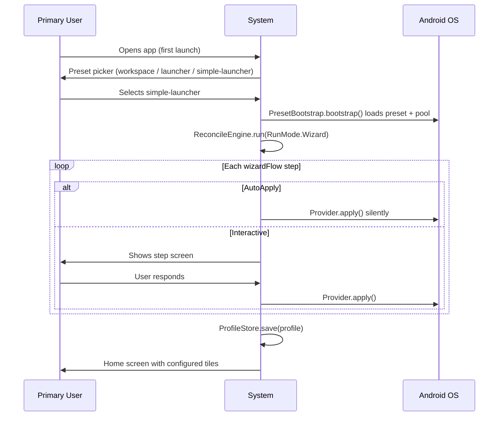
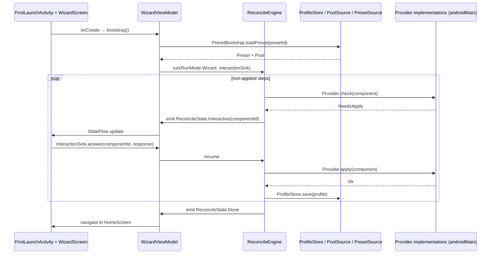
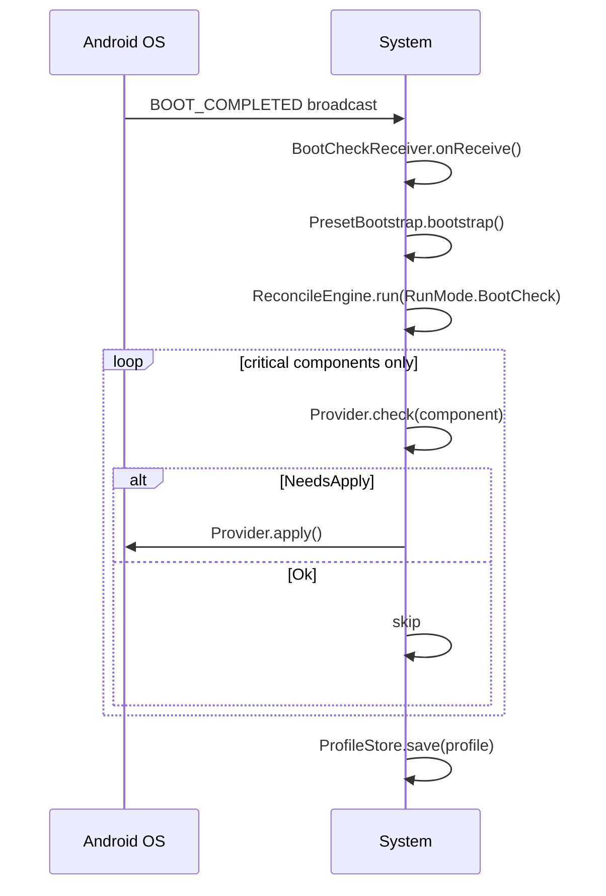
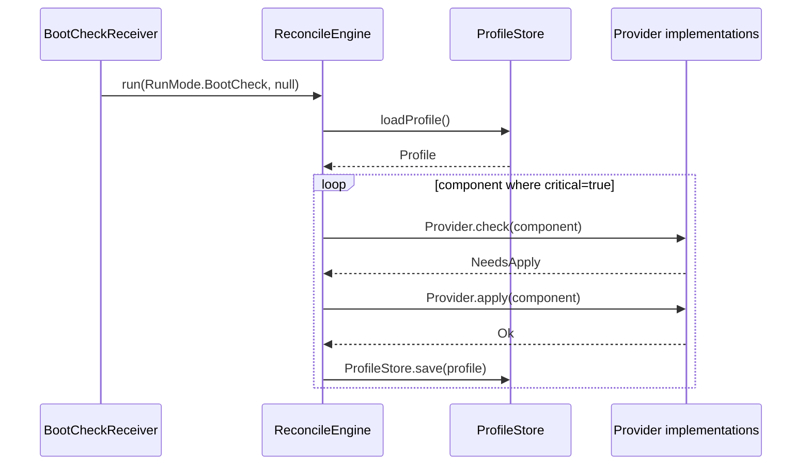
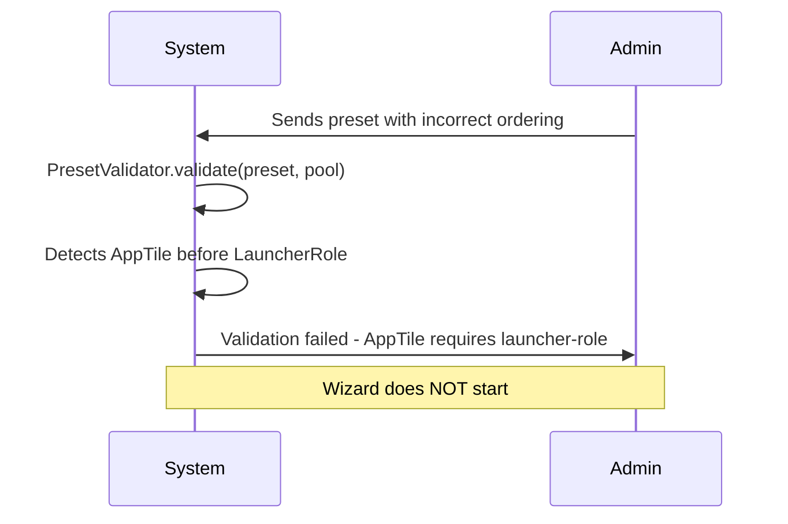
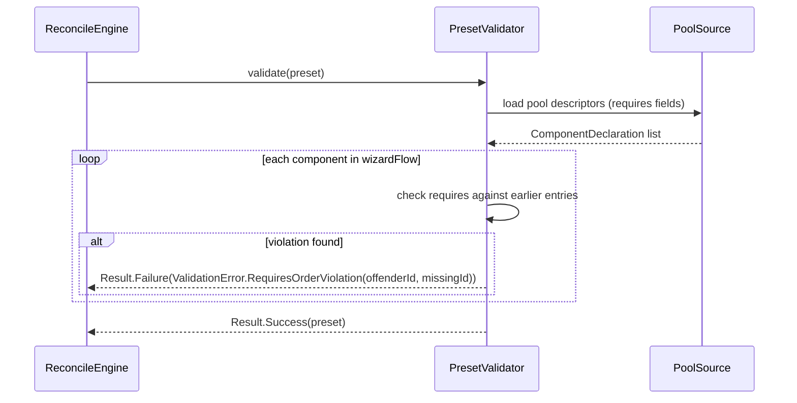

# Feature Specification: Wizard Runtime Migration to Preset Composition

**Feature Branch**: `task-126-wizard-runtime-migration`
**Created**: 2026-07-11
**Status**: Draft
**Backlog task**: [task-126](../../backlog/tasks/task-126%20-%20Wizard%20runtime%20migration%20to%20Preset%20composition%20foundation.md)
**Input**: OpenSpec design.md (D1–D9) + proposal.md + tasks.md от opsx:propose сессии. TASK-120 foundation готов — Component/Pool/Preset/Profile + ReconcileEngine + Provider<T> + bundled JSON seeds + `task120Module`. Три параллельных движка в кодовой базе (legacy wizard, TASK-65 model, TASK-120 foundation) схлопываются в один.

---

## User Scenarios & Testing *(mandatory)*

Задача — **технический рефакторинг без изменения UX**. Primary user (пользователь устройства) и remote administrator видят ровно то же самое до и после. Поэтому сценарии сформулированы через **наблюдаемое поведение** — то, что человек может проверить на устройстве, а не через внутренние API.

### User Story 1 — Первый запуск лаунчера (Priority: P1)

Primary user получает устройство после fresh install. При первом запуске лаунчер проводит через wizard-шаги: выбор preset'а → настройка шагов → home screen. После миграции поведение идентично pre-migration (сравнение через verification-evidence screenshot TASK-120).

**Why this priority**: самый критичный path. Если первый запуск сломан — устройство неюзабельно.

**Independent Test**: `./gradlew :app:testMockBackendDebugUnitTest -tests "*PresetBootstrap*"` — `PresetBootstrap.bootstrap()` + `ReconcileEngine.run(RunMode.Wizard, fakeInteractionSink)` завершается без ошибок, все шаги получили статус Applied или Pending(Interactive).

**Acceptance Scenarios**:

1. **Given** fresh install лаунчера на Xiaomi Redmi Note 11, **When** открывается приложение впервые, **Then** показывается экран выбора preset'а (workspace / launcher / simple-launcher), выбор запускает wizard, каждый шаг применяется, финальный экран — home с настроенными плитками.
2. **Given** пользователь выбрал `simple-launcher`, **When** проходит wizard, **Then** UX визуально идентичен `verification-evidence/task-120-xiaomi-first-launch.png` (те же шаги, тот же порядок, те же тексты).
3. **Given** пользователь прошёл 2 шага wizard'а и закрыл app, **When** открывает снова, **Then** wizard возобновляется с шага 3 (Profile.preWizardSnapshot сохранён), пройденные шаги не переспрашиваются.
4. **Given** пользователь начал wizard и нажал «Отменить», **When** подтвердил отмену, **Then** Profile восстанавливается из snapshot; home screen показывает состояние до wizard'а.

---

### User Story 2 — Wizard без двойных диалогов permission (Priority: P1)

В legacy wizard некоторые CheckHandler + ApplyHandler пары просили разрешения дважды (баг из-за дублирования логики). После миграции — каждый permission dialog появляется ровно один раз, в контексте того Component'а, которому он нужен.

**Why this priority**: двойные диалоги — ухудшение UX, замеченное в TASK-120 verification.

**Independent Test**: `LauncherRoleProviderTest` — `check()` возвращает `Ok` если лаунчер уже default, `NeedsApply` если нет; `apply()` открывает system dialog ровно один раз.

**Acceptance Scenarios**:

1. **Given** полный wizard на устройстве, **When** пользователь проходит все шаги, **Then** каждый системный dialog (разрешения, выбор default лаунчера) появляется максимум один раз.
2. **Given** лаунчер уже установлен как default (повторный запуск wizard'а), **When** ReconcileEngine обрабатывает `LauncherRole`, **Then** system dialog не показывается — `check()` вернул `Ok`, шаг пропущен.

---

### User Story 3 — Persistence через force-close (Priority: P1)

Primary user случайно закрывает app в середине wizard'а. Ребут — не теряет место.

**Why this priority**: частый сценарий на пожилых устройствах (кнопка «Назад» / battery save kill).

**Independent Test**: Robolectric — создать Profile с 3 шагами, сохранить через ProfileStore, уничтожить process, загрузить снова, проверить что `status=Applied` у шага 1 сохранился.

**Acceptance Scenarios**:

1. **Given** пользователь прошёл шаг 1 wizard'а, **When** произошёл force-close, **Then** при следующем открытии wizard показывает шаг 2 (step 1 Applied в ProfileStore).
2. **Given** force-close на шаге с `WizardBehavior.Interactive`, **When** wizard возобновляется, **Then** шаг снова показывается (status остался Pending), пользователь не теряет interactive choice.

---

### User Story 4 — BootCheck после reboot (Priority: P2)

После ребута устройства ReconcileEngine прогоняет только `critical: true` компоненты. Восстанавливает состояние без участия пользователя.

**Why this priority**: основной fallback механизм для «бабушка выключила Wi-Fi».

**Independent Test**: `BootCheckProviderTest` — fake Profile с одним critical компонентом, запустить `RunMode.BootCheck`, проверить что только critical Provider вызван.

**Acceptance Scenarios**:

1. **Given** пройден wizard на Xiaomi, **When** force-reboot устройства, **Then** при старте OS BootCheckReceiver запускает ReconcileEngine, critical компоненты применяются заново, home screen появляется в настроенном состоянии.
2. **Given** FontSize (не critical), **When** BootCheck запущен, **Then** FontSize не проверяется и не меняется.

---

### User Story 5 — Settings edit round-trip (Priority: P2)

Remote administrator (или сам primary user через Settings) меняет настройку. Изменение применяется через тот же ReconcileEngine (`RunMode.Single`), без Wizard-семантики.

**Why this priority**: после migration Settings должны работать на новом API; PendingChecklistViewModel на ConfigKind = регрессия.

**Independent Test**: `PendingChecklistViewModelTest` — изменить FontSize через `Preset.settingsMap[]`, прогнать `RunMode.Single`, проверить что Provider вызван с новым значением.

**Acceptance Scenarios**:

1. **Given** пройден wizard, **When** administrator открывает Settings и меняет размер шрифта, **Then** изменение сохраняется, `FontSizeProvider.apply` вызывается, шрифт на экране обновляется без перезапуска app.
2. **Given** Settings edit round-trip на Xiaomi, **When** изменить любой параметр и закрыть/открыть app, **Then** параметр сохранён (DataStore persistence).

---

### User Story 6 — Статус-бар скрывается через Preset (Priority: P2)

`StatusBarPolicy` Component в Preset — скрывает status bar через `WindowInsetsController`. AccessibilityService из manifest удалён.

**Why this priority**: AccessibilityService — лишнее разрешение, создаёт трудности при публикации в Play Store.

**Independent Test**: `StatusBarPolicyProviderTest` — mock `WindowInsetsControllerCompat`, вызвать `apply()`, проверить что `hide(statusBars())` вызван.

**Acceptance Scenarios**:

1. **Given** Preset содержит `StatusBarPolicy`, **When** wizard применяет шаг, **Then** status bar скрыт на Xiaomi (проверить визуально).
2. **Given** Preset без `StatusBarPolicy` (например clinic preset), **When** wizard завершён, **Then** status bar остаётся видимым.
3. **Given** app установлен после migration, **When** проверить manifest через `aapt dump`, **Then** `android.accessibilityservice.AccessibilityService` отсутствует.

---

### User Story 7 — Кодовая база чистая от legacy импортов (Priority: P2)

После Phase 6 ни один production-файл не содержит `import com.launcher.api.wizard`. Fitness function #11 (lint rule FF-011) блокирует регрессию.

**Why this priority**: ключевой gate migration — без cleanup migration считается незавершённой.

**Independent Test**: `./gradlew lint` → FF-011 zero violations; `git grep "import com.launcher.api.wizard"` → no output.

**Acceptance Scenarios**:

1. **Given** завершена Phase 6, **When** `git grep "import com.launcher.api.wizard"` на production code, **Then** output пустой.
2. **Given** разработчик случайно добавит legacy import, **When** `./gradlew lint`, **Then** build упадёт с сообщением FF-011 + файл + строка.

---

### Edge Cases

- **Холодный старт / инициализация** → Android SplashScreen показывается пока `PresetBootstrap` загружает JSON; `StateFlow` в состоянии `ReconcileState.Loading`; wizard-экран появляется только после первого non-Loading emit (CL-1).
- **MIUI `WindowInsetsController` нестандартное поведение** → если `StatusBarPolicyProvider` не работает на MIUI, fallback на `FLAG_FULLSCREEN` через `MANUFACTURER`-detection inline в Provider (не в preset schema).
- **Пропущенный call site при migration 411 импортов** → FF-011 lint rule ловит на compile time после Phase 6 deletion; до deletion — `git grep` в PR checklist.
- **Koin `UninitializedPropertyAccessException` при холодном старте** → integration test в Phase 2 проверяет Koin graph resolution перед `FirstLaunchActivity.onCreate`.
- **E2E golden JSON несовместим с новым schemaVersion 2** → регенерация в Phase 5 commit; diff включается в PR description для reviewer.
- **`requires` dependency нарушено в preset** → `PresetValidator` возвращает `Result.Failure(ValidationError.RequiresOrderViolation)` до старта wizard. В production обёртка над bootstrap показывает user-facing error screen + предложение «переустановить приложение»; обезличенный краш-репорт отправляется владельцу автоматически (CL-8).
- **hint-pool.json отсутствует** → `hintFlow` defaults to empty list, никаких crashes; hint overlays не показываются. `HintPoolSource` port имеет `BundledHintPoolSource` adapter; отсутствующий JSON → пустой pool (CL-7).
- **Configuration change (rotation / dark-mode toggle)** → wizard интерактивно пересобирается в новом configuration; interactive user response (частично введённые ответы) восстанавливается через `SavedStateHandle` в `WizardViewModel`. Preset может опционально задать `ScreenOrientationPolicy` Component для запрета rotation (например «всегда portrait») — future item (CL-5).
- **Language change mid-wizard** → wizard пересобирается интерактивно с новым locale (не откладывая до следующего шага). `AppCompatDelegate.setApplicationLocales()` триггерит recreation; `WizardViewModel` перечитывает preset и рендерит текущий шаг заново (CL-5, CL-9).
- **BootCheckReceiver 10-second limit** → `onReceive()` только dispatch'ит в `BootCheckWorker` (WorkManager), не запускает `ReconcileEngine` inline. Гарантирует что receiver вернётся до истечения ANR-таймаута даже если reconcile медленный (CL-9).
- **Permission denied на recommended шаге (`required=false`)** → шаг отмечается как skipped, wizard продолжается; повторно не спрашиваем (реальный state виден через `Provider.check()` на следующем resume) (CL-6).
- **Permission denied на required шаге (`required=true`)** → wizard блокируется, экран предлагает «Этот preset требует X. Попробуй preset Y, где это необязательно», не «переустановите app» (CL-6).

---

## Requirements *(mandatory)*

### Functional Requirements

- **FR-001**: System MUST wire `FirstLaunchActivity.onCreate()` → `PresetBootstrap.bootstrap()` → `ReconcileEngine.run(RunMode.Wizard, interactionSink)`. Legacy `WizardEngineImpl` MUST NOT be called. `FirstLaunchActivity` MUST use Android SplashScreen API; `WizardViewModel` emits `ReconcileState.Loading` until `PresetBootstrap` completes initialization; wizard UI renders only after first non-Loading state emission (CL-1).
- **FR-002**: System MUST include `LauncherRole` Component subtype (no parameters). `LauncherRoleProvider.check()` detects if launcher is already default home; if yes → `Ok` (skip dialog); if no → `NeedsApply`. `apply()` sends `Intent.ACTION_CHANGE_DEFAULT_DIALER` equivalent for home role. Preset without `LauncherRole` = system MUST NOT request home assignment. **Permission denial UX** (CL-6): if a step is `required=false` and the user declines → mark step as `Skipped`, wizard proceeds, no re-prompt (subsequent `check()` on next resume reveals the real state). If a step is `required=true` and the user declines → wizard shows a blocking screen offering to **switch to a different preset** where that permission is not required (never «reinstall the app»).
- **FR-003**: System MUST include `Theme` Component subtype with fields `paletteSeedHex: String`, `typographyScale: TypographyScale`, `shapeStyle: ShapeStyle`, `darkMode: Boolean`. `ThemeRef(name: String)` convenience expands to flat fields at write time against bundled `theme-catalog.json`. Wire format MUST NOT contain `ThemeRef` — only expanded flat fields (D3). `Theme` MUST NOT appear in `wizardFlow` — wizard visual appearance is controlled by a separate `wizardPresentation: { darkMode: Boolean, typographyScale: TypographyScale }` field in `Preset`, applied once at wizard start. Kiosk-mode settings (StatusBar, LauncherRole) are applied post-wizard on transition to home screen, NOT during wizard or settings flows (CL-2).
- **FR-004**: System MUST include `Language` Component subtype with `locale: String`. Sentinel `"system"` = follow OS locale via `AppCompatDelegate.setApplicationLocales()`. `null` locale MUST be rejected at deserialization by `PresetValidator`. Default for new Presets = `"system"` (D4).
- **FR-005**: System MUST include `StatusBarPolicy` Component subtype (no parameters). `StatusBarPolicyProvider.apply()` hides status bar via `WindowInsetsControllerCompat.hide(statusBars())`. `AccessibilityService` MUST be deleted. `uses-accessibility-service` manifest declaration MUST be removed (D8).
- **FR-006**: Pool JSON component descriptors MUST support optional `requires: List<ComponentId>?` field. `PresetValidator` MUST run at Preset deserialization and verify `wizardFlow` ordering: each Component's dependencies must appear earlier in the flow. Violation → `Result.Failure(ValidationError.RequiresOrderViolation(offenderId, missingId))` (D7, revised by CL-8 — see FR-019, no exception thrown). Pool component descriptors MUST also support `required: Boolean` field (default `false`). Wizard is considered complete when all `required=true` components have status `Applied`; optional components are offered but do not block home screen launch (CL-3). **Design guideline**: preset authors SHOULD avoid `required=true` where an alternative preset can satisfy the same user need; treat `required=true` as blocking (see FR-002 denial UX) (CL-6).
- **FR-007**: `Preset` MUST gain optional `hintFlow: List<HintFlowEntry>?` field. `HintFlowEntry` contains `hintId: String`, `targetComponentId: String`, `textKey: String`. Hint pool is loaded through a `HintPoolSource` port (domain, `core/commonMain`), with a `BundledHintPoolSource` adapter (androidMain) reading `hint-pool.json` from assets (CL-7, per CLAUDE.md rule 9 shareability-readiness — additional sources — file import, share-intent, marketplace — plug in additively). `hint-pool.json` MUST carry `schemaVersion: 1` (CLAUDE.md rule 5). `TutorialHint` MUST NOT be a `Component` subtype and MUST NOT be processed by `ReconcileEngine` — hint rendering is UI-layer responsibility (D5).
- **FR-008**: `InteractionSink` interface MUST be defined in domain: `suspend fun answer(componentId: ComponentId, response: UserResponse)`. `WizardScreen` Composable MUST consume `StateFlow<ReconcileState>` + call `InteractionSink`. `WizardViewModel` wraps `ReconcileEngine` + exposes `InteractionSink`. **No separate `WizardStore` / `lastCompletedStepIndex` counter is persisted** (revised by CL-5, supersedes original CL-3 decision). Wizard progress is derived on every run by calling `Provider.check()` for each Component in `wizardFlow`: a Component with `check() == Ok` is considered Applied (skipped in wizard); a Component with `check() == NeedsApply` is a pending step. Source of truth = Android OS state + `Profile` (already persisted by `ProfileStore`), never a separate step counter. Rationale: eliminates drift between «wizard thinks step is done» and «Android OS state was changed externally / by system update / by user in Settings» (CL-5).
- **FR-009**: `PendingChecklistViewModel` and all Settings screens MUST be migrated from `ConfigKind` to `Preset.settingsMap[]` + `ProfileStore`. No Settings screen MUST reference `ConfigKind` after Phase 3.
- **FR-010**: All `CheckHandler` / `ApplyHandler` pairs from `adapters/wizard/` MUST be migrated to `Provider<T>` implementations in `com.launcher.preset.provider.*`.
- **FR-011**: `WizardCheckpointStore` MUST be deleted. All callers MUST use `ProfileStore.setPreWizardSnapshot()` (already exists in TASK-120).
- **FR-012**: `BootCheckReceiver` MUST use `PresetBootstrap` + `ReconcileEngine.run(RunMode.BootCheck)`. No reference to legacy `WizardEngine` in boot path.
- **FR-013**: All four E2E tests (`BootBenchmarkE2ETest`, `BootCriticalMissingE2ETest`, `FirstLaunchPickerE2ETest`, `XiaomiOemMatrixE2ETest`) MUST be migrated to `PresetBootstrap` + `ReconcileEngine` API. `simple-launcher` golden JSON MUST be regenerated for `schemaVersion: 2`.
- **FR-014**: `Preset` schemaVersion MUST be bumped to 2 (new `hintFlow` field). `Pool` schemaVersion MUST be bumped to 2 (new `requires` field on component descriptors). Both changes MUST be backward-compatible: v1 readers ignore new fields; v2 readers default missing fields.
- **FR-015**: Fitness function FF-011 (lint rule) MUST be added: any `import com.launcher.api.wizard` in `app/` or `core/` production source → build failure with descriptive message. Implemented as custom lint check.
- **FR-016**: DI MUST be consolidated: `Spec015Module` + `Task65Module` → single `PresetModule` (rename/merge of `task120Module`). No reference to `Spec015Module` or `Task65Module` after Phase 6. Phase 3 MUST audit `PresetSelectionService` + `PresetSwitchService` against ECS-notation (Component/Provider/Profile); if naming or logic diverges from new model — rewrite cleanly, do NOT carry over legacy logic. Phase 6 checklist MUST include `git grep "import com.launcher.api.preset"` returning zero results in production code, in addition to FF-011 (CL-4).
- **FR-017**: No wire-format migration writer. All legacy `wizard/` assets (`core/androidMain/assets/wizard/` tree) MUST be deleted outright. Zero production users = no migration beneficiaries (D1).
- **FR-018**: `SystemSettingPort` / `PermissionRequestPort` MUST be migrated into `SystemPermissionProvider` via facade wrapper per CLAUDE.md rule 2 (ACL). Domain remains unaware of Android platform types.
- **FR-019**: `PresetValidator` MUST return `Result<Preset, ValidationError>` (Kotlin `Result` or in-house sealed variant) — NO exceptions thrown across domain boundary (revised from D7). `ValidationError` sealed class in domain covers `RequiresOrderViolation`, `UnknownComponentId`, `NullLocale`, `SchemaVersionUnsupported`. Bundled presets MUST be validated at compile-time via a unit test (`BundledPresetValidationTest`) that loads every JSON in `assets/presets/` and asserts `Result.Success`. Compile-time gate + typed error surface replace runtime `PresetValidationException` (CL-8).
- **FR-020**: In production, if a `Result.Failure` from `PresetValidator` reaches `PresetBootstrap`, the app MUST show a user-facing error screen (localized: «Не удалось загрузить настройки. Попробуйте переустановить приложение.») + auto-send an anonymized crash report to the owner via the crash reporting adapter. For the beta phase, the crash reporting adapter forwards reports directly to the owner (mechanism: implementation detail — specific SDK deferred to a follow-up preset field / adapter selection). Crash payload MUST NOT contain PII, user content, or identity tokens (CL-8, aligns with CLAUDE.md rule 13 opaque-blob posture — crash payload treated as opaque bytes by the reporting adapter).
- **FR-021**: The Wizard and Settings UI MAY diverge visually from the main launcher facade (different theme, layout, typography). This is an explicit design allowance, NOT a bug (CL-5). Concretely: `wizardPresentation` field in `Preset` (already introduced by CL-2) controls wizard visual layer; Settings screens use standard Material3 theme, not the kiosk-mode presentation. The main facade (home screen) uses the full `Theme` Component from `activeComponents`.
- **FR-022**: Locale change mid-wizard (user opens system Settings → language → returns) MUST trigger interactive wizard rebuild in the new locale. Concretely: `Activity` reacts to `Configuration.locale` change through the standard Android configuration-change mechanism; `WizardViewModel` retained across recreation via `SavedStateHandle` re-renders the current step in the new locale (target: < 200 ms user-perceived rebuild). No «apply on next step» deferral. Rotation follows the same interactive-rebuild path unless the preset declares a `ScreenOrientationPolicy` Component (future — see Assumptions).

### Non-Functional Requirements

- **NFR-001**: ReconcileEngine cold-start delta MUST remain ≤ 30 ms on Pixel 5 baseline (already verified in TASK-120, regression guard).
- **NFR-002**: `./gradlew :app:testMockBackendDebugUnitTest :core:testMockBackendDebugUnitTest` MUST be green after Phase 1 and remain green through all subsequent phases.
- **NFR-003**: `./gradlew lint` MUST pass after Phase 6 with FF-011 reporting zero violations.
- **NFR-004**: UX after migration MUST be visually identical to `verification-evidence/task-120-xiaomi-first-launch.png` — no user-visible regressions.

---

## Success Criteria *(mandatory)*

- **[backlog] SC-1**: На Xiaomi Redmi Note 11 — fresh install → первый запуск показывает preset picker, wizard проходит без ошибок, home screen показывает настроенные плитки. UX идентичен pre-migration screenshot.
- **[backlog] SC-2**: Полный wizard-проход `simple-launcher` на Xiaomi завершается без падений и без двойных диалогов permission.
- **[backlog] SC-3**: Force-close во время wizard step 2 → reopen → wizard возобновляется с step 2.
- **[backlog] SC-4**: Force-reboot → BootCheck реapply'ит critical компоненты.
- **[backlog] SC-5**: `git grep "import com.launcher.api.wizard"` возвращает 0 в production code.
- **[backlog] SC-6**: Файлы `core/src/commonMain/kotlin/com/launcher/api/wizard/*.kt` удалены (git log подтверждает).
- SC-7 (tech): `./gradlew :app:testMockBackendDebugUnitTest :core:testMockBackendDebugUnitTest` зелёный.
- SC-8 (tech): `./gradlew :app:connectedMockBackendDebugAndroidTest --tests "*E2E*"` зелёный на Xiaomi.
- SC-9 (tech): `./gradlew lint` → FF-011 zero violations.
- **[backlog] SC-10**: No separate wizard-progress counter is persisted. Wizard progress is derived from `Provider.check()` results on every launch — the single source of truth is Android OS state + `Profile` (CL-5).
- **[backlog] SC-11**: Language change during the wizard rebuilds the UI in the new locale within 200 ms without «apply on next step» delay (CL-5, CL-9). Verified on Xiaomi Redmi Note 11 by switching system language mid-wizard.
- SC-12 (tech): `BundledPresetValidationTest` — every JSON under `assets/presets/` returns `Result.Success` from `PresetValidator` at CI time (CL-8).

---

## Assumptions

- **No production users** — нет пользователей на production build'е, поэтому wire-format migration writer не нужен (D1). Если появятся до Phase 6 — решение пересматривается.
- **TASK-120 foundation complete** — Component/Pool/Preset/Profile + ReconcileEngine + Provider<T> port + bundled JSON seeds + `task120Module` Koin wiring готовы и верифицированы на Xiaomi.
- **One active Preset per device** — multi-preset на одном устройстве out of scope; future TASK-127.
- **iOS providers deferred** — KMP-ready ports, Android-only adapters в этой задаче. iOS добавляется additive.
- **ThemeRef — write-time only** — sugar alias, не wire-format entity. Future theme rename не ломает persisted Presets.
- **Wizard works as standard Android app** — во время wizard и settings кiosk-настройки (StatusBar hide, LauncherRole) НЕ применяются. Пользователь видит обычный Android UI. Киоск включается только после перехода на home screen (CL-2).
- **Wizard and Settings may look different from the main facade** — по решению CL-5 wizard/settings UI могут визуально отличаться от главного экрана (свой `wizardPresentation`; Settings — standard Material3). Это дизайн-разрешение, не отклонение (FR-021).
- **Wizard progress is not persisted separately** — no `WizardStore` / `lastCompletedStepIndex` counter (CL-5, revises earlier CL-3 decision). Progress is derived from `Provider.check()` results + `Profile` state on every run. Factory reset или внешнее изменение Android state (через system Settings) корректно отражается на следующем запуске wizard — эффект «wizard считает шаг сделанным, а реальность другая» невозможен by construction.
- **Required vs optional steps** — wizard не блокирует запуск home screen если все `required=true` шаги Applied, даже если необязательные не пройдены (CL-3). Preset authors предпочитают `required=false` и рекомендуют alternative preset если permission недоступен (CL-6, FR-002 denial UX).
- **`BootCheckReceiver` uses WorkManager** — receiver'у Android даёт ~10 секунд на `onReceive()` до ANR. `BootCheckReceiver` немедленно enqueue'ит `BootCheckWorker` (WorkManager) и возвращается; reconcile сам по себе выполняется вне receiver context'а (CL-9, addresses risk of slow reconcile on cold boot).
- **Interactive updates preferred over deferral** — при любом изменении Android state (permission granted через system Settings, locale change, dark-mode toggle, rotation) wizard пересобирается интерактивно, не откладывая до next step. Rebuild time target: < 200 ms (CL-5, CL-9).
- **Future: `ScreenOrientationPolicy` Component** — optional Component subtype allowing a preset to lock orientation (e.g., «always portrait»). NOT in scope for TASK-126; recorded here as an additive follow-up if a preset needs it. Aligns with FR-022 configuration-change strategy (CL-5).
- **API 35+ / OEM matrix — explicit paths per combination** — supported Android version × OEM × device version combinations are enumerated in unit tests + verified on physical devices (Xiaomi baseline; add matrix rows as devices join). Errors are expected surfaces; we cover them by tests + on-device runs, not by a single «universal» path (CL-9).
- **Crash reporting mechanism deferred** — конкретный SDK / endpoint для обезличенных краш-репортов — implementation detail, выбирается на plan-time (candidates: Firebase Crashlytics, Sentry self-hosted, custom-worker endpoint). Обязательно: payload — opaque bytes, no PII (aligns with CLAUDE.md rule 13). FR-020 declares the requirement; adapter selection is additive.

---

## Sequences

### SEQ-1: Первый запуск через ReconcileEngine (new flow)

Pre: app installed, `task120Module` resolved, no existing Profile. Post: Profile saved with Applied/Pending statuses, home screen displayed.
Used-in: spec/task-126-wizard-runtime-migration.

#### Spec-level (behavior)

#### Plan-level (architecture)

<!-- MENTOR-DETAIL:BEGIN -->
#### Пояснение для владельца

**Что происходит**: вместо старого WizardEngine (который делал то же самое по-своему), первый запуск теперь идёт через ReconcileEngine — единственный движок в системе.

- **`FirstLaunchActivity`** — экран-хозяин на Android. Запускает процесс.
- **`PresetBootstrap`** — «загрузчик предустановки». Читает JSON-файл preset'а и pool.json из папки assets.
- **`ReconcileEngine`** — «движок согласования». Проходит по шагам preset'а один за одним. Для каждого шага: сначала проверяет (`check`) — нужно ли что-то делать; если да — делает (`apply`).
- **`Provider`** — исполнитель конкретного шага. `LauncherRoleProvider` делает лаунчер дефолтным, `StatusBarPolicyProvider` скрывает строку статуса и т.д.
- **`ProfileStore`** — «сейф состояния». После каждого шага сохраняет прогресс на диск. Если app вылетит — при следующем открытии продолжим с того же места.
- **`WizardViewModel`** — «переводчик» между движком и экраном. Движок говорит «пора показать шаг FontSize», ViewModel обновляет StateFlow, WizardScreen перерисовывает экран.

Всё что видит пользователь — те же экраны, тот же порядок. Под капотом — один движок вместо двух.
<!-- MENTOR-DETAIL:END -->

---

### SEQ-2: BootCheck после reboot

Pre: Profile saved with `critical: true` components. Post: critical components re-applied, no user interaction needed.
Used-in: spec/task-126-wizard-runtime-migration.

#### Spec-level (behavior)

#### Plan-level (architecture)

<!-- MENTOR-DETAIL:BEGIN -->
#### Пояснение для владельца

**BootCheck** — автоматическая проверка при включении устройства. Не требует действий от пользователя.

- Android посылает сигнал `BOOT_COMPLETED` когда устройство включилось.
- `BootCheckReceiver` перехватывает этот сигнал и запускает ReconcileEngine в режиме BootCheck.
- В этом режиме проверяются только **критичные компоненты** (те у которых `critical: true` в preset'е). Например, блокировка настроек сети.
- Некритичные (размер шрифта, цвет темы) — пропускаются. Их пользователь мог намеренно изменить.

Польза: если кто-то случайно изменил важную настройку пока устройство работало — при следующей перезагрузке всё восстановится само.
<!-- MENTOR-DETAIL:END -->

---

### SEQ-3: PresetValidator блокирует битый preset

Pre: Preset loaded with incorrect `wizardFlow` ordering. Post: `PresetValidator` returns `Result.Failure(ValidationError.RequiresOrderViolation)` before wizard starts (CL-8).
Used-in: spec/task-126-wizard-runtime-migration.

#### Spec-level (behavior)

#### Plan-level (architecture)

<!-- MENTOR-DETAIL:BEGIN -->
#### Пояснение для владельца

**PresetValidator** — «охранник на входе». Проверяет preset до того как wizard стартует.

Проблема которую он решает: если в preset'е шаги идут в неправильном порядке (например «установить WhatsApp» идёт раньше чем «сделать лаунчер дефолтным»), wizard зависнет на середине с непонятной ошибкой.

Validator проверяет: если компонент A требует чтобы компонент B был до него (`requires: ["launcher-role"]` в pool.json) — убедиться что B действительно стоит раньше в `wizardFlow`. Если нет — validator возвращает `Result.Failure(ValidationError)` (по CL-8), а не бросает исключение через domain boundary. Это значит: код вызывающий validator обязан явно обработать оба случая (успех и ошибка) — компилятор не даст забыть.

Bundled preset'ы валидируются на build time через unit test (`BundledPresetValidationTest`) — до релиза битый preset в приложение попасть не может. Runtime failure возможен только если preset пришёл из внешнего источника; тогда production обёртка показывает user-facing error screen + отправляет обезличенный краш-репорт владельцу.
<!-- MENTOR-DETAIL:END -->

---

## Clarifications

### 2026-07-11 — Pre-plan clarification pass

| # | Question | Resolution |
|---|----------|------------|
| CL-1 | Что показывается пока ReconcileEngine инициализируется при холодном старте? | Android SplashScreen API. `StateFlow` стартует с `ReconcileState.Loading`. Wizard-экран появляется после готовности `PresetBootstrap` + `WizardViewModel`. |
| CL-2 | Тема wizard'а — один раз для всего wizard'а или per-step? И когда применяются киоск-настройки? | `Theme` — **не** элемент `wizardFlow`. В preset добавляется отдельное поле `wizardPresentation: { darkMode, typographyScale }`. Применяется один раз при старте wizard, не меняется в процессе. Wizard работает как обычное Android-приложение без киоск-настроек. Киоск включается при переходе на home screen после завершения wizard. |
| CL-3 | Кто хранит прогресс wizard'а и где граница между UI-прогрессом и системным состоянием? | Два раздельных слоя: (1) **Системное состояние** (LauncherRole, разрешения) живёт в Android OS — `Provider.check()` спрашивает через платформенный facade, не кэширует. (2) **UI-прогресс** — `WizardStore` (отдельный DataStore, локально), хранит `lastCompletedStepIndex`. При resume ReconcileEngine стартует с нужного шага, но делает `check()` заново — системное состояние могло измениться. `ProfileStore` — порт; wizard пишет через него не зная про DataStore. В pool descriptor добавляется `required: Boolean` — wizard завершён когда все `required=true` шаги Applied; необязательные предлагаются, не блокируют запуск. |
| CL-4 | `PresetSelectionService` / `PresetSwitchService` — переписать на месте или удалить и переосмыслить? | Открытый item для Phase 3: при реализации проверить на соответствие ECS-нотации (Component/Provider/Profile). Если нейминг или логика не совпадает с новой моделью — вычистить полностью, не тащить старое. В Phase 6 добавить `git grep "import com.launcher.api.preset"` в checklist наряду с FF-011. |

### Woven resolutions

**CL-1** → добавлено в FR-001 и Edge Cases (холодный старт / SplashScreen).

**CL-2** → добавлено в FR-003 (Theme): `wizardPresentation` — отдельное поле preset'а, не Component в `wizardFlow`; киоск-настройки применяются post-wizard. Добавлено в Assumptions.

**CL-3** → добавлено в FR-008 (InteractionSink / WizardViewModel): `WizardStore` отделён от `ProfileStore`. Добавлено в FR-006 (`required: Boolean` на pool descriptor). Добавлено в Edge Cases и Assumptions.

**CL-4** → добавлено в FR-016 (DI consolidation) как открытый item Phase 3 + Phase 6 grep checklist.

### 2026-07-11 — Second clarify pass (post-checklist)

Прошли чеклисты: state-management, ux-quality, wire-format, requirements-quality, permissions-platform. Пять сходящихся тем-пробелов (A..E) — все закрыты решениями владельца.

| # | Theme | Question | Resolution |
|---|-------|----------|------------|
| CL-5 | A. Mid-wizard lifecycle | Что происходит при configuration change / language change / rotation / process death в середине wizard'а? Wizard и Settings — часть «фасада» или могут выглядеть иначе? Где источник правды о прогрессе? | Wizard и Settings **могут** визуально отличаться от главного фасада (FR-021). Language change → wizard пересобирается интерактивно в новом locale, не откладывая (FR-022). Rotation — интерактивная пересборка; preset может опционально задать `ScreenOrientationPolicy` component (future). **Убираем `WizardStore` / `lastCompletedStepIndex` полностью** (revises CL-3): источник правды — Android OS state + `Profile`, wizard спрашивает `Provider.check()` на каждом запуске. FR-008 полностью переписан. |
| CL-6 | B. Permission denial UX | Что видит user при отказе от permission на recommended vs required шаге? | **Design guideline: `required=true` избегаем где возможно** (FR-006). Отказ на `required=false` → шаг skipped, wizard идёт дальше, повторно не спрашиваем (FR-002). Отказ на `required=true` → блокирующий экран с предложением **сменить preset** на тот, где эта permission не нужна («попробуй preset Y»), НЕ «переустановите app» (FR-002). |
| CL-7 | C. hint-pool.json schemaVersion + adapter shape | `hint-pool.json` без `schemaVersion` — нарушение rule 5. `HintPoolLoader` — концепт «loader» вместо port/adapter — нарушение rule 9. | `hint-pool.json` gains `schemaVersion: 1` (rule 5). `HintPoolLoader` → `HintPoolSource` port (domain) + `BundledHintPoolSource` adapter (androidMain) (FR-007, rule 9 additive sources). |
| CL-8 | D. PresetValidationException surface | Throwing `PresetValidationException` across domain boundary — нарушение rule 1 (domain returns transport-neutral values). Как ловим ошибку в bundled preset до release? | Compile-time gate: `PresetValidator` возвращает `Result<Preset, ValidationError>` (FR-019). Bundled presets валидируются CI-тестом `BundledPresetValidationTest`. В production runtime failure → user error screen + auto-anonymized crash report владельцу (FR-020). Для beta — краши идут напрямую владельцу; конкретный SDK — implementation detail plan-time. |
| CL-9 | E. API 35+ / OEM matrix + BootCheckReceiver timing + interactive updates | Что делать с 10-секундным лимитом `BroadcastReceiver.onReceive()`? Как покрываем API 35+ / OEM edge-cases? Интерактивно обновляем UI при Android state change или откладываем? | `BootCheckReceiver` только dispatch'ит в `BootCheckWorker` (WorkManager); reconcile не запускается inline (Edge Cases + Assumptions). API 35+ / OEM combinations — explicit paths per combination, покрываются unit тестами + прогонами на реальных устройствах (Xiaomi baseline). **Interactive updates preferred** — при любом Android state change (permission granted, locale, rotation) wizard пересобирается интерактивно, target < 200 ms (SC-11, FR-022). |

### Woven resolutions (second pass)

**CL-5** → FR-008 полностью переписан (убран WizardStore); FR-021, FR-022 добавлены; Edge Cases (configuration change, language change); Assumptions (progress derived, wizard/settings may diverge, future ScreenOrientationPolicy).

**CL-6** → FR-002 расширен denial UX; FR-006 design guideline; Edge Cases (denial paths); Assumptions (preset authors prefer required=false).

**CL-7** → FR-007 переписан (`HintPoolSource` port + `BundledHintPoolSource` adapter + `schemaVersion: 1`); Edge Cases (missing pool).

**CL-8** → FR-019 (PresetValidator returns `Result<Preset, ValidationError>`); FR-020 (production error screen + crash report); Edge Cases (validation failure UX); Assumptions (crash reporting deferred).

**CL-9** → Edge Cases (BootCheckReceiver 10s → WorkManager); Assumptions (BootCheckWorker, API 35+/OEM explicit paths, interactive updates); SC-11.

---

## Open Questions

Архитектурные вопросы (D1-D9 + CL-1..CL-9) разрешены. Open items для plan.md refinement:

- **API 35+ / OEM matrix — конкретные пути**: которые именно комбинации Android version × OEM × device version мы enumeration'им первыми? Plan-time решение; baseline Xiaomi Redmi Note 11, matrix rows добавляются по мере появления devices (CL-9).
- **Crash reporting adapter selection**: Firebase Crashlytics vs Sentry self-hosted vs custom Cloudflare Worker endpoint? Adapter выбор откладывается до реальной потребности (FR-020, additive) — beta timeline не блокирует.
- **`ScreenOrientationPolicy` Component**: future additive item (не в scope TASK-126), triggered когда первый preset потребует lock'а orientation.
