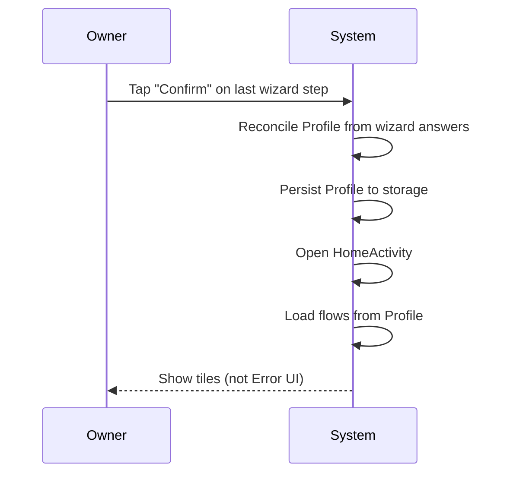
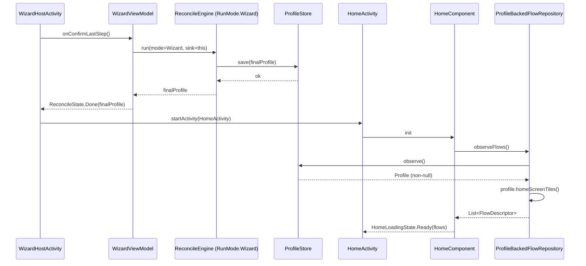
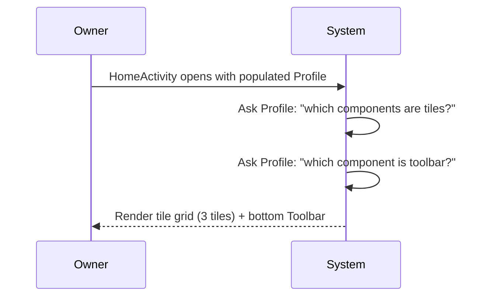
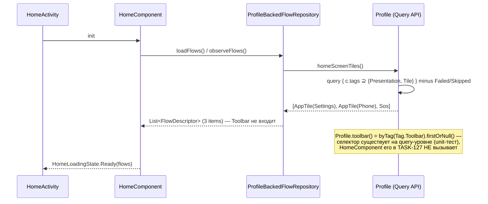
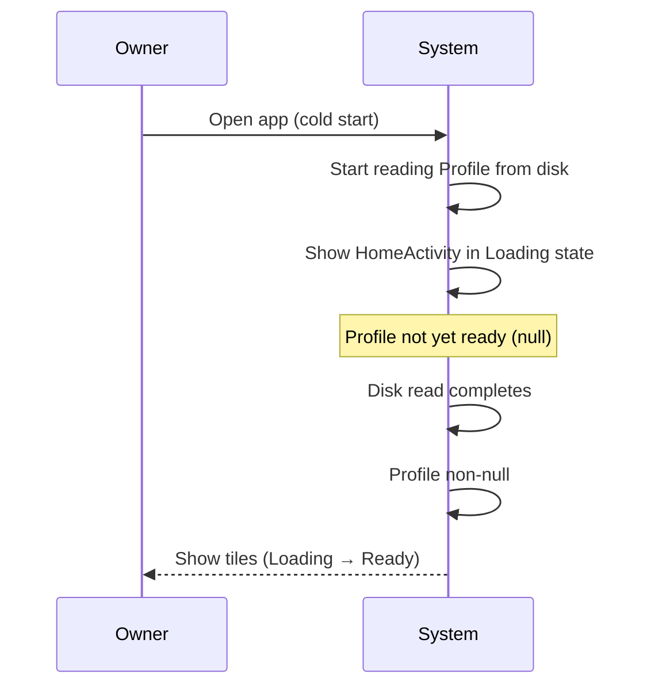
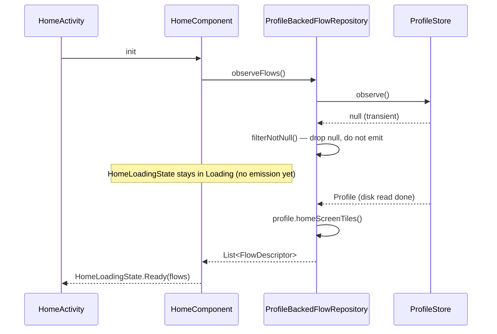
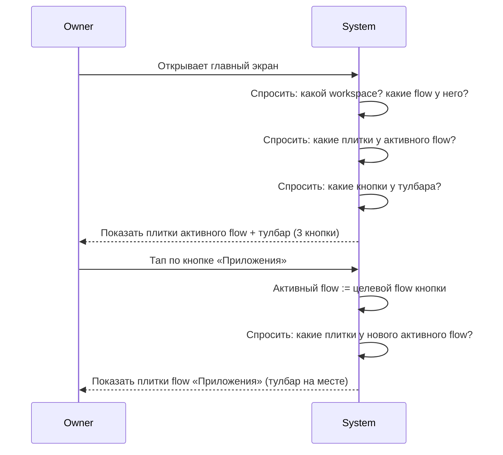
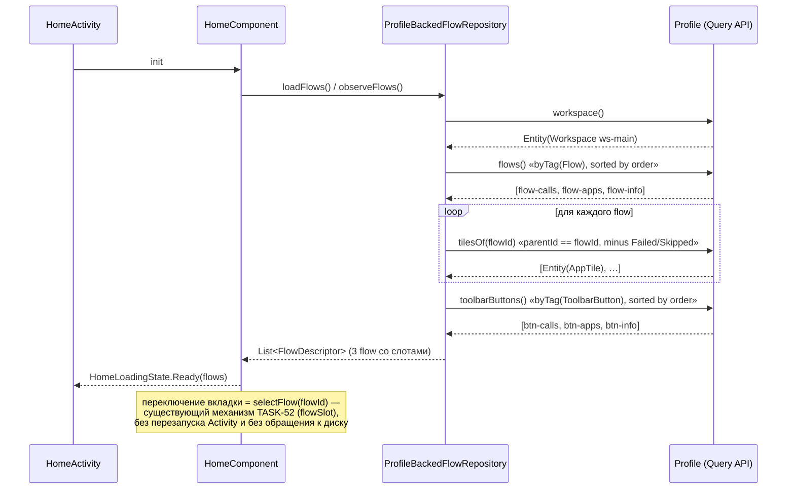

# Feature Specification: ECS Foundation (Entities, Tags, Query, Hierarchy) + HomeScreen Rewire

**Feature Branch**: `task-127-home-config-load-fix`
**Created**: 2026-07-14
**Updated**: 2026-07-16 — scope expanded to full ECS foundation (Q7): parent/children hierarchy, Workspace/Flow/ToolbarButton entity types, `Unverifiable` status, ECS naming. Earlier same-day: deep pre-implement audit reconciled artifacts with real code.
**Status**: Draft
**Backlog task**: [task-127](../../backlog/tasks/task-127%20-%20HomeActivity-config-load-failure-post-wizard-TASK-126-regression.md)
**Input**: TASK-127 Decision block (2026-07-15) — ECS Tags + Query pattern extending TASK-120.

---

## Clarifications

### 2026-07-15 — Pre-plan clarification pass

| # | Question | Resolution |
|---|----------|------------|
| 1 | `ProfileBackedFlowRepository.observeFlows()` при null Profile — что эмитит? | `filterNotNull` — stay in `Loading` пока Profile не появится. Fresh install покрывается wizard'ом (HomeScreen не показывается пока wizard идёт). HomeScreen null видит только в transient migration states. |
| 2 | Pool schemaVersion bump нужен? | Нет. `pool.json` — build-time артефакт (bundled в APK, immutable до next build). Override тегов идёт **через вложенный объект `component` внутри `ComponentDeclaration`** (никакого нового поля в `ComponentDeclaration` — audit 2026-07-16: `component: Component` уже встроен) — dev fixtures десериализуются корректно (default tags из Component subtype через kotlinx.serialization). Никакой миграции не требуется. |
| 6 | Profile migration writer нужен? (revised 2026-07-16, **re-revised аудитом 2026-07-16**) | **Нет migration writer** — суть решения без изменений: MVP не релизнут, потребителя миграции нет (rule 4 MVA). Отсутствие `tags` в JSON обрабатывается через constructor-defaults на Component subtypes (единственный источник истины). **Поправка аудита**: `schemaVersion` **остаётся 2**, не «сбрасывается на 1» — код (`Profile.CURRENT_SCHEMA_VERSION = 2`) и immutable TASK-120 Decision уже говорят «2», а `tags` — аддитивное поле, bump не нужен. Первый migration writer появится после production релиза при первом breaking change (v2 → v3). |
| 3 | `homeScreenTiles()` selector — как отличить плитку от Toolbar (оба Presentation)? | Ввести отдельный `Tag.Tile`. Начальный набор Tag enum — 10 значений: Presentation, Appearance, System, Safety, Capabilities, Communication, Accessibility, Emergency, **Tile**, **Toolbar**. `homeScreenTiles() = byAllTags(setOf(Tag.Presentation, Tag.Tile))`. Toolbar имеет `setOf(Tag.Presentation, Tag.Toolbar)` — в `homeScreenTiles()` не попадает, находится через `byTag(Tag.Toolbar).firstOrNull()`. |
| 4 | Toolbar в MVP: конфликт `Tag.Presentation` vs homeScreenTiles filter | Закрывается Q3 через отдельные `Tag.Tile` + `Tag.Toolbar`. `Profile.toolbar()` реализован через `byTag(Tag.Toolbar).firstOrNull()` — чистая query-based выборка без `is Toolbar` type check (deep-audit 2026-07-16 flagged paradigm mix, устранён). |
| 5 | Existing `ConfigBackedFlowRepository` тесты — что с ними? | Остаются зелёными (класс не удаляется, coverage сохраняется). `HomeComponentLoadingStateTest` расширяется НОВЫМ сценарием `postManifestWizardReconcile_profileSeeded_homeReady` для Profile-based path. Существующий config-based сценарий остаётся. |

### 2026-07-16 — Scope expansion pass (после разбора модели с владельцем)

| # | Question | Resolution |
|---|----------|------------|
| 7 | Одноуровневая модель (плоский список плиток) vs иерархия (workspace → flows → tiles + toolbar с кнопками-ссылками)? | **Иерархия, в этом же task'е.** Владелец описал целевой сценарий: workspace содержит 3 flow, тулбар с 3 кнопками, каждая кнопка переключает на свой flow; внутри flow — плитки (приложения, контакты, календарь). Одноуровневая модель это не вмещает → релиз с ней = migration writer для всех установленных профилей при добавлении иерархии. Pre-release добавление бесплатно. Владелец: «Если это так, значит, надо переписать это… мы должны сделать правильную архитектуру, выверенную с упором на ECS-подходы». **Реализация — flat storage + parent-ссылка** (канонический ECS-паттерн `Parent`/`Children`: Bevy `Parent`, Unity DOTS `Parent`, Android Launcher3 `favorites.container`): хранение остаётся плоским списком (rule: ECS ≈ таблица БД), дерево вычисляется запросом по `parentId`. Никакой вложенности в wire-формате. |
| 8 | Статус для настроек, которые физически нельзя проверить через API (системная шторка: цепочка интентов, Android не даёт read-back)? | **Добавить `ComponentStatus.Unverifiable`** + `Outcome.NeedsUserConfirmation`. Существующие 4 статуса (`Pending/Applied/Failed/Skipped`) заставляют такую настройку врать (`Applied` без оснований). Паттерн из индустрии (киоск-лаунчеры, MDM): (а) косвенная проверка того, что API отдаёт (permission выдана?), (б) подтверждение человеком — «откроются настройки, включите X, вернитесь, нажмите "Я включил"», (в) честный статус «не знаю». `BootCheck` НЕ перепроверяет `Unverifiable` на каждом старте (иначе вечное дёрганье пользователя) — только по явному действию в Settings. |
| 9 | Naming: `Component` значит три разных вещи (`Component` / `ComponentDeclaration` / `ProfileComponent`) — владелец споткнулся при чтении. | **Переименовать в канонический ECS-словарь**: `ProfileComponent` → **`Entity`** (сущность: id + данные + состояние + parent), `ComponentDeclaration` → **`Blueprint`** (заготовка в каталоге). `Component` остаётся (это и есть данные). `Profile` / `Pool` остаются (понятны владельцу, не двусмысленны). Pre-release переименование дешёвое: wire-формат не затрагивается (имена Kotlin-классов в JSON не участвуют; `@SerialName` дискриминаторы внутри `Component` сохраняются). Владелец: «желательно следовать ECS-паттерну, чтобы сразу было понятно, о чём идёт речь». |
| 10 | Профиль самодостаточен (копирует wizardFlow/settingsMap) или ссылается на пресет? | **Ссылается + оба хранятся/отправляются вместе.** Профиль остаётся «состоянием устройства» (`basedOnPreset` + `presetVersion` + entities), пресет — источником lifecycle-структуры. При admin-push отправляются оба. Владелец: «давай сейчас для точности возьмём, что оба отправляем… и храним оба». Будущее разделение профиля на части или вложение пресета в поле профиля — не принципиально, формат к обоим готов (аддитивно). |

---

## Context

- TASK-52 закрыл класс багов «HomeActivity Error state» через детерминированную `HomeLoadingState` machine.
- TASK-126 (wizard runtime migration) сломал путь wizard → HomeActivity: после прохождения wizard'а `HomeActivity` показывает Error UI вместо плиток.
- Root cause: между TASK-120 фундаментом (`Profile` / `Provider` / `ReconcileEngine`) и HomeScreen-стеком (`ConfigDocument` / `ConfigBackedFlowRepository`) образовался архитектурный gap — wizard пишет `Profile`, HomeScreen читает `ConfigDocument`, между ними нет моста.
- Mentor-сессия 2026-07-15: изначальный план «построить bridge через `LauncherPresentationBuilder` (Profile → ConfigDocument)» отброшен как построение моста на плохую архитектуру. Новое направление — **расширить TASK-120 через tagged-component-model (ECS-inspired, не canonical ECS)**: добавить `Component.tags: Set<Tag>` + `Profile.query { predicate }`, переключить HomeScreen на чтение `Profile` напрямую через query API. См. [ADR-012](../../docs/adr/ADR-012-tagged-component-model-vs-canonical-ecs.md) — где мы намеренно отклоняемся от canonical ECS (Bevy / Flecs / Unity DOTS) и почему.
- Preset lifecycle-категоризация (`wizardFlow` / `settingsMap` / `activeComponents`) сохраняется — ортогональна Tag semantic-категоризации. Обе дименсии сосуществуют.
- **Scope expansion 2026-07-16 (Clarifications Q7-Q10)**: разбор целевой модели с владельцем показал, что одноуровневого списка плиток недостаточно — реальный экран это `Workspace → N × Flow → tiles` + `Toolbar → N × ToolbarButton` (каждая кнопка переключает flow). Task расширен с «теги + запросы» до **полного ECS-фундамента**: entities с иерархией (`parentId`), новые entity-типы, честный статус `Unverifiable`, канонический ECS-нейминг. Обоснование: всё перечисленное — изменения wire-формата; pre-release они бесплатны, post-release каждое требует migration writer'а (rule 5). Это прямое применение мета-правила владельца «откладываем только то, что потом = дописывание, а не переписывание».
- **Ключевой инсайт**: UI-слой уже иерархичен — `FlowDescriptor(id, name, slots: List<SlotDescriptor>)` с `SlotDescriptor.action: Action?` (null = placeholder-плитка, «плюсик») существует со спеки 005. Не хватало представления этой иерархии в самой доменной модели профиля. Расширение сводит модель и UI к одной форме, а не изобретает новую.

---

## User Scenarios & Testing *(mandatory)*

### User Story 1 — Первый запуск до рабочего домашнего экрана (Priority: P0)

Пользователь устанавливает приложение на чистое устройство, проходит wizard до конца и видит рабочий HomeScreen с плитками — не Error UI.

**Why this priority**: end-to-end путь «install → wizard → home» сейчас сломан на физическом Xiaomi Redmi Note 11. Без этого никакое ручное тестирование MVP невозможно; блокирует TASK-128 verification bucket #1/#2.

**Independent Test**: JVM integration test (commonTest) — Profile с одним `Component.AppTile(packageName = "com.android.settings", labelKey = "tile_settings")` (default tags `{Presentation, Tile}`) в `FakeProfileStore` → `ProfileBackedFlowRepository.loadFlows()` возвращает `List<FlowDescriptor>` длины 1 → `HomeComponent.loadingState` эмитит `HomeLoadingState.Ready`.

**Acceptance Scenarios**:

1. **Given** свежая установка, blank profile, local mode, **When** пользователь проходит manifest-driven wizard (`WizardHostActivity`) до конца и попадает на `HomeActivity`, **Then** `HomeComponent` переходит через `Loading → Ready` (не `Error`), пользователь видит плитки.
2. **Given** пресет содержит default'ы для пустого профиля (например AppTile с `packageName="com.android.settings"`), **When** wizard завершается без явного выбора tiles пользователем, **Then** `ProfileBackedFlowRepository` возвращает non-empty `FlowDescriptor` список, `HomeLoadingState.Ready` с default-плитками.
3. **Given** пользователь редактирует Profile через Settings (добавляет/убирает AppTile), **When** `ProfileStore.observe()` эмитит новый Profile, **Then** `ProfileBackedFlowRepository.observeFlows()` эмитит обновлённый список без перезапуска Activity.

---

### User Story 2 — Разработчик добавляет новый Component с тэгами (Priority: P1, foundational)

Разработчик добавляет новый `TimeLockdown` Component в sealed hierarchy, объявляет `tags = setOf(Tag.System, Tag.Safety)` в конструкторе, никаких других изменений в engine / registry / repository не требуется. Существующие query'и по этим тэгам находят его автоматически.

**Why this priority**: это тест на «foundational» природу решения — если добавление нового Component требует правок в 5 местах, значит ECS-паттерн не работает и мы вернулись к ad-hoc getters. Также разблокирует Phase-2 фичи (safety indicators, hint overlays, toolbar buttons).

**Independent Test**: unit test — добавить fake Component `TestComponent(tags = setOf(Tag.System, Tag.Safety))` в Profile, вызвать `profile.byTag(Tag.System)` → результат содержит fake. Вызвать `profile.byTag(Tag.Presentation)` → не содержит.

**Acceptance Scenarios**:

1. **Given** новый `Component` subtype объявлен с непустым `tags` в default конструкторе, **When** он добавлен в Profile, **Then** `profile.byTag(<any-of-his-tags>)` его находит без каких-либо изменений в `Profile` / `ReconcileEngine` / `FlowRepository`.
2. **Given** existing Component `Sos` имеет `tags = setOf(Tag.Presentation, Tag.Safety, Tag.Emergency)`, **When** вызывается `profile.byTag(Tag.Emergency)`, **Then** `Sos` присутствует в результате (multi-tag membership работает).

---

### User Story 3 — Читаемый wizard (локализованные строки) (Priority: P1)

Пользователь видит читаемые заголовки шагов wizard'а, а не технические ключи вроде `wizard_confirm`.

**Why this priority**: нелокализованный wizard технически не блокирует загрузку Home, но делает ручное smoke-тестирование болезненным и создаёт ложное впечатление недоделанности продукта.

**Independent Test**: manual check — запустить wizard на эмуляторе/устройстве, grep UI строк на pattern `^wizard_[a-z_]+$`, не должно быть матчей.

**Acceptance Scenarios**:

1. **Given** `strings_wizard.xml` содержит ключи `wizard_step_of`, `wizard_component_font_size`, `wizard_component_sos`, `wizard_confirm` (+ все прочие выявленные grep'ом по TASK-126 wizard code), **When** wizard runtime рендерит шаги, **Then** UI показывает локализованный русский текст, не raw ключи.
2. **Given** compose resource компилируется, **When** проходит build, **Then** нет R.string missing warnings.

---

---

### User Story 4 — Экран с несколькими flow и тулбаром (Priority: P0, foundational)

Пресет описывает workspace с тремя flow («Звонки», «Приложения», «Инфо») и нижним тулбаром из трёх кнопок — каждая кнопка переключает на свой flow. Внутри каждого flow — свои плитки (приложения, контакты, календарь). Пользователь тапает кнопку тулбара → показывается соответствующий flow со своими плитками.

**Why this priority**: это **целевая форма экрана** (сценарий владельца 2026-07-16). Если модель не умеет хранить `Workspace → Flow → Tile` + `Toolbar → Button → (ссылка на Flow)`, то релиз одноуровневой модели = migration writer для всех установленных профилей при первом же добавлении второго flow. Pre-release это бесплатно (Clarification Q7). Одноуровневый экран (US-1) — вырожденный случай той же модели: один Workspace, один Flow, ноль кнопок.

**Independent Test**: unit — Profile с `Workspace(ws-main)` + 3 × `Flow(parent=ws-main)` + плитками (`parent=flow-*`) + `Toolbar(parent=ws-main)` + 3 × `ToolbarButton(parent=toolbar-main, targetFlowId=flow-*)`. Запросы: `roots()` → workspace; `children(ws-main)` byTag Flow → 3 flow; `tilesOf(flow-calls)` → только плитки этого flow; `toolbarButtons()` → 3 кнопки, каждая с валидным `targetFlowId`.

**Acceptance Scenarios**:

1. **Given** Profile содержит workspace с тремя flow и тулбаром из трёх кнопок, **When** HomeScreen загружается, **Then** отображается первый (или последний активный) flow со своими плитками + тулбар с тремя кнопками; плитки чужих flow не показываются.
2. **Given** отображён flow «Звонки», **When** пользователь тапает кнопку тулбара «Приложения», **Then** отображаются плитки flow «Приложения», тулбар остаётся; переключение не требует перезапуска Activity.
3. **Given** пресет описывает один flow без тулбара (простой лаунчер, US-1), **When** HomeScreen загружается, **Then** отображаются плитки единственного flow, тулбар отсутствует — тот же код, вырожденный случай (иерархия глубиной 2).
4. **Given** `ToolbarButton.targetFlowId` указывает на несуществующий flow, **When** пресет валидируется при создании профиля, **Then** валидатор возвращает типизированную ошибку (`DanglingParentRef` / `DanglingTargetRef`), профиль не собирается молча сломанным.

---

### Edge Cases

- **Profile с 0 tiles-компонентов**: если пресет наполнил defaults (например Settings tile) — flows список non-empty, HomeLoadingState.Ready с default-плитками. Если пресет пустой и defaults не сработали — Ready с пустым экраном (валидное состояние), не Error.
- **Entity с `parentId`, указывающим на несуществующую entity**: валидатор ловит при сборке профиля (`DanglingParentRef`). Runtime-запрос `children(id)` просто не вернёт сироту — молчаливый skip, не crash.
- **Цикл в parent-ссылках** (A → B → A): валидатор ловит (`CircularParentRef`); механизм уже есть — `ValidationError.CircularOrdering` для `requires`, добавляется аналог для `parentId`.
- **Настройка, которую нельзя проверить через API** (системная шторка): `check()` возвращает `Outcome.NeedsUserConfirmation`, статус становится `Unverifiable` после подтверждения пользователем («Я включил»). `BootCheck` такие компоненты не перепроверяет (Clarification Q8).
- **Profile JSON без `tags` поля на Components**: обрабатывается автоматически через `kotlinx.serialization` constructor-defaults. Никакого явного migration writer. MVP не релизнут → нет релизнутых dev-профилей → нет потребителя миграции (см. Clarification Q6).
- Component с `tags = emptySet()` — не находится ни одним селектором (валидно как deprecated marker; правило: MVP всегда указывает default tags не пустые). Fitness function: unit test проверяет что каждый Component subtype имеет non-empty default tags.
- Toolbar с `Tag.Presentation` (без `Tag.Tile`) — не попадает в `homeScreenTiles()`, но попадает в общий `byTag(Tag.Presentation)`. Рендерится через отдельный `Profile.toolbar()` selector.
- **Multiple tags на один Component**: `Sos` имеет `tags = setOf(Tag.Presentation, Tag.Tile, Tag.Safety, Tag.Emergency)` — все четыре query find'ят один и тот же instance.
- **`ConfigBackedFlowRepository` всё ещё в кодовой базе**: класс существует, но не bind'ится к `FlowRepository` в DI. Не должно быть DI conflicts или двойного binding'а.
- **`ProfileStore.observe()` эмитит null (Profile ещё не готов)**: `ProfileBackedFlowRepository.observeFlows()` эмитит empty list или ждёт non-null Profile — контракт уточняется в plan phase; edge case не должен вызвать crash или Error state.

---

## Sequences

Sequence diagrams elaborate critical flows from User Stories. Each sequence has:
- Pre/Post conditions and reuse pointer.
- Spec-level diagram (behaviour, owner-readable).
- Plan-level diagram (architecture, plan.md cites these lifelines).
- MENTOR-DETAIL block (plain-Russian explanation for non-developer owner).

Per [CLAUDE.md «Sequences in spec.md»](../../CLAUDE.md) section and [ADR-011](../../docs/adr/ADR-011-ai-owner-collaboration-conventions.md).

**Skip note**: US-3 (Wizard localization) — no runtime sequence written. Localization is compile-time XML resource resolution with a single actor (Compose renderer reading `strings_wizard.xml`); no interesting interaction to diagram. Verified via manual grep + build check per US-3 Independent Test.

**US-2 note** (developer adds Component with tags) — dev-time authoring flow, not runtime. Query behaviour (which the new Component participates in) is covered by SEQ-3.

---

### SEQ-1: Wizard finish → HomeScreen Ready

Pre: fresh install completed, `WizardHostActivity` running, blank `ProfileStore`, local mode. Owner tapped through all wizard steps.
Post: `HomeActivity` visible, `HomeLoadingState.Ready`, tile list rendered.
Used-in: spec/task-127-ecs-foundation.

#### Spec-level (behavior)



#### Plan-level (architecture)



<!-- MENTOR-DETAIL:BEGIN -->
#### Пояснение для владельца

- **WizardHostActivity** — экран мастера настройки. Показывает шаги («Размер шрифта», «Кнопка SOS» и т.д.).
- **WizardViewModel** — держит состояние мастера между поворотами экрана. При нажатии «Готово» на последнем шаге зовёт «движок примирения» (`ReconcileEngine`), который собирает финальный `Profile` из ответов пользователя.
- **ProfileStore** — локальное хранилище настроек на устройстве. `Profile` сохраняется туда единственный раз, сразу становится источником правды.
- **HomeActivity** — главный экран лаунчера. Открывается после `WizardHostActivity`. `HomeComponent` (стейт-машина TASK-52: `Loading → Ready / Error`) подписывается на `ProfileStore.observe()` через новый адаптер `ProfileBackedFlowRepository`.
- **Ключевой момент фикса**: раньше `HomeComponent` читал `ConfigDocument` (старая модель), которую мастер не заполнял → HomeScreen шёл в `Error`. Теперь `HomeComponent` читает `Profile` напрямую через `ProfileBackedFlowRepository` — тот же объект, который мастер сохранил → HomeScreen идёт в `Ready`. Мост Profile↔ConfigDocument не строится, `ConfigDocument` из HomeScreen-пути удаляется.
- Покрывает US-1, Acceptance Scenario 1-2.
<!-- MENTOR-DETAIL:END -->

---

### SEQ-2: [REMOVED] Profile migration on cold start

**Removed 2026-07-16 per owner decision + Clarification Q6.**

Изначально описывала миграцию `v2 → v3` `ProfileMigrationV2toV3`. Причина удаления: MVP не релизнут, релизнутых Profile файлов не существует. Писать migration writer сейчас = solve-non-existing-problem per rule 4 (MVA). `schemaVersion: 2` остаётся без изменений (`tags` — аддитивное поле, поправка аудита 2026-07-16). Отсутствие `tags` поля в JSON обрабатывается через `kotlinx.serialization` constructor-defaults (единственный источник истины: `Component` subtype constructors). Никакого второго источника (migration writer's `defaultTagsFor()`) не существует.

Первая SEQ Profile-migration появится **после production релиза** при первом breaking change полей.

---

### SEQ-3: Query resolution — homeScreenTiles vs toolbar

Pre: `Profile` loaded, contains four Components: `AppTile(Settings)`, `AppTile(Phone)`, `Sos`, `Toolbar`. Each with default tags per FR-002.
Post: HomeScreen renders 3 tiles (Settings, Phone, Sos) in tile grid; Toolbar renders in bottom panel — no overlap.
Used-in: spec/task-127-ecs-foundation.

#### Spec-level (behavior)



#### Plan-level (architecture)



<!-- MENTOR-DETAIL:BEGIN -->
#### Пояснение для владельца

- **Ключевая идея тегов**: один компонент может иметь несколько тегов сразу. Кнопка SOS — это одновременно `Presentation` (её видно), `Tile` (это плитка на экране), `Safety` (относится к безопасности) и `Emergency` (экстренная ситуация). Мы не заставляем выбрать одну категорию — компонент участвует во всех запросах, к которым подходит.
- **`homeScreenTiles()`** = «дай все компоненты у которых теги содержат И `Presentation` И `Tile` одновременно». `AppTile` и `Sos` подходят. `Toolbar` — нет (у неё только `Presentation`, без `Tile`), поэтому она не попадает в сетку плиток.
- **`toolbar()`** = отдельный селектор для нижней панели. Ищет компонент с тегом `Toolbar` через `byTag(Tag.Toolbar).firstOrNull()`. Возвращает один объект (или `null`, если не задан). **Query-based, не `is Toolbar` type check** — оба разделения (плитка vs тулбар) через теги, консистентно. **Важно (audit 2026-07-16)**: в TASK-127 селектор существует и тестируется на уровне query API, но главный экран его ещё не вызывает — рендеринг нижней панели через порт потребовал бы менять контракт `FlowRepository` и `HomeLoadingState` (TASK-52), это отдельная задача (см. Out of Scope).
- **Плитка, которую устройство не смогло применить** (`status = Failed`) **или которую пользователь пропустил в мастере** (`Skipped`) — **не показывается** в сетке: пожилой пользователь не должен видеть мёртвую кнопку. Статус `Pending` (ещё не применялся) показывается.
- **Почему такое разделение** — по clarification Q3/Q4: без отдельного тега `Tile` любой `Presentation`-компонент попадал бы в сетку плиток, включая Toolbar. Тег `Tile` — граница «это плитка», тег `Toolbar` — маркер «это нижняя панель».
- **Terminology note (ADR-012)**: это **tagged-component-model, ECS-inspired**, не canonical ECS (Bevy / Flecs / Unity DOTS). У нас sealed hierarchy = discriminated union (один Component на entity), не multi-component composition. Для нашего масштаба (~20 компонентов, редкие правки) это ок. Если появится «любая плитка может получить Cooldown-маркер» — придётся рефакторить (месяцы). См. ADR-012 § latent one-way door.
- Покрывает US-2 Acceptance Scenario 2 (multi-tag membership), FR-005, Clarifications Q3-Q4.
<!-- MENTOR-DETAIL:END -->

---

### SEQ-4: Null Profile edge case — Loading contract

Pre: `HomeActivity` starting; `ProfileStore.observe()` первым эмитит `null` (cold start до первого disk read completes; или transient migration state). Owner в этот момент видит splash / loading indicator.
Post: HomeComponent **не** переходит в Error state. Остаётся в Loading. При первом non-null Profile — переходит в Ready.
Used-in: spec/task-127-ecs-foundation.

#### Spec-level (behavior)



#### Plan-level (architecture)



<!-- MENTOR-DETAIL:BEGIN -->
#### Пояснение для владельца

- **Проблема, которую закрываем**: раньше при холодном старте, если Profile ещё не прочитан с диска, старый `ConfigBackedFlowRepository` мог случайно эмитить пустое состояние — и HomeComponent переключался в `Error UI`. Это было проявление регрессии TASK-52.
- **Решение**: новый `ProfileBackedFlowRepository` использует `filterNotNull()` — оператор из Kotlin Flow, который просто «пропускает» `null`-эмиссии дальше. Пока Profile не появился — HomeComponent ничего не эмитит и остаётся в `Loading` (это стейт по умолчанию).
- **Как только Profile появился** (диск дочитан, миграция закончилась) — эмитим `Ready` со списком плиток. Никакого `Error` в промежутке.
- **Контракт TASK-52** (`HomeLoadingState` state machine: `Loading → Ready / Error`) сохраняется. `Error` теперь — только для настоящих сбоев (например, битый Profile который не удалось десериализовать). Пустое / отсутствующее Profile — это `Loading`, не `Error`.
- **Что видит владелец**: на очень старых устройствах может проскочить splash / loading indicator в 100-200мс между запуском приложения и появлением плиток. На современных Xiaomi — почти незаметно.
- Покрывает FR-006, Edge Case «`ProfileStore.observe()` эмитит null».
<!-- MENTOR-DETAIL:END -->

---

### SEQ-5: Иерархия — workspace, три flow, переключение по тулбару

Pre: `Profile` содержит `Workspace(ws-main)`, три `Flow` (`parent=ws-main`, order 0..2), плитки (`parent=flow-*`), `Toolbar(parent=ws-main)` и три `ToolbarButton(parent=toolbar-main, targetFlowId=flow-*)`.
Post: экран показывает плитки активного flow + тулбар; тап по кнопке меняет активный flow без перезапуска Activity.
Used-in: spec/task-127-ecs-foundation.

#### Spec-level (behavior)



#### Plan-level (architecture)



<!-- MENTOR-DETAIL:BEGIN -->
#### Пояснение для владельца

- **Ключевая идея — дерево, но без вложенности.** Профиль остаётся плоской таблицей: каждая строка = один объект (workspace, flow, плитка, тулбар, кнопка). У каждой строки есть колонка «родитель» (`parentId`). Дерево не хранится — оно **вычисляется запросом**: «дай всех, у кого родитель = flow-calls». Ровно так устроен обычный Android-лаунчер: плоская таблица иконок с колонкой «на каком экране / в какой папке лежит».
- **Почему не вложенность.** Вложенные объекты («flow содержит массив плиток») выглядят интуитивнее, но ломают всё остальное: запрос «дай все плитки безопасности со всех экранов» пришлось бы писать рекурсивным обходом, а не одной строчкой; перенос плитки между flow стал бы «вырезать из одного массива, вставить в другой» вместо «поменять одно поле». Плоскость + ссылка — это то, как делают и ECS-движки (Bevy, Unity DOTS), и базы данных (внешний ключ), и сам Android.
- **Что видит пользователь.** Внизу тулбар с тремя кнопками. Каждая кнопка привязана к своему flow (`targetFlowId`). Тап — показались плитки этого flow. Никакой перезагрузки: механизм переключения вкладок уже есть с TASK-52 (`selectFlow`), мы просто наполняем его данными из профиля.
- **Простой лаунчер — тот же код.** Пресет «simple launcher» = один workspace, один flow, ноль кнопок тулбара. Экран покажет плитки единственного flow и не покажет тулбар. Отдельной ветки кода для «простого» случая не существует — это вырожденное дерево.
- **Почему это делаем сейчас, а не потом.** Добавление колонки «родитель» и новых типов объектов меняет формат хранения. Пока приложение не выпущено — это бесплатно (сбросили тестовые данные и всё). После выпуска — пришлось бы писать программу-переселенец для профилей всех живых пользователей. Это то же ваше правило: откладываем только то, что потом будет *дописыванием*, а не *переписыванием*.
- Покрывает US-4, FR-011 — FR-013, FR-016.
<!-- MENTOR-DETAIL:END -->

---

## Requirements *(mandatory)*

### Functional Requirements

> **Scope note (2026-07-16, Q7-Q10)**: FR-001..FR-010 — исходный tags+query scope. FR-011..FR-016 — расширение до ECS-фундамента (иерархия, entity-типы, статус, нейминг). Все они — изменения wire-формата, поэтому делаются одним заходом pre-release.

- **FR-001**: `Tag` enum объявлен в `core/preset/model/Enums.kt`. Начальный набор — **13 значений**: `Presentation, Appearance, System, Safety, Capabilities, Communication, Accessibility, Emergency, Tile, Toolbar` + **`Workspace, Flow, ToolbarButton`** (структурные маркеры, добавлены per Q7 для запросов по иерархии). Additive-only per rule 5.

- **FR-002**: `Component.tags: Set<Tag>` — новое поле в sealed hierarchy (abstract val + constructor-default в каждом subtype). Multiple tags разрешены. **Все 8 реальных subtypes** (audit 2026-07-16: `Language` и `StatusBarPolicy` раньше пропускались) получают default value:
  - `AppTile` → `setOf(Tag.Presentation, Tag.Tile)`
  - `FontSize` → `setOf(Tag.Appearance, Tag.Accessibility)`
  - `Sos` → `setOf(Tag.Presentation, Tag.Tile, Tag.Safety, Tag.Emergency)`
  - `Toolbar` → `setOf(Tag.Presentation, Tag.Toolbar)` (без Tag.Tile — рендерится как отдельная панель, не плитка; `Tag.Toolbar` даёт query-based access)
  - `LauncherRole` → `setOf(Tag.System)` — **object → data class** (wire-compatible, см. data-model.md)
  - `Theme` → `setOf(Tag.Appearance)`
  - `Language` → `setOf(Tag.System)`
  - `StatusBarPolicy` → `setOf(Tag.System)` — **object → data class**

  Плюс три новых subtype per FR-011: `Workspace` → `setOf(Tag.Presentation, Tag.Workspace)`, `Flow` → `setOf(Tag.Presentation, Tag.Flow)`, `ToolbarButton` → `setOf(Tag.Presentation, Tag.ToolbarButton)`.

- **FR-003** (restated 2026-07-16): override тегов в `pool.json` идёт **через вложенный объект `component`** внутри существующего `ComponentDeclaration` (поле `component: Component` уже встроено — никакого нового поля не добавляется, rule 4 MVA). При отсутствии `"tags"` — `kotlinx.serialization` подставляет constructor-default из соответствующего `Component` subtype. Подтверждается тестом (T127-005).

- **FR-004** (revised 2026-07-16): `Profile` wire-format сохраняет **`schemaVersion: 2`** (значение из shipped кода `Profile.CURRENT_SCHEMA_VERSION = 2` и TASK-120 Decision; rule 5 — schemaVersion поле присутствует). Добавление `tags` — **аддитивное** изменение, bump не требуется. **Никакой migration writer не пишется** (Q6): MVP не релизнут, потребителя миграции нет; dev `ProfileStore` можно сбросить. Отсутствие `tags` поля в JSON — через `kotlinx.serialization` constructor-defaults (единственный источник истины). Первый migration writer появится post-release при первом breaking change (v2 → v3). **Честный forward-compat** (contracts/profile-v2.md): незнакомый JSON-ключ игнорируется; незнакомое значение `Tag` или незнакомый `type` компонента = fail-loud `SerializationException` у старого читателя — фиксируется контракт-тестами; lenient-читатель обязателен до появления cross-device артефактов (admin push / preset sharing).

- **FR-005**: `Profile.query(predicate: (Entity) -> Boolean): List<Entity>` — базовый Query API. Convenience selectors:
  - `Profile.byTag(tag: Tag): List<Entity>`
  - `Profile.byAllTags(tags: Set<Tag>): List<Entity>` — все указанные теги должны присутствовать
  - `Profile.byAnyTag(tags: Set<Tag>): List<Entity>` — хотя бы один
  - `Profile.byNotTag(tag: Tag): List<Entity>` — все компоненты БЕЗ этого тега (обычный предикат-фильтр в стиле label selectors; формулировка «canonical ECS `Without<T>` эквивалент» снята аудитом 2026-07-16 — см. ADR-012)
  - `Profile.homeScreenTiles(flowId: String? = null): List<Entity>` = плитки (`{Presentation, Tile}`) **минус `status = Failed | Skipped`** (render gating: устройство не смогло применить / пользователь пропустил — мёртвая кнопка не показывается; `Pending` показывается). При переданном `flowId` — только плитки этого flow (`parentId == flowId`); без него — плитки активного/единственного flow (см. FR-012).
  - `Profile.toolbar(): Entity?` = `byTag(Tag.Toolbar).firstOrNull()` — query-based выборка без `is Toolbar` type check

- **FR-006** (expanded 2026-07-16): `ProfileBackedFlowRepository : FlowRepository` — новая реализация в `core/adapters/flow/`, реализует **все четыре метода существующего порта** (порт не меняется):
  - `loadFlows()` — **путь, где жила регрессия** (`HomeComponent.launchLoadFlows()`, one-shot с таймаутом 3с): ждёт первый non-null Profile (`observe().filterNotNull().first()`), возвращает `homeScreenTiles()` → `List<FlowDescriptor>`. Post-wizard Profile уже сохранён → возврат мгновенный. Если Profile так и не появился — suspend до таймаута caller'а → существующий `Error` + Retry (TASK-52 UX, без вечного Loading).
  - `observeFlows()` — hot path через `profileStore.observe().filterNotNull()`: при `null` Profile НЕ эмитит (HomeComponent остаётся в `Loading`). После первого non-null Profile — эмитит на каждом изменении.
  - `availableTemplates(presetId)` — существующая семантика статического каталога шаблонов (parity с `ConfigBackedFlowRepository`).
  - `addFlow(templateId)` — `error(...)` (parity: единственная существующая реализация тоже кидает); Profile-based addFlow — отдельная будущая задача `TODO(profile-add-flow)`.

- **FR-007**: DI MUST wire `ProfileBackedFlowRepository` как binding для `FlowRepository` в обоих flavor'ах (mockBackend, realBackend):
  ```kotlin
  single<FlowRepository> { ProfileBackedFlowRepository(profileStore = get()) }
  ```
  Заменяет прошлое binding на `ConfigBackedFlowRepository`. `ConfigBackedFlowRepository` MUST оставаться в коде (не удалять), просто не bind'иться к `FlowRepository`. Помечен inline TODO `// TODO(config-deprecation): SRV-CONFIG-DEPRECATION` на класс.

- **FR-008**: `core/composeResources/values/strings_wizard.xml` MUST содержать все wizard string keys, используемые TASK-126 manifest-driven wizard. Минимальный известный набор:
  - `wizard_step_of` — объявляется как `<plurals>` ресурс с формами `one`, `few`, `many`, `other` (Russian pluralization, Android convention).
  - `wizard_component_font_size`, `wizard_component_sos`, `wizard_confirm` — обычные `<string>` (без склонений).
  Полный список выявляется grep'ом по TASK-126 wizard code перед implementation. Значения — читаемые русские строки.

- **FR-009**: `docs/architecture/preset-model.md` MUST быть создан с `<!-- AI-TLDR:BEGIN ... AI-TLDR:END -->` блоком (~60-80 строк). Документирует две ортогональные дименсии:
  - **Lifecycle dimension** (Preset three-field structure: `wizardFlow` / `settingsMap` / `activeComponents`) — как presets применяются во времени.
  - **Semantic dimension** (`Component.tags`) — по каким категориям Components группируются для UI-запросов.
  Doc-комментарии в `Preset.kt` и `Component.kt` MUST ссылаться на этот файл.

- **FR-010** (server-roadmap): `docs/dev/server-roadmap.md` MUST содержать новую запись **SRV-CONFIG-DEPRECATION** — план удаления `ConfigDocument` из HomeScreen path в будущей задаче (сейчас dead-code-like для HomeScreen path, остаётся для admin push scenarios). Inline TODO `// TODO(config-deprecation): SRV-CONFIG-DEPRECATION` MUST быть добавлен в местах где `ConfigDocument` ещё используется (ConfigEditor callers).

### ECS Foundation requirements (FR-011..FR-016, добавлены 2026-07-16 per Q7-Q10)

- **FR-011** (entity hierarchy): `Entity` (бывш. `ProfileComponent`) MUST нести поле **`parentId: String? = null`** (`null` = корень). Хранение остаётся **плоским списком** `Profile.components` — иерархия выражается ссылкой, не вложенностью (канонический ECS `Parent`/`Children`: Bevy, Unity DOTS; ср. Android Launcher3 `favorites.container`). Wire-формат: аддитивное optional поле → `schemaVersion` остаётся 2. Дерево вычисляется запросами (FR-012), никогда не хранится вложенно.

- **FR-012** (hierarchy query API): в `ProfileQuery.kt` добавляются селекторы:
  - `Profile.children(parentId: String): List<Entity>` — прямые дети.
  - `Profile.roots(): List<Entity>` — entities без родителя.
  - `Profile.workspace(): Entity?` = `byTag(Tag.Workspace).firstOrNull()`.
  - `Profile.flows(): List<Entity>` = `byTag(Tag.Flow)`, упорядоченные по `order` (см. FR-013).
  - `Profile.tilesOf(flowId: String): List<Entity>` = плитки с `parentId == flowId`, минус `Failed`/`Skipped` (render gating).
  - `Profile.toolbarButtons(): List<Entity>` = `byTag(Tag.ToolbarButton)`, упорядоченные по `order`, с `parentId` = id тулбара.
  Все — extension-функции, линейный проход (MVP scale ~20-40 entities; NFR-003 < 1 мс сохраняется).

- **FR-013** (new Component subtypes): в sealed hierarchy `Component` добавляются три подтипа (аддитивно, `@SerialName` дискриминаторы):
  - `Workspace(layoutKey: String)` — корень экрана; теги `{Presentation, Workspace}`.
  - `Flow(titleKey: String, layoutKey: String, order: Int = 0)` — одна вкладка/страница; теги `{Presentation, Flow}`. **`layoutKey` переезжает сюда** — сетка задаётся на уровне flow, а не всего профиля (Q7).
  - `ToolbarButton(targetFlowId: String, labelKey: String, iconKey: String? = null, order: Int = 0)` — кнопка тулбара, ссылается на flow; теги `{Presentation, ToolbarButton}`.
  `Profile.layoutKey` (существующее поле) сохраняется как fallback для профилей без `Workspace`/`Flow` (вырожденный US-1 случай) — deprecated-путь, помечается TODO.

- **FR-014** (`Unverifiable` status): `ComponentStatus` MUST получить пятое значение **`Unverifiable`** — «применение запрошено, пользователь подтвердил, но система не даёт read-back». `Outcome` MUST получить **`NeedsUserConfirmation`** — провайдер сообщает «интент запущен, достоверно проверить нельзя, спроси человека». Правила:
  - `check()`, возвращающий `NeedsUserConfirmation`, НЕ имеет права ставить `Applied`.
  - `ReconcileEngine` в `RunMode.BootCheck` **пропускает** entities со статусом `Unverifiable` (иначе пользователь получает бесконечное дёрганье при каждом старте).
  - Перепроверка `Unverifiable` — только по явному действию в Settings (`RunMode.Single`).
  - Применение: настройки без read-back API (системная шторка `StatusBarPolicy` — цепочка интентов; Android не даёт запросить состояние).
  Wire-формат: аддитивное значение enum → `schemaVersion` остаётся 2 (с оговоркой fail-loud из FR-004).

- **FR-015** (ECS naming): переименование к каноническому ECS-словарю (pure rename, wire-формат не затрагивается — Kotlin-имена классов в JSON не участвуют, `@SerialName` внутри `Component` сохраняются):
  - `ProfileComponent` → **`Entity`** (id + component + parentId + status + wizardBehavior + critical).
  - `ComponentDeclaration` → **`Blueprint`** (каталожная заготовка).
  - `Component`, `Tag`, `Profile`, `Pool` — **без изменений** (`Component` уже канонично; `Profile`/`Pool` понятны владельцу и не двусмысленны).
  Обоснование (Q9): слово «component» означало три разные вещи, что путало и владельца, и AI-сессии.

- **FR-016** (hierarchy validation): `ValidationError` MUST получить типизированные варианты для иерархии:
  - `DanglingParentRef(entityId, missingParentId)` — `parentId` указывает на несуществующую entity.
  - `CircularParentRef(cycle: List<String>)` — цикл в parent-ссылках.
  - `DanglingTargetRef(buttonId, missingFlowId)` — `ToolbarButton.targetFlowId` указывает на несуществующий flow.
  Проверки выполняются при сборке профиля из пресета (`ProfileFactory`) и доступны для authoring-time валидации (TASK-132). Runtime-запросы к сиротам не падают — `children()` просто их не вернёт.

### Non-Functional Requirements

- **NFR-001**: Все новые типы (`Tag` enum, `Query API` методы на `Profile`) MUST быть pure Kotlin, zero Android imports. Проверяется существующим `checklist-domain-isolation`.
- **NFR-002**: `ProfileBackedFlowRepository.observeFlows()` MUST эмитить новое значение при любом изменении Profile через `ProfileStore.observe()`. Проверяется unit-тестом (`FakeProfileStore` эмитит два Profile последовательно → repository эмитит два `FlowDescriptor` списка).
- **NFR-003**: Query API performance на MVP scale (~20-40 entities в Profile, включая структурные Workspace/Flow/ToolbarButton) — под 1мс на query, включая иерархические селекторы (`children`, `tilesOf`). Linear scan приемлем; indexing — будущая оптимизация под exit ramp.
- **NFR-005** (иерархия): максимальная глубина дерева в MVP — 3 (`Workspace → Flow → Tile`; `Workspace → Toolbar → ToolbarButton`). Алгоритмы запросов не должны предполагать фиксированную глубину (обход по `parentId` работает на любой), но валидация цикла обязана завершаться на любых входных данных.
- **NFR-004**: [REMOVED] Migration idempotency — no migration exists. Constructor-defaults на Component subtypes покрывают отсутствие `tags` в JSON. Fitness test `ComponentTagsFitnessTest` (NFR-001) гарантирует non-empty defaults.

---

## Key Entities

> **Ментальная модель (ECS ≈ таблица БД)**: `Profile` = таблица (ECS «World»); `Entity` = строка (id + данные + состояние + ссылка на родителя); `Component` = колонки строки (данные); `Tag` = метка для `WHERE`; `query` = `SELECT … WHERE`; `parentId` = внешний ключ (дерево вычисляется, не хранится вложенно); `ReconcileEngine` + `Provider` = «системы» ECS (единственные, кто меняет мир).

- **`Tag`**: enum, semantic + структурный marker для Components. Closed set (13 значений), additive-only per wire-format rules. Ортогонален lifecycle-категоризации Preset'а.
- **`Component.tags: Set<Tag>`**: новое поле на sealed hierarchy Component. Default per subtype; overridable через вложенный `component` объект в `Blueprint` (`pool.json`). Multiple tags на один Component разрешены.
- **`Entity`** (бывш. `ProfileComponent`, FR-015): строка таблицы профиля — `id`, `component`, **`parentId: String?`** (FR-011), `status`, `wizardBehavior`, `critical`.
- **`Blueprint`** (бывш. `ComponentDeclaration`, FR-015): каталожная заготовка в пуле, из которой рождается `Entity`.
- **`Workspace` / `Flow` / `ToolbarButton`** (FR-013): структурные Component-подтипы. `Workspace` — корень экрана; `Flow` — вкладка со своей сеткой (`layoutKey`) и порядком; `ToolbarButton` — кнопка со ссылкой `targetFlowId` на flow.
- **Query API**: predicate-based selector (`Profile.query`) + tag-селекторы (`byTag`, `byAllTags`, `byAnyTag`, `byNotTag`) + иерархические (`children`, `roots`, `workspace`, `flows`, `tilesOf`, `toolbar`, `toolbarButtons`). Extension-функции на `Profile`.
- **`ComponentStatus.Unverifiable`** (FR-014): пятый статус для настроек без read-back API; `BootCheck` их не перепроверяет.
- **`ProfileBackedFlowRepository`**: новый adapter, реализация существующего `FlowRepository` порта. Читает `Profile` через `ProfileStore`, проецирует query result в `FlowDescriptor` список. Заменяет `ConfigBackedFlowRepository` в DI wiring HomeScreen path.
- **`ConfigBackedFlowRepository`**: existing implementation, остаётся в коде для будущего admin push scenario, но не bind'ится к `FlowRepository` в HomeScreen DI wiring. Помечен `// TODO(config-deprecation): SRV-CONFIG-DEPRECATION`.

---

## Out of Scope

- Удаление `ConfigDocument` полностью из кодовой базы — отдельный будущий task per SRV-CONFIG-DEPRECATION запись в `docs/dev/server-roadmap.md`.
- Переработка admin push пути (Profile-based вместо ConfigDocument-based) — отдельный будущий task после SRV-CONFIG-DEPRECATION.
- ~~Расщепление Toolbar на отдельные button entities~~ — **вошло в scope per Q7** (FR-013): `ToolbarButton` = отдельная entity с `parentId` = тулбар.
- ~~Рендеринг нижней панели~~ — **вошло в scope per Q7** (US-4, SEQ-5): тулбар и переключение flow проецируются через существующий порт `FlowRepository` (`List<FlowDescriptor>` уже иерархичен: flow → slots) и существующий механизм вкладок `HomeComponent.selectFlow` (TASK-52). Порт по-прежнему **не меняется** — `observeToolbar()` не нужен.
- **Drag-and-drop перестановка плиток / папки** — отдельная задача (TASK-134 add-flow UX).
- **Явные координаты ячеек** (`cellPosition` на AppTile) — не в scope: порядок внутри flow задаётся полем `order`, произвольная расстановка по ячейкам — при необходимости аддитивное поле позже (research R-9).
- Query indexing / performance optimization — MVP scale (~20-40 entities) не требует; exit ramp в research.md.
- Регистрация новых Tag values (кроме initial set) — additive change, не в scope этого spec.
- **Corrupt Profile recovery** — детектирование битого / несериализуемого Profile в `ProfileStore` (disk corruption, незнакомый тег/тип от будущей версии). MVP: fail-loud поведение зафиксировано контракт-тестами (contracts/profile-v2.md); явный recovery flow (reset ProfileStore + rerun FirstLaunchActivity) — отдельный будущий task если понадобится по production feedback.

---

## Success Criteria *(mandatory)*

- **SC-001 [backlog]**: Fresh install + wizard на Xiaomi Redmi Note 11 (adb id `17f33878`) → HomeActivity показывает плитки, не Error UI. Требуется физическая верификация.
- **SC-002 [backlog]**: Wizard runtime строки локализованы через `core/composeResources/values/strings_wizard.xml` (нет raw `wizard_*` ключей в UI). Проверяется на эмуляторе или физическом устройстве.
- **SC-003 [backlog]**: `Component.tags: Set<Tag>` добавлен, constructor-defaults покрывают все 11 subtypes (8 существующих + Workspace/Flow/ToolbarButton). Roundtrip тест (Profile → JSON → Profile) зелёный. `ComponentTagsFitnessTest` (reflection) подтверждает non-empty defaults.
- **SC-004 [backlog]**: `Profile.query` + tag-селекторы (`byTag`, `byAllTags`, `byAnyTag`, `byNotTag`, `homeScreenTiles`) объявлены. Unit-тесты: query по одному тегу, по комбинации тегов (AND/OR/NOT), empty result, tag-not-present, render gating.
- **SC-009 [backlog]**: **Иерархия работает** — Profile с `Workspace` + 3 × `Flow` + плитками + `Toolbar` с 3 × `ToolbarButton` корректно раскладывается запросами: `flows()` → 3 flow в заданном порядке, `tilesOf(flowId)` → только плитки своего flow, `toolbarButtons()` → 3 кнопки с валидными `targetFlowId`. Одноуровневый профиль (один flow, без тулбара) работает тем же кодом.
- **SC-010 [backlog]**: **Переключение flow на экране** — тап по кнопке тулбара показывает плитки соответствующего flow без перезапуска Activity (проверяется на эмуляторе/устройстве).
- **SC-011 [backlog]**: **`Unverifiable` статус честен** — компонент без read-back API (`StatusBarPolicy`) после подтверждения пользователем получает `Unverifiable`, а не `Applied`; `BootCheck` его не перепроверяет (unit-тест).
- **SC-012**: Валидация иерархии — `DanglingParentRef`, `CircularParentRef`, `DanglingTargetRef` возвращаются как типизированные ошибки на битых фикстурах (unit-тесты).
- **SC-005 [backlog]**: `ProfileBackedFlowRepository` реализован, DI wire в mockBackend + realBackend flavor. `HomeComponentLoadingStateTest` расширен НОВЫМ сценарием `postManifestWizardReconcile_profileSeeded_homeReady` — verifies Profile с одним AppTile → HomeLoadingState.Ready. Existing config-based сценарии в тесте остаются зелёными (ConfigBackedFlowRepository не удаляется).
- **SC-006 [backlog]**: `docs/architecture/preset-model.md` создан с AI-TLDR блоком. `Preset.kt` + `Component.kt` содержат doc-комментарии с ссылкой на этот файл. `docs/dev/server-roadmap.md` содержит SRV-CONFIG-DEPRECATION запись.
- **SC-007**: Fitness function — `checklist-domain-isolation` зелёный на новых типах (`Tag`, Query API, `ProfileBackedFlowRepository` при условии что adapter не тянет Android). Проверяется автоматически.
- **SC-008**: Query performance на MVP scale (~20 Components) — под 1мс на query. Замерено micro-benchmark (JVM, без Android runtime).

---

## Assumptions

- ~~Assumption~~ **VERIFIED 2026-07-16**: `ProfileStore.observe()` возвращает `Flow<Profile?>` ([ProfileStore.kt:7](../../core/src/commonMain/kotlin/com/launcher/preset/port/ProfileStore.kt#L7)); `DataStoreProfileStore` эмитит `null` пока ключ отсутствует. `ProfileBackedFlowRepository` filter'ит null → HomeComponent остаётся в Loading (см. FR-006).
- Pool.json НЕ мигрируется. Bundled в APK, всегда shipped вместе с current app version. Persisted Profile также не мигрируется в TASK-127 (per Clarification Q6): MVP не релизнут, `schemaVersion: 2` остаётся (tags аддитивно), отсутствие `tags` в JSON = constructor-default. Первый migration writer появится post-release (v2 → v3).
- Tag enum initial set: **13 значений** (Presentation, Appearance, System, Safety, Capabilities, Communication, Accessibility, Emergency, Tile, Toolbar + Workspace, Flow, ToolbarButton per Q7). Additive-only per rule 5.
- ~~Assumption~~ **VERIFIED 2026-07-16**: `ReconcileEngine.run(RunMode.Wizard)` сохраняет Profile в `ProfileStore` после каждого компонента ([ReconcileEngine.kt:67](../../core/src/commonMain/kotlin/com/launcher/preset/engine/ReconcileEngine.kt#L67) — `store.save(profile)` внутри цикла) и возвращает финальный Profile. Profile-as-source-of-truth путь работоспособен.
- **VERIFIED 2026-07-16**: UI-модель уже иерархична — `FlowDescriptor(id, name, templateId, slots: List<SlotDescriptor>)`, `SlotDescriptor.action: Action?` (null = placeholder «плюсик») ([FlowModels.kt](../../core/src/commonMain/kotlin/com/launcher/api/FlowModels.kt)). Проекция `Workspace → Flow → Tile` в `List<FlowDescriptor>` не требует изменений UI-контракта.
- `FakeConfigEditor` не трогается — путь через него больше не используется HomeScreen. Существующие тесты на `ConfigBackedFlowRepository` остаются зелёными (класс не удаляется).
- ~~Toolbar остаётся Composite~~ **отменено Q7**: `Toolbar` становится контейнером (`parentId` = workspace), его кнопки — отдельные entities `ToolbarButton` с `parentId` = id тулбара. Это и есть «расщепление», которое раньше откладывалось — делается сейчас, т.к. затрагивает wire-формат.
- Единственный источник истины для «Component subtype → default tags» — constructor-defaults на sealed hierarchy. Никакого дублирующего mapping. Pool override через вложенный `component` объект — отдельный ongoing механизм (не путается с constructor-defaults).
- `FlowRepository` port ([api/FlowRepository.kt](../../core/src/commonMain/kotlin/com/launcher/api/FlowRepository.kt): `loadFlows` / `availableTemplates` / `observeFlows` / `addFlow`) существует в существующем виде и его сигнатура **не меняется** — новый adapter реализует все четыре метода уже существующего interface (audit 2026-07-16: ранний `observeToolbar()` из скетчей убран как противоречащий этому assumption).

---

## Local Test Path

- **Unit tests:** `./gradlew :core:test --tests "*ProfileQueryTest*"` — проверяет Query API + Tag defaults + render gating. `./gradlew :core:test --tests "*ProfileSchemaV2RoundtripTest*"` — roundtrip v2 + missing-tags case + fail-loud pins (незнакомый Tag / type).
- **Fitness function:** `./gradlew :core:test --tests "*ComponentTagsFitnessTest*"` — проверяет что каждый из 8 Component subtypes имеет non-empty default tags.
- **Integration test (JVM):** `./gradlew :core:test --tests "*HomeComponentLoadingStateTest*"` — существующий класс в `commonTest/ui/navigation/` (не connectedAndroidTest), включая новый сценарий `postManifestWizardReconcile_profileSeeded_homeReady`.
- **Manual verification (эмулятор):** `./gradlew :app:installMockBackendDebug`; wizard flow до конца → HomeActivity показывает плитки; проверить wizard string localization (нет raw `wizard_*` keys в UI).
- **Physical device verification:** Xiaomi Redmi Note 11 (adb id `17f33878`) — тот же flow. Требуется для закрытия SC-001 и SC-002.

---

## Dependencies

- **TASK-126** (Wizard runtime migration) — источник новых wizard string keys для FR-008; `WizardHostActivity` уже вызывает `ProfileStore` через `ReconcileEngine`, что делает Profile-as-source-of-truth путь работоспособным для HomeScreen.
- **TASK-120** (Preset Composition Foundation) — модель `Component` / `Profile` расширяется этим spec'ом (additive change: новое поле + новые методы, sealed hierarchy не переделывается). TASK-120 Decision block остаётся валидным.
- **TASK-52** (HomeLoadingState machine) — контракт `HomeLoadingState.Ready/Error` сохраняется; regression test расширяется, не переделывается.

---

## TL;DR (по-русски, для новичка и для будущего AI)

**Суть.** Два дела в одном заходе: (1) **починить** регрессию TASK-126 (после wizard'а HomeActivity показывает Error вместо плиток — wizard пишет `Profile`, а HomeScreen читал старую модель `ConfigDocument`); (2) **достроить ECS-фундамент** модели, пока формат не у пользователей. Второе — по решению владельца 2026-07-16 (Q7-Q10): всё перечисленное меняет формат хранения, pre-release это бесплатно, post-release каждое = программа-переселенец для профилей живых пользователей.

**Ментальная модель (главное, что стоит понять): ECS — это таблица базы данных.**

| База данных | ECS | У нас |
|---|---|---|
| таблица | World | `Profile` |
| строка | Entity | запись в `Profile.components` |
| колонки | Components | `AppTile(packageName, labelKey)` |
| `WHERE tag='Tile'` | Query | `byTag(Tag.Tile)` |
| внешний ключ | Parent/Children | **`Entity.parentId`** |
| хранимая процедура | System | `ReconcileEngine` + `Provider` |

**Конкретика:**
- **Иерархия без вложенности** (FR-011/012): профиль остаётся **плоским списком**; дерево `Workspace → Flow → Tile` и `Toolbar → ToolbarButton` выражается ссылкой `parentId` и вычисляется запросами (`children`, `tilesOf`, `flows`, `toolbarButtons`). Так делают Bevy, Unity DOTS и сам Android (Launcher3 хранит иконки плоской таблицей с колонкой «контейнер»).
- **Три новых типа** (FR-013): `Workspace(layoutKey)`, `Flow(titleKey, layoutKey, order)`, `ToolbarButton(targetFlowId, labelKey, order)`. `layoutKey` (сетка 2×3) переезжает на `Flow` — у каждой вкладки своя сетка.
- `Tag` enum — **13 значений** (10 прежних + `Workspace`, `Flow`, `ToolbarButton`). Дефолты на **11 подтипах**.
- **`Unverifiable` статус** (FR-014): для настроек, которые Android не даёт проверить (системная шторка = цепочка интентов без read-back). Провайдер отвечает `NeedsUserConfirmation` → пользователь подтверждает «Я включил» → статус `Unverifiable`, а не враньё `Applied`. `BootCheck` такие не дёргает на каждом старте.
- **ECS-нейминг** (FR-015): `ProfileComponent` → **`Entity`**, `ComponentDeclaration` → **`Blueprint`**. Слово «component» означало три разные вещи. `Component`/`Tag`/`Profile`/`Pool` не трогаем.
- **Валидация иерархии** (FR-016): `DanglingParentRef`, `CircularParentRef`, `DanglingTargetRef` — типизированные ошибки, ловятся при сборке профиля.
- Wire-format `Profile` = **`schemaVersion: 2`** без изменений: `parentId`, новые типы и новый статус — всё **аддитивно**. Никакого migration writer (MVP не релизнут).
- `ProfileBackedFlowRepository` реализует **все 4 метода** существующего порта (порт **не меняется**); `loadFlows()` = путь регрессии. UI-контракт тоже не меняется — `FlowDescriptor(id, name, slots)` уже иерархичен.
- Простой лаунчер (один flow, без тулбара) — **тот же код**, вырожденный случай дерева.

**На что смотреть с осторожностью:**
- Physical verification (SC-001, SC-002, SC-010) на Xiaomi Redmi Note 11 (adb id `17f33878`).
- `schemaVersion: 2` — не трогаем. Post-release первый breaking change = первая migration (v2 → v3).
- Старый читатель падает на незнакомом теге/типе (честно зафиксировано тестами) — lenient-читатель обязателен до cross-device обмена (TASK-131).
- `ConfigBackedFlowRepository` остаётся в коде (не удаляется), просто не bind'ится в DI — inline TODO `SRV-CONFIG-DEPRECATION`.
- Corrupt Profile recovery — out of scope (crash без graceful fallback).
