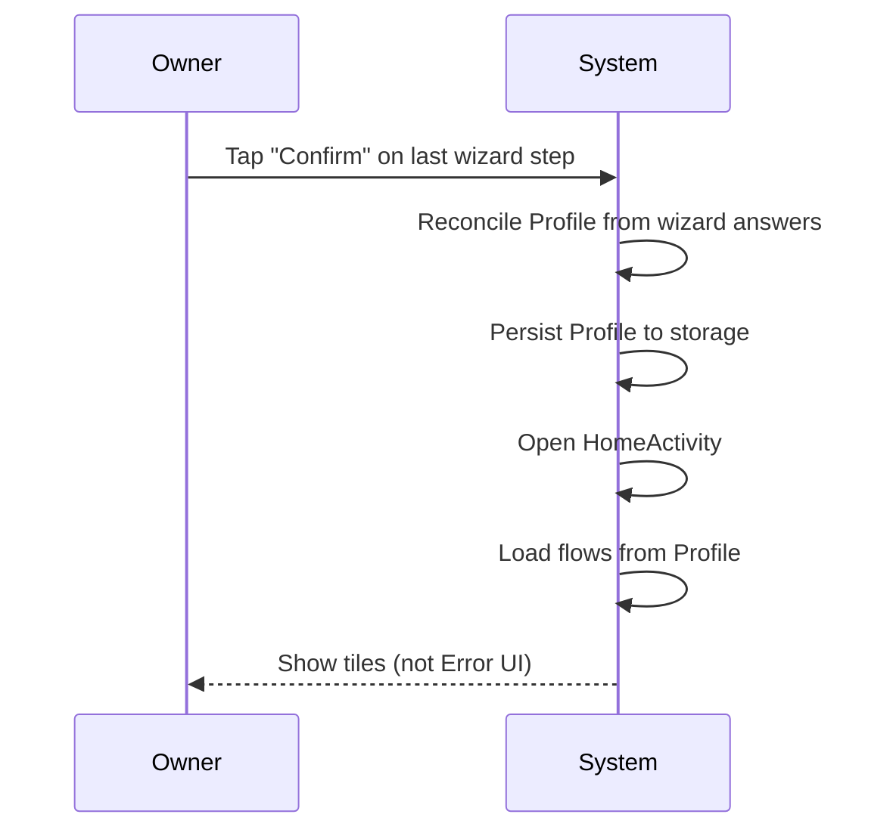
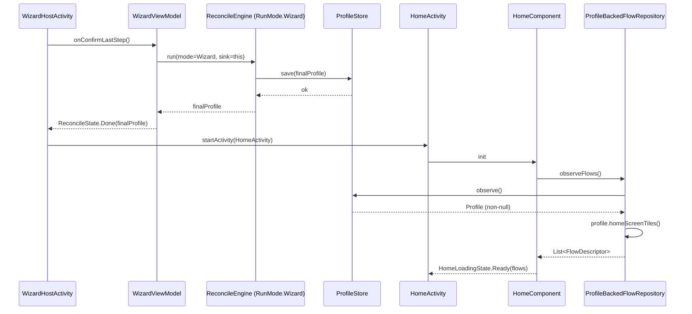
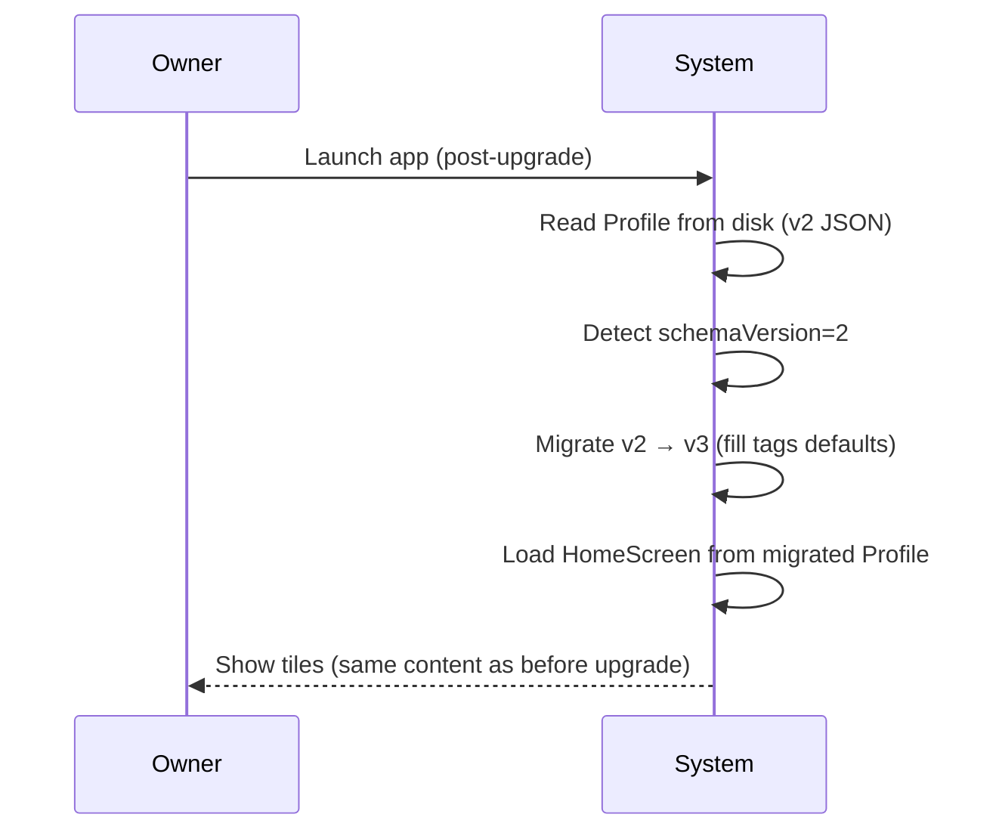
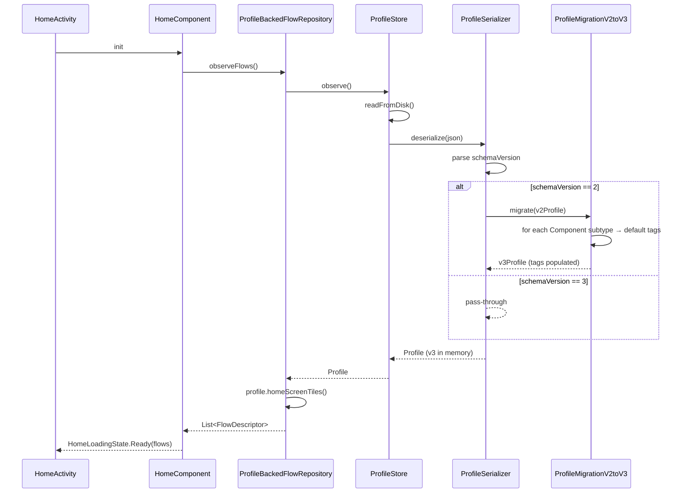
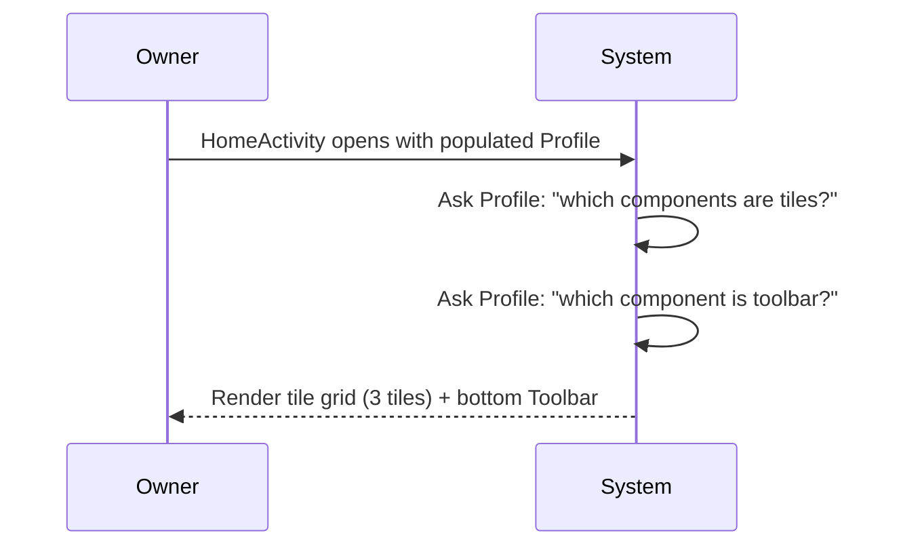
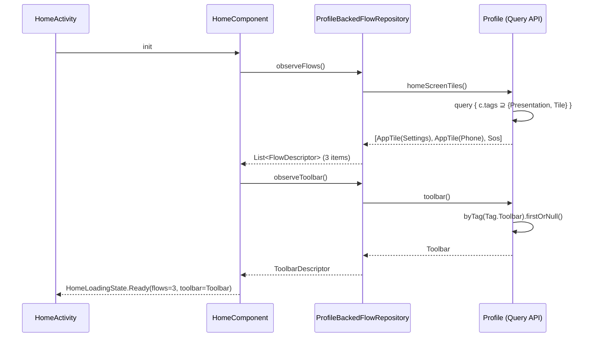
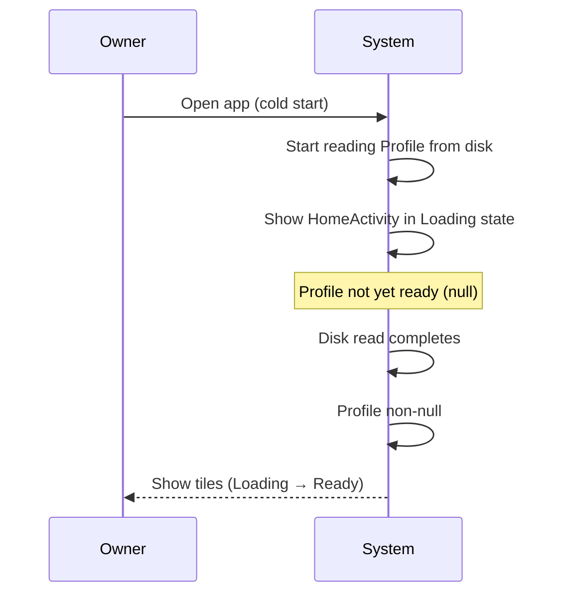
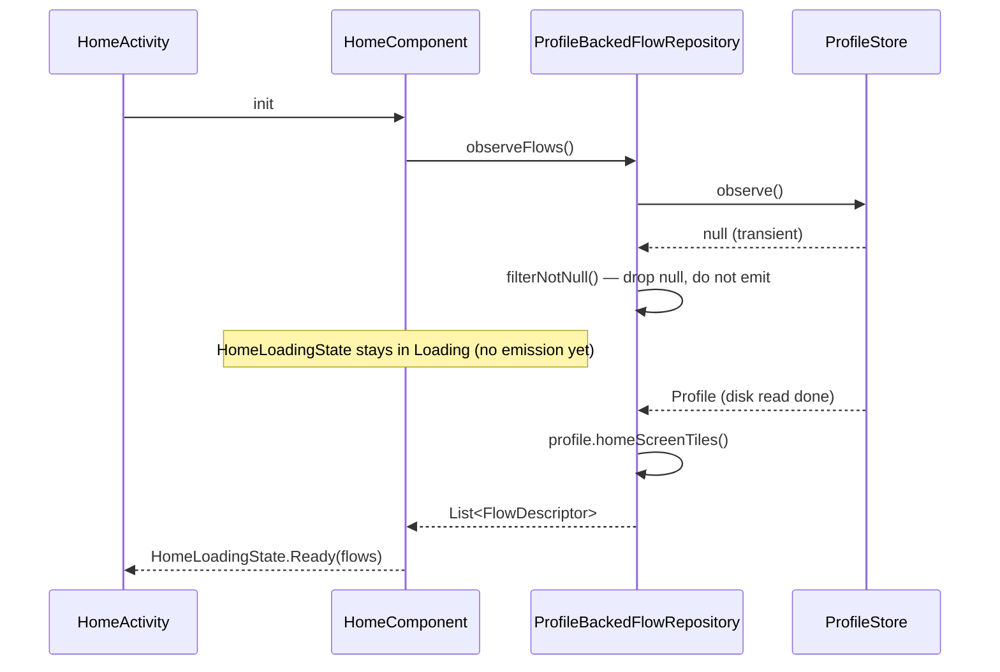

# Feature Specification: ECS Tags Foundation + HomeScreen Query Rewire

**Feature Branch**: `task-127-launcher-presentation-builder`
**Created**: 2026-07-14
**Updated**: 2026-07-15 — scope rewritten after mentor session
**Status**: Draft
**Backlog task**: [task-127](../../backlog/tasks/task-127%20-%20HomeActivity-config-load-failure-post-wizard-TASK-126-regression.md)
**Input**: TASK-127 Decision block (2026-07-15) — ECS Tags + Query pattern extending TASK-120.

---

## Clarifications

### 2026-07-15 — Pre-plan clarification pass

| # | Question | Resolution |
|---|----------|------------|
| 1 | `ProfileBackedFlowRepository.observeFlows()` при null Profile — что эмитит? | `filterNotNull` — stay in `Loading` пока Profile не появится. Fresh install покрывается wizard'ом (HomeScreen не показывается пока wizard идёт). HomeScreen null видит только в transient migration states. |
| 2 | Pool schemaVersion bump v2→v3 нужен? | Нет. `pool.json` — build-time артефакт (bundled в APK, immutable до next build). `Component.tags` добавляется как optional override поле в `ComponentDeclaration` — v2 fixtures десериализуются корректно (default tags из Component subtype). Только Profile v2→v3 требует migration writer. |
| 3 | `homeScreenTiles()` selector — как отличить плитку от Toolbar (оба Presentation)? | Ввести отдельный `Tag.Tile`. Начальный набор Tag enum — 10 значений: Presentation, Appearance, System, Safety, Capabilities, Communication, Accessibility, Emergency, **Tile**, **Toolbar**. `homeScreenTiles() = byAllTags(setOf(Tag.Presentation, Tag.Tile))`. Toolbar имеет `setOf(Tag.Presentation, Tag.Toolbar)` — в `homeScreenTiles()` не попадает, находится через `byTag(Tag.Toolbar).firstOrNull()`. |
| 4 | Toolbar в MVP: конфликт `Tag.Presentation` vs homeScreenTiles filter | Закрывается Q3 через отдельные `Tag.Tile` + `Tag.Toolbar`. `Profile.toolbar()` реализован через `byTag(Tag.Toolbar).firstOrNull()` — чистая query-based выборка без `is Toolbar` type check (deep-audit 2026-07-16 flagged paradigm mix, устранён). |
| 5 | Existing `ConfigBackedFlowRepository` тесты — что с ними? | Остаются зелёными (класс не удаляется, coverage сохраняется). `HomeComponentLoadingStateTest` расширяется НОВЫМ сценарием `postManifestWizardReconcile_profileSeeded_homeReady` для Profile-based path. Существующий config-based сценарий остаётся. |

---

## Context

- TASK-52 закрыл класс багов «HomeActivity Error state» через детерминированную `HomeLoadingState` machine.
- TASK-126 (wizard runtime migration) сломал путь wizard → HomeActivity: после прохождения wizard'а `HomeActivity` показывает Error UI вместо плиток.
- Root cause: между TASK-120 фундаментом (`Profile` / `Provider` / `ReconcileEngine`) и HomeScreen-стеком (`ConfigDocument` / `ConfigBackedFlowRepository`) образовался архитектурный gap — wizard пишет `Profile`, HomeScreen читает `ConfigDocument`, между ними нет моста.
- Mentor-сессия 2026-07-15: изначальный план «построить bridge через `LauncherPresentationBuilder` (Profile → ConfigDocument)» отброшен как построение моста на плохую архитектуру. Новое направление — **расширить TASK-120 через tagged-component-model (ECS-inspired, не canonical ECS)**: добавить `Component.tags: Set<Tag>` + `Profile.query { predicate }`, переключить HomeScreen на чтение `Profile` напрямую через query API. См. [ADR-012](../../docs/adr/ADR-012-tagged-component-model-vs-canonical-ecs.md) — где мы намеренно отклоняемся от canonical ECS (Bevy / Flecs / Unity DOTS) и почему.
- Preset lifecycle-категоризация (`wizardFlow` / `settingsMap` / `activeComponents`) сохраняется — ортогональна Tag semantic-категоризации. Обе дименсии сосуществуют.

---

## User Scenarios & Testing *(mandatory)*

### User Story 1 — Первый запуск до рабочего домашнего экрана (Priority: P0)

Пользователь устанавливает приложение на чистое устройство, проходит wizard до конца и видит рабочий HomeScreen с плитками — не Error UI.

**Why this priority**: end-to-end путь «install → wizard → home» сейчас сломан на физическом Xiaomi Redmi Note 11. Без этого никакое ручное тестирование MVP невозможно; блокирует TASK-128 verification bucket #1/#2.

**Independent Test**: Robolectric integration test — Profile с одним `Component.AppTile(tags = setOf(Tag.Presentation))` в `ProfileStore` → `ProfileBackedFlowRepository` возвращает `List<FlowDescriptor>` длины 1 → `HomeComponent.loadingState` эмитит `HomeLoadingState.Ready`.

**Acceptance Scenarios**:

1. **Given** свежая установка, blank profile, local mode, **When** пользователь проходит manifest-driven wizard (`WizardHostActivity`) до конца и попадает на `HomeActivity`, **Then** `HomeComponent` переходит через `Loading → Ready` (не `Error`), пользователь видит плитки.
2. **Given** пресет содержит default'ы для пустого профиля (например AppTile с `packageName="com.android.settings"`), **When** wizard завершается без явного выбора tiles пользователем, **Then** `ProfileBackedFlowRepository` возвращает non-empty `FlowDescriptor` список, `HomeLoadingState.Ready` с default-плитками.
3. **Given** пользователь редактирует Profile через Settings (добавляет/убирает AppTile), **When** `ProfileStore.observe()` эмитит новый Profile, **Then** `ProfileBackedFlowRepository.observeFlows()` эмитит обновлённый список без перезапуска Activity.

---

### User Story 2 — Разработчик добавляет новый Component с тэгами (Priority: P1, foundational)

Разработчик добавляет новый `TimeLockdown` Component в sealed hierarchy, объявляет `tags = setOf(Tag.System, Tag.Safety)` в конструкторе, никаких других изменений в engine / registry / repository не требуется. Существующие query'и по этим тэгам находят его автоматически.

**Why this priority**: это тест на «foundational» природу решения — если добавление нового Component требует правок в 5 местах, значит ECS-паттерн не работает и мы вернулись к ad-hoc getters. Также разблокирует Phase-2 фичи (safety indicators, hint overlays, toolbar buttons).

**Independent Test**: unit test — добавить fake Component `TestComponent(tags = setOf(Tag.System, Tag.Safety))` в Profile, вызвать `profile.byTag(Tag.System)` → результат содержит fake. Вызвать `profile.byTag(Tag.Presentation)` → не содержит.

**Acceptance Scenarios**:

1. **Given** новый `Component` subtype объявлен с непустым `tags` в default конструкторе, **When** он добавлен в Profile, **Then** `profile.byTag(<any-of-his-tags>)` его находит без каких-либо изменений в `Profile` / `ReconcileEngine` / `FlowRepository`.
2. **Given** existing Component `Sos` имеет `tags = setOf(Tag.Presentation, Tag.Safety, Tag.Emergency)`, **When** вызывается `profile.byTag(Tag.Emergency)`, **Then** `Sos` присутствует в результате (multi-tag membership работает).

---

### User Story 3 — Читаемый wizard (локализованные строки) (Priority: P1)

Пользователь видит читаемые заголовки шагов wizard'а, а не технические ключи вроде `wizard_confirm`.

**Why this priority**: нелокализованный wizard технически не блокирует загрузку Home, но делает ручное smoke-тестирование болезненным и создаёт ложное впечатление недоделанности продукта.

**Independent Test**: manual check — запустить wizard на эмуляторе/устройстве, grep UI строк на pattern `^wizard_[a-z_]+$`, не должно быть матчей.

**Acceptance Scenarios**:

1. **Given** `strings_wizard.xml` содержит ключи `wizard_step_of`, `wizard_component_font_size`, `wizard_component_sos`, `wizard_confirm` (+ все прочие выявленные grep'ом по TASK-126 wizard code), **When** wizard runtime рендерит шаги, **Then** UI показывает локализованный русский текст, не raw ключи.
2. **Given** compose resource компилируется, **When** проходит build, **Then** нет R.string missing warnings.

---

### Edge Cases

- **Profile с 0 tiles-компонентов**: если пресет наполнил defaults (например Settings tile) — flows список non-empty, HomeLoadingState.Ready с default-плитками. Если пресет пустой и defaults не сработали — Ready с пустым экраном (валидное состояние), не Error.
- **Migration v2 Profile → v3 без tags поля**: writer читает v2 fixture, заполняет defaults на основе Component subtype (hardcoded mapping в migration writer, отдельный от pool declaration override).
- Component с `tags = emptySet()` — не находится ни одним селектором (валидно как deprecated marker; правило: MVP всегда указывает default tags не пустые). Fitness function: unit test проверяет что каждый Component subtype имеет non-empty default tags.
- Toolbar с `Tag.Presentation` (без `Tag.Tile`) — не попадает в `homeScreenTiles()`, но попадает в общий `byTag(Tag.Presentation)`. Рендерится через отдельный `Profile.toolbar()` selector.
- **Multiple tags на один Component**: `Sos` имеет `tags = setOf(Tag.Presentation, Tag.Tile, Tag.Safety, Tag.Emergency)` — все четыре query find'ят один и тот же instance.
- **`ConfigBackedFlowRepository` всё ещё в кодовой базе**: класс существует, но не bind'ится к `FlowRepository` в DI. Не должно быть DI conflicts или двойного binding'а.
- **`ProfileStore.observe()` эмитит null (Profile ещё не готов)**: `ProfileBackedFlowRepository.observeFlows()` эмитит empty list или ждёт non-null Profile — контракт уточняется в plan phase; edge case не должен вызвать crash или Error state.

---

## Sequences

Sequence diagrams elaborate critical flows from User Stories. Each sequence has:
- Pre/Post conditions and reuse pointer.
- Spec-level diagram (behaviour, owner-readable).
- Plan-level diagram (architecture, plan.md cites these lifelines).
- MENTOR-DETAIL block (plain-Russian explanation for non-developer owner).

Per [CLAUDE.md «Sequences in spec.md»](../../CLAUDE.md) section and [ADR-011](../../docs/adr/ADR-011-ai-owner-collaboration-conventions.md).

**Skip note**: US-3 (Wizard localization) — no runtime sequence written. Localization is compile-time XML resource resolution with a single actor (Compose renderer reading `strings_wizard.xml`); no interesting interaction to diagram. Verified via manual grep + build check per US-3 Independent Test.

**US-2 note** (developer adds Component with tags) — dev-time authoring flow, not runtime. Query behaviour (which the new Component participates in) is covered by SEQ-3.

---

### SEQ-1: Wizard finish → HomeScreen Ready

Pre: fresh install completed, `WizardHostActivity` running, blank `ProfileStore`, local mode. Owner tapped through all wizard steps.
Post: `HomeActivity` visible, `HomeLoadingState.Ready`, tile list rendered.
Used-in: spec/task-127-ecs-tags-and-query.

#### Spec-level (behavior)



#### Plan-level (architecture)



<!-- MENTOR-DETAIL:BEGIN -->
#### Пояснение для владельца

- **WizardHostActivity** — экран мастера настройки. Показывает шаги («Размер шрифта», «Кнопка SOS» и т.д.).
- **WizardViewModel** — держит состояние мастера между поворотами экрана. При нажатии «Готово» на последнем шаге зовёт «движок примирения» (`ReconcileEngine`), который собирает финальный `Profile` из ответов пользователя.
- **ProfileStore** — локальное хранилище настроек на устройстве. `Profile` сохраняется туда единственный раз, сразу становится источником правды.
- **HomeActivity** — главный экран лаунчера. Открывается после `WizardHostActivity`. `HomeComponent` (стейт-машина TASK-52: `Loading → Ready / Error`) подписывается на `ProfileStore.observe()` через новый адаптер `ProfileBackedFlowRepository`.
- **Ключевой момент фикса**: раньше `HomeComponent` читал `ConfigDocument` (старая модель), которую мастер не заполнял → HomeScreen шёл в `Error`. Теперь `HomeComponent` читает `Profile` напрямую через `ProfileBackedFlowRepository` — тот же объект, который мастер сохранил → HomeScreen идёт в `Ready`. Мост Profile↔ConfigDocument не строится, `ConfigDocument` из HomeScreen-пути удаляется.
- Покрывает US-1, Acceptance Scenario 1-2.
<!-- MENTOR-DETAIL:END -->

---

### SEQ-2: Profile v2 → v3 migration on cold start

Pre: user upgrades APK; `ProfileStore` on disk contains `Profile` serialized as `schemaVersion=2` (no `tags` field on Components). App just launched.
Post: `Profile` in memory has `schemaVersion=3` with `tags` populated from Component-subtype defaults. Disk write of migrated Profile happens on next `ProfileStore.save()` (lazy).
Used-in: spec/task-127-ecs-tags-and-query.

#### Spec-level (behavior)



#### Plan-level (architecture)



<!-- MENTOR-DETAIL:BEGIN -->
#### Пояснение для владельца

- **Что мигрирует** — только `Profile` в `ProfileStore` (личные настройки пользователя на диске). Каталог компонентов `pool.json` НЕ мигрируется — он лежит внутри APK и обновляется вместе с обновлением приложения.
- **Migration writer** — маленький модуль `ProfileMigrationV2toV3`, знает по субтипу компонента какие теги проставить (`AppTile → {Presentation, Tile}`, `Sos → {Presentation, Tile, Safety, Emergency}` и т.д.). Это hardcoded map, не читается ниоткуда.
- **Идемпотентность (FR-004 / NFR-004)**: если вдруг запустить миграцию на уже-v3-профиле — она ничего не изменит. Проверяется roundtrip тестом.
- **Ленивая запись**: мигрированный Profile сначала живёт в памяти. На диск v3 запишется при следующем `ProfileStore.save()` (например, когда пользователь что-то поменяет в Settings). Это чтобы не делать disk-write на каждом cold start.
- **One-way door (rule 5)**: bump v2 → v3 — необратимый шаг. После него старая версия приложения не сможет прочитать v3-профиль. Exit ramp — версионирование строгое, downgrade не поддерживается (стандартная практика для Android приложений).
- **Что видит владелец**: ничего. Плитки на месте после обновления, экран как был. Миграция — под капотом.
- Покрывает FR-004, NFR-004, Edge Case «Migration v2 → v3».
<!-- MENTOR-DETAIL:END -->

---

### SEQ-3: Query resolution — homeScreenTiles vs toolbar

Pre: `Profile` loaded, contains four Components: `AppTile(Settings)`, `AppTile(Phone)`, `Sos`, `Toolbar`. Each with default tags per FR-002.
Post: HomeScreen renders 3 tiles (Settings, Phone, Sos) in tile grid; Toolbar renders in bottom panel — no overlap.
Used-in: spec/task-127-ecs-tags-and-query.

#### Spec-level (behavior)



#### Plan-level (architecture)



<!-- MENTOR-DETAIL:BEGIN -->
#### Пояснение для владельца

- **Ключевая идея тегов**: один компонент может иметь несколько тегов сразу. Кнопка SOS — это одновременно `Presentation` (её видно), `Tile` (это плитка на экране), `Safety` (относится к безопасности) и `Emergency` (экстренная ситуация). Мы не заставляем выбрать одну категорию — компонент участвует во всех запросах, к которым подходит.
- **`homeScreenTiles()`** = «дай все компоненты у которых теги содержат И `Presentation` И `Tile` одновременно». `AppTile` и `Sos` подходят. `Toolbar` — нет (у неё только `Presentation`, без `Tile`), поэтому она не попадает в сетку плиток.
- **`toolbar()`** = отдельный селектор для нижней панели. Ищет компонент с тегом `Toolbar` через `byTag(Tag.Toolbar).firstOrNull()`. Возвращает один объект (или `null`, если не задан). **Query-based, не `is Toolbar` type check** — оба разделения (плитка vs тулбар) через теги, консистентно.
- **Почему такое разделение** — по clarification Q3/Q4: без отдельного тега `Tile` любой `Presentation`-компонент попадал бы в сетку плиток, включая Toolbar. Тег `Tile` — граница «это плитка», тег `Toolbar` — маркер «это нижняя панель».
- **Terminology note (ADR-012)**: это **tagged-component-model, ECS-inspired**, не canonical ECS (Bevy / Flecs / Unity DOTS). У нас sealed hierarchy = discriminated union (один Component на entity), не multi-component composition. Для нашего масштаба (~20 компонентов, редкие правки) это ок. Если появится «любая плитка может получить Cooldown-маркер» — придётся рефакторить (месяцы). См. ADR-012 § latent one-way door.
- Покрывает US-2 Acceptance Scenario 2 (multi-tag membership), FR-005, Clarifications Q3-Q4.
<!-- MENTOR-DETAIL:END -->

---

### SEQ-4: Null Profile edge case — Loading contract

Pre: `HomeActivity` starting; `ProfileStore.observe()` первым эмитит `null` (cold start до первого disk read completes; или transient migration state). Owner в этот момент видит splash / loading indicator.
Post: HomeComponent **не** переходит в Error state. Остаётся в Loading. При первом non-null Profile — переходит в Ready.
Used-in: spec/task-127-ecs-tags-and-query.

#### Spec-level (behavior)



#### Plan-level (architecture)



<!-- MENTOR-DETAIL:BEGIN -->
#### Пояснение для владельца

- **Проблема, которую закрываем**: раньше при холодном старте, если Profile ещё не прочитан с диска, старый `ConfigBackedFlowRepository` мог случайно эмитить пустое состояние — и HomeComponent переключался в `Error UI`. Это было проявление регрессии TASK-52.
- **Решение**: новый `ProfileBackedFlowRepository` использует `filterNotNull()` — оператор из Kotlin Flow, который просто «пропускает» `null`-эмиссии дальше. Пока Profile не появился — HomeComponent ничего не эмитит и остаётся в `Loading` (это стейт по умолчанию).
- **Как только Profile появился** (диск дочитан, миграция закончилась) — эмитим `Ready` со списком плиток. Никакого `Error` в промежутке.
- **Контракт TASK-52** (`HomeLoadingState` state machine: `Loading → Ready / Error`) сохраняется. `Error` теперь — только для настоящих сбоев (например, битый Profile который не удалось десериализовать). Пустое / отсутствующее Profile — это `Loading`, не `Error`.
- **Что видит владелец**: на очень старых устройствах может проскочить splash / loading indicator в 100-200мс между запуском приложения и появлением плиток. На современных Xiaomi — почти незаметно.
- Покрывает FR-006, Edge Case «`ProfileStore.observe()` эмитит null».
<!-- MENTOR-DETAIL:END -->

---

## Requirements *(mandatory)*

### Functional Requirements

- **FR-001**: `Tag` enum объявлен в `core/preset/model/Enums.kt`. Начальный набор: `Presentation, Appearance, System, Safety, Capabilities, Communication, Accessibility, Emergency, Tile, Toolbar`. Additive-only per rule 5.

- **FR-002**: `Component.tags: Set<Tag>` — новое поле в sealed hierarchy. Multiple tags разрешены. Каждый existing subtype получает default value в конструкторе:
  - `AppTile` → `setOf(Tag.Presentation, Tag.Tile)`
  - `FontSize` → `setOf(Tag.Appearance, Tag.Accessibility)`
  - `Sos` → `setOf(Tag.Presentation, Tag.Tile, Tag.Safety, Tag.Emergency)`
  - `Toolbar` → `setOf(Tag.Presentation, Tag.Toolbar)` (без Tag.Tile — рендерится как отдельная панель, не плитка; `Tag.Toolbar` даёт query-based access)
  - `LauncherRole` → `setOf(Tag.System)`
  - `Theme` → `setOf(Tag.Appearance)`

- **FR-003**: `ComponentDeclaration` в `pool.json` MUST поддерживать optional поле `"tags": [...]` для override дефолтов при декларации. Pool schemaVersion bump v2 → v3 (если pool schema уже отдельная) или наследуется от общего Profile bump.

- **FR-004**: `Profile` wire-format schemaVersion MUST bump v2 → v3. Migration writer v2 → v3 читает старые Profile без `tags` поля и заполняет defaults на основе Component subtype (hardcoded mapping в migration writer). Migration writer MUST быть идемпотентен (повторное применение к v3 не меняет данные).

- **FR-005**: `Profile.query(predicate: (ProfileComponent) -> Boolean): List<ProfileComponent>` — базовый Query API. Convenience selectors:
  - `Profile.byTag(tag: Tag): List<ProfileComponent>`
  - `Profile.byAllTags(tags: Set<Tag>): List<ProfileComponent>` — все указанные теги должны присутствовать
  - `Profile.byAnyTag(tags: Set<Tag>): List<ProfileComponent>` — хотя бы один
  - `Profile.byNotTag(tag: Tag): List<ProfileComponent>` — все компоненты БЕЗ этого тега (canonical ECS `Without<T>` / Flecs `!` / EnTT `exclude<>` эквивалент)
  - `Profile.homeScreenTiles(): List<ProfileComponent>` = `byAllTags(setOf(Tag.Presentation, Tag.Tile))` — плитки, но не Toolbar
  - `Profile.toolbar(): ProfileComponent?` = `byTag(Tag.Toolbar).firstOrNull()` — query-based выборка без `is Toolbar` type check

- **FR-006**: `ProfileBackedFlowRepository : FlowRepository` — новая реализация в `core/adapters/`. Читает `ProfileStore`, применяет query, возвращает `List<FlowDescriptor>`. Observe-версия через `profileStore.observe().filterNotNull()` — при `null` Profile НЕ эмитит (HomeComponent остаётся в `Loading`, соответствует контракту TASK-52 HomeLoadingState). После первого non-null Profile — эмитит на каждом изменении.

- **FR-007**: DI MUST wire `ProfileBackedFlowRepository` как binding для `FlowRepository` в обоих flavor'ах (mockBackend, realBackend):
  ```kotlin
  single<FlowRepository> { ProfileBackedFlowRepository(profileStore = get()) }
  ```
  Заменяет прошлое binding на `ConfigBackedFlowRepository`. `ConfigBackedFlowRepository` MUST оставаться в коде (не удалять), просто не bind'иться к `FlowRepository`. Помечен inline TODO `// TODO(config-deprecation): SRV-CONFIG-DEPRECATION` на класс.

- **FR-008**: `core/composeResources/values/strings_wizard.xml` MUST содержать все wizard string keys, используемые TASK-126 manifest-driven wizard. Минимальный известный набор:
  - `wizard_step_of` — объявляется как `<plurals>` ресурс с формами `one`, `few`, `many`, `other` (Russian pluralization, Android convention).
  - `wizard_component_font_size`, `wizard_component_sos`, `wizard_confirm` — обычные `<string>` (без склонений).
  Полный список выявляется grep'ом по TASK-126 wizard code перед implementation. Значения — читаемые русские строки.

- **FR-009**: `docs/architecture/preset-model.md` MUST быть создан с `<!-- AI-TLDR:BEGIN ... AI-TLDR:END -->` блоком (~60-80 строк). Документирует две ортогональные дименсии:
  - **Lifecycle dimension** (Preset three-field structure: `wizardFlow` / `settingsMap` / `activeComponents`) — как presets применяются во времени.
  - **Semantic dimension** (`Component.tags`) — по каким категориям Components группируются для UI-запросов.
  Doc-комментарии в `Preset.kt` и `Component.kt` MUST ссылаться на этот файл.

- **FR-010** (server-roadmap): `docs/dev/server-roadmap.md` MUST содержать новую запись **SRV-CONFIG-DEPRECATION** — план удаления `ConfigDocument` из HomeScreen path в будущей задаче (сейчас dead-code-like для HomeScreen path, остаётся для admin push scenarios). Inline TODO `// TODO(config-deprecation): SRV-CONFIG-DEPRECATION` MUST быть добавлен в местах где `ConfigDocument` ещё используется (ConfigEditor callers).

### Non-Functional Requirements

- **NFR-001**: Все новые типы (`Tag` enum, `Query API` методы на `Profile`) MUST быть pure Kotlin, zero Android imports. Проверяется существующим `checklist-domain-isolation`.
- **NFR-002**: `ProfileBackedFlowRepository.observeFlows()` MUST эмитить новое значение при любом изменении Profile через `ProfileStore.observe()`. Проверяется unit-тестом (`FakeProfileStore` эмитит два Profile последовательно → repository эмитит два `FlowDescriptor` списка).
- **NFR-003**: Query API performance на MVP scale (~20 Components в Profile) — под 1мс на query. Linear scan приемлем; indexing — будущая оптимизация под exit ramp.
- **NFR-004**: Migration writer v2 → v3 идемпотентен и покрыт roundtrip тестом (v2 fixture читается, tags заполнены defaults; повторное чтение результата не меняет данные).

---

## Key Entities

- **`Tag`**: enum, semantic-domain marker для Components. Closed set, additive-only per wire-format rules. Ортогонален lifecycle-категоризации Preset'а.
- **`Component.tags: Set<Tag>`**: новое поле на sealed hierarchy Component. Default per subtype; overridable в `ComponentDeclaration` (`pool.json`). Multiple tags на один Component разрешены.
- **Query API**: predicate-based selector (`Profile.query`) + convenience selectors (`byTag`, `byAllTags`, `byAnyTag`, `homeScreenTiles`). Живёт на `Profile` как extension или методы.
- **`ProfileBackedFlowRepository`**: новый adapter, реализация существующего `FlowRepository` порта. Читает `Profile` через `ProfileStore`, проецирует query result в `FlowDescriptor` список. Заменяет `ConfigBackedFlowRepository` в DI wiring HomeScreen path.
- **`ConfigBackedFlowRepository`**: existing implementation, остаётся в коде для будущего admin push scenario, но не bind'ится к `FlowRepository` в HomeScreen DI wiring. Помечен `// TODO(config-deprecation): SRV-CONFIG-DEPRECATION`.

---

## Out of Scope

- Удаление `ConfigDocument` полностью из кодовой базы — отдельный будущий task per SRV-CONFIG-DEPRECATION запись в `docs/dev/server-roadmap.md`.
- Переработка admin push пути (Profile-based вместо ConfigDocument-based) — отдельный будущий task после SRV-CONFIG-DEPRECATION.
- Расщепление Toolbar Composite Component на отдельные button entities — отдельный будущий task (MVP: Toolbar остаётся Composite с `tags = setOf(Tag.Presentation)`).
- Query indexing / performance optimization — MVP scale (~20 Components) не требует; exit ramp в Decision block'е задачи.
- Регистрация новых Tag values (кроме initial set) — additive change, не в scope этого spec.
- **Corrupt Profile recovery** — детектирование битого / несериализуемого Profile в `ProfileStore` (например, migration writer упал, disk corruption). MVP: exception в migration writer покрыт roundtrip тестом; явный recovery flow (reset ProfileStore + rerun FirstLaunchActivity) — отдельный будущий task если понадобится по production feedback.

---

## Success Criteria *(mandatory)*

- **SC-001 [backlog]**: Fresh install + wizard на Xiaomi Redmi Note 11 (adb id `17f33878`) → HomeActivity показывает плитки, не Error UI. Требуется физическая верификация.
- **SC-002 [backlog]**: Wizard runtime строки локализованы через `core/composeResources/values/strings_wizard.xml` (нет raw `wizard_*` ключей в UI). Проверяется на эмуляторе или физическом устройстве.
- **SC-003 [backlog]**: `Component.tags: Set<Tag>` добавлен + migration writer v2 → v3 реализован. Roundtrip тест (v2 fixture → read → assert tags populated by defaults) зелёный.
- **SC-004 [backlog]**: `Profile.query` + convenience selectors (`byTag`, `byAllTags`, `byAnyTag`, `homeScreenTiles`) объявлены. Unit-тесты: query по одному тегу, по комбинации тегов (AND/OR), empty result, tag-not-present.
- **SC-005 [backlog]**: `ProfileBackedFlowRepository` реализован, DI wire в mockBackend + realBackend flavor. `HomeComponentLoadingStateTest` расширен НОВЫМ сценарием `postManifestWizardReconcile_profileSeeded_homeReady` — verifies Profile с одним AppTile → HomeLoadingState.Ready. Existing config-based сценарии в тесте остаются зелёными (ConfigBackedFlowRepository не удаляется).
- **SC-006 [backlog]**: `docs/architecture/preset-model.md` создан с AI-TLDR блоком. `Preset.kt` + `Component.kt` содержат doc-комментарии с ссылкой на этот файл. `docs/dev/server-roadmap.md` содержит SRV-CONFIG-DEPRECATION запись.
- **SC-007**: Fitness function — `checklist-domain-isolation` зелёный на новых типах (`Tag`, Query API, `ProfileBackedFlowRepository` при условии что adapter не тянет Android). Проверяется автоматически.
- **SC-008**: Query performance на MVP scale (~20 Components) — под 1мс на query. Замерено micro-benchmark (JVM, без Android runtime).

---

## Assumptions

- `ProfileStore.observe()` возвращает `Flow<Profile?>`. `null` наблюдается при cold start до первого load и transient migration states. `ProfileBackedFlowRepository` filter'ит null → HomeComponent остаётся в Loading (см. FR-006).
- Pool.json НЕ мигрируется. Bundled в APK, всегда shipped вместе с current app version. Только persisted Profile в ProfileStore требует migration writer v2→v3.
- Tag enum initial set: 10 значений (Presentation, Appearance, System, Safety, Capabilities, Communication, Accessibility, Emergency, Tile, Toolbar). Additive-only per rule 5.
- `ReconcileEngine.run(RunMode.Wizard)` уже сохраняет Profile в `ProfileStore` на завершении wizard'а — проверить в коде TASK-126 перед implementation.
- `FakeConfigEditor` не трогается — путь через него больше не используется HomeScreen. Существующие тесты на `ConfigBackedFlowRepository` остаются зелёными (класс не удаляется).
- Toolbar в MVP остаётся Composite Component с `tags = setOf(Tag.Presentation)` — расщепление отложено до отдельной задачи.
- Хардкод mapping «Component subtype → default tags» в migration writer v2 → v3 — не pool-declaration override. Это разные механизмы (migration = one-time для old fixtures; declaration override = ongoing).
- `FlowRepository` port существует в существующем виде и его сигнатура не меняется — новый adapter реализует уже существующий interface.

---

## Local Test Path

- **Unit tests:** `./gradlew :core:test --tests "*ProfileQueryTest*"` — проверяет Query API + Tag defaults + migration writer roundtrip v2→v3.
- **Fitness function:** `./gradlew :core:test --tests "*ComponentTagsFitnessTest*"` — проверяет что каждый Component subtype имеет non-empty default tags.
- **Instrumented tests:** `./gradlew :core:connectedAndroidTest --tests "*HomeComponentLoadingStateTest*"` — включая новый сценарий `postManifestWizardReconcile_profileSeeded_homeReady`.
- **Manual verification (эмулятор):** `./gradlew :app:installMockBackendDebug`; wizard flow до конца → HomeActivity показывает плитки; проверить wizard string localization (нет raw `wizard_*` keys в UI).
- **Physical device verification:** Xiaomi Redmi Note 11 (adb id `17f33878`) — тот же flow. Требуется для закрытия SC-001 и SC-002.

---

## Dependencies

- **TASK-126** (Wizard runtime migration) — источник новых wizard string keys для FR-008; `WizardHostActivity` уже вызывает `ProfileStore` через `ReconcileEngine`, что делает Profile-as-source-of-truth путь работоспособным для HomeScreen.
- **TASK-120** (Preset Composition Foundation) — модель `Component` / `Profile` расширяется этим spec'ом (additive change: новое поле + новые методы, sealed hierarchy не переделывается). TASK-120 Decision block остаётся валидным.
- **TASK-52** (HomeLoadingState machine) — контракт `HomeLoadingState.Ready/Error` сохраняется; regression test расширяется, не переделывается.

---

## TL;DR (по-русски, для новичка и для будущего AI)

**Суть.** Регрессия TASK-126: после wizard'а HomeActivity показывает Error UI вместо плиток. Root cause — архитектурный gap: wizard пишет `Profile` (модель TASK-120), а HomeScreen читает `ConfigDocument` (старая модель). Решение — не bridge, а **tagged-component-model расширение TASK-120 (ECS-inspired, не canonical ECS — см. [ADR-012](../../docs/adr/ADR-012-tagged-component-model-vs-canonical-ecs.md))**: добавить `Component.tags: Set<Tag>` + `Profile.query { predicate }`, переключить HomeScreen на чтение `Profile` напрямую через query API. `ConfigDocument` остаётся в кодовой базе для будущего admin push.

**Конкретика, которую стоит запомнить:**
- `Tag` enum — **10 значений**: `Presentation, Appearance, System, Safety, Capabilities, Communication, Accessibility, Emergency, Tile, Toolbar`. Additive-only.
- `Component.tags` дефолты: `AppTile → {Presentation, Tile}`, `Sos → {Presentation, Tile, Safety, Emergency}`, `Toolbar → {Presentation, Toolbar}`, `FontSize → {Appearance, Accessibility}`.
- `Profile.homeScreenTiles() = byAllTags(setOf(Presentation, Tile))` — Toolbar не попадает; `Profile.toolbar() = byTag(Tag.Toolbar).firstOrNull()` — query-based, без `is Toolbar`.
- Query API: `byTag`, `byAllTags`, `byAnyTag`, `byNotTag` (эквивалент canonical ECS `Without<T>`).
- Wire-format bump `Profile` v2→v3 + migration writer (hardcoded mapping subtype → default tags). Pool.json НЕ мигрируется (bundled).
- `ProfileBackedFlowRepository` — новый adapter, читает `ProfileStore.observe().filterNotNull()` (при null Profile HomeComponent stays in Loading). Заменяет `ConfigBackedFlowRepository` в DI обоих flavor'ов.
- `wizard_step_of` — `<plurals>` ресурс (Russian one/few/many/other), не простой format string.
- Новый `docs/architecture/preset-model.md` с AI-TLDR блоком объясняет две ортогональные дименсии: **lifecycle** (`wizardFlow` / `settingsMap` / `activeComponents`) vs **semantic** (`Component.tags`).

**На что смотреть с осторожностью:**
- Physical device verification (SC-001, SC-002) на Xiaomi Redmi Note 11 (adb id `17f33878`) — AI не может закрыть, только эмулятор доступен.
- schemaVersion v2→v3 — one-way door per rule 5. Migration writer идемпотентен + backward-compat test обязательны.
- `ConfigBackedFlowRepository` остаётся в коде (не удаляется), просто не bind'ится в DI — inline TODO `SRV-CONFIG-DEPRECATION` на класс, иначе future confusion про два FlowRepository.
- Corrupt Profile recovery явно out of scope — если migration writer упадёт в production, будет crash без graceful fallback.
