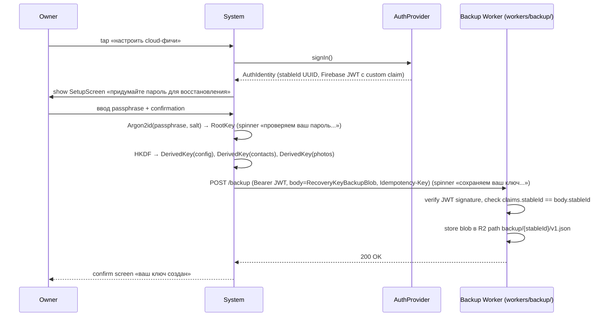
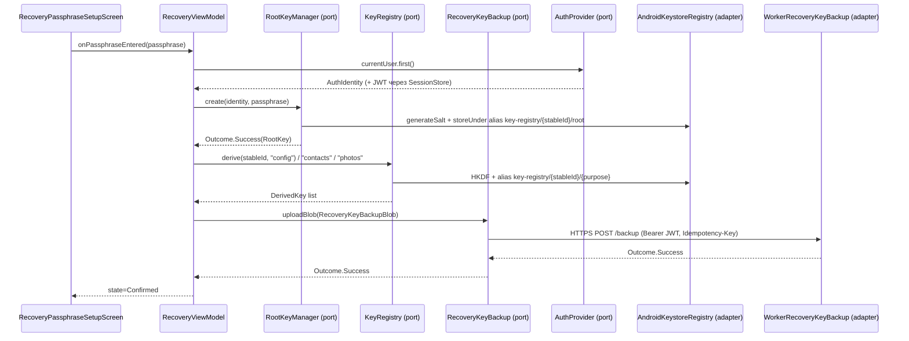
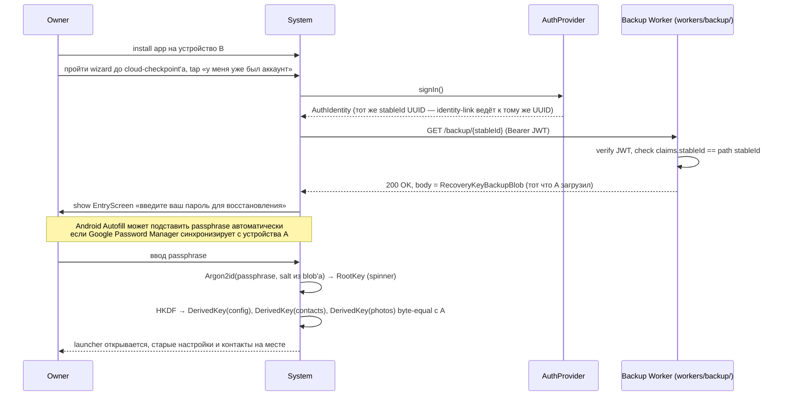
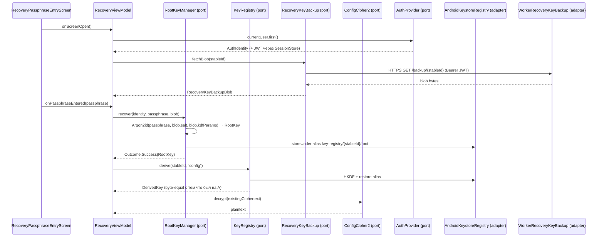
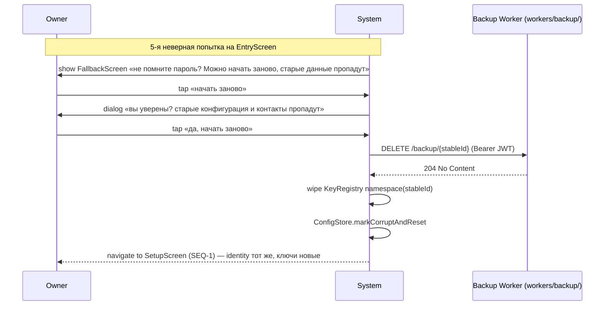
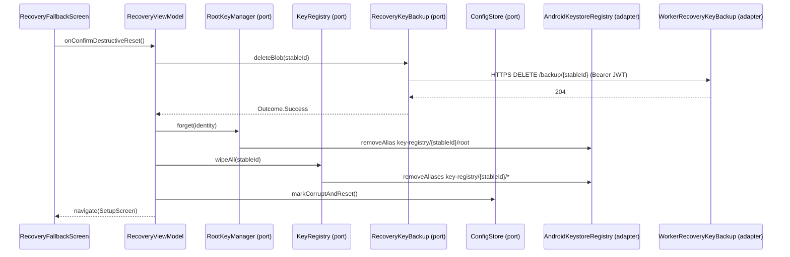
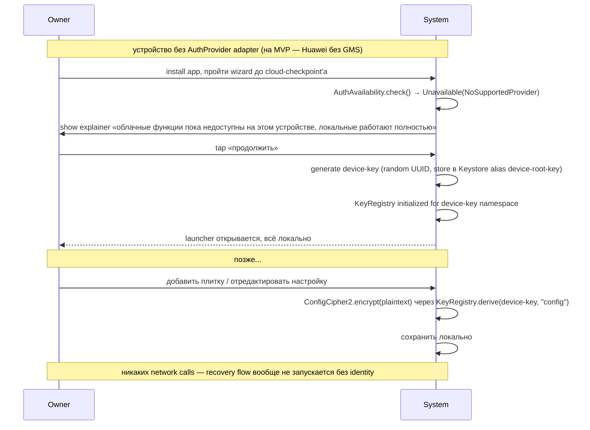
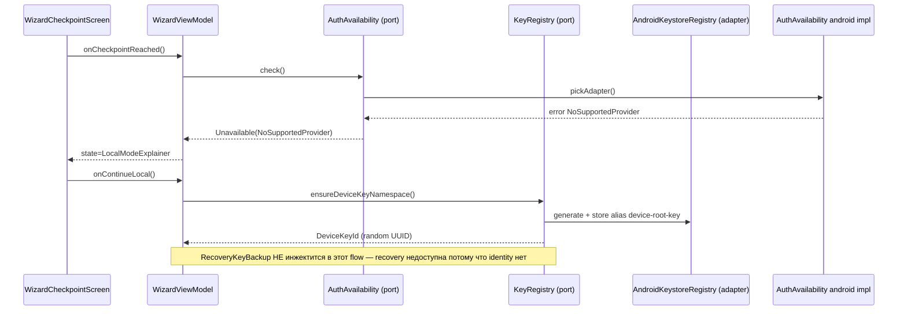

# Feature Specification: F-5 — Root Key Hierarchy + Owner Recovery

**Feature Branch**: `task-6-root-key-hierarchy-recovery`
**Created**: 2026-06-28
**Status**: Draft
**Backlog**: [TASK-6](../../backlog/tasks/task-6%20-%20F-5-Root-Key-Hierarchy-Owner-Recovery.md) (`In Progress`)
**Input**: User description — TASK-6 «Готовый промт для /speckit.specify» + owner pre-clarify «проверь что Google-вход — не единственный возможный провайдер входа» (2026-06-28).

---

## Overview

Иерархия криптографических ключей пользователя: **identity** (из `AuthProvider` port'а, F-4) + **passphrase** (придумывает пользователь) → **root key** (Argon2id KDF) → **производные ключи** (config, contacts, photos, future) через `KeyRegistry` port. Recovery flow: то же identity + тот же passphrase на новом устройстве → root key собирается заново → старые ciphertext'ы читаются. Закрывает Phase 1.

**Центральное архитектурное требование** — **provider-agnostic identity binding**. F-4 (spec 017) уже сделал `AuthProvider` port абстрагированным от Google: `AuthIdentity.stableId` — наш собственный UUID (не Google `sub`, не Firebase UID). F-5 наследует это: `KeyRegistry` namespacing и `RecoveryKeyBackupBlob` wire-format **не содержат** Google / Firebase / OAuth полей. Если завтра приедет `PhoneAuthAdapter` / `EmailPasswordAuthAdapter` / own-server JWT — recovery flow работает без изменений в domain.

**Что строим**:
- `core/keys/` domain: `KeyRegistry`, `RootKeyManager`, `RecoveryKeyBackup` ports + value-objects (`RootKey`, `DerivedKey`, `RecoveryKeyBackupBlob`).
- `app/androidMain/keys/`: `AndroidKeystoreRegistry`, `Argon2RootKeyManager`, `WorkerRecoveryKeyBackup` (HTTPS клиент к нашему Cloudflare Worker'у `workers/backup/`). **НЕТ** дополнительного per-OEM adapter'а — Worker одинаково работает на GMS и non-GMS устройствах.
- `workers/backup/` (новый Cloudflare Worker): endpoints `POST /backup` / `GET /backup/{stableId}` / `DELETE /backup/{stableId}`, Firebase JWT в Bearer (custom claim `stableId`), storage = R2 (strongly consistent). Деплой и реализация — **отдельный artifact в `workers/backup/`**, не часть этой спеки (spec ссылается на endpoint shape; полная Worker-спека — отдельный backlog item, см. `## Notes`).
- `app/androidMain/ui/recovery/`: 3 Compose-экрана (`RecoveryPassphraseSetupScreen`, `RecoveryPassphraseEntryScreen`, `RecoveryFallbackScreen`) с Android Autofill hints.
- Migration: `ConfigCipher2` (spec 018) переходит на `KeyRegistry.derive("config")` без изменения ciphertext (byte-equal preserved).
- Fakes: `FakeKeyRegistry`, `FakeRootKeyManager`, `FakeRecoveryKeyBackup` (in-memory map по `stableId`).

**Архитектурное решение про backup storage** (2026-06-28, owner pushback на черновую версию с Drive App Data): recovery blob хранится в **нашем** Cloudflare Worker'е (`workers/backup/`), **не** в Google Drive App Data. Это даёт:
- Recovery работает **на любом устройстве**, не только GMS (Huawei с будущим Email/Phone AuthProvider'ом — тоже сможет восстанавливаться).
- Server-side rate-limit на `fetchBlob` становится возможен (закрывает open item Q-I из clarify).
- Никакого нового vendor lock-in'а — Cloudflare Worker уже наша infra (`workers/push/` существует).
- Exit ramp на own-server — это просто swap `WorkerRecoveryKeyBackup` → `HttpRecoveryBackupStorage` (см. [server-roadmap.md SRV-RECOVERY-001](../../docs/dev/server-roadmap.md#SRV-RECOVERY-001)).
- Соответствие [constitution.md Article XIV §7](../../.specify/memory/constitution.md#article-xiv) (server-side data minimization, добавлен 2026-06-28): path содержит только наш opaque `stableId` (не Google sub / email), blob — ciphertext + KDF params, никакой PII в access logs.

**Что НЕ строим** (deferred):
- Social recovery («друг помогает вспомнить passphrase») → `TASK-39`, Phase 5.
- Multi-admin envelope (несколько admin'ов с разными passphrase'ами на одном vault'е) → enhancement notes S-2.
- Key rotation / forward secrecy → `TASK-41`, Phase 5. **Это exit ramp для one-way door** (rule 3).
- Pair-key recovery через 2FA escrow → `TASK-21` (P-6), Phase 3.
- Cross-provider migration (пользователь хочет сменить Google → Phone не теряя ключи) → отдельная спека после `TASK-41`.
- own-server replacement для `WorkerRecoveryKeyBackup` (Cloudflare Worker `workers/backup/` → собственный backend на PostgreSQL) → inline TODO + [docs/dev/server-roadmap.md SRV-RECOVERY-001](../../docs/dev/server-roadmap.md).
- **Passphrase change без forget** (rotation flow) → `TASK-41` Phase 5 (Q-H). На MVP в Settings нет «изменить пароль» кнопки.
- **Local-only → cloud upgrade** (пользователь начал на Huawei без GMS, потом купил Pixel и хочет перенести данные) → отдельная спека Phase 5+ если будет request (Q-F). На MVP — пользователь остаётся в том режиме, в котором начал.
- **Persistent server-side rate-limit на `RecoveryKeyBackup.fetchBlob`** — на MVP Worker использует in-memory rate-limit (теряется при перезапуске instance, обходится сменой IP). Persistent counter в БД появится при переезде на own-server (PostgreSQL) per SRV-RECOVERY-001 (d). Это **не блокер для MVP**: основная защита — Argon2id work-factor + per-identity client-side counter (FR-015).

## Sequences

> Структура per [ADR-011](../../docs/adr/ADR-011-ai-owner-collaboration-conventions.md): spec-level (behaviour) + plan-level (architecture) Mermaid диаграммы + MENTOR-DETAIL блок для владельца внизу.
> AI по умолчанию пропускает MENTOR-DETAIL — читает только когда владелец явно просит объяснение, или onboard'ит на спеку впервые.

### SEQ-1: First-time setup

Pre: app свежеустановлен, wizard (F-3) пройден до cloud-checkpoint'а, `AuthAvailability.check() == Available`. Post: `RootKey` создан и в Android Keystore; `KeyRegistry` namespace для `stableId` инициализирован; `RecoveryKeyBackupBlob` загружен в наш Worker (`workers/backup/`).
Used-in: spec/task-6-root-key-hierarchy-recovery.

#### Spec-level (behavior)


#### Plan-level (architecture)


<!-- MENTOR-DETAIL:BEGIN -->
#### Пояснение для владельца

**Что происходит на экране (что видит бабушка / admin / любой `primary user`).** Он только что вошёл в свой аккаунт (Google в MVP, но архитектурно — любой провайдер). На экране появляется заголовок «Придумайте пароль для восстановления» и два поля для ввода (пароль + ещё раз тот же пароль). После tap «продолжить» — несколько секунд spinner с надписью «проверяем ваш пароль» (это работает Argon2id — намеренно медленный, чтобы злоумышленник не мог быстро подобрать пароль брутфорсом). Потом второй spinner «сохраняем ваш ключ» (это идёт upload зашифрованного ключа в **наш** Cloudflare Worker `workers/backup/` — хранится у нас, не у Google'а). Потом экран «готово, ваш ключ создан».

**Что происходит «под капотом» (упрощённо).** Из identity (стабильный UUID — наш, не Google'овский) + passphrase складывается «главный ключ» (root key). От главного ключа автоматически рождаются три «дочерних» ключа — для шифрования настроек, контактов, фото. Все ключи хранятся в Android Keystore (защищённое хранилище ОС, не вытащить наружу даже с root доступом). Параллельно зашифрованная копия главного ключа отправляется в наш Worker — это нужно чтобы потом восстановить на другом устройстве. **Важно**: в logs нашего Worker'а не виден ни Google email пользователя, ни его телефон — только наш opaque UUID (это требование [constitution.md Article XIV §7](../../.specify/memory/constitution.md#article-xiv) server-side data minimization, добавлено 2026-06-28).

**Что важно для проверки.** На экране НИКОГДА не написано «Войти через Google». Текст нейтральный «Войти в свой аккаунт». Это потому что архитектурно провайдер может быть любой. Сейчас в коде есть только Google adapter, но завтра может приехать Phone или Email — UI не поменяется.

**Главный риск (на что обращать внимание при ручной проверке).** Если spinner «сохраняем ваш ключ» крутится больше 15 секунд — что-то не так с сетью или Drive. Должен появиться dialog «backup не удался, продолжить без облачной копии? Если потеряете телефон — данные пропадут». Это намеренно — лучше явно спросить пользователя, чем молча сохранить только локально.
<!-- MENTOR-DETAIL:END -->

---

### SEQ-2: Cross-device recovery (lost phone → new device)

Pre: на устройстве A пройден SEQ-1 (RecoveryKeyBackupBlob лежит в Worker'е). Устройство A потеряно. Устройство B свежее (или factory-reset). `primary user` помнит свой passphrase. Post: `RootKey` восстановлен byte-equal с того что был на A; `KeyRegistry` derives те же `DerivedKey`-и; зашифрованные данные читаются.
Used-in: spec/task-6-root-key-hierarchy-recovery. **Standing extraction candidate** — если cross-device flow появится в другой спеке, вынести в [docs/sequences/SEQ-cross-device-recovery.md](../../docs/sequences/).

#### Spec-level (behavior)


#### Plan-level (architecture)


<!-- MENTOR-DETAIL:BEGIN -->
#### Пояснение для владельца

**Сценарий с точки зрения пользователя.** Бабушка уронила телефон в реку. Пошла, купила новый. Установила приложение. Прошла настройку. На экране «настроить cloud-фичи?» нажала «у меня уже был аккаунт». Вошла под тем же Google-аккаунтом что и раньше. На экране появилось поле «введите ваш пароль для восстановления». Если она пользовалась тем же Google'ом — Android Autofill сам подставит пароль (это очень важно для бабушки — ей не нужно помнить пароль наизусть, Google его помнит за неё). После ввода — несколько секунд spinner — и она оказывается в том же лаунчере с теми же плитками и контактами. Без потерь.

**Что технически произошло.** Identity нашего собственного UUID одинаковый на устройстве A и B — потому что Google-аккаунт у бабушки тот же, а провайдер в нашей системе ведёт от Google'овского `sub` к нашему UUID (это маппинг в Firestore, заложенный в F-4). На устройстве B мы пошли в **наш Worker** (`workers/backup/`), забрали blob по path'у `/backup/{stableId}` (с Firebase JWT в Bearer header'е). Worker проверил подпись JWT, проверил что `claims.stableId` совпадает с path'овым — и вернул blob. Вытащили из blob'а параметры KDF (соль, число итераций). Прогнали passphrase через Argon2id с этими параметрами — получили **тот же самый** root key что был на A (Argon2id детерминированный — один вход даёт один выход). От root key через HKDF родились **те же** дочерние ключи. Старый зашифрованный конфиг расшифровался без проблем.

**Что важно для проверки.** (а) Передача между устройствами не требует никакого QR-кода / общего секрета — passphrase бабушка должна помнить (или Google Password Manager помнит за неё). (б) Если она зашла под **другим** Google-аккаунтом — UUID будет другой → blob не найдётся → переход на «давайте создадим новый ключ» (как первая установка). Это намеренное поведение: identity != identity = новый пользователь. (в) Если бабушка ошиблась в passphrase 5 раз подряд — переход на Fallback screen (см. SEQ-3). Argon2id намеренно медленный, чтобы 5 неверных попыток заняли минимум 15 секунд — никакой brute-force невозможен.

**Главный риск.** Бабушка забыла passphrase И Autofill не сохранил (например, на A она набирала вручную). Тогда — только SEQ-3 (Fallback, потеря старых данных). Это известный trade-off zero-knowledge архитектуры: мы НЕ можем восстановить passphrase, потому что мы его не храним — мы храним только зашифрованный им blob. Если бы мы могли восстановить — это значило бы что и злоумышленник мог бы.
<!-- MENTOR-DETAIL:END -->

---

### SEQ-3: Forgotten passphrase → Fallback wipe

Pre: пользователь на `RecoveryPassphraseEntryScreen`, 5 раз ввёл неверный passphrase подряд. Post: `RecoveryKeyBackupBlob` удалён с Drive; `KeyRegistry` namespace для `stableId` wiped; user возвращается на `RecoveryPassphraseSetupScreen` (SEQ-1) под тем же identity.
Used-in: spec/task-6-root-key-hierarchy-recovery.

#### Spec-level (behavior)


#### Plan-level (architecture)


<!-- MENTOR-DETAIL:BEGIN -->
#### Пояснение для владельца

**Сценарий.** Бабушка совсем забыла пароль. Ввела 5 раз подряд неправильно — приложение показывает экран «не помните пароль? Можно начать заново, но старые настройки и контакты пропадут навсегда». Бабушка нажимает «начать заново». Появляется ещё одно подтверждение «вы уверены? старые данные пропадут» — двойной gate, чтобы не нажать случайно. Бабушка подтверждает. Приложение шлёт DELETE-запрос в наш Worker (удаляет blob по `/backup/{stableId}`), удаляет все локальные ключи, и возвращает её на экран «придумайте пароль для восстановления» (SEQ-1) под тем же Google-аккаунтом.

**Что важно.** (а) Бабушка НЕ выходит из Google-аккаунта — identity сохраняется. (б) Локальный кеш плиток / контактов в открытом виде (если что-то было не зашифровано) остаётся. (в) Зашифрованные данные потеряны навсегда — это **намеренное** поведение. Альтернатива (восстановить без passphrase) разрушила бы всю модель безопасности. (г) После повторного setup'а — все будущие данные будут шифроваться новым ключом, который происходит от нового passphrase'а.

**Главный риск.** Бабушка нажала «начать заново» по ошибке (думая что это «ещё одна попытка»). Двойное подтверждение должно это предотвратить. UI должен использовать destructive button styling (другой цвет, например красноватый contour) чтобы кнопка не выглядела как обычное «продолжить».
<!-- MENTOR-DETAIL:END -->

---

### SEQ-4: Identity-unavailable device (no AuthProvider adapter) — local-mode bypass

Pre: устройство без доступного `AuthProvider` adapter'а — на MVP это Huawei без GMS (единственный shipping adapter — `GoogleSignInAuthAdapter`); в будущем — устройство где все adapter'ы вернули failure. Post: app работает полностью в local mode; `KeyRegistry` использует device-key namespace; recovery недоступна потому что **identity нет**; `RecoveryKeyBackup` вообще не вызывается (flow не доходит до setup screen'а).
Used-in: spec/task-6-root-key-hierarchy-recovery.

#### Spec-level (behavior)


#### Plan-level (architecture)


<!-- MENTOR-DETAIL:BEGIN -->
#### Пояснение для владельца

**Сценарий.** Бабушка купила Huawei после санкций — устройство без Google-сервисов. Установила приложение. Прошла wizard. На экране где обычно «настроить cloud-фичи?» — вместо этого появляется текст «облачные функции пока недоступны на этом устройстве, локальные работают полностью». Нажала «продолжить». Дальше всё как обычно — плитки, контакты, темы — но без облачного backup'а.

**Что технически произошло.** Приложение спросило систему: «есть ли тут какой-нибудь провайдер входа?». Ответ: «нет, Google Play Services отсутствует, других adapter'ов пока не подключено». Приложение **не падает**, не пытается ничего показать про Google. Вместо identity-based ключа сгенерировал случайный device-key (UUID привязанный к этому устройству), положил его в Android Keystore. KeyRegistry работает на device-key — всё локальное шифрование функционирует. **RecoveryKeyBackup вообще не вызывается** — flow без identity не доходит до setup screen'а (раньше был no-op adapter, удалён 2026-06-28 как фальшивое решение).

**Что важно для проверки.** (а) **Нет** dialog «установите Google Services» / «обновите Play Store» / «войдите через Google». Приложение НЕ навязывает облачные функции. (б) **Нет** crash'ей и зависаний — каждый код-путь, который мог бы вызвать Google API, обёрнут в проверку capability. (в) Все локальные данные (плитки, контакты, темы, локализованный конфиг) работают. (г) Бабушка ничего не теряет в функциональности — кроме возможности восстановить данные на втором устройстве (потому что нет identity → нечем подписать запрос в Worker).

**Известный trade-off** (важная коррекция от 2026-06-28). Если бабушка потеряет Huawei — данные потеряны. Это **временное ограничение MVP**, причина — **отсутствие identity** на этом устройстве, **не** отсутствие backup storage. Когда в F-4 v2 приедет `EmailPasswordAuthAdapter` или `PhoneAuthAdapter` — бабушка сможет создать identity на Huawei, и recovery заработает автоматически через **тот же** наш Worker (`workers/backup/`), без изменения F-5 кода. Это и есть exit ramp (rule 3 CLAUDE.md): seam уже на месте, ждём следующий AuthProvider adapter. В [server-roadmap.md SRV-RECOVERY-001](../../docs/dev/server-roadmap.md) зафиксировано: Worker готов принять blob от любого provider'а, ограничение только в наличии identity.
<!-- MENTOR-DETAIL:END -->

---


`primary user` ставит app свежо, проходит wizard (F-3), доходит до cloud-action checkpoint'а (определяется отдельно в [TASK-49](../task-49-cloud-feature-inventory-offline-first/) — но **не** в этой спеке). Если пользователь решил «настроить cloud-фичи» — `AuthProvider.signIn()` возвращает `AuthIdentity` (через какой adapter — F-5 не знает). Сразу после этого открывается `RecoveryPassphraseSetupScreen`: пользователь придумывает passphrase, вводит дважды, видит экран с подтверждением «ваш ключ создан».

**Why this priority**: без этого шага все cloud-фичи (config sync, contacts sync, photos) не имеют материала для шифрования. Это **первичный gate** к Phase 2.

**Independent Test**: эмулятор `pixel_5_api_34` + `FakeAuthAdapter` (provider-agnostic) + `FakeRecoveryKeyBackup` (in-memory map). Пройти wizard → trigger cloud-checkpoint → setup screen → ввести passphrase «correct horse battery staple» дважды → confirm. Verify: `RootKeyManager.current().first()` возвращает non-null `RootKey`; `KeyRegistry.derive("config")` возвращает non-null `DerivedKey`; `FakeRecoveryKeyBackup.uploadBlob(...)` получил blob (stableId совпадает с `AuthIdentity.stableId`).

**Acceptance Scenarios**:

1. **Given** свежий emulator, `FakeAuthAdapter` стабилен (provider-agnostic), wizard пройден до cloud-checkpoint'а, **When** пользователь нажимает «настроить cloud-фичи», **Then** появляется `RecoveryPassphraseSetupScreen` (не custom Google screen), **And** `currentUser` уже non-null до открытия экрана.
2. **Given** setup screen открыт, **When** пользователь вводит valid passphrase ≥ 8 символов дважды (совпадают), **Then** `RootKeyManager.create(identity, passphrase)` возвращает `Outcome.Success(RootKey)`, `KeyRegistry` создаёт derived keys для `"config"`, `"contacts"`, `"photos"`, `RecoveryKeyBackup.uploadBlob(...)` вызывается с `RecoveryKeyBackupBlob { schemaVersion=1, stableId=<UUID из AuthIdentity>, salt, kdfParams, ciphertext }`.
3. **Given** setup screen открыт, **When** passphrase < 8 символов **или** не совпадает с подтверждением, **Then** кнопка «продолжить» disabled, inline-error text видим.
4. **Given** Android Autofill (Google Password Manager) активен, **When** пользователь нажимает passphrase field, **Then** появляется suggestion «save new password»; **And** после save passphrase сохранён в Autofill для future autofill на этом или другом устройстве с тем же Google-аккаунтом.
5. **Given** `AuthAdapterSelector` вернул error `NoSupportedAuthProvider` (Huawei без GMS, или будущий device без installed providers), **When** пользователь подходит к setup, **Then** `RecoveryPassphraseSetupScreen` **не открывается** — `AuthAvailability` port возвращает `Unavailable`, UI показывает «настройка cloud-фич недоступна на этом устройстве» с inline-link «как починить» (deep-link в OEM settings). App продолжает работать в local mode.

---

### User Story 2 — Recovery on new device (Priority: P1)

`primary user` потерял телефон. Покупает новый. Ставит app. Проходит wizard. На cloud-checkpoint'е выбирает «у меня уже был аккаунт». `AuthProvider.signIn()` возвращает `AuthIdentity` с тем же `stableId` (потому что identity-link от провайдера ведёт к тому же UUID). `RecoveryPassphraseEntryScreen` открывается: пользователь вводит passphrase (если помнит) → Android Autofill подставляет автоматически (если raised на том же провайдере) → `RootKeyManager.recover(identity, passphrase)` → `RecoveryKeyBackup.fetchBlob(stableId)` → KDF derive → root key восстановлен → KeyRegistry'у заполняется derived keys → старые зашифрованные конфигурация / контакты читаются.

**Why this priority**: это **главный value-proposition** task'а. Без US-2 пользователь, потерявший устройство, теряет всё. Это закрывает соответствующий критерий из vision.md.

**Independent Test**: два эмулятора (`pixel_5_api_34_A`, `pixel_5_api_34_B`) через skill `android-emulator`. На A: пройти US-1, зашифровать config «config-A-content», передать blob через test fixture (или через Firestore emulator). На B: ставить app, sign-in через тот же `FakeAuthAdapter` identity (тот же `stableId`), ввести тот же passphrase. Verify: `ConfigStore.read()` возвращает «config-A-content» byte-equal.

**Acceptance Scenarios**:

1. **Given** US-1 пройден на устройстве A, blob лежит в `RecoveryKeyBackup` storage, устройство B свежее, **When** пользователь sign-in через тот же identity (любой провайдер — Google MVP, в test'е `FakeAuthAdapter`) и вводит правильный passphrase, **Then** `RootKey` восстановлен byte-equal, `KeyRegistry.derive("config")` возвращает тот же `DerivedKey` что был на A, `ConfigCipher2.decrypt(ciphertext)` возвращает plaintext без ошибки.
2. **Given** US-1 пройден, на новом устройстве `RecoveryPassphraseEntryScreen` открыт, **When** пользователь вводит **неправильный** passphrase, **Then** `RootKeyManager.recover()` возвращает `Outcome.Failure(RootKeyError.WrongPassphrase)`, UI показывает «неверный пароль» (без раскрытия деталей KDF), счётчик попыток инкрементируется. После 5 неверных попыток подряд — `RecoveryFallbackScreen` (per US-3).
3. **Given** identity sign-in success, но `RecoveryKeyBackup.fetchBlob(stableId)` возвращает `null` (legitimate: пользователь раньше не делал setup; или blob удалён через `TASK-41`), **When** пользователь на entry screen, **Then** UI переходит на `RecoveryPassphraseSetupScreen` (US-1 path) — «у вас ещё нет ключа, давайте создадим».
4. **Given** Android Autofill подхватил passphrase из Google Password Manager на устройстве A, **When** пользователь на B sign-in через тот же Google-аккаунт и открывает entry field, **Then** Autofill suggestion подставляет passphrase автоматически; пользователь нажимает «продолжить» без ручного ввода.
5. **Given** identity на B соответствует **другому** `stableId` (пользователь зашёл под другим аккаунтом), **When** entry screen открыт, **Then** `RecoveryKeyBackup.fetchBlob(stableId_B)` возвращает `null` → переход на setup (US-1 path) под аккаунтом B. Старый blob аккаунта A **не трогается** (identity isolation).

---

### User Story 3 — Forgotten passphrase fallback (Priority: P2)

`primary user` забыл passphrase, 5 раз ввёл неправильно. Открывается `RecoveryFallbackScreen`: «не помните пароль? Можно начать заново, но старые конфигурация и контакты потеряются». Пользователь подтверждает (двойное подтверждение, потому что это destructive). `RecoveryKeyBackup.deleteBlob(stableId)` → `KeyRegistry.wipeAll(stableId)` → возврат на `RecoveryPassphraseSetupScreen` под тем же `stableId` (identity сохраняется, ключи новые).

**Why this priority**: без этого пользователь застрял навсегда без exit. С этим — есть «escape hatch». Priority P2 потому что happy path — US-1 + US-2.

**Independent Test**: на эмуляторе после US-1 + 5 неверных попыток US-2 — открыть Fallback, подтвердить. Verify: `RootKeyManager.current().first()` возвращает `null`; `KeyRegistry.list(stableId)` возвращает empty; setup screen открывается снова; identity тот же.

**Acceptance Scenarios**:

1. **Given** 5 неверных попыток подряд на entry screen, **When** счётчик достигает порога, **Then** автоматический переход на `RecoveryFallbackScreen`.
2. **Given** Fallback screen открыт, **When** пользователь нажимает «начать заново», **Then** появляется dialog «вы уверены? старые данные пропадут» с двумя кнопками «отмена» / «да, начать заново».
3. **Given** подтверждение получено, **When** wipe выполняется, **Then** `RecoveryKeyBackup.deleteBlob(stableId)`, `KeyRegistry.wipeAll(stableId)`, `ConfigStore.markCorruptAndReset()` — всё под тем же identity, identity-link **не** удаляется (sign-out **не** триггерится), UI переходит на `RecoveryPassphraseSetupScreen`.
4. **Given** wipe выполняется, **When** другая identity на том же устройстве (если такое возможно по архитектуре) **не** затронута, **Then** `KeyRegistry.wipeAll(stableId)` принимает namespace argument и удаляет **только** свой namespace.

---

### User Story 4 — Identity-unavailable device (no AuthProvider adapter) (Priority: P2)

`primary user` устанавливает app на устройство, где **ни одна** `AuthProvider` реализация недоступна. На MVP это: Huawei P40 / EMUI без GMS (потому что единственный shipping adapter — `GoogleSignInAuthAdapter` из F-4). В будущем — устройство где **все** доступные adapter'ы вернули failure (например, GMS отсутствует AND Email-adapter не сконфигурирован AND Phone-adapter не доступен). F-4 (spec 017) уже определил: app работает в **local mode**. F-5 наследует: **отсутствие `AuthIdentity` ≠ crash**.

`KeyRegistry` для local-only mode использует **device-key namespace** (random UUID, генерируется на первом запуске, хранится в Android Keystore без passphrase requirement). Setup screen **не** показывается, recovery недоступна. **Важно** (изменение от 2026-06-28, было: «backup unavailable на не-GMS»): причина недоступности recovery — **отсутствие identity**, **не** отсутствие backup storage. Если завтра приедет `EmailPasswordAuthAdapter` / `PhoneAuthAdapter` / own-server JWT identity — recovery автоматически становится доступной через **тот же** Worker, без изменения F-5 кода.

**Why this priority**: rule 1 (domain isolation) + decision 2026-06-15 deferred-cloud + memory `reference_testing_environment.md`. На устройстве без identity пользователь должен получить полную локальную функциональность без crashes и без deceptive UI «установите Google Services».

**Independent Test**: эмулятор без GMS (или симулирование через `AuthAvailability` fake-stub возвращающий `Unavailable(NoSupportedProvider)`). Пройти wizard → cloud-checkpoint → ожидать что setup screen **не** появляется, вместо него — explainer «облачные функции пока недоступны на этом устройстве, все локальные работают полностью». Verify: `KeyRegistry.derive("config")` возвращает non-null (device-key namespace), `ConfigCipher2.encrypt(plaintext)` работает, `RecoveryKeyBackup` **не вызывается вообще** (нет `AuthIdentity` → нет `stableId` → flow не доходит до backup).

**Acceptance Scenarios**:

1. **Given** `AuthAvailability.check()` возвращает `Unavailable(NoSupportedProvider)` (Huawei на MVP), **When** wizard доходит до cloud-checkpoint'а, **Then** UI показывает «облачные функции пока недоступны на этом устройстве; все локальные функции работают полностью», **And** wizard завершается без `AuthProvider.signIn()` вызова.
2. **Given** local-only mode, **When** `KeyRegistry.derive("config")` вызывается, **Then** возвращает `DerivedKey` под device-key namespace (UUID хранится в Android Keystore с alias `device-root-key`).
3. **Given** local-only mode, **When** пользователь wipe'ает данные через Android Settings → Clear Storage, **Then** device-key пропадает вместе со всем остальным; recovery невозможна (это **известный trade-off** local-only mode'а, явно зафиксирован в `docs/recovery-flow.md`).
4. **Given** future device где появляется новый AuthProvider adapter (например, `EmailPasswordAuthAdapter` в Phase 5), **When** пользователь sign-in через него, **Then** flow продолжается как в US-1 (setup) — `WorkerRecoveryKeyBackup` тот же, F-5 код **не меняется** (provider-agnostic by FR-001). Recovery становится доступной на этом «не-GMS» устройстве.

> **Why no `NoOpRecoveryKeyBackup` adapter** (изменение от 2026-06-28): в предыдущей версии спеки был fallback adapter no-op'ящий вызовы. После owner review — удалён, потому что: (a) flow не доходит до backup'а без identity (нет setup screen без `AuthAvailability == Available`); (b) capability detection упростилась — теперь только check identity availability, **не** check backup availability; (c) NoOp создавал фальшивое ощущение «recovery работает» когда она по факту не работала.

---

### User Story 5 — Migration from spec 018 ConfigCipher2 (Priority: P2)

Пользователь уже использовал app с TASK-4 (spec 018 — F-5b config E2E encryption). Локально на устройстве лежит конфиг, зашифрованный через `ConfigCipher2`'s **прежнюю** key derivation (Argon2 от `stableId` без KeyRegistry). После update app до version с F-5, `ConfigCipher2` переходит на `KeyRegistry.derive("config")`. Требование: **существующие ciphertext'ы читаются byte-equal**, никакого re-encrypt при update.

**Why this priority**: byte-equal preservation — это rule 5 (wire-format versioning) применённый внутри устройства. Без этого update F-5 ломает работающие установки. Priority P2 потому что real users пока мало (Spark plan, soft launch).

**Independent Test**: на устройстве A пройти spec 018 (зашифровать config через старый `ConfigCipher2`). Обновить app до F-5. Verify: ciphertext в DataStore не изменился (byte-equal); `ConfigCipher2.decrypt(ciphertext)` возвращает тот же plaintext; `KeyRegistry.derive("config")` возвращает тот же `DerivedKey` что был у `ConfigCipher2` до миграции.

**Acceptance Scenarios**:

1. **Given** spec 018 ciphertext в DataStore, **When** F-5 update применён и app перезапущен, **Then** `KeyRegistry.derive("config")` производит `DerivedKey` byte-equal с прежним config-key spec 018.
2. **Given** F-5 active, **When** `ConfigCipher2.decrypt(ciphertext_v018)` вызван, **Then** возвращает plaintext успешно (тот же что был в spec 018).
3. **Given** F-5 active, новое шифрование, **When** `ConfigCipher2.encrypt(plaintext)` производит новый ciphertext, **Then** schemaVersion в envelope не изменился (рrior schemaVersion остаётся, потому что crypto не поменялось — только KDF source).
4. **Given** roundtrip test, **When** read old + write new + read new цикл прогоняется, **Then** все три ciphertext'а decrypt'ятся одним и тем же `DerivedKey`.

---

### User Story 6 — Provider-agnostic test (maintainability) (Priority: P3)

Maintainer F-5 (или будущий разработчик) хочет проверить, что F-5 не привязан к Google. В test'ах DI swap'ит `GoogleSignInAuthAdapter` на `FakeAuthAdapter` (или гипотетический `FakePhoneAuthAdapter`). US-1 + US-2 acceptance scenarios прогоняются на этом fake provider'е без изменений в F-5 коде.

**Why this priority**: это **fitness function** для rule 1 (domain isolation) применённого к F-5. Аналог spec 017 US-3. Owner explicit ask 2026-06-28: «проверь что Google-вход — не единственный возможный провайдер». Это даёт machine-checkable proof.

**Independent Test**: unit test с `FakeAuthAdapter`, проигрывающий US-1 + US-2 acceptance. Verify: проходит без import'а `com.google.*` / `com.firebase.*` в `core/keys/`.

**Acceptance Scenarios**:

1. **Given** `core/keys/src/commonMain/`, **When** grep его контента, **Then** не находит слов `Google`, `Firebase`, `OAuth`, `Apple`, `Phone`, `Email`, `Sub`, `IdToken`. Допустимы только `AuthIdentity`, `AuthProvider`, `KeyRegistry`, `RootKey*`, `RecoveryKey*` имена.
2. **Given** unit test `RootKeyManagerProviderAgnosticTest`, **When** test прогоняется с `FakeAuthAdapter` который возвращает `AuthIdentity { stableId="00000000-0000-4000-8000-000000000001", email=null, displayName=null }`, **Then** US-1 + US-2 acceptance scenarios 1-2 проходят полностью.
3. **Given** hypothetical `FakePhoneAuthAdapter` (написан в test fixture), **When** US-1 + US-2 acceptance scenarios прогоняются с ним, **Then** F-5 код **не** меняется, тесты проходят.
4. **Given** `RecoveryKeyBackupBlob` wire-format (contracts/recovery-key-backup-v1.md), **When** grep его schema-полей, **Then** не находит `googleSub`, `firebaseUid`, `providerKind`, `providerId`. Только `schemaVersion`, `stableId`, `salt`, `kdfParams`, `ciphertext`, `createdAt`.

---

### Edge Cases

- **Passphrase = empty** — UI запрещает; KDF не вызывается.
- **Passphrase с emoji / non-ASCII** — KDF accepts UTF-8; roundtrip test covers.
- **Device без Android Keystore** (theoretically possible на legacy API levels) — minSdk = 24 (Android 7), Keystore available. Если каким-то образом нет — `RootKeyManager.create()` возвращает `Outcome.Failure(RootKeyError.NoKeystore)`; UI «устройство не поддерживается».
- **Identity logout while passphrase entry in progress** — `RecoveryViewModel` подписан на `AuthProvider.currentUser`; при transition non-null → null → закрытие screen'а, переход на wizard start.
- **Identity switch (sign-out, sign-in под другим аккаунтом)** — cascade wipe `KeyRegistry.wipeAll(old_stableId)`, новый identity ведёт в US-2 / US-1 path. См. spec 017 § «Sign-In trap».
- **Worker недоступен** (Worker down / Cloudflare incident / network failure) — `RecoveryKeyBackup.uploadBlob()` после 3 retry возвращает `Outcome.Failure(BackupError.NetworkUnavailable)`; UI показывает «облачный backup ключа недоступен сейчас; вы можете продолжить — но потеря телефона = потеря данных». Пользователь может пройти setup без upload (best-effort), flag `recoveryBackupDeferred=true` в DataStore, в Settings UI появляется «попробовать backup ещё раз».
- **R2/KV storage quota exceeded на Worker'е** (теоретически — 1GB KV / 10GB R2 free tier) — Worker возвращает 507 Insufficient Storage; adapter возвращает `BackupError.ServerQuotaExceeded`; UI как при network failure. Триггер для миграции на own-server (server-roadmap.md).
- **Recovery blob corrupted** — `RecoveryKeyBackup.fetchBlob(stableId)` возвращает blob, но `RootKeyManager.recover()` падает на decrypt. → `Outcome.Failure(RootKeyError.CorruptedBlob)`; UI → fallback path (US-3).
- **5 неверных попыток на entry screen** — переход на Fallback (US-3) автоматический. Counter хранится в DataStore, переживает process kill (но **не** переживает Fallback wipe — обнуляется).
- **Two different identities на одном устройстве в разное время** — `KeyRegistry` namespacing по `stableId` гарантирует изоляцию (US-2 scenario 5). При sign-out — cascade wipe только текущего namespace; при возврате к старому identity — старый namespace всё ещё есть **локально** (если cascade wipe не trigger'ил полный wipe), И/ИЛИ recoverable через `RecoveryKeyBackup`.

## Requirements *(mandatory)*

### Functional Requirements

#### Domain layer (`core/keys/src/commonMain/`)

- **FR-001**: `core/keys/` MUST содержать domain types: `KeyRegistry` port, `RootKeyManager` port, `RecoveryKeyBackup` port, `AuthAvailability` port, value-objects `RootKey`, `DerivedKey`, `RecoveryKeyBackupBlob`, error types `RootKeyError`, `RecoveryError`. **Никаких** Google / Firebase / OAuth / Apple / Phone / Email типов или строк. Fitness-function: grep `(Google|Firebase|OAuth|Apple|Phone|Email|Sub|IdToken)` в `core/keys/src/commonMain/` возвращает 0 строк.

- **FR-002**: `KeyRegistry` port содержит:
  - `suspend fun derive(namespace: StableId, purpose: String): DerivedKey` — детерминированный (тот же namespace + purpose → тот же ключ). Реализация: **HKDF-SHA256** (RFC 5869) с `RootKey` как IKM, `purpose` (UTF-8 bytes) как `info`, per-identity salt (32 random bytes, хранится в Android Keystore, генерируется на setup). Через libsodium `crypto_kdf_hkdf_sha256_*` из `core/crypto` (TASK-51).
  - `suspend fun wipeAll(namespace: StableId): Unit` — удаляет все derived keys для данного `stableId`.
  - `suspend fun list(namespace: StableId): List<String>` — возвращает purposes (для debug / wipe verification).
  - **Параметризован по `StableId`** (`AuthIdentity.stableId` или device-key UUID). Никаких provider-specific argument'ов.

- **FR-003**: `RootKeyManager` port содержит:
  - `val current: Flow<RootKey?>` — null = не залогинен / нет setup.
  - `suspend fun create(identity: AuthIdentity, passphrase: CharArray): Outcome<RootKey, RootKeyError>` — first-time setup.
  - `suspend fun recover(identity: AuthIdentity, passphrase: CharArray): Outcome<RootKey, RootKeyError>` — second-device path.
  - `suspend fun forget(identity: AuthIdentity): Unit` — Fallback wipe.

- **FR-004**: `RecoveryKeyBackup` port содержит:
  - `suspend fun uploadBlob(blob: RecoveryKeyBackupBlob): Outcome<Unit, BackupError>` — best-effort.
  - `suspend fun fetchBlob(stableId: StableId): Outcome<RecoveryKeyBackupBlob?, BackupError>` — null = no backup.
  - `suspend fun deleteBlob(stableId: StableId): Outcome<Unit, BackupError>` — Fallback path.

- **FR-005**: `AuthAvailability` port содержит:
  - `suspend fun check(): AuthAvailabilityStatus` — `Available` / `Unavailable(reason: AvailabilityReason)`. `reason` — domain-level enum (e.g., `NoSupportedProvider`, `KeystoreLocked`); НЕ `GMSMissing` / `HuaweiDetected` (это adapter concern).
  - F-5 использует этот port чтобы решать: показывать setup screen или local-mode explainer.

- **FR-006**: `RecoveryKeyBackupBlob` wire-format — **JSON** (kotlinx-serialization), schemaVersion=1, содержит **только** следующие поля:
  ```json
  {
    "schemaVersion": 1,
    "stableId": "00000000-0000-4000-8000-000000000001",
    "salt": "<base64 32 bytes>",
    "kdfParams": {
      "algorithm": "Argon2id",
      "iterations": 3,
      "memoryKb": 65536,
      "parallelism": 1
    },
    "ciphertext": "<base64 encrypted root key material (XChaCha20-Poly1305 AEAD)>",
    "nonce": "<base64 24 bytes>",
    "createdAt": "2026-06-28T10:00:00Z"
  }
  ```
  Никаких `googleSub`, `firebaseUid`, `providerKind`, `providerId`, `email`, `googleAccountId`. Fitness-function: contract test `RecoveryKeyBackupBlobProviderAgnosticTest` парсит JSON-схему и проверяет presence/absence полей. JSON выбран (vs CBOR/Protobuf) ради debugging readability + simplicity; size overhead (~30%) не критичен для one-time blob.

- **FR-007**: `core/keys/src/commonMain/` MUST содержать inline-comments указывающие на exit ramps:
  - У `RootKeyManager` (declaration site):
    ```
    // TODO(rule-3-one-way-door): key derivation иерархия фиксируется навсегда.
    // Exit ramp: TASK-41 key rotation в Phase 5 — добавляет new RootKey version
    // с миграционным re-encrypt'ом всех derived keys.
    ```
  - У `RecoveryKeyBackupBlob` (declaration site):
    ```
    // TODO(server-roadmap, SRV-RECOVERY-001): blob лежит в наш Cloudflare Worker
    // (workers/backup/, R2 storage) на MVP. Exit ramp: HttpRecoveryBackupStorage
    // adapter поверх own-server REST API (PostgreSQL). Wire format не меняется —
    // миграция через background reconciler / dual-write window.
    // См. docs/dev/server-roadmap.md SRV-RECOVERY-001.
    ```
  - У `KeyRegistry.derive(...)` (declaration site):
    ```
    // TODO(when-N+5): consider Purpose sealed class + Registry pattern when purpose count > 5.
    // For MVP — plain string keeps domain simple (rule 4 minimum viable architecture).
    // Current purposes: "config", "contacts", "photos".
    ```

#### Adapter layer (`app/androidMain/keys/`)

- **FR-008**: `AndroidKeystoreRegistry` (`KeyRegistry` impl) MUST использовать Android Keystore с alias pattern `key-registry/{stableId}/{purpose}`. Hardware-backed где доступно (StrongBox API 28+), software fallback на older devices.

- **FR-009**: `Argon2RootKeyManager` (`RootKeyManager` impl) MUST использовать Argon2id KDF с параметрами:
  - iterations = 3, memoryKb = 65536 (64 MB), parallelism = 1, output = 32 bytes.
  - Target timing: ≤ 3s P95 на target hardware (Xiaomi 11T, эмулятор API 34).
  - libsodium binding из `TASK-51` (`core/crypto`).

- **FR-010**: `WorkerRecoveryKeyBackup` (`RecoveryKeyBackup` impl, **единственный** production adapter) MUST:
  - Использовать HTTPS клиент (OkHttp / Ktor) к нашему Cloudflare Worker'у (`workers/backup/`), endpoints:
    - `POST <worker-url>/backup` — body = `RecoveryKeyBackupBlob` JSON, header `Authorization: Bearer <firebase-jwt>`, header `Idempotency-Key: <UUID v4>`.
    - `GET <worker-url>/backup/{stableId}` — header `Authorization: Bearer <firebase-jwt>`, response = `RecoveryKeyBackupBlob` или 404.
    - `DELETE <worker-url>/backup/{stableId}` — header `Authorization: Bearer <firebase-jwt>`.
  - **Аутентификация**: Firebase ID-token из `SessionStore` (F-4), auto-refresh через Firebase SDK. JWT должен содержать custom claim `stableId` (выпускается Worker'ом или Admin SDK при первом sign-in; конкретный механизм — отдельный design item в plan'е, см. open question Q-M в `## Clarifications`).
  - **Server-side verification**: Worker (вне scope этой spec'и, но contract знаем) верит JWT signature через Firebase public keys (cached в Worker'е), читает `claims.stableId`, сверяет с path'овым `{stableId}` → 403 если несовпадение.
  - Idempotent upload: одинаковый blob под одним `Idempotency-Key` — no-op на сервере.
  - **Network failure handling**: timeout 30s, retry с exponential back-off (3 попытки), на 3-й неудаче → `BackupError.NetworkUnavailable`. UI показывает `dialog «backup не удался, продолжить без облачной копии?»` (per FR-014).
  - **Auth failure (Worker вернул 401)**: возможно если Firebase JWT истёк И Firebase SDK refresh fail (network issue). Adapter возвращает `BackupError.AuthExpired`; UI триггерит explicit re-sign-in.
  - Inline comment: `// TODO(server-roadmap, SRV-RECOVERY-001): swap to HttpRecoveryBackupStorage adapter on own-server migration (PostgreSQL). См. docs/dev/server-roadmap.md.`

- **FR-011**: ~~`NoOpRecoveryKeyBackup`~~ — **удалён** (изменение от 2026-06-28). Причина: flow не доходит до `RecoveryKeyBackup` без `AuthIdentity` (US-4 acceptance scenario 1); single Worker-based adapter работает на любом устройстве с network access. NoOp создавал фальшивое ощущение «recovery работает» когда identity отсутствует.
  - **Что заменяет NoOp поведение**: на устройстве без identity (`AuthAvailability.check() == Unavailable`) сетап-flow не запускается вообще — UI показывает explainer «облачные функции недоступны» (per US-4 / FR-013). `RecoveryKeyBackup` инстансируется DI, но вызывается только если identity есть.
  - **Для тестов non-identity path**: `FakeAuthAvailability` возвращает `Unavailable` → весь recovery flow обходится → проверяем что local mode работает. Не нужен no-op adapter — нужно проверять что path не запускается.

- **FR-012**: ~~`RecoveryKeyBackupSelector`~~ — **упрощён** (изменение от 2026-06-28). DI инжектит **один** `WorkerRecoveryKeyBackup` для production / `FakeRecoveryKeyBackup` для тестов. Capability detection переехала **полностью** в `AuthAvailability` (FR-013): «есть ли identity?» → если нет, флоу не доходит до backup'а. **Запрещено** в этой спеке: вводить provider-specific check'и в backup selector — Worker работает одинаково для любого AuthProvider.

- **FR-013**: `AuthAvailability` Android impl MUST проверять:
  - `AuthAdapterSelector.pickAdapter()` возвращает success → `Available`.
  - Иначе → `Unavailable(reason=...)` — reason mapped из adapter error в domain enum.

#### UI layer (`app/androidMain/ui/recovery/`)

- **FR-014**: Setup-passphrase screen MUST:
  - Provide two password fields (entry + confirmation) using a password-style
    input mode.
  - Surface an Autofill hint for "new password" so the platform password
    manager offers to save the value (на Android — стандартный Autofill
    framework hint, не Smart Lock / Credential Manager).
  - Disable the confirm button until passphrase has ≥ 8 characters AND the
    two fields match.
  - Senior-safe styling: text size ≥ 18sp, tap targets ≥ 56dp, contrast ≥ 4.5:1
    (checklist-elderly-friendly).
  - **Neutral copy**: «придумайте пароль для восстановления» (НЕ «придумайте
    пароль для Google»).
  - **Blocking upload with progress UI**: after the user confirms, the screen
    stays open with a spinner and "сохраняем ваш ключ для восстановления..."
    until `RecoveryKeyBackup.uploadBlob()` succeeds OR three consecutive
    failures occur. On the third failure show an explicit dialog «облачный
    backup не удался (нет сети / квота). Продолжить без облачной копии?»
    with «отмена / продолжить локально». If the user chooses «продолжить
    локально» — set `recoveryBackupDeferred=true` in local persistent storage
    so Settings can offer a retry. Rationale: blocking upload prevents
    silent data loss (Q-C).
  - **Slow-device progress**: the passphrase-derivation step may take up to
    several seconds on older hardware; show a separate spinner with
    «проверяем ваш пароль...» so the screen never appears frozen (Q-L).

- **FR-015**: Recovery-passphrase entry screen MUST:
  - Provide one password field with an Autofill hint for "existing password".
  - Show inline error «неверный пароль» with a remaining-attempts counter
    (e.g. «осталось 2 попытки»).
  - On 3 consecutive failures (per-identity, see below) automatically
    navigate to the Fallback screen.
  - Use neutral copy.
  - **Rate-limit per-identity** (NOT global): the counter persists locally
    keyed by `stableId`, survives process kill, and is reset only when the
    same identity completes a successful recovery OR triggers Fallback wipe.
    Rationale: a global counter would create a DoS — an attacker using
    identity A could lock out identity B on the same device (Q-B).
  - **Slow-device progress** spinner as in FR-014.

- **FR-016**: Fallback screen MUST:
  - Explain «начать заново = потеря старых зашифрованных данных».
  - Require double confirmation (destructive button → dialog «вы уверены?
    старые конфиг и контакты пропадут» с «отмена» / «да»).
  - Use senior-safe destructive button styling (border, tonal colour).

- **FR-017**: `RecoveryViewModel` подписан на `AuthProvider.currentUser`; при `null` транзишн закрывает recovery flow и навигирует на wizard start. State survives configuration change + process death через `SavedStateHandle` (checklist-state-management).

#### Migration & cascade wipe

- **FR-018**: `ConfigCipher2` (spec 018) MUST переключиться на `KeyRegistry.derive(stableId, "config")` **без** изменения ciphertext format (envelope schemaVersion не bumps). Backward-compat test: ciphertext, сгенерированный pre-F-5 кодом, decrypt'ится post-F-5 кодом byte-equal plaintext.

- **FR-019**: Identity cascade wipe при logout: `AuthProvider.signOut()` triggers (через event listener в DI):
  - `RootKeyManager.forget(identity)`.
  - `KeyRegistry.wipeAll(identity.stableId)`.
  - `RecoveryKeyBackup` blob **не** удаляется (пользователь может sign-in заново и recover; Fallback path — отдельная история).
  - `ConfigStore` локальный кеш остаётся (per spec 017 clarification Q3 «локальный кеш — рабочее состояние app'а»).
  - **Android Settings → Clear Storage wipe**: blob в нашем Worker'е **не удаляется** (он на R2, не в local app data); next install → sign-in → fetch blob → recover (US-2). Это — feature, не bug: «потерянное устройство» и «wipe local data» имеют идентичный effect. Документировано в `docs/recovery-flow.md` (Q-J).

#### Documentation

- **FR-020**: `docs/recovery-flow.md` MUST содержать plain-Russian explanation для `primary user`:
  - «что произойдёт когда я установлю app свежо»,
  - «что произойдёт если потеряю телефон»,
  - «что произойдёт если забуду пароль»,
  - «что произойдёт если у меня Huawei без Google».
  - Senior-safe language (бабушка-`primary user` может прочитать и понять).

- **FR-021**: `docs/dev/key-hierarchy.md` MUST содержать developer-facing explanation:
  - Diagram: `AuthIdentity.stableId → Argon2id(passphrase, salt) → RootKey → HKDF(purpose) → DerivedKey(s)`.
  - List of current purposes: `"config"`, `"contacts"`, `"photos"`.
  - Exit ramps inventory (rule 3): one-way doors + escape paths.

#### Fakes & contracts

- **FR-022**: `core/keys/src/commonTest/` MUST содержать `FakeKeyRegistry`, `FakeRootKeyManager`, `FakeRecoveryKeyBackup`, `FakeAuthAvailability`. Используются в F-5 unit tests + downstream feature tests (F-X, S-Y).

- **FR-023**: Contract tests:
  - `RecoveryKeyBackupBlobRoundtripTest` (write → read → assert equal, schemaVersion=1).
  - `RecoveryKeyBackupBlobBackwardCompatTest` (read schemaVersion=1 → success; read schemaVersion=2 → graceful error if/when v2 ships).
  - `RecoveryKeyBackupBlobProviderAgnosticTest` (FR-006: проверка отсутствия provider-specific полей).
  - `KeyRegistryDerivationDeterminismTest` (тот же namespace+purpose → тот же ключ).
  - `KeyRegistryIsolationTest` (разные namespaces → разные ключи; wipe one не trogает другой).

### Key Entities

- **AuthIdentity** (из F-4, spec 017): `{ stableId: String (UUID), email: String?, displayName: String? }`. F-5 использует **только** `stableId`. Provider-agnostic by F-4 design.

- **RootKey**: domain value-object. Опаковый wrapper над 32-byte material. Никаких provider-specific полей. Lifecycle: `current: Flow<RootKey?>` в `RootKeyManager` port'е.

- **DerivedKey**: domain value-object. Опаковый wrapper над derived material. Использует HKDF от `RootKey` + purpose string.

- **RecoveryKeyBackupBlob**: wire-format (FR-006). schemaVersion=1.

- **StableId**: type alias для `String` (UUID). Параметризует `KeyRegistry`.

- **AuthAvailabilityStatus**: sealed class `Available | Unavailable(reason: AvailabilityReason)`. `AvailabilityReason` — domain enum (NO Google / Firebase / Huawei strings).

## Success Criteria *(mandatory)*

### Measurable Outcomes

- **SC-001 [backlog]**: На двух эмуляторах с одинаковым `AuthIdentity.stableId` (через `FakeAuthAdapter`), пройти US-1 на A → US-2 на B → конфигурация и контакты, зашифрованные на A, читаются на B byte-equal. **Без** ручного редактирования test fixture или fallback на cleartext.

- **SC-002 [backlog]**: Из `RecoveryFallbackScreen` пользователь начинает заново; `AuthIdentity` сохраняется (sign-out **не** триггерится); новый passphrase setup screen открывается под тем же `stableId`. Старые ciphertext'ы не читаются (это ожидаемое поведение, явно зафиксировано в `docs/recovery-flow.md`).

- **SC-003 [backlog]**: На эмуляторе без AuthProvider (через `AuthAvailability` fake возвращающий `Unavailable(NoSupportedProvider)`) app проходит wizard полностью, local-mode фичи (плитки, контакты, темы) работают, **ни одного** crash, ни одного UI прыжка на «установите Google Services / войдите через Google». `KeyRegistry.derive("config")` работает через device-key namespace. **`RecoveryKeyBackup` НЕ вызывается** в этом flow (нет identity → нет stableId → flow обходит setup screen).

- **SC-004 [backlog]**: Spec 018 ciphertext, зашифрованный pre-F-5 кодом, после update до F-5 decrypt'ится без re-encrypt; ciphertext в DataStore byte-equal pre-update.

- **SC-005 [backlog]**: Android Autofill автоматически подставляет passphrase на entry screen, если он был сохранён через `ContentType.NewPassword` hint на setup screen (тот же Google-аккаунт связан с Google Password Manager). User видит passphrase pre-filled.

- **SC-006 [backlog]**: [docs/recovery-flow.md](../../docs/recovery-flow.md) написан простым русским языком; `primary user` (бабушка-admin или senior сам) может прочитать и понять что произойдёт в каждом из 4 сценариев (setup / recovery / forgot / non-GMS). Verification: peer-review owner'ом (один человек без crypto-background читает и пересказывает).

- **SC-007**: `core/keys/src/commonMain/` под grep'ом не содержит слов
  `Google|Firebase|OAuth|Apple|Phone|Email|Sub|IdToken` за пределами KDoc-комментариев.
  Проверяется автоматической fitness-функцией (grep по imports + identifiers,
  exclude doc comments) на каждом запуске тестов модуля. Конкретный
  инструмент реализации (Detekt rule, Konsist test, plain JVM filesystem
  walker) — деталь плана, не спецификации.

- **SC-008**: `RecoveryKeyBackupBlob` JSON-схема под `RecoveryKeyBackupBlobProviderAgnosticTest` содержит **только** разрешённые поля (FR-006). Provider-specific поля отсутствуют.

- **SC-009**: US-1 + US-2 acceptance scenarios 1-2 прогоняются с `FakeAuthAdapter` (provider-agnostic) **без изменений** в F-5 коде. Test class `RootKeyManagerProviderAgnosticTest` всегда зелёный.

- **SC-010**: Argon2id derivation timing ≤ 3s P95 на эмуляторе `pixel_5_api_34`. Benchmark в `app/src/androidTest/perf/`.

- **SC-011**: 5 неверных passphrase подряд → automatic navigation на `RecoveryFallbackScreen`. Counter переживает process kill (DataStore-backed), обнуляется при wipe.

- **SC-012**: Identity cascade wipe при `AuthProvider.signOut()`: `KeyRegistry.list(stableId)` после wipe возвращает empty list. `RecoveryKeyBackup` blob **не** удаляется (FR-019).

- **SC-013**: Contract tests `RecoveryKeyBackupBlobRoundtripTest` + `BackwardCompatTest` + `ProviderAgnosticTest` + `KeyRegistryDerivationDeterminismTest` + `KeyRegistryIsolationTest` — все зелёные.

## Assumptions

- F-4 (spec 017) merged и предоставляет `AuthProvider` port + `AuthIdentity` value с `stableId` UUID provider-agnostic. F-5 inherits.
- TASK-49 (`Cloud Feature Inventory + Offline-First Architecture`) defines «what counts as first cloud-action» — F-5 не определяет cloud-checkpoint trigger, использует решения TASK-49.
- TASK-51 (libsodium consolidation) merged и предоставляет Argon2id binding в `core/crypto`.
- TASK-2 (F-CRYPTO core), TASK-3 (F-4), TASK-4 (F-5b), TASK-5 (F-5c) — все merged.
- Android Keystore доступен на minSdk = 24 (Android 7+).
- Cloudflare Worker `workers/backup/` будет deployed до integration testing (deployment — отдельный backlog item, не часть этой spec'и). На MVP `*.workers.dev` URL, exit ramp в [server-roadmap.md SRV-RECOVERY-001](../../docs/dev/server-roadmap.md). Firebase Admin SDK для custom claims `stableId` — также отдельный backlog item (вариант реализации см. Q-M в Clarifications).
- Spark plan (free Firebase) — нет Cloud Functions для server-side validation backup'а. См. `docs/dev/server-roadmap.md` для exit ramp.
- Android Autofill via Google Password Manager работает на GMS-устройствах; на non-GMS (Huawei) — system Autofill API всё ещё доступен, но cross-device sync через GPM не работает (acceptable trade-off для local-mode).

## Local Test Path *(mandatory)*

- **Emulator / device**:
  - `pixel_5_api_34` × 2 (два эмулятора через skill `android-emulator`) — US-1 + US-2 (cross-device recovery).
  - `pixel_5_api_34` × 1 без GMS (или с `AuthAvailability` fake `Unavailable`) — US-4.
  - JVM unit tests — US-6 (provider-agnostic) + contract tests.
- **Fake adapters used**: `FakeAuthAdapter` (из spec 017), `FakeKeyRegistry`, `FakeRootKeyManager`, `FakeRecoveryKeyBackup`, `FakeAuthAvailability`. Для cross-device test'а через emulator — реальный `AndroidKeystoreRegistry` на каждом эмуляторе + shared test fixture для `RecoveryKeyBackupBlob`.
- **Fixtures / seed data**:
  - `core/keys/src/commonTest/resources/fixtures/recovery-blob-v1-sample.json` — sample blob для backward-compat test.
  - `core/keys/src/commonTest/resources/fixtures/config-ciphertext-spec018-sample.bin` — pre-F-5 ciphertext для FR-018 migration test.
- **Verification commands**:
  - `./gradlew :core:keys:test` — unit tests.
  - `./gradlew :app:connectedDebugAndroidTest --tests *Recovery*` — instrumented tests (US-1 + US-2 setup/entry/fallback screens).
  - `./gradlew :app:connectedDebugAndroidTest --tests *KeyRegistryMigration*` — FR-018 migration test.
  - Smoke через skill `android-emulator` — manual через `RecoveryPassphraseSetupScreen` → `EntryScreen` → `FallbackScreen` визуально.
- **Cannot-test-locally gaps**:
  - **Реальный Cloudflare Worker** на эмуляторе — test'ы используют `FakeRecoveryKeyBackup` (in-memory map); real-Worker integration test — `[deferred-physical-device]` против deployed `*.workers.dev` URL с реальным Firebase JWT.
  - **Cross-device GPM Autofill sync** — невозможно проверить на эмуляторах с одним и тем же Google аккаунтом; `[deferred-physical-device]` на двух физических устройствах.
  - **Argon2 timing на target hardware** (`SC-010`) — benchmark на эмуляторе только indicative; real-device benchmark `[deferred-physical-device]` на Xiaomi 11T.
  - **Huawei / EMUI без GMS** real-device verification — `[deferred-physical-device]`. Memory `reference_testing_environment.md` явно: Huawei устройства у нас нет; AC, требующий реального Huawei, переписывается как DI-override test + inline-TODO.

## AI Affordance *(mandatory)*

- **Exposable capabilities** (future, через Capability Registry F-2):
  - `setupRecoveryPassphrase(strength: PassphraseStrength)` — AI agent помогает пользователю придумать strong passphrase (не записывает, не хранит — только подсказывает strength).
  - `triggerRecoveryFlow()` — AI agent распознаёт «я потерял телефон» и направляет на entry screen.
- **Required affordances on data**: AI agent **не имеет** доступа к `RootKey`, `DerivedKey`, `RecoveryKeyBackupBlob`, raw passphrase. Может только видеть UI state (на каком screen'е), не material.
- **Provider-agnostic shape**: capabilities выражены как domain verbs; никаких Gemini / OpenAI / Claude / Anthropic типов в signatures (CLAUDE.md rule 1).
- **Out of scope for this spec**: no provider implementation, no LLM prompt design, no telemetry. AI hookup deferred до F-2 (Capability Registry Foundation), Phase 5+.

## OEM Matrix *(mandatory)*

| OEM / surface | Known divergence | Mitigation in this spec | Verification source |
|---------------|------------------|-------------------------|---------------------|
| Stock Android (Pixel) | baseline | — | emulator `pixel_5_api_34` |
| Samsung One UI | Knox container может ограничить Keystore alias visibility между work / personal profile | F-5 использует default profile only; alias namespacing per-identity не пересекается с Knox | `[deferred-physical-device]` Samsung Galaxy S* |
| Xiaomi MIUI | MIUI security battery-restrict может убить foreground HTTP request (Worker upload) | Blocking upload в setup screen (FR-014) с retry + visible progress; если 3 retry fail → explicit dialog «backup не удался, продолжить без облачной копии?» | `[deferred-physical-device]` Xiaomi 11T |
| Huawei EMUI без GMS | Нет Google Play Services → `AuthAvailability.check() == Unavailable` (нет shipping AuthProvider adapter'а на MVP). Recovery недоступна потому что **identity нет**, **не** потому что storage недоступен | US-4 acceptance: app работает в local mode; явный exit ramp — добавление EmailPassword/Phone AuthProvider adapter'а в Phase 5 разблокирует recovery через тот же Worker | `[deferred-physical-device]` Huawei (устройства нет — DI-override test обязателен) |
| Android Autofill | На emulator GPM может не работать без signed-in Google | `[deferred-physical-device]` для SC-005 real-device verification | `[deferred-physical-device]` Xiaomi 11T |

## Clarifications

### 2026-06-28 — Owner pre-clarify (provider abstraction)

| # | Question (owner ask) | Resolution |
|---|-----------|------------|
| 1 | «проверь что Google-вход — не единственный возможный провайдер входа» | F-4 (spec 017) уже сделал `AuthProvider` port provider-agnostic: `AuthIdentity.stableId` — наш собственный UUID, domain `core/domain/auth/` под grep'ом не содержит `Google\|Firebase\|OAuth\|Apple\|Phone\|Email`. F-5 наследует это: `core/keys/` под тем же grep'ом тоже чистый (SC-007, fitness function в Konsist). `RecoveryKeyBackupBlob` wire-format содержит **только** `stableId`, никаких provider-specific полей (FR-006, SC-008). US-6 + `RootKeyManagerProviderAgnosticTest` доказывают: F-5 работает с `FakeAuthAdapter` / гипотетическим `FakePhoneAuthAdapter` без изменений в F-5 коде (SC-009). `WorkerRecoveryKeyBackup` (единственный production adapter, после round 2 2026-06-28) работает идентично для **любого** AuthProvider — Worker верит Firebase JWT, не Google ID-token. MVP-ограничение: единственный production-ready provider adapter — `GoogleSignInAuthAdapter` (из F-4); это **runtime** факт, не **architectural** факт. |

### 2026-06-28 — Pre-plan clarify pass (autonomous, owner-directive «no questions»)

Per directive «работай без остановки для уточняющих вопросов» — резолюции сделаны agent'ом с обоснованием. Каждая — это **two-way door** (rule 3): если в течение plan / implement обнаружится ошибка, ревёрс — переписать FR'ы (день работы), не миграция данных.

| # | Grey zone | Resolution + reasoning |
|---|-----------|------------------------|
| A | **Argon2id parameters location** — в spec'е цифрами или в plan'е? | **В spec'е цифрами** (FR-009: iterations=3, memoryKb=65536, parallelism=1). Reasoning: KDF parameters — часть wire-format `RecoveryKeyBackupBlob.kdfParams` (FR-006). Изменение цифр = breaking change для существующих blob'ов. Это wire-format territory (rule 5), не implementation detail. Plan может уточнить timing benchmark на конкретном hardware, но **числа фиксируются в spec'е**. |
| B | **Rate-limit счётчик 5 неверных попыток** — global или per-identity? | **Per-identity** (как уже в FR-015 / US-3 / SC-011 implicit). Reasoning: глобальный счётчик создаёт DoS — attacker может через identity A заблокировать identity B на одном устройстве. Per-identity счётчик хранится в DataStore с key `recovery-attempts/{stableId}`. Wipe при Fallback обнуляет только свой namespace. |
| C | **`uploadBlob()` блокирующий vs background на setup completion'е?** | **Блокирующий с visible progress UI**. Reasoning: если фон + best-effort, пользователь может закрыть app до upload success → потерять телефон → данные нерекуверабельны → silent data loss. Лучше задержка 5-15s на setup screen с прогрессом, чем silent failure. UI: «сохраняем ваш ключ для восстановления» + spinner + retry on error. Если upload fail (no network, quota), retry-loop с back-off; на 3-й неудаче — explicit dialog «backup не удался, продолжить без облачной резервной копии?» (пользователь явно подтверждает risk). |
| D | ~~Drive App Data scope + revoke handling~~ — **obsolete** (2026-06-28 owner pushback). | Drive App Data заменён нашим Cloudflare Worker (`workers/backup/`). Drive scope больше не требуется. Revoke handling переехал на наш Worker: если Firebase JWT истёк / signOut — Worker вернёт 401, adapter вернёт `BackupError.AuthExpired`, UI триггерит re-sign-in. См. FR-010 v2. |
| E | **KDF primitive для `KeyRegistry.derive(namespace, purpose)`** | **HKDF-SHA256** (RFC 5869) с `RootKey` как IKM, `purpose` (UTF-8 bytes) как `info`, `salt` = 32 random bytes из Android Keystore (per-identity, fixed at setup time). Reasoning: HKDF — standard for sub-key derivation; быстрый (sub-ms на target hardware); cryptographically independent outputs для разных purposes; libsodium provides via `crypto_kdf_*`. Указано в FR-002 / FR-021. |
| F | **Local-only mode (Huawei device-key namespace) → upgrade to cloud — поддерживаем?** | **НЕТ для MVP**. Reasoning: если позже пользователь buys GMS-устройство и хочет перенести local-only данные → требует cross-device sync without prior identity (impossible). Out-of-scope, явно в `## Out of Scope`. Exit ramp: `TASK-49` (cloud feature inventory) уже определяет offline-first architecture; local→cloud upgrade — отдельная спека в Phase 5+ если будет request. На MVP — пользователь, который начал в local mode, остаётся в local mode (acceptable trade-off per `docs/product/decisions/2026-06-15-deferred-cloud/`). |
| G | **Покупки списка purposes — registry или строки?** | **Plain strings** для MVP, **с inline TODO** для registry. Reasoning: rule 4 (минимум абстракции). Сейчас 3 purpose: `"config"`, `"contacts"`, `"photos"`. Список расширяется additively через KDF (новый purpose → новый derived key без re-derive existing). `KeyRegistry.list(stableId)` отдаёт runtime-список. Inline TODO в `KeyRegistry.kt`: `// TODO(when-N+5): consider Purpose sealed class + Registry when count >5 purposes; для now plain string keeps domain simple`. |
| H | **Passphrase change (без forget) — есть в spec'е?** | **НЕТ**, явный out-of-scope (`TASK-41` key rotation). Reasoning: change-passphrase требует re-encrypt всех existing data под новым root key (atomic across all purposes), что есть **отдельная** wire-format миграция. Не MVP. В UI Settings нет «изменить пароль» кнопки на MVP. После TASK-41 — добавляется. |
| I | **Brute-force защита на server-side** — **partial resolution** (2026-06-28). | MVP: в нашем Worker'е делаем **in-memory rate-limit** (N attempts / 5min per stableId + per IP). In-memory сбрасывается при перезапуске instance Worker'а — это **acceptable trade-off для MVP**, потому что (a) Argon2id work-factor — основная защита; (b) per-identity client-side counter (FR-015) добавляет 5-attempt hard limit; (c) Worker instances живут часами/днями — атакующий не может «дёшево» reset'нуть counter. Persistent counter в БД появится при переезде на own-server per SRV-RECOVERY-001 (d). Inline TODO в Worker коде: `// TODO(server-roadmap, SRV-RECOVERY-001 d): switch to persistent counter at own-server cutover`. |
| J | **Wipe local data через Android Settings → blob handling** | **Blob НЕ удаляется** (он на Drive, не в local app data). При следующем install пользователь sign-in → fetch blob → recover (US-2). Это — feature, не bug: «потерянное устройство» и «wipe local data» имеют одинаковый effect (всё локальное пропадает, blob спасает данные). Документировано в `docs/recovery-flow.md`. |
| K | **Wire-format serialization — JSON или binary?** | **JSON** (CBOR/Protobuf отклонён). Reasoning: human-readable для debugging; маленький blob (~200 bytes typical); JSON Schema validation легко (для contract test FR-006); Kotlinx-serialization уже в проекте. Trade-off: ~30% больше bytes vs CBOR — для one-time setup'а malloc не критично. |
| L | **Slow-device Argon2 UX feedback** | UI progress indicator на setup / entry screens (FR-014/015 имплицитно). Reasoning: Argon2 ≤3s P95 на target (SC-010), но на старом hardware может быть 5-10s. Без visible progress пользователь думает app завис. Spinner + text «проверяем ваш пароль...». |

### 2026-06-28 — Owner pushback round 2 (Worker storage)

| # | Grey zone | Resolution + reasoning |
|---|-----------|------------------------|
| M | **JWT custom claim `stableId` — кто и когда выпускает?** | Два варианта, выбор в plan'е: (i) **Firebase Admin SDK setCustomUserClaims после первого identity-link upsert** — на сервере (`workers/identity/` или Cloud Function на Spark plan недоступна → значит на отдельном Worker'е с service-account JSON). Один раз, потом Firebase Auth включает claim в каждый JWT auto. (ii) **Worker верит JWT signature + читает stableId из payload body** — клиент кладёт stableId в body запроса, Worker считает что клиент знает свой UUID (Firebase JWT гарантирует подпись = клиент аутентифицирован, но не привязывает к stableId). **Recommend (i)** ради безопасности (без claim attacker с валидным JWT может попытаться fetch чужой stableId). Plan-phase решает где конкретно живёт Admin SDK код. |
| N | **`workers/backup/` deployment — кто и когда?** | `workers/backup/` Worker — отдельный artifact, deploy через `wrangler deploy`, **не часть** этой F-5 spec'и. Создание backlog item: «TASK-X: Implement workers/backup/ Cloudflare Worker» с под-tasks (R2 binding, JWT verification reuse из `_shared/auth-jwt`, endpoints POST/GET/DELETE, in-memory rate-limit, idempotency-key dedup). F-5 spec ссылается на endpoint contract; integration test'ы используют `FakeRecoveryKeyBackup` пока Worker не задеплоен. **Зависимость**: F-5 plan не может быть закрыт без deployed Worker; либо нужен dev-stub Worker locally (`wrangler dev` режим). |
| O | **Worker URL — где конфигурируется в Android клиенте?** | `BuildConfig.RECOVERY_BACKUP_WORKER_URL` через `app/build.gradle.kts` (debug → `localhost:8787` через `wrangler dev`; release → deployed `workers.dev` URL). Pattern уже используется для `push-worker/` per spec 019. Inline TODO: `// TODO(server-roadmap): URL переедет на own-domain при выходе из MVP`. |

---

### Resolutions woven into the spec

Изменения в FR / SC после этой clarify-сессии:

- **FR-002** обновлён: явно указан HKDF-SHA256 + libsodium `crypto_kdf_*` (per Q-E).
- **FR-006** обновлён: явно указан JSON serialization (per Q-K), kdfParams structure.
- **FR-010** обновлён дважды: (а) Q-D → scope `drive.appdata` + revoke handling, потом (б) 2026-06-28 round 2 → полностью переписан под `WorkerRecoveryKeyBackup` (HTTPS POST/GET/DELETE к нашему `workers/backup/`, Firebase JWT auth, idempotency-key, network failure handling).
- **FR-011** изменён: ~~NoOpRecoveryKeyBackup adapter~~ удалён (round 2). Single Worker adapter работает на всех устройствах с network; capability detection переехала в `AuthAvailability` (identity is or isn't).
- **FR-012** упрощён: ~~`RecoveryKeyBackupSelector`~~ — больше не нужен; DI инжектит один adapter.
- **US-4** переписан: причина local-mode bypass — отсутствие identity, не отсутствие backup storage.
- **SC-003** обновлён: проверка через `AuthAvailability` fake; `RecoveryKeyBackup` не вызывается в этом flow.
- **SEQ-1/2/3 plan-level diagrams**: `GoogleDriveAppDataRecoveryKeyBackup` → `WorkerRecoveryKeyBackup`.
- **SEQ-4 plan-level**: `NoOpRecoveryKeyBackup` participant убран.
- **MENTOR-DETAIL блоки** SEQ-1/2/3/4: Drive → наш Worker, добавлена ссылка на Article XIV §7.
- **OEM matrix Xiaomi/Huawei rows** переписаны под Worker.
- **Local Test Path** «Cannot-test-locally gaps»: «Google Drive App Data REST API» → «Реальный Cloudflare Worker».
- **Edge Cases**: «Drive App Data quota exceeded» → «Worker недоступен» + «R2/KV storage quota exceeded на Worker'е».
- **Assumptions**: «Drive App Data folder через play-services-auth» → «Cloudflare Worker `workers/backup/` будет deployed».
- **FR-014** обновлён: blocking upload with progress + retry-with-confirm pattern (per Q-C, Q-L).
- **FR-015** обновлён: rate-limit per-identity, DataStore key pattern (per Q-B).
- **FR-019** обновлён: явно указано что blob НЕ удаляется при signOut/wipe (per Q-J).
- **`## Scope НЕ ВКЛЮЧАЕТ`** дополнен: passphrase change (Q-H), local→cloud upgrade (Q-F), server-side fetch rate-limit (Q-I).
- **FR-007** дополнен inline-TODO про Purpose registry (Q-G).

## Notes (для AI-agent)

- Existing implementation drafts лежат на ветке `origin/020-f5-root-key-hierarchy-recovery` (legacy naming, до перехода на `task-N-slug` convention 2026-06-23). Файлы:
  - `core/keys/src/commonMain/kotlin/family/keys/api/{RecoveryError,RecoveryKeyVault,RecoveryVaultBlob,RootKey,RootKeyError,RootKeyManager}.kt`
  - `core/keys/src/commonMain/kotlin/family/keys/impl/{RecoveryFlow,RootKeyManagerImpl}.kt`
  - `app/src/main/java/com/launcher/app/data/recovery/{DataStorePassphraseAttemptCounter,DataStoreSchemaVersionMemory,NoOpRecoveryKeyVault}.kt`
  - `app/src/main/java/com/launcher/app/ui/recovery/{RecoveryFallbackScreen,RecoveryPassphraseEntryScreen,RecoveryPassphraseSetupScreen,RecoveryViewModel}.kt`
  - `app/src/realBackend/java/com/launcher/app/data/recovery/FirestoreRecoveryKeyVault.kt`
  - `app/src/test/java/com/launcher/app/data/recovery/...`
  - **Naming difference**: legacy ветка использует `RecoveryKeyVault` / `RecoveryVaultBlob`; эта спека использует `RecoveryKeyBackup` / `RecoveryKeyBackupBlob` (per backlog Implementation Notes 2026-06-23 «Vault → RecoveryKeyBackup переименование»). В `/speckit.plan` Phase нужно явно: либо взять legacy код как стартовую точку с переименованием, либо переписать. Decision deferred to plan.
  - **Adapter naming difference**: legacy `FirestoreRecoveryKeyVault` (using Firestore) vs **финальный** `WorkerRecoveryKeyBackup` (Cloudflare Worker `workers/backup/`, после owner pushback round 2 2026-06-28). Promo промежуточный draft использовал `GoogleDriveAppDataRecoveryKeyBackup` — этот вариант **отклонён** (привязка к GMS, recovery недоступна на не-GMS, что ломает provider-agnostic смысл F-4). Legacy `FirestoreRecoveryKeyVault` ближе к финалу архитектурно (опять — server-stored ciphertext blob), но в финале сделан переход с Firestore на наш Worker (опаковый stableId в path'е, persistent rate-limit ready на own-server, server-roadmap SRV-RECOVERY-001 destination). В `/speckit.plan` Phase: код legacy ветки требует переименования + перенаправления adapter'а с Firestore на HTTPS к Worker'у.
- Backlog `references:` field указывает на `specs/020-f5-root-key-hierarchy-recovery/` — устаревший путь. После создания этого spec'а нужно обновить `references:` в backlog/tasks/task-6 на `specs/task-6-root-key-hierarchy-recovery/` (выполнено 2026-06-28).
- **Worker artifact dependency**: эта спека предполагает существование `workers/backup/` Cloudflare Worker'а с endpoint shape, описанным в FR-010. Сам Worker — отдельный backlog item «TASK-X: Implement workers/backup/ Cloudflare Worker» (создаётся в Phase 1 в одно окно с этой F-5). Реализация Worker'а — TypeScript, переиспользует `workers/_shared/auth-jwt/`. F-5 plan / implement зависят от наличия deployed Worker (либо `wrangler dev` локально) для integration test'ов; unit test'ы используют `FakeRecoveryKeyBackup`.

### Privacy / data minimization — design note

Эта спека следует [constitution.md Article XIV §7](../../.specify/memory/constitution.md#article-xiv) (server-side data minimization, добавлен 2026-06-28). Конкретно для F-5:

- **(a) Opaque identifiers**: path'ы в Worker'е — `/backup/{stableId}` где `stableId` — наш UUID (не Google sub, не email, не phone). Из логов Cloudflare нельзя восстановить identity-провайдера или личные данные пользователя.
- **(b) Ciphertext + routing metadata only**: blob = ciphertext + KDF parameters + schemaVersion + timestamp. **Ничего** PII: ни имени, ни контактов, ни конфига plaintext.
- **(c) No cross-user correlation**: endpoint `/backup/` обращается только по одиночному `stableId`. Нет shared rooms / family group endpoints / pairing identifiers через этот endpoint. Cross-user отношения (F-7 family group, S-2 pairing) живут в **отдельных** endpoints с **независимыми** opaque identifiers — Cloudflare нельзя по логам сказать «user A и user B paired». (См. отдельные спеки для design этих endpoints; F-5 не вносит cross-user correlation surface.)
- **(d) Access logs as privacy surface**: Cloudflare access logs видят `{stableId, timestamp, IP}`. Это minimal metadata. При compromise — Cloudflare сможет сказать «UUID X сделал backup в 10:00 с IP Y». Без отдельного reverse-mapping `stableId → identity` это **бесполезно** (identity-link маппинг лежит в Firestore у нас, не у Cloudflare).
- **(e) Worst-case-provider assumption**: дизайн запросов в Worker'е предполагает, что Cloudflare видит content of every request. Поэтому: blob body — ciphertext (не plaintext); path — opaque; payload не содержит PII; header'ы (JWT) тоже opaque (Firebase JWT — opaque UUID claim).

Этот design note **не блокирует MVP** — он формализует то, что уже сделано в спеке (Worker уже выбран ради opaque routing). Будущие спеки в той же области (S-2 pairing, F-7 family group, contacts sync) должны проходить через тот же checklist; рекомендую создать `checklist-server-data-minimization` skill — добавлено в open items для plan'а.

<!-- NOVICE-SUMMARY:BEGIN -->
## Простыми словами (TL;DR)

**Что строим.** Самый главный ключ от всех замков одного пользователя.
1. Пользователь ставит app, заходит через аккаунт (Google в MVP, но может быть любой провайдер — Phone, Email, ваш собственный сервер), придумывает пароль (passphrase).
2. App из identity (стабильный UUID) + passphrase собирает **главный ключ** (root key) через Argon2id.
3. От главного ключа автоматически рождаются **дочерние ключи**: один для шифрования настроек, второй для контактов, третий для будущих модулей.
4. Если пользователь потерял телефон → ставит на новом → заходит через тот же аккаунт → вводит тот же passphrase → главный ключ собирается заново → старые зашифрованные данные читаются.

**Где хранится backup ключа.** В **нашем** Cloudflare Worker (`workers/backup/`), не у Google. Это решение от 2026-06-28 — изначально в черновике стоял Google Drive App Data, владелец это заметил и поправил («у нас уже есть свой Worker, давай туда»). Преимущества: (a) не завязка на Google → recovery работает на любом устройстве с network (когда приедет EmailPassword/Phone AuthProvider — Huawei сможет recovery); (b) server-side rate-limit становится возможен; (c) exit ramp на собственный сервер — это просто swap adapter'а.

**Главное архитектурное требование (по запросу владельца 2026-06-28).** Google — **не единственный** возможный провайдер. F-5 спроектирован так, что если завтра придёт Phone-вход / Email-вход / ваш собственный сервер — recovery flow работает без изменений. В коде ядра `core/keys/` слов `Google`, `Firebase`, `OAuth` физически нет (это проверяется автоматически).

**Privacy by design.** Архитектура следует [Article XIV §7](../../.specify/memory/constitution.md#article-xiv) — Cloudflare видит только opaque UUID + timestamp в логах, никакой PII. Это новое мета-правило конституции (тоже добавлено 2026-06-28).

**Что НЕ делает эта спека.** Не делает social recovery (друг помогает вспомнить — TASK-39), не делает multi-admin (несколько admin'ов на одном vault'е), не делает key rotation (TASK-41), не делает 2FA escrow (TASK-21). Это всё — следующие phases.

**Главные риски.**
- **One-way door**: иерархия ключей фиксируется навсегда. Exit ramp — TASK-41 в Phase 5 (key rotation).
- **Cloudflare Worker как MVP storage** — бесплатно, но vendor (Cloudflare). Exit ramp — own-server replacement (PostgreSQL), seam готов: swap `WorkerRecoveryKeyBackup` → `HttpRecoveryBackupStorage`. См. [server-roadmap.md SRV-RECOVERY-001](../../docs/dev/server-roadmap.md).
- **Huawei без AuthProvider adapter'а** — recovery недоступна потому что **нет identity**, не потому что нет storage. Когда EmailPassword/Phone adapter приедет в Phase 5 — recovery заработает автоматически через тот же Worker.

**Что нужно для проверки на железе.** Два эмулятора (cross-device recovery через `*.workers.dev`), Xiaomi 11T (migration ciphertext + Argon2 timing + реальный JWT). Huawei у нас нет — заменяется DI-override test'ом + inline TODO.
<!-- NOVICE-SUMMARY:END -->
