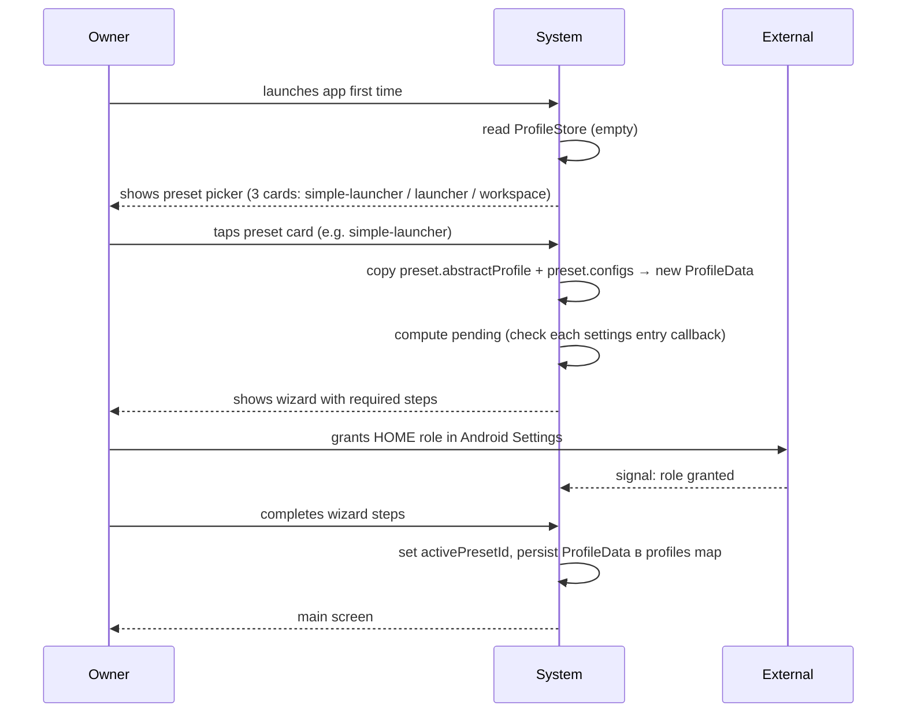
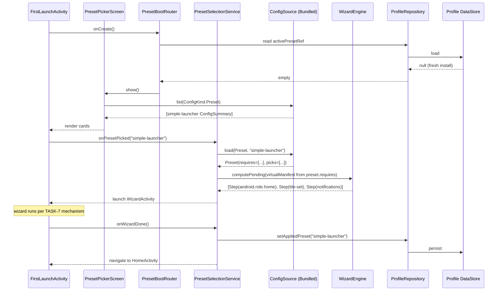
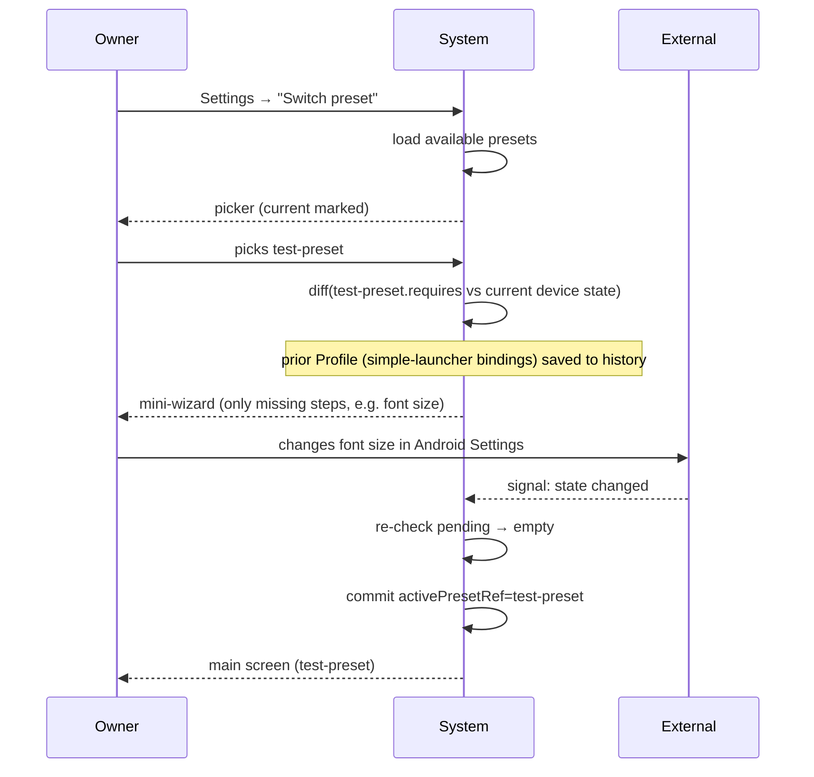
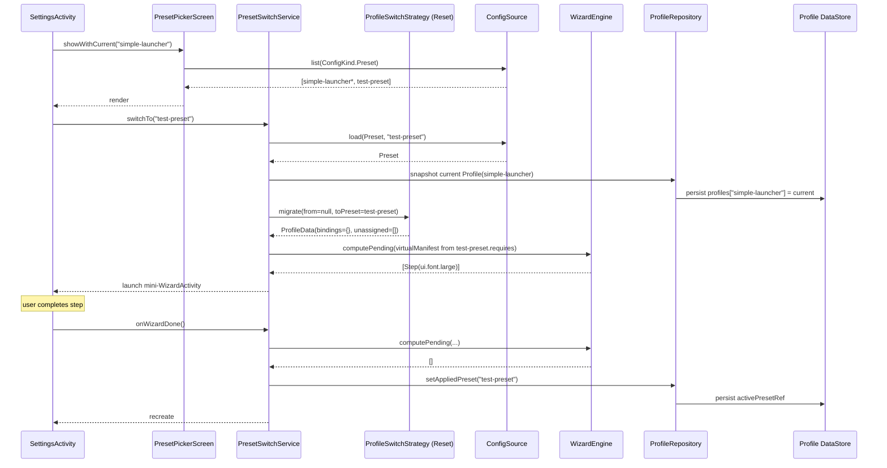
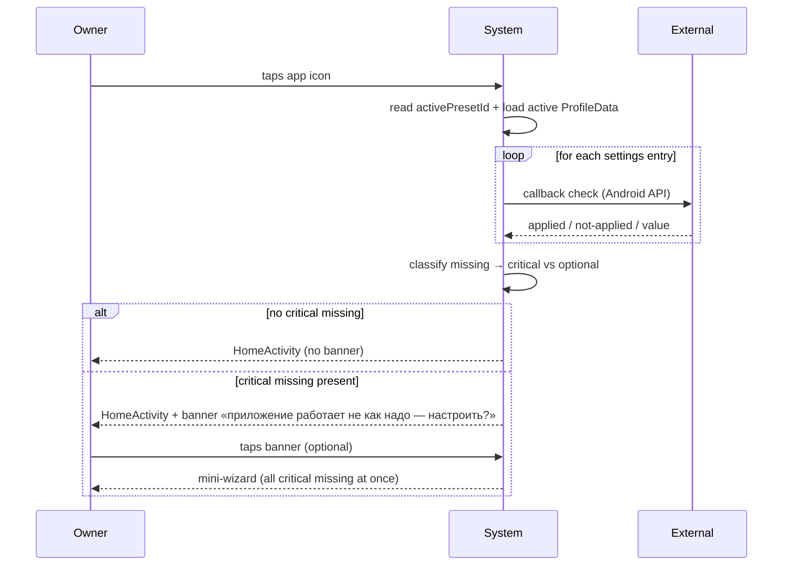
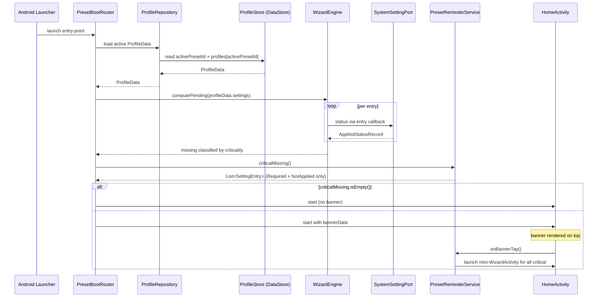
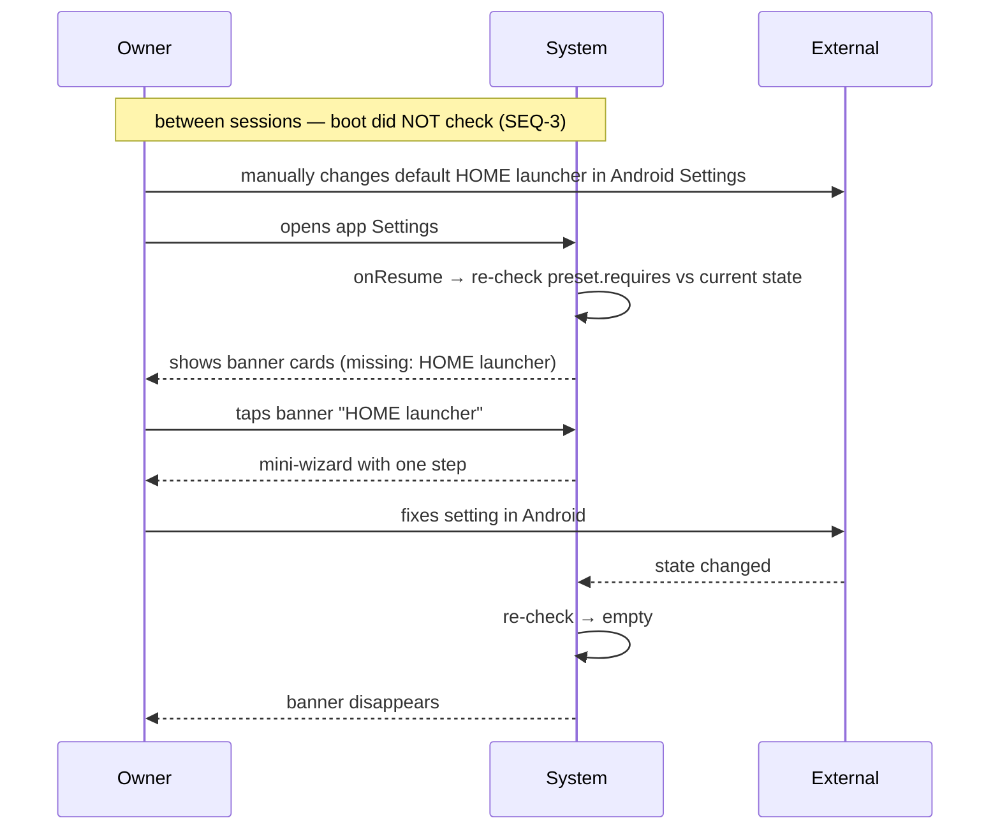
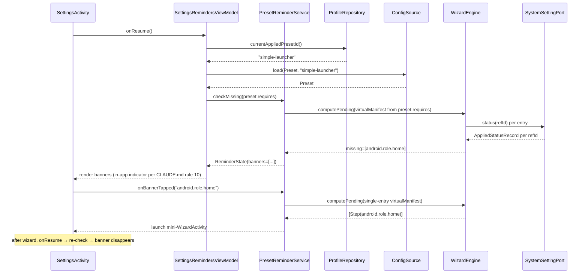
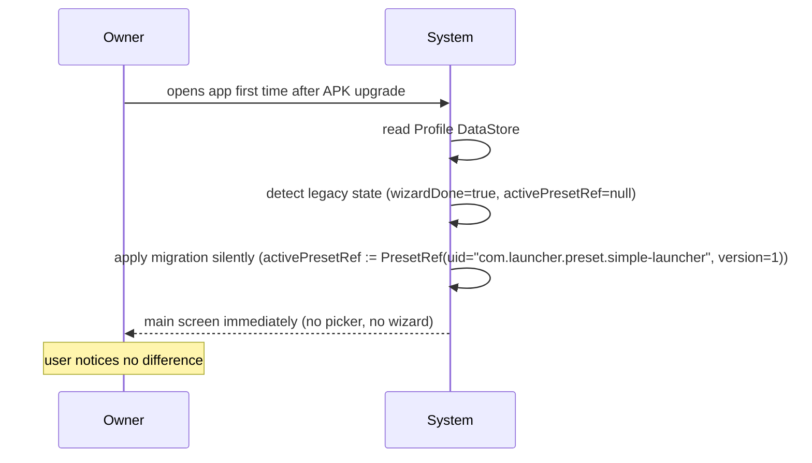
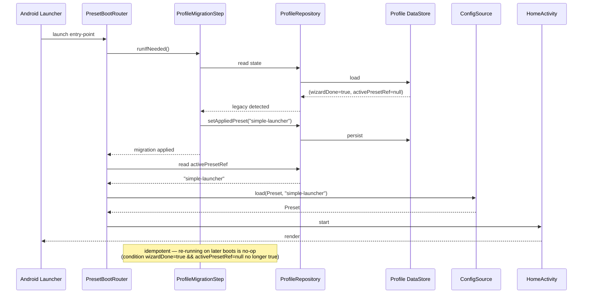

# Feature Specification: TASK-65 — Preset Composition Foundation v2

**Feature Branch**: `task-65-profile-composition-foundation-v2`
**Created**: 2026-06-30
**Status**: Clarified
**Input**: Backlog [TASK-65](../../backlog/tasks/task-65%20-%20Profile-Composition-Foundation-v2.md) — generic preset composition runtime; first-launch picker; switch-via-diff; lint rules; fitness tests; extraction-readiness.

> **Branch / Backlog naming note**: branch name и backlog file path сохраняют слово `profile-composition` (исторические), но **semantic content** этой спеки оперирует новой терминологией: **Preset** (shareable top-level) + **Profile** (per-device personal). Подробности — Clarification #1 ниже.

## Контекст и цель спека

**Где мы сейчас** (Phase 2). Phase 1 завершена: TASK-7 (Simple Launcher Setup Wizard) — Done. Сейчас `simple-launcher` — единственный preset и **захардкожен** в нескольких местах:

- `core/src/androidMain/assets/wizard/wizard-manifests/simple-launcher.json` — поле `body.appFamilyId: "simple-launcher"` (preset-leakage в формат manifest'а).
- В коде, который читает manifest, есть точечные допущения «preset — этот».
- Нет first-launch picker'а — `FirstLaunchActivity` сразу запускает wizard под simple-launcher.
- Settings → «Сменить preset» не существует.

**Что constitution уже строит** (важно знать, чтобы не дублировать):

Article VII §9-§16 уже описывает **полную модель** composition (kinds, ports, дисциплина). `ConfigSource` port + `BundledConfigSource` adapter — **уже существуют** в `core/src/commonMain/kotlin/com/launcher/api/wizard/ConfigSource.kt` (per §14). Sealed hierarchy `CheckSpec` / `ApplySpec` — уже есть (per §15-§16). `WizardEngine`, `SystemSettingPort`, `UserPreferencesStore` — уже есть.

> **Note**: constitution Article VII использует термин «profile» для shareable top-level. После TASK-65 переименование `profile → preset` оформляется constitution amendment (см. Clarification #1). До применения amendment'а constitution и new spec используют разные термины — spec — каноничный с момента merge TASK-65.

**Что TASK-65 строит дополнительно**:

1. **Generic `Preset` wire format** (`preset.json` schemaVersion=1) — новый kind. Self-contained (embedded snapshot из pool entries, не ссылки), содержит `configs[]` (pikки из пулов с версионированием) + i18n labels для picker'а. Этот kind сейчас не существует — TASK-65 его вводит.
2. **`PoolSource` port** с двумя adapter'ами: `HardcodedPoolSource` (живой) + `JsonAssetPoolSource` (scaffold, имплементация позже). Versioning per-pool с первого коммита. DI swap.
3. **Generic CheckSpec extensibility** — добавляем `CheckSpec.UIFont(minScale: Float)` как **demonstration variant**, доказывающий что engine generic (расширяется не только для Android-system). Реальный handler в androidMain adapter.
4. **`Profile` data model** — per-device personal data: applied preset reference + bindings (что в каких слотах) + applied-state cache. Storage shape — **multi-profile-capable** (один app instance может хранить несколько profiles: «мой» + admin'ские profiles для primary users которыми управляю). Storage реализация — минимальная (только active profile сейчас); shape готов к multi.
5. **First-launch picker** — Compose screen в `core/profiles/`.
6. **Preset switch flow** в Settings (с `ProfileSwitchStrategy` port; единственный adapter сейчас — `ResetSwitchStrategy`).
7. **In-app Settings reminders** (banners по missing requirements; per CLAUDE.md rule 10 — `in-app indicator`, не push).
8. **Pool naming convention spec** в `contracts/pool-naming.md`.
9. **Lint rules** (Detekt-based, KMP-friendly):
   - `PresetIdBranchingDetector` (no `presetId == "..."` в business logic).
   - `ExtractionReadinessDetector` (no launcher-specific imports в core/presets/wizard/pools).
10. **Regression test** (simple-launcher идентичен до/после).
11. **Fitness test** (dummy `test-preset.json` с non-Android требованием — доказывает generic-ness).
12. **Wire format крючки** (Hooks) для будущих расширений:
    - `Slot.kind: String? = null` в layout schema.
    - `Profile.unassigned: List<Binding> = []`.
    - `Preset.pickEnabled: Boolean = true` — можно отключить picker даже при наличии required настроек.

**Что TASK-65 НЕ строит** (намеренно):

- Не вводит новые presets (`workspace` — TASK-68, `clinic-patient` / `self-care` — позже).
- Не вводит pool entries для будущих фич (pairing-list — TASK-67, workspace JSON — TASK-68).
- Не строит `NetworkPresetSource` / `FilePresetSource` / `ShareIntentPresetSource`. `BundledConfigSource` (existing) расширяется поддержкой Preset kind — единственный adapter этой спеки (per rule 4 MVA).
- Не извлекает foundation в sub-repo / shared library (rule 4; trigger — messenger TASK-27 / photo TASK-28).
- Не строит push notifications для missing requirements (rule 10; используем in-app reminders).
- Не строит remote-управление чужими profiles (admin → primary user) — TASK-67 (pairing) + TASK-70 (sync).
- Не строит Settings UI как view на profile — TASK-69 (new).
- Не строит wizard hidden-steps / defaults — TASK-71 (new).
- Не строит pool browser UI (opportunistic preset authoring) — TASK-72 (new).

## Clarifications

### 2026-06-30 — Pre-plan clarification pass (mentor-driven)

| # | Question | Resolution |
|---|----------|------------|
| 1 | **Naming**: что такое profile (статус кво размытое слово, означало и shareable top-level, и personal device data)? | **Инвертированы**. **Preset** = shareable top-level (бывший profile). Имена: `simple-launcher`, `launcher`, `workspace`, `clinic-patient`, `self-care`. **Profile** = per-device personal data. Constitution amendment подготовлен отдельно. |
| 2 | **`PoolSource` strategy**: hardcoded vs JSON? | **Не выбираем сейчас, оба варианта рядом**. Port `PoolSource` + adapter `HardcodedPoolSource` (живой) + `JsonAssetPoolSource` (scaffold с TODO). DI swap. Pool versioning с первого commit для обоих. Pool callbacks — handler registry по `CheckSpec.kind` (общий для обоих). |
| 3 | **Preset wire format**: ссылки на configs (by id) или embedded snapshot? | **Embedded snapshot**. Preset = self-contained JSON, содержит embedded копии pikанных pool entries + версии pools на которых собран. При расшаривании едет один файл. |
| 4 | **Profile switch strategy**: что с user data при переключении preset'а? | **Copy on activate** (Подход 3 Android-native). Profile DataStore хранит `Map<PresetRef, ProfileData>`. При первом переключении на preset — copy от `preset.abstractProfile + preset.configs`. При возврате к ранее активированному preset'у — restore из Map (bindings, layout, settings сохранены). Port `ProfileSwitchStrategy` готов для будущих strategies (kind-match, sandbox). |
| 5 | **Profile storage shape**: один active profile или Map<presetId → profile>? | **Map<PresetRef, ProfileData> + activePresetId pointer**. Storage хранит ProfileData per-preset (полная история). `activePresetId` указывает на текущий active. При switch — snapshot old (в Map по `oldPresetId`) + restore new (если был) или create from preset (если впервые). |
| 6 | **CheckSpec.AuthState / ApplySpec.RequestSignIn variants**: добавить в scope? | **Out of scope**. TASK-65 добавляет только demo `CheckSpec.UIFont` для proof of generic-ness. |
| 7 | **`appFamilyId` field**: удалить или оставить? | **Удалить из `wizard.manifest` body**. Field `id` в `preset.json` (новый wire format) заменяет старый identifier. Constitution amendment 1.11 применён. |
| 8 | **Что такое Preset структурно**: «маленькая обложка со ссылками» или «коробка с содержимым»? | **Коробка с содержимым**. Preset = `{id, label, description, configs[], abstractProfile?}`. `configs[]` = пики из pools (каждый config содержит title/description/callback inline, не выносится отдельно). `abstractProfile` = optional начальное наполнение (layout + placeholder bindings, без личных данных) — как Android default home screen с предустановленными иконками при первом запуске нового телефона. Если `abstractProfile == null` → user получает пустой экран с «+» для добавления. |
| 9 | **Что такое Profile структурно**: cache применённых настроек или полная сущность? | **Полная сущность для активного preset'а**. ProfileData = `{layout, bindings, settings}`. `layout` = реальная структура (может отличаться от `preset.abstractProfile.layout` после настройки пользователем). `bindings` = реальные packages/контакты в плитках. `settings` = массив settings entries (изначально copy от `preset.configs`); каждая entry содержит config metadata (title/desc/callback) + current value. **Wizard и Settings UI оба строятся из `profile.settings`** (два view на одну сущность). `settings` — **не** Android-cache: это **наши** настройки приложения, которые ссылаются на Android через callback'и. |
| 10 | **Boot path**: проверять Android-настройки или нет (axiom владельца «ничего не проверяется» revised)? | **Revised — проверяем**. При boot вызываем callback каждой `profile.settings` entry для проверки реального Android-состояния. Стоимость — миллисекунды (N callback'ов). Что показывать при missing: **critical missing → HomeActivity + banner сверху** «приложение работает не как надо — настроить?», тап → mini-wizard со **всеми** critical missing (не только одна). **Non-critical missing → ничего на boot**, увидится в Settings reminders (SEQ-4). Criticality = `CheckSpec.criticality: Required / Optional`. |
| 11 | **`basedOnPreset` ссылка в Profile**: нужна? | **Нет, implicit через Map ключ**. ProfileData идентифицируется как `profiles[presetId]`. Ключ Map'а заменяет explicit ссылку. Нет дублирования. |
| 12 | **Placeholder app в abstractProfile когда target не установлен** (preset предлагает YouTube binding, YouTube не установлен)? | **Архитектурный hook в TASK-65, UI в follow-up**. `Binding` model содержит `targetPackage` + ProfileData может содержать binding для not-installed package. Rendering fallback («установите приложение» / fallback icon) — TASK-68 (Workspace) или TASK-71. TASK-65 закладывает model, не строит UI. |
| 13 | **Preset identity**: достаточно `presetId: String` (slug) для Map ключа? | **Нет, нужен composite `PresetRef = (uid, version)`**. Причина: возможны collision — `workspace v1` от нашей команды и `workspace by SuperUser v6` от стороннего автора. Если ключ только slug — overwrite или ложное совпадение. Decision: **`PresetUid: String`** (глобально уникальный, namespaced — например `com.launcher.preset.simple-launcher`, либо UUID) + **`PresetVersion: Int`** (bump на каждое изменение preset). **`PresetSlug: String`** остаётся для UI / Detekt lint / debugging как human-readable label, но не identity. ProfileStore key = `PresetRef(uid, version)`. Map ключ строго composite. |

### Wire format крючки (для будущих расширений, без UI сейчас)

Зашиваются в schema с первого коммита, чтобы добавление features позже было аддитивным (per CLAUDE.md rule 4 — abstraction оправдана когда известный future change иначе требует rewrite):

- **`Slot.kind: String? = null`** — поле в layout, опциональный hint типа слота («messenger-contact», «phone-call», etc). Сейчас всегда `null`. Используется будущим `KindMatchSwitchStrategy` (Подход 4 migration).
- **`Profile.unassigned: List<Binding> = []`** — bin для bindings, не размещённых ни в одном слоте текущего preset'а. Возникает при переключении на preset с меньшим числом слотов. Сейчас всегда пустой; UI «распределить unassigned» — будущая task.
- **`Preset.pickEnabled: Boolean = true`** — флаг для opt-out picker'а даже при наличии required настроек (по запросу владельца — «можем не запускать picker если хотим»).
- **`Profile.unassigned`, `Slot.kind`** — оба персистятся в DataStore с первого коммита, lint защищает их от удаления.

## User Scenarios & Testing *(mandatory)*

> **Про роли.** TASK-65 — чисто архитектурная инфраструктура. `primary user` (бабушка / patient / self-care) — видит picker один раз при установке. `remote administrator` — отдельная роль; remote управление чужими profiles **не в scope TASK-65**, но storage shape подготовлен (см. Clarification #5).

### User Story 1 — First-launch picker → simple-launcher preset (Priority: P1)

`Primary user` устанавливает APK, открывает. Видит экран выбора preset'а (`FirstLaunchActivity` → `PresetPickerScreen`). Один вариант — `simple-launcher` (после TASK-68 появится `workspace`). Карточка содержит `label` и `description` (i18n из preset.json keys, RU/EN/ES/...). Тапает → запускается тот же wizard что в TASK-7. Идентичный UX. После wizard — главный экран simple-launcher.

**Why this priority**: ядро спеки.

**Independent Test**: instrumentation test на `pixel_5_api_34` — fresh install → проверить (а) `PresetPickerScreen` появляется первым, (б) видна карточка simple-launcher с i18n label, (в) tap → `WizardActivity` поднимается с теми же шагами что были в TASK-7, (г) после wizard — `HomeActivity` simple-launcher.

**Acceptance Scenarios**:

1. **Given** fresh install, **When** APK открывается, **Then** показан `PresetPickerScreen` с ≥1 карточкой preset'а.
2. **Given** picker shown, **When** tap на simple-launcher, **Then** запускается WizardActivity со списком шагов, идентичным выводу wizard'а TASK-7 (regression).
3. **Given** wizard done, **When** Activity restart, **Then** `HomeActivity` simple-launcher показан, picker больше не появляется.
4. **Given** wizard done, **Then** в Profile DataStore записан `activePresetRef=(uid="com.launcher.preset.simple-launcher", version=1)`.

---

### User Story 2 — Preset switch через Settings → diff-wizard (Priority: P1)

`Primary user` идёт в Settings → «Сменить preset» → видит picker (текущий preset отмечен) → выбирает `test-preset` (dummy для теста diff-engine). `WizardEngine.computePending` сравнивает `test-preset.requires` vs текущее состояние → wizard показывает **только недостающие шаги**. После прохождения → новый preset активен, Profile recreate'нится под новый preset, **bindings прежнего preset'а сохраняются** в Map<presetId → profile> (восстановятся при возврате).

**Why this priority**: ядро ценности спеки.

**Independent Test**: instrumentation test на `pixel_5_api_34` → wizard done под simple-launcher → программно проставить пару bindings → Settings → switch на test-preset → проверить (а) wizard содержит только diff, не полный wizard, (б) после wizard `activePresetRef=PresetRef(uid="com.launcher.preset.test-preset", version=1)`, (в) **switch обратно на simple-launcher** возвращает прежние bindings.

**Acceptance Scenarios**:

1. **Given** `activePresetRef=(uid="com.launcher.preset.simple-launcher", version=1)`, **When** Settings → "Сменить preset", **Then** picker shown с current отмеченным.
2. **Given** picker shown, **When** select test-preset, **Then** `WizardEngine.computePending` возвращает `missing=[ui.font.large]`, wizard содержит **только** этот один шаг.
3. **Given** mini-wizard done, **When** re-check, **Then** `activePresetRef` commit'ится, Activity recreate, bindings прежнего preset'а сохранены в storage.
4. **Given** mini-wizard interrupted (user back), **When** проверка `missing` повторяется, **Then** missing≠[] → preset **не** меняется.
5. **Given** switched simple-launcher → test-preset → simple-launcher, **Then** прежние bindings simple-launcher восстановлены (per Подход 3 + Map storage).

---

### User Story 3 — Migration существующего simple-launcher пользователя (Priority: P1)

Пользователь работает в simple-launcher (post-TASK-7). Получает обновление APK с TASK-65. **Picker НЕ появляется**. Приложение запускается прямо в `HomeActivity` simple-launcher. Это работает потому что: до TASK-65 wizardDone=true с implicit preset = simple-launcher; миграция при первом запуске после upgrade — `if (wizardDone && activePresetRef == null) { activePresetRef = PresetRef(uid="com.launcher.preset.simple-launcher", version=1); }`.

**Why this priority**: regression risk.

**Independent Test**: instrumentation test — install pre-TASK-65 build → wizard done → upgrade APK на TASK-65 build → проверить (а) picker НЕ показан, (б) `HomeActivity` сразу, (в) DataStore содержит `activePresetRef=(uid="com.launcher.preset.simple-launcher", version=1)`.

**Acceptance Scenarios**:

1. **Given** wizardDone=true без `activePresetRef`, **When** APK upgrade на TASK-65 запускается, **Then** автоматически `activePresetRef=(uid="com.launcher.preset.simple-launcher", version=1)`, picker НЕ показан.
2. **Given** мигрированный пользователь, **When** Settings → «Сменить preset», **Then** работает как USER STORY 2.

---

### User Story 4 — In-app Settings reminders по missing requirements (Priority: P2)

`Primary user` — в simple-launcher. Между запусками **руками** в Android Settings сменил default HOME launcher (или отозвал permission, или уменьшил системный font scale). Открывает Settings приложения → `onResume()` вызывает `WizardEngine.computePending(currentPreset)` → видит banner-карточки «Не настроено: HOME launcher; шрифт». Tap на banner → mini-wizard этот один шаг → исправил → banner исчезает.

**Why this priority**: P2 — UX. Per CLAUDE.md rule 10 — **in-app indicator**, не push.

**Independent Test**: instrumentation test — wizard done simple-launcher → программно отозвать ROLE_HOME → открыть Settings activity → проверить (а) banner с правильным missing, (б) tap → mini-wizard, (в) после fix — banner исчезает.

**Acceptance Scenarios**:

1. **Given** preset active, requirements satisfied, **When** Settings opens, **Then** banners=[] (никаких reminders).
2. **Given** preset active, ROLE_HOME отозван руками, **When** Settings opens (`onResume`), **Then** banner «Не настроен HOME launcher» показан.
3. **Given** banner shown, **When** tap, **Then** запускается mini-WizardActivity с одним шагом.
4. **Given** mini-wizard done, **When** Settings `onResume` снова, **Then** re-check → banner исчезает.
5. **Given** missing=[role.home, font.large], **When** Settings opens, **Then** **2 banner-карточки**.

---

### User Story 5 — Lint rule «no presetId branching» (Priority: P2)

Разработчик пытается закоммитить:
```kotlin
if (presetId == "simple-launcher") { /* ... */ }
when (appFamilyId) { "simple-launcher" -> ... }   // legacy term, тоже flagged
```
в `core/` или `app/` (вне `core/presets/` whitelisted). Detekt-rule падает на pre-commit / CI. Сообщение: «Per Article VII §13 — presets are data, not forks. Use composition (configs/picks), not code branches.»

**Why this priority**: P2 — fitness function защищает архитектурную инвариант.

**Independent Test**: Detekt rule test — positive case (`if (presetId == "x")`) → ISSUE; negative case (тот же код в `core/presets/`) → no ISSUE.

**Acceptance Scenarios**:

1. **Given** Kotlin file в `core/presets/` содержит `if (presetId == "simple-launcher")`, **When** Detekt runs, **Then** NO issue (whitelist).
2. **Given** Kotlin file в `app/home/` содержит `if (presetId == "simple-launcher")`, **When** Detekt runs, **Then** ISSUE.
3. **Given** Kotlin file в `core/wizard/` содержит `when (appFamilyId)`, **When** Detekt runs, **Then** ISSUE (legacy term тоже).
4. **Given** pre-commit hook installed, **When** developer commits violating file, **Then** commit **rejected** с Detekt output.

---

### User Story 6 — Lint rule «extraction-readiness» (Priority: P2)

Foundation modules `core/presets/`, `core/wizard/`, `core/pools/` **не должны** иметь imports launcher-specific типов (`com.launcher.app.tiles.*`, `com.launcher.app.home.*`). Обеспечивает cross-app extraction = `git mv` + dependency swap, не rewrite.

**Why this priority**: P2 — защищает cross-app vision.

**Independent Test**: Detekt rule test.

**Acceptance Scenarios**:

1. **Given** файл в `core/presets/` содержит `import com.launcher.app.tiles.Tile`, **When** Detekt runs, **Then** ISSUE.
2. **Given** файл в `app/` содержит тот же import, **When** Detekt runs, **Then** NO issue.
3. **Given** разрешённые imports (`kotlinx.*`, `androidx.*`, `com.launcher.api.*`, `com.launcher.core.presets.*`), **When** в `core/presets/`, **Then** NO issue.

---

### User Story 7 — Boot после первой настройки идёт без проверок (Priority: P1)

`Primary user` тапает иконку. `PresetBootRouter` читает `activePresetRef` из DataStore (один read) → `ConfigSource.load(Preset, id)` (cached) → `start HomeActivity`. **Никаких** вызовов к `WizardEngine.computePending` или validation. Главный экран показан мгновенно (как до TASK-65, без regression).

**Why this priority**: P1 — главная axiom владельца.

**Independent Test**: instrumentation test с tracing — открыть `HomeActivity` → проверить что `computePending()` НЕ вызывался на пути от Sys.launch до HomeActivity.render.

**Acceptance Scenarios**:

1. **Given** preset setup done, **When** Activity launch, **Then** trace показывает: `DataStore.read → ConfigSource.load (cached) → HomeActivity.onCreate` — без `computePending` calls.
2. **Given** пользователь руками в Android отозвал ROLE_HOME между запусками, **When** Activity launch, **Then** boot **всё равно** проходит без проверок. Reminder появится только когда зайдёт в Settings (см. USER STORY 4).
3. **Given** cold start, **When** HomeActivity.onResume завершилось, **Then** время от Sys.launch ≤ 1.5s на `pixel_5_api_34` (regression vs TASK-7 baseline +5%).

---

### User Story 8 — Demo `CheckSpec.UIFont` доказывает generic engine (Priority: P3)

В test-time DI грузится `test-preset.json` с `requires: [ui.font.large]`. Pool `ui-customization.pool.json` содержит entry `ui.font.large` с `CheckSpec.UIFont(minScale=1.3)`. `UIFontChecker` (новый handler) реализует check через `Configuration.fontScale` API. `WizardEngine.computePending` строит step с `ApplySpec.SettingsDeepLink(Settings.ACTION_ACCESSIBILITY_SETTINGS)`. Доказывает: engine не падает на non-Android-permission `CheckSpec.kind`, диспатч корректный, extension additively через sealed hierarchy.

**Why this priority**: P3 — fitness test.

**Independent Test**: JVM unit test — `WizardEngine` с fake `ConfigSource` (грузит test-preset.json) + fake `UserPreferencesStore` (fontScale=1.0) → `engine.computePending()` → expect `[Step(ui.font.large)]`. После применения (fake set fontScale=1.5) → re-check → expect `[]`.

**Acceptance Scenarios**:

1. **Given** test-preset.json с requires=[ui.font.large], fontScale=1.0, **When** computePending, **Then** возвращает 1 step.
2. **Given** fontScale=1.5 (≥1.3), **When** computePending, **Then** missing=[].
3. **Given** preset с unknown `CheckSpec.kind` (no handler registered), **When** check, **Then** результат `Indeterminate`, engine treat'ит как pending (graceful degradation per §15).

---

### User Story 9 — Pool source swap через DI (Priority: P3)

Разработчик настраивает Gradle flavor / config switch — приложение использует `HardcodedPoolSource` (Kotlin code) либо `JsonAssetPoolSource` (assets JSON). Roundtrip test: `HardcodedPoolSource.list("system-settings") == JsonAssetPoolSource.list("system-settings")` — оба возвращают идентичный set entries. Доказывает что abstraction не сломалась и swap безопасен.

**Why this priority**: P3 — exit ramp для будущего решения «pools хардкод или JSON».

**Independent Test**: JVM unit test roundtrip.

**Acceptance Scenarios**:

1. **Given** `HardcodedPoolSource` + `JsonAssetPoolSource` оба реализуют `PoolSource`, **When** loading same pool id, **Then** оба возвращают equivalent entries (по id, не reference equality).
2. **Given** DI binding switches от Hardcoded → JsonAsset, **When** app runs, **Then** behaviour preset selection / wizard / settings remains identical.
3. **Given** Pool version bumped в Hardcoded, JsonAsset не обновлён, **When** roundtrip test runs, **Then** test fails с clear message (out-of-sync alarm).

---

### Edge Cases

- **`preset.json` повреждён / не парсится** → `BundledConfigSource.load(Preset, id)` returns `ParseError` → picker показывает оставшиеся валидные presets + банер «Preset X недоступен, обратитесь в поддержку».
- **`preset.configs` ссылается на pool version > чем доступная** → `IncompatibleVersion` result → picker фильтрует или показывает warning.
- **`schemaVersion` preset.json — будущая версия** → `BundledConfigSource` returns `IncompatibleVersion`; picker фильтрует.
- **Picker открыт, но **0** preset'ов доступно** → fallback safety net (см. FR-010) — log warning + используем hardcoded `"simple-launcher"`.
- **Migration USER STORY 3: DataStore содержит partial state** → миграция идемпотентна: проверка `if (wizardDone && activePresetRef == null)` strict.
- **Settings → switch → выбран **тот же** preset** → no-op, picker dismiss, no wizard.
- **Mini-wizard в USER STORY 4 запущен, процесс убит** → `activePresetRef` **не** меняется (commit только после полного re-check missing=[]).
- **Profile storage — переключение между ≥2 presets** → bindings сохраняются in Map<PresetRef, ProfileData>; restore при возврате.
- **OEM-specific: Xiaomi MIUI блокирует deep-link на ROLE_HOME** → fallback toast с instruction.
- **`unassigned` non-empty при следующем switch** → сохраняется в Profile (per-preset); UI «распределить» в TASK-65 не строится.

## Sequences

Sequence diagrams elaborate critical flows from User Stories. Each sequence has:
- Pre/Post conditions and reuse pointer.
- Spec-level diagram (behaviour, owner-readable).
- Plan-level diagram (architecture, plan.md cites these lifelines).
- MENTOR-DETAIL block (plain-Russian explanation for non-developer owner).

Per [CLAUDE.md «Sequences in spec.md»](../../CLAUDE.md) section and [ADR-011](../../docs/adr/ADR-011-ai-owner-collaboration-conventions.md).

---

### SEQ-1: First-launch preset picker → preset apply

Pre: APK just installed; ProfileStore empty (`activePresetId == null`, `wizardDone == false`).
Post: `activePresetId="simple-launcher"` (or chosen preset), `wizardDone=true`, ProfileData для chosen preset инициализирована (copy from `preset.abstractProfile + preset.configs`), main screen visible.
Used-in: spec/task-65-profile-composition-foundation-v2.

**Picker shows 3 presets из коробки**: `simple-launcher` (elderly), `launcher` (classic), `workspace` (admin/work).

#### Spec-level (behavior)



#### Plan-level (architecture)



<!-- MENTOR-DETAIL:BEGIN -->
#### Пояснение для владельца

- **Что видит пользователь**: открывает APK впервые — экран выбора preset'а с **тремя карточками** (simple-launcher для пожилого пользователя; launcher классический; workspace для admin/работы). Тапает один — запускается wizard, после которого появляется главный экран соответствующего preset'а.
- **`PresetBootRouter`** — маленький диспатчер, который при каждом запуске читает из памяти telephone (ProfileStore) `activePresetId`. При первом запуске там null → запускает picker.
- **`PresetPickerScreen`** — Compose-экран. Список доступных preset'ов читает из `ConfigSource.list(ConfigKind.Preset)` — добавление новых preset'ов = добавление новых bundled JSON-файлов, picker сам подхватит без правок кода.
- **`PresetSelectionService`** — domain-сервис, оркеструет «выбрали preset → собираем wizard из недостающих требований → запускаем».
- **`WizardEngine.computePending`** — существующая функция, которая берёт требования и проверяет состояние Android: если ROLE_HOME уже granted (например при reinstall) — этот шаг не показывается.
- **Источник правды для активации preset'а** — Profile DataStore (`activePresetRef`). Запись происходит **только после полного прохождения wizard'а** (если пользователь нажал «назад» — preset не активируется).
- Закрывает: US-1, FR-009, FR-011, FR-012, FR-014, SC-001.
<!-- MENTOR-DETAIL:END -->

---

### SEQ-2: Preset switch through Settings — diff-wizard + Profile history preserved

Pre: User in simple-launcher (`activePresetRef=(uid="com.launcher.preset.simple-launcher", version=1)`), Profile contains bindings (например, 6 плиток с контактами).
Post: `activePresetRef=PresetRef(uid="com.launcher.preset.test-preset", version=1)`, prior simple-launcher Profile preserved in storage (Map<PresetRef, ProfileData>); main screen recreated under test-preset.
Used-in: spec/task-65-profile-composition-foundation-v2.

#### Spec-level (behavior)



#### Plan-level (architecture)



<!-- MENTOR-DETAIL:BEGIN -->
#### Пояснение для владельца

- **Главная новизна**: переключение preset'а **не сбрасывает** твою историю. Profile DataStore хранит `Map<PresetRef, ProfileData>` — у каждого preset'а свой кэш. Переключился на test-preset → bindings simple-launcher остались в storage. Вернулся обратно — твои 6 плиток на месте.
- **`PresetSwitchService`** — оркеструет переключение: загружает новый preset, снимает snapshot текущего Profile, спрашивает у `ProfileSwitchStrategy` что делать с bindings (сейчас единственная стратегия — `Reset`: новый preset начинает с пустого Profile).
- **`ProfileSwitchStrategy`** — port для будущих стратегий (kind-matching, sandbox). Сейчас port готов, но реализована только Reset. Адаптеры добавятся additively в TASK-72+ без правок остального кода.
- **Diff через `WizardEngine.computePending`** — берёт `test-preset.requires`, сравнивает с фактическим состоянием Android, показывает **только разницу**. Если новый preset не требует ничего нового — wizard вообще не показывается.
- **Защита от прерывания**: `activePresetRef` коммитится **только после полного прохождения mini-wizard'а**. Нажал «назад» в середине — preset остаётся прежним.
- Закрывает: US-2, FR-013, FR-014, FR-017, FR-018, FR-019, SC-002.
<!-- MENTOR-DETAIL:END -->

---

### SEQ-3: Boot path — settings check + critical-missing banner (revised)

Pre: Preset is set up (`activePresetId` points to current preset, `wizardDone=true`); ProfileData has settings[] entries each with prior state.
Post: HomeActivity rendered. Settings callbacks executed (cheap, ms). If any `criticality=Required` entry is `NotApplied` → banner shown on top of HomeActivity; tap → mini-wizard для всех critical missing. Optional missing → no boot action (visible в Settings reminders only).
Used-in: spec/task-65-profile-composition-foundation-v2.

> **Revised from earlier «no checks» axiom** per Clarification #10. Cost = N callbacks (one per settings entry), миллисекунды на pixel_5_api_34. Justified: пользователь установил другое приложение → оно взяло HOME role → без boot check лаунчер запускается в degraded state без понятного explanation.

#### Spec-level (behavior)



#### Plan-level (architecture)



<!-- MENTOR-DETAIL:BEGIN -->
#### Пояснение для владельца

- **Revised axiom** (твоё переформулирование 2026-06-30): «при boot **проверяем реальные settings**. Если что-то критическое не настроено — баннер на главном экране. Если некритическое — ничего на boot'е, увидится в Settings».
- **Почему изменили правило**: между запусками пользователь мог установить другое приложение, которое взяло HOME role. Без проверки лаунчер запускается в degraded состоянии (например, не перехватывает home-button) и **пользователь не понимает почему**. Reminder в Settings — слишком поздно: он туда не пойдёт пока сам не заподозрит.
- **Стоимость проверки** — миллисекунды. Callback каждой settings entry — простой `RoleManager.isRoleHeld(...)` / `PackageManager.checkPermission(...)`. На массиве 5-10 entries — незаметно.
- **Critical vs Optional**: criticality зашит в config (`Required` / `Optional`). HOME role = Required. Font scale = Optional. Banner показывается **только для Required + NotApplied**.
- **Один banner для всех critical** (а не несколько баннеров). Tap → mini-wizard, который проводит через все critical missing подряд. Если у пользователя 3 critical отвалилось — он за один проход исправит все 3.
- **Никакого forced flow**: пользователь может не тапать banner, просто пользоваться приложением как есть (degraded). Banner ненавязчивый, не блокирует UI.
- **Что НЕ меняется**: optional missing (font scale, тема) НЕ показываются на boot'е. Видны только в Settings (SEQ-4). Это сохраняет принцип «не пугать пользователя при каждом запуске мелочами».
- **Performance contract** (SC-007): boot path всё ещё ≤ 1.5s P95 на pixel_5_api_34. Callbacks выполняются в `Boot.onCreate()` синхронно но быстро; если в будущем callback станет slow — можем перевести в IO coroutine + показать HomeActivity immediately + апдейтить banner async.
- Закрывает: US-7 (revised), FR-029, FR-030, FR-031, SC-007.
<!-- MENTOR-DETAIL:END -->

---

### SEQ-4: In-app Settings reminders for missing requirements

Pre: Preset active (`activePresetRef=(uid="com.launcher.preset.simple-launcher", version=1)`); between sessions user manually changed Android state (например, revoked ROLE_HOME or lowered font scale).
Post: Banner shown in Settings; user taps → mini-wizard fixes one step → banner disappears on re-check.
Used-in: spec/task-65-profile-composition-foundation-v2.

#### Spec-level (behavior)



#### Plan-level (architecture)



<!-- MENTOR-DETAIL:BEGIN -->
#### Пояснение для владельца

- **Это твоя axiom**: «в настройках должны висеть напоминалки — смотри, вот это и это не настроено, поэтому приложение в этом preset'е работает некорректно».
- **Per CLAUDE.md rule 10 (notification minimization)**: banner внутри Settings — **in-app indicator**, **не** push notification. Пользователь сам пришёл в Settings, увидел картинку. Push'и не отсылаем (это раздражает, не actionable timely-sensitive — критерии rule 10).
- **Тот же `WizardEngine.computePending`** что в SEQ-1 и SEQ-2. Diff-engine один на 4 потока (install / switch / reminder / on-demand). Это одна из главных архитектурных побед TASK-65 — не дублируем код.
- **Boot всё ещё не проверяет** (SEQ-3). Проверка только когда Settings открывается — это **explicit user gesture**, не background работа.
- **Cross-app vision**: messenger / photo app будут иметь свой Settings экран с тем же механизмом — каждый показывает reminders по СВОИМ preset.requires. Shared `WizardEngine` + shared Settings template, app-specific pools.
- Закрывает: US-4, FR-016, SC-008, SC-011.
<!-- MENTOR-DETAIL:END -->

---

### SEQ-5: Silent migration of pre-TASK-65 simple-launcher users

Pre: User already had simple-launcher set up before TASK-65 (`wizardDone=true` in DataStore, but `activePresetRef == null` because field didn't exist pre-TASK-65). APK updated to TASK-65 build, first launch after update.
Post: `activePresetRef=(uid="com.launcher.preset.simple-launcher", version=1)` auto-set silently; picker НЕ shown; HomeActivity rendered immediately; no user-visible change.
Used-in: spec/task-65-profile-composition-foundation-v2.

#### Spec-level (behavior)



#### Plan-level (architecture)



<!-- MENTOR-DETAIL:BEGIN -->
#### Пояснение для владельца

- **Regression risk эта sequence закрывает**: существующие пользователи simple-launcher **не должны увидеть picker** после обновления APK на TASK-65. Иначе они подумают «я что-то сломал» и заново пройдут setup. Это нарушает feedback memory `no_user_action_for_internal_migrations` («внутренние migrations происходят silent под капотом»).
- **`ProfileMigrationStep`** — отдельный одношаговый migrator, запускается в `PresetBootRouter` **один раз** перед чтением `activePresetRef`. Идемпотентен: если flag `activePresetRef` уже выставлен — миграция no-op.
- **Условие миграции**: строгое — `wizardDone=true AND activePresetRef=null`. Если оба null (fresh install) — миграция НЕ срабатывает, идёт обычный path SEQ-1 (picker). Если `activePresetRef` уже стоит — миграция тоже no-op (нормальная работа).
- **После миграции** boot path продолжается как SEQ-3 (нет проверок) — главный экран показан мгновенно.
- **Что НЕ делает миграция**: НЕ запускает re-check Android settings, НЕ принуждает re-pass wizard. Если у пользователя ROLE_HOME отозвана между upgrade'ом — он увидит reminder в Settings (SEQ-4), не на boot'е.
- Закрывает: US-3, FR-015, SC-003.
<!-- MENTOR-DETAIL:END -->

---

## Requirements *(mandatory)*

### Functional Requirements

**Wire formats**:

- **FR-001**: System MUST define `preset.json` wire format со `schemaVersion=1`. Self-contained (embedded snapshot, не ссылки). Содержит:
  - `uid: String` (immutable, globally unique — namespaced reverse-DNS like `com.launcher.preset.simple-launcher`, или UUID). **Это identity preset'а.** Per Clarification #13.
  - `version: Int` (bump на каждое breaking изменение preset; non-breaking edits — не bump). Composite `PresetRef = (uid, version)`.
  - `slug: String` (human-readable id для UI / Detekt lint / debugging — `simple-launcher`, `launcher`, `workspace`, `test-preset`). **НЕ identity.** Может повторяться между разными `uid`.
  - `schemaVersion: Int` — schema version самого `preset.json` формата (отдельно от `version` preset'а — schema эволюционирует независимо от content'а).
  - `label: I18nKey` + `description: I18nKey`.
  - `configs: List<Config>` — embedded copies pikанных pool entries. Каждый Config содержит inline: `{id, poolId, poolVersion, entryId, title (i18n key), description (i18n key), check (CheckSpec), apply (ApplySpec), criticality (Required/Optional), defaultValue?, hideInWizard?, showInSettings?}`. UX hints вписаны прямо в config (per Clarification #8).
  - `abstractProfile: AbstractProfile?` — optional начальное наполнение `{layout, bindings[]}`. Bindings содержат placeholder packages (например `YouTube`, `Chrome`) без личных данных. Если `null` → user получает пустой экран с «+» (per Clarification #8).
  - `requiredModules: List<ModuleId>` + `optionalModules: List<ModuleId>` (per Article VII §8).
  - `pickEnabled: Boolean = true` — флаг opt-out picker'а.
- **FR-002**: System MUST remove `appFamilyId` field из `wizard.manifest` body. Manifest идентифицируется своим `id` (existing pattern). Preset ссылается на manifest **внутри своих configs**. Constitution amendment подготавливается отдельно (Article VII §9 — deprecate `appFamilyId`, define `presetId`).
- **FR-003**: Pool naming convention в `contracts/pool-naming.md` MUST документировать namespaced immutable IDs (`<pool>.<domain>.<subject>`), per-pool `schemaVersion`, immutability (no rename / delete; `deprecated: true`). Документация на простом русском.

**Composition runtime**:

- **FR-004**: `ConfigKind` enum MUST include `Preset` variant (per Article VII §10 evolution rule). Build-time fitness test проверяет что все bundled `preset.json` parsable.
- **FR-005**: `PoolSource` port (новый) MUST exist в `core/commonMain` с methods:
  - `suspend fun load(poolId: String): Pool`
  - `suspend fun version(poolId: String): Int`
  - `suspend fun listEntries(poolId: String): List<PoolEntry>` (для будущего pool browser UI, **используется уже в roundtrip test**).
- **FR-006**: `HardcodedPoolSource` (новый adapter) MUST реализовать `PoolSource` через Kotlin constants. Pool versions через `const val POOL_VERSION_*` per pool. **Это primary adapter сейчас**.
- **FR-007**: `JsonAssetPoolSource` (новый adapter) MUST exist как **scaffold** — реализует `PoolSource` interface, делегирует к JSON в assets (если есть) либо throws `NotImplementedError`. **TODO inline**: «Imлементация на TASK-65 завершении / в follow-up. Roundtrip test против HardcodedPoolSource — gate для finalize.»
- **FR-008**: DI MUST поддерживать swap между `HardcodedPoolSource` и `JsonAssetPoolSource` через single binding (Gradle build flavor `-Ppools.json=true` или Koin module switch).
- **FR-009**: `ConfigSource.load(ConfigKind.Preset, id)` MUST возвращать `Preset` document. `ConfigSource.list(ConfigKind.Preset)` MUST возвращать `ConfigSummary` per preset (для picker'а).
- **FR-010**: `WizardEngine.computePending(manifest)` MUST переиспользоваться для preset switch flow и settings reminders (не создаём дублирующий `RequirementsChecker` port — per Clarification rule 4 MVA). Preset switch service строит `WizardManifest`-equivalent из `preset.requires` и подаёт engine'у.

**UI flows**:

- **FR-011**: `FirstLaunchActivity` MUST показывать `PresetPickerScreen` если в Profile нет `activePresetRef` И нет migration trigger'а из FR-015.
- **FR-012**: `PresetPickerScreen` (Compose) MUST:
  - Загрузить `ConfigSource.list(ConfigKind.Preset)`.
  - Рендерить каждый preset как Material3 card с `label` + `description` (i18n).
  - Tap → callback с `presetId`.
  - Если `list()` returns 0 → fallback safety net — log warning + `presetId = "simple-launcher"` hardcoded.
  - Учитывает `Preset.pickEnabled = false` — если **единственный** preset с `pickEnabled = false`, picker НЕ показывается, авто-apply.
- **FR-013**: `SettingsActivity` MUST содержать entry «Сменить preset» → `PresetSwitchActivity` → переиспользует `PresetPickerScreen` (current отмечен).
- **FR-014**: `PresetSwitchService.switchTo(newPresetId)` MUST:
  - Snapshot current ProfileData → persist в `profileStore.profiles[oldPresetId]`.
  - Если `profileStore.profiles[newPresetId]` существует → restore (bindings, layout, settings уже там).
  - Иначе → применить активный `ProfileSwitchStrategy` (default: `CopyOnActivateStrategy`): copy `preset.abstractProfile` + copy `preset.configs` → новый ProfileData.
  - `WizardEngine.computePending(profileData.settings)` → `missing`.
  - Если missing=[] → set `activePresetId=newPresetId`, recreate Activity.
  - Если missing≠[] → run mini-wizard. После — re-check; если still missing → НЕ менять `activePresetId`.
- **FR-015**: Migration path для existing simple-launcher users MUST быть idempotent:
  - `if (wizardDone && activePresetRef == null) { activePresetRef = PresetRef(uid="com.launcher.preset.simple-launcher", version=1); }`.
  - НЕ показывать picker.
  - НЕ requeue wizard.
- **FR-016**: `SettingsActivity` MUST в `onResume` вызывать `WizardEngine.computePending(profileData.settings)` и показывать banner-карточки для каждого `missing`. Tap → mini-wizard этот один шаг. **In-app indicator** per rule 10.

**Boot-time check (revised per Clarification #10)**:

- **FR-029**: `PresetBootRouter` MUST при boot **вызывать callback каждой `profileData.settings` entry** для проверки реального Android-состояния. Стоимость — миллисекунды (N callback'ов в массиве settings).
- **FR-030**: Если callback'и находят **critical missing** (settings entry с `criticality=Required` имеет current state `NotApplied`) → `HomeActivity` MUST показать **banner сверху** «приложение работает не как надо — настроить?». Tap на banner → `PresetReminderService` запускает mini-wizard со **всеми** critical missing (не только одна).
- **FR-031**: Если callback'и находят **non-critical missing** (`criticality=Optional`) → НИКАКОГО action на boot. Видимо только в Settings reminders (FR-016 / SEQ-4). HomeActivity показывается без banner.

**Profile storage (revised per Clarification #9, #11)**:

- **FR-017**: ProfileData model MUST содержать:
  - `layout: Layout` — реальная структура (screens, grid, toolbars). Изначально copy от `preset.abstractProfile.layout` либо пустой layout.
  - `bindings: List<Binding>` — реальные packages/контакты в плитках. Изначально copy от `preset.abstractProfile.bindings` либо пустой.
  - `settings: List<SettingEntry>` — массив settings entries. Каждая = config (copy из `preset.configs` на момент активации) + current state. **Wizard и Settings UI оба строятся из этого массива.**
- **FR-018**: `ProfileStore` MUST хранить:
  - `activePresetRef: PresetRef?` — composite указатель на текущий active preset, где `PresetRef = (uid: String, version: Int)` (per Clarification #13).
  - `profiles: Map<PresetRef, ProfileData>` — history. Map содержит все preset'ы которые когда-либо были активированы. **Ключ Map'а = composite `PresetRef`**, не plain slug, чтобы избежать collision между `workspace v1` и `workspace by Author2 v6`. При переключении ProfileData старого preset'а **persists**, при возврате к нему — restore.
  - **Это вся сущность что синхронизируется на server** (зашифрованно через pairing keys, для admin remote management + recovery — TASK-70 territory).
- **FR-019**: `ProfileSwitchStrategy` port (новый, `core/commonMain`) MUST exist с method:
  - `suspend fun migrate(from: ProfileData?, toPreset: Preset): ProfileData`.
  - Единственный adapter сейчас — `CopyOnActivateStrategy`: возвращает `ProfileData(layout=copy(preset.abstractProfile?.layout), bindings=copy(preset.abstractProfile?.bindings ?: []), settings=preset.configs.map { SettingEntry(it, state=NotApplied) })`. Параметр `from` игнорируется (Reset semantics).

**Lint rules (Detekt)**:

- **FR-020**: Custom Detekt rule `PresetIdBranchingDetector` MUST flag:
  - `if (presetId == "...")` / `if ("..." == presetId)`.
  - `when (presetId) { ... }` / `when (appFamilyId) { ... }` (legacy term).
  - `if (appFamilyId == "...")`.
  - Whitelisted: `com.launcher.core.presets.*`, `com.launcher.core.presets.test.*`.
  - Severity: ERROR. Pre-commit hook fails.
- **FR-021**: Custom Detekt rule `ExtractionReadinessDetector` MUST flag imports launcher-specific типов (`com.launcher.app.tiles.*`, `com.launcher.app.home.*`, `com.launcher.app.contacts.*`) внутри packages `com.launcher.core.presets.*`, `com.launcher.core.wizard.*`, `com.launcher.core.pools.*`.
  - Severity: ERROR.
- **FR-022**: Detekt rules MUST runnable as `./gradlew detektFoundation` + часть `./gradlew check`. Pre-commit hook вызывает `detektFoundation` на staged Kotlin files.

**Testing**:

- **FR-023**: `test-preset.json` (bundled в androidTest assets) MUST содержать:
  - `requires: [ui.font.large]` (non-Android требование).
  - `picks: [tile.dummy]`.
  - `schemaVersion=1`.
- **FR-024**: Pool entry `ui.font.large` MUST добавлен в `ui-customization.pool` с `CheckSpec.UIFont(minScale=1.3)` и `ApplySpec.SettingsDeepLink(ACTION_ACCESSIBILITY_SETTINGS)`. `UIFontChecker` handler — в `androidMain` adapter.
- **FR-025**: Regression test `SimpleLauncherCompositionRegressionTest` MUST verify: wizard для `simple-launcher` через новый composition содержит **те же шаги в том же порядке** как до TASK-65 (snapshot test против `wizard-simple-launcher-golden.json`).
- **FR-026**: Generic-ness fitness test `EngineGenericityFitnessTest` MUST:
  - Load `test-preset.json`.
  - Run `WizardEngine.computePending`.
  - Verify dispatched handler — `UIFontChecker`, не Android-permission handler.
  - After fake setFontScale=1.5 — re-check returns missing=[].
- **FR-027**: Pool roundtrip test `PoolSourceRoundtripTest` MUST verify (per FR-008, FR-006, FR-007):
  - `HardcodedPoolSource.listEntries(poolId) == JsonAssetPoolSource.listEntries(poolId)` для каждого pool'а (когда JsonAsset реализован).
  - Если JsonAsset throws `NotImplementedError` — test marked as `@Ignore("scaffold")` с TODO note.

**Documentation**:

- **FR-028**: `contracts/pool-naming.md` MUST содержать на простом русском:
  - Format namespaced ID.
  - Правила immutability, versioning per-pool.
  - Примеры: `tile.pairing.list`, `wizard.step.google-sign-in`, `ui.font.large`.
  - Не-разработчик-friendly пояснения.

### Key Entities

**Preset (shareable, self-contained, no PII)**:
- **`Preset`** — wire format `preset.json` schemaVersion=1. Структура: `{id, schemaVersion, label, description, configs[], abstractProfile?, requiredModules[], optionalModules[], pickEnabled}`.
- **`Config`** — единица внутри `preset.configs[]` (embedded snapshot pool entry). Содержит inline: `{id, title (i18n key), description (i18n key), check (CheckSpec), apply (ApplySpec), criticality (Required / Optional), defaultValue?, hideInWizard?, showInSettings?}`. UX hints вписаны прямо в config.
- **`AbstractProfile`** — optional `{layout, bindings[]}` внутри preset. Bindings содержат placeholder packages (без личных данных), как Android default home screen иконки на новом телефоне. Если `null` → user получает пустой экран с «+».
- **`Pool`** — каталог настроек (источник для configs пиков), versioned. Hardcoded или JSON.
- **`PoolEntry`** — единица каталога. Picked в `preset.configs`.

**Profile (per-device, encrypted sync на server для admin / recovery)**:
- **`PresetRef`** — composite identity: `data class PresetRef(uid: String, version: Int)`. Используется как Map ключ в ProfileStore чтобы избежать collision между preset'ами с одинаковым slug но разными авторами (per Clarification #13).
- **`ProfileStore`** — top-level storage: `{activePresetRef: PresetRef?, profiles: Map<PresetRef, ProfileData>}`. **Это вся сущность что синхронизируется на server.**
- **`ProfileData`** — full state одного preset'а: `{layout, bindings[], settings[]}`. Один ProfileData на каждый preset который когда-либо активировался.
- **`Settings`** (within ProfileData) — массив settings entries. Каждая entry = config (copy из `preset.configs` на момент активации) + current state (applied / not-applied / value). **Wizard и Settings UI оба строятся из `profile.settings`** (два view на одну сущность). Boot callback каждой entry проверяет реальное Android-состояние.
- **`Layout`** — реальная структура (screens, grid, toolbars). Может отличаться от `preset.abstractProfile.layout` после настройки пользователем.
- **`Binding`** — содержимое слота (targetPackage + контакт/URL/intent). Может ссылаться на not-installed package (fallback UI — TASK-68/71).
- **`Slot`** — позиция в layout с `kind: String? = null` (hook для будущего kind-matching).

**Ports / Services**:
- **`PoolSource`** — port для загрузки pools. 2 adapter'а (`HardcodedPoolSource`, `JsonAssetPoolSource` scaffold).
- **`ConfigKind.Preset`** — новый variant existing enum.
- **`ProfileSwitchStrategy`** — port. Single adapter `CopyOnActivateStrategy` сейчас: при first activate — copy `preset.abstractProfile + preset.configs` в новый ProfileData; при возврате к уже-активированному preset'у — restore existing ProfileData из Map.
- **`PresetPickerScreen`** — Compose UI. Reused first-launch + Settings.
- **`PresetSelectionService`** — first-launch flow.
- **`PresetSwitchService`** — Settings flow с Map<presetId> management (snapshot old, restore / create new).
- **`PresetBootRouter`** — Activity routing. **Вызывает settings callbacks при boot** (revised per Clarification #10).
- **`PresetReminderService`** — Settings reminders + boot critical-missing banner на HomeActivity.
- **`CheckSpec.UIFont(minScale: Float)`** — новый variant sealed hierarchy.
- **`UIFontChecker`** — Android adapter handler.
- **`PresetIdBranchingDetector`**, **`ExtractionReadinessDetector`** — Detekt rules.
- **`test-preset.json`** — fixture.

## Success Criteria *(mandatory)*

### Measurable Outcomes

- **SC-001 [backlog]**: Fresh install → picker → simple-launcher → wizard identical TASK-7 → HomeActivity.
- **SC-002 [backlog]**: Settings → «Сменить preset» → test-preset → mini-wizard только missing → preset active. Switch обратно — bindings восстановлены.
- **SC-003 [backlog]**: Existing simple-launcher user post-upgrade видит свой preset автоматически.
- **SC-004**: Detekt `PresetIdBranchingDetector` падает на нарушения, проходит на whitelisted.
- **SC-005**: Detekt `ExtractionReadinessDetector` падает на launcher-specific imports в `core/presets/`.
- **SC-006 [backlog]**: `contracts/pool-naming.md` читается non-developer владельцем за <10 минут.
- **SC-007**: Boot trace: `Sys.launch → HomeActivity.onResume` ≤ 1.5s (P95) на `pixel_5_api_34`. Regression vs TASK-7 baseline ≤ +5%.
- **SC-008 [backlog]**: Settings → отозван ROLE_HOME → banner → tap → mini-wizard → fix → banner исчезает.
- **SC-009**: Fitness test `EngineGenericityFitnessTest` PASS.
- **SC-010**: Snapshot test `SimpleLauncherCompositionRegressionTest` PASS.
- **SC-011 [backlog]**: Banner mini-wizard содержит **ровно один** шаг.
- **SC-012**: `PoolSourceRoundtripTest` PASS (когда JsonAsset реализован; иначе marked Ignore с TODO).

## Assumptions

- `ConfigSource` port + `BundledConfigSource` adapter существуют per Article VII §14. План начнётся с inventory.
- `WizardEngine.computePending` существует и работает как описано.
- Detekt доступен в проекте (стандартная зависимость, нужно проверить).
- `Configuration.fontScale` API работает на API ≥21.
- `test-preset.json` не shipped в production (BuildVariant filter).
- TASK-3 (F-4 AuthProvider) — НЕ pre-requisite (Clarification #6).

## Local Test Path *(mandatory)*

- **Emulator / device**: `pixel_5_api_34` + JVM unit tests + Detekt rule tests.
- **Fake adapters**: `FakeConfigSource`, `FakePoolSource`, `FakeUserPreferencesStore`, `FakeSystemSettingPort`.
- **Fixtures**: `test-preset.json`, `wizard-simple-launcher-golden.json`.
- **Verification commands**:
  - `./gradlew :core:test --tests "*PresetComposition*"` — JVM unit.
  - `./gradlew :core:test --tests "*PoolSourceRoundtrip*"`.
  - `./gradlew detektFoundation` — Detekt rules.
  - `./gradlew :app:connectedDebugAndroidTest -PandroidTest.filter="FirstLaunchPickerE2ETest"`.
  - `./gradlew :app:connectedDebugAndroidTest -PandroidTest.filter="PresetSwitchE2ETest"`.
  - `./gradlew :app:connectedDebugAndroidTest -PandroidTest.filter="MigrationE2ETest"`.
  - `./gradlew :app:connectedDebugAndroidTest -PandroidTest.filter="SettingsRemindersE2ETest"`.
- **Cannot-test-locally gaps**:
  - **Xiaomi MIUI** ROLE_HOME deep-link → `// TODO(physical-device): Xiaomi 11T verification`.
  - **Real Huawei EMUI** → `// TODO(physical-device): future Huawei verification`.
  - **Samsung One UI** → `// TODO(physical-device): future Samsung verification`.

## AI Affordance *(mandatory)*

**no AI affordance — internal architectural infrastructure**.

`PresetSwitchService.switchTo()` не должен вызываться AI agent'ом без user confirmation. Inline TODO в коде: `// TODO(capability-registry): future AI invocation requires user confirmation gate`.

## OEM Matrix *(mandatory if feature touches device behavior)*

| OEM | Known divergence | Mitigation | Verification |
|---|---|---|---|
| Stock Android (Pixel) | baseline | — | emulator |
| Samsung One UI | DataStore, RoleManager — стандартно | — | TODO(physical-device) |
| Xiaomi MIUI | Deep-link на ROLE_HOME может redirect | Fallback toast с инструкцией; banner text включает hint | TODO(physical-device) Xiaomi 11T |
| Huawei EMUI | No GMS, future presets с CheckSpec.GoogleAuthState → Indeterminate (graceful per §15) | Preset-specific; TASK-65 generic | TODO(physical-device) future |

## Exit Ramps and Design Reversibility

### One-way doors

1. **`preset.json` schemaVersion=1** — Exit ramp: schemaVersion bump + migration writer. Cost изменения формата ~1-2 недели.
2. **Pool naming convention** — Once published external. Cost — namespaced docs + per-pool schemaVersion bump.
3. **Detekt rules enabled в pre-commit** — Cost disable: Gradle flag.
4. **Naming `Preset` / `Profile` inversion** — Cost rename: ~1-2 дня (этот spec, code, constitution). Решение принято в clarify-фазе — НЕ откладываем.

### Two-way doors

5. **`PresetPickerScreen` UI design** — Compose, rewriteable.
6. **In-app Settings reminders** — UI feature, removeable.
7. **`CheckSpec.UIFont` demo variant** — removeable с `test-preset.json` за полдня.
8. **Migration FR-015** — read-once, changeable.
9. **`HardcodedPoolSource` vs `JsonAssetPoolSource`** — designed for swap, ~hours through DI binding.
10. **`ResetSwitchStrategy`** — port для замены на `KindMatchSwitchStrategy` / `SandboxSwitchStrategy` additively.

### Что навсегда полезно

- Удаление `appFamilyId` (bug fix архитектурный).
- `ExtractionReadinessDetector` (защищает cross-app vision).
- Pool naming convention документ.
- `Profile` storage shape (Map<PresetRef, ProfileData>, multi-profile-capable).

## Dependencies

**Hard**:
- **TASK-7 (Simple Launcher Wizard)** ✅ Done.

**Soft**:
- **TASK-66 (Generic Encrypted Bucket Registry)** — следующий, не depend.
- **TASK-67 (Pairing Feature)** — depend (pairing pool entries появятся там).
- **TASK-68 (Workspace Preset)** — depend (workspace.preset.json появится там).
- **TASK-27** / **TASK-28** — long-term extraction trigger.
- **TASK-69 (Settings as Profile View)** — new, follows TASK-65.
- **TASK-70 (Profile Sync + Cache)** — new, follows TASK-65.
- **TASK-71 (Wizard Hidden Steps + Defaults)** — new, follows TASK-65.
- **TASK-72 (Pool Browser UI)** — new, follows TASK-65.

## Out of Scope

- **Remote profile management** (admin → primary user's profile) — TASK-67 + TASK-70.
- **Settings UI как view на profile** — TASK-69.
- **Per-profile cache sync на server** — TASK-70.
- **Remote-editable маркер для pool entries** — TASK-67 / TASK-70.
- **Wizard-controlled visibility + defaults** — TASK-71.
- **Pool browser UI / opportunistic preset authoring** — TASK-72.
- **`CheckSpec.AuthState` / `ApplySpec.RequestSignIn`** — Clarification #6.
- **`NetworkPresetSource` / `FilePresetSource` / `ShareIntentPresetSource`** — additively позже.
- **Sharing/import presets UI** — TASK-35 (Marketplace).
- **Preset-specific pool entries** — TASK-67 / TASK-68.
- **Extraction в sub-repo / shared library** — rule 4; trigger TASK-27 / TASK-28.
- **Push notifications** — rule 10.
- **`KindMatchSwitchStrategy`, `SandboxSwitchStrategy`** — Подходы 4/5; port готов, реализация — future tasks.
- **Slot.kind dictionary** — пустой sky default, словарь — future.
- **`Profile.unassigned` UI** — структура есть, UI отдельно.
- **Pool admin UI** (browse все entries в pool'е) — TASK-72.

## Adjacent Concerns (acknowledged, not in scope)

Возникли в clarify-фазе. Не реализуются в TASK-65, но shape подготовлен:

1. **Multi-profile per app instance** (admin'ский app хранит profile для каждого managed primary user) — storage уже Map<PresetRef, ProfileData>, но **per-user multiplicity** требует доп. dimension (`Map<userId, Map<PresetRef, ProfileData>>`). TASK-67 (Pairing) + TASK-70 (Sync).
2. **Remote update preset** через server — preset wire format готов (self-contained), но трансфер/расшифровка/применение — TASK-70.
3. **`Profile.unassigned` workflow** (как distribute orphan bindings при downsizing) — структура есть, UI и логика migration — будущая task.
4. **Pool browser** (admin / advanced user видит все pool entries, opportunistically собирает свой preset) — `PoolSource.listEntries` уже в API, UI — TASK-72.
5. **Settings UI consolidation** (Settings == view на тот же profile + reminders + change actions, single source) — TASK-69.
6. **`KindMatchSwitchStrategy`** для bindings migration при switch с похожими слотами — port готов, реализация — future.

## Constitution Gates (предварительно)

- **Rule 1** (domain isolation): `Preset`, `Pool`, `PoolSource`, `ProfileSwitchStrategy`, `PresetSwitchService` — pure domain в `core/commonMain`. Detekt — adapter (Detekt API), не вытекает в core. `PresetPickerScreen` — Compose, читает domain types.
- **Rule 2** (ACL): `PresetBootRouter` / `PresetSwitchService` adapter на `androidMain`. DataStore wrap'нут.
- **Rule 3** (one-way doors): см. Exit Ramps. `preset.json` schemaVersion=1, pool naming, naming inversion — one-way. Mitigated.
- **Rule 4** (MVA): не создаём дублирующий `RequirementsChecker` (используем `WizardEngine.computePending`). `PoolSource` 2 adapter'а оправданы (известный future change — hardcode vs JSON). `JsonAssetPoolSource` scaffold с TODO допустим потому что **roundtrip test** гарантирует не drift.
- **Rule 5** (wire-format): `preset.json` `schemaVersion=1` с первого commit. `wizard.manifest` schemaVersion bump из-за удаления `appFamilyId`. Pool entries — per-pool `schemaVersion`. Migration writers.
- **Rule 6** (mock-first): `FakeConfigSource`, `FakePoolSource`, etc.
- **Rule 7** (fitness functions): Detekt rules + roundtrip test + bundled-preset parse test + regression snapshot.
- **Rule 8** (server-roadmap): n/a — TASK-65 не вводит server. TASK-70 inline TODO «preset distribution / profile sync — own server target».
- **Rule 9** (shareability): `preset.json` обезличенный (нет identity / PII). `ConfigSource` adapter pattern.
- **Rule 10** (notification minimization): USER STORY 4 — in-app indicator.
- **Article VII §13**: обеспечено через `PresetIdBranchingDetector`.
- **Article VII §16**: `CheckSpec.UIFont` через sealed hierarchy.

## References

- [backlog TASK-65](../../backlog/tasks/task-65%20-%20Profile-Composition-Foundation-v2.md).
- [.specify/memory/constitution.md](../../.specify/memory/constitution.md) — Article VII (требует amendment для naming inversion).
- [CLAUDE.md](../../CLAUDE.md) — rules 1-10.
- [TASK-7 spec](../task-7-simple-launcher-first-run/) — baseline для regression.
- Memory: `project_modular_delivery_rule`, `feedback_plain_russian_for_novice`, `feedback_no_user_action_for_internal_migrations`.

---

## Plain Russian summary (для не-разработчика владельца)

**Что закрывает TASK-65 простым языком**:

Раньше в приложении один «профиль» (simple-launcher) был захардкожен. Чтобы добавить второй (workspace) — пришлось бы переписывать код. Это нарушало архитектурное правило: «варианты приложения = данные, не форки».

**Главный концептуальный сдвиг этой спеки** — разделили два разных понятия, которые раньше путали под словом «профиль»:

- **Preset** — готовый шарящийся комплект настроек. Имя `simple-launcher`, `workspace`. Один файл, можно отдать другому пользователю / положить на marketplace. **Никаких личных данных внутри.**
- **Profile** — личные настройки моего конкретного устройства (контакт Иванов в первой плитке, моя тема, моя раскладка). НЕ шарится. У каждого preset, который я когда-либо активировал — свой Profile (история сохраняется).

**Что строим (≈2-3 недели)**:

1. **Новый формат `preset.json`** — самосодержащий, со ссылками на pools и embedded snapshot выбранных настроек.
2. **Pool source двух видов** (hardcode в Kotlin и JSON в assets) — можно переключить через DI, roundtrip test проверяет что результаты идентичны. Это страховка: не решили окончательно, какой подход лучше — оба готовы.
3. **First-launch picker** — экран выбора preset'а при первой установке.
4. **Settings → «Сменить preset»** — при выборе нового движок показывает только недостающие шаги.
5. **Banner-напоминалки в Settings** — если в Android руками что-то поменял, увидишь карточку. **Без push-уведомлений.**
6. **Detekt lint правила** — pre-commit падает если разработчик пишет `if (presetId == "simple-launcher")` где не положено.
7. **Demo test-preset** — фиктивный preset с не-Android требованием, доказывает что движок generic.
8. **Regression test** — wizard для simple-launcher остаётся идентичным до и после.
9. **Profile storage с историей** — переключаешь preset, прежний Profile сохраняется. Вернёшься обратно — твои контакты на местах.
10. **Крючки для расширений**: `pickEnabled` (можно отключить picker), `Slot.kind` (для будущего kind-matching), `unassigned` bin (для будущего UI распределения orphan bindings).

**Что НЕ делаем (вынесено в новые задачи)**:

- Settings UI как view на profile → **TASK-69** (новая, будет создана).
- Profile sync на server + кэш per-profile + доступ admin'у → **TASK-70** (новая).
- Wizard hidden-steps + дефолты → **TASK-71** (новая).
- Pool browser UI (admin/продвинутый user видит все entries в pool'е и сам собирает preset) → **TASK-72** (новая).
- Remote управление чужими profiles (admin'ский app настраивает бабушкин телефон) → **TASK-67** (Pairing) + TASK-70.
- Workspace preset — **TASK-68**.

**Главное обещание**: после TASK-65 любой новый preset (workspace, clinic-patient, self-care) добавляется **только как JSON-файл**. И `Profile` — личное, никогда не утекает при шаринге.

**Boot инвариант**: при каждом запуске **ничего не проверяется**. Один read из DataStore → главный экран. Проверки только когда сам зашёл в Settings.

**Constitution amendment**: текущая Article VII §9 использует термин «profile» для shareable top-level. После TASK-65 переименование `profile → preset`. Amendment подготавливается отдельным diff'ом, требует владелец-approval.
