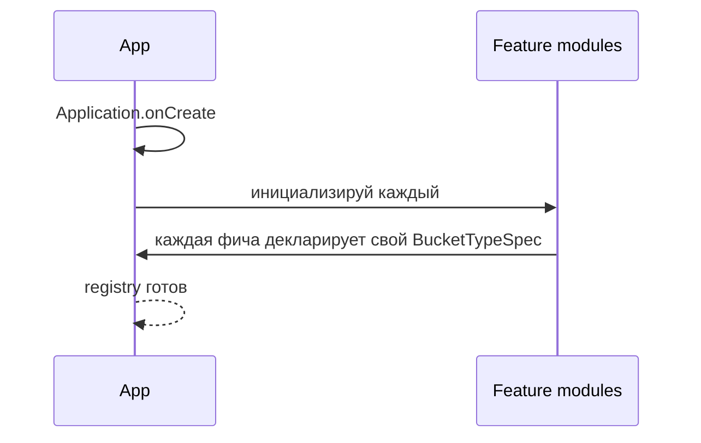
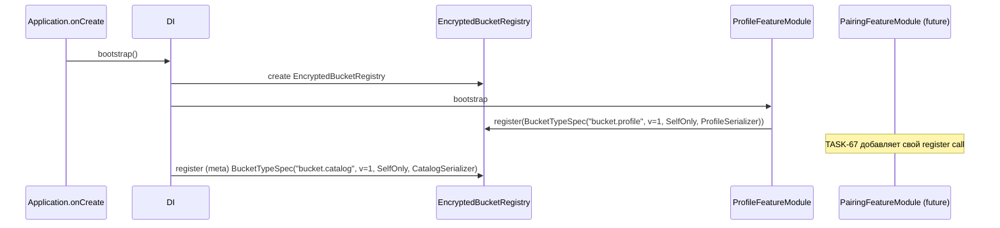
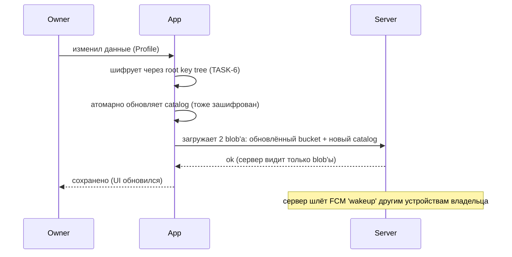
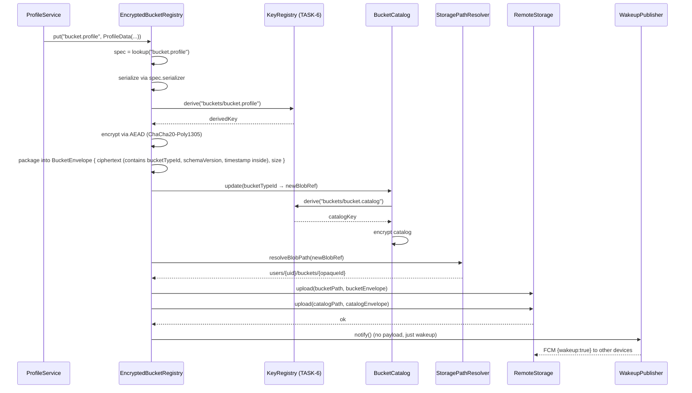
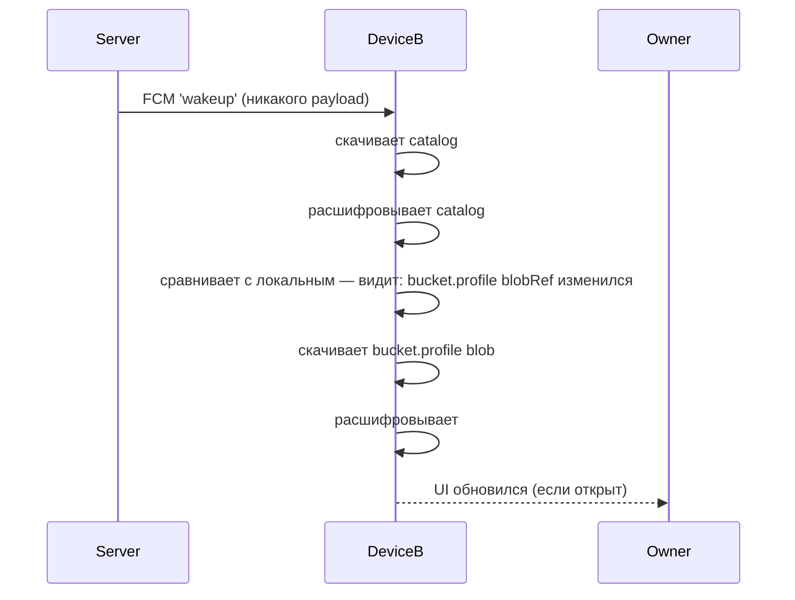
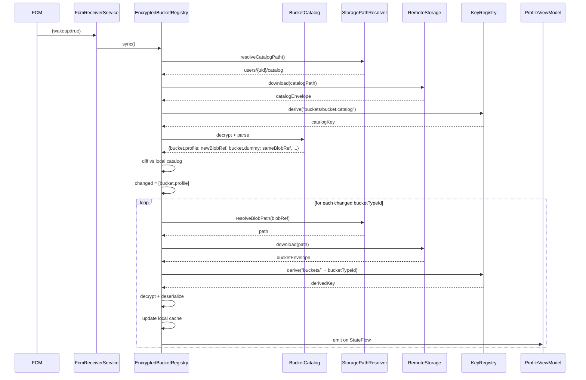
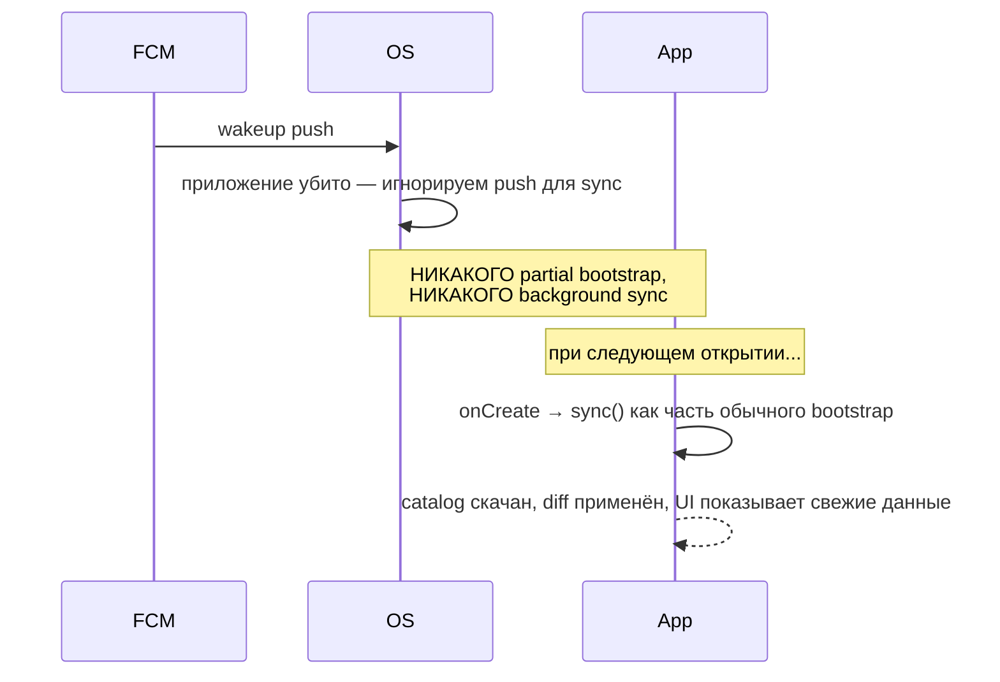
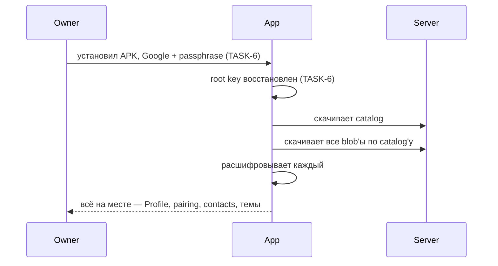
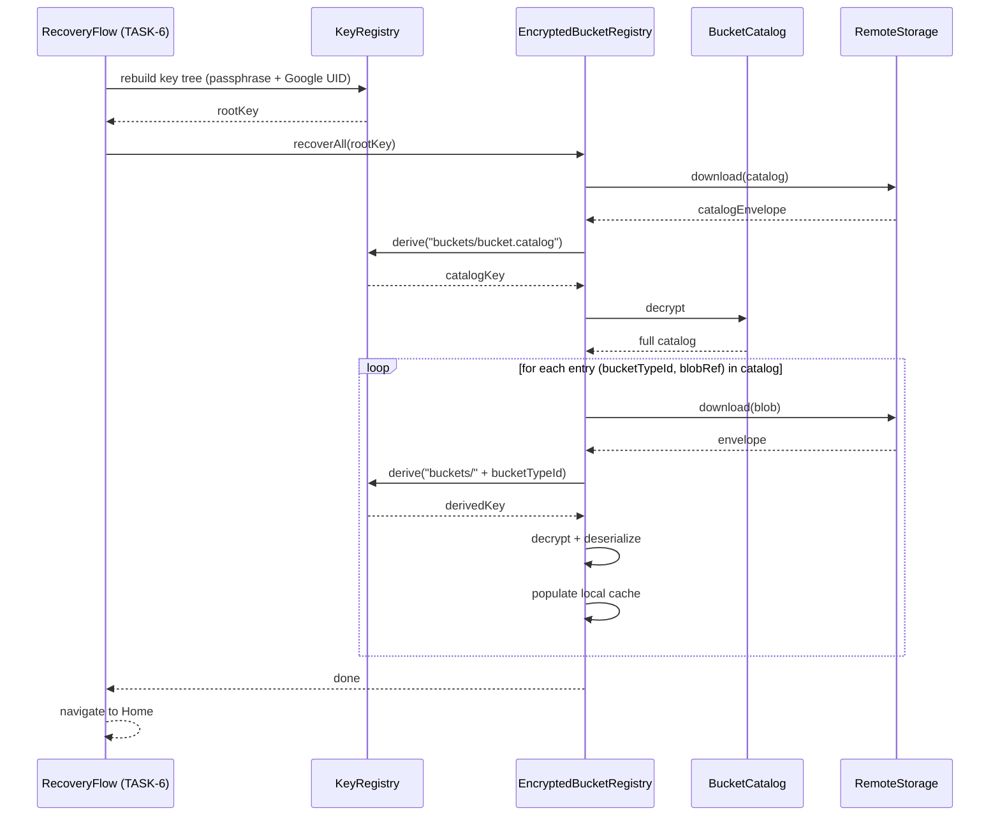

# Feature Specification: TASK-66 — Generic Encrypted Bucket Registry

**Feature Branch**: `task-66-generic-encrypted-bucket-registry`
**Created**: 2026-07-01
**Status**: Draft (clarify pass 1 done, pass 2 pending)
**Input**: Backlog [TASK-66](../../backlog/tasks/task-66%20-%20Generic-Encrypted-Bucket-Registry.md) — универсальный реестр шифрованных «вёдер данных»; каждая фича декларирует `BucketTypeSpec` → реестр делает encrypt / upload / catalog update / recover / push wakeup routing.

**Constitutional context**: Написан под **Article XX (Pre-MVP No-Migration Override)**. Нет installed base, нет user data в поле. TASK-4 config wire format **удаляется без migration**. Никакой byte-equal регрессии.

**Coordination note**: TASK-6 (Root Key Hierarchy + Owner Recovery) в статусе Verification. TASK-66 **не** переписывает recovery flow TASK-6 — TASK-66 экспонирует функцию `registry.recoverAll(rootKey)`, которую recovery flow из TASK-6 вызывает **в существующем виде**. Разграничение обязанностей:

- **TASK-6 owns identity + root key.** Google Sign-In → passphrase → root key восстановлен. Не знает про buckets.
- **TASK-66 owns encrypted buckets.** Не знает про identity. Получает root key снаружи, делает свою работу.

---

## Контекст и цель спека

**Терминология (согласовано с TASK-65).** В спеке действуют актуальные термины:

- **Preset** — public shareable JSON, ходит между устройствами **без шифрования**. В TASK-66 не участвует.
- **Profile** — per-device personal data (layout + bindings + settings values). **Шифруется** через Registry. `SelfOnly` recipient scope.
- **Pairing edges** (TASK-67), **contacts** (TASK-9), **photo** (Phase 4), **messenger threads** (TASK-27) — все это **encrypted buckets**, каждый — потребитель Registry.
- **Bucket** — единица шифрованных данных, идентифицируемая `BucketTypeId`. Не «config» (устаревшее TASK-4 слово, удаляется).

**Где мы сейчас**. TASK-4 (own config E2E encryption envelope) — Done. TASK-5 (FCM push) — Done. TASK-6 (Root Key Hierarchy) — Verification. Сейчас **один** шифрованный тип данных в коде: то, что раньше называлось `config`. Логика encrypt/upload/download/recover/push **зашита** в `ConfigCipher2 + ConfigRepository`.

**Проблема**. Каждая следующая фича, требующая шифрования (Profile — прямо сейчас в TASK-65, pairing edges — TASK-67 next, contacts — TASK-9, photo, threads), либо:
- (а) **дублирует** всю инфру encrypt/upload/recover/push — 5 итераций одного кода;
- (б) **паразитирует** на `ConfigCipher2`, размывая его границы (нарушение rule 1);
- (в) обрастает своим recovery кодом в TASK-6 flow — TASK-6 spec 020 становится God-object'ом.

**Ключевой архитектурный принцип: сервер видит только blob.**

Сервер (Firestore + Cloudflare Worker + FCM) **не знает**:
- какие типы buckets есть у владельца,
- что лежит в каждом blob'е,
- какой blob к какой фиче относится,
- какие поля есть внутри blob'а.

Сервер видит **только**:
- сам зашифрованный blob (как непрозрачную двоичную кучу),
- путь до blob'а (через `StoragePathResolver` port — сейчас содержит UID + opaque blobId; финальная схема определится при работе над своим сервером),
- размер blob'а (следствие физического хранения).

**Push через FCM = будильник.** Push **не содержит** информации о том, что именно обновилось. Просто «проверь свой catalog». Клиент сам разбирается через encrypted catalog (см. ниже).

**Encrypted catalog.** На сервере лежит один зашифрованный blob-catalog для владельца — «карта» его вёдер: `{bucketTypeId → blobRef}`. Тоже blob для сервера. Только клиент, имея root key, может расшифровать catalog и понять, что где лежит. Клиент, получив push-будильник, скачивает catalog → сравнивает с локальным → скачивает только изменившиеся blob'ы.

---

## Что TASK-66 строит

1. **`EncryptedBucketRegistry` port** в `core/buckets/` — один на app, `Map<BucketTypeId, BucketTypeSpec>`.
2. **`BucketTypeSpec` data class** — паспорт: `id`, `schemaVersion`, `recipientPolicy`, `serializer`.
3. **`BucketCatalog` — encrypted map `bucketTypeId → blobRef`.** Сам catalog — тоже bucket (первый bucket в системе, «meta»). При любом изменении bucket'а — атомарно обновляется catalog. Push будит клиент → он тянет catalog → диффит → тянет что изменилось.
4. **`StoragePathResolver` port + `MvpStoragePathResolver` adapter** — инкапсулирует path-схему. Сейчас: `users/{uid}/buckets/{opaqueBlobId}`. Позже (свой сервер): динамические строки, известные только клиенту. `MvpStoragePathResolver` **не финальный дизайн**, отмечен `// TODO(server-roadmap): path scheme redesign when own server ships`.
5. **`RecipientPolicy`** (sealed): `SelfOnly` / `SelfPlusPairedAdmins` / `Custom`. Влияет на то, какие public keys используются при encrypt.
6. **`BucketEnvelope` — минимальное wire format**: `{ciphertext, size}`. **Никаких plaintext-полей кроме ciphertext'а.** `bucketTypeId`, `schemaVersion`, `timestamp`, `signedBy` — **внутри ciphertext'а**.
7. **`recoverAll(rootKey)` API** — вызывается из recovery flow TASK-6 (TASK-6 flow не переписывается, добавляется одна строка вызова). Registry сам проходит по catalog'у и восстанавливает все buckets.
8. **Push wakeup** через FCM: payload = `{wakeup:true}`. **Ничего кроме флага.** Клиент сам знает, что делать (тянуть catalog, диффить, тянуть blob'ы).
9. **`FakeEncryptedBucketRegistry` + `FakeRemoteStorage`** — для тестов (rule 6).
10. **Fitness test**: dummy bucket через одну декларацию → put → recovery на новом инстансе → данные восстановлены. Доказывает, что foundation generic.
11. **Detekt `ExtractionReadinessDetector`** — `core/buckets/` не импортирует launcher-specific / preset-specific / pairing-specific типы.
12. **Documentation** `docs/architecture/bucket-registry.md` — простым русским, «как добавить новый bucket».
13. **Удаление TASK-4 legacy.** `ConfigCipher2`, старый envelope shape, wire format TASK-4 — **удаляются**. Профиль (то, что раньше шифровалось как «config») теперь регистрируется как обычный bucket через ту же Registry API. Per Article XX.

---

## Что TASK-66 НЕ строит

- **Не строит merge/diff/conflict resolution.** Владелец: «редактирование конфигов и рассинхроны — совершенно другая задача, отдельный механизм». Registry только encrypt/upload/download/recover. Что происходит при concurrent edit — область другой спеки.
- **Не строит конкретные bucket-типы.** Pairing — TASK-67. Photo — Phase 4. Messenger — Phase 3. TASK-66 закладывает только foundation + profile bucket как первый живой потребитель + dummy bucket для fitness теста.
- **Не строит server-side inventory API.** Server остаётся «глухим»: Firestore + Worker + FCM. Client знает всё, server ничего.
- **Не строит extraction в sub-repo.** Extraction trigger — второе family-приложение. `core/buckets/` в launcher-репо, `ExtractionReadinessDetector` защищает.
- **Не строит финальную server security модель.** `MvpStoragePathResolver` — временный. Финальная схема (динамические пути известные только клиенту, ротация ключей, шифрованные UID'ы, etc.) — задача при работе над своим сервером. Заложен только hook (port).
- **Не рефакторит TASK-5 Worker.** Worker получает `/notify {wakeup:true}` — тривиальное расширение существующего роутинга.
- **Не мигрирует existing данные.** Per Article XX — pre-MVP phase, existing dev-device data стирается fresh install'ом.

---

## Ключевая архитектурная идея (для владельца)

Раньше был один `ConfigCipher2`, специфичный для config. Каждая новая шифрованная фича требовала переписывания той же инфры. **После TASK-66:**

1. Есть **один реестр** для всех «вёдер».
2. Каждая фича даёт **паспорт**: id, версия, кому шифровать, как сериализовать.
3. Реестр сам шифрует, отправляет, скачивает, восстанавливает, разбирается с push'ами.
4. Сервер **не понимает** ничего — видит только зашифрованные blob'ы и путь до них.
5. **Catalog** (тоже зашифрованный) на сервере — единственный «указатель» на blob'ы. Только клиент может его прочитать.
6. **Push от сервера — тупой будильник** «проверь catalog». Никакой информации о том, что именно поменялось.

---

## Sequences

### Данные, которыми мы оперируем (mini-map)

```
На клиенте:
EncryptedBucketRegistry (один на app)
└── Map<BucketTypeId, BucketTypeSpec>
    ├── "bucket.profile"          ← первый живой потребитель (per-device Profile)
    ├── "bucket.pairing.edges"    ← TASK-67 (следующее)
    ├── "bucket.dummy"            ← fitness test
    └── (meta) bucket.catalog     ← сам catalog — тоже bucket

На сервере (opaque):
users/{uid}/buckets/{opaqueBlobId1}  ← blob (сервер не знает что это)
users/{uid}/buckets/{opaqueBlobId2}  ← blob
users/{uid}/buckets/{catalogBlobId}  ← catalog blob
```

Клиент, имея root key, знает: catalogBlobId → расшифровать → внутри `{bucket.profile: blobId1, bucket.pairing.edges: blobId2, ...}` → тянуть нужные blob'ы.

Сервер знает: есть blob'ы у пользователя. Что внутри — нет.

### SEQ-1: Регистрация bucket-типов на старте app

Pre: APK запускается. Post: registry знает обо всех типах.

#### Spec-level (behavior)



#### Plan-level (architecture)



<!-- MENTOR-DETAIL:BEGIN -->
#### Пояснение для владельца
- **Паспорт (BucketTypeSpec)** — фича говорит реестру «вот мой bucket: id, версия, кому шифровать, как сериализовать».
- **Registration один раз при старте app.** Не runtime. Если два модуля регистрируют один id — throw (программистская ошибка).
- **Catalog — тоже bucket.** Он сам себя регистрирует как meta-тип. Единственное отличие — Registry знает его особо (без catalog нельзя найти остальные).
- **Cross-app:** тот же код в messenger. Messenger регистрирует `bucket.messenger.threads` — Registry не отличит от `bucket.profile`.
<!-- MENTOR-DETAIL:END -->

### SEQ-2: Запись данных (put)

Pre: registry знает тип. Owner на устройстве A изменил Profile (например, поменял layout).

#### Spec-level (behavior)



#### Plan-level (architecture)



<!-- MENTOR-DETAIL:BEGIN -->
#### Пояснение для владельца
- **Фича не знает про шифрование.** ProfileService говорит «положи мне Profile». Registry сама шифрует.
- **Catalog атомарно обновляется вместе с bucket'ом.** Сначала catalog в памяти обновляется, потом заливаются оба blob'а. Если один из upload'ов не прошёл — retry (SEQ-6, отложено на clarify pass 2).
- **StoragePathResolver — hook.** Сейчас `users/{uid}/buckets/{opaqueId}`. Позже (свой сервер) — что-то другое, что сервер не сможет прочитать. Логика инкапсулирована в port'е, можно поменять без правки Registry.
- **Push wakeup = тупой будильник.** Payload = `{wakeup:true}`. Никакой информации что поменялось.
- **Cross-app:** тот же путь для любого будущего bucket'а. Один код, разные паспорта.
<!-- MENTOR-DETAIL:END -->

### SEQ-3: Приём wakeup — другое устройство владельца, приложение живо

Pre: устройство A записало bucket (SEQ-2). Устройство B живо (foreground / recent background). Post: B автоматически имеет свежий Profile.

#### Spec-level (behavior)



#### Plan-level (architecture)



<!-- MENTOR-DETAIL:BEGIN -->
#### Пояснение для владельца
- **Wakeup — только сигнал.** Клиент не знает, что поменялось, пока не скачает catalog.
- **Catalog — источник правды.** Локальная копия catalog'а хранится вместе с локальной копией bucket'ов. Diff catalog'ов показывает, какие blob'ы нужно перекачать.
- **StateFlow подписчики** — фичи получают реактивный поток. ViewModel жив (UI открыт) → мгновенно обновляется.
- **Если catalog не поменялся** (ложный wakeup) — Registry скачает один catalog, сравнит, увидит diff = ∅, ничего больше не сделает.
<!-- MENTOR-DETAIL:END -->

### SEQ-4: Приложение убито — что происходит с wakeup

Pre: устройство B, приложение убито OS. Приходит FCM wakeup.



<!-- MENTOR-DETAIL:BEGIN -->
#### Пояснение для владельца
- **Приложение убито = ничего не делаем.** Экономим батарею. Launcher — не мессенджер, он не обязан всегда быть на связи.
- **При следующем открытии** приложение как часть обычного bootstrap проверяет catalog. Если поменялся — тянет свежие blob'ы. Пользователь не заметит задержки — sync быстрый, catalog маленький.
- **Wakeup, дошедший до убитого app** — FCM его получит на уровне OS, но наш кастомный `FcmReceiverService` при мёртвом app сделает **noop**. Не пытаемся оживить.
- **Что если приложение killed → wakeup потерян → owner открывает app → видит устаревшие данные?** Не проблема: `onCreate` всегда делает `sync()`. wakeup нужен только для live-обновления в foreground/recent background.
<!-- MENTOR-DETAIL:END -->

### SEQ-5: Recovery на новом устройстве

Pre: устройство A потеряно. Owner купил новый телефон B, прошёл TASK-6 recovery. Root key восстановлен. Post: **все** зарегистрированные buckets автоматически восстановлены.

#### Spec-level (behavior)



#### Plan-level (architecture)



<!-- MENTOR-DETAIL:BEGIN -->
#### Пояснение для владельца
- **Killer feature.** До TASK-66 каждый bucket требовал свой recovery код. После — ноль. Зарегистрировал spec → recovery работает.
- **TASK-6 не переписывается.** Recovery flow из TASK-6 в конце добавляет один вызов: `registry.recoverAll(rootKey)`. Всё.
- **Разграничение обязанностей.** TASK-6 знает про identity и root key. TASK-66 не знает про identity — принимает root key как параметр и делает свою работу.
- **Если в catalog'е есть entry для bucket-типа, который в новой версии app не зарегистрирован** (например, экспериментальный bucket из dev-сборки) — скипаем с логом. Не крашимся.
<!-- MENTOR-DETAIL:END -->

---

## User Scenarios & Testing *(mandatory)*

> **Про роли.** TASK-66 — чисто архитектурная инфраструктура. `primary user` и `remote administrator` **не видят** новых экранов от этой задачи. Единственный видимый эффект — killer feature recovery (SEQ-5): при новом устройстве всё восстанавливается «само», без прогресс-баров «восстанавливаю X, восстанавливаю Y».

### User Story 1 — Fitness: новый bucket добавляется через одну декларацию (Priority: P1)

Разработчик добавляет новый bucket `bucket.dummy`. Пишет **одну декларацию** `BucketTypeSpec("bucket.dummy", 1, SelfOnly, DummySerializer)` + регистрирует в DI. **Ничего другого**: не пишет encrypt, не пишет upload, не пишет download, не пишет recovery, не пишет push handling.

**Why P1**: доказывает foundation действительно generic. Если этот тест падает или требует правок в 3+ файлах — foundation не generic, TASK-66 не решила проблему.

**Independent Test**: unit + integration test — (1) регистрируется `bucket.dummy`; (2) `registry.put("bucket.dummy", DummyData("hello"))`; (3) на другом инстансе registry (симулируя новое устройство) `registry.recoverAll(rootKey)`; (4) `registry.get("bucket.dummy")` возвращает `DummyData("hello")`.

**Acceptance Scenarios**:
1. **Given** `BucketTypeSpec("bucket.dummy", ...)` зарегистрирован, **When** put → recoverAll на другом инстансе → get, **Then** данные восстановлены.
2. **Given** dummy bucket добавлен, **When** grep `"bucket.dummy"`, **Then** результат = (а) декларация spec + (б) DI регистрация + (в) тесты. Никаких отдельных путей для encrypt/upload/recover/push.

### User Story 2 — Recovery на новом устройстве восстанавливает всё (Priority: P1)

Owner потерял устройство A. На новом B: APK → Sign-In Google → passphrase → **автоматически** восстановлены все зарегистрированные buckets (Profile, dummy, любой другой). Ни одного отдельного шага «восстанавливаю X, восстанавливаю Y».

**Why P1**: killer feature. Если не работает — TASK-66 не решила задачу.

**Independent Test**: instrumentation test — (1) устройство A: register 2 buckets (bucket.profile + bucket.dummy), put в оба, verify uploaded catalog содержит оба blobRef; (2) устройство B (fresh install): recovery flow → recoverAll → verify get возвращает те же данные для обоих; (3) без правки recovery flow при добавлении нового bucket-типа.

**Acceptance Scenarios**:
1. **Given** N registered buckets с данными на A, **When** recovery на B, **Then** все N восстановлены за один `recoverAll()` вызов.
2. **Given** новый bucket добавлен в codebase (US1 fitness), **When** recovery, **Then** он тоже восстанавливается автоматически, без правки recovery flow.

### User Story 3 — Wakeup routing на живом приложении (Priority: P2)

Owner на устройстве A изменил Profile. На устройстве B (foreground) приходит FCM `{wakeup:true}` (**без payload**). Registry на B: (1) скачивает catalog, (2) сравнивает с локальным, (3) видит diff — только `bucket.profile`, (4) скачивает только этот bucket, (5) emit на StateFlow. **`bucket.dummy` не перекачивается зря.**

**Why P2**: экономия трафика и батареи под нагрузкой. Регрессия видна при N buckets → каждый wakeup тянул бы N blob'ов.

**Independent Test**: unit test с FakeRemoteStorage — (1) register 3 buckets, put в все; (2) update только bucket.profile на A-инстансе; (3) simulate wakeup на B-инстансе; (4) verify FakeRemoteStorage.download был вызван для (а) catalog и (б) ровно одного bucket blob'а.

**Acceptance Scenarios**:
1. **Given** 3 registered buckets, только один изменился, **When** wakeup, **Then** download вызван для catalog + 1 blob.
2. **Given** wakeup, **When** catalog не изменился (ложный wakeup), **Then** download вызван только для catalog, никаких блоб-download'ов.

### User Story 4 — App killed → wakeup игнорируется, но при открытии всё свежее (Priority: P2)

Owner на A изменил Profile. На B — приложение убито OS. Wakeup доходит до OS, но приложение не оживает. Owner открывает B через 10 минут → app стартует → как часть обычного onCreate делает `sync()` → catalog скачан, diff применён, свежий Profile отображается.

**Why P2**: доказывает экономию батареи + правильную деградацию (нет data loss при пропущенных wakeup'ах).

**Independent Test**: instrumentation test — (1) put на A, (2) simulate app killed на B (force-stop), (3) simulate FCM wakeup — verify **никаких** disk writes / network calls в фоне, (4) start app on B, (5) verify sync() вызван в bootstrap, (6) verify свежий Profile загружен.

**Acceptance Scenarios**:
1. **Given** app killed, **When** wakeup приходит, **Then** noop — никакого background sync.
2. **Given** app killed → later opened, **When** onCreate, **Then** sync() вызван, catalog скачан, diff применён.

### User Story 5 — Сервер видит только blob'ы (Priority: P0 security invariant)

Инструментальный тест: перехватить все HTTP requests из клиента к Firestore и Cloudflare Worker → verify, что plaintext-тело содержит **только** ciphertext blob'ы. Никаких `bucketTypeId`, `timestamp`, feature names в plaintext.

**Why P0**: security invariant. Если ломается — компрометируется E2E принцип.

**Independent Test**: unit test — mock RemoteStorage, verify передаваемые data содержат **только** ciphertext + path. Path проверяется отдельно на регексп: `users/{uid}/buckets/{opaqueId}` без человекочитаемых токенов. Grep-fitness test: `grep -r "bucket\." src/main/kotlin` не должен находить plaintext строки в network calls.

**Acceptance Scenarios**:
1. **Given** put любого bucket-типа, **When** RemoteStorage.upload вызван, **Then** плейн-текст в теле = ciphertext-blob (не JSON с полями типа `{bucketTypeId:...}`).
2. **Given** любая server-side операция, **When** статический анализ проходит, **Then** plaintext строки `bucketTypeId` / `bucketSchemaVersion` / `bucket.profile` в network layer не встречаются.

---

## Success Criteria

- [backlog] **SC-1**: Recovery на новом устройстве → все зарегистрированные buckets автоматически восстанавливаются одним loop'ом.
- [backlog] **SC-2**: Новый bucket добавляется через ОДНУ декларацию — никакого нового encrypt/upload/recover кода.
- [backlog] **SC-3**: Wakeup от FCM обновляет только изменившиеся buckets, не все.
- [backlog] **SC-4**: Убитое приложение не просыпается на wakeup — при следующем открытии sync подхватит.
- [backlog] **SC-5**: Сервер видит только opaque blob'ы; никаких plaintext feature names / typeIds.
- [backlog] **SC-6**: Документация `bucket-registry.md` написана простым русским — non-developer владелец может прочитать и понять, как добавить bucket.
- [tech] **SC-7**: `BucketEnvelope` roundtrip test — write → read → assert equal.
- [tech] **SC-8**: `StoragePathResolver` port существует, `MvpStoragePathResolver` adapter отмечен `// TODO(server-roadmap)`.
- [tech] **SC-9**: `ExtractionReadinessDetector` (Detekt) — `core/buckets/` не импортирует launcher-specific / preset-specific / feature-specific типы. Fails если нарушено.
- [tech] **SC-10**: Duplicate registration throws `IllegalStateException` (fail-fast).
- [tech] **SC-11**: `FakeEncryptedBucketRegistry` + `FakeRemoteStorage` покрывают все US сценарии unit test'ами.
- [tech] **SC-12**: TASK-4 legacy (`ConfigCipher2`, старый envelope) — удалён; grep не находит.
- [tech] **SC-13**: Network layer fitness: static check plaintext body не содержит человекочитаемых типов bucket'ов.

---

## Dependencies

- **TASK-6** (Root Key Hierarchy) — Verification. Обязательно: `KeyRegistry.derive(path)` port существует, `rebuild(passphrase, uid) → rootKey` работает. TASK-66 добавляет **одну строку** в recovery flow TASK-6 — вызов `registry.recoverAll(rootKey)`. Никакого переписывания spec 020.
- **TASK-4** (Own config E2E encryption envelope) — Done. **Удаляется целиком.** Профиль становится первым живым потребителем Registry вместо `ConfigCipher2`. Per Article XX.
- **TASK-5** (FCM push) — Done. Payload меняется на `{wakeup:true}` (тривиально: Worker переставляет одну строку в payload).
- **TASK-65** (Preset Composition Foundation v2) — Verification. TASK-66 использует термин **Profile** согласно TASK-65 (per-device personal). Никаких content-side пересечений, но берёт от TASK-65 паттерны `ExtractionReadinessDetector`.

---

## Constitution Gates (preliminary)

- **Article XX (pre-MVP)**: TASK-66 явно опирается на override — удаление TASK-4 wire format без migration.
- **Rule 1 (domain isolation)**: `EncryptedBucketRegistry` port в `core/buckets/`, adapter не утекает.
- **Rule 2 (ACL)**: Firestore / Cloudflare Worker не вытекают в domain. `RemoteStorage` + `StoragePathResolver` ports с adapter'ами.
- **Rule 3 (one-way door)**: `BucketEnvelope` фиксируется навсегда (Article XX разрешает пересмотр только до первого shipped user'а). Path scheme — one-way door с exit ramp через `StoragePathResolver` port.
- **Rule 4 (MVA)**: single-implementation ports (`EncryptedBucketRegistry`, `StoragePathResolver`) оправданы — есть Real + Fake, extraction ко второму app'у — гарантирована.
- **Rule 5 (wire format)**: `BucketEnvelope.schemaVersion` присутствует (поле обязательно), но migration guarantee suspended per Article XX.
- **Rule 6 (mock-first)**: `FakeEncryptedBucketRegistry` + `FakeRemoteStorage` + `FakeStoragePathResolver` — DI swap.
- **Rule 7 (fitness functions)**: `ExtractionReadinessDetector` + fitness test dummy bucket + network layer plaintext check.
- **Rule 8 (server migration tracking)**: `docs/dev/server-roadmap.md` amendment: (а) финальная path scheme при своём сервере; (б) opaque `bucketTypeId` inside catalog — может стать динамическими строками известными только клиенту.

---

## Effort

Medium-Large (~2 weeks). MVP mode ускоряет: нет migration кода, нет byte-equal тестов. Основная сложность — правильно спроектировать catalog + path resolver hook так, чтобы будущий свой сервер вставился без rewrite.

---

## Local Test Path

- Unit tests с `FakeEncryptedBucketRegistry` + `FakeRemoteStorage` + `FakeStoragePathResolver` — round-trip всех bucket-типов.
- Integration test на emulator `pixel_5_api_34` — recovery flow восстанавливает 2+ buckets через `registry.recoverAll()`.
- Fitness test: `bucket.dummy` full lifecycle (register → put → new instance → recoverAll → get).
- Detekt run: `ExtractionReadinessDetector` catches launcher-specific import.
- Static grep test: network layer не содержит plaintext bucket type names.
