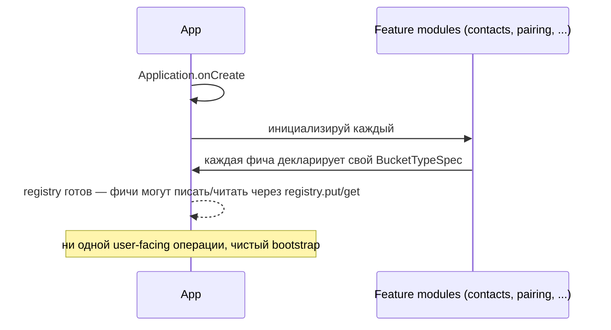
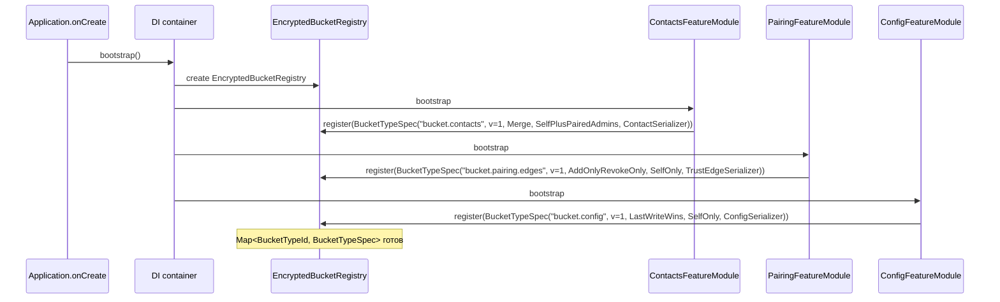
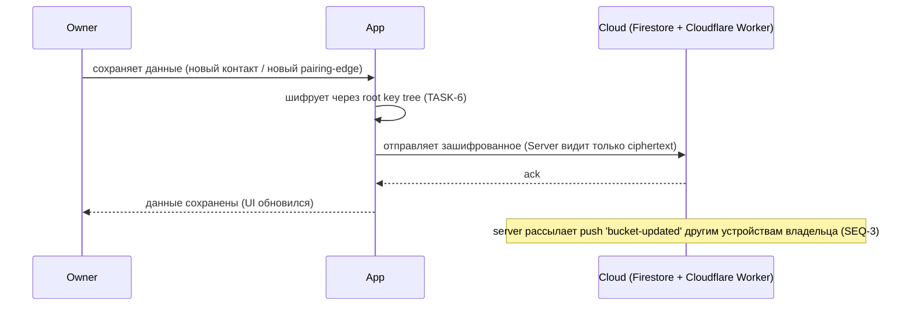
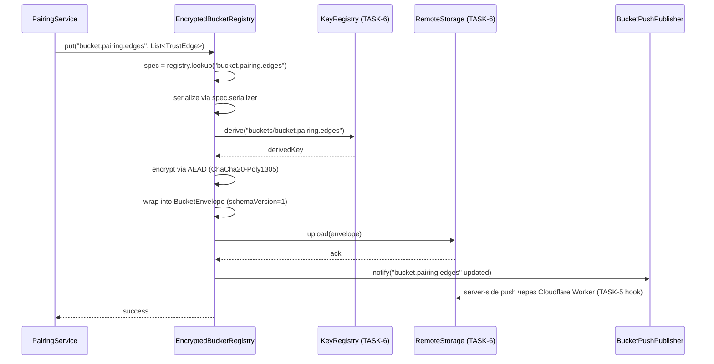
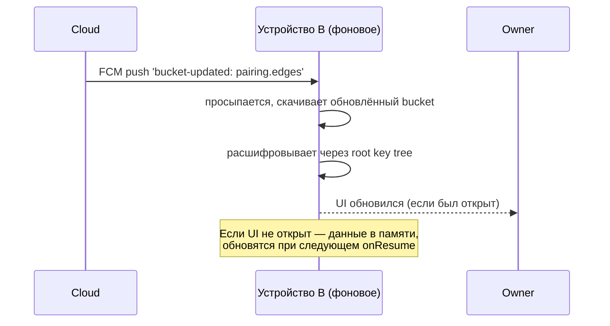
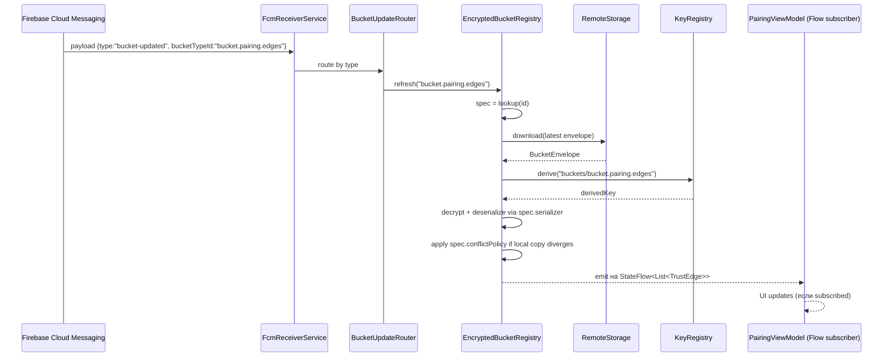
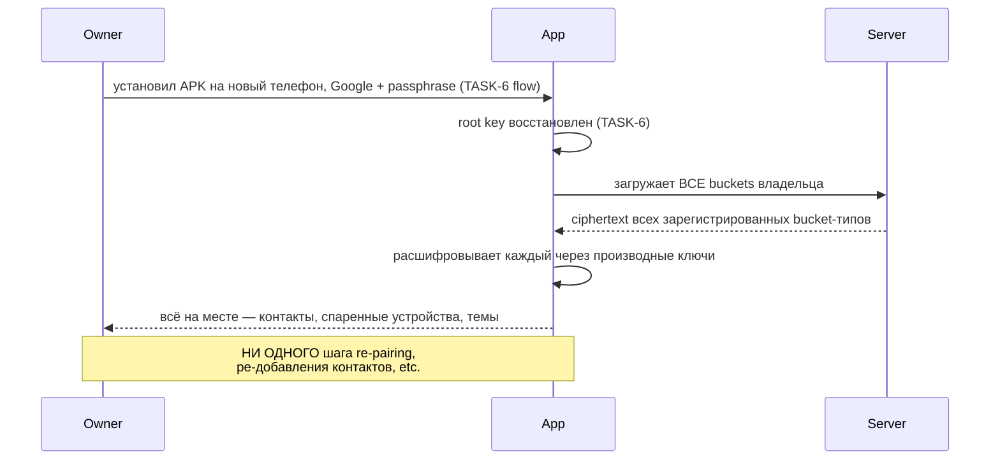
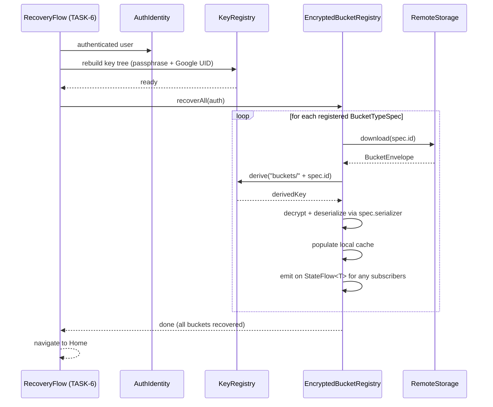
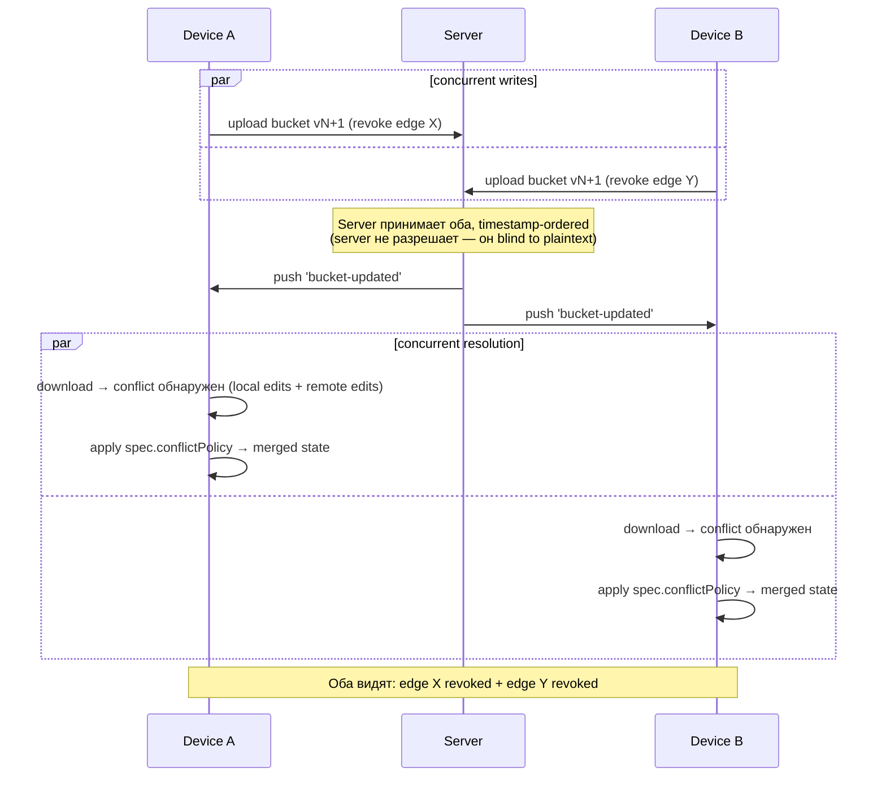

# Feature Specification: TASK-66 — Generic Encrypted Bucket Registry

**Feature Branch**: `task-66-generic-encrypted-bucket-registry`
**Created**: 2026-07-01
**Status**: Draft (pending `/speckit.clarify`)
**Input**: Backlog [TASK-66](../../backlog/tasks/task-66%20-%20Generic-Encrypted-Bucket-Registry.md) — универсальный реестр шифрованных «вёдер данных»; каждая фича декларирует `BucketTypeSpec` → реестр делает encrypt / upload / recover / push routing.

> **Coordination note**: TASK-6 (Root Key Hierarchy + Owner Recovery) в статусе Verification, spec 020 частично в stash. TASK-66 меняет recovery flow (`recoverAll()` через registry вместо per-feature кода) — это либо amendment к spec 020, либо TASK-66 явно поглощает часть TASK-6 deliverables. **Решение — открытый вопрос для `/speckit.clarify`** (см. Clarifications секцию).

## Контекст и цель спека

**Где мы сейчас**. TASK-4 (Own config E2E encryption envelope) — Done. TASK-5 (FCM config-updated push) — Done. TASK-6 (Root Key Hierarchy) — Verification. Сейчас у нас **один** шифрованный bucket в production: `bucket.config`. Логика encrypt → upload → download → decrypt → recovery → push routing **зашита в ConfigCipher2 + ConfigRepository** и специфична для config.

**Проблема**. Каждая следующая фича, требующая шифрования (TASK-9 contacts, TASK-67 pairing edges, TASK-11 photo, TASK-27 messenger threads), либо:
- (а) **дублирует** всю ту же инфру (encrypt / upload / recover / push), — 5 итераций одного кода, каждая с своими багами;
- (б) **паразитирует** на `ConfigCipher2`, размывая его границы (нарушение rule 1 — domain isolation);
- (в) **отдельно** каждая обрастает своим recovery коду в TASK-6 flow — TASK-6 spec 020 становится God-object'ом.

**Что TASK-66 строит**:

1. **`EncryptedBucketRegistry` port** в `core/buckets/` — один реестр на app, `Map<BucketTypeId, BucketTypeSpec>`.
2. **`BucketTypeSpec` data class** — паспорт одного типа bucket'а: `id`, `schemaVersion`, `conflictPolicy`, `recipientPolicy`, `serializer`.
3. **Sealed `ConflictPolicy`**: `LastWriteWins` / `AddOnlyRevokeOnly` / `Merge<T>`.
4. **Sealed `RecipientPolicy`**: `SelfOnly` / `SelfPlusPairedAdmins` / `Custom`.
5. **`BucketEnvelope` wire format** — `schemaVersion=1`, содержит `{bucketTypeId, bucketSchemaVersion, ciphertext, signedBy, timestamp}`.
6. **Recovery hook**: `EncryptedBucketRegistry.recoverAll(auth)` — вызывается из recovery flow (TASK-6) вместо per-feature кода.
7. **Push routing** (`BucketUpdateRouter`) — payload `{type:"bucket-updated", bucketTypeId}` из Cloudflare Worker (TASK-5) роутится в registry, registry скачивает + расшифровывает + emit на `Flow<T>`.
8. **Migration TASK-4 config**: `ConfigCipher2` внутренне переиспользует `EncryptedBucketRegistry` для `bucket.config`. **Ciphertext byte-equal regression test** — существующий config продолжает читаться.
9. **`FakeEncryptedBucketRegistry` + `FakeRemoteStorage`** — для тестов (per rule 6 mock-first).
10. **Fitness test**: dummy `bucket.dummy` через одну декларацию → put → recovery на новом инстансе → данные восстановлены. Один integration test доказывает, что вся foundation generic.
11. **Lint (Detekt)**: `ExtractionReadinessDetector` — `core/buckets/` не импортирует launcher-specific / config-specific / pairing-specific типы.
12. **Wire-format hooks** для будущих расширений: `BucketEnvelope.metadata: Map<String,String> = emptyMap()` для будущих полей без bump schemaVersion.
13. **Документация** `docs/architecture/bucket-registry.md` — простым русским, «как добавить новый bucket» пошагово.

**Что TASK-66 НЕ строит** (намеренно):

- **Не строит конкретные bucket-типы.** Pairing edges — TASK-67. Photo — Phase 4. Messenger threads — Phase 3.
- **Не строит server-side bucket inventory API.** Server остаётся «глупым» — Firestore документы + Cloudflare Worker push relay. TASK-24 (Device Inventory Sync) — Phase 4.
- **Не извлекает foundation в sub-repo.** Extraction trigger — второе family-приложение (messenger / photo). Пока — `core/buckets/` в launcher-репо, `ExtractionReadinessDetector` защищает.
- **Не строит multi-recipient encryption refactor.** S-2 enhancement из TASK-6 notes — отложено. `RecipientPolicy` — enum из трёх вариантов; multi-pair-admin — через `Custom`.
- **Не разрешает конфликты на сервере.** Per E2E invariant — server blind to plaintext. Всё резолвится на клиенте через `spec.conflictPolicy`.
- **Не строит conflict CRDT-level algorithms.** `AddOnlyRevokeOnly` — простой set union; `Merge<T>` — custom callback от фичи (не общий CRDT).
- **Не рефакторит TASK-5 Cloudflare Worker.** Worker получает payload `{type:"bucket-updated", bucketTypeId}` — extension existing routing; не переписываем.

## Clarifications

### 2026-07-01 — Pre-clarify open questions (для `/speckit.clarify`)

Ниже вопросы, которые я вижу как открытые до формального clarify prompt'а. `/speckit.clarify` будет их структурировать и добавлять новые.

| # | Question | Preliminary thinking |
|---|----------|---------------------|
| 1 | **TASK-6 coordination**: TASK-66 меняет recovery flow (registry.recoverAll вместо per-feature). Это amendment к spec 020 (в stash) или TASK-66 явно поглощает TASK-6 recovery deliverables? | Склоняюсь к «TASK-66 owns generic recovery loop; spec 020 amendment ссылается на TASK-66 как источник». Recovery flow остаётся в TASK-6 (Google + passphrase → root key), но loop по bucket'ам — в TASK-66. |
| 2 | **`BucketTypeId` format**: reverse-DNS namespaced (`bucket.pairing.edges`) или UUID? | Reverse-DNS — human-readable, стабильный для migration debug. UUID — collision-proof но нечитаемый. Preliminary — reverse-DNS + validation regex. Extraction в другой app — префикс `bucket.messenger.threads`. |
| 3 | **`schemaVersion` per-envelope vs per-bucket-type**: envelope имеет свой schemaVersion (структура envelope) + bucket-type имеет свой (структура ciphertext'а после decrypt). Оба? | Preliminary — да, оба поля. `envelope.schemaVersion` = 1 (структура envelope), `envelope.bucketSchemaVersion` = version из BucketTypeSpec. Envelope формат может меняться независимо от bucket contents. |
| 4 | **Conflict resolution timing**: при download / при put / on-read? | Preliminary — **при download**. Клиент получил новый envelope, локальная копия diverged → apply policy → save merged, emit на Flow. Put никогда не сталкивается с конфликтом (write-then-eventual-sync модель). |
| 5 | **`RecipientPolicy.Custom`**: как оно описано? Список UID'ов? Callback? | Preliminary — callback `(context) -> List<RecipientKey>` для гибкости. Config `SelfOnly` = fixed list [own device key]; `SelfPlusPairedAdmins` = pull from PairingRegistry (TASK-67). Custom — override когда фича знает лучше. |
| 6 | **Push routing on Doze / killed app**: FcmReceiverService дёргает WorkManager job — job вызывает `registry.refresh(bucketTypeId)`. Что если registry не bootstrap'ed (app cold-start от push)? | Preliminary — WorkManager job делает **partial bootstrap** через DI (только `KeyRegistry` + `RemoteStorage` + `EncryptedBucketRegistry`); фичи регистрируются не lazy — их BucketTypeSpec известен из compile-time регистрации. Requires DI review. |
| 7 | **Migration TASK-4 config**: `ConfigCipher2` заменяется на `EncryptedBucketRegistry` **под капотом** (ConfigRepository API не меняется) или ConfigRepository переписывается на прямое `registry.get("bucket.config")`? | Склоняюсь к варианту 2 (переписывается). Иначе `ConfigCipher2` остаётся как legacy обёртка, приумножая точки правды. Regression test byte-equal ciphertext — критичен. |
| 8 | **`Merge<T>` callback semantics**: `(local: T, remote: T) -> T` или `(local: T, remote: T, base: T?) -> T` (3-way merge)? | Preliminary — 3-way с `base` optional. Registry хранит last-synced version в cache; при конфликте передаёт как base. Без base — fallback на 2-way. |
| 9 | **Атомарность registration**: `register()` вызывается на app start. Что если два модуля регистрируют один `BucketTypeId`? | Preliminary — throw `IllegalStateException` (fail-fast, программистский баг). Не silent overwrite. |
| 10 | **`Flow<T>` cold vs hot**: подписчики получают cached last known + все future updates? | Preliminary — hot `StateFlow<T?>` per bucket. `null` до первого download / recovery; после — последнее известное состояние. UI subscribes и переживает config changes через ViewModel. |

## Sequences

> **Одной строкой:** TASK-66 превращает «каждое ведро шифрованных данных пишет свою инфру encrypt/upload/recover» в «каждое ведро — это паспорт (`BucketTypeSpec`), реестр делает остальное».

### Данные, которыми мы оперируем (mini-map)

```
EncryptedBucketRegistry (один на app — реестр известных типов)
└── Map<BucketTypeId, BucketTypeSpec>
    ├── "bucket.config"           ← TASK-4 (после миграции)
    ├── "bucket.contacts"         ← TASK-9 (будущее)
    ├── "bucket.pairing.edges"    ← TASK-67 (следующее)
    └── "bucket.dummy"            ← test fitness

BucketTypeSpec — паспорт одного типа bucket'а:
├── id: "bucket.pairing.edges"   (immutable wire-format identifier, rule 5)
├── schemaVersion: 1
├── conflictPolicy: AddOnlyRevokeOnly  (sealed: LastWriteWins | AddOnlyRevokeOnly | Merge<T>)
├── recipientPolicy: SelfOnly          (sealed: SelfOnly | SelfPlusPairedAdmins | Custom)
└── serializer: KSerializer<List<TrustEdge>>

BucketEnvelope — wire format на проводе (rule 5):
└── { schemaVersion=1, bucketTypeId, bucketSchemaVersion, ciphertext, signedBy, timestamp, metadata }
```

Каждая фича декларирует паспорт → реестр делает: serialize → encrypt via KeyRegistry → upload via RemoteStorage → receive push → decrypt → notify subscribers → recover on new device.

### Cross-app vision (важно)

`EncryptedBucketRegistry` будет переиспользован за пределами лаунчера. Messenger зарегистрирует `bucket.messenger.threads`. Photo app — `bucket.photo.albums`. Foundation **не знает** ни про contacts, ни про pairing, ни про threads — она работает с любым типом, который декларирует BucketTypeSpec. Та же extraction-readiness дисциплина что в TASK-65: `ExtractionReadinessDetector` не пускает launcher-specific imports в `core/buckets/`. Когда придёт messenger — `git mv`, не rewrite.

### SEQ-1: Регистрация bucket-типов на старте app

Pre: APK запускается. Post: registry знает обо всех типах, которые понадобятся фичам.

#### Spec-level (behavior)



#### Plan-level (architecture)



<!-- MENTOR-DETAIL:BEGIN -->
#### Пояснение для владельца
- **«Паспорт» — это BucketTypeSpec.** Фича говорит реестру: «у меня bucket с таким id, такой schema, такой policy, такой serializer». Registry запоминает.
- **Registration — один раз на app start.** Не runtime: bucket-типы не появляются и не исчезают между запусками. Если изменится policy для уже зарегистрированного — это **миграция**, а не просто перерегистрация.
- **Конкретные фичи (contacts/pairing/config) не зависят друг от друга.** Каждая регистрирует свой паспорт независимо. Когда добавится `messenger.threads` — никаких правок в существующих фичах.
- **Fail-fast:** если два модуля регистрируют один id — throw. Это программистская ошибка.
- **Cross-app:** в messenger та же сцена, только spec'и другие. Тот же `EncryptedBucketRegistry` код, тот же DI bootstrap.
<!-- MENTOR-DETAIL:END -->

### SEQ-2: Запись данных (put) — encrypt и upload

Pre: registry знает про bucket-тип (SEQ-1). Owner на устройстве A сохраняет что-то (новый контакт / новый pairing-edge).

#### Spec-level (behavior)



#### Plan-level (architecture)



<!-- MENTOR-DETAIL:BEGIN -->
#### Пояснение для владельца
- **Фича не знает про шифрование.** PairingService просто говорит «положи мне эти данные в bucket pairing-edges». Registry сама шифрует через KeyRegistry.
- **`KeyRegistry.derive("buckets/<id>")`** — каждый bucket получает свой sub-ключ из root key. Если один bucket скомпрометирован — другие не страдают (изоляция в дереве).
- **`BucketEnvelope`** — wire format, едет на сервер. Server **видит только ciphertext + metadata** (bucketTypeId, timestamp). Не видит содержимое.
- **Push через Cloudflare Worker (TASK-5):** после успешного upload registry дёргает worker `/notify` с `{type:"bucket-updated", bucketTypeId}`. Worker рассылает FCM на все устройства владельца.
- **Этот же путь** для contacts, config, pairing, и любого future bucket-типа. **Один и тот же код**, разные паспорта.
<!-- MENTOR-DETAIL:END -->

### SEQ-3: Приём обновления (push) — другое устройство владельца

Pre: устройство A записало bucket (SEQ-2). Устройство B (тот же владелец, тот же Google UID) спит в Doze. Post: B автоматически имеет последнюю версию.

#### Spec-level (behavior)



#### Plan-level (architecture)



<!-- MENTOR-DETAIL:BEGIN -->
#### Пояснение для владельца
- **Routing по bucketTypeId** — registry знает, какая фича подписана на bucket. Push payload содержит **только id** (не содержимое).
- **`StateFlow<T?>` подписчики** — каждая фича получает свой реактивный поток. ViewModel жив (UI открыт) → мгновенно обновляется. Убит → данные в локальной cache, обновятся на `onResume`.
- **Conflict policy применяется здесь.** Если локальная копия что-то писала пока push шёл — registry мерджит по policy. Подробно — SEQ-5.
- **Boot-инвариант (как в TASK-65):** push приёмник работает в Background WorkManager job — **не требует Activity**. Приложение убито OS — push всё равно скачается и обновит cache.
- **Cross-app:** messenger получит push для своих bucket'ов через тот же `BucketUpdateRouter`. Routing полностью generic.
<!-- MENTOR-DETAIL:END -->

### SEQ-4: Recovery на новом устройстве — главная фишка

Pre: устройство A потеряно. Owner купил новый телефон B. Прошёл TASK-6 recovery flow (Google + passphrase). Root key восстановлен. Post: ВСЕ зарегистрированные buckets автоматически восстановлены — contacts, pairing-edges, config, темы — без отдельного recovery кода для каждого.

#### Spec-level (behavior)



#### Plan-level (architecture)



<!-- MENTOR-DETAIL:BEGIN -->
#### Пояснение для владельца
- **Это killer feature TASK-66.** До этой задачи каждый bucket нуждался в собственном recovery коде в TASK-6 flow. После — ноль. Зарегистрировал паспорт → recovery работает.
- **Loop по spec'ам** — registry просто проходит по своему Map'у. Не знает что внутри. Decryption + deserialization — generic, через KSerializer из спецификации.
- **Это значит** что TASK-9 (contacts), TASK-67 (pairing), будущие TASK-11 (photo), TASK-27 (messenger) — **не пишут recovery код**. Только декларируют BucketTypeSpec + UI.
- **Координация с TASK-6 spec 020.** Сейчас spec 020 (в stash) предполагает recovery конкретных buckets (config + contacts mentioned explicitly). TASK-66 spec ДОЛЖЕН включать amendment к spec 020: «recovery flow дёргает `EncryptedBucketRegistry.recoverAll()` вместо per-feature кода». Это первый agenda item в `/speckit.clarify` TASK-66.
<!-- MENTOR-DETAIL:END -->

### SEQ-5: Разрешение конфликтов (compact)

Pre: два устройства A и B одновременно пишут в один bucket (например, оба отзывают разные pairing-edges). Post: оба видят согласованное состояние.



**Три conflict policy (sealed):**

| Policy | Поведение | Применение |
|---|---|---|
| **`LastWriteWins`** | Берётся версия с большим timestamp'ом | `bucket.config` (одна правда от владельца, последний выигрывает) |
| **`AddOnlyRevokeOnly`** | Множество элементов с операциями add/revoke. Union add'ов, union revoke'ов | `bucket.pairing.edges` (никто не «удаляет» edge молча, только revoke) |
| **`Merge<T>`** | Пользовательская merge function (передаётся в BucketTypeSpec) | `bucket.contacts` (smart merge по contact id) |

<!-- MENTOR-DETAIL:BEGIN -->
#### Пояснение для владельца
- **Конфликт = когда два устройства пишут в один bucket почти одновременно.** Без policy одно перетрёт другое.
- **Policy выбирается при регистрации.** PairingService регистрирует `AddOnlyRevokeOnly` потому что revoke edge должен быть видим обоим. ConfigService — `LastWriteWins` потому что config — одна правда.
- **Server (Cloudflare Worker + Firestore) не разрешает конфликты сам.** Server принимает оба upload'а timestamp-ordered, рассылает оба push'а. **Разрешение — на клиенте**, через policy. Это **client-side resolution** — не нарушает invariant «server видит только ciphertext».
- **`Merge<T>` — one-way door:** если решим что contacts merge нужно server-side (для очень больших buckets) — это потребует server-side decryption, что нарушает E2E encryption. Exit ramp — не использовать Merge для больших buckets; ограничивать размер.
<!-- MENTOR-DETAIL:END -->

## User Scenarios & Testing *(mandatory)*

> **Про роли.** TASK-66 — чисто архитектурная инфраструктура. **`primary user`** и **`remote administrator`** ничего user-visible не видят от этой задачи напрямую. Killer feature (SEQ-4 recovery) видима косвенно — при recovery на новом устройстве всё восстанавливается «само», без прогресс-бара «восстанавливаю контакты… восстанавливаю pairing…». **Единственный видимый user-facing артефакт** — регрессия: если что-то сломалось в config encryption (byte-equal test failed), primary user увидит потерю доступа к своему config'у. Отсюда критичность regression'а.

### User Story 1 — Regression: existing config продолжает работать (Priority: P0)

Owner-primary user на устройстве A, у которого уже есть зашифрованный config (TASK-4). После обновления APK на версию с TASK-66 → open app → config читается идентично, ciphertext byte-equal, ключи не перегенерированы.

**Why P0**: если это ломается, TASK-66 нельзя выкатывать вообще. Это единственный gate до merge.

**Independent Test**: instrumentation test на `pixel_5_api_34` — (1) поставить APK pre-TASK-66, создать config, обновить passphrase, снять snapshot ciphertext'а из Firestore; (2) upgrade APK до post-TASK-66; (3) verify ciphertext идентичен байт-в-байт; (4) app читает config без re-auth / recovery.

**Acceptance Scenarios**:
1. **Given** установлен APK pre-TASK-66 с настроенным config, **When** upgrade до post-TASK-66, **Then** ciphertext в Firestore не изменился ни одним байтом.
2. **Given** APK post-TASK-66 запущен, **When** ConfigRepository читает config, **Then** decrypt проходит первым же вызовом (не через fallback path).
3. **Given** APK post-TASK-66, **When** ConfigRepository пишет config, **Then** новый ciphertext совместим с pre-TASK-66 форматом (можно откатить APK).

### User Story 2 — Fitness: новый bucket добавляется через одну декларацию (Priority: P1)

Разработчик хочет добавить новый bucket `bucket.dummy` для тестового hello-world сценария. Пишет **одну** декларацию `BucketTypeSpec("bucket.dummy", 1, LastWriteWins, SelfOnly, DummySerializer)` + регистрирует в DI. **Ничего другого**: не пишет encrypt, не пишет upload, не пишет download, не пишет recovery, не пишет push handling.

**Why P1**: доказывает что foundation действительно generic. Fitness test защищает от регрессии (например, если кто-то добавит special-case ветку `if (bucketId == "config")`).

**Independent Test**: unit + integration test — (1) регистрируется `bucket.dummy`; (2) `registry.put("bucket.dummy", DummyData("hello"))`; (3) на другом инстансе registry (симулируя новое устройство) `registry.recoverAll(auth)`; (4) `registry.get("bucket.dummy")` возвращает `DummyData("hello")`.

**Acceptance Scenarios**:
1. **Given** `BucketTypeSpec("bucket.dummy", ...)` зарегистрирован, **When** put → recoverAll на другом инстансе → get, **Then** данные восстановлены.
2. **Given** dummy bucket добавлен в git, **When** grep по кодовой базе на `"bucket.dummy"`, **Then** результат = только (а) декларация spec + (б) DI регистрация + (в) тесты. **Нет** отдельных путей для encrypt/upload/recover/push.

### User Story 3 — Recovery на новом устройстве восстанавливает всё (Priority: P1)

Owner потерял устройство A. На новом устройстве B: ставит APK → Sign-In Google → passphrase → **автоматически** восстановлены (а) config, (б) `bucket.dummy` (если был), (в) любой другой зарегистрированный bucket. **Ни одного отдельного шага** «восстанавливаю X, восстанавливаю Y».

**Why P1**: killer feature (SEQ-4). Регрессия здесь = TASK-66 не решила проблему за которую бралась.

**Independent Test**: instrumentation test — (1) устройство A: register `bucket.dummy`, put data, verify uploaded; (2) устройство B (fresh install): recovery flow → recoverAll → verify `registry.get("bucket.dummy")` возвращает те же данные + verify config тоже восстановлен, одним loop'ом.

**Acceptance Scenarios**:
1. **Given** N зарегистрированных buckets на устройстве A с данными, **When** recovery на устройстве B, **Then** все N buckets восстановлены за один `recoverAll()` вызов.
2. **Given** новый bucket добавлен в codebase (fitness scenario US2), **When** recovery, **Then** он тоже восстанавливается автоматически (без правки recovery flow).

### User Story 4 — Push routing обновляет только нужный bucket (Priority: P2)

Owner на устройстве A изменил `bucket.pairing.edges`. На устройстве B через FCM приходит push `{type:"bucket-updated", bucketTypeId:"bucket.pairing.edges"}`. Registry на B скачивает **только этот bucket** (не все), декодирует, emit на StateFlow. Подписчики (PairingViewModel) обновляются. **Config не перечитывается зря.**

**Why P2**: производительность и корректность routing'а. Регрессия видна только под нагрузкой (много buckets → каждый push тригерил бы N downloads).

**Independent Test**: unit test с FakeRemoteStorage — (1) register 3 buckets; (2) simulate push для одного; (3) verify FakeRemoteStorage.download был вызван **ровно один раз с правильным id**.

**Acceptance Scenarios**:
1. **Given** зарегистрированы 3 buckets, **When** push с одним bucketTypeId, **Then** download вызван 1 раз с этим id.
2. **Given** push с неизвестным bucketTypeId, **When** BucketUpdateRouter обрабатывает, **Then** logged warning, no crash, no download.

### User Story 5 — Conflict resolution `AddOnlyRevokeOnly` (Priority: P2)

Устройства A и B у одного owner'а. A: add edge X. B (offline, не знает про X): revoke edge Y. Обе изменения долетели до сервера. При download на обеих сторонах → merge через `AddOnlyRevokeOnly` → **обе видят** {added: [X], revoked: [Y]}.

**Why P2**: доказательство что conflict policy работает end-to-end. TASK-67 будет строить на этом.

**Independent Test**: unit test — (1) local bucket state = {added:[A], revoked:[]}; (2) remote bucket state = {added:[], revoked:[B]}; (3) apply AddOnlyRevokeOnly.merge; (4) verify result = {added:[A], revoked:[B]}.

**Acceptance Scenarios**:
1. **Given** local + remote diverged на bucket с policy AddOnlyRevokeOnly, **When** merge, **Then** union add'ов + union revoke'ов.
2. **Given** конфликт add vs revoke одного элемента, **When** merge, **Then** revoke побеждает (revoke terminal).

## Success Criteria *(mandatory — с маркерами [backlog] / [tech])*

- [backlog] **SC-1**: Existing config encryption продолжает работать — ciphertext byte-equal до и после миграции на BucketRegistry.
- [backlog] **SC-2**: Recovery на новом устройстве → ВСЕ зарегистрированные buckets автоматически восстанавливаются (включая тестовый dummy).
- [backlog] **SC-3**: Новый bucket добавляется через ОДНУ декларацию `BucketTypeSpec` — никакого нового encrypt/upload/recover кода.
- [backlog] **SC-4**: Push notification `bucket-updated` с bucketTypeId обновляет ТОЛЬКО нужный bucket.
- [backlog] **SC-5**: ConflictPolicy `AddOnlyRevokeOnly` работает: add → revoke → итоговый state = union add + union revoke.
- [backlog] **SC-6**: Документация `bucket-registry.md` написана простым русским — non-developer владелец может прочитать и понять как добавить новый bucket.
- [tech] **SC-7**: `BucketEnvelope` roundtrip test (write → read → assert equal) passes.
- [tech] **SC-8**: `BucketEnvelope` backward-compat test — envelope с `metadata={}` читается корректно после добавления полей в metadata (schema hook).
- [tech] **SC-9**: Fitness `ExtractionReadinessDetector` — `core/buckets/` не импортирует launcher-specific / config-specific / pairing-specific типы. Detekt fails если нарушено.
- [tech] **SC-10**: Migration test — pre-TASK-66 ciphertext идентичен post-TASK-66 ciphertext (byte-equal) на identical input.
- [tech] **SC-11**: Duplicate registration throws `IllegalStateException` (fail-fast test).
- [tech] **SC-12**: FakeEncryptedBucketRegistry + FakeRemoteStorage существуют и покрывают все US сценарии unit test'ами.

## Dependencies

- **TASK-6** (Root Key Hierarchy) — Verification. `KeyRegistry` port уже в коде. `RemoteStorage` port уже в коде. Recovery flow shape зафиксирован. **Координация**: TASK-66 добавляет `recoverAll()` API + spec 020 amendment (см. Clarification #1).
- **TASK-4** (Own config E2E encryption envelope) — Done. `ConfigCipher2` рефакторится через `EncryptedBucketRegistry`. Byte-equal regression обязателен.
- **TASK-5** (FCM config-updated push) — Done. Payload расширяется на generic `bucket-updated` (backward-compat: existing `config-updated` — специальный case = `{type:"bucket-updated", bucketTypeId:"bucket.config"}` OR keep old payload as legacy). Уточнение в `/speckit.clarify`.
- **TASK-65** (Profile Composition Foundation v2) — Verification. Никак не пересекается content-wise, но задаёт extraction-readiness patterns (`ExtractionReadinessDetector`), которые TASK-66 наследует.

## Constitution Gates (preliminary, полный check — в plan.md)

- **Rule 1 (domain isolation)**: `EncryptedBucketRegistry` port в `core/buckets/`, adapter не утекает. `BucketTypeSpec` — pure data.
- **Rule 2 (ACL)**: Firestore / Cloudflare Worker не вытекают в domain. `RemoteStorage` port + FirestoreRemoteStorage adapter (existing).
- **Rule 3 (one-way door)**: `BucketEnvelope` wire format — фиксируется навсегда после первого writer'а. Exit ramp — `schemaVersion` bump + versioned migration. `BucketTypeId` reverse-DNS namespace — тоже one-way (renaming = migration).
- **Rule 4 (MVA)**: single-implementation `EncryptedBucketRegistry` port оправдан — есть 2 реализации (Real + Fake), extraction в другой app (2-й потребитель за 1-2 квартала) — гарантирован по roadmap'у.
- **Rule 5 (wire format)**: `BucketEnvelope.schemaVersion=1` + `bucketSchemaVersion` per-type + `metadata: Map<String,String>` hook + roundtrip test + backward-compat test.
- **Rule 6 (mock-first)**: `FakeEncryptedBucketRegistry` + `FakeRemoteStorage` обязательны, DI swap.
- **Rule 7 (fitness functions)**: `ExtractionReadinessDetector` (Detekt) + fitness test dummy bucket.
- **Rule 8 (server migration tracking)**: `docs/dev/server-roadmap.md` amendment — «Bucket routing через Worker остаётся на бесплатном tier'е; own-server bucket API добавляется когда N buckets × M users > Worker limits».

## Effort

Large (~2-3 weeks). Координация с TASK-6 spec 020 amendment добавляет ~2-3 дня на само согласование + risk что spec 020 stash'нутый требует восстановления.

## Local Test Path

- Unit tests с `FakeEncryptedBucketRegistry` + `FakeRemoteStorage` — round-trip всех bucket types.
- Integration test на emulator `pixel_5_api_34` — recovery flow восстанавливает 2+ buckets.
- Migration test: spec 018 ciphertext → spec X ciphertext byte-equal (P0 gate).
- Fitness test: `bucket.dummy` full lifecycle (register → put → new instance → recoverAll → get) — proof of generic-ness.
- Detekt run: `ExtractionReadinessDetector` catches launcher-specific import в core/buckets/ во время rule test.
